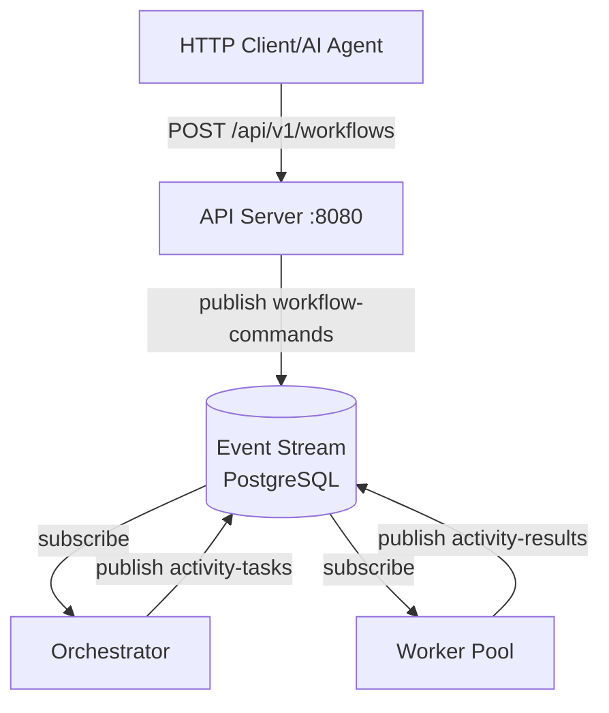
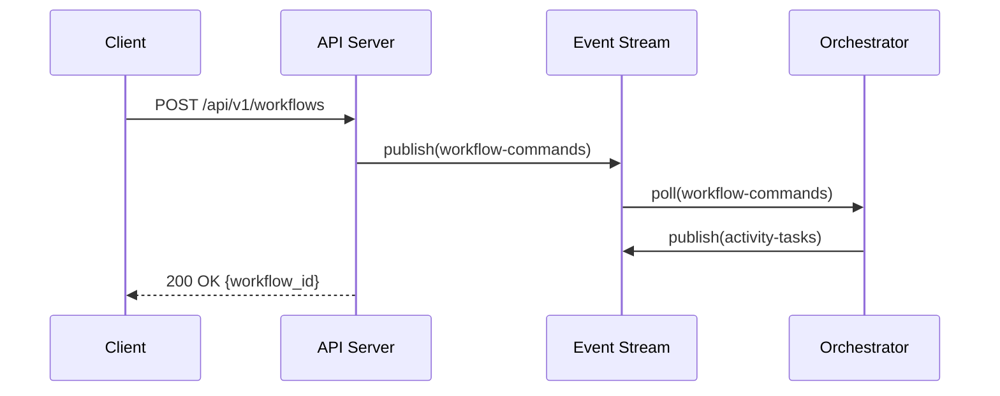

# Kruxia Flow Development Guidelines for Claude

This document contains guidelines and best practices for AI assistants (Claude) working on the Kruxia Flow codebase.

## Documentation Standards

### Mermaid Diagrams

- **Use Mermaid for all diagrams in markdown files**: Kruxia Flow uses Mermaid.js for code-based diagramming
- **GitHub native support**: Mermaid diagrams render automatically in GitHub markdown
- **mdBook support**: Configured via `mdbook-mermaid` preprocessor
- **Syntax**: Use fenced code blocks with `mermaid` language identifier
- **Diagram types available**:
  - `flowchart` / `graph`: Architecture diagrams, process flows, component relationships
  - `sequenceDiagram`: API interactions, event flows, message passing
  - `stateDiagram-v2`: Workflow states, lifecycle management
  - `erDiagram`: Database schemas, entity relationships
  - `gantt`: Project timelines, phase planning
  - `gitGraph`: Branch strategies, release workflows
  - `C4Context`: System context diagrams (C4 architecture)

**Example architecture diagram**:
````markdown

````

**Example sequence diagram**:
````markdown

````

**Best practices**:
- Use descriptive node labels
- Add comments to explain complex relationships
- Keep diagrams focused on one concern
- Use subgraphs for logical grouping
- Prefer `flowchart` over legacy `graph` syntax
- Test diagrams render correctly in both GitHub and mdBook

**List formatting in node labels**:
- **NEVER use markdown list syntax** (`1.`, `2.`, `-`, `*`) - Mermaid interprets these as markdown and shows "Unsupported markdown: list" errors
- **For numbered items**: Use format `1)`, `2)`, `3)` or `1:`, `2:`, `3:` (with colon, not period)
- **For bullet points**: Use `<br/>•` for line breaks with bullet character
- **Example**:
  ```mermaid
  flowchart TB
      Step1["1: Validate Input<br/>• Check format<br/>• Verify data<br/>• Max 2 retries"]
      Step2["2: Process Data<br/>• Transform<br/>• Validate<br/>• Max 3 retries"]
  ```

## Architecture Guidelines

### Workflow Definition Language

- Workflows are defined as **Directed Graphs** where nodes are activities and edges are defined by dependency relationships
- **Never use "edges" terminology** in workflow definitions - always use `depends_on` and `dependency_of`
- Activities can specify:
  - `depends_on: [list of activities that must complete before this one]` (fan-in)
  - `dependency_of: [list of activities that depend on this one]` (fan-out)
  - Conditions on these relationships
- **Normalization**: Internally, workflows are normalized to use only `depends_on` for simplicity
  - User-facing YAML/JSON supports both `depends_on` and `dependency_of`
  - After parsing, `dependency_of` relationships are converted to `depends_on` on the target activities
  - All orchestration logic uses the normalized `depends_on` representation

### Service Interface Pattern

All external infrastructure dependencies are wrapped in service interfaces:

1. **AuthenticationService**: JWT token issuance and validation (PostgresAuthService)
2. **ActivityQueue**: Activity scheduling and worker polling (PostgresQueue)
3. **EventSource**: Workflow event publish/subscribe (PostgresEventSource with polling)
4. **WorkflowStorage**: Artifact/large file storage (PostgresStorage using Large Objects)

**MVP Implementation**: All interfaces use PostgreSQL
- **EventSource uses polling** (not LISTEN/NOTIFY) with adaptive backoff (10ms-5s)
  - **Critical**: LISTEN/NOTIFY cannot guarantee event delivery - polling ensures no missed events
  - Workflow orchestration requires guaranteed delivery (missed events = hung workflows)
  - Only polling and logical replication provide delivery guarantees
- **Auth uses custom JWT provider** (not external IdP like Auth0/Okta)
- **ActivityQueue uses PostgreSQL** with FOR UPDATE SKIP LOCKED for safe concurrency

**Post-MVP Options**:
- AuthenticationService → Auth0, Okta
- ActivityQueue → AWS SQS, RabbitMQ, Redis (for >50k activities/sec or managed service)
- EventSource → Kafka/Redpanda/WarpStream (>100k events/sec), NATS JetStream (<1ms latency), Logical Replication
- WorkflowStorage → S3-compatible storage, Filesystem

**Never Use**:
- ❌ LISTEN/NOTIFY for workflow events - no delivery guarantees, events can be lost

### Configuration

- **Environment variables and CLI parameters only** - no .env files, TOML, or config files
- CLI parameters take precedence over environment variables
- All services configurable via `KRUXIAFLOW_*` environment variables

### Optimization Scope

- **MVP focus**: Standard event-driven DAG evaluation, ~1ms orchestration latency
- **Do not discuss**: Compiled workflow optimizations (post-MVP feature)
- **Target performance**: >1,000 workflows/sec via PostgreSQL query optimization

## Code Standards

### Database

- Use sqlx for all database access
- Leverage compile-time query validation
- Store most queries as PostgreSQL stored procedures
- Use prepared statements for hot paths
- Aggressive vacuuming of completed activities

### Async Rust

- Use Tokio as async runtime
- Axum for HTTP/WebSocket server
- All I/O should be async
- Services should be stateless where possible

### Error Handling

- Return `Result<T>` for all fallible operations
- Use custom error types with context
- Never panic in production code paths

## Documentation

- Keep docs in `docs/` directory
- Use Mermaid for all diagrams
- Update architecture.md when making architectural changes
- Document service interfaces clearly
- When creating implementation plans (in docs/implementation), don't write a first draft of the code; instead, describe what has to be built in terms of the requirements and the architecture.
- When implementing code, always refer to docs/architecture.md in addition to the specific requirements of the current implementation. Update any corresponding docs/implementation document with information about what has been implemented and the completion status of each part of the plan.
- When implementing code, do not implement tests unless and until asked to.
- When we decide to postpone an epic/feature/story to post-MVP, update docs/post-mvp.md to include it.
- align markdown tables