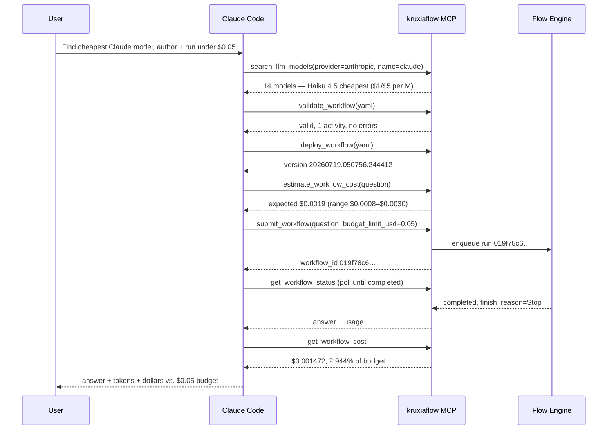

# MCP Demo Session — Budget-Capped Q&A Workflow

**Date:** 2026-07-19 05:07–05:12 UTC
**Interface:** Claude Code, using the `kruxiaflow` MCP server tools
**Goal:** Find the cheapest Claude model, author and deploy a workflow that answers a
question with it, estimate the cost, then run it with the question *"why cap agent
spend?"* under a hard budget of 5 cents — watching to completion and reporting the
actual spend against that budget.

---

## Task

> Using the kruxiaflow tools: find the cheapest Claude model available, then author and
> deploy a workflow that answers a question with it. Before running it, estimate the
> cost. Then submit it with the question "why cap agent spend?" and a hard budget of 5
> cents, watch it to completion, and show me the answer plus exactly what it cost —
> tokens and dollars — against that budget.

---

## Flow



---

## Step 1 — Find the cheapest Claude model

Queried the live model catalog (`search_llm_models`, filtered to
`provider=anthropic`, `name=claude`). 14 models returned. Ranked by input price:

| Model             | Input $/M | Output $/M | Context |
| ----------------- | --------- | ---------- | ------- |
| **claude-haiku-4-5** | **1.00**  | **5.00**   | 200K    |
| claude-sonnet-5   | 2.00      | 10.00      | 1M      |
| claude-sonnet-4-5 | 3.00      | 15.00      | 200K    |
| claude-opus-4-5   | 5.00      | 25.00      | 200K    |
| claude-opus-4-8   | 5.00      | 25.00      | 1M      |
| claude-fable-5    | 10.00     | 50.00      | 1M      |
| claude-opus-4-1   | 15.00     | 75.00      | 200K    |

**Winner:** `claude-haiku-4-5` — the lowest input price of all 14 Anthropic models.

---

## Step 2 — Author, validate, and deploy the workflow

A single-activity `llm_prompt` workflow that answers `{{INPUT.question}}` on Haiku,
capped at 600 output tokens, with a per-activity budget guard as belt-and-suspenders.

```yaml
name: answer-question-haiku
activities:
  - key: answer
    worker: std
    activity_name: llm_prompt
    parameters:
      model: anthropic/claude-haiku-4-5
      system: You are a concise, accurate assistant. Answer the user's question directly and completely.
      prompt: "{{INPUT.question}}"
      max_tokens: 600
    settings:
      timeout: 60
      retry:
        max_attempts: 2
      budget:
        limit: 0.05
        action: abort
```

- **`validate_workflow`** → `valid: true`, 1 activity, no errors, no warnings.
- **`check_system_health`** → `status: ready` (database, activity_queue, event_source all `ok`).
- **`deploy_workflow`** → new version **`20260719.050756.244412`** (`is_new: true`).

---

## Step 3 — Estimate the cost (before running)

`estimate_workflow_cost` with `input_sample = {"question": "why cap agent spend?"}`:

| Metric              | Value      |
| ------------------- | ---------- |
| Expected            | $0.001881  |
| Range (min)         | $0.000756  |
| Range (max)         | $0.003006  |
| Hard budget         | $0.05      |

Worst case (~$0.003) is ~6% of the 5-cent cap. Assumptions noted by the estimator:
Anthropic heuristic of 3.5 chars/token; min assumes 25% of `max_tokens`, max assumes
100%; retries/fallbacks not included.

---

## Step 4 — Submit with a hard 5-cent budget

`submit_workflow` with `budget_limit_usd = 0.05`:

```json
{
  "workflow_id": "019f78c6-3bdc-7653-bd05-4939a5d3df7e",
  "definition_version": "20260719.050756.244412",
  "budget_limit_usd": 0.05,
  "status": "created",
  "submitted_at": "2026-07-19T05:08:05.211154+00:00"
}
```

---

## Step 5 — Watch to completion

Polled `get_workflow_status`:

- **05:08:05** — `running`, activity `answer` `pending`.
- **05:08:10** — `completed`. Activity finished on attempt 1, `finish_reason: Stop`
  (the budget never had to intervene). End-to-end ~5 seconds.

Reported usage: **12 prompt tokens + 292 output tokens = 304 total**, model
`claude-haiku-4-5`.

---

## Step 6 — The answer

> ### Why Cap Agent Spend?
>
> **Cost Control** — Prevents runaway expenses from inefficient agents; sets
> predictable budgets; avoids unexpected overruns.
>
> **Resource Management** — Limits API calls/tokens/compute; prevents resource
> exhaustion from buggy or looping agents; ensures fair allocation across agents.
>
> **Safety & Testing** — Protects during dev/testing; catches problematic behavior
> before full deployment; reduces risk of expensive mistakes.
>
> **Business Model** — Manages profitability (especially pay-per-use); aligns costs
> with pricing/revenue; protects margins.
>
> **Quality Assurance** — Forces optimization of agent efficiency; encourages better
> prompting and design; incentivizes solving problems with fewer resources.
>
> **Common Implementation** — Daily/monthly spending limits, per-request token
> budgets, API rate limiting, resource quotas.

---

## Step 7 — Actual cost vs. budget

From `get_workflow_cost`:

| Metric              | Value            |
| ------------------- | ---------------- |
| Model / provider    | claude-haiku-4-5 / anthropic |
| Prompt tokens       | 12               |
| Output tokens       | 292              |
| Total tokens        | 304              |
| **Actual spend**    | **$0.001472**    |
| Hard budget         | $0.05            |
| **Budget used**     | **2.944%**       |
| Remaining           | $0.048528        |

### Estimate vs. actual

| | Dollars |
| --- | --- |
| Estimated (expected) | $0.001881 |
| Estimated (max)      | $0.003006 |
| **Actual**           | **$0.001472** |

Actual came in below even the expected estimate, and used under 3% of the cap. The run
is itself a live example of the answer's final point — a per-request token budget plus a
hard spend cap — enforced end-to-end by the engine.
