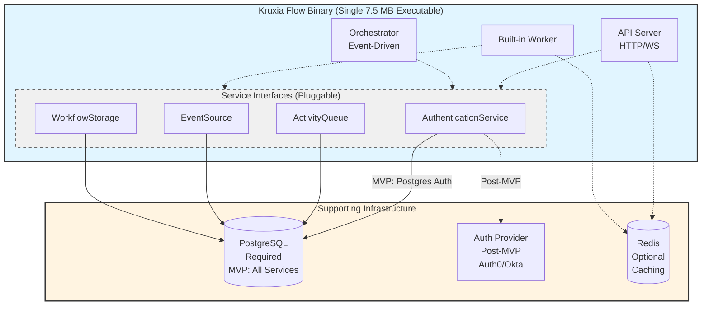
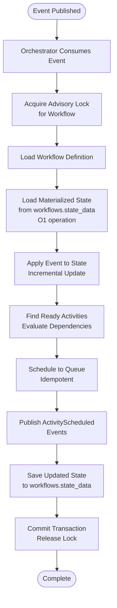
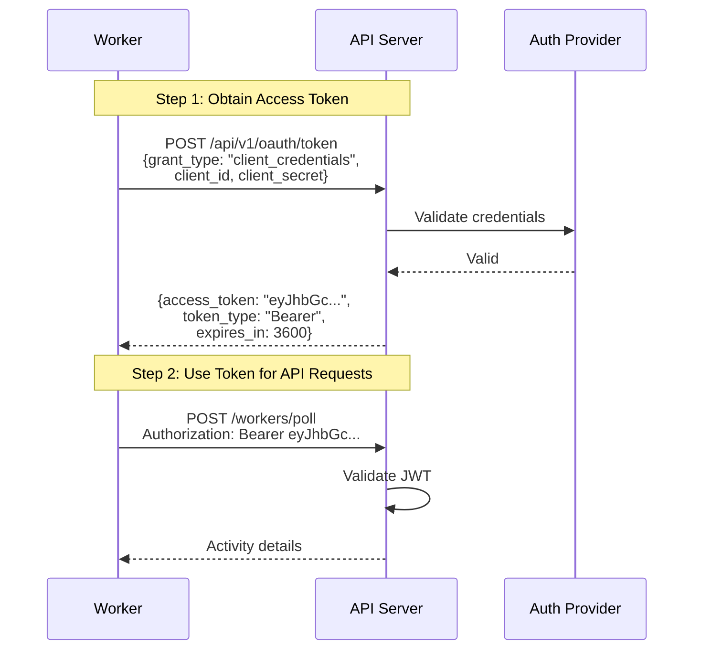
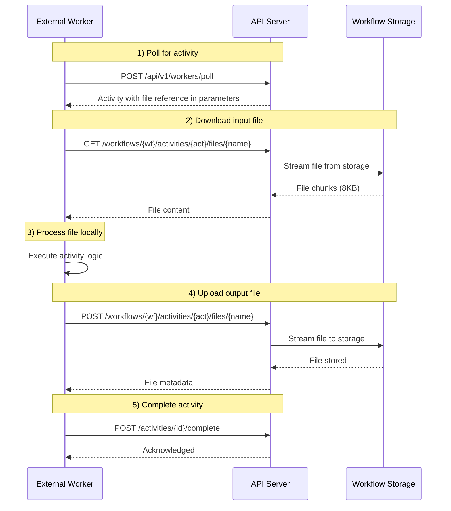
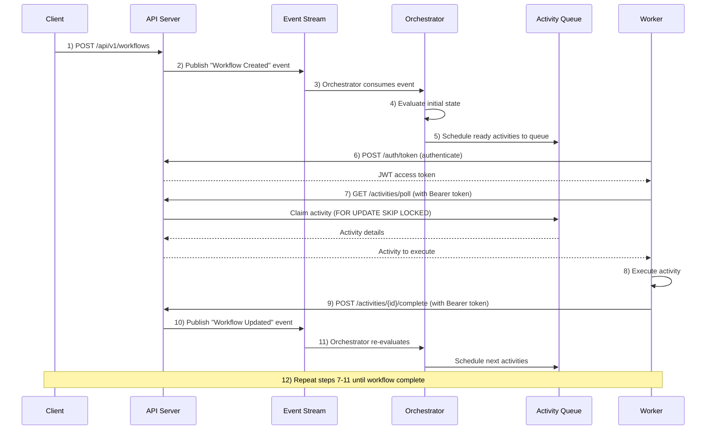

# Kruxia Flow Architecture

**Version**: 0.3 MVP
**Last Updated**: 2025-11-27

---

## Table of Contents

1. [System Overview](#system-overview)
2. [Core Components](#core-components)
3. [Data Architecture](#data-architecture)
4. [Execution Model](#execution-model)
5. [Service Interfaces](#service-interfaces)
6. [Deployment Architecture](#deployment-architecture)
7. [Technology Stack](#technology-stack)
8. [Performance Targets](#performance-targets)

---

## System Overview

Kruxia Flow is a lightweight, high-performance workflow orchestration platform designed for edge-to-cloud deployment. The system is built as a single binary that includes three independently launchable services: API server, workflow orchestrator, and built-in activity worker.

### Core Value Proposition

- **Single Binary**: Complete orchestration stack in one 7.5 MB executable
- **PostgreSQL-First**: All persistence (queues, events, state) using PostgreSQL 17+
- **High Performance**: 93 wf/sec benchmarked (target >100 wf/sec with query optimization)
- **Edge-Ready**: Lightweight footprint (328 MB peak under load)
- **AI-Native**: Built-in cost tracking, streaming, and non-deterministic activity handling

### System Boundaries



**Architecture Notes**:
- **MVP**: PostgreSQL is the ONLY required dependency (handles Queue, Events, Storage, and Auth)
- **Post-MVP**: Auth can be swapped to external provider (Auth0/Okta), Storage can use S3
- Redis is optional for all deployments (result caching only)

---

## Core Components

### 1. API Server (Axum)

**Responsibilities**:
- Accept HTTP requests to start workflows
- Authenticate requests via JWT Bearer tokens
- Publish workflow created/updated events
- Expose workflow status queries
- Provide WebSocket endpoints for streaming

**Technology**: Async Rust with Axum framework

**Endpoints**:

*Authentication*:
- `POST /api/v1/oauth/token` - Obtain access token (client credentials or password grant)

*Workflow Management*:
- `POST /api/v1/workflows` - Start new workflow
- `GET /api/v1/workflows/{id}` - Query workflow status

*Output Retrieval*:
- `GET /api/v1/workflows/{workflow_id}/output` - Get workflow output (all activity outputs for completed workflow)
- `GET /api/v1/workflows/{workflow_id}/activities/{activity_key}/output` - Get activity output (for completed activity)
- `GET /api/v1/workflows/{workflow_id}/activities/{activity_key}/files/{filename}` - Download activity file

*Activity Worker Endpoints*:
- `POST /api/v1/workers/poll` - Poll for pending activities
- `POST /api/v1/activities/{id}/complete` - Report activity completion
- `POST /api/v1/activities/{id}/fail` - Report activity failure
- `POST /api/v1/activities/{id}/heartbeat` - Long-running activity heartbeat
- `GET /api/v1/activities/{id}/ws` - WebSocket token streaming for LLM activities (by ID)
- `GET /api/v1/workflows/{workflow_id}/activities/{activity_key}/ws` - WebSocket token streaming (by key)
- `GET /api/v1/workflow_events/ws` - WebSocket streaming for workflow execution events

*File Management*:
- `GET /api/v1/workflows/{workflow_id}/activities/{activity_key}/output` - Get activity output with file list
- `GET /api/v1/workflows/{workflow_id}/activities/{activity_key}/files/{filename}` - Download activity file

**WebSocket Token Streaming**:

LLM activities with `streaming: true` support real-time token delivery via WebSocket:

```
GET /api/v1/activities/{activity_id}/ws?token=<jwt>
GET /api/v1/workflows/{workflow_id}/activities/{activity_key}/ws?token=<jwt>
```

The by-key endpoint is preferred for frontends that know `workflow_id` + `activity_key` but not the internal `activity_id`.

**Client Connection Flow**:
1. Submit workflow via `POST /api/v1/workflows`
2. Get activity_id from workflow status (`GET /api/v1/workflows/{id}`)
3. Connect to WebSocket before activity starts executing
4. Receive StreamMessage events as tokens are generated

**StreamMessage Types**:
```json
// Token event (sent for each generated token)
{"type": "token", "text": "Hello", "index": 0, "timestamp": "2025-01-15T10:30:00Z"}

// Complete event (sent when generation finishes)
{"type": "complete", "activity_id": "...", "result": {...}}

// Error event (sent on failure)
{"type": "error", "activity_id": "...", "error": "Rate limit exceeded"}
```

**Two-Level Opt-In**:
1. Activity must declare `streaming: true` in workflow definition
2. Client must connect to WebSocket before activity executes

If no WebSocket subscribers are connected, the activity falls back to efficient non-streaming mode (single API call, returns complete response).

**Workflow Event Streaming**:

Real-time workflow execution events (WorkflowCreated, ActivityCompleted, WorkflowFailed, etc.)
are streamed to clients via WebSocket with optional filtering and reconnection replay:

```
GET /api/v1/workflow_events/ws?token=<jwt>&workflow_id=<csv>&event_type=<csv>&event_id=<replay>
```

A shared poller task polls the EventSource and broadcasts events to all registered
subscriptions via in-memory filtering. Each API server instance tracks its own consumer
position independently, ensuring multi-instance deployments deliver all events to all
local subscribers. See [US-1A.9b](../kruxiaflow-internal/docs/implementation/US-1A.9b-websocket-workflow-events.md) for implementation details.

**Streaming Protocol: WebSocket vs Server-Sent Events (SSE)**:

Both streaming endpoints currently use WebSocket. SSE was evaluated as an alternative.

| Dimension             | WebSocket                                   | SSE                                            |
|-----------------------|---------------------------------------------|------------------------------------------------|
| Direction             | Bidirectional                               | Server → Client only                           |
| Wire overhead         | ~4 bytes/frame                              | ~48 bytes/frame (text framing + event ID)      |
| Memory per subscriber | ~30–40KB (3 tokio tasks: send + recv + ping) | ~12–16KB (1 tokio task, no recv/ping needed)  |
| CPU per subscriber    | Higher (3 tasks, scheduler overhead)        | ~30% less (1 task)                             |
| Latency               | ~5–8μs server-side                          | ~5–8μs server-side (same)                      |
| Throughput             | Same (DB poll is the bottleneck)            | Same                                           |
| Reconnection          | Manual (client tracks event ID)             | Built-in (`EventSource` API sends `Last-Event-ID`) |
| Auth                  | Query param only (browser WS API can't set headers) | Standard `Authorization` header        |
| Proxy/CDN compat      | Requires WebSocket support                  | Plain HTTP, works everywhere                   |
| Future bidirectional   | Native                                     | Separate REST calls                            |

**Decision**: Start with WebSocket for MVP. Both endpoints use the same protocol, simplifying
client libraries and sharing infrastructure (connection ID generation, auth pattern).

**Rationale for future revisit**: SSE is the better fit for the workflow events use case
(unidirectional, long-lived, reconnection replay is critical, ~60% less memory per subscriber).
For activity token streaming, the protocol choice is closer to neutral (short-lived connections,
no replay needed, low subscriber count per stream). Post-MVP, we may:
- Add SSE as an alternative transport for workflow events (`GET /api/v1/workflow_events/sse`)
- Make the protocol configurable (compile-time feature flag and/or runtime configuration)
- Evaluate whether activity token streaming benefits from SSE's simpler lifecycle

**Authentication Flow**:

The API provides public auth endpoints for token acquisition:

1. **Client Credentials Flow** (for workers and services):
   ```http
   POST /api/v1/oauth/token
   Content-Type: application/json

   {
     "grant_type": "client_credentials",
     "client_id": "worker_payments",
     "client_secret": "secret_xyz"
   }
   ```

2. **Password Grant Flow** (for human users/testing):
   ```http
   POST /api/v1/oauth/token
   Content-Type: application/json

   {
     "grant_type": "password",
     "username": "admin@example.com",
     "password": "..."
   }
   ```

The API validates credentials via the configured Authentication service interface (Auth0, Okta, or custom) and returns a signed JWT access token.

**Token Validation**:
- All non-auth API requests require valid signed JWT Bearer token
- Token must be included in Authorization header: `Authorization: Bearer {token}`
- Token validation handled by Authentication service interface
- Expired tokens return 401, requiring token refresh

### 2. Workflow Orchestrator (Event-Driven)

**Responsibilities**:
- Subscribe to workflow state events (Created, Updated)
- Evaluate workflow state to determine ready activities
- Schedule activities to queue when dependencies satisfied
- Publish workflow state events after each transition
- Handle workflow completion detection

**Execution Model**:


**Performance Target**: <1ms evaluation latency (achievable via O(1) state access)

**State Management**:
- Materialized state in `workflows.state_data` JSONB column
- Events stored in `workflow_events` for audit trail
- State updated incrementally on event consumption (not reconstructed from all events)

**Concurrency**:
- PostgreSQL advisory locks ensure one orchestrator per workflow
- Different workflows processed in parallel by different orchestrators
- No write contention or race conditions

### 3. Activity Worker (Built-in)

**Responsibilities**:
- Authenticate with API to obtain access token
- Poll activity queue for pending activities
- Execute activity implementations
- Report progress via heartbeats (long-running activities)
- Post completion status to API
- Handle retry logic and timeout detection

**Worker Types**:
- **Built-in worker**: Executes activities compiled into the binary
- **External workers**: Custom implementations that connect to API via HTTP/WS

**Architecture Decision: Built-in Worker Uses API Server**

The built-in worker is implemented as an HTTP client to the API server rather than directly accessing service interfaces (ActivityQueue, EventSource, etc.). This design choice was made after evaluating two approaches:

**Approach 1: Built-in Worker → API Server → Service Interfaces** (CHOSEN)
- Built-in worker authenticates via JWT
- Polls via `/api/v1/workers/poll` endpoint
- Reports results via `/api/v1/activities/{id}/complete` endpoint
- Identical code path to external workers

**Approach 2: Built-in Worker → Service Interfaces Directly** (REJECTED)
- Built-in worker calls `ActivityQueue::claim_next()` directly
- Bypasses HTTP layer and authentication
- Separate code path from external workers

**Why Approach 1 (API Server) Was Chosen**:

✅ **Benefits**:
- **Code path consistency**: Built-in and external workers execute identical logic, eliminating risk of behavior divergence
- **Testing leverage**: Built-in worker usage automatically validates API endpoints under real production load
- **Single authentication model**: One auth flow to document, secure, audit, and maintain
- **Future-proof**: Easy to separate built-in worker into standalone service later without breaking changes
- **Dogfooding**: Forces API design to be robust enough for internal use, improving external worker experience
- **No security bypass**: Built-in worker goes through same authentication/authorization as external workers

❌ **Trade-offs**:
- **HTTP overhead**: ~1-2ms serialization and localhost network latency per activity operation
- **Startup dependencies**: API server must be running before built-in worker can start (managed by `kruxiaflow serve` startup order)
- **Extra HTTP client**: Worker needs reqwest/http client dependency (~200KB binary size increase)
- **Token management**: Built-in worker must manage JWT refresh and retry logic

**Performance Impact Analysis**:

The 1-2ms HTTP overhead per activity is **negligible** because:
- Typical activity execution time: seconds to minutes (HTTP overhead is <0.1% of total)
- Current event polling latency: ~10ms (HTTP overhead is <20% of this, not on critical path)
- MVP target >100 workflows/sec: easily achievable with this overhead
- Most activities are I/O bound (LLM calls, database queries, HTTP requests), not CPU bound

**Why Direct Service Access Was Rejected**:

The rejected approach would have saved 1-2ms per activity but created significant risks:
- ❌ **Code divergence risk**: Two worker implementations to maintain and keep in sync
- ❌ **Testing burden**: Must test both internal path AND API path separately
- ❌ **Inconsistent behavior**: Built-in worker could behave differently than external workers, confusing users
- ❌ **Security bypass**: Built-in worker skips authentication layer, creating a backdoor
- ❌ **Refactoring risk**: Tight coupling to service internals harder to change later

**Post-MVP Optimization Path**:

If HTTP overhead becomes a measurable bottleneck (unlikely given analysis above), optimization options include:
1. **Internal fast path**: Add compile-time flag for built-in worker to use service interfaces directly while external workers continue using API
2. **Unix domain sockets**: Replace TCP with UDS for localhost communication (saves ~0.5ms)
3. **Batch operations**: Claim multiple activities in one API call

Both paths would still go through service interfaces (preserving architectural boundaries), and external workers would continue using HTTP API (no breaking changes).

**Authentication**: Both built-in and external workers use the same authentication flow:



Detailed flow:

1. **Worker obtains access token** via API auth endpoint:
   ```http
   POST /api/v1/oauth/token
   Content-Type: application/json

   {
     "grant_type": "client_credentials",
     "client_id": "worker_xyz",
     "client_secret": "..."
   }
   ```

2. **API validates credentials** and returns JWT:
   ```json
   {
     "access_token": "eyJhbGc...",
     "token_type": "Bearer",
     "expires_in": 3600
   }
   ```

3. **Worker uses token** for all subsequent API requests:
   ```http
   POST /api/v1/workers/poll
   Authorization: Bearer eyJhbGc...
   Content-Type: application/json

   {"worker": "std", "name": "http_request"}
   ```

**Polling Strategy** (via authenticated API endpoint):
```http
POST /api/v1/workers/poll
Authorization: Bearer {token}
Content-Type: application/json

{"worker": "{worker}", "name": "{name}"}
```

The API executes:
```sql
SELECT id, workflow_id, parameters, settings
FROM activity_queue
WHERE status = 'pending'
  AND scheduled_for <= NOW()
  AND worker = $1
  AND name = $2
ORDER BY scheduled_for ASC
LIMIT 1
FOR UPDATE SKIP LOCKED;
```

**External Worker Implementation Example**:

Any language can implement an external worker by following this pattern:

```python
# Python external worker example
import requests
import time

class StreamFlowWorker:
    def __init__(self, api_url, client_id, client_secret, worker, name):
        self.api_url = api_url
        self.client_id = client_id
        self.client_secret = client_secret
        self.worker = worker
        self.name = name
        self.access_token = None
        self.token_expires_at = 0

    def authenticate(self):
        """Obtain access token from API"""
        response = requests.post(
            f"{self.api_url}/auth/token",
            json={
                "grant_type": "client_credentials",
                "client_id": self.client_id,
                "client_secret": self.client_secret
            }
        )
        data = response.json()
        self.access_token = data["access_token"]
        self.token_expires_at = time.time() + data["expires_in"]

    def poll_activity(self):
        """Poll for next pending activity"""
        if time.time() >= self.token_expires_at:
            self.authenticate()

        response = requests.get(
            f"{self.api_url}/activities/poll",
            params={"worker": self.worker, "name": self.name},
            headers={"Authorization": f"Bearer {self.access_token}"}
        )
        if response.status_code == 200:
            return response.json()
        return None

    def complete_activity(self, activity_id, result):
        """Report activity completion"""
        requests.post(
            f"{self.api_url}/activities/{activity_id}/complete",
            json={"result": result},
            headers={"Authorization": f"Bearer {self.access_token}"}
        )

    def run(self):
        """Main worker loop"""
        self.authenticate()
        while True:
            activity = self.poll_activity()
            if activity:
                # Execute activity logic
                result = self.execute(activity["parameters"])
                self.complete_activity(activity["id"], result)
            else:
                time.sleep(1)

    def execute(self, parameters):
        """Implement your activity logic here"""
        raise NotImplementedError()
```

### 4. Built-in Activities

Kruxia Flow includes several built-in activities that cover common workflow patterns. All built-in activities are executed by the built-in worker with `worker: std`.

#### http_request

HTTP requests with full control over method, headers, query parameters, body, and timeout.

```yaml
- key: call_api
  worker: std
  activity_name: http_request
  parameters:
    method: POST
    url: "{{INPUT.api_url}}"
    headers:
      Authorization: "Bearer {{SECRET.api_key}}"
      Content-Type: "application/json"
    query:
      page: "1"
    body:
      data: "{{INPUT.payload}}"
    timeout_seconds: 30
  outputs:
    - response
  settings:
    retry:
      max_attempts: 3
      strategy: exponential
```

**Features**:
- All HTTP methods (GET, POST, PUT, DELETE, PATCH)
- Custom headers and query parameters
- JSON body serialization
- File upload via multipart/form-data
- File download with `type: file` output declaration
- Configurable timeout

#### postgres_query

Single PostgreSQL query with parameterized values.

```yaml
- key: fetch_user
  worker: std
  activity_name: postgres_query
  parameters:
    query: "SELECT * FROM users WHERE id = $1"
    params:
      - "{{INPUT.user_id}}"
  outputs:
    - result
```

**Features**:
- Parameterized queries (prevents SQL injection)
- RETURNING clause support
- JSON result serialization

#### postgres_transaction

Atomic multi-statement transactions with automatic rollback on failure.

```yaml
- key: record_order
  worker: std
  activity_name: postgres_transaction
  parameters:
    db_url: "{{SECRET.db_url}}"
    statements:
      - query: |
          INSERT INTO orders (customer_id, amount)
          VALUES ($1, $2) RETURNING id
        params:
          - "{{INPUT.customer_id}}"
          - "{{INPUT.amount}}"
      - query: |
          UPDATE inventory SET quantity = quantity - $1
          WHERE product_id = $2
        params:
          - "{{INPUT.quantity}}"
          - "{{INPUT.product_id}}"
  outputs:
    - result
```

**Features**:
- Multiple statements in single transaction
- Automatic rollback on any statement failure
- RETURNING clause support with result access via `result.results[0].rows[0].column_name`
- Connection pooling

#### llm_prompt

LLM completions with multi-model fallback, budget awareness, and optional streaming.

```yaml
- key: generate_response
  worker: std
  activity_name: llm_prompt
  streaming: true  # Enable WebSocket token streaming
  parameters:
    model:
      - anthropic/claude-sonnet-4-5-20250929   # Primary
      - openai/gpt-4o                           # Fallback 1
      - google/gemini-1.5-pro                   # Fallback 2
    prompt: "{{INPUT.question}}"
    system_prompt: "You are a helpful assistant."
    max_tokens: 1000
    temperature: 0.7
  outputs:
    - result
  settings:
    budget:
      limit_usd: 0.50
      action: abort
    retry:
      max_attempts: 3
      strategy: exponential
```

**Features**:
- Multi-model fallback chains (tries each model in order until success)
- Budget-aware model selection (skips expensive models when cost exceeds budget)
- Token streaming via WebSocket (by ID or by `workflow_id`/`activity_key`)
- Cost tracking per request (`result.cost_usd`, `result.usage.total_tokens`)
- Provider metadata (`result.provider`, `result.model`)
- Supported providers: Anthropic, OpenAI, Google

**Output Structure**:
```json
{
  "content": "The LLM response text",
  "provider": "anthropic",
  "model": "claude-sonnet-4-5-20250929",
  "cost_usd": 0.0153,
  "usage": {
    "prompt_tokens": 100,
    "output_tokens": 500,
    "total_tokens": 600
  }
}
```

#### email_send

HTML/text email via SMTP.

```yaml
- key: send_notification
  worker: std
  activity_name: email_send
  parameters:
    smtp_url: "{{SECRET.smtp_url}}"
    from: "noreply@example.com"
    to:
      - "{{INPUT.recipient_email}}"
    subject: "Order Confirmation"
    html_body: |
      <h1>Thank you for your order!</h1>
      <p>Order ID: {{record_order.result.results[0].rows[0].order_id}}</p>
    text_body: |
      Thank you for your order!
      Order ID: {{record_order.result.results[0].rows[0].order_id}}
  outputs:
    - result
```

**Features**:
- HTML and plain text body support
- Multiple recipients (to, cc, bcc)
- SMTP URL configuration (supports authentication)
- Template variable substitution in body

---

## Data Architecture

### PostgreSQL Schema

Kruxia Flow uses PostgreSQL 17+ as the single source of truth for all state.

#### UUIDv7 for Primary Keys

All tables use UUIDv7 for primary keys, providing:
- **Time-ordered**: Monotonically increasing based on timestamp (good for B-tree indexes)
- **Non-guessable**: 74 bits of randomness prevents enumeration attacks
- **Distributed-safe**: No coordination required between nodes

PostgreSQL 18+ provides native `uuidv7()`. For PostgreSQL 17, a custom implementation is provided via migration that uses connection-local session state to guarantee strict monotonicity.

**Performance comparison**:

| Platform                    | PostgreSQL | Time per UUID | Max Throughput |
|-----------------------------|------------|---------------|----------------|
| Apple M4 Pro                | 18 native  | ~2 μs         | ~500k/sec      |
| Apple M4 Pro                | 17 custom  | ~7 μs         | ~143k/sec      |
| Raspberry Pi Zero W (ARMv6) | 17 custom  | ~1.4 ms       | ~720/sec       |

The custom implementation is ~3.5x slower than native on the same hardware due to PL/pgSQL interpretation. On resource-constrained devices like Pi Zero W, expect ~200x slower than M3, but ~720 UUIDs/second still provides sufficient headroom for edge deployments.

#### Core Tables

**1. Workflows**
```sql
CREATE TABLE workflows (
    id UUID PRIMARY KEY,
    workflow_type TEXT NOT NULL,
    status TEXT NOT NULL,
    state_data JSONB NOT NULL,  -- Materialized workflow state (O(1) access)
    created_at TIMESTAMPTZ NOT NULL,
    updated_at TIMESTAMPTZ NOT NULL
);
```

**Note**: The `state_data` JSONB column contains the complete current workflow state, including all activity statuses, outputs, and custom workflow data. This enables O(1) state access during orchestration, meeting the <1ms evaluation latency target for workflows of any size.

**2. Activity Queue**
```sql
CREATE TABLE activity_queue (
    id UUID PRIMARY KEY,
    workflow_id UUID NOT NULL,
    activity_key TEXT NOT NULL,
    worker TEXT NOT NULL,
    name TEXT NOT NULL,
    parameters JSONB NOT NULL,
    settings JSONB,
    status TEXT NOT NULL DEFAULT 'pending',
    scheduled_for TIMESTAMPTZ NOT NULL DEFAULT NOW(),
    claimed_by UUID,
    claimed_at TIMESTAMPTZ,
    completed_at TIMESTAMPTZ,
    created_at TIMESTAMPTZ NOT NULL,
    UNIQUE(workflow_id, activity_key)
);

CREATE INDEX idx_queue_pending
ON activity_queue(worker, name, scheduled_for)
WHERE status = 'pending' AND scheduled_for <= NOW();
```

**3. Workflow Events (Event Sourcing)**
```sql
CREATE TABLE workflow_events (
    id UUID PRIMARY KEY,
    workflow_id UUID NOT NULL,
    event_type TEXT NOT NULL,
    activity_key TEXT,
    payload JSONB NOT NULL,
    timestamp TIMESTAMPTZ NOT NULL
) PARTITION BY RANGE (timestamp);

CREATE INDEX idx_events_workflow_time
ON workflow_events(workflow_id, timestamp DESC);
```

**4. Workflow Definitions**
```sql
CREATE TABLE workflow_definitions (
    id UUID PRIMARY KEY,
    name TEXT NOT NULL,
    version TEXT NOT NULL,
    definition JSONB NOT NULL,
    created_at TIMESTAMPTZ NOT NULL,
    UNIQUE(name, version)
);
```

**5. Workflow Artifacts**
```sql
CREATE TABLE workflow_artifacts (
    id UUID PRIMARY KEY,
    workflow_id UUID NOT NULL REFERENCES workflows(id) ON DELETE CASCADE,
    artifact_key TEXT NOT NULL,
    storage_path TEXT NOT NULL,
    content_type TEXT,
    size_bytes BIGINT NOT NULL,
    created_at TIMESTAMPTZ NOT NULL,
    expires_at TIMESTAMPTZ,
    UNIQUE(workflow_id, artifact_key)
);

CREATE INDEX idx_artifacts_workflow
ON workflow_artifacts(workflow_id);

CREATE INDEX idx_artifacts_expires
ON workflow_artifacts(expires_at)
WHERE expires_at IS NOT NULL;
```

#### Event Sourcing Pattern

**Event Storage**: Every workflow state transition publishes an event to the `workflow_events` table:

```json
{
  "event_type": "ActivityCompleted",
  "workflow_id": "wf_123",
  "activity_key": "authorize_card",
  "payload": {
    "outputs": {"authorization_id": "auth_456"}
  },
  "timestamp": "2025-10-28T10:30:00Z"
}
```

**State Management**: Current workflow state is stored in `workflows.state_data` JSONB column (materialized state):

```json
{
  "workflow_id": "wf_123",
  "workflow_type": "payment_processing",
  "status": "Running",
  "activities": {
    "validate_payment": {"status": "Completed", "outputs": {"valid": true}},
    "authorize_card": {"status": "Completed", "outputs": {"authorization_id": "auth_456"}},
    "capture_payment": {"status": "NotScheduled", "outputs": null}
  },
  "state_data": {}
}
```

**Orchestrator Flow**:
1. Consume event from `workflow_events`
2. Load materialized state from `workflows.state_data` (O(1))
3. Apply event to update state incrementally
4. Evaluate dependencies and schedule ready activities
5. Save updated state back to `workflows.state_data`

This enables:
- **O(1) state access** - Constant time regardless of workflow length
- **Complete audit trail** - All events preserved in `workflow_events` table
- **State verification** - Can reconstruct from events to verify correctness
- **Time-travel debugging** - Full event history available

#### Artifact Storage Pattern

Each workflow has its own artifact storage for handling large files and data that shouldn't be stored in the workflow state JSON:

**Use Cases**:
- Large CSV/JSON files in ETL pipelines
- Generated reports and documents
- ML model files
- Images, videos, or binary data
- Intermediate results too large for JSONB

**Storage Strategy**:

Artifacts are stored via the WorkflowStorage interface. The storage path format depends on the configured provider:

```
PostgreSQL Large Objects (MVP):
  storage_path: "lo:16385"
  Actual storage: PostgreSQL large object with OID 16385

S3-compatible (Post-MVP):
  storage_path: "s3:bucket/wf_123abc/input_data.csv"
  Actual storage: S3 object at key wf_123abc/input_data.csv

Filesystem (Post-MVP):
  storage_path: "fs:/var/lib/kruxiaflow/artifacts/wf_123abc/input_data.csv"
  Actual storage: File on local filesystem
```

Example artifact organization per workflow:
```
Workflow ID: wf_123abc
├── raw_data.csv
├── transformed_data.csv
└── final_report.pdf
```

**Artifact References in Workflow State**:

Activities store artifact references (not the data itself) in their outputs:

```json
{
  "activity_key": "transform_data",
  "outputs": {
    "artifact_ref": "transformed_data.csv",
    "row_count": 10000,
    "size_bytes": 1048576
  }
}
```

Downstream activities reference artifacts using special template syntax:

```yaml
- key: load_data
  worker: storage
  parameters:
    # Reference artifact by key, not inline data
    input_file: "{{ARTIFACT.transform_data.artifact_ref}}"
    destination: "s3://output/result.csv"
```

**File Lifecycle** (activity-level storage):

1. **Creation**: Activity stores output files when completing
   ```http
   POST /api/v1/workflows/{workflow_id}/activities/{activity_key}/files/{filename}
   Content-Type: application/octet-stream
   Authorization: Bearer {token}

   {binary file content}
   ```

2. **Reference**: Activity outputs include file references via template expressions
   ```yaml
   parameters:
     input_file: "{{FILE.previous_activity.output.csv}}"
   ```

3. **Access**: Downstream activities retrieve files from prior activities
   ```http
   GET /api/v1/workflows/{workflow_id}/activities/{activity_key}/files/{filename}
   Authorization: Bearer {token}
   ```

4. **Cleanup**: Files deleted when workflow completes or expires
   - Configurable retention period per workflow
   - Automatic cleanup via background job
   - CASCADE delete when workflow is deleted

See [File Management](#file-management-external-workers) for complete API documentation.

**Storage Backend Configuration**:

```bash
# MVP: PostgreSQL Large Objects (default)
KRUXIAFLOW_STORAGE_PROVIDER=postgresql

# Post-MVP: S3-compatible storage
KRUXIAFLOW_STORAGE_PROVIDER=s3
KRUXIAFLOW_STORAGE_S3_BUCKET=kruxiaflow-artifacts
KRUXIAFLOW_STORAGE_S3_ENDPOINT=https://s3.amazonaws.com
KRUXIAFLOW_STORAGE_S3_REGION=us-east-1

# Post-MVP: Local filesystem
KRUXIAFLOW_STORAGE_PROVIDER=filesystem
KRUXIAFLOW_STORAGE_FILESYSTEM_PATH=/var/lib/kruxiaflow/artifacts

# Default retention (all providers)
KRUXIAFLOW_ARTIFACT_RETENTION_DAYS=7
```

**Storage Backend Comparison**:

| Provider        | MVP         | Use Case                           | Pros                                 | Cons                              |
|-----------------|-------------|------------------------------------|--------------------------------------|-----------------------------------|
| **PostgreSQL**  | ✅ Yes      | Default, single-database simplicity| No extra dependencies, transactional | Size limits (~2GB per object)     |
| **S3**          | ❌ Post-MVP | Production scale, large files      | Unlimited size, durable, CDN-ready   | External dependency, cost         |
| **Filesystem**  | ❌ Post-MVP | Edge deployments, air-gapped       | Simple, no network latency           | No replication, single node only  |

**PostgreSQL Large Objects Details**:

PostgreSQL provides a Large Objects API specifically for binary data:
- Stores data outside regular tables (no row size limits)
- Transactional (ACID guarantees)
- Efficient streaming (read/write in chunks)
- Up to 2GB per object (sufficient for most workflows)
- Automatic cleanup via `lo_unlink()`

Schema stores reference to large object:
```sql
CREATE TABLE workflow_artifacts (
    id UUID PRIMARY KEY,
    workflow_id UUID NOT NULL,
    artifact_key TEXT NOT NULL,
    storage_path TEXT NOT NULL,  -- Format: "lo:{oid}" for PostgreSQL
    content_type TEXT,
    size_bytes BIGINT NOT NULL,
    created_at TIMESTAMPTZ NOT NULL,
    expires_at TIMESTAMPTZ,
    UNIQUE(workflow_id, artifact_key)
);

-- Example row:
-- storage_path = "lo:16385"  (PostgreSQL Large Object OID)
-- storage_path = "s3:bucket/wf_123/data.csv"  (S3 key, post-MVP)
```

**Complete ETL Example Using Artifacts**:

```yaml
workflow: data_pipeline
version: "1.0"
description: "ETL pipeline with large file handling via artifacts"

activities:
  # Step 1: Extract - Download large CSV from external source
  - key: extract_data
    worker: data
    name: download_file
    parameters:
      source_url: "{{ARG.source_url}}"
      artifact_key: "raw_data.csv"
    outputs:
      - artifact_ref      # Reference to uploaded artifact
      - size_bytes
      - row_count
    dependency_of:
      - activity_key: transform_data

  # Step 2: Transform - Process the data
  - key: transform_data
    worker: data
    name: transform_csv
    parameters:
      # Use artifact reference, not inline data
      input_file: "{{ARTIFACT.extract_data.artifact_ref}}"
      transformations: "{{ARG.transformations}}"
      output_artifact_key: "transformed_data.csv"
    outputs:
      - artifact_ref
      - row_count
      - dropped_rows
    dependency_of:
      - activity_key: validate_data

  # Step 3: Validate - Check data quality
  - key: validate_data
    worker: data
    name: validate_csv
    parameters:
      input_file: "{{ARTIFACT.transform_data.artifact_ref}}"
      validation_rules: "{{ARG.validation_rules}}"
    outputs:
      - valid
      - error_count
      - errors        # Small array of errors, stored in state
    dependency_of:
      - activity_key: load_data
        conditions:
          - "{{validate_data.valid}} == true"

  # Step 4: Load - Upload to destination
  - key: load_data
    worker: data
    name: upload_file
    parameters:
      input_file: "{{ARTIFACT.transform_data.artifact_ref}}"
      destination: "{{ARG.destination_url}}"
    outputs:
      - uploaded_url
      - upload_size_bytes
```

In this example:
- Large CSV files are stored as artifacts (not in workflow state JSON)
- Activities reference artifacts using `{{ARTIFACT.activity_key.artifact_ref}}`
- Small metadata (row counts, status) stored in activity outputs
- Artifacts automatically cleaned up after workflow completes

### File Management (Example 3 Implementation)

Kruxia Flow provides comprehensive file management capabilities for handling large files and binary data in workflows. Files are stored separately from JSON state using the WorkflowStorage interface.

**File Output Declaration**:
```yaml
activities:
  - key: fetch_document
    worker: std
    activity_name: http_request
    parameters:
      method: GET
      url: "{{INPUT.document_url}}"
    outputs:
      - name: document
        type: file  # Declares this output is a file
```

**File Reference in Downstream Activities**:
```yaml
  - key: process_document
    worker: std
    activity_name: http_request
    parameters:
      method: POST
      url: "{{INPUT.processing_url}}"
      files:
        input_doc: "{{FILE.fetch_document.document}}"  # Reference file from previous activity
    outputs:
      - name: result
        type: file
    depends_on:
      - fetch_document
```

**File Handling Features**:
- ✅ **Type Declaration**: Activities declare file outputs with `type: file`
- ✅ **Template References**: Files referenced via `{{FILE.activity_key.output_name}}`
- ✅ **Storage Backend**: Files stored in WorkflowStorage (PostgreSQL Large Objects for MVP)
- ✅ **HTTP Integration**: HTTP activities support file download (GET) and upload (POST multipart/form-data)
- ✅ **Streaming**: Large files handled via streaming (no full memory load)
- ✅ **Automatic Cleanup**: Files automatically deleted when workflow completes

**Parallel File Processing** (Example 3):
```yaml
activities:
  # Fan-out: Multiple parallel downloads
  - key: fetch_doc1
    worker: std
    activity_name: http_request
    parameters:
      method: GET
      url: "{{INPUT.doc1_url}}"
    outputs:
      - name: document
        type: file

  - key: fetch_doc2
    worker: std
    activity_name: http_request
    parameters:
      method: GET
      url: "{{INPUT.doc2_url}}"
    outputs:
      - name: document
        type: file

  # Parallel processing
  - key: process_doc1
    worker: std
    activity_name: http_request
    parameters:
      method: POST
      url: "{{INPUT.processing_url}}"
      files:
        input_doc: "{{FILE.fetch_doc1.document}}"
    outputs:
      - name: result
        type: file
    depends_on:
      - fetch_doc1

  - key: process_doc2
    worker: std
    activity_name: http_request
    parameters:
      method: POST
      url: "{{INPUT.processing_url}}"
      files:
        input_doc: "{{FILE.fetch_doc2.document}}"
    outputs:
      - name: result
        type: file
    depends_on:
      - fetch_doc2

  # Fan-in: Wait for all processing to complete
  - key: aggregate_results
    worker: std
    activity_name: http_request
    parameters:
      method: POST
      url: "{{INPUT.aggregator_url}}"
      files:
        doc1_result: "{{FILE.process_doc1.result}}"
        doc2_result: "{{FILE.process_doc2.result}}"
    outputs:
      - name: summary
        type: file
    depends_on:
      - process_doc1
      - process_doc2
```

See `examples/03-document-processing.yaml` for complete example demonstrating parallel execution with file management.

### External Worker File Access

External worker activities access workflow file storage through HTTP API endpoints. This enables workers in any language to download files from previous activities and upload file outputs.

#### File Reference Format

Files stored in workflow storage are referenced using a URI format:

```
{provider}://{workflow_id}/{activity_key}/{filename}
```

**Examples**:
```
postgres://019353a1-b0c1-7000-8000-000000000001/extract_content/passages.jsonl
s3://019353a1-b0c1-7000-8000-000000000001/transform_data/output.csv
```

#### How File References Reach Activities

Activities receive file references through **parameters** in the poll response. Workflow definitions use template expressions to pass file references between activities:

```yaml
activities:
  - key: extract_content
    worker: external
    activity_name: document_parser
    parameters:
      input_url: "{{INPUT.document_url}}"
    outputs:
      - name: passages_file
        type: file  # Stored in workflow storage

  - key: process_data
    worker: external
    activity_name: data_processor
    depends_on:
      - extract_content
    parameters:
      # File reference passed via template expression
      input_file: "{{FILE.extract_content.passages_file}}"
      config: "{{INPUT.processing_config}}"
```

When the worker polls via `POST /api/v1/workers/poll`, it receives:

```json
{
  "activity_id": "550e8400-e29b-41d4-a716-446655440000",
  "workflow_id": "019353a1-b0c1-7000-8000-000000000001",
  "activity_key": "process_data",
  "parameters": {
    "input_file": "postgres://019353a1-.../extract_content/passages.jsonl",
    "config": {"threshold": 0.8}
  }
}
```

#### File Download API

External workers download files using the authenticated HTTP endpoint:

```http
GET /api/v1/workflows/{workflow_id}/activities/{activity_key}/files/{filename}
Authorization: Bearer {jwt_token}
```

**Response**:
- `Content-Type`: File's content type (e.g., `application/json`)
- `Content-Disposition`: `attachment; filename="{filename}"`
- Body: Binary file content (streamed in 8KB chunks)

**Example Worker Code** (Python):
```python
def download_file(self, file_reference: str) -> bytes:
    """Download file from workflow storage using file reference."""
    # Parse reference: postgres://workflow_id/activity_key/filename
    parts = file_reference.replace("postgres://", "").split("/")
    workflow_id, activity_key, filename = parts[0], parts[1], "/".join(parts[2:])

    response = requests.get(
        f"{self.api_url}/workflows/{workflow_id}/activities/{activity_key}/files/{filename}",
        headers={"Authorization": f"Bearer {self.access_token}"},
        stream=True
    )
    response.raise_for_status()
    return response.content
```

#### File Upload API

External workers upload files when completing activities that declare file outputs:

```http
POST /api/v1/workflows/{workflow_id}/activities/{activity_key}/files/{filename}
Authorization: Bearer {jwt_token}
Content-Type: application/octet-stream

{binary file content}
```

**Response** (200 OK):
```json
{
  "filename": "result.jsonl",
  "size": 102400,
  "content_type": "application/x-ndjson",
  "created_at": "2025-11-27T10:30:00Z"
}
```

**Example Worker Code** (Python):
```python
def upload_file(self, workflow_id: str, activity_key: str,
                filename: str, content: bytes, content_type: str) -> dict:
    """Upload file to workflow storage."""
    response = requests.post(
        f"{self.api_url}/workflows/{workflow_id}/activities/{activity_key}/files/{filename}",
        headers={
            "Authorization": f"Bearer {self.access_token}",
            "Content-Type": content_type
        },
        data=content
    )
    response.raise_for_status()
    return response.json()
```

#### Complete External Worker Flow with Files



#### File Access Summary

| Operation     | Endpoint                                                                  | Use Case                       |
|---------------|---------------------------------------------------------------------------|--------------------------------|
| **Download**  | `GET /api/v1/workflows/{wf}/activities/{act}/files/{filename}`            | Get input files from prior activities |
| **Upload**    | `POST /api/v1/workflows/{wf}/activities/{act}/files/{filename}`           | Store output files             |
| **List**      | `GET /api/v1/workflows/{wf}/activities/{act}/output`                      | List files with download URLs  |
| **Metadata**  | Response from upload or list endpoints                                    | Get file size, type, timestamps |

**Key Points**:
- All file operations require JWT authentication (Bearer token)
- Files are streamed in 8KB chunks to avoid memory bloat
- Large files (multi-GB) are supported via streaming
- Both built-in and external workers use identical HTTP API endpoints
- File references are opaque URIs that workers parse to construct API calls

### Query Optimization

**Stored Procedures**: Most queries are implemented as stored procedures managed by sqlx:
- Activity queue operations
- Workflow state updates
- Event publishing
- State queries

**Connection Pooling**: Sqlx provides compile-time query validation and connection pooling:
```rust
let pool = PgPoolOptions::new()
    .min_connections(2)
    .max_connections(20)
    .connect(&database_url)
    .await?;
```

**Aggressive Vacuuming**: Completed activities are removed from queue and aggressively vacuumed to maintain performance.

---

## Execution Model

### Workflow Lifecycle



### Activity Scheduling (Idempotent)

Activities are only scheduled when:
1. All dependencies (`depends_on` activities) have completed
2. All conditions on those relationships are satisfied
3. Activity not already queued or completed

Idempotency ensured via:
```sql
INSERT INTO activity_queue (...)
ON CONFLICT (workflow_id, activity_key) DO NOTHING;
```

### Directed Graph Structure

Workflows are defined as **Directed Graphs** where:
- **Nodes**: Activities to be executed
- **Directed edges**: Relationships between activities defined by `depends_on` and `dependency_of` declarations
- **Conditions**: Optional predicates that must be satisfied for edges to activate

The orchestrator evaluates this graph to determine when activities become ready for execution.

#### Internal Normalization

For simplicity and performance, workflows are normalized to use only `depends_on` internally:
- **User-facing YAML/JSON**: Supports both `depends_on` and `dependency_of`
- **Validation**: Checks both fields before normalization
- **Normalization**: Converts `dependency_of` relationships to `depends_on` on target activities
- **Orchestration**: Uses only the normalized `depends_on` representation

This eliminates the need for expensive reverse lookups during orchestration (O(n) instead of O(n*m)).

### Sequential Execution

Sequential execution is guaranteed because activities only enter the queue when their dependencies are satisfied. Workers cannot execute activities that aren't queued yet.

```yaml
# Example: Sequential workflow
activities:
  - key: step1
    dependency_of:
      - activity_key: step2
  - key: step2
    dependency_of:
      - activity_key: step3
  - key: step3
```

Execution timeline:
- t=0: step1 scheduled (no dependencies)
- t=1: step1 completes → step2 scheduled
- t=2: step2 completes → step3 scheduled
- t=3: step3 completes → workflow done

### Parallel Execution

Parallel execution happens naturally when multiple activities become ready simultaneously. The orchestrator evaluates dependencies and schedules all ready activities in a single batch.

#### Fan-Out and Fan-In Patterns

```yaml
# Example: Parallel workflow (fan-out and fan-in)
activities:
  - key: fetch_data
    dependency_of:
      - activity_key: analyze_security
      - activity_key: analyze_performance
      - activity_key: analyze_quality

  - key: analyze_security
    # No depends_on/dependency_of = terminal or joins elsewhere

  - key: analyze_performance
    # No depends_on/dependency_of = terminal or joins elsewhere

  - key: analyze_quality
    # No depends_on/dependency_of = terminal or joins elsewhere

  - key: aggregate_results
    depends_on:
      - activity_key: analyze_security
      - activity_key: analyze_performance
      - activity_key: analyze_quality
```

**Execution timeline**:
- t=0: fetch_data scheduled
- t=1: fetch_data completes → all 3 analyze_* scheduled simultaneously
- t=2-4: Workers execute analyze_* in parallel (any order)
- t=5: Last analysis completes → aggregate_results scheduled

**Fan-Out**: One activity (`fetch_data`) has multiple downstream dependents → multiple activities become ready simultaneously

**Fan-In**: One activity (`aggregate_results`) depends on multiple activities → waits for ALL dependencies to complete before becoming ready

#### Implementation Details

**Dependency Evaluation** (`core/src/orchestrator/dependency_evaluator.rs`):
```rust
// Returns Vec of ALL ready activities (not just one)
pub fn find_ready_activities<'a>(
    &self,
    definition: &'a WorkflowDefinition,
    state: &WorkflowState,
) -> Vec<&'a ActivityDefinition> {
    definition
        .activities
        .iter()
        .filter(|activity| {
            self.is_activity_ready(activity, state).unwrap_or(false)
        })
        .collect()  // All ready activities returned together
}
```

**Batch Scheduling** (`core/src/orchestrator/orchestrator.rs`):
```rust
// 1: Find all ready activities
let ready_activities = dependency_evaluator.find_ready_activities(definition, &state);

// 2: Build activities_to_schedule Vec with resolved parameters
let mut activities_to_schedule = Vec::new();
for activity_def in ready_activities {
    let resolved_params = template_resolver.resolve_activity_parameters(...)?;
    activities_to_schedule.push(QueueActivity { ... });
}

// 3: Schedule ALL ready activities in single database call
activity_queue.schedule(event.workflow_id, activities_to_schedule).await?;
```

**Concurrent Worker Claims** (`core/src/queue/postgres_queue.rs`):
```sql
-- FOR UPDATE SKIP LOCKED enables lock-free concurrent claims
SELECT workflow_id, activity_key, ...
FROM activity_queue
WHERE status = 'pending' OR (status = 'running' AND stale)
ORDER BY scheduled_for ASC
LIMIT $1
FOR UPDATE SKIP LOCKED;  -- Workers don't block each other
```

**Race Condition Prevention** (`core/src/orchestrator/orchestrator.rs`):
```rust
// Workflow-level advisory lock ensures only one orchestrator
// processes a workflow at a time (prevents concurrent state updates)
sqlx::query!(
    "SELECT pg_advisory_xact_lock(hashtext($1::text))",
    event.workflow_id.to_string()
)
.execute(&mut *tx)
.await?;

// Lock is transaction-scoped - released on commit
// Different workflows can be processed in parallel by different orchestrator instances
```

**Key Design Principles**:
- **Stateless orchestrator**: Multiple orchestrator instances can run in parallel
- **Workflow-level locking**: Advisory locks prevent race conditions on individual workflows
- **Lock-free queue**: `FOR UPDATE SKIP LOCKED` allows concurrent worker claims
- **Batch scheduling**: All ready activities scheduled in single transaction (idempotent via UNIQUE constraint)
- **AND semantics**: Fan-in activities require ALL unconditional dependencies to be satisfied (not just some)

### Conditional Dependencies

Dependencies can have conditions that determine whether they apply. Understanding the semantics is crucial for building correct workflows.

#### Unconditional vs Conditional Dependencies

```yaml
# Unconditional dependency - activity B requires activity A to complete
- key: activity_b
  depends_on:
    - activity_key: activity_a

# Conditional dependency - dependency only applies if condition is true
- key: activity_b
  depends_on:
    - activity_key: activity_a
      condition: "{{activity_a.result.success == true}}"
```

#### Core Semantic: Condition False = "Not Applicable"

**This is the key insight**: When a condition evaluates to `false`, it means **"this dependency does not apply"**, NOT "this activity cannot run."

| Condition Result | Meaning                                           |
|------------------|---------------------------------------------------|
| `true`           | Dependency applies and must be satisfied          |
| `false`          | Dependency **does not apply** (as if it doesn't exist) |

#### AND vs OR Semantics

**Unconditional dependencies use AND semantics** - ALL must be satisfied:

```yaml
- key: aggregate
  depends_on:
    - activity_key: task_a  # Must complete
    - activity_key: task_b  # Must complete
    - activity_key: task_c  # Must complete
# aggregate runs only when ALL three complete
```

**Conditional dependencies use OR semantics** - ANY satisfied dependency triggers execution:

```yaml
- key: finalize
  depends_on:
    - activity_key: path_a
      condition: "{{path_a.status == 'completed'}}"
    - activity_key: path_b
      condition: "{{path_b.status == 'completed'}}"
# finalize runs when ANY condition is true (either path completes)
```

#### Dependency Evaluation Truth Table

| Dependency Status | Has Condition | Condition Value | Result                     |
|-------------------|---------------|-----------------|----------------------------|
| Completed         | No            | N/A             | **Satisfied**              |
| Completed         | Yes           | `true`          | **Satisfied**              |
| Completed         | Yes           | `false`         | Not applicable (ignored)   |
| Skipped           | No            | N/A             | Cascades skip to dependent |
| Skipped           | Yes           | any             | Not applicable (ignored)   |
| Failed            | No            | N/A             | Cascades skip to dependent |
| Failed            | Yes           | `true`          | **Satisfied** (explicit)   |
| Failed            | Yes           | `false`         | Not applicable (ignored)   |
| Pending/Running   | any           | any             | Not yet evaluable (wait)   |

#### Converging Exclusive Paths

A common pattern is mutually exclusive branches that converge:

```yaml
activities:
  - key: check_condition
    # Returns {path: "A"} or {path: "B"}

  - key: path_a
    depends_on:
      - activity_key: check_condition
        condition: "{{check_condition.result.path == 'A'}}"

  - key: path_b
    depends_on:
      - activity_key: check_condition
        condition: "{{check_condition.result.path == 'B'}}"

  # WRONG: Unconditional deps will hang (one path is always skipped)
  - key: finalize_wrong
    depends_on:
      - activity_key: path_a
      - activity_key: path_b

  # CORRECT: Use status conditions - runs after whichever path completes
  - key: finalize_correct
    depends_on:
      - activity_key: path_a
        condition: "{{path_a.status == 'completed'}}"
      - activity_key: path_b
        condition: "{{path_b.status == 'completed'}}"
```

**Why `finalize_wrong` fails**: Unconditional dependencies require Completed status. When `path_a` runs, `path_b` is skipped. The unconditional dependency on `path_b` will never be satisfied → workflow hangs.

**Why `finalize_correct` works**:
- If `path_a` completed: first condition is `true` → dependency satisfied → `finalize` runs
- If `path_b` completed: second condition is `true` → dependency satisfied → `finalize` runs
- If both skipped: both conditions are `false` → no applicable dependencies → `finalize` is skipped

#### Status-First Pattern for Result Access

When conditions reference activity results, always check status first to avoid template errors:

```yaml
# BAD: Template error if find_data was skipped (result is undefined)
condition: "{{find_data.result.rows | length > 0}}"

# GOOD: Short-circuits - result never accessed if status != completed
condition: "{{find_data.status == 'completed' and find_data.result.rows | length > 0}}"

# SIMPLEST: Just check status if you don't need to inspect results
condition: "{{find_data.status == 'completed'}}"
```

**How it works**: MiniJinja's `and` operator short-circuits. If the left side (`status == 'completed'`) is `false`, the right side is never evaluated, so the undefined `result` is never accessed.

#### Activity Status Values

The `{{activity.status}}` variable returns one of:

| Status           | Meaning                                        |
|------------------|------------------------------------------------|
| `not_scheduled`  | Activity has not yet been scheduled            |
| `pending`        | Scheduled but not yet picked up by worker      |
| `running`        | Currently being executed by a worker           |
| `completed`      | Successfully finished                          |
| `failed`         | Finished with an error                         |
| `skipped`        | Not executed (deps not satisfied or cascaded)  |

#### Cascade Behavior

When an activity is skipped or fails, downstream activities with unconditional dependencies are automatically skipped (cascade):

```yaml
- key: step1
- key: step2
  depends_on: [step1]
- key: step3
  depends_on: [step2]

# If step1 fails:
# - step1: failed
# - step2: skipped (unconditional dep on failed activity)
# - step3: skipped (unconditional dep on skipped activity)
```

This "fail-fast" behavior prevents workflows from hanging with activities stuck waiting for dependencies that can never be satisfied.

### Long-Running Activities

Activities post heartbeats to prevent timeout:
```
POST /api/v1/activities/{id}/heartbeat
```

Configuration per activity:
```yaml
settings:
  timeout:
    timeout: 300
    enable_heartbeat: true
    heartbeat_interval: 30
```

### Iterative Workflows (Loops)

Kruxia Flow supports iterative workflows through back-edges in the dependency graph. When an activity depends on a later activity in the workflow, it creates a loop that executes until an exit condition is met.

```yaml
# Example: Research loop that iterates until sufficient data is gathered
activities:
  - key: perform_search
    activity_name: llm_prompt
    iteration_scoped: true    # Store results from each iteration as array
    iteration_limit: 5        # Safety bound: max 5 iterations
    parameters:
      prompt: "Research topic: {{INPUT.topic}}. Previous findings: {{perform_search.findings | json}}"
    depends_on:
      - initialize
      - activity_key: evaluate
        conditions:
          - "{{evaluate.result.content | contains(substring='CONTINUE')}}"

  - key: evaluate
    activity_name: llm_prompt
    iteration_scoped: true
    parameters:
      prompt: "Evaluate if research is sufficient. Respond CONTINUE or SUFFICIENT."
    depends_on:
      - perform_search

  - key: compile_report
    depends_on:
      - activity_key: evaluate
        conditions:
          - "{{evaluate.result.content | contains(substring='SUFFICIENT')}}"
```

**Loop Features**:

- **Back-edge detection**: Loops are detected when an activity depends on another activity that appears later in execution order
- **Iteration-scoped storage**: Activities with `iteration_scoped: true` store results as arrays, with each iteration appending to the array
- **Iteration limits**: `iteration_limit` prevents infinite loops by enforcing a maximum number of iterations
- **Conditional exit**: Loop exits when the back-edge condition evaluates to false

**Iteration Context Variables**:

- `{{ACTIVITY.iteration}}` - Current iteration number (0-indexed)
- `{{ACTIVITY.accumulated_cost_usd}}` - Total cost accumulated across all iterations (for LLM activities)
- `{{ACTIVITY.remaining_budget_usd}}` - Remaining budget after current iteration

**Array Filters for Iteration Results**:

- `{{activity_key.output | last}}` - Get the most recent iteration's result
- `{{activity_key.output | length}}` - Get the number of iterations completed
- `{{activity_key.output | json}}` - Serialize all iteration results to JSON

**Loop Exit Scenarios**:
1. **Normal exit**: Back-edge condition evaluates to false
2. **Iteration limit**: Maximum iterations reached
3. **Budget exceeded**: Total cost exceeds budget limit
4. **Activity failure**: Any activity in the loop fails

### Scheduled and Delayed Activities

Activities can be scheduled for future execution using delays or absolute timestamps.

**Relative Delay** (for rate limiting):
```yaml
- key: call_api
  activity_name: http_request
  parameters:
    url: "https://api.example.com/data"
  settings:
    delay: "5s"  # Wait 5 seconds after dependencies are met
  depends_on:
    - previous_call
```

**Absolute Scheduling** (for scheduled jobs):
```yaml
- key: daily_report
  activity_name: http_request
  parameters:
    url: "{{INPUT.report_url}}"
  settings:
    scheduled_for: "{{INPUT.run_at}}"  # ISO 8601 timestamp
```

**Delay Format**: Supports human-readable durations: `"5s"`, `"30m"`, `"2h"`, `"1d"`

### Workflow State Management

**Materialized State Approach**: Current workflow state is stored in `workflows.state_data` JSONB column for O(1) access:

```rust
async fn get_workflow_state(pool: &PgPool, workflow_id: Uuid) -> Result<WorkflowState> {
    let row = sqlx::query!(
        "SELECT state_data FROM workflows WHERE id = $1",
        workflow_id
    )
    .fetch_one(pool)
    .await?;

    // Deserialize JSONB to WorkflowState struct
    serde_json::from_value(row.state_data)
        .map_err(|e| Error::StateDeserialization(e.to_string()))
}
```

**Orchestrator State Update Flow**:
```rust
// 1. Load current state (O(1))
let mut state = get_workflow_state(&pool, workflow_id).await?;

// 2. Apply new event incrementally
apply_event_to_state(&mut state, &event)?;

// 3. Save updated state
let state_json = serde_json::to_value(&state)?;
sqlx::query!(
    "UPDATE workflows SET state_data = $1, updated_at = NOW() WHERE id = $2",
    state_json,
    workflow_id
)
.execute(&pool)
.await?;
```

**Event Reconstruction (Verification Only)**:

For verification and debugging, state can be reconstructed from complete event history:

```rust
async fn reconstruct_state_from_events(
    pool: &PgPool,
    workflow_id: Uuid
) -> Result<WorkflowState> {
    // Load ALL events (expensive - only for verification)
    let events = sqlx::query_as!(
        WorkflowEvent,
        "SELECT * FROM workflow_events WHERE workflow_id = $1 ORDER BY id ASC",
        workflow_id
    )
    .fetch_all(pool)
    .await?;

    // Apply all events to reconstruct state
    let mut state = WorkflowState::new(workflow_id);
    for event in &events {
        apply_event_to_state(&mut state, event)?;
    }

    Ok(state)
}
```

**Why Materialized State**:
- ✅ **O(1) performance** - Constant time regardless of workflow length (meets <1ms target)
- ✅ **Events preserved** - Complete audit trail in `workflow_events` table
- ✅ **Verification possible** - Can reconstruct from events to verify correctness
- ❌ **NOT event sourcing** - Reconstruction from all events would be O(n) and violate performance targets for large workflows

---

## Service Interfaces

### Design Pattern: Wrapped Infrastructure

All connections with external systems are wrapped in service interfaces. This allows supporting different infrastructure services by implementing the interface and configuring which implementation to use.

### Authentication Service Interface

```rust
#[async_trait]
pub trait AuthenticationService: Send + Sync {
    // Token issuance (for public auth endpoints)
    async fn authenticate_client(&self, client_id: &str, client_secret: &str) -> Result<TokenResponse>;
    async fn authenticate_password(&self, username: &str, password: &str) -> Result<TokenResponse>;
    async fn refresh_token(&self, refresh_token: &str) -> Result<TokenResponse>;

    // Token validation (for protected endpoints)
    async fn validate_token(&self, token: &str) -> Result<Claims>;
    async fn get_signing_keys(&self) -> Result<Vec<JwtKey>>;
}

pub struct Auth0Service { /* ... */ }
pub struct OktaService { /* ... */ }  
pub struct PostgresAuthService { /* ... */ }

pub struct TokenResponse {
    pub access_token: String,
    pub token_type: String,
    pub expires_in: u64,
    pub refresh_token: Option<String>,
}
```

**Implementation Notes**:
- **Auth0/Okta**: Proxy to external identity provider's token endpoints (Post-MVP)
- **Custom (MVP)**: Direct JWT signing using configured private key, PostgreSQL for user storage
- Built-in workers can use same authentication flow or bypass (direct internal access)

**Insecure Dev Mode** (`KRUXIAFLOW_INSECURE_DEV` / `--insecure-dev`): a local-development
escape hatch that removes the token requirement. All enforcement points (HTTP auth
middleware and the WebSocket handlers) funnel through a single
`authenticate_optional_token` seam: a presented Bearer token is always validated
normally; an absent credential yields a synthetic dev principal (`sub: insecure-dev`)
only when the flag is on, and a 401 otherwise. Guard rails: startup refuses non-loopback
bind addresses unless `KRUXIAFLOW_INSECURE_DEV_ALLOW_NONLOOPBACK` is also set (container
deployments must publish ports bound to `127.0.0.1` on the host), a prominent startup
warning is logged, and the flag is surfaced in `GET /health` and `GET /api/v1/info`
(`insecure_dev: true`). Production behavior with the flag absent is unchanged.

Configuration:
```bash
# MVP: Custom auth provider (PostgreSQL backend)
KRUXIAFLOW_OAUTH_PROVIDER=custom
KRUXIAFLOW_OAUTH_JWT_SECRET=your-secret-key-here
KRUXIAFLOW_OAUTH_JWT_ISSUER=kruxiaflow
KRUXIAFLOW_OAUTH_JWT_AUDIENCE=kruxiaflow-api
KRUXIAFLOW_OAUTH_TOKEN_TTL=3600  # 1 hour

# Post-MVP: External identity providers
KRUXIAFLOW_OAUTH_PROVIDER=auth0
KRUXIAFLOW_OAUTH_DOMAIN=example.auth0.com
KRUXIAFLOW_OAUTH_CLIENT_ID=worker_app
KRUXIAFLOW_OAUTH_CLIENT_SECRET=secret_xyz
```

#### Postgres OAuth Provider Implementation (MVP)

For MVP, Kruxia Flow includes a built-in Postgres OAuth Provider that uses PostgreSQL as the backend, eliminating external identity provider dependencies.

**Database Schema**:

```sql
-- Users table (for password grant flow and user management)
CREATE TABLE oauth_users (
    id UUID PRIMARY KEY DEFAULT uuidv7(),
    username TEXT UNIQUE NOT NULL,
    email TEXT UNIQUE NOT NULL,
    password_hash TEXT NOT NULL,  -- bcrypt hash
    is_active BOOLEAN NOT NULL DEFAULT true,
    created_at TIMESTAMPTZ NOT NULL DEFAULT NOW(),
    updated_at TIMESTAMPTZ NOT NULL DEFAULT NOW()
);

CREATE INDEX idx_auth_users_username ON oauth_users(username);
CREATE INDEX idx_auth_users_email ON oauth_users(email);

-- Service accounts/clients (for client_credentials flow)
CREATE TABLE oauth_clients (
    id UUID PRIMARY KEY DEFAULT uuidv7(),
    client_id TEXT UNIQUE NOT NULL,
    client_secret_hash TEXT NOT NULL,  -- bcrypt hash
    name TEXT NOT NULL,
    description TEXT,
    scopes TEXT[] NOT NULL DEFAULT '{}',
    is_active BOOLEAN NOT NULL DEFAULT true,
    created_at TIMESTAMPTZ NOT NULL DEFAULT NOW(),
    updated_at TIMESTAMPTZ NOT NULL DEFAULT NOW()
);

CREATE INDEX idx_auth_clients_client_id ON oauth_clients(client_id);

-- Refresh tokens (for token refresh)
CREATE TABLE oauth_refresh_tokens (
    id UUID PRIMARY KEY DEFAULT uuidv7(),
    token_hash TEXT UNIQUE NOT NULL,
    user_id UUID REFERENCES oauth_users(id) ON DELETE CASCADE,
    client_id UUID REFERENCES oauth_clients(id) ON DELETE CASCADE,
    expires_at TIMESTAMPTZ NOT NULL,
    created_at TIMESTAMPTZ NOT NULL DEFAULT NOW(),
    revoked_at TIMESTAMPTZ
);

CREATE INDEX idx_auth_refresh_tokens_user ON oauth_refresh_tokens(user_id);
CREATE INDEX idx_auth_refresh_tokens_expires ON oauth_refresh_tokens(expires_at);
```

**PostgresAuthService Implementation**:

```rust
pub struct PostgresAuthService {
    pool: PgPool,
    jwt_secret: String,
    jwt_issuer: String,
    jwt_audience: String,
    token_ttl: u64,
}

impl PostgresAuthService {
    pub fn new(pool: PgPool, config: AuthConfig) -> Self {
        Self {
            pool,
            jwt_secret: config.jwt_secret,
            jwt_issuer: config.jwt_issuer,
            jwt_audience: config.jwt_audience,
            token_ttl: config.token_ttl,
        }
    }

    fn sign_jwt(&self, claims: Claims) -> Result<String> {
        use jsonwebtoken::{encode, Header, EncodingKey, Algorithm};

        let header = Header::new(Algorithm::HS256);
        let key = EncodingKey::from_secret(self.jwt_secret.as_bytes());

        encode(&header, &claims, &key)
            .map_err(|e| Error::JwtSigning(e.to_string()))
    }

    fn verify_jwt(&self, token: &str) -> Result<Claims> {
        use jsonwebtoken::{decode, DecodingKey, Validation, Algorithm};

        let key = DecodingKey::from_secret(self.jwt_secret.as_bytes());
        let mut validation = Validation::new(Algorithm::HS256);
        validation.set_issuer(&[&self.jwt_issuer]);
        validation.set_audience(&[&self.jwt_audience]);

        decode::<Claims>(token, &key, &validation)
            .map(|data| data.claims)
            .map_err(|e| Error::JwtValidation(e.to_string()))
    }
}

#[async_trait]
impl AuthenticationService for PostgresAuthService {
    async fn authenticate_client(
        &self,
        client_id: &str,
        client_secret: &str,
    ) -> Result<TokenResponse> {
        // Lookup client in database
        let client = sqlx::query_as!(
            OAuthClient,
            "SELECT * FROM oauth_clients WHERE client_id = $1 AND is_active = true",
            client_id
        )
        .fetch_optional(&self.pool)
        .await?
        .ok_or(Error::InvalidCredentials)?;

        // Verify client secret (bcrypt)
        use bcrypt::verify;
        if !verify(client_secret, &client.client_secret_hash)? {
            return Err(Error::InvalidCredentials);
        }

        // Generate JWT
        let now = Utc::now();
        let claims = Claims {
            sub: client.id.to_string(),
            iss: self.jwt_issuer.clone(),
            aud: self.jwt_audience.clone(),
            exp: (now + Duration::seconds(self.token_ttl as i64)).timestamp(),
            iat: now.timestamp(),
            client_id: Some(client.client_id.clone()),
            scopes: client.scopes.clone(),
            ..Default::default()
        };

        let access_token = self.sign_jwt(claims)?;

        Ok(TokenResponse {
            access_token,
            token_type: "Bearer".to_string(),
            expires_in: self.token_ttl,
            refresh_token: None,  // Client credentials don't get refresh tokens
        })
    }

    async fn authenticate_password(
        &self,
        username: &str,
        password: &str,
    ) -> Result<TokenResponse> {
        // Lookup user in database
        let user = sqlx::query_as!(
            OAuthUser,
            "SELECT * FROM oauth_users WHERE username = $1 AND is_active = true",
            username
        )
        .fetch_optional(&self.pool)
        .await?
        .ok_or(Error::InvalidCredentials)?;

        // Verify password (bcrypt)
        use bcrypt::verify;
        if !verify(password, &user.password_hash)? {
            return Err(Error::InvalidCredentials);
        }

        // Generate JWT
        let now = Utc::now();
        let claims = Claims {
            sub: user.id.to_string(),
            iss: self.jwt_issuer.clone(),
            aud: self.jwt_audience.clone(),
            exp: (now + Duration::seconds(self.token_ttl as i64)).timestamp(),
            iat: now.timestamp(),
            username: Some(user.username.clone()),
            email: Some(user.email.clone()),
            ..Default::default()
        };

        let access_token = self.sign_jwt(claims)?;

        // Generate refresh token
        let refresh_token = generate_secure_token();
        let refresh_token_hash = bcrypt::hash(&refresh_token, bcrypt::DEFAULT_COST)?;

        sqlx::query!(
            "INSERT INTO oauth_refresh_tokens (token_hash, user_id, expires_at)
             VALUES ($1, $2, $3)",
            refresh_token_hash,
            user.id,
            Utc::now() + Duration::days(30)
        )
        .execute(&self.pool)
        .await?;

        Ok(TokenResponse {
            access_token,
            token_type: "Bearer".to_string(),
            expires_in: self.token_ttl,
            refresh_token: Some(refresh_token),
        })
    }

    async fn refresh_token(&self, refresh_token: &str) -> Result<TokenResponse> {
        let refresh_token_hash = bcrypt::hash(refresh_token, bcrypt::DEFAULT_COST)?;

        // Lookup and validate refresh token
        let token_record = sqlx::query!(
            "SELECT user_id, expires_at, revoked_at
             FROM oauth_refresh_tokens
             WHERE token_hash = $1",
            refresh_token_hash
        )
        .fetch_optional(&self.pool)
        .await?
        .ok_or(Error::InvalidRefreshToken)?;

        // Check if expired or revoked
        if token_record.revoked_at.is_some() {
            return Err(Error::RevokedToken);
        }
        if token_record.expires_at < Utc::now() {
            return Err(Error::ExpiredToken);
        }

        // Get user
        let user = sqlx::query_as!(
            OAuthUser,
            "SELECT * FROM oauth_users WHERE id = $1 AND is_active = true",
            token_record.user_id
        )
        .fetch_one(&self.pool)
        .await?;

        // Generate new access token
        let now = Utc::now();
        let claims = Claims {
            sub: user.id.to_string(),
            iss: self.jwt_issuer.clone(),
            aud: self.jwt_audience.clone(),
            exp: (now + Duration::seconds(self.token_ttl as i64)).timestamp(),
            iat: now.timestamp(),
            username: Some(user.username.clone()),
            email: Some(user.email.clone()),
            ..Default::default()
        };

        let access_token = self.sign_jwt(claims)?;

        Ok(TokenResponse {
            access_token,
            token_type: "Bearer".to_string(),
            expires_in: self.token_ttl,
            refresh_token: Some(refresh_token.to_string()),  // Return same refresh token
        })
    }

    async fn validate_token(&self, token: &str) -> Result<Claims> {
        self.verify_jwt(token)
    }

    async fn get_signing_keys(&self) -> Result<Vec<JwtKey>> {
        // For HS256, we don't expose the secret
        // This would be used for RS256 with public keys
        Ok(vec![])
    }
}
```

**Initial Setup / Bootstrap**:

```rust
// CLI command: kruxiaflow admin create-client
pub async fn create_client(pool: &PgPool, name: &str) -> Result<(String, String)> {
    use bcrypt::hash;
    use uuid::Uuid;

    let client_id = format!("client_{}", Uuid::now_v7());
    let client_secret = generate_secure_token();
    let client_secret_hash = hash(&client_secret, bcrypt::DEFAULT_COST)?;

    sqlx::query!(
        "INSERT INTO oauth_clients (client_id, client_secret_hash, name, scopes)
         VALUES ($1, $2, $3, $4)",
        client_id,
        client_secret_hash,
        name,
        &["workflow:read", "workflow:write", "activity:execute"] as &[&str]
    )
    .execute(pool)
    .await?;

    println!("Client created successfully!");
    println!("Client ID: {}", client_id);
    println!("Client Secret: {}", client_secret);
    println!("⚠️  Save these credentials - the secret cannot be retrieved again!");

    Ok((client_id, client_secret))
}

// CLI command: kruxiaflow admin create-user
pub async fn create_user(
    pool: &PgPool,
    username: &str,
    email: &str,
    password: &str,
) -> Result<Uuid> {
    use bcrypt::hash;

    let password_hash = hash(password, bcrypt::DEFAULT_COST)?;

    let user = sqlx::query_as!(
        OAuthUser,
        "INSERT INTO oauth_users (username, email, password_hash)
         VALUES ($1, $2, $3)
         RETURNING *",
        username,
        email,
        password_hash
    )
    .fetch_one(pool)
    .await?;

    println!("User created successfully!");
    println!("User ID: {}", user.id);
    println!("Username: {}", user.username);

    Ok(user.id)
}
```

**CLI Commands for Management**:

```bash
# Create initial admin client for built-in worker
kruxiaflow admin create-client "Built-in Worker"
# Output: client_abc123 / secret_xyz789

# Create user account for testing/admin
kruxiaflow admin create-user --username admin --email admin@example.com
# Prompts for password

# List clients
kruxiaflow admin list-clients

# Revoke client
kruxiaflow admin revoke-client client_abc123

# Reset user password
kruxiaflow admin reset-password --username admin
```

**JWT Claims Structure**:

```rust
#[derive(Debug, Serialize, Deserialize)]
pub struct Claims {
    pub sub: String,           // Subject (user_id or client_id)
    pub iss: String,           // Issuer (kruxiaflow)
    pub aud: String,           // Audience (kruxiaflow-api)
    pub exp: i64,              // Expiration time
    pub iat: i64,              // Issued at
    pub client_id: Option<String>,  // For client_credentials flow
    pub username: Option<String>,   // For password flow
    pub email: Option<String>,      // For password flow
    pub scopes: Vec<String>,        // Permissions
}
```

**Benefits of Postgres OAuth Provider (MVP)**:

- ✅ **True single-server deployment**: No external identity provider dependency
- ✅ **PostgreSQL only**: All data in one database
- ✅ **Simple setup**: CLI commands to create clients and users
- ✅ **Standard OAuth 2.0 flows**: client_credentials and password grant
- ✅ **Secure**: bcrypt for password hashing, JWT for tokens
- ✅ **No network latency**: Local validation, no external API calls
- ✅ **Edge-ready**: Works in air-gapped environments

**Migration Path to External IdP (Post-MVP)**:

When scaling to enterprise, can switch to Auth0/Okta:
```bash
# Switch from custom to Auth0
KRUXIAFLOW_OAUTH_PROVIDER=auth0
KRUXIAFLOW_OAUTH_DOMAIN=company.auth0.com
```

The same AuthenticationService interface ensures no code changes required in core services.

### Activity Queue Interface

```rust
#[async_trait]
pub trait ActivityQueue: Send + Sync {
    async fn schedule(&self, workflow_id: Uuid, activities: Vec<Activity>) -> Result<()>;
    async fn claim_next(&self, worker: &str, name: &str) -> Result<Option<QueuedActivity>>;
    async fn complete(&self, activity_id: Uuid, result: ActivityResult) -> Result<()>;
    async fn heartbeat(&self, activity_id: Uuid) -> Result<()>;
}

pub struct PostgresQueue { /* ... */ }         // MVP: PostgreSQL-based queue
pub struct SqsQueue { /* ... */ }              // Post-MVP: AWS SQS
pub struct RabbitMqQueue { /* ... */ }         // Post-MVP: RabbitMQ
pub struct RedisQueue { /* ... */ }            // Post-MVP: Redis-based queue
```

**MVP Implementation: PostgreSQL Queue**

```rust
pub struct PostgresQueue {
    pool: PgPool,
}

#[async_trait]
impl ActivityQueue for PostgresQueue {
    async fn schedule(&self, workflow_id: Uuid, activities: Vec<Activity>) -> Result<()> {
        // Idempotent insert - prevents duplicate scheduling
        for activity in activities {
            sqlx::query!(
                "INSERT INTO activity_queue
                 (workflow_id, activity_key, worker, name, parameters, settings, scheduled_for)
                 VALUES ($1, $2, $3, $4, $5, $6, $7)
                 ON CONFLICT (workflow_id, activity_key) DO NOTHING",
                workflow_id,
                activity.key,
                activity.worker,
                activity.name,
                activity.parameters,
                activity.settings,
                activity.scheduled_for.unwrap_or_else(|| Utc::now())
            )
            .execute(&self.pool)
            .await?;
        }
        Ok(())
    }

    async fn claim_next(&self, worker: &str, name: &str) -> Result<Option<QueuedActivity>> {
        // FOR UPDATE SKIP LOCKED ensures safe concurrent claiming
        let activity = sqlx::query_as!(
            QueuedActivity,
            "UPDATE activity_queue
             SET status = 'running',
                 claimed_at = NOW(),
                 claimed_by = $3
             WHERE id = (
                 SELECT id FROM activity_queue
                 WHERE status = 'pending'
                   AND scheduled_for <= NOW()
                   AND worker = $1
                   AND name = $2
                 ORDER BY scheduled_for ASC
                 LIMIT 1
                 FOR UPDATE SKIP LOCKED
             )
             RETURNING *",
            worker,
            name,
            Uuid::now_v7()  // Worker instance ID
        )
        .fetch_optional(&self.pool)
        .await?;

        Ok(activity)
    }

    async fn complete(&self, activity_id: Uuid, result: ActivityResult) -> Result<()> {
        // Remove from queue and publish completion event
        sqlx::query!(
            "DELETE FROM activity_queue WHERE id = $1",
            activity_id
        )
        .execute(&self.pool)
        .await?;

        Ok(())
    }

    async fn heartbeat(&self, activity_id: Uuid) -> Result<()> {
        sqlx::query!(
            "UPDATE activity_queue
             SET last_heartbeat = NOW()
             WHERE id = $1",
            activity_id
        )
        .execute(&self.pool)
        .await?;

        Ok(())
    }
}
```

**Post-MVP: Cloud-Hosted Task Queues**

For high-scale deployments, can swap to managed queue services:

```rust
// AWS SQS implementation
pub struct SqsQueue {
    client: aws_sdk_sqs::Client,
    queue_url: String,
    pool: PgPool,  // Still track state in PostgreSQL
}

// RabbitMQ implementation
pub struct RabbitMqQueue {
    connection: lapin::Connection,
    channel: lapin::Channel,
    pool: PgPool,  // Still track state in PostgreSQL
}
```

**Queue Backend Comparison**:

| Provider | MVP | Scalability | Latency | Operations |
|----------|-----|-------------|---------|------------|
| **PostgreSQL** | ✅ Yes | ~10,000 activities/sec | <5ms | Single database, simple |
| **AWS SQS** | ❌ Post-MVP | Unlimited | ~10-50ms | Managed, pay-per-use |
| **RabbitMQ** | ❌ Post-MVP | ~50,000 activities/sec | <1ms | Self-hosted, high throughput |
| **Redis** | ❌ Post-MVP | ~100,000 activities/sec | <1ms | In-memory, requires persistence setup |

**Why PostgreSQL Queue for MVP**:

✅ **Single database** - No additional infrastructure
✅ **Transactional** - ACID guarantees with workflow state
✅ **FOR UPDATE SKIP LOCKED** - Safe concurrent claiming
✅ **Simple operations** - Standard SQL queries
✅ **Sufficient throughput** - >10,000 activities/sec
✅ **Cost-effective** - No additional service costs

**When to Consider Cloud Queues (Post-MVP)**:

- Need >50,000 activities/sec throughput
- Want managed service with auto-scaling
- Multi-region distribution requirements
- Separate queue scaling from database scaling

Configuration example:
```bash
# MVP (default)
KRUXIAFLOW_QUEUE_PROVIDER=postgresql

# Post-MVP: AWS SQS
KRUXIAFLOW_QUEUE_PROVIDER=sqs
KRUXIAFLOW_QUEUE_SQS_URL=https://sqs.us-east-1.amazonaws.com/123456/kruxiaflow-activities
KRUXIAFLOW_QUEUE_SQS_REGION=us-east-1
```

### Event Source Interface (Publish/Subscribe)

```rust
#[async_trait]
pub trait EventSource: Send + Sync {
    async fn publish(&self, event: WorkflowEvent) -> Result<()>;
    async fn poll(&self, last_event_id: Option<Uuid>) -> Result<Vec<WorkflowEvent>>;
}

pub struct PostgresPollingEventSource { /* ... */ }        // MVP: Polling-based
pub struct PostgresLogicalReplicationSource { /* ... */ }  // Post-MVP: Logical replication
pub struct KafkaEventSource { /* ... */ }                  // Post-MVP: Kafka, Redpanda, WarpStream
pub struct NatsEventSource { /* ... */ }                   // Post-MVP: NATS JetStream
```

**MVP Implementation: Polling-based Event Streaming**

```rust
pub struct PostgresPollingEventSource {
    pool: PgPool,
    poll_interval: Duration,
    backoff_strategy: BackoffStrategy,
}

#[async_trait]
impl EventSource for PostgresPollingEventSource {
    async fn publish(&self, event: WorkflowEvent) -> Result<()> {
        sqlx::query!(
            "INSERT INTO workflow_events (id, workflow_id, event_type, activity_key, payload, timestamp)
             VALUES ($1, $2, $3, $4, $5, $6)",
            event.id,
            event.workflow_id,
            event.event_type,
            event.activity_key,
            event.payload,
            event.timestamp
        )
        .execute(&self.pool)
        .await?;

        Ok(())
    }

    async fn poll(&self, last_event_id: Option<Uuid>) -> Result<Vec<WorkflowEvent>> {
        let events = if let Some(last_id) = last_event_id {
            // Poll for events after the last seen event
            sqlx::query_as!(
                WorkflowEvent,
                "SELECT * FROM workflow_events
                 WHERE id > $1
                 ORDER BY timestamp ASC, id ASC
                 LIMIT 100",
                last_id
            )
            .fetch_all(&self.pool)
            .await?
        } else {
            // First poll - get recent events
            sqlx::query_as!(
                WorkflowEvent,
                "SELECT * FROM workflow_events
                 ORDER BY timestamp DESC, id DESC
                 LIMIT 100"
            )
            .fetch_all(&self.pool)
            .await?
        };

        Ok(events)
    }
}
```

**Orchestrator Event Loop with Adaptive Backoff**:

```rust
pub async fn run_orchestrator(
    event_source: Arc<dyn EventSource>,
    config: OrchestratorConfig,
) -> Result<()> {
    let mut last_event_id: Option<Uuid> = None;
    let mut backoff = AdaptiveBackoff::new(
        Duration::from_millis(10),   // Min: 10ms when busy
        Duration::from_secs(5),      // Max: 5s when quiet
        1.5,                         // Backoff multiplier
    );

    loop {
        // Poll for new events
        let events = event_source.poll(last_event_id).await?;

        if events.is_empty() {
            // No events - increase backoff
            backoff.increase();
            tokio::time::sleep(backoff.current()).await;
            continue;
        }

        // Process events
        for event in &events {
            process_workflow_event(event, &config).await?;
            last_event_id = Some(event.id);
        }

        // Got events - reset backoff to minimum
        backoff.reset();
    }
}

pub struct AdaptiveBackoff {
    min: Duration,
    max: Duration,
    current: Duration,
    multiplier: f64,
}

impl AdaptiveBackoff {
    pub fn new(min: Duration, max: Duration, multiplier: f64) -> Self {
        Self {
            min,
            max,
            current: min,
            multiplier,
        }
    }

    pub fn current(&self) -> Duration {
        self.current
    }

    pub fn increase(&mut self) {
        let next = Duration::from_secs_f64(
            self.current.as_secs_f64() * self.multiplier
        );
        self.current = next.min(self.max);
    }

    pub fn reset(&mut self) {
        self.current = self.min;
    }
}
```

**Configuration**:

```bash
# Event polling configuration
KRUXIAFLOW_EVENT_POLL_INTERVAL_MIN=10ms   # Minimum interval when busy
KRUXIAFLOW_EVENT_POLL_INTERVAL_MAX=5s     # Maximum interval when quiet
KRUXIAFLOW_EVENT_BACKOFF_MULTIPLIER=1.5   # Backoff growth rate
```

**Why Polling (Not LISTEN/NOTIFY)**:

PostgreSQL's LISTEN/NOTIFY is **not suitable for reliable event delivery** because:

- ❌ **No delivery guarantees** - Notifications can be lost on connection drop
- ❌ **Not transactional** - NOTIFY happens regardless of transaction commit/rollback
- ❌ **Fire-and-forget** - No way to know if notification was received
- ❌ **Connection-dependent** - Must maintain persistent connection per subscriber
- ❌ **No backlog** - Late subscribers miss events that occurred while disconnected

**Polling provides guaranteed delivery**:

- ✅ **All events seen** - Query-based retrieval ensures no missed events
- ✅ **Transactional** - Only see committed events in the table
- ✅ **Recoverable** - Can resume from last seen event_id after restart
- ✅ **Simple implementation** - No connection management complexity
- ✅ **Efficient when busy** - 10ms polling keeps latency low under load
- ✅ **Efficient when quiet** - Backs off to 5s when no activity
- ✅ **Stateless** - Each poll is independent
- ✅ **Debuggable** - Easy to understand and troubleshoot
- ✅ **Database-agnostic** - Works with any PostgreSQL version/config

**Guaranteed Delivery is Critical**: Workflow orchestration cannot tolerate missed events. A single missed "activity completed" event would cause a workflow to hang indefinitely. Polling ensures this cannot happen.

**Performance Characteristics**:

- **High load**: ~10ms latency (polls every 10ms, finds events immediately)
- **Low load**: ~2.5s average latency (polls every 5s when quiet)
- **Database overhead**: Minimal - indexed query on `timestamp` column
- **Scalability**: Multiple orchestrators poll independently without coordination

**Post-MVP: Alternative Event Streaming Options**

When scaling beyond MVP, several options provide guaranteed delivery with lower latency:

**1. PostgreSQL Logical Replication**

```rust
pub struct PostgresLogicalReplicationSource {
    // Uses PostgreSQL logical replication slots
    // Streams changes as they happen (push model)
    // Guarantees delivery (replication slot tracks position)
    // More complex but provides <1ms latency
}
```

Best for: Staying with PostgreSQL while achieving sub-10ms latency

**2. Kafka-Protocol Services**

```rust
pub struct KafkaEventSource {
    producer: rdkafka::producer::FutureProducer,
    consumer: rdkafka::consumer::StreamConsumer,
    topic: String,
}

// Compatible with:
// - Apache Kafka
// - Redpanda (Kafka-compatible, simpler ops)
// - WarpStream (S3-backed, serverless Kafka)
```

Best for: High-throughput (>100k events/sec), multi-consumer patterns, long retention

**3. NATS JetStream**

```rust
pub struct NatsEventSource {
    client: async_nats::Client,
    jetstream: async_nats::jetstream::Context,
    stream: String,
}
```

Best for: Low latency (<1ms), simple ops, smaller scale (<50k events/sec)

**Event Streaming Backend Comparison**:

| Provider                 | MVP           | Delivery Guarantee | Latency | Throughput   | Complexity | Operations                                |
|--------------------------|---------------|--------------------|---------|--------------|------------|-------------------------------------------|
| **PostgreSQL Polling**   | ✅ Yes        | ✅ Guaranteed      | ~10ms   | ~10k/sec     | Low        | Single database                            |
| **Postgres Logical Repl**| ❌ Post‑MVP   | ✅ Guaranteed      | <1ms    | ~10k/sec     | High       | Replication slots, connection management   |
| **Kafka / Redpanda**     | ❌ Post‑MVP   | ✅ Guaranteed      | ~5ms    | >100k/sec    | Medium     | Topic management, consumer groups          |
| **WarpStream**           | ❌ Post‑MVP   | ✅ Guaranteed      | ~10ms   | >100k/sec    | Low        | Managed, S3‑backed                         |
| **NATS JetStream**       | ❌ Post‑MVP   | ✅ Guaranteed      | <1ms    | ~50k/sec     | Low        | Simple, lightweight                        |
| **LISTEN/NOTIFY**        | ❌ Never      | ❌ Best‑effort     | <1ms    | ~1k/sec      | Medium     | ❌ Events can be lost                      |

**Why Kafka-Protocol Services for High Scale**:

✅ **Proven at scale** - Battle-tested for millions of events/sec
✅ **Multi-consumer** - Multiple orchestrator instances consume in parallel
✅ **Consumer groups** - Automatic partition assignment and rebalancing
✅ **Offset tracking** - Each consumer tracks its position independently
✅ **Long retention** - Keep events for debugging/replay (hours to days)
✅ **Ecosystem** - Rich tooling, monitoring, and operational experience

**When to Consider Event Streaming Services (Post-MVP)**:

- Need >50,000 events/sec throughput
- Want <5ms event delivery latency
- Require multi-region event distribution
- Need multiple consumers (orchestrators + analytics + audit)
- Want to separate event streaming scaling from database scaling

**Configuration Examples**:

```bash
# MVP (default)
KRUXIAFLOW_EVENT_SOURCE=postgresql-polling

# Post-MVP: Kafka
KRUXIAFLOW_EVENT_SOURCE=kafka
KRUXIAFLOW_KAFKA_BROKERS=localhost:9092
KRUXIAFLOW_KAFKA_TOPIC=kruxiaflow-events

# Post-MVP: Redpanda (Kafka-compatible, simpler)
KRUXIAFLOW_EVENT_SOURCE=kafka
KRUXIAFLOW_KAFKA_BROKERS=redpanda:9092
KRUXIAFLOW_KAFKA_TOPIC=kruxiaflow-events

# Post-MVP: NATS JetStream
KRUXIAFLOW_EVENT_SOURCE=nats
KRUXIAFLOW_NATS_URL=nats://localhost:4222
KRUXIAFLOW_NATS_STREAM=KRUXIAFLOW_EVENTS
```

For MVP, polling with adaptive backoff provides guaranteed delivery with acceptable latency and minimal complexity. Event streaming services can be added post-MVP when throughput or latency requirements exceed PostgreSQL's capabilities.

### Workflow Storage Interface

```rust
#[async_trait]
pub trait WorkflowStorage: Send + Sync {
    async fn store_artifact(
        &self,
        workflow_id: Uuid,
        artifact_key: &str,
        data: impl AsyncRead + Send,
        metadata: ArtifactMetadata,
    ) -> Result<StoredArtifact>;

    async fn retrieve_artifact(
        &self,
        workflow_id: Uuid,
        artifact_key: &str,
    ) -> Result<impl AsyncRead + Send>;

    async fn get_artifact_metadata(
        &self,
        workflow_id: Uuid,
        artifact_key: &str,
    ) -> Result<ArtifactMetadata>;

    async fn delete_artifact(
        &self,
        workflow_id: Uuid,
        artifact_key: &str,
    ) -> Result<()>;

    async fn list_artifacts(
        &self,
        workflow_id: Uuid,
    ) -> Result<Vec<StoredArtifact>>;

    async fn cleanup_expired(&self) -> Result<usize>;
}

pub struct PostgresStorage { /* ... */ }      // MVP: PostgreSQL Large Objects
pub struct S3Storage { /* ... */ }            // Post-MVP: S3-compatible storage
pub struct FilesystemStorage { /* ... */ }    // Post-MVP: Local filesystem

pub struct ArtifactMetadata {
    pub content_type: Option<String>,
    pub size_bytes: i64,
    pub expires_at: Option<DateTime<Utc>>,
}

pub struct StoredArtifact {
    pub workflow_id: Uuid,
    pub artifact_key: String,
    pub metadata: ArtifactMetadata,
    pub created_at: DateTime<Utc>,
}
```

**Implementation Strategy**:

**MVP - PostgreSQL Large Objects**:
```rust
// PostgreSQL Large Objects API for binary data storage
pub struct PostgresStorage {
    pool: PgPool,
}

impl PostgresStorage {
    async fn store_artifact(&self, ...) -> Result<StoredArtifact> {
        let mut tx = self.pool.begin().await?;

        // Create large object
        let oid = tx.execute("SELECT lo_create(0)").await?;

        // Write data in chunks
        let fd = tx.execute("SELECT lo_open($1, 131072)", oid).await?;
        // ... write data via lo_write ...

        // Store metadata in workflow_artifacts table
        sqlx::query!(
            "INSERT INTO workflow_artifacts
             (workflow_id, artifact_key, storage_path, content_type, size_bytes, expires_at)
             VALUES ($1, $2, $3, $4, $5, $6)",
            workflow_id, artifact_key, format!("lo:{}", oid),
            metadata.content_type, metadata.size_bytes, metadata.expires_at
        ).execute(&mut *tx).await?;

        tx.commit().await?;
    }
}
```

**Post-MVP - S3-compatible Storage**:
```rust
pub struct S3Storage {
    client: aws_sdk_s3::Client,
    bucket: String,
    pool: PgPool,  // Still use PostgreSQL for metadata
}
```

### Service Interface Summary

Kruxia Flow uses four pluggable service interfaces to wrap infrastructure dependencies:


| Interface                | Purpose                                       | MVP Implementation                                  | Post-MVP Options                 |
|-------------------------|-----------------------------------------------|-----------------------------------------------------|----------------------------------|
| **AuthenticationService** | JWT token issuance and validation            | PostgresAuthService (JWT + PostgreSQL)              | Auth0, Okta, additional IdPs     |
| **ActivityQueue**        | Activity scheduling and worker polling        | PostgresQueue                                       | AWS SQS, RabbitMQ, Redis         |
| **EventSource**          | Workflow event publish/subscribe              | PostgresPollingEventSource (Polling with adaptive backoff) | Kafka, Redpanda, NATS, Logical Replication |
| **WorkflowStorage**      | Large file / artifact storage                 | PostgresStorage (Large Objects)                     | S3-compatible, Filesystem        |

**Design Benefits**:
- Single database (PostgreSQL) for MVP simplicity
- Clean abstraction boundaries for future flexibility
- Easy to add new implementations without changing core logic
- Configuration-driven selection via environment variables

**PostgreSQL MVP Strategy**:

For MVP, PostgreSQL serves all roles:
```rust
pub struct StreamFlowServices {
    auth: Box<dyn AuthenticationService>,           // PostgresAuthService (PostgreSQL)
    queue: Box<dyn ActivityQueue>,                   // PostgresQueue
    events: Box<dyn EventSource>,                    // PostgresPollingEventSource
    storage: Box<dyn WorkflowStorage>,               // PostgresStorage
}
```

This provides:
- ✅ **Single database to deploy and manage** - PostgreSQL only
- ✅ **Zero external dependencies** - No Auth0, Okta, or other services required
- ✅ **Transactional consistency** across all operations
- ✅ **No network latency** between services (all local)
- ✅ **Minimal dependencies** for edge deployment (10MB binary + PostgreSQL)
- ✅ **Air-gapped deployment ready** - Works without internet access

Post-MVP flexibility (enterprise scaling):
```rust
pub struct StreamFlowServices {
    auth: Box<dyn AuthenticationService>,           // → Auth0Service or OktaService
    queue: Box<dyn ActivityQueue>,                   // PostgresQueue (unchanged)
    events: Box<dyn EventSource>,                    // PostgresPollingEventSource (unchanged)
    storage: Box<dyn WorkflowStorage>,               // → S3Storage for large files
}
```

**Simple configuration switch**:
```bash
# MVP (default)
KRUXIAFLOW_OAUTH_PROVIDER=custom

# Enterprise (just change one env var)
KRUXIAFLOW_OAUTH_PROVIDER=auth0
KRUXIAFLOW_OAUTH_DOMAIN=company.auth0.com
```

### Service Configuration

Services are configured entirely through environment variables and command-line parameters. **No .env files, TOML, or other config files.**

Command-line takes precedence over environment:
```bash
# Environment
export KRUXIAFLOW_OAUTH_PROVIDER=auth0
export DATABASE_URL=postgres://localhost/kruxiaflow
export KRUXIAFLOW_STORAGE_PROVIDER=postgresql

# Command-line override
kruxiaflow serve \
  --auth-provider=okta \
  --database-url=postgres://prod/kruxiaflow \
  --storage-provider=s3
```

---

## Deployment Architecture

### Single Binary, Multiple Services

The main binary includes three services launchable from different subcommands:

```bash
# Launch API server only
kruxiaflow api --port=8080

# Launch orchestrator only
kruxiaflow orchestrator

# Launch built-in worker only
kruxiaflow worker

# Launch all three together
kruxiaflow serve
```

When launched together with `kruxiaflow serve`, services run on separate independent threads, each capable of running multiple instances:

```rust
#[tokio::main]
async fn main() {
    let config = load_config();

    // Launch on separate threads
    let api_handle = tokio::spawn(run_api_server(config.clone()));
    let orchestrator_handle = tokio::spawn(run_orchestrator(config.clone()));
    let worker_handle = tokio::spawn(run_worker(config.clone()));

    // Each service can run N instances on separate OS threads
    tokio::join!(api_handle, orchestrator_handle, worker_handle).await;
}
```

### Multi-Instance Deployment

Each service supports running multiple instances:

**API Server**: Axum handles multiple instances transparently via Tokio async runtime
```bash
# Single binary, multiple API instances on different ports
kruxiaflow api --port=8080 --instances=4
```

**Orchestrator**: Multiple instances consume from partitioned event stream
```bash
# Multiple orchestrator instances for parallel processing
kruxiaflow orchestrator --instances=3
```

**Worker**: Multiple workers poll queue with `FOR UPDATE SKIP LOCKED` for safe concurrency
```bash
# Scale workers for parallel activity execution
kruxiaflow worker --instances=10
```

### Deployment Topologies

**1. All-in-One (Development/Edge)**
```bash
kruxiaflow serve
```
Single process, all services in one binary. Suitable for:
- Development environments
- Edge deployments (Raspberry Pi)
- Low-traffic production (<100 workflows/sec)

**2. Separated Services (Production)**
```bash
# Machine 1: API servers (scale horizontally)
kruxiaflow api --instances=4

# Machine 2: Orchestrators (scale horizontally)
kruxiaflow orchestrator --instances=2

# Machine 3: Workers (scale horizontally)
kruxiaflow worker --instances=10
```

**3. Kubernetes Deployment**
```yaml
apiVersion: apps/v1
kind: Deployment
metadata:
  name: kruxiaflow-api
spec:
  replicas: 3
  template:
    spec:
      containers:
      - name: kruxiaflow
        image: kruxiaflow:latest
        args: ["api", "--port=8080"]
---
apiVersion: apps/v1
kind: Deployment
metadata:
  name: kruxiaflow-orchestrator
spec:
  replicas: 2
  template:
    spec:
      containers:
      - name: kruxiaflow
        image: kruxiaflow:latest
        args: ["orchestrator"]
---
apiVersion: apps/v1
kind: Deployment
metadata:
  name: kruxiaflow-worker
spec:
  replicas: 5
  template:
    spec:
      containers:
      - name: kruxiaflow
        image: kruxiaflow:latest
        args: ["worker"]
```

### State Management

**Mutable state is avoided as much as possible**. Services are designed to be stateless where feasible:

**Stateless** (can scale freely):
- API server: No state (all in PostgreSQL)
- Orchestrator: Loads state from events, stateless between evaluations
- Worker: Claims activity, executes, reports back

**Cached state** (for performance):
- App settings (loaded at startup)
- JWT signing keys (cached with TTL)
- Workflow definitions (LRU cache, optional)

**Redis (Optional)**:
- Result caching for activities
- NOT required for core functionality
- Graceful degradation when unavailable

---

## Technology Stack

### Core Technologies

**Language**: Rust (async, compiled binary)

**Project Structure**: Cargo workspace with multiple crates
- `core` - Core orchestration engine (activity queue, event sourcing, workflow execution)
- `api` - API server (HTTP/WebSocket endpoints, authentication, routing)
- `activity` - Built-in activities and built-in activity worker
- `dashboard` - Built-in dashboard UI (web interface for monitoring and management)
- Additional crates added as needed for distinct functionality

**Web Framework**: Axum (async HTTP/WebSocket server)

**Database Driver**: sqlx
- Compile-time query validation
- Connection pooling
- Migration management
- Prepared statement support

**Database**: PostgreSQL 17+
- Activity queue
- Event sourcing
- Workflow state
- Workflow definitions

**Async Runtime**: Tokio
- Async I/O for all services
- Thread pool management
- Multi-instance orchestrator/worker

### Optional Dependencies

**Redis**: Result caching for activities (post-MVP)

**Auth0/Okta**: External identity provider for JWT validation

### Build Configuration

**Release optimizations** (optimize for size to meet business goals):
```toml
[profile.release]
opt-level = 'z'     # Optimize for size
lto = true          # Link-time optimization
codegen-units = 1   # Better optimization
strip = true        # Strip symbols
```

**Target binary size**: 10-15MB

**Target memory footprint**: 50MB base + ~1KB per workflow

### Migrations

Database migrations managed by sqlx:
```bash
# Create migration
sqlx migrate add create_activity_queue

# Run migrations
sqlx migrate run

# Revert migration
sqlx migrate revert
```

Migrations are embedded in the binary and run automatically on startup.

---

## Performance Targets

### Throughput

- **>100 workflows/sec**: Sustained throughput on commodity hardware
- **>10,000 activities/sec**: Activity execution throughput
- **<1ms orchestrator evaluation**: Time to determine next activities

### Latency

- **<10ms P99**: Workflow start latency (API call → first activity scheduled)
- **<1ms P99**: Activity schedule latency (activity complete → next scheduled)
- **<2ms average**: Workflow status query latency
- **<1ms**: Orchestrator evaluation latency

### Resource Efficiency

- **<50MB RAM**: Base footprint (all services)
- **<1KB RAM per workflow**: Active workflow memory
- **<10MB binary**: Single executable size

### Comparison to Competitors

| Platform     | Workflows/sec | Start Latency | Architecture                      |
|--------------|---------------|---------------|-----------------------------------|
| **Kruxia Flow** | **>1,000**  | **<10ms**     | Single binary                     |
| Temporal     | 35-100        | 50-200ms      | 4+ services, 2GB+ RAM             |
| Conductor    | 35-100        | 50-150ms      | 4+ services, 1GB+ RAM             |
| Airflow      | ~10-50        | 100-500ms     | 6+ services, 1GB+ RAM             |

### Optimization Strategy

**MVP**: Event-driven DAG evaluation
- Event-driven orchestration eliminates polling overhead
- Idempotent scheduling prevents duplicate work
- PostgreSQL query optimization with prepared statements
- ~1ms orchestration latency
- Target >100 workflows/sec with query and index optimization

### Performance Benchmarking

Kruxia Flow includes comprehensive performance testing infrastructure to ensure we meet throughput and latency targets.

**Benchmark Types**:

1. **HTTP API Load Tests** (Primary):
   - End-to-end workflow throughput and latency measurements
   - Tests via production HTTP API (comparable to Temporal, Conductor)
   - 4 test scenarios: Sequential, Parallel, High-Concurrency, Sustained Load
   - Metrics: Throughput (wf/sec), End-to-End Latency (P50/P95/P99), Success Rate

2. **Micro-benchmarks** (Future - US-2.X):
   - Workflow evaluation time
   - Activity scheduling latency
   - Event publishing overhead
   - State query performance

**CI Integration**:
- Automated benchmarks run on every commit to main and PRs
- Regression detection: >10% performance degradation fails CI
- Historical trend tracking via GitHub artifacts
- Automated PR comments with performance comparison

**Test Scenarios**:
- Sequential workflow (5 activities, 1000 workflows): ≥100 wf/sec target
- Parallel workflow (10 parallel activities, 500 workflows): ≥50 wf/sec target
- High concurrency (3 activities, 5000 workflows, 100 concurrent): ≥200 wf/sec target
- Sustained throughput (60 seconds continuous load): ≥100 wf/sec target

See [Performance Testing Guide](performance-testing.md) for details on running and interpreting benchmarks.

---

## Multi-Tenancy and Authorization

**MVP**: Authentication implies authorization
- Single tenant per deployment
- JWT validation for authentication only
- No row-level security or tenant isolation

**Post-MVP**: Multi-tenancy support
- Tenant ID in all tables
- Row-level security policies
- Tenant-scoped API queries
- Per-tenant resource limits

---

## Workflow Definition Languages

### YAML DSL (Primary)

Declarative workflow definitions covering 70-80% of use cases. Activities are defined with their `depends_on` and/or `dependency_of` relationships to form a directed graph:

```yaml
name: payment_processing
description: Process payment with validation and authorization

activities:
  validate_payment:
    activity: validate_card
    worker: payments  # Optional - defaults to "std"
    parameters:
      card_token: "{{INPUT.card_token}}"
    outputs:
      - valid
      - reason

  authorize_card:
    activity: authorize
    worker: payments
    parameters:
      card_token: "{{INPUT.card_token}}"
      authorization_id: "{{validate_payment.authorization_id}}"
    depends_on:
      - validate_payment:
          condition: "{{validate_payment.valid}} == true"

  capture_payment:
    activity: capture
    worker: payments
    depends_on:
      - authorize_card
```

**Implemented Features**:
- Sequential workflows with `depends_on`
- Template expressions: `{{INPUT.*}}`, `{{activity_key.output}}`, `{{SECRET.*}}`, `{{WORKFLOW.*}}`, `{{ACTIVITY.*}}`
- Conditional execution with MiniJinja expressions
- Parallel execution with fan-out/fan-in patterns
- File outputs and `{{FILE.*}}` references
- Flexible condition syntax: single `condition` or array `conditions`

**Built-in Activities**:
- `http_request`: HTTP requests with headers, query params, body, timeout, and file upload/download
- `postgres_query`: Single PostgreSQL query with parameterized values and RETURNING support
- `postgres_transaction`: Atomic multi-statement transactions with rollback on failure
- `llm_prompt`: LLM completions with multi-model fallback, budget awareness, and streaming
- `email_send`: HTML/text email via SMTP with attachments support

**Activity Settings**:
- `retry`: Configurable retry with exponential backoff (`max_attempts`, `strategy`, `base_seconds`, `factor`, `max_seconds`)
- `timeout_seconds`: Activity execution timeout
- `budget`: Cost limits for LLM activities (`limit_usd`, `action: abort`)
- `delay`: Delayed execution for rate limiting (e.g., `"5s"`)
- `scheduled_for`: Absolute scheduling timestamp

**Iterative Workflows (Loops)**:
- Loop detection via back-edges in dependency graph
- `iteration_scoped: true` for array storage of results across iterations
- `iteration_limit` to prevent infinite loops
- Iteration context: `{{ACTIVITY.iteration}}`, `{{ACTIVITY.accumulated_cost_usd}}`, `{{ACTIVITY.remaining_budget_usd}}`
- Array filters: `| last`, `| length`, `| json`

**LLM Token Streaming**:
- `streaming: true` flag on activities to enable real-time token delivery
- WebSocket endpoint: `GET /api/v1/activities/{id}/ws?token=<jwt>`
- StreamMessage types: `token`, `complete`, `error`
- Automatic fallback to non-streaming when no WebSocket subscribers

### Programmatic (Python/JavaScript/Rust)

For complex workflows requiring type safety and reusable components:
```python
from kruxiaflow import Workflow, Activity

workflow = Workflow("payment_processing")
validate = Activity("validate_payment", worker="payments")
authorize = Activity("authorize_card", worker="payments") \
    .with_depends_on(validate) \
    .when(validate.outputs.valid == True)
workflow.add_activities(validate, authorize)
```

**Key insight**: Programmatic definitions **compile to YAML at deployment time**, not runtime. This provides type safety and IDE support while maintaining the same <1ms runtime performance as hand-written YAML. The compiled YAML uses the same `depends_on`/`dependency_of` structure to define the directed graph.

---

## Summary

Kruxia Flow's architecture is designed for:

1. **Operational Simplicity**: Single binary, PostgreSQL-first, minimal dependencies
2. **High Performance**: Event-driven orchestration, compiled workflows, optimized queries
3. **Edge-to-Cloud**: 50MB footprint to 1000+ workflows/sec
4. **Flexibility**: Multiple deployment topologies, pluggable service interfaces
5. **Developer Experience**: Multiple definition languages, all compiling to same efficient runtime

The system achieves these goals through careful architectural choices:
- Event sourcing for complete state reconstruction
- Idempotent scheduling for safe concurrency
- Service interfaces for infrastructure portability
- Stateless services for horizontal scaling
- Compile-time optimization (sqlx query validation, Rust performance)

This architecture positions Kruxia Flow as the highest-performance, most operationally simple workflow orchestration platform for both traditional and AI-native workloads.
