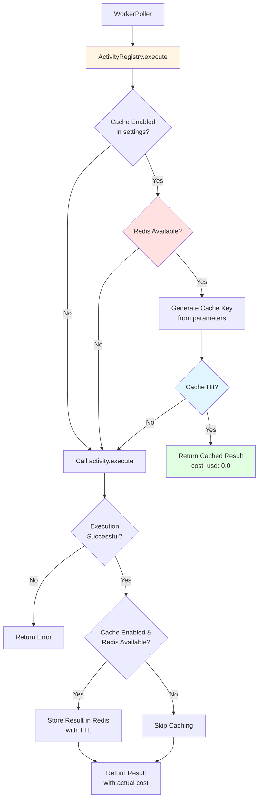

# Semantic Caching for Activity Results

Kruxia Flow provides automatic result caching for activities to reduce costs and improve performance. When enabled, activity results are cached and reused for subsequent executions with identical parameters.

## Benefits

- **Cost Savings**: Reduce LLM API costs by 50-80% for repeated queries
- **Performance**: Cache hits are 100-2000x faster than LLM calls (<10ms vs 500-2000ms)
- **Universal**: Works for ALL activity types (LLM, HTTP, PostgreSQL, custom activities)
- **Zero Code Changes**: Enable caching with a single boolean flag in activity settings
- **Automatic**: Cache key generation, TTL expiration, and cost tracking are handled automatically

## Setup

### Redis Installation (Optional)

Caching requires Redis to store cached results:

**Using Docker:**
```bash
docker run -d -p 6379:6379 redis:7-alpine
```

**Using docker-compose:**
Add Redis to your `docker-compose.yml`:
```yaml
services:
  redis:
    image: redis:7-alpine
    ports:
      - "6379:6379"
```

### Configuration

Configure caching via environment variables:

```bash
# Enable Redis caching
export KRUXIAFLOW_CACHE_PROVIDER=redis
export KRUXIAFLOW_REDIS_URL=redis://localhost:6379
export KRUXIAFLOW_REDIS_KEY_PREFIX=kruxiaflow:cache:

# Start Kruxia Flow
kruxiaflow serve
```

**Configuration Options:**

| Variable                        | Default                | Description                                    |
|---------------------------------|------------------------|------------------------------------------------|
| `KRUXIAFLOW_CACHE_PROVIDER`     | `noop`                 | Cache provider: `redis` or `noop` (disabled)   |
| `KRUXIAFLOW_REDIS_URL`          | `redis://localhost:6379` | Redis connection URL                         |
| `KRUXIAFLOW_REDIS_KEY_PREFIX`   | `kruxiaflow:cache:`    | Redis key prefix for namespace isolation       |

**Without Redis**: Kruxia Flow runs normally with caching disabled (uses `NoOpCache` fallback). Workflows execute without errors.

## Usage

### Enable Caching in Workflow Definition

Add caching settings to any activity in your workflow YAML:

**Example 1: LLM Activity Caching**
```yaml
activities:
  - key: analyze_sentiment
    worker: builtin
    activity_name: llm_prompt
    parameters:
      provider: anthropic
      model: claude-3-haiku-20240307
      prompt: "Analyze the sentiment of: {{INPUT.text}}"
      temperature: 0.0
    settings:
      cache: true           # Enable caching
      cache_ttl: 3600       # Cache TTL in seconds (1 hour)
      budget:
        limit: 0.10
```

**Example 2: HTTP API Caching**
```yaml
activities:
  - key: fetch_user_profile
    worker: builtin
    activity_name: http_request
    parameters:
      method: GET
      url: "https://api.example.com/users/{{INPUT.user_id}}"
      headers:
        Authorization: "Bearer {{SECRET.API_TOKEN}}"
    settings:
      cache: true           # Cache expensive API calls
      cache_ttl: 300        # 5 minutes (shorter TTL for frequently changing data)
```

**Example 3: PostgreSQL Query Caching**
```yaml
activities:
  - key: get_analytics_report
    worker: builtin
    activity_name: postgres_query
    parameters:
      query: "SELECT * FROM analytics_reports WHERE date = {{INPUT.report_date}}"
    settings:
      cache: true           # Cache expensive aggregation queries
      cache_ttl: 7200       # 2 hours
```

### Activity Settings

| Setting      | Type    | Default | Description                                         |
|--------------|---------|---------|-----------------------------------------------------|
| `cache`      | boolean | `false` | Enable caching for this activity                    |
| `cache_ttl`  | integer | `3600`  | Cache TTL in seconds (default: 1 hour)              |

### Execution Behavior

**First execution** (cache miss):
- Activity executes normally
- Result is cached with specified TTL
- Returns actual `cost_usd` value
- Metadata includes `cache_key` and `cached: false`

**Subsequent executions** (cache hit):
- Returns cached result immediately
- `cost_usd` is `0.0` (no API call made)
- Metadata includes `cache_key`, `cached: true`, and `cached_at` timestamp

**After TTL expires**:
- Cache entry is automatically removed by Redis
- Next execution is a cache miss (executes activity again)

## API Responses with Cache Information

When querying workflow status, cached activities include comprehensive cache metadata:

### Cache Hit Response

```bash
# Query workflow status
curl http://localhost:8080/api/v1/workflows/wf_123 \
  -H "Authorization: Bearer $TOKEN"
```

**Response** (cache hit):
```json
{
  "workflow_id": "wf_123",
  "status": "completed",
  "activities": {
    "analyze_sentiment": {
      "status": "completed",
      "outputs": {
        "sentiment": "positive",
        "confidence": 0.95
      },
      "metadata": {
        "cached": true,
        "cache_key": "builtin.llm_prompt:a3f8d9c2e1b4567890abcdef12345678...",
        "cached_at": "2025-01-19T10:30:00Z",
        "cost_usd": 0.0,
        "original_cost_usd": 0.000123
      }
    }
  }
}
```

**Key Fields:**
- `cached: true` - Indicates result was retrieved from cache
- `cache_key` - SHA256 hash used for cache lookups and invalidation
- `cached_at` - Timestamp when result was first cached
- `cost_usd: 0.0` - No cost for cache hit
- `original_cost_usd` - Cost from original execution (for reference/reporting)

### Cache Miss Response

**Response** (cache miss, newly stored):
```json
{
  "workflow_id": "wf_456",
  "status": "completed",
  "activities": {
    "analyze_sentiment": {
      "status": "completed",
      "outputs": {
        "sentiment": "negative",
        "confidence": 0.88
      },
      "metadata": {
        "cached": false,
        "cache_key": "builtin.llm_prompt:b7e4a1d8f3c6421098fedcba98765432...",
        "cost_usd": 0.000123
      }
    }
  }
}
```

**Key Fields:**
- `cached: false` - Indicates result was freshly executed
- `cache_key` - Generated key for future cache lookups
- `cost_usd` - Actual cost from this execution

## Cache Invalidation

Kruxia Flow provides two methods for cache invalidation:

### Option 1: Invalidate by Specific Cache Key

Use the `cache_key` from workflow status API responses to invalidate specific cache entries:

```bash
# Step 1: Get cache_key from workflow status
CACHE_KEY=$(curl http://localhost:8080/api/v1/workflows/wf_123 \
  -H "Authorization: Bearer $TOKEN" \
  | jq -r '.activities.analyze_sentiment.metadata.cache_key')

# Step 2: Invalidate specific cache entry
curl -X DELETE "http://localhost:8080/api/v1/cache/$CACHE_KEY" \
  -H "Authorization: Bearer $TOKEN"
```

**Response:**
```json
{
  "success": true,
  "count": 1
}
```

**Use Case:** Invalidate cache for a specific set of parameters (e.g., after updating prompt templates)

### Option 2: Invalidate by Pattern (Bulk Invalidation)

Invalidate multiple cache entries matching a pattern:

```bash
# Invalidate all llm_prompt activity caches
curl -X POST http://localhost:8080/api/v1/cache/invalidate \
  -H "Authorization: Bearer $TOKEN" \
  -H "Content-Type: application/json" \
  -d '{"pattern": "builtin.llm_prompt:*"}'

# Invalidate all HTTP request caches
curl -X POST http://localhost:8080/api/v1/cache/invalidate \
  -H "Authorization: Bearer $TOKEN" \
  -H "Content-Type: application/json" \
  -d '{"pattern": "builtin.http_request:*"}'

# Invalidate ALL caches
curl -X POST http://localhost:8080/api/v1/cache/invalidate \
  -H "Authorization: Bearer $TOKEN" \
  -H "Content-Type: application/json" \
  -d '{"pattern": "*"}'
```

**Response:**
```json
{
  "success": true,
  "count": 42
}
```

**Use Cases:**
- Clear all caches after deploying new activity implementations
- Remove stale caches for a specific activity type
- Bulk invalidation during maintenance windows

### Cache Invalidation API Endpoints

| Method | Endpoint                       | Description                              | Auth Required |
|--------|--------------------------------|------------------------------------------|---------------|
| DELETE | `/api/v1/cache/:key`           | Invalidate specific cache entry by key   | Yes (JWT)     |
| POST   | `/api/v1/cache/invalidate`     | Invalidate cache entries by pattern      | Yes (JWT)     |

**Pattern Syntax:**
- Use Redis glob-style patterns
- `*` matches any sequence of characters
- `?` matches a single character
- Example: `builtin.llm_*` matches all built-in LLM activities

## Cost Savings Examples

### Example 1: Customer Support Sentiment Analysis

**Scenario:**
- 1,000 customer messages per day
- 70% are duplicate or similar questions
- LLM cost: $0.0001 per message

**Without caching:**
```
Daily cost:  1,000 × $0.0001 = $0.10/day
Yearly cost: 365 × $0.10    = $36.50/year
```

**With caching (70% cache hit rate):**
```
Cache misses: 300 × $0.0001  = $0.03/day
Cache hits:   700 × $0.00    = $0.00/day
Daily cost:   $0.03/day
Yearly cost:  365 × $0.03    = $10.95/year

Savings: $25.55/year (70% reduction)
```

### Example 2: Research Document Analysis

**Scenario:**
- 50 research documents per day
- Complex analysis with Claude Sonnet: $0.015 per document
- 40% of documents are re-analyzed with different parameters

**Without caching:**
```
Daily cost:  50 × $0.015    = $0.75/day
Yearly cost: 365 × $0.75    = $273.75/year
```

**With caching (40% cache hit rate):**
```
Cache misses: 30 × $0.015   = $0.45/day
Cache hits:   20 × $0.00    = $0.00/day
Daily cost:   $0.45/day
Yearly cost:  365 × $0.45   = $164.25/year

Savings: $109.50/year (40% reduction)
```

### Example 3: Weather API Calls

**Scenario:**
- Weather widget with 1,000 requests per day
- External API cost: $0.001 per request
- 80% of requests for the same 10 cities (cache with 15-minute TTL)

**Without caching:**
```
Daily cost:  1,000 × $0.001  = $1.00/day
Yearly cost: 365 × $1.00     = $365.00/year
```

**With caching (80% cache hit rate):**
```
Cache misses: 200 × $0.001   = $0.20/day
Cache hits:   800 × $0.00    = $0.00/day
Daily cost:   $0.20/day
Yearly cost:  365 × $0.20    = $73.00/year

Savings: $292.00/year (80% reduction)
```

## How It Works

### Cache Key Generation

Cache keys are deterministically generated using SHA256 hashing:

1. **Inputs**: Activity name + normalized parameters
2. **Normalization**: JSON keys are sorted for deterministic ordering
3. **Hashing**: SHA256 hash of normalized input
4. **Format**: 64-character hex string (e.g., `a3f8d9c2e1b4567890abcdef12345678...`)

**Key Properties:**
- **Deterministic**: Same parameters always produce same cache key
- **Collision-resistant**: SHA256 ensures unique keys for different inputs
- **Activity-scoped**: Includes activity name to prevent cross-activity collisions

**Example:**
```json
// These produce the same cache key (despite different order):
{"prompt": "Hello", "model": "claude-3-haiku", "temperature": 0.0}
{"temperature": 0.0, "prompt": "Hello", "model": "claude-3-haiku"}

// This produces a different cache key:
{"prompt": "Goodbye", "model": "claude-3-haiku", "temperature": 0.0}
```

### Caching Architecture



**Key Design Decisions:**

1. **Universal Caching Layer**: Caching is implemented in `ActivityRegistry`, not in individual activity implementations. This provides:
   - Caching for ALL activity types (LLM, HTTP, PostgreSQL, custom)
   - Zero code changes in activity implementations
   - Single source of truth for cache logic

2. **Graceful Degradation**: If Redis is unavailable, workflows continue executing without caching:
   - No errors or failures
   - Activities execute normally
   - `NoOpCache` fallback silently handles cache operations

3. **Cost Tracking Integration**: Cache hits automatically return `cost_usd: 0.0`:
   - Accurate cost tracking across workflows
   - Cost savings visible in budget tracking
   - Original cost preserved in metadata for reference

### Redis Storage Format

**Cache Entry Structure:**
```json
{
  "output": { /* activity result */ },
  "cached_at": "2025-01-19T10:30:00Z",
  "original_cost_usd": 0.000123
}
```

**Redis Key Format:**
```
{prefix}{activity.worker}.{activity.name}:{hash}

Examples:
kruxiaflow:cache:builtin.llm_prompt:a3f8d9c2e1b4567890abcdef12345678...
kruxiaflow:cache:builtin.http_request:b7e4a1d8f3c6421098fedcba98765432...
```

**TTL Management:**
- TTL set using Redis `SETEX` command (atomic set + TTL)
- Redis automatically removes expired entries
- No manual cleanup required

## Performance Considerations

### Cache Hit Latency

| Scenario                  | Latency      | Speedup vs LLM Call |
|---------------------------|--------------|---------------------|
| Redis (local)             | <1ms         | 500-2000x faster    |
| Redis (remote/cloud)      | 5-10ms       | 50-400x faster      |
| LLM API call (baseline)   | 500-2000ms   | —                   |

**Result**: Even remote cache hits are dramatically faster than LLM API calls.

### Memory Usage

**Example: 10,000 cached LLM responses**
```
Average response size:    5 KB
Total memory:             50 MB
With 1 hour TTL:          ~500 active entries at steady state
Steady state memory:      2.5 MB
```

**Recommendation**: Redis memory usage is minimal for typical workloads. Use appropriate TTL values to prevent unbounded growth.

### Cache Key Size

```
SHA256 hash:              64 hex characters
Redis key overhead:       ~100 bytes per entry
Typical cached result:    1-10 KB
```

## Best Practices

### Choosing Cache TTL Values

| Activity Type              | Recommended TTL | Rationale                                      |
|----------------------------|-----------------|------------------------------------------------|
| LLM Prompts                | 1-6 hours       | Balance cost savings with content freshness    |
| Weather/News APIs          | 5-15 minutes    | Frequently updated data                        |
| User Profile Lookups       | 5-30 minutes    | Moderate update frequency                      |
| Analytics/Reports          | 1-24 hours      | Expensive queries, infrequently updated        |
| Static Reference Data      | 24+ hours       | Rarely changing data (e.g., country codes)     |

### When to Enable Caching

**✅ Good Use Cases:**
- Repeated LLM prompts with identical parameters
- Expensive API calls with stable responses
- Complex PostgreSQL aggregation queries
- Static or slowly-changing data lookups

**❌ Poor Use Cases:**
- Unique, one-time executions
- Real-time data requiring fresh results
- User-specific data with high variability
- Activities with side effects (e.g., database writes)

### Cache Invalidation Strategy

**Proactive Invalidation** (recommended):
- Clear caches when deploying new activity implementations
- Invalidate specific keys when updating prompt templates
- Use pattern invalidation for bulk updates

**Reactive Invalidation**:
- Monitor cache hit rates and adjust TTL as needed
- Invalidate caches if stale data is detected
- Let TTL handle expiration for most cases

### Monitoring Cache Performance

Track these metrics to optimize caching:
- **Cache hit rate**: % of requests served from cache
- **Cost savings**: Sum of `original_cost_usd` for cache hits
- **Cache size**: Number of cached entries
- **Invalidation frequency**: Rate of manual invalidations

**Target Cache Hit Rate**: 50-80% for LLM activities indicates effective caching.

## Troubleshooting

### Caching Not Working

**Symptom**: All executions show `cached: false` in metadata

**Possible Causes:**
1. Redis not configured or unavailable
2. `cache: true` not set in activity settings
3. Parameters vary between executions
4. TTL too short for testing

**Solutions:**
```bash
# Check Redis connectivity
redis-cli ping

# Verify environment variables
echo $KRUXIAFLOW_CACHE_PROVIDER
echo $KRUXIAFLOW_REDIS_URL

# Check activity settings in workflow YAML
grep -A 2 "settings:" workflow.yaml

# Increase TTL for testing
cache_ttl: 3600  # 1 hour
```

### Cache Keys Different for Same Parameters

**Symptom**: Expected cache hit returns cache miss

**Possible Causes:**
1. Parameter values differ (even slightly)
2. Additional parameters in one execution
3. JSON formatting differences (handled by normalization)

**Solutions:**
```bash
# Compare cache_keys from two executions
curl http://localhost:8080/api/v1/workflows/wf_123 | jq '.activities[].metadata.cache_key'
curl http://localhost:8080/api/v1/workflows/wf_456 | jq '.activities[].metadata.cache_key'

# If different, compare parameters
curl http://localhost:8080/api/v1/workflows/wf_123 | jq '.activities[].parameters'
curl http://localhost:8080/api/v1/workflows/wf_456 | jq '.activities[].parameters'
```

### Redis Memory Issues

**Symptom**: Redis running out of memory

**Solutions:**
1. **Reduce TTL values** to expire entries faster
2. **Configure Redis maxmemory policy**:
   ```bash
   # In redis.conf
   maxmemory 256mb
   maxmemory-policy allkeys-lru
   ```
3. **Use pattern invalidation** to clear old caches
4. **Monitor cache size**:
   ```bash
   redis-cli DBSIZE
   redis-cli INFO memory
   ```

## Advanced Topics

### Future Enhancement: Semantic Similarity Matching

**Current Implementation**: Exact parameter matching (cache key must match exactly)

**Planned Enhancement** (Post-MVP): Semantic similarity matching for LLM prompts
- Use embeddings to detect semantically similar prompts
- Cache hit for prompts with similarity score >0.95
- Example: "What is 2+2?" and "Calculate 2 plus 2" would match

**Benefits**:
- Higher cache hit rate (80-90% vs 50-70%)
- Handles paraphrased questions
- Better user experience

**Tradeoffs**:
- Embedding generation cost (~$0.00001 per call)
- Increased complexity
- Potential for incorrect matches

This feature is planned for post-MVP but not currently available.

## Related Documentation

- **[Multi-Provider LLM Activities](../implementation/US-5.1-multi-provider-llm.md)** - LLM activity implementation details
- **[Activity Settings](../implementation/US-3.5-activity-settings.md)** - Complete settings reference
- **[Budget Configuration](../budget-configuration.md)** - Budget enforcement and cost tracking
- **[Architecture](../architecture.md)** - Service interface patterns and design rationale

## Feedback and Support

If you encounter issues or have suggestions for improving semantic caching:
- Open an issue on GitHub: [Kruxia Flow Issues](https://github.com/your-org/kruxiaflow/issues)
- Check the troubleshooting section above
- Review the implementation plan: `docs/implementation/US-5.3-semantic-caching.md`
