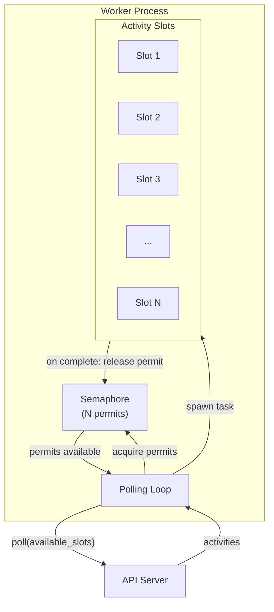

# Semaphore-Based Worker Concurrency

**Date**: 2026-01-10
**Status**: Proposed
**Priority**: Medium

## Problem Statement

The current worker polling model waits for all activities in a batch to complete before polling for more work. This creates inefficiency when activities have varying execution times.

**Current behavior** (`worker/src/poller.rs:108-113`):

```rust
// Wait for all activities to complete
for task in tasks {
    if let Err(err) = task.await {
        tracing::error!("Activity task panicked: {:?}", err);
    }
}
```

**Example scenario:**
- Worker polls and claims 10 activities
- 9 activities complete in 100ms
- 1 activity takes 5 minutes (LLM call, large HTTP request, etc.)
- Worker sits idle for 4 minutes 59 seconds waiting on the slow activity

The mitigation of running multiple independent pollers (default 4) helps but doesn't solve the fundamental issue—each poller still blocks on its slowest activity.

## Proposed Solution

Replace the batch-wait model with a semaphore-based approach where the worker maintains N in-flight activity slots and polls for more work whenever slots become available.

**New behavior:**
```
Slot 1: [activity A running]
Slot 2: [activity B running]
Slot 3: [activity C completes] → immediately poll for more → [activity D starts]
Slot 4: [activity E running]
```

Activities complete independently, and the worker continuously fills available slots.

## Design

### Option A: Single Poller with Semaphore (Recommended)

Replace multiple independent pollers with a single polling loop that uses a semaphore to limit concurrency.



**Pseudocode:**

```rust
pub async fn run(&self) -> Result<()> {
    let semaphore = Arc::new(Semaphore::new(self.config.max_concurrent_activities));

    loop {
        // Wait for at least one slot to be available
        let permit = semaphore.clone().acquire_owned().await?;

        // Check how many additional slots are available
        let available = semaphore.available_permits() + 1; // +1 for the one we hold

        // Poll for up to `available` activities
        let response = self.client.poll_activities(
            &self.config.worker_id,
            self.config.activity_types.clone(),
            available.min(self.config.poll_max_activities),
        ).await?;

        if response.count == 0 {
            // No work available, release permit and sleep
            drop(permit);
            tokio::time::sleep(self.config.poll_interval).await;
            continue;
        }

        // Acquire additional permits for extra activities (we already hold one)
        let mut permits = vec![permit];
        for _ in 1..response.count {
            permits.push(semaphore.clone().acquire_owned().await?);
        }

        // Spawn each activity with its own permit
        for (activity, permit) in response.activities.into_iter().zip(permits) {
            let poller = self.clone();
            tokio::spawn(async move {
                poller.execute_activity(activity).await;
                drop(permit); // Release slot when done
            });
        }
        // Loop immediately to poll for more if slots available
    }
}
```

**Pros:**
- Single polling loop, simpler to reason about
- Maximizes throughput—always fills available slots
- Natural backpressure via semaphore
- `concurrency` config directly maps to max in-flight activities

**Cons:**
- Single poll request may become a bottleneck at very high throughput
- Slightly more complex permit management

### Option B: Keep Multiple Pollers, Add Per-Poller Semaphore

Keep the existing multi-poller architecture but add a shared semaphore across all pollers.

```rust
// In WorkerManager
let semaphore = Arc::new(Semaphore::new(config.max_concurrent_activities));

for i in 0..config.poller_count {
    let sem = Arc::clone(&semaphore);
    tokio::spawn(async move {
        poller.run_with_semaphore(sem).await
    });
}
```

**Pros:**
- Parallel polling for higher throughput
- Less change to existing architecture

**Cons:**
- Multiple pollers competing for same semaphore adds complexity
- Pollers may poll when no permits available (wasted API calls)
- Two config values to tune (`poller_count` and `max_concurrent_activities`)

### Recommendation: Option A

Option A is simpler and more efficient for the expected workload. A single poller can handle thousands of activities per second, and the semaphore ensures we never over-commit resources.

## Configuration Changes

### Current Config

| Parameter                       | Default | Description                       |
|---------------------------------|---------|-----------------------------------|
| `KRUXIAFLOW_WORKER_CONCURRENCY` | 4       | Number of independent poller tasks |

### Proposed Config

| Parameter                              | Default | Description                              |
|----------------------------------------|---------|------------------------------------------|
| `KRUXIAFLOW_WORKER_MAX_ACTIVITIES`     | 16      | Maximum concurrent in-flight activities  |
| `KRUXIAFLOW_WORKER_POLL_MAX_ACTIVITIES`| 10      | Max activities to claim per poll request |

The `concurrency` parameter would be deprecated or repurposed to mean max in-flight activities (with a migration path).

## Implementation Steps

1. [ ] Add `Semaphore` to `WorkerPoller` struct
2. [ ] Rewrite `run()` to use semaphore-based polling loop
3. [ ] Remove batch-wait logic from `poll_and_execute()`
4. [ ] Update `WorkerManager` to spawn single poller (or keep multi-poller with Option B)
5. [ ] Update `WorkerConfig` with new parameters
6. [ ] Add deprecation warning for old `concurrency` parameter
7. [ ] Update documentation

## Migration Path

1. **Phase 1**: Add new `max_concurrent_activities` config, default to `concurrency * poll_max_activities` for backwards compatibility
2. **Phase 2**: Log deprecation warning when `concurrency` is explicitly set
3. **Phase 3**: Remove `concurrency` parameter in next major version

## Testing Plan

1. **Throughput Test**: Compare activities/second with old vs new model
2. **Mixed Workload**: Fast activities (10ms) + slow activities (30s), verify fast activities aren't blocked
3. **Backpressure**: Verify semaphore correctly limits in-flight activities
4. **Memory**: Ensure no memory leaks from permit handling
5. **Graceful Shutdown**: Verify in-flight activities complete on shutdown

## Performance Expectations

**Current model** (4 pollers, batch of 10 each):
- Best case: 40 concurrent activities
- Worst case: 4 concurrent activities (one slow activity per poller)

**New model** (16 max concurrent):
- Consistent 16 concurrent activities regardless of individual activity duration

## Alternatives Considered

1. **Increase poller count**: Partially mitigates but doesn't solve the fundamental issue; wastes resources on idle pollers
2. **Timeout and re-queue slow activities**: Adds complexity, doesn't help legitimately slow activities
3. **Priority queues**: Orthogonal feature, doesn't address batch-wait problem
