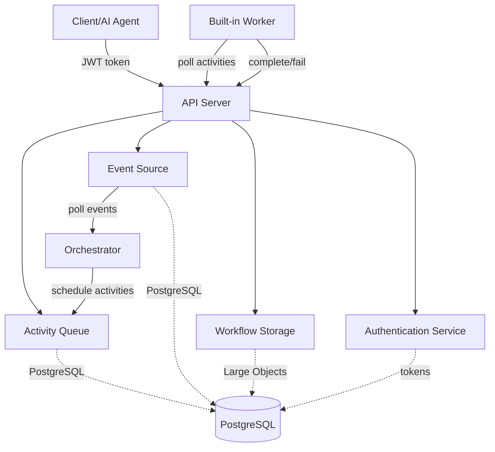

# StreamFlow Glossary

**Version**: 0.3.0
**Last Updated**: 2025-12-02

This glossary defines key concepts, components, and terminology used throughout the StreamFlow workflow orchestration platform.

---

## Terms

| Term | Definition | More Information |
|------|------------|------------------|
| **Activity** | A single unit of work within a *workflow* that performs a specific task (HTTP request, LLM call, database query, email send, etc.) | [Architecture](architecture.md), [US-1.1](implementation/US-1.1-activity-queue.md) |
| **Activity Queue** | *Service interface* responsible for scheduling *activities* and managing *worker* polling with safe concurrency via PostgreSQL `FOR UPDATE SKIP LOCKED` | [US-1.1](implementation/US-1.1-activity-queue.md), [Architecture](architecture.md) |
| **Activity Settings** | Configuration for individual *activities* including timeout, *retry policies*, and *budget* limits | [US-3.5](implementation/US-3.5-activity-settings.md), [Loops Guide](loops-guide.md) |
| **Authentication Service** | *Service interface* for OAuth 2.0 JWT token management with RSA256 signing and refresh token rotation | [US-1A.3](implementation/US-1A.3-authentication.md) |
| **Back-Edge** | A dependency from a later *activity* to an earlier *activity* that creates a loop in the *workflow* graph | [Loops Guide](loops-guide.md), [US-3.4](implementation/US-3.4-iterative-workflows.md) |
| **Budget Enforcement** | Cost control mechanism that prevents *activities* from executing when accumulated costs exceed configured limits (per-activity or per-workflow) | [US-5.1](implementation/US-5.1-multi-provider-llm.md#phase-2-cost-tracking-and-budget-enforcement), [Loops Guide](loops-guide.md#budget-management) |
| **Built-in Activity Library** | Collection of pre-implemented *activities* including `http_request`, `llm_prompt`, `postgres_query`, `postgres_transaction`, `email_send`, and `embedding` | [README](../README.md#epic-5-built-in-activity-library), [US-5.1](implementation/US-5.1-multi-provider-llm.md) |
| **Built-in Worker** | Default *activity* executor included with StreamFlow that authenticates via JWT and polls the API server for work | [US-1B.1](implementation/US-1B.1-built-in-worker.md), [Architecture](architecture.md) |
| **Conditional Execution** | *MiniJinja* template-based evaluation that determines whether an *activity* should execute based on runtime conditions | [Loops Guide](loops-guide.md#template-syntax), [Example 2](../examples/02-user-validation.yaml) |
| **DAG (Directed Acyclic Graph)** | The graph structure representing a *workflow* where nodes are *activities* and edges are dependency relationships defined by `depends_on` | [Architecture](architecture.md), [US-1.2](implementation/US-1.2-event-driven-scheduling.md) |
| **Dependency Resolution** | *Orchestrator* process that determines which *activities* are ready to execute based on their `depends_on` relationships | [US-1.2](implementation/US-1.2-event-driven-scheduling.md), [Architecture](architecture.md) |
| **Event Source** | *Service interface* for publishing and consuming *workflow* events using PostgreSQL polling with guaranteed delivery (no LISTEN/NOTIFY) | [US-1.2](implementation/US-1.2-event-driven-scheduling.md), [Architecture](architecture.md) |
| **Event Sourcing** | Architecture pattern where all *workflow* state changes are recorded as immutable events in the `workflow_events` table | [US-1.2](implementation/US-1.2-event-driven-scheduling.md), [Architecture](architecture.md) |
| **Fan-In** | *Activity* pattern with multiple dependencies that waits for all predecessor *activities* to complete before executing | [Architecture](architecture.md), [Example 3](../examples/03-document-processing.yaml) |
| **Fan-Out** | *Activity* pattern where multiple dependent *activities* execute in parallel once their shared dependency completes | [Architecture](architecture.md), [Example 3](../examples/03-document-processing.yaml) |
| **Idempotency** | Property ensuring repeated operations with the same parameters produce the same result, implemented via UNIQUE constraints in PostgreSQL | [US-1.1](implementation/US-1.1-activity-queue.md), [US-1A.5](implementation/US-1A.5-workflow-submission.md) |
| **Iteration Counter** | Zero-based counter tracking how many times a looping *activity* has executed, accessible via `{{ACTIVITY.iteration}}` | [Loops Guide](loops-guide.md#template-syntax), [US-3.4](implementation/US-3.4-iterative-workflows.md) |
| **Iteration Limit** | Maximum number of times a looping *activity* can execute before terminating (default: 100) | [Loops Guide](loops-guide.md#loop-patterns), [US-3.4](implementation/US-3.4-iterative-workflows.md) |
| **Iteration-Scoped** | Storage mode for looping *activities* where outputs are stored as arrays with one value per *iteration* instead of only the latest value | [Loops Guide](loops-guide.md#iteration-scoped-storage), [US-3.4](implementation/US-3.4-iterative-workflows.md) |
| **LLM Activity** | *Built-in activity* type that executes prompts against LLM providers (Anthropic, OpenAI, Google, Ollama) with token counting and cost tracking | [US-5.1](implementation/US-5.1-multi-provider-llm.md), [Example 4](../examples/04-moderate-content.yaml) |
| **Materialized State** | In-memory representation of *workflow* and *activity* state loaded from events for fast (<1ms) *orchestrator* evaluation | [US-1.2](implementation/US-1.2-event-driven-scheduling.md), [Architecture](architecture.md) |
| **MiniJinja** | Template engine used for *conditional* expressions and dynamic value interpolation in *workflow definitions* | [Loops Guide](loops-guide.md#template-syntax), [Example 2](../examples/02-user-validation.yaml) |
| **Orchestrator** | Event-driven engine that evaluates *workflow* dependencies, schedules ready *activities*, and manages *workflow* lifecycle | [US-1.2](implementation/US-1.2-event-driven-scheduling.md), [Architecture](architecture.md) |
| **PostgreSQL Large Objects** | Storage mechanism for *workflow* files and large artifacts using PostgreSQL's Large Object (LO) API | [US-5.4](implementation/US-5.4-object-storage.md) |
| **Retry Policy** | *Activity setting* that defines backoff strategy (fixed, linear, exponential) and maximum retry attempts for failed *activities* | [US-3.5](implementation/US-3.5-activity-settings.md), [Example 4](../examples/04-moderate-content.yaml) |
| **Scheduled Activity** | *Activity* with delayed or absolute execution time specified via `delay_seconds` or `scheduled_for` settings | [US-3.7](implementation/US-3.7-activity-scheduling.md), [Example 8](../examples/08a-rate-limited-api-calls.yaml) |
| **Semantic Caching** | Redis-backed result caching system using SHA256 hashes of *activity* parameters to avoid redundant *LLM* calls (50-80% cost savings) | [US-5.3](implementation/US-5.3-semantic-caching.md), [Semantic Caching Feature](features/semantic-caching.md) |
| **Service Interface** | Abstract trait defining pluggable implementations for external dependencies (*activity queue*, *event source*, *workflow storage*, *authentication service*) | [Architecture](architecture.md), [README](../README.md#architecture) |
| **Template Expression** | Dynamic value substitution using `{{}}` syntax supporting `{{INPUT.*}}`, `{{activity.output}}`, `{{SECRET.*}}`, `{{WORKFLOW.*}}`, and `{{ACTIVITY.*}}` | [Loops Guide](loops-guide.md#template-syntax), [Example 1](../examples/01-weather-report.yaml) |
| **Token Streaming** | WebSocket-based real-time delivery of *LLM* output tokens for ChatGPT-style user experiences | [US-7.1](implementation/US-7.1-token-streaming.md), [US-1A.9a](implementation/US-1A.9a-websocket-infrastructure.md) |
| **Worker** | Process that polls the *activity queue*, executes *activities*, and reports results via the API server | [US-1B.1](implementation/US-1B.1-built-in-worker.md), [US-1A.7](implementation/US-1A.7-worker-activity-apis.md) |
| **Workflow** | Complete directed acyclic graph (*DAG*) of *activities* defining business logic with dependencies, conditions, and settings | [Architecture](architecture.md), [Example Workflows](../examples/) |
| **Workflow Definition** | Named, versioned template for *workflows* stored in `workflow_definitions` table containing *activity* specifications and dependency graph | [US-1A.4](implementation/US-1A.4-workflow-definition-management.md) |
| **Workflow Instance** | Single execution of a *workflow definition* with specific input parameters, tracked in the `workflows` table | [US-1A.5](implementation/US-1A.5-workflow-submission.md), [US-1A.6](implementation/US-1A.6-workflow-status-query.md) |
| **Workflow Storage** | *Service interface* for storing and retrieving large files and artifacts using *PostgreSQL Large Objects* in MVP | [US-5.4](implementation/US-5.4-object-storage.md), [Architecture](architecture.md) |
| **YAML Workflow Definition** | Human-readable *workflow* specification format defining *activities*, dependencies, parameters, and settings | [README](../README.md#epic-3-yaml-workflow-definition-language), [Example Workflows](../examples/) |

---

## Component Relationships

---

## Workflow Lifecycle States

| State | Description | Transitions To |
|-------|-------------|----------------|
| **created** | Workflow submitted but orchestrator hasn't processed initial events yet | running, failed |
| **running** | At least one activity is executing or scheduled | completed, failed, paused |
| **completed** | All activities completed successfully and workflow has no more work | *(terminal state)* |
| **failed** | One or more activities failed and cannot be retried, or budget exceeded | *(terminal state)* |
| **paused** | Workflow execution suspended (future feature) | running, failed |

---

## Activity States

| State | Description | Transitions To |
|-------|-------------|----------------|
| **pending** | Activity scheduled in queue, waiting for worker to claim | running, failed |
| **running** | Worker claimed activity and is currently executing | completed, failed |
| **completed** | Activity finished successfully with results stored | *(terminal state)* |
| **failed** | Activity failed and exhausted all retry attempts | *(terminal state if not retryable)* |

---

## See Also

- [Architecture Documentation](architecture.md) - Complete system design
- [MVP Requirements](mvp-requirements.md) - Product specifications
- [Loops Guide](loops-guide.md) - Iterative workflow patterns
- [README](../README.md) - Quick start and overview
- [Example Workflows](../examples/) - Complete working examples
