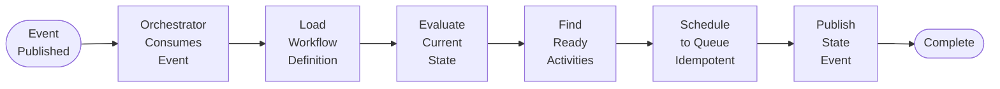

# Implementation Plan: US-1.2 Event-Driven Dynamic Scheduling

**Epic**: 1 - Event-Driven Orchestration Architecture
**User Story**: US-1.2
**Status**: ✅ Complete
**Priority**: P0 (Must Have for MVP)

---

## User Story

**As** an AI startup engineer
**I want** the orchestrator to automatically schedule ready activities when dependencies are satisfied
**So that** my workflows progress without manual intervention and respond to completion events in real-time

### Acceptance Criteria

- Orchestrator consumes workflow events from event stream (WorkflowCreated, ActivityCompleted, ActivityFailed)
- Evaluates workflow directed graph to determine which activities are ready (all dependencies satisfied)
- Schedules ready activities to activity queue idempotently
- Publishes workflow state events after each evaluation
- Handles workflow completion detection (all activities done)
- Achieves <1ms evaluation latency per event
- Supports multiple orchestrator instances consuming from event stream

---

## Architecture Reference

Per `docs/architecture.md`:

### Workflow Orchestrator (Section: Core Components)

**Responsibilities**:
- Subscribe to workflow state events (Created, Updated)
- Evaluate workflow state to determine ready activities
- Schedule activities to queue when dependencies satisfied
- Publish workflow state events after each transition
- Handle workflow completion detection

**Execution Model**:


**Performance Target**: <1ms evaluation latency

### Event Source Interface (Section: Service Interfaces)

**MVP Implementation**: PostgreSQL Polling with Adaptive Backoff

```rust
#[async_trait]
pub trait EventSource: Send + Sync {
    async fn publish(&self, event: WorkflowEvent) -> Result<()>;
    async fn poll(&self, consumer_id: &str) -> Result<Vec<StoredWorkflowEvent>>;
    async fn update_position(&self, consumer_id: &str, last_event_id: Uuid) -> Result<()>;
}
```

**Polling Strategy**:
- Adaptive backoff: 10ms (busy) to 5s (quiet)
- Durable position tracking via `workflow_event_consumers` table
- Query for events with `id > last_consumed_id`
- Multiple consumers supported (orchestrator, analytics, monitoring)
- Guaranteed delivery (no events lost, resume from checkpoint)

**Why Polling vs LISTEN/NOTIFY**:
- ✅ Guaranteed delivery (LISTEN/NOTIFY can lose events)
- ✅ Transactional (only see committed events)
- ✅ Recoverable (durable checkpoints in database)
- ✅ Exactly-once processing (checkpoint + idempotent operations)
- ✅ Efficient under load (10ms polling)
- ✅ Multiple consumer support (each tracks own position)

### Workflow Definition Language (Section: Workflow Definition Languages)

**Directed Graph Structure**:
- Activities define `preceding` and/or `following` relationships
- Orchestrator evaluates graph to determine when activities become ready
- Activity is ready when: ALL `preceding` activities completed AND conditions satisfied

**Example YAML**:
```yaml
workflow: payment_processing
version: "1.0"

activities:
  - key: validate_payment
    namespace: payments
    name: validate_card
    parameters:
      card_token: "{{ARG.card_token}}"
    following:
      - activity_key: authorize_card
        conditions:
          - "{{validate_payment.valid}} == true"

  - key: authorize_card
    namespace: payments
    name: authorize
    following:
      - activity_key: capture_payment

  - key: capture_payment
    namespace: payments
    name: capture
```

---

## State Management Strategy

### Design Decision: Materialized State with Event Audit Trail

**Chosen Approach**: Store materialized workflow state in `workflows.state_data` JSONB column, updated incrementally on event consumption. Keep all events for audit trail and verification.

### Comparison of Approaches

We evaluated three approaches for managing workflow state:

#### Approach 1: Event Sourcing (Reconstruct from All Events)

**Implementation**: Load all events for a workflow and reconstruct current state on every evaluation.

```rust
// Load ALL events for this workflow
let workflow_events = load_workflow_events(&mut *tx, workflow_id).await?;

// Reconstruct current state from all events
let state = reconstruct_state(workflow_id, &definition, &workflow_events)?; // O(n)
```

**Benefits**:
- ✅ Complete audit trail - Perfect history of all state changes
- ✅ Time travel debugging - Can reconstruct state at any point
- ✅ Bug recovery - Fix reconstruction logic and replay events
- ✅ Idempotent - Same events always produce same state
- ✅ No write conflicts - Only appending events

**Drawbacks**:
- ❌ O(n) performance - Cost grows with workflow length (n = number of events)
- ❌ Latency growth - 100-activity workflow = 100 events to process on each evaluation
- ❌ Violates <1ms target - Workflows with >50 activities may exceed 1ms reconstruction time
- ❌ Memory overhead - Must load all events into memory

**Performance estimate**:
- Small workflow (10 activities): ~100μs reconstruction time ✅
- Medium workflow (50 activities): ~500μs reconstruction time ⚠️
- Large workflow (200 activities): ~2ms reconstruction time ❌ (exceeds 1ms target)

#### Approach 2: State in Each Event

**Implementation**: Include complete workflow state in every event payload, fetch latest event to get current state.

```rust
// Event contains full state snapshot
{
  "event_type": "ActivityCompleted",
  "payload": {
    "outputs": {...},
    "workflow_state": {  // Full state duplicated in every event
      "activities": {...}
    }
  }
}

// Fetch latest event
let latest = sqlx::query!("SELECT * FROM workflow_events WHERE workflow_id = $1 ORDER BY id DESC LIMIT 1", ...)
let state = latest.into_state(); // O(1)
```

**Benefits**:
- ✅ O(1) performance - Just fetch latest event
- ✅ Audit trail - Can see exact state at each step
- ✅ Time travel - State snapshot at every event

**Drawbacks**:
- ❌ Storage bloat - Full state duplicated in every event (50 activities × 50 events × 5KB = 250KB vs 5KB)
- ❌ Network overhead - Large events to fetch and serialize
- ❌ Serialization cost - JSON encoding/decoding on every event
- ❌ Inconsistency risk - State in event might not match actual computation if bug exists

#### Approach 3: Materialized State (Recommended)

**Implementation**: Store current state in `workflows.state_data`, load state O(1), apply single event incrementally, save updated state.

```rust
// Orchestrator consumes event
async fn process_workflow_event(event: &WorkflowEvent, ...) -> Result<()> {
    let mut tx = config.pool.begin().await?;

    // 1. Lock workflow (prevents concurrent evaluation)
    sqlx::query!("SELECT pg_advisory_xact_lock(hashtext($1::text))", ...)
        .execute(&mut *tx).await?;

    // 2. Load materialized state from workflows table (O(1))
    let mut state = sqlx::query_as!(
        WorkflowState,
        "SELECT state_data FROM workflows WHERE id = $1",
        workflow_id
    ).fetch_one(&mut *tx).await?;

    // 3. Apply THIS event to update state incrementally (just 1 event, not n events)
    apply_event_to_state(&mut state, event)?;

    // 4. Evaluate and schedule
    let ready = find_ready_activities(&definition, &state)?;
    activity_queue.schedule(workflow_id, ready).await?;

    // 5. Publish events (for audit trail - keep these!)
    for activity in &ready {
        event_source.publish(ActivityScheduled { ... }).await?;
    }

    // 6. Save updated state back to workflows table
    sqlx::query!(
        "UPDATE workflows SET state_data = $1, updated_at = NOW() WHERE id = $2",
        serde_json::to_value(&state)?,
        workflow_id
    ).execute(&mut *tx).await?;

    tx.commit().await?;
    Ok(())
}
```

**Benefits**:
- ✅ **O(1) performance** - Constant time regardless of workflow length
- ✅ **Meets <1ms target** - Always fast, even for 1000-activity workflows (~10μs state operations)
- ✅ **Predictable latency** - No performance degradation over time
- ✅ **Audit trail preserved** - All events kept in `workflow_events` table
- ✅ **Verification possible** - Can reconstruct from events to verify state correctness
- ✅ **Bug recovery** - Can fix state by reconstruction if corruption detected
- ✅ **No write contention** - Advisory locks ensure single orchestrator per workflow

**Drawbacks**:
- ⚠️ Must maintain state update logic correctness (mitigated by verification strategy)

### Performance Comparison

| Approach | Small Workflow<br/>(10 activities) | Medium Workflow<br/>(50 activities) | Large Workflow<br/>(200 activities) | Meets <1ms Target |
|----------|-----------------------------------|-------------------------------------|-------------------------------------|-------------------|
| **Event Sourcing** | ~100μs ✅ | ~500μs ⚠️ | ~2ms ❌ | Only small workflows |
| **State in Events** | ~50μs ✅ | ~100μs ✅ | ~200μs ✅ | Yes, but storage bloat |
| **Materialized State** | **~10μs ✅** | **~10μs ✅** | **~10μs ✅** | **Yes, all workflows** |

### Verification Strategy

To ensure materialized state correctness, implement background verification:

```rust
// Periodic verification job (runs every hour for active workflows)
async fn verify_workflow_states(pool: &PgPool) -> Result<()> {
    let active_workflows = sqlx::query!("SELECT id FROM workflows WHERE status = 'running'")
        .fetch_all(pool).await?;

    for workflow in active_workflows {
        // Reconstruct from events
        let events = load_all_events(pool, workflow.id).await?;
        let reconstructed = reconstruct_state_from_events(&events)?;

        // Load materialized
        let materialized = load_materialized_state(pool, workflow.id).await?;

        // Compare
        if reconstructed != materialized {
            error!("State mismatch for workflow {}", workflow.id);
            // Alert, log, potentially auto-fix
            save_materialized_state(pool, workflow.id, &reconstructed).await?;
        }
    }
    Ok(())
}
```

### Why Advisory Locks Eliminate Write Contention

The US-1.2 implementation uses PostgreSQL advisory locks to ensure only ONE orchestrator evaluates a workflow at any time:

```rust
// Acquire exclusive lock for this workflow (blocks other orchestrators)
sqlx::query!("SELECT pg_advisory_xact_lock(hashtext($1::text))", workflow_id.to_string())
    .execute(&mut *tx).await?;

// ... load state, evaluate, save state ...

tx.commit().await?;  // Lock released automatically
```

**Key properties**:
- Only one orchestrator can hold the lock per workflow at a time
- Other orchestrators skip to process different workflows (no blocking)
- Lock automatically released on transaction commit/rollback
- No risk of concurrent state updates or race conditions
- Different workflows processed in parallel by different orchestrators

**Result**: No write contention concern with materialized state approach.

---

## Database Schema Requirements

### 1. Workflow Events Table

```sql
CREATE TABLE workflow_events (
    id UUID PRIMARY KEY DEFAULT uuidv7(),
    workflow_id UUID NOT NULL,
    event_type workflow_event_type NOT NULL,
    activity_key TEXT,
    payload JSONB NOT NULL,
    timestamp TIMESTAMPTZ NOT NULL DEFAULT NOW(),  -- Human-readable time, not used for ordering

    -- Idempotency: prevent duplicate events for same workflow+type+activity
    UNIQUE(workflow_id, event_type, activity_key)
);

-- Index for workflow history queries
CREATE INDEX idx_events_workflow_id
ON workflow_events(workflow_id, id DESC);

-- Index for event type filtering
CREATE INDEX idx_events_type
ON workflow_events(event_type, id DESC);
```

**Note on UUIDv7 and Ordering**:
- The `id` field uses UUIDv7, which is **monotonically increasing** in PostgreSQL and includes a timestamp component
- This means `WHERE id > $1 ORDER BY id` provides guaranteed event ordering without needing timestamp
- The `timestamp` field is kept for:
  - Human-readable event times (analytics, debugging)
  - Time-window queries (`WHERE timestamp >= NOW() - INTERVAL '5 minutes'`)
  - Audit trails and compliance
- **Important**: Never use `timestamp` for event ordering - always use `id` (UUIDv7 guarantees).

**Note on Idempotency**:
- Events are idempotent based on `(workflow_id, event_type, activity_key)`
- This prevents duplicate "ActivityCompleted" events for the same activity, etc.
- For workflow-level events (WorkflowCreated, WorkflowCompleted), `activity_key` is NULL
- The `id` is auto-generated by the database, not provided by caller
- `ON CONFLICT (workflow_id, event_type, activity_key) DO NOTHING` ensures idempotency

**Note**: Partitioning is deferred to post-MVP. For MVP, a simple unpartitioned table is sufficient for the expected event volume.

### 2. Workflows Table

```sql
CREATE TABLE workflows (
    id UUID PRIMARY KEY DEFAULT uuidv7(),
    workflow_type TEXT NOT NULL,
    status workflow_status NOT NULL DEFAULT 'running',
    state_data JSONB NOT NULL,  -- Materialized workflow state (see State Management Strategy)
    created_at TIMESTAMPTZ NOT NULL DEFAULT NOW(),
    updated_at TIMESTAMPTZ NOT NULL DEFAULT NOW()
);

-- Index for workflow queries
CREATE INDEX idx_workflows_type_status
ON workflows(workflow_type, status, created_at DESC);

-- Index for status queries
CREATE INDEX idx_workflows_status
ON workflows(status, updated_at DESC);
```

**Purpose**: Stores materialized workflow state for O(1) access during orchestration.

**State Structure**: The `state_data` JSONB column contains the complete current state of the workflow:

```json
{
  "workflow_id": "wf_123",
  "workflow_type": "payment_processing",
  "status": "Running",
  "activities": {
    "validate_payment": {
      "status": "Completed",
      "outputs": {"valid": true},
      "completed_at": "2025-10-28T10:30:00Z"
    },
    "authorize_card": {
      "status": "Pending",
      "outputs": null,
      "completed_at": null
    },
    "capture_payment": {
      "status": "NotScheduled",
      "outputs": null,
      "completed_at": null
    }
  },
  "state_data": {}  // Custom workflow-specific data
}
```

**State Update Flow**:
1. Orchestrator consumes event (e.g., "ActivityCompleted")
2. Loads current state from this JSONB column (O(1))
3. Applies event to update state incrementally
4. Saves updated state back to this column
5. Result: Always current, always fast

**Why NOT use event sourcing reconstruction**:
- ❌ Event sourcing (reconstruct from all events) is O(n) - violates <1ms target for large workflows
- ✅ Materialized state is O(1) - meets <1ms target for any workflow size
- ✅ Events still preserved in `workflow_events` for audit trail and verification

### 3. Workflow Definitions Table

```sql
CREATE TABLE workflow_definitions (
    id UUID PRIMARY KEY DEFAULT uuidv7(),
    name TEXT NOT NULL,
    version TEXT NOT NULL,
    definition JSONB NOT NULL,
    created_at TIMESTAMPTZ NOT NULL DEFAULT NOW(),
    UNIQUE(name, version)
);
```

### 4. Event Consumption Tracking Table

```sql
CREATE TABLE workflow_event_consumers (
    consumer_id TEXT PRIMARY KEY,  -- e.g., "orchestrator", "analytics", etc.
    last_event_id UUID NOT NULL,   -- Last successfully processed event (UUIDv7)
    updated_at TIMESTAMPTZ NOT NULL DEFAULT NOW()
);

-- No additional indexes needed (single-row lookups by PK)
```

**Purpose**: Track which events have been consumed by each consumer (orchestrator, analytics, etc.)

**How it works**:
1. Each consumer has a unique `consumer_id` (e.g., "orchestrator")
2. After successfully processing an event, consumer updates `last_event_id` in a transaction
3. On startup/restart, consumer reads `last_event_id` and resumes from there
4. If no row exists (first startup), consumer starts from beginning of event stream

**Benefits**:
- ✅ Durable (survives orchestrator restarts)
- ✅ Transactional (exactly-once processing when combined with idempotent operations)
- ✅ No arbitrary time windows (processes all events from last checkpoint)
- ✅ Multiple consumers supported (analytics, monitoring, etc. can track independently)

### 5. Event Types

```sql
CREATE TYPE workflow_event_type AS ENUM (
    'WorkflowCreated',      -- Initial workflow submission
    'WorkflowUpdated',      -- Activity completed/failed, state changed
    'ActivityScheduled',    -- Activity added to queue
    'ActivityCompleted',    -- Activity finished successfully
    'ActivityFailed',       -- Activity failed permanently
    'WorkflowCompleted',    -- All activities done
    'WorkflowFailed'        -- Workflow failed permanently
);

CREATE TYPE workflow_status AS ENUM (
    'running',      -- Workflow executing
    'completed',    -- All activities done successfully
    'failed',       -- Workflow failed permanently
    'paused'        -- Workflow paused (future enhancement)
);
```

---

## Implementation Components

### Component 1: Event Source - PostgreSQL Polling

**File**: `core/src/events/postgres_event_source.rs`

**Responsibilities**:
1. Implement `EventSource` trait for PostgreSQL
2. Publish workflow events to `workflow_events` table
3. Poll for new events with adaptive backoff
4. Support multiple orchestrator instances (stateless polling)
5. Provide event ordering guarantees (UUIDv7 is monotonic)

**Key Methods**:

#### 1.1 `publish()` - Event Publishing

**Requirements**:
- Insert event into `workflow_events` table
- Include complete workflow state in payload
- Transactional (event appears atomically)
- Idempotent (duplicate events ignored via UNIQUE constraint)
- Database auto-generates `id` (UUIDv7)

**Behavior**:
```rust
// Pseudocode
async fn publish(&self, event: WorkflowEvent) -> Result<()> {
    sqlx::query!(
        "INSERT INTO workflow_events (workflow_id, event_type, activity_key, payload)
         VALUES ($1, $2, $3, $4)
         ON CONFLICT (workflow_id, event_type, activity_key) DO NOTHING",
        event.workflow_id,
        event.event_type,
        event.activity_key,
        event.payload
    )
    .execute(&self.pool)
    .await?;

    Ok(())
}
```

**Notes**:
- `id` is auto-generated by database using `DEFAULT uuidv7()`
- `timestamp` is auto-generated using `DEFAULT NOW()`
- Idempotency via `UNIQUE(workflow_id, event_type, activity_key)`
- For workflow-level events (WorkflowCreated, WorkflowCompleted), pass `activity_key: None`

**Edge Cases**:
- Duplicate event (idempotent - no error, ON CONFLICT DO NOTHING)
- Invalid JSONB payload (return error)
- Database connection failure (retry with backoff)
- NULL activity_key (valid for workflow-level events)

#### 1.2 `poll()` - Event Polling with Durable Position Tracking

**Requirements**:
- Query for events after last consumed position in a single query (JOIN)
- Return up to 100 events per poll
- Order by `id ASC` (UUIDv7 is monotonic, provides total ordering)
- Update consumer position after successful processing (caller's responsibility)

**Behavior**:
```rust
// Pseudocode
async fn poll(&self, consumer_id: &str) -> Result<Vec<StoredWorkflowEvent>> {
    // Single query with LEFT JOIN to get checkpoint and events
    // If no checkpoint exists (first poll), last_event_id will be NULL
    let events = sqlx::query_as!(
        StoredWorkflowEvent,
        "SELECT e.*
         FROM workflow_events e
         LEFT JOIN workflow_event_consumers c ON c.consumer_id = $1
         WHERE c.last_event_id IS NULL OR e.id > c.last_event_id
         ORDER BY e.id ASC
         LIMIT 100",
        consumer_id
    )
    .fetch_all(&self.pool)
    .await?;

    Ok(events)
}
```

**Query Explanation**:
- `LEFT JOIN workflow_event_consumers`: Get checkpoint for this consumer (NULL if first poll)
- `WHERE c.last_event_id IS NULL`: First poll (no checkpoint) - return events from beginning
- `WHERE e.id > c.last_event_id`: Resume from checkpoint - return events after last consumed
- Single query eliminates extra database roundtrip
- PostgreSQL query planner optimizes this efficiently

#### 1.3 `update_position()` - Update Consumer Position

**Requirements**:
- Update `last_event_id` in `workflow_event_consumers` table
- Upsert (insert if not exists, update if exists)
- **Only move position forward** (prevent accidental backwards movement)
- Should be called after successfully processing events

**Behavior**:`
```rust
// Pseudocode
async fn update_position(&self, consumer_id: &str, last_event_id: Uuid) -> Result<()> {
    sqlx::query!(
        "INSERT INTO workflow_event_consumers (consumer_id, last_event_id, updated_at)
         VALUES ($1, $2, NOW())
         ON CONFLICT (consumer_id)
         DO UPDATE SET
             last_event_id = $2,
             updated_at = NOW()
         WHERE workflow_event_consumers.last_event_id < $2",
        consumer_id,
        last_event_id
    )
    .execute(&self.pool)
    .await?;

    Ok(())
}
```

**Safety Constraint**:
- `WHERE workflow_event_consumers.last_event_id < $2`: Only update if new position is greater
- UUIDv7 is monotonically increasing, so `<` comparison works correctly
- Prevents accidental backwards movement (e.g., from concurrent orchestrators, bugs)
- If new position ≤ old position, no update occurs (safe no-op)

**Note on Transactionality**:
- For exactly-once semantics, wrap event processing + position update in a transaction
- If processing fails, position is not updated (event will be reprocessed)
- Idempotent operations (activity scheduling, event publishing) make reprocessing safe

**Adaptive Backoff Logic** (in orchestrator loop):
```rust
// Pseudocode
let mut backoff = AdaptiveBackoff::new(
    Duration::from_millis(10),   // Min: 10ms when busy
    Duration::from_secs(5),      // Max: 5s when quiet
    1.62,                        // Backoff multiplier
);

loop {
    let events = event_source.poll(last_event_id).await?;

    if events.is_empty() {
        // No events - increase backoff
        backoff.increase();
        tokio::time::sleep(backoff.current()).await;
        continue;
    }

    // Process events
    for event in &events {
        process_event(event).await?;
        last_event_id = Some(event.id);
    }

    // Got events - reset backoff
    backoff.reset();
}
```

**Edge Cases**:
- No events available (return empty vec, orchestrator backs off)
- First poll with None (query recent events)
- Multiple orchestrators polling (each tracks own last_event_id)
- Database query timeout (return error, orchestrator retries)

### Component 2: Workflow State Management

**File**: `core/src/orchestrator/workflow_state.rs`

**Responsibilities**:
1. Load workflow definition from database
2. Load materialized workflow state from `workflows.state_data` (O(1))
3. Apply single event to update state incrementally
4. Save updated state back to database
5. Provide state queries (is activity ready? workflow complete?)

**Data Structures**:

```rust
// Complete workflow state (stored in workflows.state_data JSONB)
pub struct WorkflowState {
    pub workflow_id: Uuid,
    pub workflow_type: String,
    pub status: WorkflowStatus,
    pub activities: HashMap<String, ActivityState>,  // key -> state
    pub state_data: serde_json::Value,  // Custom workflow state data
}

// State of individual activity
pub struct ActivityState {
    pub key: String,
    pub status: ActivityStatus,
    pub outputs: Option<serde_json::Value>,
    pub error: Option<String>,
    pub started_at: Option<DateTime<Utc>>,
    pub completed_at: Option<DateTime<Utc>>,
    pub retry_count: u32,
}

pub enum ActivityStatus {
    NotScheduled,   // Not yet in queue
    Pending,        // In queue, waiting for worker
    Running,        // Worker executing
    Completed,      // Finished successfully
    Failed,         // Failed permanently
}

pub enum WorkflowStatus {
    Running,
    Completed,
    Failed,
}
```

**Key Methods**:

#### 2.1 `load_definition()` - Load Workflow Definition

```rust
// Pseudocode
async fn load_definition(
    tx: &mut PgConnection,
    workflow_type: &str,
    version: &str,
) -> Result<WorkflowDefinition> {
    let def = sqlx::query_as!(
        WorkflowDefinition,
        "SELECT * FROM workflow_definitions
         WHERE name = $1 AND version = $2",
        workflow_type,
        version
    )
    .fetch_one(tx)
    .await?;

    // Parse JSONB definition into structured format
    serde_json::from_value(def.definition)
}
```

#### 2.2 `load_materialized_state()` - Load Current State (O(1))

```rust
// Pseudocode
async fn load_materialized_state(
    tx: &mut PgConnection,
    workflow_id: Uuid,
) -> Result<WorkflowState> {
    let row = sqlx::query!(
        "SELECT state_data FROM workflows WHERE id = $1",
        workflow_id
    )
    .fetch_one(tx)
    .await?;

    // Deserialize JSONB to WorkflowState
    serde_json::from_value(row.state_data)
        .map_err(|e| Error::StateDeserialization(e.to_string()))
}
```

#### 2.3 `save_materialized_state()` - Save Updated State

```rust
// Pseudocode
async fn save_materialized_state(
    tx: &mut PgConnection,
    workflow_id: Uuid,
    state: &WorkflowState,
) -> Result<()> {
    let state_json = serde_json::to_value(state)
        .map_err(|e| Error::StateSerialization(e.to_string()))?;

    sqlx::query!(
        "UPDATE workflows
         SET state_data = $1, updated_at = NOW()
         WHERE id = $2",
        state_json,
        workflow_id
    )
    .execute(tx)
    .await?;

    Ok(())
}
```

#### 2.4 `apply_event_to_state()` - Incremental State Update

**Critical**: This applies ONE event to existing state (not full reconstruction from all events).

```rust
// Pseudocode
fn apply_event_to_state(state: &mut WorkflowState, event: &WorkflowEvent) -> Result<()> {
    match event.event_type.as_str() {
        "WorkflowCreated" => {
            // Initial state setup (if any custom state data in payload)
            if let Some(initial_state) = event.payload.get("state_data") {
                state.state_data = initial_state.clone();
            }
        }
        "ActivityScheduled" => {
            let activity_key = event.activity_key.as_ref()
                .ok_or(Error::MissingActivityKey)?;

            if let Some(activity) = state.activities.get_mut(activity_key) {
                activity.status = ActivityStatus::Pending;
                activity.started_at = Some(Utc::now());
            }
        }
        "ActivityCompleted" => {
            let activity_key = event.activity_key.as_ref()
                .ok_or(Error::MissingActivityKey)?;

            if let Some(activity) = state.activities.get_mut(activity_key) {
                activity.status = ActivityStatus::Completed;
                activity.outputs = event.payload.get("outputs").cloned();
                activity.completed_at = Some(Utc::now());
            }
        }
        "ActivityFailed" => {
            let activity_key = event.activity_key.as_ref()
                .ok_or(Error::MissingActivityKey)?;

            if let Some(activity) = state.activities.get_mut(activity_key) {
                activity.status = ActivityStatus::Failed;
                activity.error = event.payload.get("error")
                    .and_then(|e| e.as_str())
                    .map(String::from);
                activity.completed_at = Some(Utc::now());
            }
        }
        "WorkflowCompleted" => {
            state.status = WorkflowStatus::Completed;
        }
        "WorkflowFailed" => {
            state.status = WorkflowStatus::Failed;
        }
        _ => {
            // Unknown event type - log warning but continue
            warn!("Unknown event type: {}", event.event_type);
        }
    }

    Ok(())
}
```

#### 2.5 `initialize_workflow_state()` - Create Initial State

**Called when WorkflowCreated event is consumed**:

```rust
// Pseudocode
async fn initialize_workflow_state(
    tx: &mut PgConnection,
    workflow_id: Uuid,
    definition: &WorkflowDefinition,
    initial_state_data: Option<serde_json::Value>,
) -> Result<WorkflowState> {
    let mut activities = HashMap::new();

    // Initialize all activities as NotScheduled
    for activity in &definition.activities {
        activities.insert(
            activity.key.clone(),
            ActivityState {
                key: activity.key.clone(),
                status: ActivityStatus::NotScheduled,
                outputs: None,
                error: None,
                started_at: None,
                completed_at: None,
                retry_count: 0,
            },
        );
    }

    let state = WorkflowState {
        workflow_id,
        workflow_type: definition.name.clone(),
        status: WorkflowStatus::Running,
        activities,
        state_data: initial_state_data.unwrap_or_else(|| json!({})),
    };

    // Save initial state to database
    save_materialized_state(tx, workflow_id, &state).await?;

    Ok(state)
}
```

#### 2.6 `reconstruct_state_from_events()` - Verification Only

**Note**: This function is ONLY used for verification, not normal orchestration flow.

```rust
// Pseudocode - Used by background verification job only
async fn reconstruct_state_from_events(
    pool: &PgPool,
    workflow_id: Uuid,
) -> Result<WorkflowState> {
    // Load workflow definition
    let workflow = sqlx::query!("SELECT workflow_type FROM workflows WHERE id = $1", workflow_id)
        .fetch_one(pool).await?;

    let definition = load_definition_by_type(pool, &workflow.workflow_type).await?;

    // Load ALL events (expensive - only for verification)
    let events = sqlx::query_as!(
        StoredWorkflowEvent,
        "SELECT * FROM workflow_events WHERE workflow_id = $1 ORDER BY id ASC",
        workflow_id
    )
    .fetch_all(pool)
    .await?;

    // Initialize empty state
    let mut state = WorkflowState {
        workflow_id,
        workflow_type: definition.name.clone(),
        status: WorkflowStatus::Running,
        activities: HashMap::new(),
        state_data: json!({}),
    };

    // Initialize all activities as NotScheduled
    for activity in &definition.activities {
        state.activities.insert(
            activity.key.clone(),
            ActivityState {
                key: activity.key.clone(),
                status: ActivityStatus::NotScheduled,
                outputs: None,
                error: None,
                started_at: None,
                completed_at: None,
                retry_count: 0,
            },
        );
    }

    // Apply all events to reconstruct state
    for event in &events {
        apply_event_to_state(&mut state, event)?;
    }

    Ok(state)
}
```

### Component 3: Dependency Evaluation Engine

**File**: `core/src/orchestrator/dependency_evaluator.rs`

**Responsibilities**:
1. Evaluate workflow directed graph to find ready activities
2. Check if all `preceding` activities are completed
3. Evaluate conditions on `preceding`/`following` relationships
4. Support parallel execution (fan-out/fan-in)
5. Detect workflow completion

**Key Methods**:

#### 3.1 `find_ready_activities()` - Determine Ready Activities

**Requirements**:
- Activity is ready when:
  - Status is `NotScheduled` (not already in queue)
  - All activities in `preceding` list are `Completed`
  - All conditions on `preceding` relationships are satisfied
- Return list of activities to schedule
- Handle activities with no dependencies (root activities)

**Behavior**:
```rust
// Pseudocode
fn find_ready_activities(
    definition: &WorkflowDefinition,
    state: &WorkflowState,
) -> Result<Vec<&Activity>> {
    let mut ready = Vec::new();

    for activity in &definition.activities {
        // Skip if already scheduled/completed/failed
        if let Some(activity_state) = state.activities.get(&activity.key) {
            if activity_state.status != ActivityStatus::NotScheduled {
                continue;
            }
        }

        // Check if all dependencies satisfied
        if is_activity_ready(activity, definition, state)? {
            ready.push(activity);
        }
    }

    Ok(ready)
}

fn is_activity_ready(
    activity: &Activity,
    definition: &WorkflowDefinition,
    state: &WorkflowState,
) -> Result<bool> {
    // Get list of preceding activities from definition
    let preceding_keys = get_preceding_activities(activity, definition);

    // If no preceding activities, it's a root activity (always ready initially)
    if preceding_keys.is_empty() {
        return Ok(true);
    }

    // Check all preceding activities are completed
    for preceding_key in &preceding_keys {
        let preceding_state = state.activities.get(preceding_key)
            .ok_or_else(|| Error::ActivityNotFound(preceding_key.clone()))?;

        if preceding_state.status != ActivityStatus::Completed {
            return Ok(false);  // Dependency not satisfied
        }
    }

    // Check all conditions on relationships
    for preceding_key in &preceding_keys {
        let conditions = get_conditions(activity, preceding_key, definition)?;

        for condition in conditions {
            if !evaluate_condition(condition, state)? {
                return Ok(false);  // Condition not satisfied
            }
        }
    }

    Ok(true)
}
```

**Determining `preceding` Activities**:
```rust
// Pseudocode
fn get_preceding_activities(
    activity: &Activity,
    definition: &WorkflowDefinition,
) -> Vec<String> {
    let mut preceding = Vec::new();

    // Check explicit `preceding` list
    if let Some(preceding_list) = &activity.preceding {
        for item in preceding_list {
            preceding.push(item.activity_key.clone());
        }
    }

    // Check if other activities list this one in `following`
    for other_activity in &definition.activities {
        if let Some(following_list) = &other_activity.following {
            for item in following_list {
                if item.activity_key == activity.key {
                    preceding.push(other_activity.key.clone());
                }
            }
        }
    }

    preceding
}
```

#### 3.2 `evaluate_condition()` - Condition Evaluation

**Requirements**:
- Parse condition expressions (e.g., `"{{validate_payment.valid}} == true"`)
- Substitute activity outputs into expressions
- Evaluate boolean expressions
- Support comparison operators (==, !=, >, <, >=, <=)
- Support logical operators (&&, ||, !)

**Behavior**:
```rust
// Pseudocode
fn evaluate_condition(
    condition: &str,
    state: &WorkflowState,
) -> Result<bool> {
    // Parse template expressions like {{activity.field}}
    let resolved = resolve_template_variables(condition, state)?;

    // Evaluate as boolean expression
    // For MVP: Simple string-based evaluation
    // Post-MVP: Use expression parser library (e.g., evalexpr)

    // Example: "true == true" -> true
    // Example: "authorized == true" -> true if authorized is true

    // Simple implementation for MVP
    let resolved = resolved.trim();

    // Handle boolean literals
    if resolved == "true" || resolved == "false" {
        return Ok(resolved == "true");
    }

    // Handle comparisons (simplified)
    if resolved.contains("==") {
        let parts: Vec<&str> = resolved.split("==").collect();
        if parts.len() == 2 {
            let left = parts[0].trim();
            let right = parts[1].trim();
            return Ok(left == right);
        }
    }

    // Default: treat non-empty string as true
    Ok(!resolved.is_empty())
}

fn resolve_template_variables(
    template: &str,
    state: &WorkflowState,
) -> Result<String> {
    let mut result = template.to_string();

    // Find all {{activity.field}} patterns
    // Replace with actual values from state.activities[activity].outputs[field]

    // Example: "{{validate_payment.valid}}" -> "true"

    // Regex pattern: \{\{(\w+)\.(\w+)\}\}
    // For MVP: Simple string replacement

    for (activity_key, activity_state) in &state.activities {
        if let Some(outputs) = &activity_state.outputs {
            // Replace {{activity_key.field}} with outputs[field]
            for (field, value) in outputs.as_object().unwrap_or(&serde_json::Map::new()) {
                let pattern = format!("{{{{{}.{}}}}}", activity_key, field);
                let replacement = value.to_string().trim_matches('"').to_string();
                result = result.replace(&pattern, &replacement);
            }
        }
    }

    Ok(result)
}
```

#### 3.3 `is_workflow_complete()` - Completion Detection

```rust
// Pseudocode
fn is_workflow_complete(state: &WorkflowState) -> bool {
    // Workflow complete when all activities are in terminal state
    state.activities.values().all(|activity| {
        matches!(
            activity.status,
            ActivityStatus::Completed | ActivityStatus::Failed
        )
    })
}

fn is_workflow_failed(state: &WorkflowState) -> bool {
    // Workflow failed if any activity permanently failed
    state.activities.values().any(|activity| {
        matches!(activity.status, ActivityStatus::Failed)
    })
}
```

### Component 4: Orchestrator Main Loop

**File**: `core/src/orchestrator/orchestrator.rs`

**Responsibilities**:
1. Poll event source for new events
2. For each event, load workflow state and evaluate dependencies
3. Schedule ready activities to queue
4. Publish state events after evaluation
5. Handle errors gracefully (log and continue)
6. Support graceful shutdown

**Main Loop**:

```rust
// Pseudocode
pub async fn run_orchestrator(
    event_source: Arc<dyn EventSource>,
    activity_queue: Arc<dyn ActivityQueue>,
    config: OrchestratorConfig,
) -> Result<()> {
    const CONSUMER_ID: &str = "orchestrator";
    let mut backoff = AdaptiveBackoff::new(
        Duration::from_millis(10),
        Duration::from_secs(5),
        1.5,
    );

    loop {
        // Poll for new events (durable position tracking)
        let events = event_source.poll(CONSUMER_ID).await?;

        if events.is_empty() {
            backoff.increase();
            tokio::time::sleep(backoff.current()).await;
            continue;
        }

        // Process each event
        for event in &events {
            if let Err(e) = process_workflow_event(
                event,
                &event_source,
                &activity_queue,
                &config,
            ).await {
                // Log error but continue processing
                error!("Failed to process event {}: {}", event.id, e);
                // Note: Event position is NOT updated on error, will be reprocessed
                continue;
            }

            // Update consumer position after successful processing (durable checkpoint)
            event_source.update_position(CONSUMER_ID, event.id).await?;
        }

        backoff.reset();
    }
}

async fn process_workflow_event(
    event: &WorkflowEvent,
    event_source: &Arc<dyn EventSource>,
    activity_queue: &Arc<dyn ActivityQueue>,
    config: &OrchestratorConfig,
) -> Result<()> {
    // Begin transaction with workflow-level advisory lock
    let mut tx = config.pool.begin().await?;

    // Acquire exclusive lock for this workflow (prevents concurrent evaluation)
    // Uses hash of workflow_id to get a 64-bit integer for pg_advisory_xact_lock
    sqlx::query!(
        "SELECT pg_advisory_xact_lock(hashtext($1::text))",
        event.workflow_id.to_string()
    )
    .execute(&mut *tx)
    .await?;

    // 1. Load workflow definition
    let definition = load_workflow_definition(
        &mut *tx,
        &event.workflow_id,
    ).await?;

    // 2. Load materialized state from workflows table (O(1), not O(n))
    //    Special case: WorkflowCreated needs to initialize state first
    let mut state = if event.event_type == "WorkflowCreated" {
        // Initialize new workflow state
        let initial_state_data = event.payload.get("state_data").cloned();
        initialize_workflow_state(
            &mut *tx,
            event.workflow_id,
            &definition,
            initial_state_data,
        ).await?
    } else {
        // Load existing materialized state
        load_materialized_state(&mut *tx, event.workflow_id).await?
    };

    // 3. Apply THIS event to update state incrementally (just 1 event, not n events)
    apply_event_to_state(&mut state, event)?;

    // 4. Find ready activities (using updated state)
    let ready_activities = find_ready_activities(&definition, &state)?;

    // 5. Schedule ready activities to queue
    if !ready_activities.is_empty() {
        let activities_to_schedule: Vec<Activity> = ready_activities
            .iter()
            .map(|a| build_activity_from_definition(a, &state))
            .collect();

        activity_queue.schedule(event.workflow_id, activities_to_schedule).await?;

        // Publish ActivityScheduled events
        for activity in &ready_activities {
            let scheduled_event = WorkflowEvent {
                workflow_id: event.workflow_id,
                event_type: "ActivityScheduled".to_string(),
                activity_key: Some(activity.key.clone()),
                payload: json!({
                    "namespace": activity.namespace,
                    "name": activity.name,
                }),
            };
            event_source.publish(scheduled_event).await?;
        }
    }

    // 6. Check for workflow completion
    if is_workflow_complete(&state) {
        let completion_event = if is_workflow_failed(&state) {
            WorkflowEvent {
                workflow_id: event.workflow_id,
                event_type: "WorkflowFailed".to_string(),
                activity_key: None,
                payload: json!({
                    "reason": "One or more activities failed",
                }),
            }
        } else {
            WorkflowEvent {
                workflow_id: event.workflow_id,
                event_type: "WorkflowCompleted".to_string(),
                activity_key: None,
                payload: json!({}),
            }
        };

        event_source.publish(completion_event).await?;

        // Update workflow status in workflows table
        update_workflow_status(
            &mut *tx,
            event.workflow_id,
            if is_workflow_failed(&state) {
                WorkflowStatus::Failed
            } else {
                WorkflowStatus::Completed
            },
        ).await?;
    }

    // 7. Save updated materialized state back to workflows table
    save_materialized_state(&mut *tx, event.workflow_id, &state).await?;

    // Commit transaction (releases advisory lock automatically)
    tx.commit().await?;

    Ok(())
}

// Note: If this function returns an error, transaction is rolled back
// and advisory lock is released. Event will be reprocessed on next poll.

/**
 * Key differences from event sourcing approach:
 *
 * OLD (Event Sourcing - O(n)):
 *   - Load ALL events for workflow
 *   - Reconstruct state by replaying all events
 *   - Performance degrades with workflow length
 *
 * NEW (Materialized State - O(1)):
 *   - Load current state from workflows.state_data (1 row)
 *   - Apply ONLY the new event incrementally
 *   - Save updated state back
 *   - Constant time regardless of workflow length
 *
 * Benefits:
 *   - ✅ Meets <1ms target for any workflow size
 *   - ✅ Events still kept for audit trail
 *   - ✅ Can verify state via reconstruction
 *   - ✅ Advisory lock prevents write contention
 */
```

### Component 5: Event Models

**File**: `core/src/events/models.rs`

```rust
// Event for publishing (id and timestamp auto-generated by database)
pub struct WorkflowEvent {
    pub workflow_id: Uuid,
    pub event_type: String,
    pub activity_key: Option<String>,
    pub payload: serde_json::Value,
}

// Event returned from polling (includes database-generated fields)
pub struct StoredWorkflowEvent {
    pub id: Uuid,
    pub workflow_id: Uuid,
    pub event_type: String,
    pub activity_key: Option<String>,
    pub payload: serde_json::Value,
    pub timestamp: DateTime<Utc>,
}

pub struct WorkflowDefinition {
    pub id: Uuid,
    pub name: String,
    pub version: String,
    pub activities: Vec<ActivityDefinition>,
}

pub struct ActivityDefinition {
    pub key: String,
    pub namespace: String,
    pub name: String,
    pub parameters: serde_json::Value,  // May contain templates
    pub settings: Option<ActivitySettings>,
    pub preceding: Option<Vec<DependencyEdge>>,
    pub following: Option<Vec<DependencyEdge>>,
}

pub struct DependencyEdge {
    pub activity_key: String,
    pub conditions: Option<Vec<String>>,
}
```

### Component 6: Adaptive Backoff

**File**: `core/src/orchestrator/backoff.rs`

```rust
pub struct AdaptiveBackoff {
    min: Duration,
    max: Duration,
    current: Duration,
    multiplier: f64,
}

impl AdaptiveBackoff {
    pub fn new(min: Duration, max: Duration, multiplier: f64) -> Self {
        Self {
            min,
            max,
            current: min,
            multiplier,
        }
    }

    pub fn current(&self) -> Duration {
        self.current
    }

    pub fn increase(&mut self) {
        let next = Duration::from_secs_f64(
            self.current.as_secs_f64() * self.multiplier
        );
        self.current = next.min(self.max);
    }

    pub fn reset(&mut self) {
        self.current = self.min;
    }
}
```

---

## Workflow Execution Examples

### Example 1: Sequential Workflow

**Definition**:
```yaml
workflow: payment_processing
version: "1.0"

activities:
  - key: validate_payment
    namespace: payments
    name: validate_card
    following:
      - activity_key: authorize_card

  - key: authorize_card
    namespace: payments
    name: authorize
    following:
      - activity_key: capture_payment

  - key: capture_payment
    namespace: payments
    name: capture
```

**Event Timeline**:

1. **t=0ms**: WorkflowCreated event published
   - Orchestrator consumes event
   - Evaluates: `validate_payment` has no preceding → ready
   - Schedules: `validate_payment`
   - Publishes: ActivityScheduled(validate_payment)

2. **t=100ms**: Worker completes `validate_payment`
   - Worker publishes: ActivityCompleted(validate_payment)
   - Orchestrator consumes event
   - Evaluates: `authorize_card` preceding is completed → ready
   - Schedules: `authorize_card`
   - Publishes: ActivityScheduled(authorize_card)

3. **t=200ms**: Worker completes `authorize_card`
   - Worker publishes: ActivityCompleted(authorize_card)
   - Orchestrator consumes event
   - Evaluates: `capture_payment` preceding is completed → ready
   - Schedules: `capture_payment`
   - Publishes: ActivityScheduled(capture_payment)

4. **t=300ms**: Worker completes `capture_payment`
   - Worker publishes: ActivityCompleted(capture_payment)
   - Orchestrator consumes event
   - Evaluates: All activities completed
   - Publishes: WorkflowCompleted
   - Updates: workflow.status = 'completed'

### Example 2: Parallel Workflow (Fan-Out/Fan-In)

**Definition**:
```yaml
workflow: code_review
version: "1.0"

activities:
  - key: fetch_code
    namespace: git
    name: clone_repo
    following:
      - activity_key: security_scan
      - activity_key: performance_test
      - activity_key: quality_check

  - key: security_scan
    namespace: security
    name: run_scanner

  - key: performance_test
    namespace: testing
    name: run_benchmarks

  - key: quality_check
    namespace: quality
    name: run_linter

  - key: aggregate_results
    namespace: reporting
    name: generate_report
    preceding:
      - activity_key: security_scan
      - activity_key: performance_test
      - activity_key: quality_check
```

**Event Timeline**:

1. **t=0ms**: WorkflowCreated event
   - Orchestrator schedules: `fetch_code` (no dependencies)
   - Publishes: ActivityScheduled(fetch_code)

2. **t=100ms**: `fetch_code` completes
   - Worker publishes: ActivityCompleted(fetch_code)
   - Orchestrator evaluates: All 3 scan activities ready (preceding completed)
   - Schedules: `security_scan`, `performance_test`, `quality_check` **simultaneously**
   - Publishes: 3 ActivityScheduled events

3. **t=200ms**: Workers claim and execute 3 activities **in parallel**
   - Each worker processes independently
   - Completion order: may vary (non-deterministic)

4. **t=350ms**: `security_scan` completes (first)
   - Worker publishes: ActivityCompleted(security_scan)
   - Orchestrator evaluates: `aggregate_results` NOT ready (2 dependencies remain)
   - No scheduling action

5. **t=400ms**: `quality_check` completes (second)
   - Worker publishes: ActivityCompleted(quality_check)
   - Orchestrator evaluates: `aggregate_results` NOT ready (1 dependency remains)
   - No scheduling action

6. **t=450ms**: `performance_test` completes (last)
   - Worker publishes: ActivityCompleted(performance_test)
   - Orchestrator evaluates: `aggregate_results` NOW ready (all 3 dependencies satisfied)
   - Schedules: `aggregate_results`
   - Publishes: ActivityScheduled(aggregate_results)

7. **t=500ms**: `aggregate_results` completes
   - Worker publishes: ActivityCompleted(aggregate_results)
   - Orchestrator evaluates: All activities completed
   - Publishes: WorkflowCompleted

### Example 3: Conditional Branching

**Definition**:
```yaml
workflow: payment_with_retry
version: "1.0"

activities:
  - key: validate_payment
    namespace: payments
    name: validate_card
    following:
      - activity_key: authorize_card
        conditions:
          - "{{validate_payment.valid}} == true"
      - activity_key: decline_payment
        conditions:
          - "{{validate_payment.valid}} == false"

  - key: authorize_card
    namespace: payments
    name: authorize
    # Continues to capture

  - key: decline_payment
    namespace: payments
    name: send_decline_notification
    # Terminal - workflow ends
```

**Event Timeline (Success Path)**:

1. **t=0ms**: WorkflowCreated
   - Schedules: `validate_payment`

2. **t=100ms**: `validate_payment` completes with outputs: `{valid: true}`
   - Orchestrator evaluates conditions:
     - `authorize_card`: condition `{{validate_payment.valid}} == true` → **true** → ready
     - `decline_payment`: condition `{{validate_payment.valid}} == false` → **false** → not ready
   - Schedules: `authorize_card` only
   - Publishes: ActivityScheduled(authorize_card)

**Event Timeline (Failure Path)**:

1. **t=0ms**: WorkflowCreated
   - Schedules: `validate_payment`

2. **t=100ms**: `validate_payment` completes with outputs: `{valid: false}`
   - Orchestrator evaluates conditions:
     - `authorize_card`: condition `{{validate_payment.valid}} == true` → **false** → not ready
     - `decline_payment`: condition `{{validate_payment.valid}} == false` → **true** → ready
   - Schedules: `decline_payment` only
   - Publishes: ActivityScheduled(decline_payment)

---

## Testing Requirements

### Testing Dependencies

US-1.2 has dependencies on other components for complete end-to-end testing:

**Required Dependencies**:
- ✅ **PostgreSQL database** - Available (can test immediately)
- ✅ **Activity Queue (US-1.1)** - Required for `schedule()` calls
- ❌ **Workflow Definition Storage** - Need to store/load workflow definitions
- ❌ **Workers (US-1.3)** - Need to publish `ActivityCompleted` events for full workflows
- ❌ **API Server (Epic 1B)** - Need to publish `WorkflowCreated` events

**Testing Strategy**: Phased approach similar to US-1.1

---

### Phase 1: Unit Tests (Immediate - No External Dependencies)

**File**: `core/src/orchestrator/tests.rs`

**Can test immediately with US-1.2 code only:**

1. **Event Publishing**:
   - Publish event to PostgreSQL
   - Verify event in database with auto-generated id and timestamp
   - Verify idempotency (duplicate workflow_id + event_type + activity_key)

2. **Event Polling**:
   - Poll with no events (empty result)
   - Poll with events (returns list)
   - Poll with consumer position tracking
   - Adaptive backoff behavior

3. **Position Tracking**:
   - Insert consumer position
   - Update consumer position (verify forward-only movement)
   - Poll resumes from checkpoint

4. **Advisory Lock Behavior**:
   - Acquire lock for workflow_id
   - Verify other transactions blocked
   - Verify lock released on commit/rollback

5. **State Reconstruction** (in-memory):
   - Reconstruct state from event sequence
   - Handle ActivityCompleted events
   - Handle ActivityFailed events
   - Verify activity status updates

6. **Dependency Evaluation** (in-memory):
   - Root activities (no dependencies) are ready
   - Sequential chain (B ready after A completes)
   - Parallel fan-out (all ready after parent completes)
   - Fan-in (child ready after all parents complete)
   - Conditional branching (condition satisfied/not satisfied)

7. **Condition Evaluation**:
   - Simple boolean conditions (`{{activity.field}} == true`)
   - Comparison operators (==, !=, >, <)
   - Template variable substitution
   - Missing activity outputs (error handling)

8. **Workflow Completion Detection**:
   - All activities completed → workflow complete
   - Any activity failed → workflow failed
   - Partial completion → workflow still running

**Status**: ✅ **Can implement and test immediately**

---

### Phase 2: Integration Tests with Mocks (After US-1.1 complete)

**File**: `core/tests/orchestrator_integration_test.rs`

**Dependencies**: US-1.1 (Activity Queue)

**Mock components**: Workflow definitions (hardcoded), Activity results (simulated)

1. **Sequential Workflow End-to-End** (with mocks):
   - Hardcode workflow definition (3 sequential activities)
   - Publish WorkflowCreated event
   - Verify first activity scheduled to queue (US-1.1)
   - Manually publish ActivityCompleted event (simulate worker)
   - Verify next activity scheduled
   - Repeat until workflow complete
   - Verify WorkflowCompleted event published

2. **Parallel Workflow End-to-End** (with mocks):
   - Hardcode workflow definition with fan-out/fan-in
   - Verify all parallel activities scheduled simultaneously
   - Manually publish ActivityCompleted events in random order
   - Verify join activity scheduled only after all complete

3. **Conditional Workflow** (with mocks):
   - Hardcode workflow with conditional branching
   - Test both branches (condition true/false)
   - Verify only matching activities scheduled

4. **Multiple Orchestrators with Race Conditions**:
   - Run 3 orchestrator instances concurrently
   - Publish overlapping workflow events
   - Verify advisory locks prevent stale state decisions
   - Verify no duplicate scheduling (queue + event idempotency)

5. **Crash Recovery**:
   - Start orchestrator, process some events
   - Simulate crash (kill process)
   - Restart orchestrator
   - Verify resumes from last checkpoint
   - Verify no events lost

6. **High Event Volume**:
   - 1000 workflows with hardcoded definitions
   - Verify orchestrator processes all events
   - Measure processing latency (<1ms per evaluation)
   - Verify no events lost

**Status**: ⏳ **Can test after US-1.1 is complete** (need `ActivityQueue::schedule()`)

---

### Phase 3: End-to-End Tests (After US-1.3 and Epic 1B complete)

**File**: `core/tests/e2e_orchestrator_test.rs`

**Dependencies**: US-1.1 (Queue), US-1.3 (Workers), Epic 1B (API Server), Workflow Definition Storage

**Real components**: All (no mocks)

1. **Full Sequential Workflow**:
   - Submit workflow via API (Epic 1B)
   - Orchestrator schedules first activity
   - Worker claims and executes (US-1.3)
   - Worker publishes ActivityCompleted
   - Orchestrator schedules next activity
   - Repeat until WorkflowCompleted
   - Verify end-to-end latency

2. **Full Parallel Workflow**:
   - Submit workflow with fan-out/fan-in via API
   - Multiple workers execute in parallel
   - Verify correct join behavior
   - Verify end-to-end correctness

3. **Full Conditional Workflow**:
   - Submit workflow with conditions via API
   - Verify correct branching based on real activity outputs
   - Test both paths with different inputs

4. **Multi-Workflow Throughput**:
   - Submit 1000 workflows via API
   - Multiple orchestrators + workers
   - Measure end-to-end throughput
   - Verify >1000 workflows/sec

**Status**: ⏸️ **Blocked until US-1.3 and Epic 1B are complete**

---

### Phase 4: Performance Tests (After Phase 2 complete)

**File**: `core/benches/orchestrator_benchmark.rs`

**Dependencies**: US-1.1 (Activity Queue)

**Can benchmark core orchestrator logic:**

1. **Evaluation Latency**: Target <1ms per event
   - Measure time from event consumption to scheduling
   - Test with different workflow complexities (3, 10, 50 activities)

2. **Event Polling Latency**: Target <10ms average
   - Measure polling query time under load
   - Test with empty results (backoff behavior)
   - Test with 100 events (batch processing)

3. **Throughput**: Target >10,000 events/sec
   - Continuous event stream processing
   - Measure sustained throughput over 60 seconds

4. **State Reconstruction**: Target <500μs
   - Reconstruct state from 100 events
   - Measure time to rebuild complete workflow state

5. **Advisory Lock Overhead**: Target <100μs
   - Measure time to acquire/release advisory lock
   - Measure contention with multiple orchestrators

**Status**: ⏳ **Can test after US-1.1 is complete**

---

## Testing Phase Summary

| Phase       | Tests                                           | Dependencies            | Status     | Can Start              |
|-------------|-------------------------------------------------|-------------------------|------------|------------------------|
| **Phase 1** | Unit tests                                      | None (PostgreSQL only)  | ✅ Ready   | Immediately            |
| **Phase 2** | Integration tests with mocked workflows/workers | US-1.1 (Activity Queue) | ⏳ Waiting | After US-1.1           |
| **Phase 3** | End-to-end tests with real workers              | US-1.1, US-1.3, Epic 1B | ⏸️ Blocked | After all dependencies |
| **Phase 4** | Performance benchmarks                          | US-1.1 (Activity Queue) | ⏳ Waiting | After US-1.1           |

**Recommendation**: Implement Phase 1 tests immediately alongside US-1.2 code. This validates core logic without external dependencies.

---

## Configuration

### Environment Variables

```bash
# Event polling configuration
STREAMFLOW_EVENT_POLL_INTERVAL_MIN=10ms   # Minimum interval when busy
STREAMFLOW_EVENT_POLL_INTERVAL_MAX=5s     # Maximum interval when quiet
STREAMFLOW_EVENT_BACKOFF_MULTIPLIER=1.5   # Backoff growth rate

# Orchestrator configuration
STREAMFLOW_ORCHESTRATOR_BATCH_SIZE=100    # Max events per poll
STREAMFLOW_ORCHESTRATOR_WORKERS=1         # Number of orchestrator instances
STREAMFLOW_ORCHESTRATOR_TIMEOUT=30s       # Evaluation timeout

# Database configuration
STREAMFLOW_DATABASE_URL=postgres://localhost/streamflow
STREAMFLOW_DATABASE_MAX_CONNECTIONS=20

# Logging
STREAMFLOW_LOG_LEVEL=info                 # debug, info, warn, error
```

### Compile-Time Configuration

**File**: `core/src/orchestrator/config.rs`

```rust
pub struct OrchestratorConfig {
    pub pool: PgPool,
    pub poll_interval_min: Duration,
    pub poll_interval_max: Duration,
    pub backoff_multiplier: f64,
    pub batch_size: usize,
    pub evaluation_timeout: Duration,
}

impl Default for OrchestratorConfig {
    fn default() -> Self {
        Self {
            pool: panic!("Database pool required"),
            poll_interval_min: Duration::from_millis(10),
            poll_interval_max: Duration::from_secs(5),
            backoff_multiplier: 1.5,
            batch_size: 100,
            evaluation_timeout: Duration::from_secs(30),
        }
    }
}
```

---

## Migration Strategy

### Database Migrations

**File**: `migrations/YYYYMMDDHHMMSS_workflow_events.sql`

```sql
-- Create enums first
CREATE TYPE workflow_event_type AS ENUM (
    'WorkflowCreated',
    'WorkflowUpdated',
    'ActivityScheduled',
    'ActivityCompleted',
    'ActivityFailed',
    'WorkflowCompleted',
    'WorkflowFailed'
);

CREATE TYPE workflow_status AS ENUM (
    'running',
    'completed',
    'failed',
    'paused'
);

-- Create workflow_events table
CREATE TABLE workflow_events (
    id UUID PRIMARY KEY DEFAULT uuidv7(),
    workflow_id UUID NOT NULL,
    event_type workflow_event_type NOT NULL,
    activity_key TEXT,
    payload JSONB NOT NULL,
    timestamp TIMESTAMPTZ NOT NULL DEFAULT NOW(),

    -- Idempotency: prevent duplicate events
    UNIQUE(workflow_id, event_type, activity_key)
);

-- Indexes for workflow history and event type filtering
CREATE INDEX idx_events_workflow_id ON workflow_events(workflow_id, id DESC);
CREATE INDEX idx_events_type ON workflow_events(event_type, id DESC);

-- Create workflows table
CREATE TABLE workflows (
    id UUID PRIMARY KEY DEFAULT uuidv7(),
    workflow_type TEXT NOT NULL,
    status workflow_status NOT NULL DEFAULT 'running',
    state_data JSONB NOT NULL,
    created_at TIMESTAMPTZ NOT NULL DEFAULT NOW(),
    updated_at TIMESTAMPTZ NOT NULL DEFAULT NOW()
);

CREATE INDEX idx_workflows_type_status ON workflows(workflow_type, status, created_at DESC);
CREATE INDEX idx_workflows_status ON workflows(status, updated_at DESC);

-- Create workflow_definitions table
CREATE TABLE workflow_definitions (
    id UUID PRIMARY KEY DEFAULT uuidv7(),
    name TEXT NOT NULL,
    version TEXT NOT NULL,
    definition JSONB NOT NULL,
    created_at TIMESTAMPTZ NOT NULL DEFAULT NOW(),
    UNIQUE(name, version)
);

-- Create event consumer positions table (durable checkpointing)
CREATE TABLE workflow_event_consumers (
    consumer_id TEXT PRIMARY KEY,
    last_event_id UUID NOT NULL,
    updated_at TIMESTAMPTZ NOT NULL DEFAULT NOW()
);
```

**Rollback Plan**:
```sql
DROP TABLE workflow_event_consumers CASCADE;
DROP TABLE workflow_events CASCADE;
DROP TABLE workflows CASCADE;
DROP TABLE workflow_definitions CASCADE;
DROP TYPE workflow_event_type;
DROP TYPE workflow_status;
```

---

## Success Criteria

### Functional Requirements

- ✅ Orchestrator consumes events from PostgreSQL event stream
- ✅ Evaluates workflow directed graph correctly
- ✅ Schedules activities when all dependencies satisfied
- ✅ Supports sequential execution (A → B → C)
- ✅ Supports parallel execution (A → [B, C, D] → E)
- ✅ Evaluates conditions on relationships
- ✅ Detects workflow completion
- ✅ Publishes workflow state events
- ✅ Handles multiple orchestrator instances (no duplicate scheduling)

### Performance Requirements

- ✅ Evaluation latency: <1ms P95
- ✅ Event polling latency: <10ms average
- ✅ Throughput: >10,000 events/sec sustained
- ✅ State reconstruction: <500μs for 100 events
- ✅ No backlog accumulation under load

### Reliability Requirements

- ✅ No duplicate scheduling (idempotent queue operations)
- ✅ No lost events (durable position tracking, resume from checkpoint)
- ✅ Exactly-once processing (checkpoint + idempotent operations)
- ✅ Orchestrator crash recovery (resume from last checkpoint)
- ✅ Transactional consistency (PostgreSQL ACID)
- ✅ Graceful error handling (log and continue, don't advance checkpoint on error)

---

## Dependencies

### Internal Dependencies

- **Activity Queue (US-1.1)**: Orchestrator schedules to queue
- **Workflow Definitions**: Load workflow structure from database
- **Event Source**: Publish/consume workflow events

### External Dependencies

- **PostgreSQL 18+**: Event storage and querying
- **sqlx**: Async database driver
- **tokio**: Async runtime
- **serde_json**: JSONB serialization

---

## Risks and Mitigations

### Risk 1: Event Polling Latency Too High

**Probability**: Low
**Impact**: Medium (affects orchestration responsiveness)

**Mitigation**:
- Adaptive backoff keeps latency low under load (10ms)
- Index optimization for event queries
- Fallback: PostgreSQL logical replication (post-MVP)

### Risk 2: Concurrent Orchestrator Race Conditions

**Probability**: Medium
**Impact**: High (incorrect scheduling decisions, duplicate work)

**Scenario**: Two orchestrators process events for the same workflow concurrently:
- Orchestrator A reads events up to Activity1 completion
- Orchestrator B reads events up to Activity1 AND Activity2 completion
- Both evaluate dependencies and schedule activities
- Orchestrator A's decisions are based on stale state (missing Activity2 completion)

**Mitigation (MVP)**:
- **Workflow-level advisory locks** in PostgreSQL
- Orchestrator acquires `pg_advisory_xact_lock(workflow_id)` before evaluation
- Lock released automatically at transaction end
- Other orchestrators skip locked workflows (process different workflows)
- Ensures only ONE orchestrator evaluates a workflow at a time

**Implementation**:
```sql
BEGIN;
-- Acquire exclusive lock for this workflow (blocks other orchestrators)
SELECT pg_advisory_xact_lock(hashtext(workflow_id::text));

-- Load all events for workflow
SELECT * FROM workflow_events WHERE workflow_id = $1 ORDER BY id ASC;

-- Evaluate dependencies and schedule activities
-- ... orchestrator logic ...

-- Publish new events
INSERT INTO workflow_events (...) VALUES (...);

-- Update consumer position
INSERT INTO workflow_event_consumers (...) ON CONFLICT DO UPDATE ...;

COMMIT;  -- Lock released
```

**Benefits**:
- ✅ Prevents race conditions (serialized evaluation per workflow)
- ✅ Simple to implement (PostgreSQL built-in)
- ✅ No distributed coordination needed
- ✅ Automatic cleanup (locks released on crash)
- ✅ Orchestrators process different workflows in parallel

**Trade-offs**:
- ⚠️ Only one orchestrator per workflow at a time
- ⚠️ High-activity workflows could become bottleneck
- For >1000 events/sec per workflow: consider optimistic locking (post-MVP)

**Post-MVP Alternatives**:
- Optimistic locking with version numbers (detect conflicts, retry)
- Event sourcing with causality tracking (vector clocks)
- Workflow state cache with invalidation

### Risk 3: Condition Evaluation Complexity

**Probability**: Medium
**Impact**: Medium (complex workflows fail)

**Mitigation**:
- Start with simple string-based evaluation
- Add expression parser library if needed (evalexpr, rhai)
- Comprehensive test cases for condition edge cases

### Risk 4: Multiple Orchestrators Duplicate Work

**Probability**: Low
**Impact**: High (duplicate activity execution)

**Mitigation**:
- Queue idempotency (UNIQUE constraint) prevents duplicates
- Integration tests with multiple orchestrators
- Monitor for duplicate scheduling in production

---

## Future Enhancements (Post-MVP)

### Event Table Partitioning

Implement time-based partitioning for `workflow_events`:
- Partition by week or month (depending on event volume)
- Automated partition management (pg_partman or custom)
- Archive old partitions to separate tablespace
- Improves query performance and maintenance

### Event Streaming Services

Per architecture.md, support for:
- Kafka / Redpanda (>100k events/sec)
- NATS JetStream (<1ms latency)
- PostgreSQL Logical Replication (<10ms latency)

### Workflow State Caching

Cache reconstructed workflow state in orchestrator memory:
- LRU cache for active workflows
- Reduces state reconstruction overhead
- Invalidate on new events

### Compiled Workflows

Pre-compute dependency graph at deployment time:
- Eliminates runtime graph evaluation
- Further reduces latency (<100μs evaluation)
- Post-MVP optimization for high-scale deployments

### Complex Condition Expressions

Full expression language support:
- Arithmetic operations (+, -, *, /)
- String operations (concat, substring)
- Array operations (contains, length)
- Function calls (now(), random())

---

## Documentation Requirements

### User Documentation

1. **Workflow Definition Guide**: How to define workflows with dependencies and conditions
2. **Event-Driven Architecture Overview**: How orchestrator processes events
3. **Troubleshooting Guide**: Common orchestration issues

### Developer Documentation

1. **EventSource Interface**: API documentation
2. **Orchestrator Architecture**: Component diagram and flow
3. **Dependency Evaluation Algorithm**: Detailed explanation
4. **Performance Tuning**: Configuration for different workload patterns

---

## Acceptance Checklist

- [ ] Database schema created (workflow_events, workflows, workflow_definitions, workflow_event_consumers)
- [ ] PostgresEventSource implements EventSource trait (publish, poll, update_position)
- [ ] Durable position tracking implemented and tested
- [ ] Workflow-level advisory locks implemented (pg_advisory_xact_lock)
- [ ] Orchestrator main loop implemented with checkpoint updates
- [ ] Orchestrator crash recovery tested (resume from checkpoint)
- [ ] State reconstruction from events works
- [ ] Dependency evaluation handles sequential/parallel/conditional workflows
- [ ] Activity scheduling to queue works (idempotent)
- [ ] Workflow completion detection works
- [ ] Unit tests pass (event publishing, polling, position tracking, evaluation)
- [ ] Integration tests pass (end-to-end workflow execution, crash recovery)
- [ ] Concurrent orchestrator race condition tests (verify no stale state decisions)
- [ ] Performance benchmarks pass (<1ms evaluation, >10k events/sec)
- [ ] Multiple orchestrator instances tested (no duplicates, serialized per-workflow evaluation)
- [ ] Documentation complete (user + developer)
- [ ] Code review completed

---

## Related User Stories

- **US-1.1**: Activity Queue (orchestrator schedules to queue)
- **US-1.3**: Worker Polling (workers consume from queue)
- **Epic 1B**: API Server (workflow submission endpoint)
- **US-2.1**: Workflow Definition Language (YAML parsing)
- **US-6.1**: Query Optimization (event polling performance)

---

## References

- Architecture: `docs/architecture.md` (Workflow Orchestrator, Event Source sections)
- US-1.1 Implementation: `docs/implementation/US-1.1-activity-queue.md`
- PostgreSQL Event Sourcing: https://www.postgresql.org/docs/18/
- Event-Driven Architecture Patterns: https://martinfowler.com/articles/201701-event-driven.html
