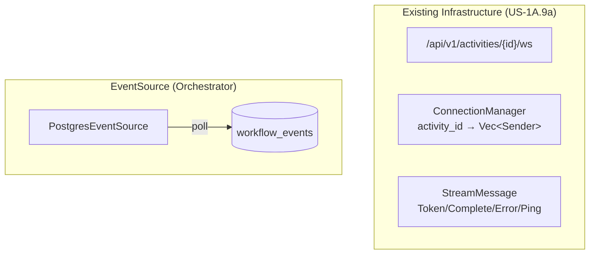
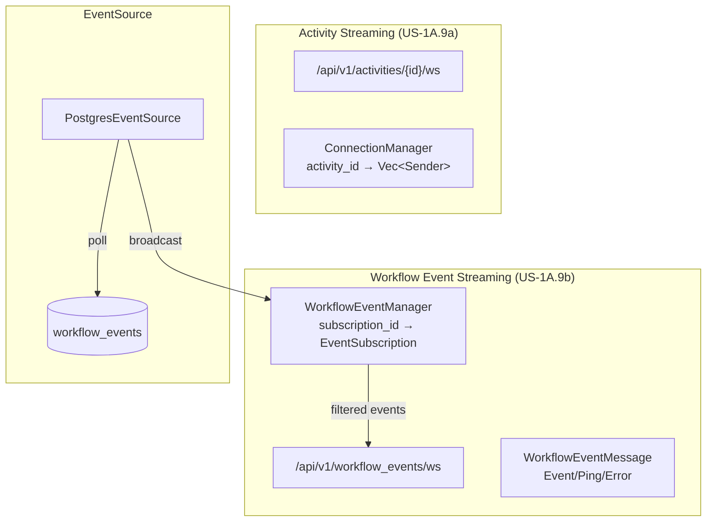
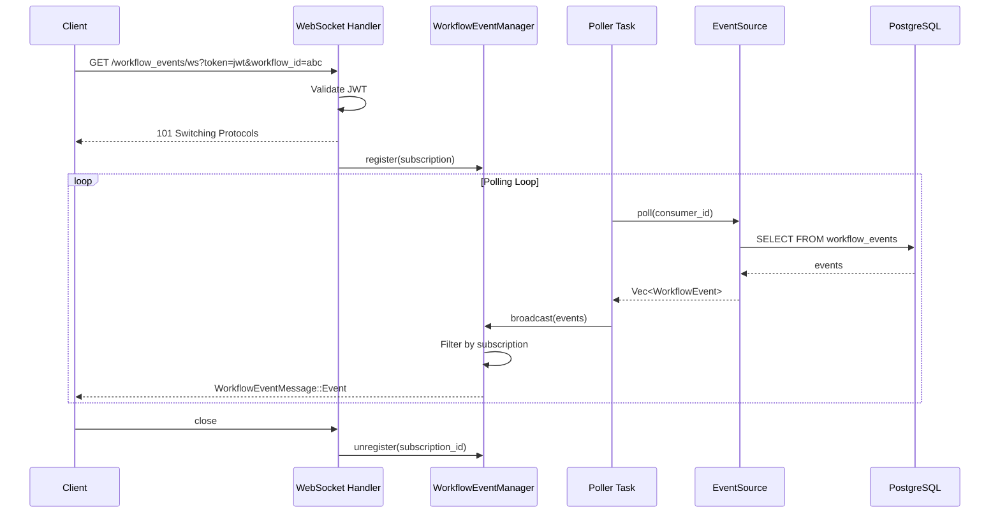
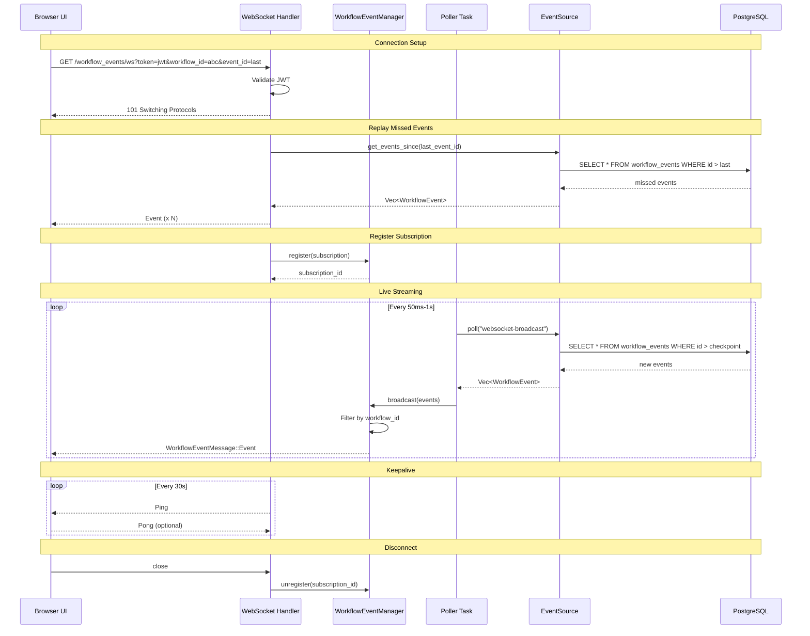

# US-1A.9b: WebSocket Streaming for Workflow Events

## Status: 📋 Post-MVP (Planned)

## Overview

Real-time streaming of workflow execution events via WebSocket, enabling UIs to show live progress without polling. This builds on the existing WebSocket infrastructure (US-1A.9a) but operates at the workflow event level rather than activity token level.

## User Story

**As** an AI startup engineer
**I want** real-time workflow execution updates via WebSocket
**So that** my UI can show live progress without polling

## Requirements (from mvp-requirements.md)

| Requirement                     | Description                                                                                   |
|---------------------------------|-----------------------------------------------------------------------------------------------|
| Subscribe to all workflows      | `GET /api/v1/workflow_events/ws`                                                              |
| Subscribe to specific workflows | `GET /api/v1/workflow_events/ws?workflow_id=id1,id2...`                                       |
| Filter by event type            | `GET /api/v1/workflow_events/ws?event_type=WorkflowCreated,...`                               |
| Event types (PascalCase)        | `WorkflowCreated`, `ActivityScheduled`, `ActivityCompleted`, `WorkflowCompleted`, `ActivityFailed`, `WorkflowFailed` |
| Event payload                   | `{event_type, workflow_id, activity_key, timestamp, payload}`                                 |
| Authentication                  | Bearer token in query parameter (`?token=...`)                             |
| Reconnection support            | Last event ID for replay (`?event_id=...`)                                                    |

## Architecture

### Current State



### Target State



### Event Flow



## Design Decisions

### 1. Separate from Activity Streaming

The existing `ConnectionManager` is keyed by `activity_id` and broadcasts `StreamMessage` (Token/Complete/Error). Workflow event streaming has different semantics:

| Aspect              | Activity Streaming (US-1A.9a)       | Workflow Events (US-1A.9b)              |
|---------------------|-------------------------------------|-----------------------------------------|
| Key                 | Single activity_id                  | Optional workflow_id(s), event_type(s)  |
| Message type        | StreamMessage (Token, Complete)     | WorkflowEventMessage                    |
| Source              | Worker HTTP posts                   | EventSource polling                     |
| Subscription model  | 1 activity per connection           | Many workflows per connection           |
| Replay support      | No                                  | Yes (event_id checkpoint)               |

**Decision**: Create a new `WorkflowEventManager` rather than extending `ConnectionManager`.

### 2. Consumer ID Strategy

EventSource uses `consumer_id` to track polling position. For WebSocket clients:

- **Option A**: One consumer per WebSocket connection → Many consumers, each tracks position
- **Option B**: One shared consumer, broadcast to all → Single consumer, filter client-side
- **Option C**: Hybrid - shared polling, per-subscription filtering and checkpointing

**Decision**: Option C - A single poller task polls events and broadcasts to `WorkflowEventManager`, which filters per subscription. Each subscription tracks its own `last_event_id` for reconnection replay.

### 3. Authentication Strategy

WebSocket upgrade requests cannot include custom headers from browser JavaScript.

**Decision**: Query parameter `?token=<jwt>`, validated before upgrade (consistent with activity streaming US-1A.9a).

### 4. Backpressure Handling

If a client cannot keep up with event rate:

1. Buffer events up to limit (e.g., 1000 events)
2. Drop oldest events when buffer full
3. Disconnect slow clients with error message

**Decision**: Buffer up to 1000 events per subscription. When full, disconnect with error explaining the client is too slow.

## Implementation Plan

### Phase 1: Core Types and Messages

**Files to create/modify:**

1. **`api/src/websocket/workflow_events.rs`** (new)
   - `WorkflowEventMessage` enum:
     ```rust
     pub enum WorkflowEventMessage {
         Event {
             event_type: String,      // PascalCase
             workflow_id: Uuid,
             activity_key: Option<String>,
             timestamp: DateTime<Utc>,
             payload: Value,
             event_id: Uuid,          // For replay
         },
         Ping { timestamp: DateTime<Utc> },
         Error { code: String, message: String },
     }
     ```
   - `EventSubscription` struct:
     ```rust
     pub struct EventSubscription {
         pub id: Uuid,
         pub workflow_ids: Option<HashSet<Uuid>>,   // None = all workflows
         pub event_types: Option<HashSet<String>>,  // None = all types
         pub last_event_id: Option<Uuid>,           // For replay
         pub sender: UnboundedSender<String>,
     }
     ```

2. **`api/src/websocket/mod.rs`**
   - Export new `workflow_events` module

### Phase 2: WorkflowEventManager

**Files to create/modify:**

1. **`api/src/websocket/workflow_event_manager.rs`** (new)
   - Manages active subscriptions
   - Thread-safe with `Arc<RwLock<HashMap<Uuid, EventSubscription>>>`
   - Methods:
     - `register(subscription) -> SubscriptionId`
     - `unregister(subscription_id)`
     - `broadcast(events: Vec<WorkflowEvent>)` - filters and sends to matching subscriptions
     - `subscription_count() -> usize`
   - Handles backpressure (disconnect slow clients)

2. **`api/src/state.rs`**
   - Add `workflow_event_manager: WorkflowEventManager` to `AppState`

### Phase 3: Polling Task

**Files to create/modify:**

1. **`api/src/tasks/workflow_event_poller.rs`** (new)
   - Background task that:
     - Polls `EventSource` on interval (adaptive backoff: 50ms-1s)
     - Only runs when subscriptions exist (check `subscription_count() > 0`)
     - Broadcasts events to `WorkflowEventManager`
     - Uses dedicated consumer_id: `"websocket-broadcast"`
   - Graceful shutdown via `CancellationToken`

2. **`api/src/tasks/mod.rs`** (new or extend)
   - Export poller task
   - `spawn_workflow_event_poller(state, shutdown_token)`

3. **`api/src/lib.rs`** or startup code
   - Spawn poller task on server start

### Phase 4: WebSocket Handler

**Files to create/modify:**

1. **`api/src/handlers/workflow_events_ws.rs`** (new)
   - Parse query parameters:
     - `token`: JWT
     - `workflow_id`: Comma-separated UUIDs (optional)
     - `event_type`: Comma-separated event types (optional)
     - `event_id`: Last event ID for replay (optional)
   - Validate token (query param)
   - Register subscription with `WorkflowEventManager`
   - Handle replay if `event_id` provided (query events since that ID)
   - Forward events from subscription channel to WebSocket
   - Ping/pong for keepalive (every 30s)
   - Cleanup on disconnect

2. **`api/src/handlers/mod.rs`**
   - Export `workflow_events_ws` handler

### Phase 5: Route Registration

**Files to modify:**

1. **`api/src/routes.rs`**
   - Add public route (auth via query param):
     ```rust
     .route("/api/v1/workflow_events/ws", get(handlers::workflow_events_ws::handler))
     ```

### Phase 6: Replay Support

**Files to modify:**

1. **`core/src/events/mod.rs`** (EventSource trait)
   - Add method: `get_events_since(event_id: Uuid, limit: usize) -> Vec<WorkflowEvent>`

2. **`core/src/events/postgres_event_source.rs`**
   - Implement `get_events_since` using:
     ```sql
     SELECT * FROM workflow_events
     WHERE id > $1
     ORDER BY id ASC
     LIMIT $2
     ```

3. **`api/src/handlers/workflow_events_ws.rs`**
   - On connection with `event_id` param, fetch and send missed events before starting live stream

## API Specification

### Endpoint

```
GET /api/v1/workflow_events/ws
```

### Query Parameters

| Parameter     | Type         | Required | Description                                 |
|---------------|--------------|----------|---------------------------------------------|
| `token`       | string       | Yes      | JWT Bearer token                            |
| `workflow_id` | string (CSV) | No       | Filter to specific workflow IDs             |
| `event_type`  | string (CSV) | No       | Filter to specific event types              |
| `event_id`    | UUID         | No       | Replay events after this ID on reconnection |

### Message Protocol

**Server → Client:**

```json
// Event message
{
  "type": "Event",
  "event_type": "ActivityCompleted",
  "workflow_id": "550e8400-e29b-41d4-a716-446655440000",
  "activity_key": "step_1",
  "timestamp": "2024-01-15T10:30:00Z",
  "payload": { "result": "..." },
  "event_id": "660e8400-e29b-41d4-a716-446655440001"
}

// Ping message (keepalive)
{
  "type": "Ping",
  "timestamp": "2024-01-15T10:30:30Z"
}

// Error message
{
  "type": "Error",
  "code": "SLOW_CLIENT",
  "message": "Client too slow, disconnecting"
}
```

**Client → Server:**

```json
// Pong response (optional, for RTT measurement)
{
  "type": "Pong",
  "timestamp": "2024-01-15T10:30:30Z"
}
```

### Event Types

| Event Type           | Description                          | Payload                              |
|----------------------|--------------------------------------|--------------------------------------|
| `WorkflowCreated`    | Workflow was created                 | Workflow definition                  |
| `WorkflowUpdated`    | Workflow metadata updated            | Updated fields                       |
| `ActivityScheduled`  | Activity queued for execution        | Activity key, parameters             |
| `ActivityCompleted`  | Activity finished successfully       | Activity key, result                 |
| `ActivityFailed`     | Activity failed                      | Activity key, error details          |
| `WorkflowCompleted`  | Workflow finished successfully       | Final output                         |
| `WorkflowFailed`     | Workflow failed                      | Error details                        |

## Error Handling

| Scenario                   | Response                                        |
|----------------------------|-------------------------------------------------|
| Missing token              | HTTP 401 before upgrade                         |
| Invalid/expired JWT        | HTTP 401 before upgrade                         |
| Invalid workflow_id format | HTTP 400 before upgrade                         |
| Invalid event_type         | HTTP 400 before upgrade                         |
| Server shutdown            | Close with 1001 (Going Away) + graceful message |
| Client too slow            | Close with 4002 (Too Slow) + error message      |
| Internal error             | Close with 1011 (Internal Error) + error message|

## Testing Strategy

### Unit Tests

1. `WorkflowEventMessage` serialization/deserialization
2. `EventSubscription` filtering logic
3. `WorkflowEventManager` registration/broadcast

### Integration Tests

1. WebSocket connection establishment with token
2. Query parameter filtering (workflow_id, event_type)
3. Event broadcast to subscribed clients
4. Replay on reconnection with event_id
5. Backpressure disconnection
6. Multiple concurrent subscriptions

### Load Tests (Post-MVP)

1. 1000 concurrent WebSocket connections
2. 10,000 events/second broadcast rate
3. Mixed subscription patterns

## Dependencies

| Dependency | Purpose                                      |
|------------|----------------------------------------------|
| tokio      | Async runtime, channels                      |
| axum       | WebSocket upgrade, routing                   |
| serde_json | Message serialization                        |
| uuid       | Subscription and event IDs                   |
| chrono     | Timestamps                                   |

## File Summary

| File                                              | Action | Purpose                                |
|---------------------------------------------------|--------|----------------------------------------|
| `api/src/websocket/workflow_events.rs`            | Create | Message types, subscription struct     |
| `api/src/websocket/workflow_event_manager.rs`     | Create | Subscription management                |
| `api/src/websocket/mod.rs`                        | Modify | Export new modules                     |
| `api/src/tasks/workflow_event_poller.rs`          | Create | Background polling task                |
| `api/src/tasks/mod.rs`                            | Create | Task exports                           |
| `api/src/handlers/workflow_events_ws.rs`          | Create | WebSocket handler                      |
| `api/src/handlers/mod.rs`                         | Modify | Export handler                         |
| `api/src/routes.rs`                               | Modify | Add route                              |
| `api/src/state.rs`                                | Modify | Add WorkflowEventManager               |
| `core/src/events/mod.rs`                          | Modify | Add get_events_since                   |
| `core/src/events/postgres_event_source.rs`        | Modify | Implement get_events_since             |

## Sequence Diagram: Full Flow



## Migration Notes

None required - this is a new feature with no schema changes beyond what EventSource already provides.

## Related Documents

- [US-1A.9a: WebSocket Infrastructure](./US-1A.9a-websocket-infrastructure.md)
- [US-7.1: Token Streaming](./US-7.1-token-streaming.md)
- [Architecture](../architecture.md)
