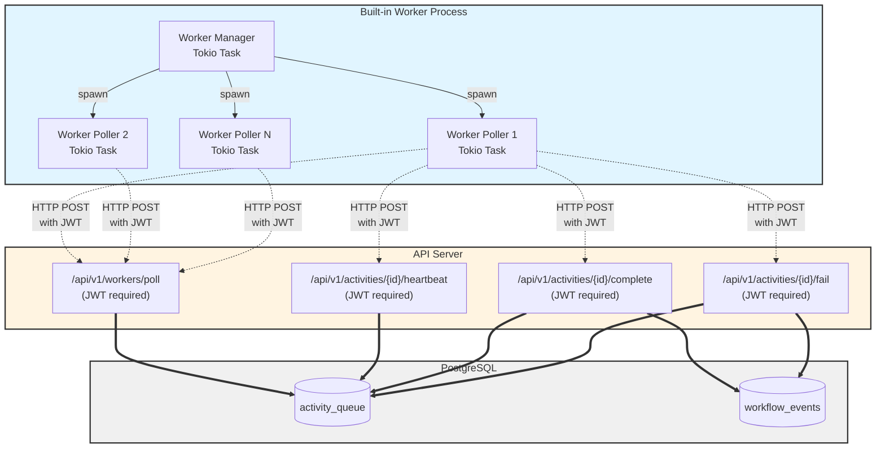

# Implementation Plan: US-1B.1 Built-In Worker

**Epic**: 1B - Built-In Worker
**User Story**: US-1B.1
**Status**: 📋 Ready for Implementation
**Priority**: P0 (Must Have for MVP)
**Created**: 2025-11-07
**Prerequisites**: US-1A.7 (Worker Activity APIs) - ✅ Implemented

---

## User Story

**As** a platform engineering lead
**I want** multiple workers (built-in and external) to safely poll the activity queue without conflicts
**So that** we can scale horizontally without coordination overhead

### Acceptance Criteria

- Workers poll by activity type (namespace.name) via API endpoints
- PostgreSQL FOR UPDATE SKIP LOCKED prevents conflicts (enforced by API)
- Workers claim activities atomically
- Failed workers release activities for retry
- No external coordination required (Redis, Zookeeper)
- Built-in worker uses same API endpoints as external workers

### Technical Notes

- Built-in worker authenticates via JWT (same as external workers)
- Uses `/api/v1/workers/poll` endpoint for claiming activities
- Uses `/api/v1/activities/{id}/complete` and `/api/v1/activities/{id}/fail` for reporting results
- See architecture.md section on Built-in Worker design tradeoffs

---

## Rationale

The built-in worker provides a complete workflow execution system out of the box while validating that the Worker Activity APIs (US-1A.7) are suitable for real-world use. By making the built-in worker use the same HTTP APIs as external workers, we ensure:

**Benefits**:
- **Code path consistency**: Built-in and external workers execute identical logic
- **Testing leverage**: Built-in worker validates API endpoints under real load
- **Single authentication model**: One auth flow to document and maintain
- **Future-proof**: Easy to separate into standalone service later
- **Dogfooding**: Forces API design to be good enough for internal use

**Trade-offs**:
- **HTTP overhead**: ~1-2ms serialization and localhost network latency per operation
- **Startup dependencies**: API server must be running before worker can start
- **Extra HTTP client**: Worker needs reqwest/http client dependency

**Performance Impact**: The 1-2ms HTTP overhead per activity is negligible compared to:
- Typical activity execution time (seconds to minutes)
- Current ~10ms event polling latency
- MVP target >1,000 workflows/sec (easily achievable with this overhead)

---

## Architecture Reference

Per `docs/architecture.md` (Built-in Worker):



**Worker Execution Flow**:
1. Worker manager spawns N worker poller tasks
2. Each poller obtains JWT token from auth service
3. Pollers call `POST /api/v1/workers/poll` with Bearer token (JWT required)
4. API claims activities from activity_queue using FOR UPDATE SKIP LOCKED
5. Worker executes activity (invokes activity implementation)
6. Worker sends periodic heartbeats via `POST /api/v1/activities/{id}/heartbeat` (JWT required)
   - API updates activity_queue heartbeat timestamp
7. Worker posts completion via `POST /api/v1/activities/{id}/complete` (JWT required)
   - API updates activity_queue status
   - API publishes ActivityCompleted event to workflow_events
8. Orchestrator picks up event from workflow_events and continues workflow

**Data Store Usage by Endpoint**:
- `POST /api/v1/workers/poll` → activity_queue (claim activities)
- `POST /api/v1/activities/{id}/heartbeat` → activity_queue (update heartbeat)
- `POST /api/v1/activities/{id}/complete` → activity_queue + workflow_events
- `POST /api/v1/activities/{id}/fail` → activity_queue + workflow_events

---

## Implementation Components

### Component 1: Worker Configuration

**Location**: `worker/src/config.rs` (new file in new crate)

**Responsibilities**:
1. Define worker configuration structure
2. Support environment variables and CLI flags
3. Configure activity types, concurrency, polling interval

**Implementation**:

```rust
use serde::{Deserialize, Serialize};
use std::time::Duration;

/// Worker configuration
#[derive(Debug, Clone, Serialize, Deserialize)]
pub struct WorkerConfig {
    /// API server base URL
    pub api_url: String,

    /// Worker unique identifier
    pub worker_id: String,

    /// Activity types this worker can execute (namespace.name format)
    pub activity_types: Vec<String>,

    /// Maximum number of activities to poll per request
    pub max_activities_per_poll: usize,

    /// Polling interval when no activities available
    pub poll_interval: Duration,

    /// Number of concurrent worker tasks
    pub concurrency: usize,

    /// Activity execution timeout (default)
    pub activity_timeout: Duration,

    /// Heartbeat interval for long-running activities
    pub heartbeat_interval: Duration,

    /// OAuth client credentials for authentication
    pub client_id: String,
    pub client_secret: String,
}

impl Default for WorkerConfig {
    fn default() -> Self {
        Self {
            api_url: "http://localhost:8080".to_string(),
            worker_id: format!("worker_{}", uuid::Uuid::now_v7()),
            activity_types: vec!["default.echo".to_string()],
            max_activities_per_poll: 10,
            poll_interval: Duration::from_millis(100),
            concurrency: 4,
            activity_timeout: Duration::from_secs(300),
            heartbeat_interval: Duration::from_secs(30),
            client_id: "worker_client".to_string(),
            client_secret: "".to_string(),
        }
    }
}

impl WorkerConfig {
    /// Load configuration from environment variables
    pub fn from_env() -> Result<Self, ConfigError> {
        let mut config = Self::default();

        if let Ok(url) = std::env::var("STREAMFLOW_API_URL") {
            config.api_url = url;
        }

        if let Ok(id) = std::env::var("STREAMFLOW_WORKER_ID") {
            config.worker_id = id;
        }

        if let Ok(types) = std::env::var("STREAMFLOW_ACTIVITY_TYPES") {
            config.activity_types = types.split(',').map(|s| s.trim().to_string()).collect();
        }

        if let Ok(concurrency) = std::env::var("STREAMFLOW_WORKER_CONCURRENCY") {
            config.concurrency = concurrency.parse().map_err(|_| ConfigError::InvalidConcurrency)?;
        }

        if let Ok(client_id) = std::env::var("STREAMFLOW_CLIENT_ID") {
            config.client_id = client_id;
        }

        if let Ok(client_secret) = std::env::var("STREAMFLOW_CLIENT_SECRET") {
            config.client_secret = client_secret;
        }

        config.validate()?;
        Ok(config)
    }

    /// Validate configuration
    fn validate(&self) -> Result<(), ConfigError> {
        if self.activity_types.is_empty() {
            return Err(ConfigError::NoActivityTypes);
        }

        for activity_type in &self.activity_types {
            if !activity_type.contains('.') {
                return Err(ConfigError::InvalidActivityType(activity_type.clone()));
            }
        }

        if self.concurrency == 0 {
            return Err(ConfigError::InvalidConcurrency);
        }

        if self.client_secret.is_empty() {
            return Err(ConfigError::MissingClientSecret);
        }

        Ok(())
    }
}

#[derive(Debug, thiserror::Error)]
pub enum ConfigError {
    #[error("No activity types configured")]
    NoActivityTypes,

    #[error("Invalid activity type format: {0} (must be namespace.name)")]
    InvalidActivityType(String),

    #[error("Invalid concurrency value (must be > 0)")]
    InvalidConcurrency,

    #[error("Missing client secret (STREAMFLOW_CLIENT_SECRET required)")]
    MissingClientSecret,
}
```

---

### Component 2: HTTP Client for API Communication

**Location**: `worker/src/client.rs`

**Responsibilities**:
1. HTTP client for Worker Activity APIs
2. Authentication token management (obtain and refresh)
3. Request/response serialization
4. Error handling and retries

**Implementation**:

```rust
use anyhow::{Context, Result};
use reqwest::{Client as HttpClient, StatusCode};
use serde::{Deserialize, Serialize};
use serde_json::Value;
use std::sync::Arc;
use tokio::sync::RwLock;
use uuid::Uuid;

/// API client for worker operations
#[derive(Clone)]
pub struct WorkerApiClient {
    http: HttpClient,
    api_url: String,
    client_id: String,
    client_secret: String,
    token: Arc<RwLock<Option<String>>>,
}

impl WorkerApiClient {
    pub fn new(api_url: String, client_id: String, client_secret: String) -> Self {
        Self {
            http: HttpClient::new(),
            api_url,
            client_id,
            client_secret,
            token: Arc::new(RwLock::new(None)),
        }
    }

    /// Obtain access token via OAuth client credentials flow
    async fn obtain_token(&self) -> Result<String> {
        #[derive(Serialize)]
        struct TokenRequest {
            grant_type: String,
            client_id: String,
            client_secret: String,
        }

        #[derive(Deserialize)]
        struct TokenResponse {
            access_token: String,
        }

        let response = self
            .http
            .post(format!("{}/api/v1/oauth/token", self.api_url))
            .json(&TokenRequest {
                grant_type: "client_credentials".to_string(),
                client_id: self.client_id.clone(),
                client_secret: self.client_secret.clone(),
            })
            .send()
            .await
            .context("Failed to request access token")?;

        if !response.status().is_success() {
            let status = response.status();
            let body = response.text().await.unwrap_or_default();
            anyhow::bail!("Token request failed: {} - {}", status, body);
        }

        let token_response: TokenResponse = response
            .json()
            .await
            .context("Failed to parse token response")?;

        Ok(token_response.access_token)
    }

    /// Get current token or obtain new one
    async fn get_token(&self) -> Result<String> {
        let token_lock = self.token.read().await;
        if let Some(token) = token_lock.as_ref() {
            return Ok(token.clone());
        }
        drop(token_lock);

        // Token not available, obtain new one
        let new_token = self.obtain_token().await?;
        let mut token_lock = self.token.write().await;
        *token_lock = Some(new_token.clone());
        Ok(new_token)
    }

    /// Poll for activities
    pub async fn poll_activities(
        &self,
        worker_id: &str,
        activity_types: Vec<String>,
        max_activities: usize,
    ) -> Result<PollActivitiesResponse> {
        let token = self.get_token().await?;

        #[derive(Serialize)]
        struct PollRequest {
            activity_types: Vec<String>,
            worker_id: String,
            max_activities: usize,
        }

        let response = self
            .http
            .post(format!("{}/api/v1/workers/poll", self.api_url))
            .bearer_auth(&token)
            .json(&PollRequest {
                activity_types,
                worker_id: worker_id.to_string(),
                max_activities,
            })
            .send()
            .await
            .context("Failed to poll activities")?;

        // Handle 401 by refreshing token
        if response.status() == StatusCode::UNAUTHORIZED {
            tracing::warn!("Token expired, obtaining new token");
            let mut token_lock = self.token.write().await;
            *token_lock = None;
            drop(token_lock);
            // Retry once with new token
            return self.poll_activities(worker_id, activity_types, max_activities).await;
        }

        if !response.status().is_success() {
            let status = response.status();
            let body = response.text().await.unwrap_or_default();
            anyhow::bail!("Poll failed: {} - {}", status, body);
        }

        let poll_response: PollActivitiesResponse = response
            .json()
            .await
            .context("Failed to parse poll response")?;

        Ok(poll_response)
    }

    /// Send heartbeat for activity
    pub async fn heartbeat(&self, activity_id: Uuid, worker_id: &str) -> Result<()> {
        let token = self.get_token().await?;

        #[derive(Serialize)]
        struct HeartbeatRequest {
            worker_id: String,
        }

        let response = self
            .http
            .post(format!("{}/api/v1/activities/{}/heartbeat", self.api_url, activity_id))
            .bearer_auth(&token)
            .json(&HeartbeatRequest {
                worker_id: worker_id.to_string(),
            })
            .send()
            .await
            .context("Failed to send heartbeat")?;

        if response.status() == StatusCode::UNAUTHORIZED {
            let mut token_lock = self.token.write().await;
            *token_lock = None;
            drop(token_lock);
            return self.heartbeat(activity_id, worker_id).await;
        }

        if !response.status().is_success() {
            let status = response.status();
            let body = response.text().await.unwrap_or_default();
            anyhow::bail!("Heartbeat failed: {} - {}", status, body);
        }

        Ok(())
    }

    /// Complete activity successfully
    pub async fn complete_activity(
        &self,
        activity_id: Uuid,
        worker_id: &str,
        output: Value,
        cost_usd: Option<f64>,
    ) -> Result<()> {
        let token = self.get_token().await?;

        #[derive(Serialize)]
        struct CompleteRequest {
            worker_id: String,
            output: Value,
            #[serde(skip_serializing_if = "Option::is_none")]
            cost_usd: Option<f64>,
        }

        let response = self
            .http
            .post(format!("{}/api/v1/activities/{}/complete", self.api_url, activity_id))
            .bearer_auth(&token)
            .json(&CompleteRequest {
                worker_id: worker_id.to_string(),
                output,
                cost_usd,
            })
            .send()
            .await
            .context("Failed to complete activity")?;

        if response.status() == StatusCode::UNAUTHORIZED {
            let mut token_lock = self.token.write().await;
            *token_lock = None;
            drop(token_lock);
            return self.complete_activity(activity_id, worker_id, output, cost_usd).await;
        }

        if !response.status().is_success() {
            let status = response.status();
            let body = response.text().await.unwrap_or_default();
            anyhow::bail!("Complete failed: {} - {}", status, body);
        }

        Ok(())
    }

    /// Fail activity
    pub async fn fail_activity(
        &self,
        activity_id: Uuid,
        worker_id: &str,
        error_code: String,
        error_message: String,
        retryable: bool,
    ) -> Result<()> {
        let token = self.get_token().await?;

        #[derive(Serialize)]
        struct FailRequest {
            worker_id: String,
            error: ActivityError,
        }

        #[derive(Serialize)]
        struct ActivityError {
            code: String,
            message: String,
            retryable: bool,
        }

        let response = self
            .http
            .post(format!("{}/api/v1/activities/{}/fail", self.api_url, activity_id))
            .bearer_auth(&token)
            .json(&FailRequest {
                worker_id: worker_id.to_string(),
                error: ActivityError {
                    code: error_code,
                    message: error_message,
                    retryable,
                },
            })
            .send()
            .await
            .context("Failed to fail activity")?;

        if response.status() == StatusCode::UNAUTHORIZED {
            let mut token_lock = self.token.write().await;
            *token_lock = None;
            drop(token_lock);
            return self.fail_activity(activity_id, worker_id, error_code, error_message, retryable).await;
        }

        if !response.status().is_success() {
            let status = response.status();
            let body = response.text().await.unwrap_or_default();
            anyhow::bail!("Fail failed: {} - {}", status, body);
        }

        Ok(())
    }
}

#[derive(Debug, Deserialize)]
pub struct PollActivitiesResponse {
    pub activities: Vec<PendingActivity>,
    pub count: usize,
}

#[derive(Debug, Deserialize)]
pub struct PendingActivity {
    pub activity_id: Uuid,
    pub workflow_id: Uuid,
    pub activity_key: String,
    pub namespace: String,
    pub name: String,
    pub parameters: Value,
    pub settings: Option<Value>,
    pub timeout_seconds: Option<i64>,
}
```

---

### Component 3: Activity Registry and Execution

**Location**: `worker/src/registry.rs`

**Responsibilities**:
1. Register activity implementations
2. Map activity types (namespace.name) to implementations
3. Execute activities with timeout and error handling

**Implementation**:

```rust
use anyhow::Result;
use async_trait::async_trait;
use serde_json::Value;
use std::collections::HashMap;
use std::sync::Arc;
use std::time::Duration;

/// Activity implementation trait
///
/// All activity implementations must implement this trait.
#[async_trait]
pub trait ActivityImpl: Send + Sync {
    /// Execute the activity
    ///
    /// # Arguments
    /// * `parameters` - Activity input parameters
    ///
    /// # Returns
    /// * `Ok(output)` - Activity output on success
    /// * `Err(error)` - Activity error on failure
    async fn execute(&self, parameters: Value) -> Result<Value>;

    /// Get activity name
    fn name(&self) -> &str;

    /// Get activity namespace
    fn namespace(&self) -> &str;
}

/// Activity registry
///
/// Manages activity implementations and executes them.
pub struct ActivityRegistry {
    implementations: HashMap<String, Arc<dyn ActivityImpl>>,
}

impl ActivityRegistry {
    pub fn new() -> Self {
        Self {
            implementations: HashMap::new(),
        }
    }

    /// Register an activity implementation
    pub fn register(&mut self, implementation: Arc<dyn ActivityImpl>) {
        let key = format!("{}.{}", implementation.namespace(), implementation.name());
        tracing::info!("Registering activity: {}", key);
        self.implementations.insert(key, implementation);
    }

    /// Get all registered activity types
    pub fn activity_types(&self) -> Vec<String> {
        self.implementations.keys().cloned().collect()
    }

    /// Execute an activity
    ///
    /// Returns activity output or error.
    pub async fn execute(
        &self,
        namespace: &str,
        name: &str,
        parameters: Value,
        timeout: Duration,
    ) -> Result<Value> {
        let key = format!("{}.{}", namespace, name);

        let implementation = self
            .implementations
            .get(&key)
            .ok_or_else(|| anyhow::anyhow!("Activity implementation not found: {}", key))?;

        // Execute with timeout
        let result = tokio::time::timeout(timeout, implementation.execute(parameters)).await;

        match result {
            Ok(Ok(output)) => Ok(output),
            Ok(Err(err)) => Err(err),
            Err(_) => Err(anyhow::anyhow!("Activity execution timed out after {:?}", timeout)),
        }
    }
}

impl Default for ActivityRegistry {
    fn default() -> Self {
        Self::new()
    }
}
```

---

### Component 4: Built-in Activity Implementations (Echo for MVP)

**Location**: `worker/src/activities/echo.rs`

**Responsibilities**:
1. Provide a simple echo activity for testing
2. Demonstrate activity implementation pattern

**Implementation**:

```rust
use crate::registry::ActivityImpl;
use anyhow::Result;
use async_trait::async_trait;
use serde_json::Value;

/// Echo activity (for testing)
///
/// Returns the input parameters as output.
pub struct EchoActivity;

#[async_trait]
impl ActivityImpl for EchoActivity {
    async fn execute(&self, parameters: Value) -> Result<Value> {
        tracing::debug!("Executing echo activity with parameters: {:?}", parameters);

        // Simulate some work
        tokio::time::sleep(tokio::time::Duration::from_millis(10)).await;

        Ok(parameters)
    }

    fn name(&self) -> &str {
        "echo"
    }

    fn namespace(&self) -> &str {
        "default"
    }
}
```

**Location**: `worker/src/activities/mod.rs`

```rust
mod echo;

pub use echo::EchoActivity;
```

---

### Component 5: Worker Poller Task

**Location**: `worker/src/poller.rs`

**Responsibilities**:
1. Poll for activities continuously
2. Execute claimed activities
3. Send heartbeats for long-running activities
4. Report completion or failure
5. Handle errors and retries

**Implementation**:

```rust
use crate::client::{PendingActivity, WorkerApiClient};
use crate::config::WorkerConfig;
use crate::registry::ActivityRegistry;
use anyhow::{Context, Result};
use std::sync::Arc;
use std::time::Duration;

/// Worker poller task
///
/// Continuously polls for activities, executes them, and reports results.
pub struct WorkerPoller {
    config: WorkerConfig,
    client: WorkerApiClient,
    registry: Arc<ActivityRegistry>,
}

impl WorkerPoller {
    pub fn new(
        config: WorkerConfig,
        client: WorkerApiClient,
        registry: Arc<ActivityRegistry>,
    ) -> Self {
        Self {
            config,
            client,
            registry,
        }
    }

    /// Run the poller loop
    pub async fn run(&self) -> Result<()> {
        tracing::info!(
            worker_id = %self.config.worker_id,
            activity_types = ?self.config.activity_types,
            "Starting worker poller"
        );

        loop {
            match self.poll_and_execute().await {
                Ok(executed) => {
                    if executed == 0 {
                        // No activities available, sleep before next poll
                        tokio::time::sleep(self.config.poll_interval).await;
                    }
                    // If activities were executed, poll immediately for more
                }
                Err(err) => {
                    tracing::error!("Poller error: {:?}", err);
                    // Sleep before retry on error
                    tokio::time::sleep(Duration::from_secs(5)).await;
                }
            }
        }
    }

    /// Poll for activities and execute them
    ///
    /// Returns number of activities executed.
    async fn poll_and_execute(&self) -> Result<usize> {
        // Poll for activities
        let response = self
            .client
            .poll_activities(
                &self.config.worker_id,
                self.config.activity_types.clone(),
                self.config.max_activities_per_poll,
            )
            .await
            .context("Failed to poll activities")?;

        if response.count == 0 {
            return Ok(0);
        }

        tracing::info!(
            worker_id = %self.config.worker_id,
            count = response.count,
            "Claimed activities"
        );

        // Execute each activity
        for activity in response.activities {
            self.execute_activity(activity).await;
        }

        Ok(response.count)
    }

    /// Execute a single activity
    async fn execute_activity(&self, activity: PendingActivity) {
        tracing::info!(
            activity_id = %activity.activity_id,
            activity_key = %activity.activity_key,
            namespace = %activity.namespace,
            name = %activity.name,
            "Executing activity"
        );

        // Determine timeout
        let timeout = if let Some(seconds) = activity.timeout_seconds {
            Duration::from_secs(seconds as u64)
        } else {
            self.config.activity_timeout
        };

        // Spawn heartbeat task for long-running activities
        let heartbeat_handle = if timeout > Duration::from_secs(60) {
            Some(self.spawn_heartbeat_task(activity.activity_id))
        } else {
            None
        };

        // Execute activity
        let result = self
            .registry
            .execute(
                &activity.namespace,
                &activity.name,
                activity.parameters,
                timeout,
            )
            .await;

        // Report result BEFORE canceling heartbeat to avoid race condition
        // (see Risk section: if we abort heartbeat first, completion API call delay
        // could allow another worker to reclaim the activity as stale)
        match result {
            Ok(output) => {
                if let Err(err) = self
                    .client
                    .complete_activity(activity.activity_id, &self.config.worker_id, output, None)
                    .await
                {
                    tracing::error!(
                        activity_id = %activity.activity_id,
                        error = ?err,
                        "Failed to report activity completion"
                    );
                }
            }
            Err(err) => {
                tracing::warn!(
                    activity_id = %activity.activity_id,
                    error = %err,
                    "Activity execution failed"
                );

                if let Err(err) = self
                    .client
                    .fail_activity(
                        activity.activity_id,
                        &self.config.worker_id,
                        "EXECUTION_ERROR".to_string(),
                        err.to_string(),
                        true, // Retryable by default
                    )
                    .await
                {
                    tracing::error!(
                        activity_id = %activity.activity_id,
                        error = ?err,
                        "Failed to report activity failure"
                    );
                }
            }
        }

        // Cancel heartbeat task AFTER reporting completion
        // This ensures activity is marked completed in database before heartbeats stop,
        // preventing race condition where activity could be reclaimed as stale
        if let Some(handle) = heartbeat_handle {
            handle.abort();
        }
    }

    /// Spawn heartbeat task
    ///
    /// Sends periodic heartbeats until cancelled.
    fn spawn_heartbeat_task(&self, activity_id: uuid::Uuid) -> tokio::task::JoinHandle<()> {
        let client = self.client.clone();
        let worker_id = self.config.worker_id.clone();
        let interval = self.config.heartbeat_interval;

        tokio::spawn(async move {
            let mut ticker = tokio::time::interval(interval);
            ticker.set_missed_tick_behavior(tokio::time::MissedTickBehavior::Skip);

            loop {
                ticker.tick().await;

                if let Err(err) = client.heartbeat(activity_id, &worker_id).await {
                    tracing::warn!(
                        activity_id = %activity_id,
                        error = ?err,
                        "Failed to send heartbeat"
                    );
                }
            }
        })
    }
}
```

---

### Component 6: Worker Manager

**Location**: `worker/src/manager.rs`

**Responsibilities**:
1. Spawn multiple worker poller tasks
2. Manage task lifecycle
3. Handle graceful shutdown

**Implementation**:

```rust
use crate::client::WorkerApiClient;
use crate::config::WorkerConfig;
use crate::poller::WorkerPoller;
use crate::registry::ActivityRegistry;
use anyhow::Result;
use std::sync::Arc;
use tokio::task::JoinHandle;

/// Worker manager
///
/// Spawns and manages multiple worker poller tasks.
pub struct WorkerManager {
    config: WorkerConfig,
    registry: Arc<ActivityRegistry>,
}

impl WorkerManager {
    pub fn new(config: WorkerConfig, registry: ActivityRegistry) -> Self {
        Self {
            config,
            registry: Arc::new(registry),
        }
    }

    /// Start worker
    ///
    /// Spawns N worker poller tasks based on config.concurrency.
    pub async fn start(&self) -> Result<Vec<JoinHandle<()>>> {
        tracing::info!(
            worker_id = %self.config.worker_id,
            concurrency = self.config.concurrency,
            "Starting worker manager"
        );

        let client = WorkerApiClient::new(
            self.config.api_url.clone(),
            self.config.client_id.clone(),
            self.config.client_secret.clone(),
        );

        let mut handles = Vec::new();

        for i in 0..self.config.concurrency {
            let poller = WorkerPoller::new(
                self.config.clone(),
                client.clone(),
                Arc::clone(&self.registry),
            );

            let handle = tokio::spawn(async move {
                tracing::info!(poller_id = i, "Starting poller task");
                if let Err(err) = poller.run().await {
                    tracing::error!(poller_id = i, error = ?err, "Poller task failed");
                }
            });

            handles.push(handle);
        }

        tracing::info!("Worker manager started with {} pollers", handles.len());

        Ok(handles)
    }

    /// Stop worker
    ///
    /// Gracefully shuts down all poller tasks.
    pub async fn stop(&self, handles: Vec<JoinHandle<()>>) {
        tracing::info!("Stopping worker manager");

        for handle in handles {
            handle.abort();
        }

        tracing::info!("Worker manager stopped");
    }
}
```

---

### Component 7: Worker Library Entry Point

**Location**: `worker/src/lib.rs`

```rust
pub mod activities;
pub mod client;
pub mod config;
pub mod manager;
pub mod poller;
pub mod registry;

pub use activities::EchoActivity;
pub use client::WorkerApiClient;
pub use config::WorkerConfig;
pub use manager::WorkerManager;
pub use registry::{ActivityImpl, ActivityRegistry};
```

---

### Component 8: Worker Crate Setup

**Location**: `worker/Cargo.toml` (new file)

```toml
[package]
name = "streamflow-worker"
version.workspace = true
edition.workspace = true
authors.workspace = true
license.workspace = true
description = "Built-in activity worker for StreamFlow"

[dependencies]
# Async runtime
tokio = { workspace = true }
async-trait = { workspace = true }

# HTTP client
reqwest = { version = "0.12", features = ["json"] }

# UUID and time
uuid = { workspace = true }

# Serialization
serde = { workspace = true }
serde_json = { workspace = true }

# Error handling
anyhow = { workspace = true }
thiserror = { workspace = true }

# Logging
tracing = { workspace = true }

[dev-dependencies]
tokio-test = "0.4"
mockall = { workspace = true }
```

**Update workspace** `Cargo.toml`:

```toml
[workspace]
members = [
    "core",
    "api",
    "oauth",
    "activity",
    "dashboard",
    "streamflow",
    "worker",  # Add this
]
```

---

## Testing Requirements

### Unit Tests

**File**: `worker/src/client_test.rs`

```rust
#[cfg(test)]
mod tests {
    use super::*;

    #[tokio::test]
    async fn test_client_token_refresh() {
        // Test that client refreshes token on 401
    }

    #[tokio::test]
    async fn test_poll_activities() {
        // Test polling with mock HTTP server
    }

    #[tokio::test]
    async fn test_heartbeat() {
        // Test heartbeat with mock HTTP server
    }

    #[tokio::test]
    async fn test_complete_activity() {
        // Test completion with mock HTTP server
    }

    #[tokio::test]
    async fn test_fail_activity() {
        // Test failure with mock HTTP server
    }
}
```

**File**: `worker/src/registry_test.rs`

```rust
#[cfg(test)]
mod tests {
    use super::*;

    #[tokio::test]
    async fn test_register_activity() {
        // Test activity registration
    }

    #[tokio::test]
    async fn test_execute_activity() {
        // Test activity execution
    }

    #[tokio::test]
    async fn test_activity_timeout() {
        // Test that execution respects timeout
    }
}
```

---

### Integration Tests

**File**: `worker/tests/worker_integration_test.rs`

```rust
use serial_test::serial;
use streamflow_worker::{ActivityRegistry, EchoActivity, WorkerConfig, WorkerManager};
use std::sync::Arc;

#[tokio::test]
#[serial]
async fn test_worker_poll_and_execute_echo() {
    // Setup: Start API server and orchestrator
    // Submit workflow with echo activity
    // Start worker
    // Wait for activity completion
    // Verify output matches input
}

#[tokio::test]
#[serial]
async fn test_worker_concurrency() {
    // Setup: Submit workflow with 10 echo activities
    // Start worker with concurrency=4
    // Verify all 10 activities complete
    // Verify no duplicate execution
}

#[tokio::test]
#[serial]
async fn test_worker_heartbeat() {
    // Setup: Activity that takes 2 minutes
    // Start worker
    // Verify heartbeats sent every 30 seconds
}

#[tokio::test]
#[serial]
async fn test_worker_failure_handling() {
    // Setup: Activity that always fails
    // Start worker
    // Verify failure reported correctly
}
```

---

## Dependencies

**New Dependencies**:
- `reqwest` (0.12) - HTTP client for API communication
- All other dependencies already in workspace

---

## Configuration

### Environment Variables

```bash
# API server URL
STREAMFLOW_API_URL=http://localhost:8080

# Worker identification
STREAMFLOW_WORKER_ID=worker_payments_01

# Activity types (comma-separated)
STREAMFLOW_ACTIVITY_TYPES=payments.authorize,payments.capture

# Worker concurrency
STREAMFLOW_WORKER_CONCURRENCY=4

# OAuth credentials
STREAMFLOW_CLIENT_ID=worker_client
STREAMFLOW_CLIENT_SECRET=secret123
```

---

## Implementation Phases

### Phase 1: Configuration and HTTP Client (P0)
- Implement WorkerConfig with environment variable support
- Implement WorkerApiClient with OAuth token management
- Implement poll, heartbeat, complete, fail methods
- Unit tests for client
- **Estimated Time**: 5 hours

### Phase 2: Activity Registry and Echo Activity (P0)
- Implement ActivityRegistry
- Implement ActivityImpl trait
- Implement EchoActivity
- Unit tests for registry and echo
- **Estimated Time**: 3 hours

### Phase 3: Worker Poller (P0)
- Implement WorkerPoller with poll loop
- Implement activity execution
- Implement heartbeat task spawning
- Implement result reporting
- Unit tests for poller
- **Estimated Time**: 4 hours

### Phase 4: Worker Manager (P0)
- Implement WorkerManager
- Implement concurrent poller spawning
- Implement graceful shutdown
- Unit tests for manager
- **Estimated Time**: 2 hours

### Phase 5: Integration Testing (P0)
- Fix US-1A.7 test failures (OAuth token generation)
- Test worker with real API server
- Test end-to-end workflow execution
- Test concurrent workers
- Test heartbeat mechanism
- Test failure handling
- **Estimated Time**: 5 hours

### Phase 6: Documentation and Cleanup (P0)
- API documentation
- Worker configuration guide
- Activity implementation guide
- Example custom activities
- **Estimated Time**: 2 hours

**Total Estimated Time**: 21 hours (~3 days)

---

## Success Criteria

### Functional Requirements

- ✅ Worker polls for activities via `/api/v1/workers/poll`
- ✅ Worker authenticates with JWT (OAuth client credentials)
- ✅ Worker executes activities using ActivityRegistry
- ✅ Worker sends heartbeats for long-running activities
- ✅ Worker reports completion via `/api/v1/activities/{id}/complete`
- ✅ Worker reports failure via `/api/v1/activities/{id}/fail`
- ✅ Multiple workers can run concurrently without conflicts
- ✅ Worker handles token expiration (401) with refresh
- ✅ Worker recovers from API errors with retry

### Non-Functional Requirements

- ✅ Worker uses same APIs as external workers (consistency)
- ✅ FOR UPDATE SKIP LOCKED prevents race conditions (via API)
- ✅ Configurable via environment variables
- ✅ Graceful shutdown supported
- ✅ Structured logging for debugging
- ✅ Unit and integration tests pass
- ✅ Zero cargo warnings

---

## Documentation Updates

### Architecture Documentation

Update `docs/architecture.md`:

```markdown
## Built-In Worker

The built-in worker provides activity execution out of the box. It:
- Polls for activities via HTTP API (same as external workers)
- Authenticates using OAuth client credentials (JWT)
- Executes registered activity implementations
- Reports results back to API server
- Supports concurrent execution (configurable)

### Worker Architecture

[Include Mermaid diagram from Architecture Reference above]

### Activity Implementation

Custom activities implement the `ActivityImpl` trait:

\`\`\`rust
#[async_trait]
pub trait ActivityImpl: Send + Sync {
    async fn execute(&self, parameters: Value) -> Result<Value>;
    fn name(&self) -> &str;
    fn namespace(&self) -> &str;
}
\`\`\`

Register activities with the worker:

\`\`\`rust
let mut registry = ActivityRegistry::new();
registry.register(Arc::new(MyCustomActivity));
\`\`\`
```

### User Guide

Create `docs/guides/worker-guide.md`:

```markdown
# Worker Guide

## Running the Built-in Worker

The built-in worker executes activities for StreamFlow workflows.

### Configuration

Configure via environment variables:

\`\`\`bash
export STREAMFLOW_API_URL=http://localhost:8080
export STREAMFLOW_WORKER_ID=worker_01
export STREAMFLOW_ACTIVITY_TYPES=payments.authorize,payments.capture
export STREAMFLOW_CLIENT_ID=worker_client
export STREAMFLOW_CLIENT_SECRET=secret123
\`\`\`

### Starting the Worker

\`\`\`bash
streamflow worker
\`\`\`

## Implementing Custom Activities

See [Activity Implementation Guide](activity-implementation.md)
```

---

## Risks and Mitigations

### Risk 1: HTTP Overhead Impact on Performance

**Probability**: Low
**Impact**: Medium

**Mitigation**:
- HTTP overhead (~1-2ms) is negligible for typical activities (seconds to minutes)
- MVP target >1,000 workflows/sec easily achievable
- Post-MVP: Can add internal fast path if needed

### Risk 2: Token Expiration During Activity Execution

**Probability**: Medium
**Impact**: Low

**Mitigation**:
- Client automatically refreshes token on 401
- Completion/failure requests retry once with new token
- Activities complete successfully even if token expires

### Risk 3: Heartbeat Abort Race Condition

**Probability**: Low
**Impact**: Medium

**Description**: If heartbeat task is aborted before completion is reported to API, network delay in the completion API call could allow the activity to be detected as stale and reclaimed by another worker, causing a 409 Conflict error.

**Mitigation**:
- Report completion/failure to API BEFORE aborting heartbeat task
- Once API marks activity as completed, subsequent claim_next() won't reclaim it
- Heartbeat continues briefly after execution but safely fails when activity is already completed
- Implementation: Lines 879-928 in poller.rs component

### Risk 4: Worker Crash Leaves Activities Claimed

**Probability**: Medium
**Impact**: Medium

**Mitigation**:
- Heartbeat timeout detection via claim_next() stale detection (US-1.1)
- Activities released for retry if no heartbeat within timeout_duration
- Workflow eventually completes with retry

### Risk 5: Activity Registry Not Extensible

**Probability**: Low
**Impact**: Medium

**Mitigation**:
- ActivityImpl trait is simple and flexible
- Registry pattern allows easy registration
- Post-MVP: Plugin system for external activities

---

## Future Enhancements (Post-MVP)

### Dynamic Activity Registration
- Load activity implementations from shared libraries
- Hot-reload activities without restart
- Activity marketplace for community contributions

### Activity Batching
- Claim multiple activities in single poll
- Execute activities in parallel within worker
- Reduce polling overhead

### Worker Pool Visualization
- Dashboard showing active workers
- Activity execution status
- Worker health monitoring

### Advanced Error Handling
- Retry with exponential backoff
- Dead-letter queue for permanent failures
- Error categorization and routing

---

## Related User Stories

- **US-1.1**: Activity Queue with Ordering Guarantees (provides activity queue)
- **US-1.2**: Event-Driven Dynamic Scheduling (schedules activities to queue)
- **US-1A.3**: Authentication (provides JWT authentication)
- **US-1A.7**: Worker Activity APIs (provides HTTP endpoints for workers)

---

## Definition of Done

- [ ] WorkerConfig implemented with environment variable support
- [ ] WorkerApiClient implemented (poll, heartbeat, complete, fail)
- [ ] OAuth token management working (obtain and refresh)
- [ ] ActivityRegistry implemented
- [ ] ActivityImpl trait defined
- [ ] EchoActivity implemented
- [ ] WorkerPoller implemented with poll loop
- [ ] Heartbeat task spawning working
- [ ] WorkerManager implemented
- [ ] Concurrent poller spawning working
- [ ] Graceful shutdown working
- [ ] Unit tests passing (client, registry, poller, manager)
- [ ] Integration tests passing (end-to-end workflow execution)
- [ ] US-1A.7 test failures fixed
- [ ] Worker uses same APIs as external workers
- [ ] Multiple workers can run concurrently
- [ ] Zero cargo warnings
- [ ] Documentation updated (architecture, user guide)

---

**Last Updated**: 2025-11-07
**Implementation Status**: Ready to begin
**Next Steps**: Fix US-1A.7 test failures, then implement Phase 1 (Configuration and HTTP Client)
