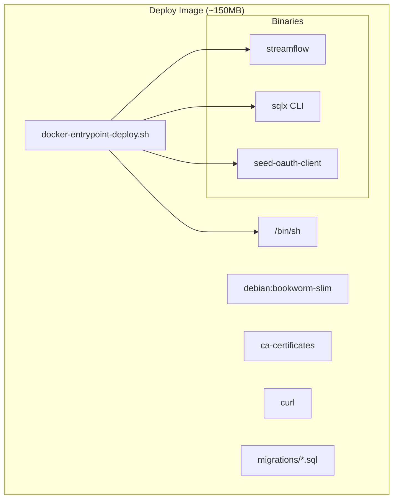
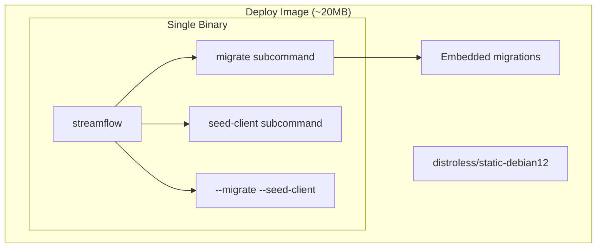

# US-1C.8: Distroless Single-Binary Deployment

**Epic**: 1C - StreamFlow Binary and CLI
**Status**: Ready for Implementation
**Priority**: High (Launch Week 1 infrastructure)
**Estimated Effort**: 2-3 days

---

## User Story

**As** a platform operator
**I want** StreamFlow to deploy as a minimal single-binary container
**So that** I have a smaller attack surface, faster deployments, and can market StreamFlow's lightweight architecture

---

## Background

The current deploy image uses `debian:bookworm-slim` (~80MB) with:
- 3 separate binaries: `streamflow`, `seed-oauth-client`, `sqlx`
- Shell (`/bin/sh`) for entrypoint script
- `ca-certificates` and `curl` packages
- Entrypoint orchestration in shell

**Target**: Single `streamflow` binary on `gcr.io/distroless/static-debian12` (~2MB base)

**Benefits**:
- Image size: ~150-200MB → ~20-25MB (10x reduction)
- No shell = reduced attack surface
- Faster container startup
- Aligns with "lightweight single binary" market positioning
- Debug variant available for troubleshooting

---

## Acceptance Criteria

- [ ] Single `streamflow` binary contains all functionality
- [ ] `streamflow migrate` subcommand runs embedded migrations
- [ ] `streamflow seed-client` subcommand seeds OAuth client
- [ ] `streamflow serve --migrate --seed-client` performs startup sequence (wait for DB, migrate, seed, serve)
- [ ] Deploy image uses `gcr.io/distroless/static-debian12:nonroot`
- [ ] Image size < 30MB
- [ ] No shell required at runtime
- [ ] Health checks work without curl
- [ ] Existing `docker-compose up` workflow unchanged for users

---

## Architecture

### Current State



### Target State



---

## Implementation Plan

### Task 1: Add `migrate` Subcommand (4 hours)

**File**: `streamflow/src/commands/migrate.rs` (new)

**Objective**: Embed SQL migrations using `sqlx::migrate!()` macro, eliminating external `sqlx` CLI dependency.

**Implementation Notes**:

The `sqlx::migrate!()` macro embeds migration files at compile time. This requires:
1. Migrations directory path relative to `Cargo.toml`
2. `SQLX_OFFLINE=true` for builds without database connection

**Subcommand Structure**:
```
streamflow migrate              # Run pending migrations
streamflow migrate --status     # Show migration status
streamflow migrate --dry-run    # Show what would run
```

**Key Implementation Details**:
- Use `sqlx::migrate::Migrator` for programmatic control
- Embed migrations from `../migrations` relative to streamflow crate
- Support `--status` to list applied/pending migrations
- Support `--dry-run` to preview without applying
- Return proper exit codes for CI/CD

**Changes Required**:
1. Create `streamflow/src/commands/migrate.rs`
2. Update `streamflow/src/commands/mod.rs` to export
3. Update `streamflow/src/main.rs` Commands enum
4. Ensure `migrations/` path is correct for embedding

---

### Task 2: Add `seed-client` Subcommand (2 hours)

**File**: `streamflow/src/commands/seed_client.rs` (new)

**Objective**: Move `seed-oauth-client` binary functionality into main CLI.

**Implementation Notes**:

The existing `seed-oauth-client.rs` is only 73 lines. Move logic directly into a subcommand.

**Subcommand Structure**:
```
streamflow seed-client                           # Seed with env vars (skip if exists)
streamflow seed-client --client-id foo           # Override client ID
streamflow seed-client --client-secret bar       # Override secret
streamflow seed-client --force                   # Re-seed even if client exists
```

**Key Implementation Details**:
- Reuse bcrypt hashing logic from existing binary
- Default behavior: skip seeding if client already exists (idempotent)
- Add `--force` flag to delete and re-create client even if it exists
- Read from `STREAMFLOW_CLIENT_ID` and `STREAMFLOW_CLIENT_SECRET` env vars
- Proper error messages for missing configuration

**Changes Required**:
1. Create `streamflow/src/commands/seed_client.rs`
2. Update `streamflow/src/commands/mod.rs`
3. Update `streamflow/src/main.rs` Commands enum
4. Remove `streamflow/src/bin/seed-oauth-client.rs` after verification
5. Update `streamflow/Cargo.toml` to remove `[[bin]]` entry

---

### Task 3: Add `--migrate` and `--seed-client` Flags to `serve` Command (3 hours)

**File**: `streamflow/src/commands/serve.rs` (modify)

**Objective**: Replace shell entrypoint logic with Rust code using granular startup flags.

**Implementation Notes**:

The shell entrypoint performs:
1. Load RSA keys from files (if not in env vars) - already handled by serve command
2. Wait for PostgreSQL to be ready
3. Run migrations
4. Seed OAuth client
5. Start server

**Flag Behavior**:
```
streamflow serve                              # Just start server (assume DB ready)
streamflow serve --migrate                    # Run migrations then serve
streamflow serve --seed-client                # Seed OAuth client then serve
streamflow serve --migrate --seed-client      # Full initialization then serve
streamflow serve --db-connect-timeout 120     # Custom timeout for DB connection
```

**Key Implementation Details**:

1. **Key Loading**: Already handled by config module with `_FILE` fallback for Docker secrets
2. **Wait for Postgres**: Implement retry loop with exponential backoff (`wait_for_postgres()`)
3. **Run Migrations**: Call `migrate::run_migrations()` internally when `--migrate` is set
4. **Seed OAuth**: Call `seed_client::seed_oauth_client()` when `--seed-client` is set (idempotent - skip if exists)
5. **Start Server**: Existing serve logic

**Startup Sequence**:
```rust
if cmd.migrate || cmd.seed_client {
    // Wait for PostgreSQL with retry (exponential backoff)
    let init_pool = wait_for_postgres(&database_url, cmd.db_connect_timeout).await?;

    if cmd.migrate {
        migrate::run_migrations(&init_pool).await?;
    }

    if cmd.seed_client {
        seed_client::seed_oauth_client(&init_pool, &client_id, &client_secret, false).await?;
    }

    init_pool.close().await;
}

// Start server with normal pool configuration
start_server(args).await
```

**Changes Required**:
1. Add `--migrate` flag to `ServeCommand` struct
2. Add `--seed-client` flag to `ServeCommand` struct
3. Add `--db-connect-timeout` flag with default 60 seconds
4. Implement `wait_for_postgres()` with exponential backoff
5. Add internal calls to migrate and seed logic

---

### Task 4: Update Dockerfile for Distroless (2 hours)

**File**: `Dockerfile` (modify deploy stage)

**Objective**: Replace debian-slim with distroless static image.

**Implementation Notes**:

Distroless requires:
- Statically linked binary OR dynamic linking against included libs
- No shell scripts
- Binary as direct entrypoint

**New Deploy Stage**:
```dockerfile
# == DEPLOY ==
# Minimal production image - distroless with single binary
FROM gcr.io/distroless/static-debian12:nonroot AS deploy

# Copy single binary
COPY --from=build /opt/target/release/streamflow /streamflow

# Expose port
EXPOSE 8080

# Direct binary execution (no shell)
ENTRYPOINT ["/streamflow"]
CMD ["serve", "--migrate", "--seed-client"]
```

**Static Linking Considerations**:

The current build uses dynamic linking. Options:
1. **Keep dynamic linking**: Use `distroless/cc-debian12` instead (includes glibc) - adds ~20MB
2. **Static linking with musl**: Requires build toolchain changes
3. **Static linking with glibc**: Complex, not recommended

**Recommendation**: Start with `distroless/cc-debian12` for simplicity, optimize to `static-debian12` + musl later if needed.

**Changes Required**:
1. Update deploy stage base image
2. Remove shell entrypoint script copy
3. Remove sqlx and seed-oauth-client binary copies
4. Remove migrations directory copy (embedded in binary)
5. Update ENTRYPOINT to direct binary execution
6. Test with `docker-compose --profile deploy up`

---

### Task 5: Update docker-compose.yml (1 hour)

**File**: `docker-compose.yml` (modify)

**Objective**: Ensure compose configuration works with new image.

**Key Changes**:
- Remove any shell-dependent health checks
- Update command if needed
- Verify volume mounts still work (secrets)

**Health Check Update**:
```yaml
healthcheck:
  test: ["CMD", "/streamflow", "health"]  # Or use HTTP check
  # Alternative: Use Docker's native HTTP health check
  # test: ["CMD-SHELL", "curl -f http://localhost:8080/health || exit 1"]
  # But we don't have shell! Use:
  test: ["NONE"]  # Disable, rely on orchestrator
  # Or add a health subcommand that exits 0/1
```

**Better Approach**: Add `streamflow health` subcommand that performs HTTP self-check and exits with appropriate code.

---

### Task 6: Add `health` Subcommand (1 hour)

**File**: `streamflow/src/commands/health.rs` (new)

**Objective**: Provide shell-free health check capability for Docker/Kubernetes.

**Implementation**:
```
streamflow health                    # Check localhost:8080/health
streamflow health --url http://...   # Check specific URL
streamflow health --timeout 5        # Custom timeout (seconds)
```

**Behavior**:
- HTTP GET to health endpoint
- Exit 0 if 200 OK
- Exit 1 if unhealthy or timeout
- Minimal output (for container logs)

**Docker Health Check**:
```yaml
healthcheck:
  test: ["/streamflow", "health"]
  interval: 30s
  timeout: 10s
  retries: 3
```

---

### Task 7: Remove Deprecated Files (30 minutes)

**Files to Remove**:
- `streamflow/src/bin/seed-oauth-client.rs`
- `docker-entrypoint-deploy.sh`

**Files to Update**:
- `streamflow/Cargo.toml` - remove `[[bin]]` entry for seed-oauth-client
- `.dockerignore` - update if needed

---

## Module Structure

### Before

```
streamflow/
├── Cargo.toml
├── src/
│   ├── main.rs
│   ├── bin/
│   │   └── seed-oauth-client.rs     # Separate binary
│   └── commands/
│       ├── mod.rs
│       ├── api.rs
│       ├── serve.rs
│       ├── version.rs
│       └── seed_llm.rs

docker-entrypoint-deploy.sh          # Shell script
migrations/                          # External SQL files
```

### After

```
streamflow/
├── Cargo.toml
├── src/
│   ├── main.rs
│   └── commands/
│       ├── mod.rs
│       ├── api.rs
│       ├── serve.rs                 # MODIFIED: --migrate, --seed-client flags
│       ├── version.rs
│       ├── seed_llm.rs
│       ├── migrate.rs               # NEW: embedded migrations
│       ├── seed_client.rs           # NEW: OAuth seeding
│       └── health.rs                # NEW: health check

migrations/                          # Still exists, embedded at compile time
```

---

## CLI Reference (After Implementation)

```
streamflow - Workflow orchestration platform

USAGE:
    streamflow <COMMAND>

COMMANDS:
    api           Launch API server only
    serve         Launch all services together
    version       Display version information
    migrate       Database migration management
    seed-client   Seed OAuth client credentials
    seed-llm      Load LLM model catalog
    health        Check service health (for container health checks)

SERVE OPTIONS:
    --migrate              Run database migrations before serving
    --seed-client          Seed OAuth client before serving (idempotent)
    --db-connect-timeout   Timeout for initial DB connection in seconds (default: 60)
    --port                 API server port (default: 8080)
    --bind                 Bind address (default: 0.0.0.0)
    --workers              Number of built-in workers (default: 4)

MIGRATE OPTIONS:
    --status      Show migration status without running
    --dry-run     Preview migrations without applying

SEED-CLIENT OPTIONS:
    --client-id        OAuth client ID (default: env STREAMFLOW_CLIENT_ID)
    --client-secret    OAuth client secret (default: env STREAMFLOW_CLIENT_SECRET)
    --force            Re-seed client even if it already exists (default: skip if exists)

HEALTH OPTIONS:
    --url         Health endpoint URL (default: http://localhost:8080/health)
    --timeout     Request timeout in seconds (default: 5)
```

---

## Testing Strategy

### Unit Tests

1. **Migrate Command**
   - Test migration status parsing
   - Test dry-run output
   - Test error handling for connection failures

2. **Seed Client Command**
   - Test bcrypt hashing
   - Test skip-if-exists logic
   - Test environment variable fallbacks

3. **Health Command**
   - Test successful health check
   - Test timeout handling
   - Test unhealthy response handling

### Integration Tests

1. **Full Init Sequence**
   ```bash
   # Start only postgres
   docker-compose up -d postgres

   # Run streamflow with --init
   docker-compose run streamflow serve --migrate --seed-client &

   # Verify migrations applied
   docker-compose exec postgres psql -c "SELECT * FROM _sqlx_migrations"

   # Verify OAuth client seeded
   docker-compose exec postgres psql -c "SELECT client_id FROM oauth_clients"
   ```

2. **Distroless Image**
   ```bash
   # Build deploy image
   docker build --target deploy -t streamflow:distroless .

   # Verify no shell
   docker run --rm streamflow:distroless /bin/sh  # Should fail

   # Verify binary runs
   docker run --rm streamflow:distroless version

   # Check image size
   docker images streamflow:distroless --format "{{.Size}}"
   ```

3. **Health Check**
   ```bash
   # Start service
   docker-compose up -d

   # Test health command
   docker-compose exec streamflow /streamflow health
   echo $?  # Should be 0
   ```

### Manual Verification

1. **Image Size**
   - Target: < 30MB
   - Stretch: < 25MB

2. **Startup Time**
   - Measure cold start with `--init`
   - Target: < 10 seconds (including migration)

3. **No Shell Verification**
   ```bash
   docker run --rm --entrypoint /bin/sh streamflow:deploy
   # Expected: exec /bin/sh: exec format error (or not found)
   ```

---

## Dockerfile (Complete)

```dockerfile
# == DEVELOP ==
FROM rust:1.90-bookworm AS develop

RUN apt-get update && apt-get install -y \
    postgresql-client \
    curl \
    && rm -rf /var/lib/apt/lists/*

WORKDIR /opt

RUN cargo install sqlx-cli --no-default-features --features postgres,rustls

COPY ./docker-entrypoint-develop.sh /opt/docker-entrypoint-develop.sh
ENTRYPOINT [ "/opt/docker-entrypoint-develop.sh" ]

EXPOSE 8080

# == BUILD ==
FROM develop AS build
ARG SQLX_OFFLINE=true
COPY ./ ./
RUN cargo build --release

# == DEPLOY ==
# Minimal production image using distroless
# Uses cc variant for glibc compatibility (static-debian12 for pure static)
FROM gcr.io/distroless/cc-debian12:nonroot AS deploy

WORKDIR /opt

# Copy single binary (migrations embedded at compile time)
COPY --from=build /opt/target/release/streamflow /streamflow

EXPOSE 8080

# Direct binary execution - no shell needed
# --migrate: wait for postgres, run migrations
# --seed-client: seed OAuth client (idempotent)
ENTRYPOINT ["/streamflow"]
CMD ["serve", "--migrate", "--seed-client"]

# == PROFILING ==
FROM rust:1.90-bookworm AS profiling

RUN apt-get update && apt-get install -y \
    libjemalloc-dev \
    google-perftools \
    graphviz \
    postgresql-client \
    curl \
    && rm -rf /var/lib/apt/lists/*

RUN cargo install sqlx-cli --no-default-features --features postgres,rustls

WORKDIR /opt

COPY docker-entrypoint-profiling.sh docker-entrypoint-profiling.sh
ENTRYPOINT [ "/opt/docker-entrypoint-profiling.sh" ]

EXPOSE 8080
```

---

## Dependencies

**No new external crates required**:
- `sqlx` - Already included, has `migrate` feature
- `bcrypt` - Already in workspace (used by seed-oauth-client)
- `reqwest` - Already in workspace (for health check HTTP client)
- `clap` - Already in streamflow

---

## Rollback Plan

If issues arise:
1. Keep `docker-entrypoint-deploy.sh` in repo (just unused)
2. Add `deploy-legacy` target using debian-slim
3. Document both deployment options

---

## Success Criteria

| Metric                     | Target   | Stretch  |
|----------------------------|----------|----------|
| Deploy image size          | < 30MB   | < 25MB   |
| Startup time (with --init) | < 10s    | < 5s     |
| Binary count in image      | 1        | 1        |
| Shell available            | No       | No       |
| All existing tests pass    | Yes      | Yes      |
| docker-compose up works    | Yes      | Yes      |

---

## Implementation Checklist

### Task 1: Migrate Subcommand
- [x] Create `streamflow/src/commands/migrate.rs`
- [x] Implement `sqlx::migrate!()` embedding
- [x] Add `--status` flag
- [x] Add `--dry-run` flag
- [x] Update `commands/mod.rs`
- [x] Update `main.rs` Commands enum
- [x] Test migration execution (unit tests + CLI integration tests)

### Task 2: Seed Client Subcommand
- [x] Create `streamflow/src/commands/seed_client.rs`
- [x] Move bcrypt logic from bin file
- [x] Default to skip if client exists (idempotent)
- [x] Add `--force` flag to re-seed even if exists
- [x] Add CLI argument overrides
- [x] Update `commands/mod.rs`
- [x] Update `main.rs` Commands enum
- [x] Test client seeding (unit tests + CLI integration tests)

### Task 3: Serve --migrate and --seed-client Flags
- [x] Add `--migrate` flag to ServeCommand
- [x] Add `--seed-client` flag to ServeCommand
- [x] Add `--db-connect-timeout` flag
- [x] Implement `wait_for_postgres()` with exponential backoff retry
- [x] Call migrate logic internally when --migrate is set
- [x] Call seed-client logic internally when --seed-client is set (idempotent)
- [x] Add unit tests and CLI integration tests
- [ ] Test full startup sequence in Docker

### Task 4: Health Subcommand
- [ ] Create `streamflow/src/commands/health.rs`
- [ ] Implement HTTP health check
- [ ] Add `--url` and `--timeout` flags
- [ ] Return proper exit codes
- [ ] Test in container context

### Task 5: Dockerfile Update
- [ ] Update deploy stage to distroless
- [ ] Remove shell entrypoint copy
- [ ] Remove extra binary copies
- [ ] Update ENTRYPOINT/CMD
- [ ] Test build succeeds

### Task 6: Compose Update
- [ ] Update health check configuration
- [ ] Verify secrets volume mounts work
- [ ] Test `docker-compose up` end-to-end

### Task 7: Cleanup
- [ ] Remove `seed-oauth-client.rs` binary
- [ ] Remove `docker-entrypoint-deploy.sh`
- [ ] Update Cargo.toml [[bin]] entries
- [ ] Update README if needed

### Final Verification
- [ ] Image size < 30MB
- [ ] No shell in container
- [ ] All CI tests pass
- [ ] Documentation updated

---

## References

- [US-1C.1: Main Binary and CLI Framework](./US-1C.1-main-binary-cli.md)
- [US-1C.2: All-in-One Service Launcher](./US-1C.2-all-in-one-launcher.md)
- [Google Distroless Images](https://github.com/GoogleContainerTools/distroless)
- [sqlx Migrations](https://docs.rs/sqlx/latest/sqlx/migrate/index.html)
- [StreamFlow Launch Development Plan](../StreamFlow_Launch_Development_Plan.md)
