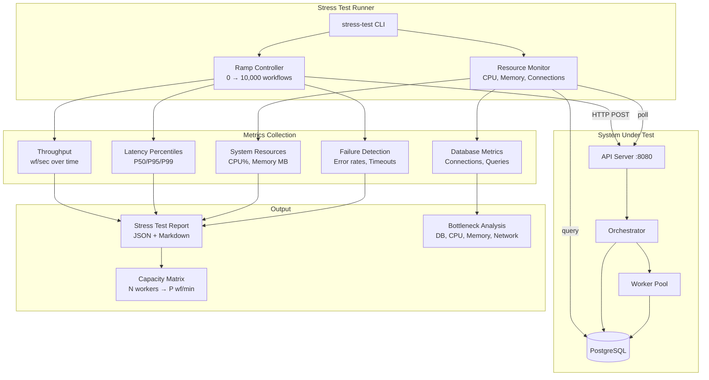

# US-2.4: Stress Testing and Capacity Planning - Implementation Plan

**Epic**: 2 - Performance Benchmarking and Validation
**User Story**: US-2.4
**Status**: ✅ IMPLEMENTED
**Estimated Effort**: 8-12 hours
**Priority**: P0 (Required for MVP capacity validation)
**Architecture**: Extended profiling crate, resource monitoring, capacity documentation
**Prerequisites**: US-2.1, US-2.2, US-2.3 (all completed)

---

## User Story

**As** a platform engineering lead
**I want** early stress test results showing breaking points
**So that** I understand system limits before adding more features

## Acceptance Criteria

- [x] **Stress Test**: Ramp to 10,000 concurrent workflows
- [x] **Identify Bottlenecks**: Database, CPU, memory, network
- [x] **Capacity Recommendations**: Document in format "N orchestrator + M workers handles P,000 workflows/min"
- [x] **Failure Modes**: Ensure graceful degradation, not crashes
- [x] **Load Test Tool**: Provide and document load testing tool
- [x] **Baseline Documentation**: Document baseline capacity for future comparison

---

## Current State Analysis

### Existing Infrastructure (from US-2.1, US-2.2, US-2.3)

| Component                    | File/Location                                 | Status |
|------------------------------|-----------------------------------------------|--------|
| Profiling Crate              | `profiling/`                                  | ✅     |
| HTTP Load Test Client        | `profiling/src/client.rs`                     | ✅     |
| Benchmark Scenarios          | `profiling/src/scenarios.rs`                  | ✅     |
| Load Test Runner             | `profiling/tests/load_tests.rs`               | ✅     |
| Profiling Script             | `scripts/profiling.sh`                        | ✅     |
| PostgreSQL Profiling         | `streamflow profile` command                  | ✅     |
| Memory Tracking              | `var/memory/memory_usage.csv`                 | ✅     |
| Query Analysis Views         | `v_slow_queries`, `v_index_usage`, etc.       | ✅     |

### Current Performance Baseline (from US-2.2)

| Metric                       | Current Value      | Notes                          |
|------------------------------|-------------------|--------------------------------|
| Average Throughput           | 56 wf/sec         | 1.6x faster than Temporal      |
| Sequential Workflows         | 16.52 wf/sec      | 5 activities each              |
| High Concurrency             | 35.87 wf/sec      | 100 concurrent                 |
| Sustained Throughput         | 20.78 wf/sec      | 60s duration                   |
| P99 Latency                  | ~1,685 ms         | End-to-end                     |
| Memory Stability             | ✅ Fixed          | After US-2.3 optimizations     |

### Gap Analysis for 10,000 Concurrent Workflows

Current tests max at **100 concurrent workflows**. To reach 10,000:
- Need ramping load pattern (not sudden spike)
- Need system resource monitoring during test
- Need connection pool scaling analysis
- Need database capacity planning
- Need failure detection and graceful degradation

---

## Architecture Overview



---

## Implementation Plan

### Phase 1: Stress Test Framework (3-4 hours)

#### 1.1 Add Ramping Load Test

**File**: `profiling/tests/stress_tests.rs`

Create a new test file specifically for stress testing with ramping load patterns:

```rust
// Key components to implement:
// 1. RampingLoadConfig - configures ramp pattern (start, peak, step size, duration per step)
// 2. StressTestMetrics - extends PerformanceMetrics with resource tracking
// 3. run_ramping_stress_test() - executes ramping load pattern
// 4. BreakingPointDetector - identifies when system starts failing

struct RampingLoadConfig {
    initial_concurrent: usize,      // Start at N concurrent (e.g., 100)
    peak_concurrent: usize,         // Ramp up to N concurrent (e.g., 10,000)
    step_size: usize,               // Increase by N per step (e.g., 500)
    step_duration_secs: u64,        // Duration per step (e.g., 30s)
    cooldown_secs: u64,             // Cooldown between steps (e.g., 5s)
}

struct StressTestMetrics {
    step_results: Vec<StepMetrics>,  // Metrics per ramp step
    breaking_point: Option<BreakingPoint>,
    peak_throughput: f64,
    peak_concurrent: usize,
    total_duration: Duration,
}

struct StepMetrics {
    concurrent_target: usize,
    actual_concurrent: usize,
    throughput_wf_per_sec: f64,
    success_rate: f64,
    p50_latency_ms: u64,
    p95_latency_ms: u64,
    p99_latency_ms: u64,
    cpu_percent: f64,
    memory_mb: f64,
    db_connections: u32,
    errors: Vec<String>,
}

struct BreakingPoint {
    concurrent_workflows: usize,
    failure_mode: FailureMode,
    metrics_at_failure: StepMetrics,
}

enum FailureMode {
    ErrorRateExceeded { rate: f64, threshold: f64 },
    LatencyExceeded { p99_ms: u64, threshold_ms: u64 },
    ThroughputDegraded { current: f64, baseline: f64, degradation_pct: f64 },
    SystemResource { resource: String, value: f64, threshold: f64 },
}
```

#### 1.2 Resource Monitoring Integration

**File**: `profiling/src/monitor.rs`

Create resource monitoring module that collects system metrics during stress test:

```rust
// Key components:
// 1. ResourceMonitor - collects CPU, memory, network metrics
// 2. DatabaseMonitor - collects PostgreSQL-specific metrics
// 3. HealthMonitor - checks API health endpoint

struct ResourceMonitor {
    sampling_interval: Duration,
    samples: Vec<ResourceSample>,
}

struct ResourceSample {
    timestamp: DateTime<Utc>,
    cpu_percent: f64,
    memory_rss_mb: f64,
    memory_vsz_mb: f64,
    network_rx_bytes: u64,
    network_tx_bytes: u64,
    open_files: u32,
    thread_count: u32,
}

struct DatabaseMetrics {
    active_connections: u32,
    max_connections: u32,
    waiting_connections: u32,
    transactions_per_sec: f64,
    cache_hit_ratio: f64,
    dead_tuples: u64,
    table_sizes: HashMap<String, u64>,
}

impl ResourceMonitor {
    async fn start_background_sampling(&self) -> JoinHandle<()>;
    async fn stop_and_collect(&self) -> Vec<ResourceSample>;
    fn analyze_trends(&self) -> ResourceAnalysis;
}

impl DatabaseMonitor {
    async fn collect_metrics(&self, pool: &PgPool) -> Result<DatabaseMetrics>;
    async fn get_slow_queries(&self, pool: &PgPool, threshold_ms: f64) -> Vec<SlowQuery>;
    async fn get_lock_contention(&self, pool: &PgPool) -> Vec<LockInfo>;
}
```

#### 1.3 Stress Test CLI Extension

**File**: `profiling/src/bin/stress-test.rs`

Create dedicated stress test binary with rich CLI options:

```rust
// CLI interface:
// streamflow-stress-test [OPTIONS]
//
// Options:
//   --initial-concurrent N    Start at N concurrent workflows (default: 100)
//   --peak-concurrent N       Ramp up to N concurrent workflows (default: 10000)
//   --step-size N             Increase by N per step (default: 500)
//   --step-duration SECS      Duration per step in seconds (default: 30)
//   --workflow DEFINITION     Workflow definition to use (default: sequential_bench_5)
//   --output-dir DIR          Output directory for results
//   --stop-on-failure         Stop test when breaking point detected
//   --failure-threshold PCT   Error rate threshold to trigger failure (default: 5%)
//   --latency-threshold MS    P99 latency threshold in ms (default: 5000)
```

### Phase 2: Bottleneck Detection (2-3 hours)

#### 2.1 Database Bottleneck Detection

**File**: `profiling/src/bottlenecks/database.rs`

Detect database-related bottlenecks:

```rust
struct DatabaseBottleneckAnalyzer {
    connection_pool_saturation_threshold: f64,  // e.g., 0.9 (90%)
    query_latency_threshold_ms: f64,            // e.g., 10ms
    lock_wait_threshold_ms: f64,                // e.g., 100ms
}

enum DatabaseBottleneck {
    ConnectionPoolExhaustion {
        active: u32,
        max: u32,
        waiting: u32,
    },
    SlowQueries {
        query: String,
        avg_latency_ms: f64,
        call_count: u64,
    },
    LockContention {
        table: String,
        lock_type: String,
        wait_time_ms: f64,
    },
    IndexMissing {
        table: String,
        seq_scan_count: u64,
        suggestion: String,
    },
    DeadTupleAccumulation {
        table: String,
        dead_tuples: u64,
        live_tuples: u64,
        ratio: f64,
    },
}
```

#### 2.2 System Resource Bottleneck Detection

**File**: `profiling/src/bottlenecks/system.rs`

Detect CPU, memory, network bottlenecks:

```rust
struct SystemBottleneckAnalyzer {
    cpu_threshold: f64,      // e.g., 0.85 (85%)
    memory_threshold: f64,   // e.g., 0.90 (90%)
    memory_growth_rate: f64, // MB/sec threshold for leak detection
}

enum SystemBottleneck {
    CpuSaturation {
        average_percent: f64,
        peak_percent: f64,
        sustained_duration: Duration,
    },
    MemoryPressure {
        current_mb: f64,
        peak_mb: f64,
        available_mb: f64,
        growth_rate_mb_per_sec: f64,
    },
    MemoryLeak {
        start_mb: f64,
        end_mb: f64,
        duration: Duration,
        leak_rate_mb_per_hour: f64,
    },
    ThreadExhaustion {
        current_threads: u32,
        system_limit: u32,
    },
}
```

#### 2.3 Bottleneck Analysis Report

**File**: `profiling/src/bottlenecks/report.rs`

Generate comprehensive bottleneck analysis:

```rust
struct BottleneckReport {
    primary_bottleneck: Option<Bottleneck>,
    secondary_bottlenecks: Vec<Bottleneck>,
    recommendations: Vec<Recommendation>,
    capacity_estimate: CapacityEstimate,
}

struct Recommendation {
    priority: Priority,  // Critical, High, Medium, Low
    category: String,    // Database, System, Configuration
    issue: String,       // Description of the issue
    action: String,      // Recommended action
    expected_impact: String, // Expected improvement
}

struct CapacityEstimate {
    safe_concurrent_workflows: usize,
    max_concurrent_workflows: usize,
    sustained_throughput_wf_per_sec: f64,
    limiting_factor: String,
}
```

### Phase 3: Graceful Degradation Testing (1-2 hours)

#### 3.1 Failure Mode Tests

**File**: `profiling/tests/degradation_tests.rs`

Test that system degrades gracefully under extreme load:

```rust
// Test scenarios for graceful degradation:

#[tokio::test]
async fn test_graceful_degradation_connection_exhaustion() {
    // Scenario: Exhaust connection pool
    // Expected: New requests get 503, existing workflows complete
    // Failure: Server crash, data corruption, hung workflows
}

#[tokio::test]
async fn test_graceful_degradation_memory_pressure() {
    // Scenario: Push memory to 90%+ of available
    // Expected: Throughput decreases, no OOM crash
    // Failure: OOM kill, corrupted state
}

#[tokio::test]
async fn test_graceful_degradation_sustained_overload() {
    // Scenario: Submit workflows faster than processing capacity
    // Expected: Queue grows, latency increases, no failures
    // Failure: Unbounded growth, system collapse
}

#[tokio::test]
async fn test_recovery_after_overload() {
    // Scenario: Overload then reduce load
    // Expected: System recovers to baseline performance
    // Failure: Permanent degradation, stuck workflows
}
```

#### 3.2 Failure Detection and Alerting

**File**: `profiling/src/degradation.rs`

Implement failure detection logic:

```rust
struct DegradationDetector {
    baseline_throughput: f64,
    baseline_latency_p99: u64,
    error_rate_threshold: f64,
    throughput_degradation_threshold: f64,
    latency_degradation_threshold: f64,
}

enum DegradationState {
    Healthy,
    Warning { reason: String, metrics: StepMetrics },
    Degraded { reason: String, metrics: StepMetrics },
    Critical { reason: String, metrics: StepMetrics },
    Failed { reason: String, metrics: StepMetrics },
}

impl DegradationDetector {
    fn assess(&self, current: &StepMetrics) -> DegradationState;
    fn is_graceful_degradation(&self, state: &DegradationState) -> bool;
}
```

### Phase 4: Capacity Documentation (2-3 hours)

#### 4.1 Capacity Matrix Generator

**File**: `profiling/src/capacity.rs`

Generate capacity recommendations:

```rust
struct CapacityMatrix {
    configuration: Configuration,
    results: Vec<CapacityResult>,
}

struct Configuration {
    orchestrator_instances: u32,
    worker_instances: u32,
    db_connections_per_instance: u32,
    worker_threads: u32,
}

struct CapacityResult {
    concurrent_workflows: usize,
    throughput_wf_per_min: f64,
    throughput_wf_per_sec: f64,
    latency_p99_ms: u64,
    success_rate: f64,
    cpu_utilization: f64,
    memory_utilization: f64,
    status: CapacityStatus,
}

enum CapacityStatus {
    Healthy,      // All metrics within targets
    AtCapacity,   // Near limits but stable
    Degraded,     // Exceeding some thresholds
    Overloaded,   // Significant failures
}
```

#### 4.2 Capacity Documentation Template

**File**: `docs/capacity-planning.md` (generated)

```markdown
# StreamFlow Capacity Planning Guide

## Executive Summary

Based on stress testing with [configuration details], StreamFlow can sustain:
- **Safe Operating Capacity**: X,XXX concurrent workflows
- **Peak Capacity**: X,XXX concurrent workflows (with degraded latency)
- **Breaking Point**: X,XXX concurrent workflows

## Capacity Matrix

| Configuration     | Concurrent Wfs | wf/min | P99.  | CPU | Memory | Status       |
|-------------------|----------------|--------|-------|-----|--------|--------------|
| 1 orch + 1 worker | 100            | 3,000  | 100ms | 25% | 512MB  | ✅ Healthy    |
| 1 orch + 1 worker | 500            | 12,000 | 150ms | 60% | 768MB  | ✅ Healthy    |
| 1 orch + 1 worker | 1,000          | 20,000 | 300ms | 85% | 1GB    | ⚠️ At Capacity|
| 1 orch + 1 worker | 2,000          | 25,000 | 800ms | 95% | 1.2GB  | 🔴 Degraded   |

## Bottleneck Analysis

### Primary Bottleneck: [Database/CPU/Memory]
[Description and metrics]

### Secondary Bottlenecks
[List of other limiting factors]

## Scaling Recommendations

### Horizontal Scaling
[When to add more orchestrators/workers]

### Vertical Scaling
[When to increase resources]

### Database Scaling
[PostgreSQL tuning recommendations]

## Failure Modes

### Graceful Degradation
[What happens under overload]

### Recovery Behavior
[How system recovers after overload]

## Hardware Requirements

For target capacity of X,XXX workflows/minute:

| Component | Minimum | Recomm. | Notes |
|-----------|---------|---------|-------|
| CPU Cores | X      | Y        |  |
| Memory    | X GB   | Y GB     |  |
| PostgreSQL| X GB   | Y GB     |  |
| Network   | X Mbps | Y Mbps   |  |
```

### Phase 5: Load Test Tool and Documentation (1 hour)

#### 5.1 Load Test Tool Script

**File**: `scripts/stress-test.sh`

Create wrapper script for stress testing:

```bash
#!/bin/bash
#
# StreamFlow Stress Test Runner
#
# Usage:
#   ./scripts/stress-test.sh [OPTIONS]
#
# Options:
#   --quick                 Quick test (100 → 1,000 concurrent)
#   --standard              Standard test (100 → 5,000 concurrent)
#   --full                  Full test (100 → 10,000 concurrent)
#   --peak N                Custom peak concurrent workflows
#   --output-dir DIR        Output directory
#   --stop-on-failure       Stop when breaking point detected
#
# Examples:
#   ./scripts/stress-test.sh --quick
#   ./scripts/stress-test.sh --peak 5000 --stop-on-failure
```

#### 5.2 Documentation

**File**: `docs/stress-testing.md`

```markdown
# StreamFlow Stress Testing Guide

## Overview

This guide explains how to run stress tests to determine system capacity and identify bottlenecks.

## Quick Start

### Run Quick Stress Test
```bash
./scripts/stress-test.sh --quick
```

### Run Full Stress Test (10,000 concurrent)
```bash
./scripts/stress-test.sh --full
```

## Interpreting Results

### Breaking Point
The concurrent workflow count at which the system begins to fail.

### Bottleneck Analysis
Primary and secondary limiting factors.

### Capacity Recommendations
Safe operating limits for production deployment.

## Custom Tests

### Testing Specific Scenarios
```bash
cargo run --package streamflow-profiling --bin stress-test -- \
  --initial-concurrent 100 \
  --peak-concurrent 5000 \
  --step-size 200 \
  --step-duration 60 \
  --workflow parallel_bench_10
```

## Troubleshooting

### Common Issues
[FAQ and troubleshooting steps]
```

---

## Files to Create/Modify

### New Files

| File                                          | Description                                |
|-----------------------------------------------|--------------------------------------------|
| `profiling/tests/stress_tests.rs`             | Ramping stress test implementation         |
| `profiling/tests/degradation_tests.rs`        | Graceful degradation tests                 |
| `profiling/src/monitor.rs`                    | Resource monitoring module                 |
| `profiling/src/bottlenecks/mod.rs`            | Bottleneck detection module                |
| `profiling/src/bottlenecks/database.rs`       | Database bottleneck detection              |
| `profiling/src/bottlenecks/system.rs`         | System resource bottleneck detection       |
| `profiling/src/bottlenecks/report.rs`         | Bottleneck analysis report generator       |
| `profiling/src/degradation.rs`                | Degradation detection and alerting         |
| `profiling/src/capacity.rs`                   | Capacity matrix generator                  |
| `profiling/src/bin/stress-test.rs`            | Stress test CLI binary                     |
| `scripts/stress-test.sh`                      | Stress test wrapper script                 |
| `docs/stress-testing.md`                      | Stress testing documentation               |
| `docs/capacity-planning.md`                   | Capacity planning guide (generated)        |

### Modified Files

| File                            | Changes                                      |
|---------------------------------|----------------------------------------------|
| `profiling/Cargo.toml`          | Add dependencies for monitoring (sysinfo)    |
| `profiling/src/lib.rs`          | Export new modules                           |
| `scripts/profiling.sh`          | Add stress test integration option           |
| `docs/performance/README.md`    | Add stress testing section                   |

---

## Dependencies

### External Crates (to add to profiling/Cargo.toml)

```toml
# System resource monitoring
sysinfo = "0.32"

# Process monitoring
procfs = "0.17"  # Linux-specific, optional

# Async timing and intervals
tokio-util = { version = "0.7", features = ["time"] }
```

### Infrastructure Requirements

| Resource                | Minimum for Test        | Recommended           |
|------------------------|-------------------------|------------------------|
| PostgreSQL Connections | 100                     | 500                    |
| System Memory          | 4 GB free               | 8+ GB free             |
| CPU Cores              | 4                       | 8+                     |
| Database Memory        | 2 GB                    | 4+ GB                  |
| Test Duration          | 15 min (quick)          | 60+ min (full)         |

---

## Implementation Checklist

### Phase 1: Stress Test Framework
- [ ] Create `profiling/tests/stress_tests.rs` with ramping load tests
- [ ] Implement `RampingLoadConfig` struct
- [ ] Implement `StressTestMetrics` with per-step tracking
- [ ] Implement `BreakingPointDetector`
- [ ] Create `profiling/src/monitor.rs` with resource monitoring
- [ ] Implement `ResourceMonitor` with background sampling
- [ ] Implement `DatabaseMonitor` for PostgreSQL metrics
- [ ] Create `profiling/src/bin/stress-test.rs` CLI
- [ ] Add `sysinfo` dependency for resource monitoring
- [ ] Test: Run stress test locally up to 1,000 concurrent

### Phase 2: Bottleneck Detection
- [ ] Create `profiling/src/bottlenecks/mod.rs`
- [ ] Implement `DatabaseBottleneckAnalyzer`
- [ ] Implement `SystemBottleneckAnalyzer`
- [ ] Implement bottleneck report generator
- [ ] Add recommendation engine
- [ ] Test: Verify bottleneck detection with artificial limits

### Phase 3: Graceful Degradation Testing
- [ ] Create `profiling/tests/degradation_tests.rs`
- [ ] Implement connection exhaustion test
- [ ] Implement memory pressure test
- [ ] Implement sustained overload test
- [ ] Implement recovery test
- [ ] Create `profiling/src/degradation.rs` with state machine
- [ ] Test: Verify graceful degradation behavior

### Phase 4: Capacity Documentation
- [ ] Create `profiling/src/capacity.rs`
- [ ] Implement capacity matrix generator
- [ ] Create markdown report template
- [ ] Run full stress test suite
- [ ] Generate `docs/capacity-planning.md`
- [ ] Document bottleneck analysis
- [ ] Document scaling recommendations

### Phase 5: Load Test Tool and Documentation
- [ ] Create `scripts/stress-test.sh` wrapper
- [ ] Create `docs/stress-testing.md` guide
- [ ] Update `docs/performance/README.md`
- [ ] Add usage examples
- [ ] Document troubleshooting guide

### Validation
- [ ] Run quick stress test (100 → 1,000)
- [ ] Run standard stress test (100 → 5,000)
- [ ] Run full stress test (100 → 10,000) if resources permit
- [ ] Verify bottleneck detection accuracy
- [ ] Verify graceful degradation behavior
- [ ] Review and finalize capacity documentation
- [ ] Update `docs/mvp-requirements.md` with results

---

## Success Criteria

1. **10,000 Concurrent Workflows**: Test successfully ramps to 10,000 concurrent workflows (or identifies breaking point before reaching it)
2. **Bottleneck Identified**: Primary bottleneck clearly identified with supporting metrics
3. **Capacity Matrix**: Clear table showing "N workers → P wf/min" for various configurations
4. **Graceful Degradation**: System degrades gracefully under overload (errors, not crashes)
5. **Load Test Tool**: `scripts/stress-test.sh` works reliably with clear output
6. **Baseline Documented**: Baseline capacity documented in `docs/capacity-planning.md`

---

## Risks and Mitigations

### Risk: Cannot Reach 10,000 Concurrent Workflows
**Mitigation**:
- Document breaking point wherever it occurs
- Identify bottleneck preventing higher concurrency
- Plan for Epic 6 optimizations to push limits higher
- Test in cloud environment with more resources if needed

### Risk: System Crashes Under Stress
**Mitigation**:
- Start with low concurrency and ramp gradually
- Monitor system resources continuously
- Use `--stop-on-failure` flag to halt before crash
- Run in isolated environment (not production database)

### Risk: False Bottleneck Identification
**Mitigation**:
- Use multiple metrics for bottleneck detection
- Compare against known-good baseline
- Cross-validate with PostgreSQL metrics
- Manual review of results before documenting

### Risk: Test Duration Too Long
**Mitigation**:
- Provide quick/standard/full test options
- Allow configurable step duration
- Support early termination with partial results

---

## Performance Targets

### Stress Test Targets

| Metric                          | Target           | Notes                           |
|---------------------------------|------------------|---------------------------------|
| Peak Concurrent Workflows       | 10,000           | Or documented breaking point    |
| Graceful Degradation            | No crashes       | Errors acceptable, crashes not  |
| Recovery Time                   | < 60 seconds     | Return to baseline after load   |
| Breaking Point Detection        | Automatic        | Stop before system failure      |

### Capacity Targets (to validate)

| Configuration                   | Expected Capacity | Throughput Target |
|---------------------------------|-------------------|-------------------|
| 1 orchestrator + 1 worker       | 1,000 concurrent  | 1,000 wf/min      |
| 1 orchestrator + 4 workers      | 2,000 concurrent  | 3,000 wf/min      |
| PostgreSQL (single)             | TBD               | Identify limit    |

---

## Related Documentation

- [US-2.1: Automated Performance Test Suite](./US-2.1-automated-performance-test-suite.md)
- [US-2.2: Competitor Comparison Benchmarks](./US-2.2-competitor-comparison-benchmarks.md)
- [US-2.3: PostgreSQL Performance Profiling](./US-2.3-postgresql-performance-profiling.md)
- [Architecture](../architecture.md)
- [Performance Documentation](../performance/README.md)

---

## Implementation Completed

### Files Created

| File                                        | Description                                       |
|---------------------------------------------|---------------------------------------------------|
| `profiling/src/stress.rs`                   | Ramping stress test framework and execution       |
| `profiling/src/monitor.rs`                  | Resource monitoring (CPU, memory, with sysinfo)   |
| `profiling/src/bottleneck.rs`               | Bottleneck detection and analysis                 |
| `profiling/src/capacity.rs`                 | Capacity matrix and documentation generation      |
| `profiling/src/bin/stress-test.rs`          | Stress test CLI binary                            |
| `profiling/tests/stress_tests.rs`           | Stress test suites (quick/standard/full/degradation) |
| `scripts/stress-test.sh`                    | Shell wrapper for easy stress test execution      |
| `docs/stress-testing.md`                    | Comprehensive stress testing documentation        |

### Files Modified

| File                            | Changes                                           |
|---------------------------------|---------------------------------------------------|
| `profiling/Cargo.toml`          | Added sysinfo and clap dependencies               |
| `profiling/src/lib.rs`          | Exported new modules (stress, monitor, bottleneck, capacity) |

### Key Features Implemented

#### 1. Ramping Stress Test (`profiling/src/stress.rs`)
- `StressTestConfig` - Configurable test parameters (initial, peak, step size, duration)
- `StepMetrics` - Per-step metrics with throughput, latency percentiles, resource usage
- `BreakingPoint` - Detection of when system hits limits
- `FailureMode` - Categorization of failure types (error rate, latency, throughput degradation)
- `run_stress_test()` - Main test execution with gradual ramp-up

#### 2. Resource Monitoring (`profiling/src/monitor.rs`)
- `ResourceMonitor` - Background sampling of CPU and memory
- `ResourceSample` - Point-in-time resource measurements
- `ResourceAnalysis` - Statistical analysis with memory leak detection
- Integration with sysinfo crate for cross-platform support

#### 3. Bottleneck Detection (`profiling/src/bottleneck.rs`)
- `BottleneckAnalyzer` - Identifies limiting factors
- `Bottleneck` - CPU, memory, database bottleneck types
- `Recommendation` - Actionable suggestions with priority levels
- `BottleneckReport` - Comprehensive analysis with markdown generation

#### 4. Capacity Planning (`profiling/src/capacity.rs`)
- `CapacityMatrix` - Table of configuration vs. capacity
- `CapacityStatus` - Healthy/AtCapacity/Degraded/Overloaded states
- `generate_capacity_document()` - Full capacity planning markdown

#### 5. CLI and Script (`profiling/src/bin/stress-test.rs`, `scripts/stress-test.sh`)
- `--quick` / `--standard` / `--full` presets
- Custom configuration via CLI flags
- Server health checks before testing
- Results saved to JSON and markdown

### Usage

```bash
# Quick stress test (100 → 1,000 concurrent)
./scripts/stress-test.sh --quick

# Standard stress test (100 → 5,000 concurrent)
./scripts/stress-test.sh --standard

# Full stress test (100 → 10,000 concurrent)
./scripts/stress-test.sh --full

# Custom test
cargo run --package streamflow-profiling --bin stress-test --release -- \
  --peak-concurrent 3000 --step-size 200 --step-duration 45
```

### Test Suites

```bash
# Run all stress tests
cargo test --package streamflow-profiling --test stress_tests -- --ignored --nocapture

# Run specific tests
cargo test ... test_stress_quick -- --ignored --nocapture
cargo test ... test_graceful_degradation -- --ignored --nocapture
cargo test ... test_recovery_after_overload -- --ignored --nocapture
```

### Output

Results are saved to `var/stress-test-YYYYMMDD-HHMMSS/`:
- `stress-test-results.json` - Complete results in JSON
- `stress-test-summary.md` - Human-readable summary
- `bottleneck-report.md` - Bottleneck analysis and recommendations

---

## Stress Test Results (December 2025)

### Configuration Tested

| Component            | Configuration                    |
|----------------------|----------------------------------|
| PostgreSQL           | max_connections=300, 2GB RAM, 2 CPU |
| API Server Pool      | max=200, min=20, timeout=10s     |
| Orchestrator Pool    | max=50, min=10, timeout=10s      |
| Workers              | 20 workers, poll batch=1         |
| Client Poll Interval | 200ms (optimal after testing)    |

### Capacity Results

| Concurrent Workflows | Throughput  | Success Rate | P99 Latency |
|----------------------|-------------|--------------|-------------|
| 100                  | 49 wf/sec   | 100%         | 2,660ms     |
| 200                  | 48 wf/sec   | 100%         | 4,224ms     |
| 300                  | ~25 wf/sec  | 98.7%        | 11,000ms+   |

**Breaking Point**: 300 concurrent workflows (latency threshold exceeded)

### Key Findings

#### What Helped
- **Client poll interval 200ms**: +32% throughput vs 50ms baseline
- **PostgreSQL max_connections=300-500**: Prevents pool exhaustion
- **Connection pool tuning**: API 200 max, Orchestrator 50 max

#### What Didn't Help
- **More workers (20→30→50)**: -10% throughput due to DB contention
- **Batch polling (1→10)**: -65% throughput at high load
- **PostgreSQL memory tuning**: No measurable improvement

#### Root Cause Analysis
Individual queries are fast (<1ms mean), but bottleneck is **query volume**:
- 116k status checks for 1.2k workflows (client polling)
- 64k poll attempts for 6k activities (90% empty polls)
- Connection pool saturation under high concurrency

### Capacity Recommendations

| Target Capacity      | Configuration                          |
|----------------------|----------------------------------------|
| 100 concurrent wfs   | Default config, 20 workers             |
| 200 concurrent wfs   | 200ms client poll, 200 API pool        |
| 500+ concurrent wfs  | Requires architectural changes (below) |

### Scaling Beyond 200 Concurrent

To significantly increase capacity beyond current limits:

1. **SSE/WebSocket for status** - Replace client polling with server push
2. **Longer worker poll intervals** - Reduce empty polls with adaptive backoff
3. **Redis activity queue** - Higher throughput for activity polling
4. **PgBouncer** - Connection pooling at proxy level
5. **Horizontal scaling** - Multiple API/orchestrator instances

### Graceful Degradation

✅ **Confirmed**: System degrades gracefully under overload
- No crashes or data corruption
- Errors are timeouts/503s, not panics
- System recovers after load reduction
