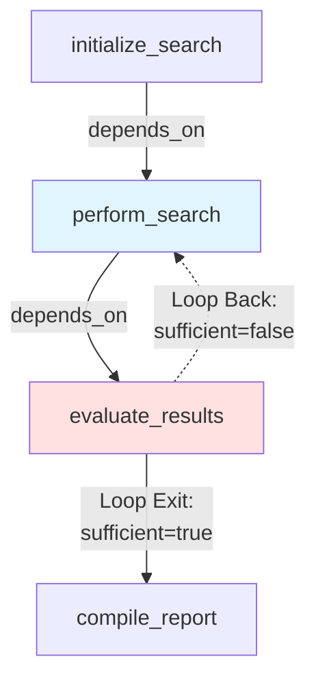

# US-3.4: Iterative Workflows (Loops) - Implementation Plan

**Epic**: Epic 3 - YAML Workflow Definition Language
**User Story**: US-3.4
**Status**: 🔲 Not Started
**Priority**: High (Required for Example 6 - Agentic Research)
**Estimated Duration**: 4-5 days
**Dependencies**: US-3.1 (Sequential Workflows) ✅ Complete, US-3.3 (Parallel Execution) ✅ Complete

---

## User Story

**As** an AI startup engineer
**I want** workflows to loop until a condition is met and access results from all iterations
**So that** I can implement agentic research patterns (evaluate → search more if needed, building on previous findings)

### Acceptance Criteria

- Edge from later activity back to earlier activity (loop via `depends_on`)
- **Iteration-scoped outputs**: Activities declare `iteration_scoped: true` to store separate results per iteration
- **Access all iterations**: `{{activity_key.output_name}}` returns array of all iteration results.
- Conditional loop exit: `{{evaluate.sufficient == true}}`
- Iteration counter: `{{ACTIVITY.iteration}}`
- Maximum iteration limits to prevent infinite loops
- **Budget accumulation**: `accumulated_cost_usd` tracks total cost across ALL iterations; budget limits apply to total, not per-iteration
- **Example**: Research agent searches → evaluates if sufficient → loops back with context of all previous searches → compiles report from all iterations
- **Storage**: Framework stores iteration-scoped results as arrays, making all iterations accessible to downstream activities

---

## Architecture Overview

### Key Concept: Loops as Back-Edges in DAG

Loops are created by adding a `depends_on` edge from a later activity back to an earlier activity in the workflow graph. This creates a cycle that the orchestrator must handle specially:



**Loop Detection**: The orchestrator must detect back-edges during evaluation and handle them as iteration triggers rather than circular dependency errors.

**Iteration-Scoped Storage**: Activities marked with `iteration_scoped: true` store their outputs grouped by name as arrays: `{ "output_name": [value0, value1, value2, ...] }`. This design:
- Matches template access patterns exactly (no transformation needed)
- Enables direct array operations via MiniJinja filters
- Simplifies implementation (no flattening step in template resolver)

```yaml
activities:
  - key: perform_search
    worker: builtin
    activity_name: http_request
    iteration_scoped: true  # Store results from each iteration as array
    parameters:
      query: "{{INPUT.topic}}"
      previous_results: "{{perform_search.results}}"  # Array of all iterations
      latest_result: "{{perform_search.results | last}}"  # Latest iteration only
    outputs:
      - name: results
    depends_on:
      - initialize_search
      - activity_key: evaluate_results
        conditions:
          - "{{evaluate_results.sufficient | last == false}}"  # Check latest iteration

  - key: evaluate_results
    worker: builtin
    activity_name: llm_call
    iteration_scoped: true
    parameters:
      prompt: "Evaluate if search results are sufficient..."
      all_results: "{{perform_search.results}}"  # All iterations (array)
      iteration_count: "{{perform_search.results | length}}"  # Number of iterations
    outputs:
      - name: sufficient
      - name: confidence
    depends_on:
      - perform_search
```

### Current State Analysis

**Existing Capabilities**:
- ✅ Dependency evaluation via `depends_on` relationships
- ✅ Conditional execution via `conditions` on dependencies
- ✅ Activity state tracking in `WorkflowState`
- ✅ Template resolution via MiniJinja
- ✅ PostgreSQL advisory locks prevent race conditions

**What Needs to Change**:
- 🔲 **Loop detection**: Distinguish between invalid circular dependencies and valid iteration loops
- 🔲 **Iteration tracking**: Add iteration counter to `ActivityState`
- 🔲 **Iteration-scoped storage**: Store outputs as arrays for iteration-scoped activities
- 🔲 **Template resolution**: Return arrays for iteration-scoped activities (MiniJinja handles array operations)
- 🔲 **Loop limits**: Enforce maximum iteration count
- 🔲 **Budget tracking**: Track accumulated cost across iterations
- 🔲 **Back-edge evaluation**: Schedule loop-back activities correctly

---

## Implementation Tasks

### 1. 🔲 Extend ActivityState for Iteration Tracking

**File**: `core/src/orchestrator/workflow_state.rs`

**Changes Needed**:

Add iteration tracking fields to `ActivityState`:

```rust
#[derive(Debug, Clone, Serialize, Deserialize, PartialEq)]
pub struct ActivityState {
    pub key: String,
    pub status: WorkflowActivityStatus,
    pub outputs: Option<Vec<ActivityOutput>>,
    pub error: Option<String>,
    pub started_at: Option<DateTime<Utc>>,
    pub completed_at: Option<DateTime<Utc>>,
    pub attempt: u32,
    pub last_error: Option<String>,
    pub accumulated_cost_usd: Decimal,

    // NEW: Iteration tracking
    /// Current iteration number (0-based)
    #[serde(default)]
    pub iteration: u32,

    /// History of outputs from all iterations (only for iteration_scoped activities)
    /// Outputs are grouped by name: { "output_name": [value0, value1, value2, ...] }
    /// This matches the template access pattern: {{activity.output_name}} returns the array
    #[serde(skip_serializing_if = "Option::is_none")]
    pub iteration_outputs: Option<HashMap<String, Vec<Value>>>,
}

impl ActivityState {
    /// Increment iteration counter and archive current outputs
    /// NOTE: accumulated_cost_usd is NOT reset - it tracks total across all iterations
    pub fn increment_iteration(&mut self, current_outputs: Vec<ActivityOutput>) {
        self.iteration += 1;

        // Archive current outputs to iteration history, grouped by output name
        let history = self.iteration_outputs.get_or_insert_with(HashMap::new);

        for output in current_outputs {
            history
                .entry(output.name.clone())
                .or_insert_with(Vec::new)
                .push(output.value);
        }

        // IMPORTANT: accumulated_cost_usd is NOT reset here
        // Budget limits apply to the sum of all iterations, not per-iteration
    }

    /// Get the latest value for a specific output across all iterations
    pub fn get_latest_output_value(&self, output_name: &str) -> Option<&Value> {
        self.iteration_outputs
            .as_ref()?
            .get(output_name)?
            .last()
    }

    /// Get all values for a specific output across all iterations
    pub fn get_output_values(&self, output_name: &str) -> Option<&Vec<Value>> {
        self.iteration_outputs.as_ref()?.get(output_name)
    }
}
```

**Migration Consideration**: Existing workflows won't have `iteration` or `iteration_outputs` fields. The `#[serde(default)]` and `#[serde(skip_serializing_if)]` attributes ensure backward compatibility.

---

### 2. 🔲 Extend ActivityDefinition for Loop Configuration

**File**: `core/src/workflow/definition.rs`

**Changes Needed**:

Add loop-related configuration to `ActivityDefinition`:

```rust
#[derive(Debug, Clone, Serialize, Deserialize, PartialEq)]
pub struct ActivityDefinition {
    pub key: String,
    pub worker: Option<String>,
    pub activity_name: String,
    pub parameters: Option<HashMap<String, Value>>,
    pub outputs: Option<Vec<ActivityOutputDefinition>>,
    pub depends_on: Option<Vec<DependencyRelationship>>,
    pub dependency_of: Option<Vec<DependencyRelationship>>,
    pub settings: Option<ActivitySettings>,

    // NEW: Loop configuration
    /// Whether to store separate outputs for each iteration
    #[serde(default)]
    pub iteration_scoped: bool,

    /// Maximum number of iterations (prevents infinite loops)
    #[serde(skip_serializing_if = "Option::is_none")]
    pub iteration_limit: Option<u32>,
}

// Also add to ActivitySettings for global loop limits
#[derive(Debug, Clone, Serialize, Deserialize, PartialEq)]
pub struct ActivitySettings {
    pub timeout_seconds: Option<u64>,
    pub retry: Option<RetrySettings>,
    pub budget: Option<BudgetSettings>,
    pub cache: Option<CacheSettings>,

    // NEW: Per-activity iteration limit
    #[serde(skip_serializing_if = "Option::is_none")]
    pub iteration_limit: Option<u32>,
}
```

**YAML Example**:
```yaml
activities:
  - key: perform_search
    worker: builtin
    activity_name: http_request
    iteration_scoped: true      # Enable iteration tracking
    iteration_limit: 10          # Prevent infinite loops
    parameters:
      query: "{{INPUT.topic}}"
      context: "{{perform_search[*].results}}"
    outputs:
      - name: results
```

---

### 3. 🔲 Loop Detection in Workflow Validation

**File**: `core/src/workflow/definition.rs`

**Changes Needed**:

Modify validation to distinguish between circular dependencies (invalid) and loops (valid with back-edges):

```rust
impl WorkflowDefinition {
    /// Validate workflow structure
    pub fn validate(&self) -> Result<(), ValidationErrors> {
        let mut errors = ValidationErrors::new();

        // ... existing validation ...

        // Detect loops (back-edges)
        let loops = self.detect_loops()?;

        // Validate that loops have proper configuration
        for loop_edge in loops {
            self.validate_loop_edge(&loop_edge, &mut errors)?;
        }

        // ... rest of validation ...
    }

    /// Detect back-edges (loops) in the workflow graph
    fn detect_loops(&self) -> Result<Vec<LoopEdge>, ValidationErrors> {
        let graph = self.build_dependency_graph();
        let mut loops = Vec::new();

        // Perform topological sort to identify back-edges
        let sorted = topological_sort(&graph)?;

        // Any edge from later to earlier in topo order is a back-edge
        for (idx, activity) in sorted.iter().enumerate() {
            if let Some(depends_on) = &activity.depends_on {
                for dep in depends_on {
                    let dep_idx = sorted.iter().position(|a| a.key == dep.activity_key);
                    if let Some(dep_idx) = dep_idx {
                        if dep_idx > idx {
                            // Back-edge found (loop)
                            loops.push(LoopEdge {
                                from: activity.key.clone(),
                                to: dep.activity_key.clone(),
                                condition: dep.conditions.clone(),
                            });
                        }
                    }
                }
            }
        }

        Ok(loops)
    }

    /// Validate that a loop edge has proper configuration
    fn validate_loop_edge(&self, loop_edge: &LoopEdge, errors: &mut ValidationErrors) -> Result<()> {
        let from_activity = self.get_activity(&loop_edge.from)?;
        let to_activity = self.get_activity(&loop_edge.to)?;

        // Loop back-edge MUST have a condition (exit condition)
        if loop_edge.condition.is_none() || loop_edge.condition.as_ref().unwrap().is_empty() {
            errors.add(
                "activities",
                &format!(
                    "Loop from '{}' to '{}' must have exit condition. \
                    Example: conditions: [\"{{{{evaluate.sufficient == false}}}}\"]",
                    loop_edge.from, loop_edge.to
                )
            );
        }

        // At least one activity in the loop should have iteration_limit
        if from_activity.iteration_limit.is_none() && to_activity.iteration_limit.is_none() {
            errors.add(
                "activities",
                &format!(
                    "Loop from '{}' to '{}' should have iteration_limit on at least one activity",
                    loop_edge.from, loop_edge.to
                )
            );
        }

        // Recommend iteration_scoped for loop activities
        if !from_activity.iteration_scoped && !to_activity.iteration_scoped {
            // Just a warning in logs, not a hard error
            tracing::warn!(
                "Loop from '{}' to '{}' does not use iteration_scoped. \
                Consider setting iteration_scoped: true to track results per iteration.",
                loop_edge.from, loop_edge.to
            );
        }

        Ok(())
    }
}

#[derive(Debug, Clone)]
struct LoopEdge {
    from: String,
    to: String,
    condition: Option<Vec<String>>,
}
```

**Key Changes**:
1. Existing cycle detection becomes loop detection
2. Loops are allowed if they have proper configuration (condition, iteration_limit)
3. Validation ensures loop safety

---

### 4. 🔲 Update Dependency Evaluator for Loop Scheduling

**File**: `core/src/orchestrator/dependency_evaluator.rs`

**Changes Needed**:

Modify dependency evaluation to handle back-edges and iteration limits:

```rust
impl DependencyEvaluator {
    /// Check if activity is ready to execute (handles loops)
    pub fn is_activity_ready(
        &self,
        activity: &ActivityDefinition,
        state: &WorkflowState,
    ) -> Result<bool> {
        let activity_state = state.activities.get(&activity.key);

        // Check if already completed (but allow re-execution for loops)
        if let Some(state) = activity_state {
            match state.status {
                WorkflowActivityStatus::Completed => {
                    // Check if this is a loop back-edge scenario
                    if !self.should_loop_back(activity, state, state)? {
                        return Ok(false); // Already completed, don't re-execute
                    }
                    // Fall through to check loop conditions
                }
                WorkflowActivityStatus::Running | WorkflowActivityStatus::Pending => {
                    return Ok(false); // Already scheduled/running
                }
                WorkflowActivityStatus::Failed | WorkflowActivityStatus::Skipped => {
                    return Ok(false); // Terminal states
                }
                WorkflowActivityStatus::NotScheduled => {
                    // Continue to dependency check
                }
            }
        }

        // Check iteration limit
        if let Some(activity_state) = activity_state {
            if self.is_max_iterations_exceeded(activity, activity_state)? {
                return Ok(false);
            }
        }

        // Standard dependency check
        if let Some(depends_on) = &activity.depends_on {
            for dep in depends_on {
                let dep_state = state.activities.get(&dep.activity_key);

                // Check if this is a back-edge (loop)
                let is_back_edge = self.is_back_edge(activity, dep, state)?;

                if is_back_edge {
                    // For back-edges, evaluate loop condition
                    if !self.evaluate_loop_condition(dep, dep_state, state)? {
                        return Ok(false); // Loop condition not met
                    }
                } else {
                    // Standard forward dependency check
                    if !self.is_dependency_satisfied(dep, dep_state, state)? {
                        return Ok(false);
                    }
                }
            }
        }

        Ok(true)
    }

    /// Check if activity should loop back (re-execute)
    fn should_loop_back(
        &self,
        activity: &ActivityDefinition,
        activity_state: &ActivityState,
        state: &WorkflowState,
    ) -> Result<bool> {
        // Only loop if status is Completed and there's a back-edge dependency
        if activity_state.status != WorkflowActivityStatus::Completed {
            return Ok(false);
        }

        // Check if any downstream activity triggers a loop back
        // (This is detected when evaluating the depends_on of this activity)
        Ok(false) // Default: don't loop
    }

    /// Check if max iterations has been exceeded
    fn is_max_iterations_exceeded(
        &self,
        activity: &ActivityDefinition,
        activity_state: &ActivityState,
    ) -> Result<bool> {
        let iteration_limit = activity.iteration_limit
            .or_else(|| activity.settings.as_ref()?.iteration_limit)
            .unwrap_or(100); // Default limit

        Ok(activity_state.iteration >= iteration_limit)
    }

    /// Check if this dependency is a back-edge (loop)
    fn is_back_edge(
        &self,
        activity: &ActivityDefinition,
        dep: &DependencyRelationship,
        state: &WorkflowState,
    ) -> Result<bool> {
        // A back-edge exists if the dependency activity has already completed
        // and this creates a cycle in the graph
        let dep_state = state.activities.get(&dep.activity_key);

        if let Some(dep_state) = dep_state {
            // If dependency is completed and we're trying to depend on it again,
            // this is likely a back-edge
            if dep_state.status == WorkflowActivityStatus::Completed {
                // Additional check: does the dependency have iteration > 0?
                return Ok(dep_state.iteration > 0 || activity.iteration_scoped);
            }
        }

        Ok(false)
    }

    /// Evaluate loop exit/continuation condition
    fn evaluate_loop_condition(
        &self,
        dep: &DependencyRelationship,
        dep_state: Option<&ActivityState>,
        state: &WorkflowState,
    ) -> Result<bool> {
        // Loop conditions should evaluate to true to continue looping
        // Exit conditions should evaluate to false to stop looping

        if let Some(conditions) = &dep.conditions {
            for condition in conditions {
                if !self.evaluate_condition(condition, dep_state, state)? {
                    return Ok(false); // Condition not met, don't loop
                }
            }
        }

        Ok(true) // All conditions met, continue loop
    }
}
```

**Key Logic**:
1. Detect back-edges by checking if dependency is already completed
2. Evaluate loop conditions separately from forward dependencies
3. Enforce iteration limits
4. Allow re-execution of completed activities when loop conditions are met

---

### 5. 🔲 Update Orchestrator for Iteration Management

**File**: `core/src/orchestrator/orchestrator.rs`

**Changes Needed**:

Handle activity completion differently for iteration-scoped activities:

```rust
impl Orchestrator {
    /// Handle ActivityCompleted event (with iteration support)
    async fn handle_activity_completed(
        &self,
        tx: &mut PgConnection,
        event: &WorkflowEvent,
        activity_key: &str,
        outputs: &[ActivityOutput],
        cost_usd: Decimal,
    ) -> Result<()> {
        let mut state = load_materialized_state(tx, event.workflow_id).await?;
        let definition = load_workflow_definition(tx, event.workflow_id).await?;

        let activity_def = definition.get_activity(activity_key)?;

        // Get or create activity state
        let activity_state = state.activities.entry(activity_key.to_string())
            .or_insert_with(|| ActivityState {
                key: activity_key.to_string(),
                status: WorkflowActivityStatus::NotScheduled,
                outputs: None,
                error: None,
                started_at: None,
                completed_at: None,
                attempt: 1,
                last_error: None,
                accumulated_cost_usd: Decimal::ZERO,
                iteration: 0,
                iteration_outputs: if activity_def.iteration_scoped {
                    Some(HashMap::new())
                } else {
                    None
                },
            });

        // Handle iteration-scoped vs regular activities differently
        if activity_def.iteration_scoped {
            // Archive current outputs to iteration history
            activity_state.increment_iteration(outputs.to_vec());

            // Update status to Completed (but may be re-scheduled for next iteration)
            activity_state.status = WorkflowActivityStatus::Completed;
            activity_state.completed_at = Some(Utc::now());

            // Set current outputs (latest iteration)
            activity_state.outputs = Some(outputs.to_vec());
        } else {
            // Standard completion (no iteration tracking)
            activity_state.status = WorkflowActivityStatus::Completed;
            activity_state.outputs = Some(outputs.to_vec());
            activity_state.completed_at = Some(Utc::now());
        }

        // Add cost to accumulated total
        activity_state.add_cost(cost_usd);

        // Save updated state
        save_materialized_state(tx, event.workflow_id, &state).await?;

        // Re-evaluate workflow to find next ready activities (may include loop-back)
        self.evaluate_and_schedule_ready_activities(tx, event.workflow_id, &state, &definition).await?;

        Ok(())
    }

    /// Schedule activity for execution (with iteration support)
    async fn schedule_activity(
        &self,
        tx: &mut PgConnection,
        workflow_id: Uuid,
        activity_def: &ActivityDefinition,
        state: &mut WorkflowState,
    ) -> Result<()> {
        let activity_state = state.activities.entry(activity_def.key.clone())
            .or_insert_with(|| ActivityState {
                key: activity_def.key.clone(),
                status: WorkflowActivityStatus::NotScheduled,
                outputs: None,
                error: None,
                started_at: None,
                completed_at: None,
                attempt: 1,
                last_error: None,
                accumulated_cost_usd: Decimal::ZERO,
                iteration: 0,
                iteration_outputs: if activity_def.iteration_scoped {
                    Some(HashMap::new())
                } else {
                    None
                },
            });

        // Check if this is a loop-back (re-execution)
        let is_loop_back = activity_state.status == WorkflowActivityStatus::Completed;

        if is_loop_back {
            // Reset status for next iteration (outputs are preserved in iteration_outputs)
            activity_state.status = WorkflowActivityStatus::Pending;
            activity_state.started_at = None;
            activity_state.completed_at = None;
            // iteration counter already incremented in handle_activity_completed
        } else {
            // First execution
            activity_state.status = WorkflowActivityStatus::Pending;
        }

        // Schedule to queue
        let resolved_params = self.template_resolver.resolve_activity_parameters(
            activity_def,
            &definition,
            state,
        )?;

        self.activity_queue.schedule(
            workflow_id,
            vec![QueueActivity {
                key: activity_def.key.clone(),
                worker: activity_def.worker.clone(),
                activity_name: activity_def.activity_name.clone(),
                parameters: resolved_params,
            }]
        ).await?;

        Ok(())
    }
}
```

**Key Changes**:
1. Initialize `iteration` and `iteration_outputs` for iteration-scoped activities
2. Archive outputs to history when completing iteration-scoped activities
3. Allow re-scheduling of completed activities for loop-back
4. Preserve iteration state across loop cycles

---

### 6. 🔲 Extend Template Resolver for Iteration Access

**File**: `core/src/orchestrator/template_resolver.rs`

**Changes Needed**:

Serialize iteration-scoped outputs as arrays, allowing MiniJinja to handle array operations:

```rust
impl TemplateResolver {
    /// Resolve activity parameters with template substitution (iteration support)
    pub fn resolve_activity_parameters(
        &self,
        activity: &ActivityDefinition,
        definition: &WorkflowDefinition,
        state: &WorkflowState,
    ) -> Result<HashMap<String, Value>> {
        let mut resolved = HashMap::new();

        if let Some(params) = &activity.parameters {
            // Build template context
            let mut context = serde_json::Map::new();

            // Add INPUT variables
            context.insert("INPUT".to_string(), state.state_data.clone());

            // Add activity outputs (with iteration support)
            for (activity_key, activity_state) in &state.activities {
                context.insert(
                    activity_key.clone(),
                    self.serialize_activity_outputs(activity_state)?
                );
            }

            // Add ACTIVITY context (iteration, cost tracking)
            let activity_state = state.activities.get(&activity.key);
            context.insert("ACTIVITY".to_string(), json!({
                "iteration": activity_state.map(|s| s.iteration).unwrap_or(0),
                "accumulated_cost_usd": activity_state
                    .map(|s| s.accumulated_cost_usd.to_string())
                    .unwrap_or_else(|| "0.00".to_string()),
                "remaining_budget_usd": self.calculate_remaining_budget(activity, activity_state),
            }));

            // NOTE: For iteration-scoped activities, accumulated_cost_usd includes costs from ALL iterations
            // Budget limits are enforced against the total, not per-iteration

            // Resolve each parameter
            for (key, value) in params {
                let resolved_value = self.resolve_value(value, &context)?;
                resolved.insert(key.clone(), resolved_value);
            }
        }

        Ok(resolved)
    }

    /// Serialize activity outputs (iteration-scoped outputs as arrays)
    fn serialize_activity_outputs(&self, activity_state: &ActivityState) -> Result<Value> {
        // If iteration_outputs exists, return them directly (already grouped by name as arrays)
        if let Some(iteration_outputs) = &activity_state.iteration_outputs {
            // iteration_outputs is already HashMap<String, Vec<Value>>
            // Just convert to serde_json::Value
            Ok(serde_json::to_value(iteration_outputs)?)
        } else {
            // Non-iteration-scoped: standard output serialization (single values)
            let mut result = serde_json::Map::new();
            if let Some(outputs) = &activity_state.outputs {
                for output in outputs {
                    result.insert(output.name.clone(), output.value.clone());
                }
            }
            Ok(Value::Object(result))
        }
    }

    /// Calculate remaining budget for activity
    fn calculate_remaining_budget(
        &self,
        activity: &ActivityDefinition,
        activity_state: Option<&ActivityState>,
    ) -> String {
        if let Some(settings) = &activity.settings {
            if let Some(budget) = &settings.budget {
                let limit = budget.limit;
                let accumulated = activity_state
                    .map(|s| s.accumulated_cost_usd)
                    .unwrap_or(Decimal::ZERO);
                let remaining = limit - accumulated;
                return remaining.max(Decimal::ZERO).to_string();
            }
        }
        "0.00".to_string()
    }
}
```

**Template Syntax Support** (using MiniJinja array filters):

```yaml
# Access all iterations as array (iteration-scoped activities)
"{{perform_search.results}}"              # ["result1", "result2", "result3"]

# Access latest iteration value (use MiniJinja | last filter)
"{{perform_search.results | last}}"       # "result3"

# Access first iteration value
"{{perform_search.results | first}}"      # "result1"

# Get number of iterations
"{{perform_search.results | length}}"     # 3

# Access current iteration counter
"{{ACTIVITY.iteration}}"                  # 2

# Access accumulated cost (across all iterations)
"{{ACTIVITY.accumulated_cost_usd}}"       # "7.50"

# Access remaining budget (available but not typically used in loop conditions)
"{{ACTIVITY.remaining_budget_usd}}"       # "2.50"

# Check latest iteration result in condition (typical loop pattern)
conditions:
  - "{{evaluate_results.sufficient | last == false}}"
```

**Key Simplification**:
- Iteration-scoped activities store outputs grouped by name: `{ "output_name": [value0, value1, ...] }`
- This matches template access patterns: `{{activity.output_name}}` returns the array directly
- Users apply standard MiniJinja filters (`| last`, `| first`, `| length`, etc.) to access specific values
- No flattening or transformation needed - data is stored ready for template use

---

### 7. 🔲 Add Iteration Limit Enforcement

**File**: `core/src/orchestrator/dependency_evaluator.rs`

**Changes Needed** (Already covered in Task 4, but highlighting here):

```rust
/// Default maximum iterations if not specified
const DEFAULT_MAX_ITERATIONS: u32 = 100;

impl DependencyEvaluator {
    /// Check if max iterations has been exceeded
    fn is_max_iterations_exceeded(
        &self,
        activity: &ActivityDefinition,
        activity_state: &ActivityState,
    ) -> Result<bool> {
        // Check activity-level iteration_limit
        let iteration_limit = activity.iteration_limit
            .or_else(|| {
                // Check settings-level iteration_limit
                activity.settings.as_ref()
                    .and_then(|s| s.iteration_limit)
            })
            .unwrap_or(DEFAULT_MAX_ITERATIONS);

        if activity_state.iteration >= iteration_limit {
            tracing::warn!(
                "Activity '{}' exceeded iteration_limit: {} >= {}",
                activity.key,
                activity_state.iteration,
                iteration_limit
            );
            return Ok(true);
        }

        Ok(false)
    }
}
```

**Configuration Example**:

```yaml
# Global default can be set via environment variable
# STREAMFLOW_DEFAULT_MAX_ITERATIONS=50

activities:
  - key: research_loop
    iteration_scoped: true
    iteration_limit: 10  # Activity-level limit
```

---

## Testing Strategy

### Unit Tests

**File**: `core/src/workflow/definition.rs` (New tests)

1. **Loop Detection Tests**:
   - `test_detect_simple_loop` - Two activities with back-edge
   - `test_detect_multi_activity_loop` - Loop involving 3+ activities
   - `test_no_loop_in_sequential_workflow` - Verify sequential workflows don't trigger loop detection
   - `test_parallel_branches_not_loops` - Parallel execution should not be detected as loops

2. **Loop Validation Tests**:
   - `test_loop_requires_condition` - Loop without condition should fail validation
   - `test_loop_with_max_iterations` - Loop with iteration_limit should pass
   - `test_loop_without_max_iterations` - Warning logged but validation passes

**File**: `core/src/orchestrator/workflow_state.rs` (New tests)

3. **Iteration State Tests**:
   - `test_increment_iteration` - Verify iteration counter increments and outputs grouped by name
   - `test_get_latest_output_value` - Access latest value for a specific output
   - `test_get_output_values` - Access all values for a specific output across iterations
   - `test_non_iteration_scoped_state` - Non-iteration activities don't create iteration_outputs

**File**: `core/src/orchestrator/template_resolver.rs` (New tests)

4. **Template Resolution Tests**:
   - `test_resolve_iteration_scoped_as_array` - `{{activity.output}}` returns array for iteration-scoped
   - `test_resolve_latest_with_filter` - `{{activity.output | last}}` returns latest value using MiniJinja filter
   - `test_resolve_iteration_counter` - `{{ACTIVITY.iteration}}` returns current iteration
   - `test_resolve_remaining_budget` - Budget calculation across iterations

### Integration Tests

**File**: `core/tests/orchestrator_loop_tests.rs` (New file)

5. **Simple Loop Test**:
   ```rust
   #[tokio::test]
   async fn test_simple_loop_workflow() {
       // Workflow: search -> evaluate -> (loop back if not sufficient)
       // - search: iteration_scoped, outputs "results"
       // - evaluate: iteration_scoped, outputs "sufficient" (bool)
       // - Loop condition: sufficient == false
       // - Iteration limit: 3

       // Expected behavior:
       // - Iteration 0: search -> evaluate (sufficient=false) -> loop back
       // - Iteration 1: search -> evaluate (sufficient=false) -> loop back
       // - Iteration 2: search -> evaluate (sufficient=true) -> exit loop
       // - Workflow completes with 3 iterations of search, 3 of evaluate
   }
   ```

6. **Iteration Limit Test**:
   ```rust
   #[tokio::test]
   async fn test_loop_max_iterations_enforced() {
       // Loop that never exits (condition always true)
       // Max iterations: 5
       // Expected: Loop stops after 5 iterations
   }
   ```

7. **Budget Accumulation Across Iterations Test**:
   ```rust
   #[tokio::test]
   async fn test_iteration_budget_accumulation() {
       // Iteration-scoped activity with budget limit: $10
       // Each iteration costs $3.50
       // Expected behavior:
       // - Iteration 0: $3.50 accumulated (passes)
       // - Iteration 1: $7.00 accumulated (passes)
       // - Iteration 2: $10.50 would exceed budget -> activity fails with budget exceeded
       // Verify:
       // - accumulated_cost_usd tracks total across ALL iterations
       // - Budget limit applies to sum, not per-iteration
       // - Activity fails when total would exceed limit (action: abort)
   }
   ```

8. **Iteration Array Access Test**:
   ```rust
   #[tokio::test]
   async fn test_iteration_array_access_in_template() {
       // Activity parameters reference {{search.results}} (returns array)
       // Verify array contains all iteration results
       // Test MiniJinja filters: {{search.results | last}}, {{search.results | length}}
   }
   ```

### End-to-End Tests

**File**: `examples/06-research-agent.yaml` (New example)

9. **Research Agent Workflow**:
   ```yaml
   name: agentic_research
   description: "Research assistant that iteratively searches and evaluates until sufficient information gathered"

   activities:
     - key: initialize
       worker: builtin
       activity_name: llm_call
       parameters:
         provider: anthropic
         model: claude-sonnet-4-5-20250929
         prompt: |
           Create a research plan for the topic: {{INPUT.topic}}

           Generate:
           1. A focused search strategy (what to look for)
           2. 3-5 key questions to answer
           3. Success criteria (what makes research "sufficient")

           Return JSON: {"strategy": "...", "questions": [...], "criteria": "..."}
         max_tokens: 500
       outputs:
         - name: results
         - name: cost_usd

     - key: perform_search
       worker: builtin
       activity_name: llm_call
       iteration_scoped: true
       iteration_limit: 5
       parameters:
         provider: anthropic
         model: claude-sonnet-4-5-20250929
         prompt: |
           Research topic: {{INPUT.topic}}
           Research plan: {{initialize.results.content}}

           Previous search results: {{perform_search.results}}

           Conduct research and return findings as JSON: {"findings": "...", "sources_found": [...]}
         max_tokens: 1000
       outputs:
         - name: results
         - name: cost_usd
       depends_on:
         - initialize
         - activity_key: evaluate_results
           conditions:
             # MVP limitation: Can't easily parse JSON fields from results.content
             # Workaround: Have LLM return simple "CONTINUE" or "SUFFICIENT" string
             # Future: Output field extraction (see enhancement note at end)
             - "{{evaluate_results.results | last | get(key='content') | contains(substring='CONTINUE')}}"

     - key: evaluate_results
       worker: builtin
       activity_name: llm_call
       iteration_scoped: true
       parameters:
         provider: anthropic
         model: claude-haiku-4-20250415
         prompt: |
           Topic: {{INPUT.topic}}
           Success criteria from plan: {{initialize.results.content}}
           All findings so far: {{perform_search.results}}
           Iteration: {{ACTIVITY.iteration}}

           Evaluate if we have sufficient information to write a comprehensive report.

           Respond with ONLY one word:
           - CONTINUE (if more research needed)
           - SUFFICIENT (if ready to compile report)
         max_tokens: 10
       outputs:
         - name: results
         - name: cost_usd
       depends_on:
         - perform_search

     - key: compile_report
       worker: builtin
       activity_name: llm_call
       parameters:
         provider: anthropic
         model: claude-sonnet-4-5-20250929
         prompt: |
           Topic: {{INPUT.topic}}
           Research plan: {{initialize.results.content}}
           All findings: {{perform_search.results}}

           Compile a comprehensive research report synthesizing all findings.
         max_tokens: 2000
       outputs:
         - name: results
         - name: cost_usd
       depends_on:
         - activity_key: evaluate_results
           conditions:
             - "{{evaluate_results.results | last | get(key='content') | contains(substring='SUFFICIENT')}}"
   ```

---

## Implementation Phases

### Phase 1: Data Model & Validation (Day 1-2)
1. Extend `ActivityState` with iteration tracking
2. Extend `ActivityDefinition` with loop configuration
3. Implement loop detection in validation
4. Unit tests for data structures and validation

### Phase 2: Orchestration Logic (Day 2-3)
1. Update `DependencyEvaluator` for back-edge handling
2. Update `Orchestrator` for iteration management
3. Implement iteration limit enforcement
4. Integration tests for loop scheduling

### Phase 3: Template Resolution (Day 3-4)
1. Extend `TemplateResolver` for iteration array access
2. Add `ACTIVITY` context variables (iteration, budget)
3. Unit tests for template resolution

### Phase 4: End-to-End Testing (Day 4-5)
1. Create Example 6 (Research Agent) workflow
2. End-to-end testing with mock HTTP services
3. Performance testing (loops don't degrade performance)
4. Documentation updates

---

## Success Criteria

| Criterion                                                              | Status          | Evidence                                                 |
|------------------------------------------------------------------------|-----------------|----------------------------------------------------------|
| Loop detection distinguishes valid loops from circular dependencies   | 🔲 Not Started  | Unit test: `test_detect_simple_loop`                     |
| Iteration-scoped activities store outputs grouped by name as arrays   | 🔲 Not Started  | Unit test: `test_increment_iteration`                    |
| Template resolution returns arrays for iteration-scoped activities    | 🔲 Not Started  | Unit test: `test_resolve_iteration_scoped_as_array`      |
| MiniJinja filters work on iteration arrays (`\| last`, `\| length`)   | 🔲 Not Started  | Unit test: `test_resolve_latest_with_filter`             |
| Iteration counter accessible via `{{ACTIVITY.iteration}}`             | 🔲 Not Started  | Unit test: `test_resolve_iteration_counter`              |
| Max iterations enforced to prevent infinite loops                     | 🔲 Not Started  | Integration test: `test_loop_max_iterations_enforced`    |
| Budget accumulates across all iterations (not per-iteration)          | 🔲 Not Started  | Integration test: `test_iteration_budget_accumulation`   |
| Loop exit conditions evaluated correctly                              | 🔲 Not Started  | Integration test: `test_simple_loop_workflow`            |
| Example 6 (Research Agent) executes end-to-end                        | 🔲 Not Started  | E2E test with Example 6 workflow                         |

**Overall US-3.4 Status**: 🔲 **Not Started** - Ready to begin implementation

---

## Non-Goals (Post-MVP)

- ❌ Nested loops (loop within a loop)
- ❌ Dynamic loop targets (loop back to different activities based on runtime conditions)
- ❌ Parallel iterations (multiple iterations executing simultaneously)
- ❌ Loop performance optimizations (compiled loop detection)
- ❌ Visual loop representation in dashboard
- ❌ Loop replay/debugging features

---

## Post-MVP Enhancement: Output Field Extraction

### Problem

Currently, built-in activities like `llm_call` return a standard structure:
```yaml
outputs:
  - name: results  # Full response object: {content: "...", usage: {...}, cost_usd: ...}
  - name: cost_usd
```

To access specific fields from JSON responses (e.g., `{"sufficient": true, "confidence": 0.9}`), users must:
1. Access the nested content: `{{activity.results.content}}`
2. Parse JSON in templates (limited MiniJinja support)
3. Or resort to workarounds like string matching

This is especially cumbersome for iteration-scoped workflows where you need to check loop conditions based on JSON fields.

### Proposed Solution

Add optional `value` field to output definitions that uses MiniJinja templates:

```yaml
outputs:
  - name: results        # Regular output: whatever the activity returns
  - name: cost_usd       # Regular output: whatever the activity returns
  - name: sufficient     # NEW: Computed from template expression
    value: "{{results.content.sufficient}}"
  - name: confidence     # NEW: Computed from template expression
    value: "{{results.content.confidence}}"
```

**How It Works**:
- Regular outputs (without `value`) are populated by the activity implementation
- Computed outputs (with `value`) are resolved via MiniJinja template after activity completes
- Template context includes all regular outputs from same activity
- Falls back to null if template evaluation fails or path doesn't exist

**Implementation**:
1. Activity executes and returns regular outputs: `{results: {...}, cost_usd: 0.05}`
2. For each output with `value`, resolve template using regular outputs as context
3. Store computed value as additional output
4. Save all outputs (regular + computed) to activity state

**Benefits**:
- Reuses existing MiniJinja template infrastructure
- Supports any expression, not just field extraction
- Can apply filters/transformations: `value: "{{results.content.confidence | round(2)}}"`
- Clean loop conditions: `{{evaluate_results.sufficient | last == false}}`
- No string matching hacks needed

**Full Example**:
```yaml
- key: evaluate_results
  activity_name: llm_call
  iteration_scoped: true
  parameters:
    prompt: |
      Evaluate if we have sufficient information.
      Return JSON: {"sufficient": true/false, "confidence": 0.0-1.0, "reasoning": "..."}
  outputs:
    - name: results       # Activity returns full response
    - name: cost_usd      # Activity returns cost
    - name: sufficient    # Computed: extract from JSON content
      value: "{{results.content.sufficient}}"
    - name: confidence    # Computed: extract and round
      value: "{{results.content.confidence | round(2)}}"
    - name: reasoning     # Computed: extract reasoning
      value: "{{results.content.reasoning}}"
  depends_on:
    - perform_search

# Later activity uses clean syntax:
- key: perform_search
  depends_on:
    - activity_key: evaluate_results
      conditions:
        - "{{evaluate_results.sufficient | last == false}}"  # Clean!
        - "{{evaluate_results.confidence | last > 0.7}}"     # Can check confidence too
```

**Advanced Use Cases**:
```yaml
# Transform output
- name: uppercase_status
  value: "{{results.content.status | upper}}"

# Conditional output
- name: needs_review
  value: "{{results.content.confidence < 0.8}}"

# Combine multiple fields
- name: summary
  value: "{{results.content.title}}: {{results.content.description}}"

# Parse nested JSON (if content itself is JSON string)
- name: inner_field
  value: "{{results.content | from_json | get(key='nested') | get(key='field')}}"
```

**Alternative Approaches Considered**:
1. **Custom `extract` syntax**: Less flexible than MiniJinja templates
2. **Auto-extract all JSON fields**: Implicit behavior, harder to debug
3. **JSONPath filter**: Requires new filter implementation
4. **Structured outputs API**: Depends on provider support (Anthropic beta feature)

**Recommendation**: Implement `value` with MiniJinja templates for MVP+1. It's the most flexible, leverages existing infrastructure, and provides powerful transformation capabilities.

---

## Risks and Mitigations

| Risk                                              | Impact | Mitigation                                                              |
|---------------------------------------------------|--------|-------------------------------------------------------------------------|
| Infinite loops despite iteration_limit            | High   | Enforce default limit of 100, add monitoring alerts                    |
| Complex loop conditions hard to debug             | Medium | Add detailed logging for loop evaluation, document common patterns     |
| Performance degradation with many iterations      | Medium | Test with 50+ iterations, optimize state serialization if needed       |
| Template array syntax confusing to users          | Medium | Clear documentation, examples, error messages                          |
| Budget tracking inaccurate across iterations      | High   | Comprehensive tests for cost accumulation                              |
| Race conditions with concurrent loop evaluations  | High   | PostgreSQL advisory locks already prevent this (existing safeguard)    |

---

## Dependencies

**Upstream** (Must be complete first):
- ✅ US-3.1: Sequential Workflows
- ✅ US-3.3: Parallel Execution

**Downstream** (Blocked by this work):
- 🔲 Example 6: Agentic Research Workflow
- 🔲 US-5.1: Multi-Provider LLM (will use loops for retry/fallback patterns)

**Parallel Work** (Can be developed independently):
- 🔲 US-3.5: Activity Settings (retry, timeout, budget) - budget tracking needed for budget-aware loops
- 🔲 US-5.3: Semantic Caching - can optimize repeated searches in loops

---

## Open Questions

1. **Should nested loops be supported in MVP?**
   - Decision: No - adds significant complexity, defer to post-MVP
   - Workaround: Users can flatten nested loops into sequential iterations

2. **How should we handle loop back-edges in workflow visualization?**
   - Decision: Document as post-MVP feature
   - For now, loops are defined in YAML but not visualized differently

3. **Should there be a global iteration_limit default?**
   - Decision: Yes - `DEFAULT_MAX_ITERATIONS = 100` (configurable via env var)
   - Prevents accidental infinite loops in production

4. **How should cost accumulation work with iteration-scoped activities?**
   - Decision: `accumulated_cost_usd` tracks total across ALL iterations
   - Budget limits apply to total accumulated cost, not per-iteration
   - Budget action options: `abort` (fail activity, let orchestrator handle workflow) or `warn` (execute anyway)
   - No `skip` or `continue` action - not clearly meaningful for iteration-scoped activities
   - When budget exceeded with `action: abort`, activity fails and loop terminates

5. **Should we support dynamic loop counts (parallel_count-style)?**
   - Decision: No for MVP - only iteration-based loops (sequential)
   - Dynamic parallel loops are post-MVP

---

## Documentation Updates

**Files to Update**:
1. `docs/architecture.md` - Add section on "Iterative Workflows and Loops"
2. `docs/yaml-syntax.md` - Document `iteration_scoped`, `iteration_limit`, array template syntax
3. `docs/examples.md` - Add Example 6 with detailed explanation
4. `README.md` - Mention loop support in feature list

**New Documentation**:
1. `docs/loops-guide.md` - Comprehensive guide to loop patterns
   - Simple loops (condition-based exit)
   - Budget-aware loops
   - Accessing iteration history
   - Common pitfalls and best practices

---

## Completion Checklist

- [ ] `ActivityState` extended with `iteration` and `iteration_outputs` fields
- [ ] `ActivityDefinition` extended with `iteration_scoped` and `iteration_limit` fields
- [ ] Loop detection implemented in `WorkflowDefinition.validate()`
- [ ] Loop validation ensures proper configuration (conditions, limits)
- [ ] `DependencyEvaluator` handles back-edges and iteration limits
- [ ] `Orchestrator` manages iteration state on completion
- [ ] `TemplateResolver` returns arrays for iteration-scoped activities
- [ ] `TemplateResolver` supports `{{ACTIVITY.iteration}}` and `{{ACTIVITY.remaining_budget_usd}}`
- [ ] Unit tests pass for loop detection and validation
- [ ] Unit tests pass for iteration state management
- [ ] Unit tests pass for template array resolution
- [ ] Integration tests pass for simple loop workflow
- [ ] Integration tests pass for iteration_limit enforcement
- [ ] Integration tests pass for budget accumulation across iterations
- [ ] Example 6 (Research Agent) workflow created and tested
- [ ] Documentation updated (architecture, YAML syntax, examples)
- [ ] Code review complete
- [ ] Ready for production use

**US-3.4 Implementation Status**: 🔲 **Not Started** (0/18 items done)

---

## Example: Research Agent Workflow

Here's a complete example demonstrating all loop features:

```yaml
name: agentic_research_with_budget
description: "Research assistant with iteration tracking, budget limits, and conditional exit"

activities:
  # Step 1: Initialize research plan
  - key: initialize
    worker: builtin
    activity_name: llm_call
    parameters:
      provider: anthropic
      model: claude-sonnet-4-5-20250929
      prompt: |
        Create a detailed research plan for: {{INPUT.topic}}

        Generate:
        1. Focused search strategy
        2. 3-5 specific questions to answer
        3. Success criteria for "sufficient" research
        4. Key terms and concepts to track

        Return JSON: {
          "strategy": "...",
          "questions": [...],
          "criteria": "...",
          "key_terms": [...]
        }
      max_tokens: 500
    outputs:
      - name: results
      - name: cost_usd

  # Step 2: Perform iterative research (loops until sufficient)
  - key: perform_search
    worker: builtin
    activity_name: llm_call
    iteration_scoped: true
    iteration_limit: 5
    settings:
      budget:
        limit: 2.00  # $2 total across all iterations
        action: abort
    parameters:
      provider: anthropic
      model: claude-sonnet-4-5-20250929
      prompt: |
        Research topic: {{INPUT.topic}}
        Research plan: {{initialize.results.content}}

        Previous findings from past iterations: {{perform_search.results}}
        Iteration {{ACTIVITY.iteration}} - Build on previous research.

        Conduct research and return findings as JSON.
      max_tokens: 1000
    outputs:
      - name: results
      - name: cost_usd
    depends_on:
      - initialize
      - activity_key: evaluate_results
        conditions:
          - "{{evaluate_results.results | last | get(key='content') | contains(substring='CONTINUE')}}"

  # Step 3: Evaluate if we have enough information
  - key: evaluate_results
    worker: builtin
    activity_name: llm_call
    iteration_scoped: true
    settings:
      budget:
        limit: 1.00
        action: abort
    parameters:
      provider: anthropic
      model: claude-haiku-4-20250415
      prompt: |
        Topic: {{INPUT.topic}}
        All findings so far: {{perform_search.results}}
        Current iteration: {{ACTIVITY.iteration}}
        Remaining budget: ${{ACTIVITY.remaining_budget_usd}}

        Determine if we have sufficient information to write a comprehensive report.

        Respond with ONLY one word:
        - CONTINUE (if more research needed)
        - SUFFICIENT (if ready to compile report)
      max_tokens: 10
    outputs:
      - name: results
      - name: cost_usd
    depends_on:
      - perform_search

  # Step 4: Compile final report (only when sufficient)
  - key: compile_report
    worker: builtin
    activity_name: llm_call
    settings:
      budget:
        limit: 3.00
        action: abort
    parameters:
      provider: anthropic
      model: claude-sonnet-4-5-20250929
      prompt: |
        Topic: {{INPUT.topic}}
        Research plan: {{initialize.results.content}}
        All research findings: {{perform_search.results}}

        Compile a comprehensive report synthesizing all findings.
      max_tokens: 4000
    outputs:
      - name: results
      - name: cost_usd
    depends_on:
      - activity_key: evaluate_results
        conditions:
          - "{{evaluate_results.results | last | get(key='content') | contains(substring='SUFFICIENT')}}"
```

**Expected Execution Flow**:
1. `initialize` runs once, creates research plan with strategy, questions, and success criteria
2. `perform_search` iteration 0: First research iteration using the plan
3. `evaluate_results` iteration 0: Evaluates against criteria → not sufficient → loop back
4. `perform_search` iteration 1: Second iteration, builds on previous findings
5. `evaluate_results` iteration 1: Still not sufficient → loop back
6. `perform_search` iteration 2: Third iteration, synthesizes all prior research
7. `evaluate_results` iteration 2: Now sufficient → exit loop
8. `compile_report` runs once, synthesizing all findings from 3 iterations into final report

**Key Features Demonstrated**:
- ✅ Iteration-scoped storage (`perform_search` and `evaluate_results`)
- ✅ Array access to all iterations (`{{perform_search.results}}` returns array of result objects)
- ✅ Latest iteration access via MiniJinja filter (`{{evaluate_results.results | last}}`)
- ✅ Accessing nested fields (`{{activity.results.content}}` for LLM response text)
- ✅ Iteration counter (`{{ACTIVITY.iteration}}`)
- ✅ Budget accumulation across all iterations (not per-iteration reset)
- ✅ Conditional loop back (checking content for "CONTINUE")
- ✅ Conditional loop exit (checking content for "SUFFICIENT")
- ✅ Maximum iterations limit (`iteration_limit: 5`)

**MVP Limitation Note**:
The examples use simple string matching (`contains(substring='CONTINUE')`) to check loop conditions because parsing JSON fields from `results.content` is cumbersome in MVP. For production workflows, consider:
1. Having LLMs return simple strings for control flow ("CONTINUE" vs "SUFFICIENT")
2. Or use the proposed **Output Field Extraction** enhancement (see Post-MVP section below)
