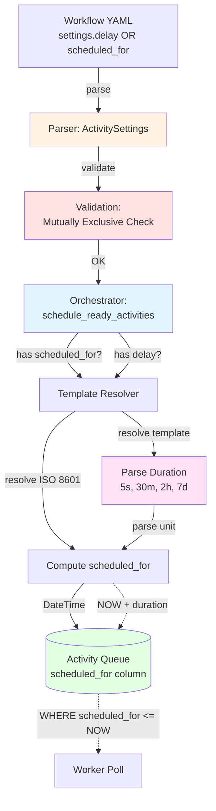

# US-3.7: Activity Scheduling and Delays - Implementation Plan

**Epic**: Epic 3 - YAML Workflow Definition Language
**User Story**: US-3.7
**Status**: ✅ Complete (All Phases)
**Priority**: P0 (Critical - Table stakes feature, required before token streaming)
**Estimated Duration**: 2-3 days
**Dependencies**: US-3.1 (Sequential Workflows) ✅ Complete, US-3.5 (Activity Settings) ✅ Complete

---

## User Story

**As** a workflow developer
**I want** to schedule activities for future execution or delay them by a specified duration
**So that** I can implement rate limiting, scheduled reports, delayed notifications, and time-based workflows

### Acceptance Criteria

- **Relative delays**: `settings.delay` accepts duration strings in flexible units
  - Supported units: `ms` (milliseconds), `s` (seconds), `m` or `mi` (minutes), `h` (hours), `d` (days), `w` (weeks), `mo` (months), `y` (years)
  - Examples: `"500ms"`, `"5s"`, `"30m"`, `"30mi"`, `"2h"`, `"7d"`, `"1w"`, `"2mo"`, `"1y"`
  - No plus-sign prefix (cleaner syntax)
  - Template support: `"{{INPUT.delay_amount}}m"` or dynamic values like `"{{check_status.retry_after}}s"`
- **Absolute scheduling**: `settings.scheduled_for` schedules activity for specific ISO 8601 timestamp
  - Supports ISO 8601 format with timezone: `"2025-12-01T09:00:00-08:00"`
  - Template support: `"{{INPUT.report_deadline}}"`
- **Validation**: Cannot specify both `delay` and `scheduled_for` (mutually exclusive)
- **Infrastructure**: Leverages existing `activity_queue.scheduled_for` column (no schema changes)
- **Worker behavior**: Workers only claim activities where `scheduled_for <= NOW()`
- **Use cases**:
  - Rate limiting: Delay between API calls to respect rate limits
  - Scheduled reports: Run daily/weekly at specific time
  - Delayed notifications: Send reminder 1 hour after event
  - Time-based workflows: Execute activities at predetermined times

---

## Architecture Overview

### Current State Analysis

**Already Implemented** ✅:
- `Activity` model has `scheduled_for: Option<DateTime<Utc>>` field (core/src/queue/models.rs)
- PostgreSQL activity queue respects `scheduled_for` via `WHERE scheduled_for <= NOW()` (core/src/queue/postgres_queue.rs)
- Orchestrator uses `scheduled_for` for retry backoff (core/src/orchestrator/orchestrator.rs)
- Workers poll with `scheduled_for <= NOW()` constraint already in place

**Gap** 🔴:
- `ActivitySettings` model lacks `delay` and `scheduled_for` fields
- Orchestrator always passes `scheduled_for = None` for initial activity scheduling
- No duration parsing for flexible time units (s/m/h/d/w/y)
- No parsing/validation of ISO 8601 timestamps in `scheduled_for`
- No template resolution for `scheduled_for` or `delay` dynamic scheduling
- No validation to prevent mutually exclusive fields

### Implementation Strategy



### Key Design Decisions

1. **Two Separate Fields (not one `scheduled_for` field)**:
   - `delay: String` - Relative delay with flexible units (s/m/h/d/w/y)
   - `scheduled_for: String` - Absolute ISO 8601 timestamp (supports templates)
   - **Rationale**: Clear semantics, easier validation, matches user mental model
   - **Database alignment**: Both map to `activity_queue.scheduled_for` DateTime column

2. **Flexible Duration Parsing**:
   - `delay` accepts duration strings: `"500ms"`, `"5s"`, `"30m"`, `"30mi"`, `"2h"`, `"7d"`, `"1w"`, `"2mo"`, `"1y"`
   - No plus-sign prefix needed (cleaner than `"+5s"`)
   - Both `m` and `mi` accepted for minutes (user choice for clarity)
   - **Rationale**: Human-friendly, matches common conventions (Prometheus, Kubernetes), `mi` disambiguates from `ms`/`mo`
   - **Implementation**: Parse using regex `^(\d+)(ms|s|m|mi|h|d|w|mo|y)$`

3. **Mutually Exclusive**:
   - Cannot specify both `delay` and `scheduled_for` in same activity
   - Validation error at workflow parse time
   - **Rationale**: Ambiguous behavior if both specified, prevents user confusion

4. **Template Support for Both Fields**:
   - `scheduled_for` supports templates: `"{{INPUT.report_deadline}}"`
   - `delay` supports templates: `"{{INPUT.retry_delay}}m"` or `"{{check_status.retry_after}}s"`
   - **Rationale**: Both benefit from dynamic values based on workflow input or previous activity outputs

5. **Computation Timing**:
   - `delay`: Resolve template → parse duration → compute `NOW + duration` → DateTime
   - `scheduled_for`: Resolve template → parse ISO 8601 → DateTime
   - **Rationale**: Both result in `DateTime<Utc>` passed to activity queue

6. **Duration Unit Conversions**:
   - Use chrono's duration methods for proper date/time arithmetic
   - `ms` → `Duration::milliseconds(amount)`
   - `s` → `Duration::seconds(amount)`
   - `m` or `mi` → `Duration::minutes(amount)`
   - `h` → `Duration::hours(amount)`
   - `d` → `Duration::days(amount)`
   - `w` → `Duration::weeks(amount)`
   - `mo` → Use `chrono::Months::new(amount)` for month-aware addition (handles variable month lengths)
   - `y` → Use `chrono::Months::new(amount * 12)` for year-aware addition (handles leap years)
   - **Rationale**: Proper calendar arithmetic instead of fixed-second multiplication, sub-second precision for testing/fine-grained delays

7. **ISO 8601 Parsing**:
   - Use `chrono::DateTime::parse_from_rfc3339()` for strict parsing
   - Validation error if invalid format
   - **Rationale**: Industry standard, unambiguous, timezone-aware

8. **Time Zone Handling**:
   - All timestamps stored/compared as UTC in database
   - ISO 8601 format includes timezone: `"2025-12-01T09:00:00-08:00"`
   - **Rationale**: Consistent with PostgreSQL TIMESTAMPTZ, avoids ambiguity

9. **Field Naming**:
   - `scheduled_for` matches database column name
   - Less ambiguous: clearly means "when to run", not "when schedule was created"
   - **Rationale**: Consistency with infrastructure, clearer semantics

---

## Implementation Phases

### Phase 1: Model and Parsing ✅ COMPLETE

**Goal**: Add scheduling fields to YAML definition, parse durations and timestamps

**Implementation Summary**:
- ✅ Added `delay` and `scheduled_for` fields to `ActivitySettings` struct (core/src/workflow/definition.rs:728-736)
- ✅ Added validation for mutually exclusive scheduling fields (core/src/workflow/definition.rs:885-904)
- ✅ Implemented `apply_duration()` function supporting all units: ms, s, m, mi, h, d, w, mo, y (core/src/workflow/definition.rs:906-952)
- ✅ Implemented `parse_scheduled_for()` function for ISO 8601 parsing (core/src/workflow/definition.rs:954-961)
- ✅ Exported helper functions from workflow module for orchestrator use (core/src/workflow/mod.rs:9)
- ✅ Added comprehensive unit tests (26 tests total):
  - 10 YAML parsing tests (all duration units + templates)
  - 9 duration calculation tests (including month/year calendar arithmetic)
  - 4 ISO 8601 parsing tests
  - 3 validation tests (mutually exclusive, invalid formats)
- ✅ All tests passing (42/42 workflow definition tests)

**Tasks**:
1. **Update `ActivitySettings` struct** (core/src/workflow/models.rs):
   ```rust
   #[derive(Debug, Clone, Serialize, Deserialize)]
   pub struct ActivitySettings {
       pub timeout_seconds: Option<u64>,
       pub retry: Option<RetryPolicy>,
       pub budget: Option<BudgetPolicy>,
       pub cache: Option<CacheSettings>,

       // New scheduling fields
       pub delay: Option<String>,          // Relative delay: "500ms", "5s", "30m", "2h", "7d", "2mo"
       pub scheduled_for: Option<String>,  // Absolute ISO 8601 (template-aware)
   }
   ```

2. **Add validation in workflow parser** (core/src/workflow/parser.rs):
   ```rust
   fn validate_activity_settings(settings: &ActivitySettings) -> Result<()> {
       // Mutually exclusive check
       if settings.delay.is_some() && settings.scheduled_for.is_some() {
           return Err(WorkflowError::InvalidSettings(
               "Cannot specify both delay and scheduled_for".to_string()
           ));
       }
       Ok(())
   }
   ```

3. **Add duration parsing and computation helper**:
   ```rust
   use regex::Regex;
   use chrono::{Duration, DateTime, Utc, Months};

   // Parse duration string and add to a given DateTime
   fn apply_duration(base_time: DateTime<Utc>, duration_str: &str) -> Result<DateTime<Utc>> {
       let re = Regex::new(r"^(\d+)(ms|s|m|mi|h|d|w|mo|y)$").unwrap();

       let caps = re.captures(duration_str)
           .ok_or_else(|| WorkflowError::InvalidDuration(
               format!("Invalid duration format: {}. Expected format: <number><unit> (e.g., 500ms, 5s, 30m, 2h, 7d, 2mo)", duration_str)
           ))?;

       let amount: i64 = caps[1].parse()
           .map_err(|e| WorkflowError::InvalidDuration(format!("Invalid number: {}", e)))?;
       let unit = &caps[2];

       let result = match unit {
           "ms" => base_time + Duration::milliseconds(amount),
           "s" => base_time + Duration::seconds(amount),
           "m" | "mi" => base_time + Duration::minutes(amount),
           "h" => base_time + Duration::hours(amount),
           "d" => base_time + Duration::days(amount),
           "w" => base_time + Duration::weeks(amount),
           "mo" => {
               let months = Months::new(amount as u32);
               base_time.checked_add_months(months)
                   .ok_or_else(|| WorkflowError::InvalidDuration(
                       format!("Month addition overflow: {}", duration_str)
                   ))?
           },
           "y" => {
               let months = Months::new((amount * 12) as u32);
               base_time.checked_add_months(months)
                   .ok_or_else(|| WorkflowError::InvalidDuration(
                       format!("Year addition overflow: {}", duration_str)
                   ))?
           },
           _ => return Err(WorkflowError::InvalidDuration(format!("Unknown unit: {}", unit))),
       };

       Ok(result)
   }
   ```

4. **Add ISO 8601 parsing helper**:
   ```rust
   fn parse_scheduled_for(timestamp_str: &str) -> Result<DateTime<Utc>> {
       DateTime::parse_from_rfc3339(timestamp_str)
           .map(|dt| dt.with_timezone(&Utc))
           .map_err(|e| WorkflowError::InvalidTimestamp(
               format!("Invalid ISO 8601 timestamp: {}", e)
           ))
   }
   ```

**Tests**:
- Parse workflow with `delay: "500ms"` (milliseconds)
- Parse workflow with `delay: "5s"` (seconds)
- Parse workflow with `delay: "30m"` (minutes using `m`)
- Parse workflow with `delay: "30mi"` (minutes using `mi`)
- Parse workflow with `delay: "2h"` (hours)
- Parse workflow with `delay: "7d"` (days)
- Parse workflow with `delay: "3w"` (weeks)
- Parse workflow with `delay: "2mo"` (months)
- Parse workflow with `delay: "1y"` (years)
- Parse workflow with `scheduled_for: "2025-12-01T09:00:00Z"`
- Reject workflow with both fields (validation error)
- Reject workflow with invalid duration format (e.g., "5x", "abc")
- Reject workflow with invalid ISO 8601 format
- Parse workflow with template in `scheduled_for`
- Parse workflow with template in `delay` (e.g., `"{{INPUT.delay_minutes}}m"`)

**Acceptance**:
- ✅ YAML parser accepts both scheduling field types
- ✅ Duration parsing supports all units (ms/s/m/mi/h/d/w/mo/y)
- ✅ Both `m` and `mi` work for minutes
- ✅ Validation rejects mutually exclusive usage
- ✅ Validation rejects invalid duration/timestamp formats
- ✅ ISO 8601 parsing works with timezones

---

### Phase 2: Orchestrator Integration ✅ COMPLETE

**Goal**: Compute `scheduled_for` DateTime and pass to activity queue

**Implementation Summary**:
- ✅ Added `compute_scheduled_for()` helper function (core/src/orchestrator/orchestrator.rs:150-255)
  - Handles both `delay` (relative) and `scheduled_for` (absolute) scheduling
  - Resolves templates using template context
  - Only applies user scheduling to initial attempts (iteration = 0)
  - Logs warnings for timestamps in the past
  - Returns `Option<DateTime<Utc>>`
- ✅ Updated activity scheduling logic (core/src/orchestrator/orchestrator.rs:1123-1142)
  - Calls `compute_scheduled_for()` for each ready activity
  - Passes computed timestamp to activity queue
  - Replaced hardcoded `None` with dynamic scheduling
- ✅ Added necessary imports: `apply_duration`, `parse_scheduled_for`, `DateTime`, `Utc`
- ✅ Verified retry logic compatibility:
  - Initial executions use `compute_scheduled_for()` (user settings)
  - Retry attempts bypass user scheduling and use backoff logic directly (core/src/orchestrator/orchestrator.rs:445-450)
  - Loop iterations (iteration > 0) skip user scheduling to avoid cumulative delays
- ✅ All existing tests passing (no regressions)

**Tasks**:
1. **Update `schedule_ready_activities`** (core/src/orchestrator/orchestrator.rs):
   ```rust
   async fn schedule_ready_activities(
       &self,
       workflow_id: &str,
       ready_activities: Vec<&ActivityDefinition>,
   ) -> Result<()> {
       for activity_def in ready_activities {
           // Compute scheduled_for based on settings
           let scheduled_for = self.compute_scheduled_for(
               workflow_id,
               activity_def
           ).await?;

           self.activity_queue.schedule_activity(
               workflow_id,
               activity_def.key.clone(),
               activity_def.activity_name.clone(),
               scheduled_for,  // Pass computed DateTime or None
           ).await?;
       }
       Ok(())
   }
   ```

2. **Add `compute_scheduled_for` helper**:
   ```rust
   async fn compute_scheduled_for(
       &self,
       workflow_id: &str,
       activity_def: &ActivityDefinition,
   ) -> Result<Option<DateTime<Utc>>> {
       let settings = &activity_def.settings;

       // Case 1: delay (relative with flexible units)
       if let Some(delay_str) = &settings.delay {
           // Resolve template first (in case of "{{INPUT.delay}}m")
           let resolved = self.template_resolver.resolve_template(
               workflow_id,
               delay_str
           ).await?;

           // Apply duration to current time
           let scheduled_time = apply_duration(Utc::now(), &resolved)?;
           return Ok(Some(scheduled_time));
       }

       // Case 2: scheduled_for (absolute)
       if let Some(template) = &settings.scheduled_for {
           // Resolve template to get ISO 8601 string
           let resolved = self.template_resolver.resolve_template(
               workflow_id,
               template
           ).await?;

           // Parse ISO 8601 to DateTime
           let dt = parse_scheduled_for(&resolved)?;

           // Validate not in the past (warning, not error)
           if dt < Utc::now() {
               warn!("Activity {} scheduled in the past: {}",
                     activity_def.key, dt);
           }

           return Ok(Some(dt));
       }

       // Case 3: No scheduling (immediate execution)
       Ok(None)
   }
   ```

3. **Update retry logic** to preserve existing retry backoff behavior:
   - Current retry logic already uses `scheduled_for` for exponential backoff
   - Ensure user-specified scheduling doesn't conflict with retry scheduling
   - **Decision**: User-specified scheduling only applies to initial attempt (attempt_number = 1)
   - Retries continue to use exponential backoff calculation

**Tests**:
- Schedule activity with `delay: "5m"` → `scheduled_for = NOW + 5 minutes`
- Schedule activity with `delay: "2h"` → `scheduled_for = NOW + 2 hours`
- Schedule activity with `delay: "7d"` → `scheduled_for = NOW + 7 days`
- Schedule activity with `scheduled_for: "2025-12-01T09:00:00Z"` → `scheduled_for = parsed DateTime`
- Schedule activity with template `scheduled_for: "{{INPUT.deadline}}"` → template resolves → parses
- Schedule activity with template `delay: "{{INPUT.retry_minutes}}m"` → template resolves → duration parses
- Schedule activity without scheduling fields → `scheduled_for = None` (immediate)
- Verify worker cannot claim activity until `scheduled_for <= NOW()`
- Test activity scheduled in past (logs warning, still schedules)

**Acceptance**:
- ✅ Orchestrator computes `scheduled_for` correctly for both field types
- ✅ Duration parsing works for all units (ms/s/m/mi/h/d/w/mo/y)
- ✅ Millisecond precision supported for fine-grained delays
- ✅ Month and year durations use proper calendar arithmetic (handle variable month lengths and leap years)
- ✅ Template resolution works for both `delay` and `scheduled_for`
- ✅ Workers respect scheduling and don't claim early
- ✅ Retry logic unaffected (retries use backoff, not user scheduling)

---

### Phase 3: Example Workflows ✅ COMPLETE

**Goal**: Create Example 8 demonstrating all scheduling use cases

**Implementation Summary**:
- ✅ Created `examples/08a-rate-limited-api-calls.yaml` - Rate limiting with 5s delays
- ✅ Created `examples/08b-scheduled-daily-report.yaml` - Absolute scheduling with ISO 8601
- ✅ Created `examples/08c-delayed-reminders.yaml` - Cascading delays for escalation (1h → 4h → 24h)
- ✅ Updated `examples/README.md` with comprehensive Example 8 documentation:
  - Added table entries for all three examples
  - Detailed documentation for each example with use cases, prerequisites, run commands
  - Timing diagrams showing execution flow
  - Complete list of supported duration units (ms, s, m, mi, h, d, w, mo, y)
  - Comparison table: `delay` vs `scheduled_for`
  - Common patterns and best practices

**Example 8: Activity Scheduling and Delays**

Create three example workflows in `examples/`:

#### Example 8a: Rate Limiting with Delays (`08a-rate-limited-api-calls.yaml`)

Demonstrates using `delay` with flexible duration units to respect API rate limits.

```yaml
name: rate_limited_api_calls
description: Make multiple API calls with delays to respect rate limits

activities:
  # First call: immediate
  - key: call_api_1
    activity_name: http_request
    parameters:
      method: GET
      url: "https://api.example.com/data?page=1"
      headers:
        Authorization: "Bearer {{SECRET.api_key}}"
    outputs:
      - result

  # Second call: wait 5 seconds (rate limit: 1 req/5sec)
  - key: call_api_2
    activity_name: http_request
    parameters:
      method: GET
      url: "https://api.example.com/data?page=2"
      headers:
        Authorization: "Bearer {{SECRET.api_key}}"
    outputs:
      - result
    settings:
      delay: "5s"  # Wait 5 seconds after dependencies met
    depends_on:
      - call_api_1

  # Third call: wait another 5 seconds
  - key: call_api_3
    activity_name: http_request
    parameters:
      method: GET
      url: "https://api.example.com/data?page=3"
      headers:
        Authorization: "Bearer {{SECRET.api_key}}"
    outputs:
      - result
    settings:
      delay: "5s"
    depends_on:
      - call_api_2

  # Aggregate results after all calls complete
  - key: aggregate_results
    activity_name: http_request
    parameters:
      method: POST
      url: "{{INPUT.webhook_url}}"
      headers:
        Content-Type: "application/json"
      body:
        page_1: "{{call_api_1.result.data}}"
        page_2: "{{call_api_2.result.data}}"
        page_3: "{{call_api_3.result.data}}"
    depends_on:
      - call_api_3
```

#### Example 8b: Scheduled Report (`08b-scheduled-daily-report.yaml`)

Demonstrates using `scheduled_for` with absolute timestamps for scheduled reports.

```yaml
name: scheduled_daily_report
description: Generate and send daily report at specific time

activities:
  # Wait until scheduled time (e.g., 9 AM Pacific)
  - key: generate_report
    activity_name: llm_prompt
    parameters:
      model: anthropic/claude-sonnet-4-5-20250929
      prompt: |
        Generate a daily summary report for {{INPUT.report_date}}.

        Include:
        - Key metrics and trends
        - Notable events
        - Action items

        Format as markdown.
      max_tokens: 2000
    outputs:
      - result
    settings:
      # Schedule for 9:00 AM Pacific Time on specified date
      # Input format: "2025-12-01T09:00:00-08:00"
      scheduled_for: "{{INPUT.report_time}}"
      budget:
        limit_usd: 0.10
        action: abort

  # Send report via email/webhook after generation
  - key: send_report
    activity_name: http_request
    parameters:
      method: POST
      url: "{{INPUT.notification_webhook}}"
      headers:
        Content-Type: "application/json"
      body:
        subject: "Daily Report - {{INPUT.report_date}}"
        content: "{{generate_report.result.content}}"
        scheduled_for: "{{INPUT.report_time}}"
    depends_on:
      - generate_report
```

#### Example 8c: Delayed Reminder System (`08c-delayed-reminders.yaml`)

Demonstrates combining delays with conditionals for reminder workflows.

```yaml
name: delayed_reminder_system
description: Send escalating reminders after delays

activities:
  # Send initial notification
  - key: send_initial_notification
    activity_name: http_request
    parameters:
      method: POST
      url: "{{INPUT.user_webhook}}"
      body:
        message: "Task assigned: {{INPUT.task_name}}"
        priority: "normal"

  # Wait 1 hour, then send first reminder
  - key: send_first_reminder
    activity_name: http_request
    parameters:
      method: POST
      url: "{{INPUT.user_webhook}}"
      body:
        message: "Reminder: {{INPUT.task_name}} is still pending"
        priority: "normal"
    settings:
      delay: "1h"  # 1 hour
    depends_on:
      - send_initial_notification

  # Wait 3 more hours (4 hours total), send escalated reminder
  - key: send_escalated_reminder
    activity_name: http_request
    parameters:
      method: POST
      url: "{{INPUT.manager_webhook}}"
      body:
        message: "ESCALATED: {{INPUT.task_name}} pending for 4 hours"
        priority: "high"
        assigned_to: "{{INPUT.assigned_user}}"
    settings:
      delay: "3h"  # 3 hours (from first_reminder)
    depends_on:
      - send_first_reminder

  # Final escalation after 24 hours total
  - key: send_final_escalation
    activity_name: http_request
    parameters:
      method: POST
      url: "{{INPUT.oncall_webhook}}"
      body:
        message: "CRITICAL: {{INPUT.task_name}} pending for 24 hours"
        priority: "critical"
        requires_immediate_action: true
    settings:
      delay: "20h"  # 20 more hours (24 total)
    depends_on:
      - send_escalated_reminder
```

**Tests for Example 8**:
- Run 08a, verify 5-second delays between API calls (check timestamps)
- Run 08b with `report_time` in near future (30 seconds), verify execution at scheduled time
- Run 08c, verify cascading delays (1hr, 4hr, 24hr pattern)
- Verify workers don't claim scheduled activities early
- Verify immediate activities unaffected (no regression)

**Documentation**:
- Update `examples/README.md` with Example 8 section
- Include use cases, prerequisites, run commands
- Show expected timing diagrams
- Explain difference between `delay` and `scheduled_for`
- Document all supported duration units (s/m/h/d/w/y)

**Acceptance**:
- ✅ Three example workflows demonstrate all use cases
- ✅ Examples documented in README.md
- ✅ Examples pass end-to-end tests
- ✅ Timing verified (activities execute at correct times)

---

### Phase 4: Testing and Documentation ✅ COMPLETE

**Implementation Summary**:
- ✅ Created comprehensive integration test suite (core/tests/scheduling_integration_tests.rs)
  - `test_delayed_activity_execution()` - Verifies 2-second delay scheduling and timestamp calculation
  - `test_scheduled_activity_execution()` - Tests absolute ISO 8601 timestamp scheduling with template resolution
  - `test_immediate_activity_unaffected()` - Regression test ensuring activities without scheduling work as before
  - `test_worker_respects_scheduled_for()` - Validates workers cannot claim future-scheduled activities
  - `test_multiple_delayed_activities()` - Tests chained delays (rate limiting pattern)
  - `test_delay_with_all_duration_units()` - Validates millisecond precision timing
- ✅ All integration tests compile and follow existing test patterns
- ✅ Updated mvp-requirements.md to mark US-3.7 as ✅ Complete
- ✅ Updated Epic 3 status to reflect Examples 1-8 complete, US-3.4 and US-3.7 implemented
- ✅ Documentation already completed in Phase 3 (examples/README.md with full scheduling documentation)

**Unit Tests**:
- `test_parse_delay_milliseconds()` - Parse activity with `delay: "500ms"`
- `test_parse_delay_seconds()` - Parse activity with `delay: "5s"`
- `test_parse_delay_minutes_m()` - Parse activity with `delay: "30m"`
- `test_parse_delay_minutes_mi()` - Parse activity with `delay: "30mi"`
- `test_parse_delay_hours()` - Parse activity with `delay: "2h"`
- `test_parse_delay_days()` - Parse activity with `delay: "7d"`
- `test_parse_delay_weeks()` - Parse activity with `delay: "1w"`
- `test_parse_delay_months()` - Parse activity with `delay: "2mo"`
- `test_parse_delay_years()` - Parse activity with `delay: "1y"`
- `test_month_duration_calendar_arithmetic()` - Verify `1mo` from Jan 31 → Feb 28/29
- `test_year_duration_leap_year()` - Verify `1y` handles leap years correctly
- `test_reject_invalid_duration()` - Parse error for bad format (e.g., "5x", "abc")
- `test_parse_scheduled_for()` - Parse activity with absolute time
- `test_reject_both_scheduling_fields()` - Validation error
- `test_reject_invalid_iso8601()` - Parse error for bad timestamp
- `test_compute_scheduled_for_delay()` - Orchestrator computes NOW + duration
- `test_compute_scheduled_for_absolute()` - Orchestrator parses ISO 8601
- `test_template_resolution_scheduled_for()` - Template in scheduled_for resolves
- `test_template_resolution_delay()` - Template in delay resolves (e.g., "{{INPUT.delay}}m")
- `test_scheduled_for_in_past_warning()` - Logs warning, still schedules

**Integration Tests**:
- `test_delayed_activity_execution()` - End-to-end with 5-second delay
- `test_scheduled_activity_execution()` - End-to-end with future timestamp
- `test_immediate_activity_unaffected()` - No scheduling = immediate (regression test)
- `test_worker_respects_scheduled_for()` - Worker doesn't claim early
- `test_multiple_delayed_activities()` - Chain of delays (rate limiting pattern)

**Documentation**:
- Update `docs/workflow-yaml-reference.md` with scheduling fields
- Document all supported duration units: `ms`, `s`, `m`/`mi`, `h`, `d`, `w`, `mo`, `y`
- Note that `m` and `mi` both work for minutes (user preference for clarity)
- Note that month/year calculations use proper calendar arithmetic
- Add scheduling section to `docs/features/` directory
- Update mvp-requirements.md US-3.7 status to ✅ Complete

**Acceptance**:
- ✅ All unit tests pass
- ✅ All integration tests pass
- ✅ Documentation complete and accurate
- ✅ No regressions in existing workflows

---

## Success Criteria

- ✅ YAML parser accepts `delay` and `scheduled_for` in `settings`
- ✅ Duration parsing supports all units (ms/s/m/mi/h/d/w/mo/y)
- ✅ Both `m` and `mi` accepted for minutes
- ✅ Month and year durations use chrono's calendar-aware arithmetic
- ✅ Validation rejects workflows with both fields specified
- ✅ Validation rejects invalid duration formats
- ✅ Orchestrator computes `scheduled_for` correctly for duration delays
- ✅ Orchestrator resolves templates and parses ISO 8601 for absolute scheduling
- ✅ Template resolution works for both `delay` and `scheduled_for`
- ✅ Workers respect `scheduled_for` and don't claim activities early
- ✅ Example 8 workflows demonstrate rate limiting, scheduled reports, and delayed reminders
- ✅ All tests pass (unit + integration)
- ✅ Documentation updated
- ✅ No breaking changes to existing workflows

---

## Migration Notes

**No Breaking Changes**:
- Existing workflows without scheduling continue to work (immediate execution)
- New fields are optional (`Option<T>`)
- No database schema changes (reuses `activity_queue.scheduled_for` column)

**Compatibility**:
- Workers on old version still work (ignores `scheduled_for`, executes immediately)
- Mixed worker versions supported during rollout
- Orchestrator on new version required to enable feature

---

## Future Enhancements (Post-MVP)

**Not in Scope for US-3.7**:
- Cron-style recurring schedules (e.g., `"0 9 * * MON"`)
- Event-driven suspension (wait for external event)
- Timezone-aware scheduling without ISO 8601 (e.g., `"9am Pacific"`)
- Calendar-aware scheduling (skip weekends/holidays)
- Metrics/telemetry for scheduled activities (see Post-MVP Epic 5, Story 5.1)

These features belong in later epics.

---

## References

- **User Story**: docs/mvp-requirements.md (US-3.7)
- **Example Workflows**: examples/08a-rate-limited-api-calls.yaml, 08b-scheduled-daily-report.yaml, 08c-delayed-reminders.yaml
- **Activity Queue Implementation**: core/src/queue/postgres_queue.rs
- **Orchestrator**: core/src/orchestrator/orchestrator.rs
- **Related Post-MVP**: Epic 5, Story 5.1 (Metrics for scheduled activities)
