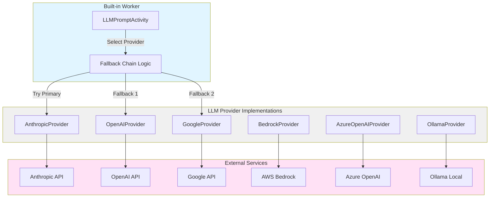
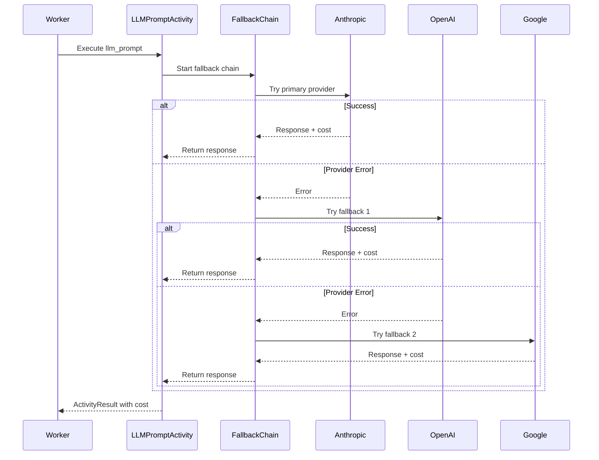

# US-5.1: Multi-Provider LLM Activities - Implementation Plan

**Epic**: Epic 5 - Built-In Activity Library
**User Story**: US-5.1
**Status**: Not Started
**Priority**: High (Required for Example 4)
**Estimated Duration**: 4-5 days
**MVP Providers**: Anthropic, OpenAI, Google Gemini, Ollama (4 providers)
**Dependencies**:
- US-3.5 (Activity Settings) - For retry and budget tracking
- US-5.4 (Object Storage) ✅ Complete - For storing large prompts/responses

---

## User Story

**As** an AI startup engineer
**I want** built-in support for all major LLM providers
**So that** I can switch providers without code changes and implement automatic fallback

### Acceptance Criteria

**MVP Scope**:
- ✅ Built-in model providers: Anthropic (Claude), OpenAI (GPT-4), Google Gemini, Ollama (self-hosted)
- ✅ `llm_prompt` activity with automatic model fallback
- ✅ Model fallback chain: Try Anthropic → OpenAI → Gemini → Ollama
- ✅ Embedding generation: `embedding_generate` activity (OpenAI, Google, Ollama)
- ✅ Cost tracking for cloud providers (Anthropic, OpenAI, Google)
- ✅ Self-hosted support via Ollama (free, no API costs)

**Post-MVP**:
- 🔮 AWS Bedrock, Azure OpenAI providers
- 🔮 Token streaming support for real-time responses
- 🔮 Automatic model selection based on budget
- 🔮 Ollama authentication for production deployments

### Example Usage

```yaml
activities:
  - key: analyze_data
    worker: ai
    name: llm_prompt
    parameters:
      provider: anthropic
      model: claude-3-5-sonnet-20241022
      prompt: "Analyze the following data: {{INPUT.data}}"
      max_tokens: 1000
      temperature: 0.7
    settings:
      retry:
        max_attempts: 3
        strategy: exponential
      budget:
        limit: 2.00
        action: abort
    outputs:
      - name: analysis
        type: value

  - key: fallback_chain
    worker: ai
    name: llm_prompt
    parameters:
      fallback_chain:
        - provider: anthropic
          model: claude-3-5-sonnet-20241022
        - provider: openai
          model: gpt-4
        - provider: google
          model: gemini-pro
      prompt: "Summarize: {{INPUT.text}}"
    settings:
      budget:
        limit: 5.00
```

---

## Architecture Overview

### HTTP API Approach

**Implementation Strategy**: All LLM providers will be implemented using **reqwest** with direct HTTP API calls, avoiding provider-specific SDKs.

**Rationale**:
- **Minimal dependencies**: No heavy provider SDKs (OpenAI SDK, Anthropic SDK, etc.)
- **Simple maintenance**: Direct control over API requests and responses
- **Consistent interface**: All providers use the same HTTP client infrastructure
- **Transparent**: Easy to debug and understand API interactions

**Provider HTTP API Support**:
| Provider        | HTTP API Available | Authentication          | MVP Status      |
|-----------------|-------------------|-------------------------|-----------------|
| Anthropic       | ✅ Yes            | Custom header (x-api-key) | ✅ MVP          |
| OpenAI          | ✅ Yes            | Bearer token            | ✅ MVP          |
| Google Gemini   | ✅ Yes            | API key (query/header)  | ✅ MVP          |
| Ollama (Local)  | ✅ Yes            | None (local server)     | ✅ MVP          |
| Azure OpenAI    | ✅ Yes            | API key header          | 🔮 Post-MVP     |
| AWS Bedrock     | ⚠️ Complex        | AWS SigV4 signing       | 🔮 Post-MVP     |

**Note on AWS Bedrock**: Requires AWS Signature V4 request signing. Post-MVP implementation may use `aws-sigv4` crate or `aws-sdk-bedrockruntime` for this provider only.

### LLM Provider Interface



### Fallback Chain Execution



---

## Implementation Tasks

### 1. Define LLM Provider Interface

**File**: `worker/src/llm/provider.rs` (new)

**Purpose**: Abstract interface for all LLM providers

```rust
use async_trait::async_trait;
use serde::{Deserialize, Serialize};
use futures::stream::Stream;

/// LLM provider interface
#[async_trait]
pub trait LLMProvider: Send + Sync {
    /// Provider name (anthropic, openai, google, etc.)
    fn name(&self) -> &str;

    /// Generate completion from prompt
    async fn complete(
        &self,
        request: &CompletionRequest,
    ) -> Result<CompletionResponse>;

    /// Generate streaming completion
    async fn complete_stream(
        &self,
        request: &CompletionRequest,
    ) -> Result<Pin<Box<dyn Stream<Item = Result<CompletionChunk>> + Send>>>;

    /// Generate embeddings
    async fn embed(
        &self,
        request: &EmbeddingRequest,
    ) -> Result<EmbeddingResponse>;

    /// Count tokens in text (estimate if not supported)
    fn count_tokens(&self, text: &str, model: &str) -> Result<usize>;

    /// Calculate cost for completion
    fn calculate_cost(&self, model: &str, usage: &TokenUsage) -> Result<f64>;
}

/// Completion request
#[derive(Debug, Clone, Serialize, Deserialize)]
pub struct CompletionRequest {
    pub model: String,
    pub prompt: String,
    pub system_prompt: Option<String>,
    pub max_tokens: Option<u32>,
    pub temperature: Option<f64>,
    pub top_p: Option<f64>,
    pub stop_sequences: Option<Vec<String>>,
}

/// Completion response
#[derive(Debug, Clone, Serialize, Deserialize)]
pub struct CompletionResponse {
    pub content: String,
    pub model: String,
    pub usage: TokenUsage,
    pub finish_reason: FinishReason,
    pub cost_usd: Decimal,
}

/// Token usage statistics
#[derive(Debug, Clone, Serialize, Deserialize)]
pub struct TokenUsage {
    pub prompt_tokens: u32,
    pub completion_tokens: u32,
    pub total_tokens: u32,
}

/// Completion finish reason
#[derive(Debug, Clone, Serialize, Deserialize)]
pub enum FinishReason {
    Stop,
    MaxTokens,
    ContentFilter,
    Error,
}

/// Streaming chunk
#[derive(Debug, Clone, Serialize, Deserialize)]
pub struct CompletionChunk {
    pub content: String,
    pub finish_reason: Option<FinishReason>,
}

/// Embedding request
#[derive(Debug, Clone, Serialize, Deserialize)]
pub struct EmbeddingRequest {
    pub model: String,
    pub input: Vec<String>,
}

/// Embedding response
#[derive(Debug, Clone, Serialize, Deserialize)]
pub struct EmbeddingResponse {
    pub embeddings: Vec<Vec<f64>>,
    pub model: String,
    pub usage: TokenUsage,
    pub cost_usd: Decimal,
}

pub type Result<T> = std::result::Result<T, LLMError>;

#[derive(Debug, thiserror::Error)]
pub enum LLMError {
    #[error("Provider error: {0}")]
    ProviderError(String),

    #[error("Invalid model: {0}")]
    InvalidModel(String),

    #[error("Rate limit exceeded")]
    RateLimitExceeded,

    #[error("Authentication failed")]
    AuthenticationFailed,

    #[error("Insufficient quota")]
    InsufficientQuota,

    #[error("Request error: {0}")]
    RequestError(#[from] reqwest::Error),

    #[error("JSON error: {0}")]
    JsonError(#[from] serde_json::Error),
}
```

**Test Cases**:
- ✅ Interface compiles
- ✅ Error types cover all cases

---

### 2. Implement Anthropic Provider

**File**: `worker/src/llm/anthropic.rs` (new)

**Implementation**: Direct HTTP API calls using `reqwest` (no SDK dependency)

```rust
use super::provider::*;
use reqwest::Client;
use serde_json::json;

pub struct AnthropicProvider {
    client: Client,
    api_key: String,
}

impl AnthropicProvider {
    pub fn new(api_key: String) -> Self {
        Self {
            client: Client::new(),
            api_key,
        }
    }

    fn get_model_pricing(&self, model: &str) -> Option<ModelPricing> {
        // Pricing as of Nov 2024
        match model {
            "claude-3-5-sonnet-20241022" => Some(ModelPricing {
                input_per_million: 3.00,
                output_per_million: 15.00,
            }),
            "claude-3-5-haiku-20241022" => Some(ModelPricing {
                input_per_million: 0.80,
                output_per_million: 4.00,
            }),
            "claude-3-opus-20240229" => Some(ModelPricing {
                input_per_million: 15.00,
                output_per_million: 75.00,
            }),
            _ => None,
        }
    }
}

struct ModelPricing {
    input_per_million: f64,
    output_per_million: f64,
}

#[async_trait]
impl LLMProvider for AnthropicProvider {
    fn name(&self) -> &str {
        "anthropic"
    }

    async fn complete(&self, request: &CompletionRequest) -> Result<CompletionResponse> {
        let mut messages = vec![json!({
            "role": "user",
            "content": request.prompt,
        })];

        let mut body = json!({
            "model": request.model,
            "messages": messages,
            "max_tokens": request.max_tokens.unwrap_or(4096),
        });

        if let Some(system) = &request.system_prompt {
            body["system"] = json!(system);
        }

        if let Some(temp) = request.temperature {
            body["temperature"] = json!(temp);
        }

        if let Some(top_p) = request.top_p {
            body["top_p"] = json!(top_p);
        }

        if let Some(stops) = &request.stop_sequences {
            body["stop_sequences"] = json!(stops);
        }

        let response = self
            .client
            .post("https://api.anthropic.com/v1/messages")
            .header("x-api-key", &self.api_key)
            .header("anthropic-version", "2023-06-01")
            .header("content-type", "application/json")
            .json(&body)
            .send()
            .await?;

        if !response.status().is_success() {
            let error_text = response.text().await?;
            return Err(LLMError::ProviderError(error_text));
        }

        let response_json: serde_json::Value = response.json().await?;

        let content = response_json["content"][0]["text"]
            .as_str()
            .ok_or_else(|| LLMError::ProviderError("No content in response".to_string()))?
            .to_string();

        let usage = TokenUsage {
            prompt_tokens: response_json["usage"]["input_tokens"].as_u64().unwrap_or(0) as u32,
            completion_tokens: response_json["usage"]["output_tokens"].as_u64().unwrap_or(0)
                as u32,
            total_tokens: 0,
        };
        let total_tokens = usage.prompt_tokens + usage.completion_tokens;
        let usage = TokenUsage {
            total_tokens,
            ..usage
        };

        let cost_usd = self.calculate_cost(&request.model, &usage)?;

        let finish_reason = match response_json["stop_reason"].as_str() {
            Some("end_turn") => FinishReason::Stop,
            Some("max_tokens") => FinishReason::MaxTokens,
            Some("stop_sequence") => FinishReason::Stop,
            _ => FinishReason::Stop,
        };

        Ok(CompletionResponse {
            content,
            model: request.model.clone(),
            usage,
            finish_reason,
            cost_usd,
        })
    }

    async fn complete_stream(
        &self,
        request: &CompletionRequest,
    ) -> Result<Pin<Box<dyn Stream<Item = Result<CompletionChunk>> + Send>>> {
        // Implement streaming using Server-Sent Events (SSE)
        // Similar to complete() but with stream: true and parse SSE events
        todo!("Implement streaming for Anthropic")
    }

    async fn embed(&self, request: &EmbeddingRequest) -> Result<EmbeddingResponse> {
        // Anthropic doesn't have embeddings API yet
        Err(LLMError::ProviderError(
            "Anthropic does not support embeddings".to_string(),
        ))
    }

    fn count_tokens(&self, text: &str, _model: &str) -> Result<usize> {
        // Rough approximation: 1 token ≈ 4 characters
        // For production, use tiktoken or Claude's tokenizer
        Ok(text.len() / 4)
    }

    fn calculate_cost(&self, model: &str, usage: &TokenUsage) -> Result<f64> {
        let pricing = self
            .get_model_pricing(model)
            .ok_or_else(|| LLMError::InvalidModel(model.to_string()))?;

        let input_cost = (usage.prompt_tokens as f64 / 1_000_000.0) * pricing.input_per_million;
        let output_cost =
            (usage.completion_tokens as f64 / 1_000_000.0) * pricing.output_per_million;

        Ok(input_cost + output_cost)
    }
}
```

**Test Cases**:
- ✅ API request format is correct
- ✅ Response parsed correctly
- ✅ Token usage extracted
- ✅ Cost calculated correctly
- ✅ Error handling for API failures
- ⏳ Integration test with real API (optional, use mock)

---

### 3. Implement OpenAI Provider

**File**: `worker/src/llm/openai.rs` (new)

**Implementation**: Direct HTTP API calls using `reqwest` (no SDK dependency)

```rust
use super::provider::*;
use reqwest::Client;
use serde_json::json;

pub struct OpenAIProvider {
    client: Client,
    api_key: String,
}

impl OpenAIProvider {
    pub fn new(api_key: String) -> Self {
        Self {
            client: Client::new(),
            api_key,
        }
    }

    fn get_model_pricing(&self, model: &str) -> Option<ModelPricing> {
        // Pricing as of Nov 2024
        match model {
            "gpt-4-turbo" | "gpt-4-turbo-2024-04-09" => Some(ModelPricing {
                input_per_million: 10.00,
                output_per_million: 30.00,
            }),
            "gpt-4o" | "gpt-4o-2024-11-20" => Some(ModelPricing {
                input_per_million: 2.50,
                output_per_million: 10.00,
            }),
            "gpt-4o-mini" | "gpt-4o-mini-2024-07-18" => Some(ModelPricing {
                input_per_million: 0.15,
                output_per_million: 0.60,
            }),
            "gpt-3.5-turbo" => Some(ModelPricing {
                input_per_million: 0.50,
                output_per_million: 1.50,
            }),
            _ => None,
        }
    }
}

struct ModelPricing {
    input_per_million: f64,
    output_per_million: f64,
}

#[async_trait]
impl LLMProvider for OpenAIProvider {
    fn name(&self) -> &str {
        "openai"
    }

    async fn complete(&self, request: &CompletionRequest) -> Result<CompletionResponse> {
        let mut messages = Vec::new();

        if let Some(system) = &request.system_prompt {
            messages.push(json!({
                "role": "system",
                "content": system,
            }));
        }

        messages.push(json!({
            "role": "user",
            "content": request.prompt,
        }));

        let mut body = json!({
            "model": request.model,
            "messages": messages,
        });

        if let Some(max_tokens) = request.max_tokens {
            body["max_tokens"] = json!(max_tokens);
        }

        if let Some(temp) = request.temperature {
            body["temperature"] = json!(temp);
        }

        if let Some(top_p) = request.top_p {
            body["top_p"] = json!(top_p);
        }

        if let Some(stops) = &request.stop_sequences {
            body["stop"] = json!(stops);
        }

        let response = self
            .client
            .post("https://api.openai.com/v1/chat/completions")
            .header("Authorization", format!("Bearer {}", self.api_key))
            .header("content-type", "application/json")
            .json(&body)
            .send()
            .await?;

        if !response.status().is_success() {
            let error_text = response.text().await?;
            return Err(LLMError::ProviderError(error_text));
        }

        let response_json: serde_json::Value = response.json().await?;

        let content = response_json["choices"][0]["message"]["content"]
            .as_str()
            .ok_or_else(|| LLMError::ProviderError("No content in response".to_string()))?
            .to_string();

        let usage = TokenUsage {
            prompt_tokens: response_json["usage"]["prompt_tokens"].as_u64().unwrap_or(0) as u32,
            completion_tokens: response_json["usage"]["completion_tokens"]
                .as_u64()
                .unwrap_or(0) as u32,
            total_tokens: response_json["usage"]["total_tokens"].as_u64().unwrap_or(0) as u32,
        };

        let cost_usd = self.calculate_cost(&request.model, &usage)?;

        let finish_reason = match response_json["choices"][0]["finish_reason"].as_str() {
            Some("stop") => FinishReason::Stop,
            Some("length") => FinishReason::MaxTokens,
            Some("content_filter") => FinishReason::ContentFilter,
            _ => FinishReason::Stop,
        };

        Ok(CompletionResponse {
            content,
            model: request.model.clone(),
            usage,
            finish_reason,
            cost_usd,
        })
    }

    async fn complete_stream(
        &self,
        request: &CompletionRequest,
    ) -> Result<Pin<Box<dyn Stream<Item = Result<CompletionChunk>> + Send>>> {
        todo!("Implement streaming for OpenAI")
    }

    async fn embed(&self, request: &EmbeddingRequest) -> Result<EmbeddingResponse> {
        let body = json!({
            "model": request.model,
            "input": request.input,
        });

        let response = self
            .client
            .post("https://api.openai.com/v1/embeddings")
            .header("Authorization", format!("Bearer {}", self.api_key))
            .header("content-type", "application/json")
            .json(&body)
            .send()
            .await?;

        if !response.status().is_success() {
            let error_text = response.text().await?;
            return Err(LLMError::ProviderError(error_text));
        }

        let response_json: serde_json::Value = response.json().await?;

        let embeddings: Vec<Vec<f64>> = response_json["data"]
            .as_array()
            .ok_or_else(|| LLMError::ProviderError("No embeddings in response".to_string()))?
            .iter()
            .map(|item| {
                item["embedding"]
                    .as_array()
                    .unwrap()
                    .iter()
                    .map(|v| v.as_f64().unwrap())
                    .collect()
            })
            .collect();

        let usage = TokenUsage {
            prompt_tokens: response_json["usage"]["prompt_tokens"].as_u64().unwrap_or(0) as u32,
            completion_tokens: 0,
            total_tokens: response_json["usage"]["total_tokens"].as_u64().unwrap_or(0) as u32,
        };

        // Embedding pricing (text-embedding-3-small: $0.02/1M tokens)
        let cost_usd = (usage.total_tokens as f64 / 1_000_000.0) * 0.02;

        Ok(EmbeddingResponse {
            embeddings,
            model: request.model.clone(),
            usage,
            cost_usd,
        })
    }

    fn count_tokens(&self, text: &str, _model: &str) -> Result<usize> {
        // Use tiktoken for accurate counting (or approximation)
        Ok(text.len() / 4)
    }

    fn calculate_cost(&self, model: &str, usage: &TokenUsage) -> Result<f64> {
        let pricing = self
            .get_model_pricing(model)
            .ok_or_else(|| LLMError::InvalidModel(model.to_string()))?;

        let input_cost = (usage.prompt_tokens as f64 / 1_000_000.0) * pricing.input_per_million;
        let output_cost =
            (usage.completion_tokens as f64 / 1_000_000.0) * pricing.output_per_million;

        Ok(input_cost + output_cost)
    }
}
```

**Test Cases**:
- ✅ API request format is correct
- ✅ Response parsed correctly
- ✅ Token usage extracted
- ✅ Cost calculated correctly
- ✅ Embeddings work correctly

---

### 4. Implement Google Gemini Provider

**File**: `worker/src/llm/google.rs` (new)

**Implementation**: Direct HTTP API calls using `reqwest` (no SDK dependency)

**API Details**:
- Endpoint: `https://generativelanguage.googleapis.com/v1beta/models/{model}:generateContent`
- Authentication: API key via query parameter or `x-goog-api-key` header
- Models: `gemini-2.0-flash-exp`, `gemini-1.5-pro`, `gemini-1.5-flash`

```rust
use super::provider::*;
use reqwest::Client;
use serde_json::json;

pub struct GoogleProvider {
    client: Client,
    api_key: String,
}

impl GoogleProvider {
    pub fn new(api_key: String) -> Self {
        Self {
            client: Client::new(),
            api_key,
        }
    }

    fn get_model_pricing(&self, model: &str) -> Option<ModelPricing> {
        // Pricing as of Nov 2024
        match model {
            "gemini-2.0-flash-exp" => Some(ModelPricing {
                input_per_million: 0.00,  // Free during experimental
                output_per_million: 0.00,
            }),
            "gemini-1.5-pro" => Some(ModelPricing {
                input_per_million: 1.25,
                output_per_million: 5.00,
            }),
            "gemini-1.5-flash" => Some(ModelPricing {
                input_per_million: 0.075,
                output_per_million: 0.30,
            }),
            _ => None,
        }
    }
}

struct ModelPricing {
    input_per_million: f64,
    output_per_million: f64,
}

#[async_trait]
impl LLMProvider for GoogleProvider {
    fn name(&self) -> &str {
        "google"
    }

    async fn complete(&self, request: &CompletionRequest) -> Result<CompletionResponse> {
        let mut contents = Vec::new();

        if let Some(system) = &request.system_prompt {
            contents.push(json!({
                "role": "user",
                "parts": [{"text": system}]
            }));
        }

        contents.push(json!({
            "role": "user",
            "parts": [{"text": request.prompt}]
        }));

        let mut body = json!({
            "contents": contents,
        });

        if let Some(max_tokens) = request.max_tokens {
            body["generationConfig"] = json!({
                "maxOutputTokens": max_tokens
            });
        }

        if let Some(temp) = request.temperature {
            body["generationConfig"]["temperature"] = json!(temp);
        }

        if let Some(top_p) = request.top_p {
            body["generationConfig"]["topP"] = json!(top_p);
        }

        let url = format!(
            "https://generativelanguage.googleapis.com/v1beta/models/{}:generateContent",
            request.model
        );

        let response = self
            .client
            .post(&url)
            .header("x-goog-api-key", &self.api_key)
            .header("content-type", "application/json")
            .json(&body)
            .send()
            .await?;

        if !response.status().is_success() {
            let error_text = response.text().await?;
            return Err(LLMError::ProviderError(error_text));
        }

        let response_json: serde_json::Value = response.json().await?;

        let content = response_json["candidates"][0]["content"]["parts"][0]["text"]
            .as_str()
            .ok_or_else(|| LLMError::ProviderError("No content in response".to_string()))?
            .to_string();

        let usage = TokenUsage {
            prompt_tokens: response_json["usageMetadata"]["promptTokenCount"]
                .as_u64()
                .unwrap_or(0) as u32,
            completion_tokens: response_json["usageMetadata"]["candidatesTokenCount"]
                .as_u64()
                .unwrap_or(0) as u32,
            total_tokens: response_json["usageMetadata"]["totalTokenCount"]
                .as_u64()
                .unwrap_or(0) as u32,
        };

        let cost_usd = self.calculate_cost(&request.model, &usage)?;

        let finish_reason = match response_json["candidates"][0]["finishReason"].as_str() {
            Some("STOP") => FinishReason::Stop,
            Some("MAX_TOKENS") => FinishReason::MaxTokens,
            Some("SAFETY") => FinishReason::ContentFilter,
            _ => FinishReason::Stop,
        };

        Ok(CompletionResponse {
            content,
            model: request.model.clone(),
            usage,
            finish_reason,
            cost_usd,
        })
    }

    async fn complete_stream(
        &self,
        request: &CompletionRequest,
    ) -> Result<Pin<Box<dyn Stream<Item = Result<CompletionChunk>> + Send>>> {
        todo!("Implement streaming for Google Gemini")
    }

    async fn embed(&self, request: &EmbeddingRequest) -> Result<EmbeddingResponse> {
        // Gemini embeddings available via embedding-001 model
        let url = format!(
            "https://generativelanguage.googleapis.com/v1beta/models/{}:embedContent",
            request.model
        );

        let mut embeddings = Vec::new();
        let mut total_tokens = 0u32;

        for text in &request.input {
            let body = json!({
                "content": {
                    "parts": [{"text": text}]
                }
            });

            let response = self
                .client
                .post(&url)
                .header("x-goog-api-key", &self.api_key)
                .header("content-type", "application/json")
                .json(&body)
                .send()
                .await?;

            if !response.status().is_success() {
                let error_text = response.text().await?;
                return Err(LLMError::ProviderError(error_text));
            }

            let response_json: serde_json::Value = response.json().await?;

            let embedding: Vec<f64> = response_json["embedding"]["values"]
                .as_array()
                .ok_or_else(|| LLMError::ProviderError("No embedding in response".to_string()))?
                .iter()
                .map(|v| v.as_f64().unwrap_or(0.0))
                .collect();

            embeddings.push(embedding);
            total_tokens += text.len() as u32 / 4; // Rough estimate
        }

        let usage = TokenUsage {
            prompt_tokens: total_tokens,
            completion_tokens: 0,
            total_tokens,
        };

        // Gemini embeddings pricing: ~$0.00001 per 1K tokens
        let cost_usd = (usage.total_tokens as f64 / 1_000_000.0) * 0.01;

        Ok(EmbeddingResponse {
            embeddings,
            model: request.model.clone(),
            usage,
            cost_usd,
        })
    }

    fn count_tokens(&self, text: &str, _model: &str) -> Result<usize> {
        Ok(text.len() / 4)
    }

    fn calculate_cost(&self, model: &str, usage: &TokenUsage) -> Result<f64> {
        let pricing = self
            .get_model_pricing(model)
            .ok_or_else(|| LLMError::InvalidModel(model.to_string()))?;

        let input_cost = (usage.prompt_tokens as f64 / 1_000_000.0) * pricing.input_per_million;
        let output_cost =
            (usage.completion_tokens as f64 / 1_000_000.0) * pricing.output_per_million;

        Ok(input_cost + output_cost)
    }
}
```

**Test Cases**:
- ✅ API request format is correct
- ✅ Response parsed correctly
- ✅ Token usage extracted
- ✅ Cost calculated correctly
- ✅ Embeddings work correctly (embedding-001 model)

---

### 5. Implement Ollama Provider

**File**: `worker/src/llm/ollama.rs` (new)

**Implementation**: Direct HTTP API calls using `reqwest` (no SDK dependency)

**API Details**:
- Endpoint: `http://localhost:11434/api/generate` (default)
- Authentication: None (local server)
- Models: Any model pulled to local Ollama (llama3.2, mistral, qwen2.5, etc.)

```rust
use super::provider::*;
use reqwest::Client;
use serde_json::json;

pub struct OllamaProvider {
    client: Client,
    base_url: String,
}

impl OllamaProvider {
    pub fn new(base_url: Option<String>) -> Self {
        Self {
            client: Client::new(),
            base_url: base_url.unwrap_or_else(|| "http://localhost:11434".to_string()),
        }
    }
}

#[async_trait]
impl LLMProvider for OllamaProvider {
    fn name(&self) -> &str {
        "ollama"
    }

    async fn complete(&self, request: &CompletionRequest) -> Result<CompletionResponse> {
        let mut prompt = String::new();

        if let Some(system) = &request.system_prompt {
            prompt.push_str(system);
            prompt.push_str("\n\n");
        }

        prompt.push_str(&request.prompt);

        let mut body = json!({
            "model": request.model,
            "prompt": prompt,
            "stream": false,
        });

        if let Some(temp) = request.temperature {
            body["options"] = json!({
                "temperature": temp
            });
        }

        if let Some(top_p) = request.top_p {
            body["options"]["top_p"] = json!(top_p);
        }

        if let Some(stops) = &request.stop_sequences {
            body["options"]["stop"] = json!(stops);
        }

        let url = format!("{}/api/generate", self.base_url);

        let response = self
            .client
            .post(&url)
            .header("content-type", "application/json")
            .json(&body)
            .send()
            .await?;

        if !response.status().is_success() {
            let error_text = response.text().await?;
            return Err(LLMError::ProviderError(error_text));
        }

        let response_json: serde_json::Value = response.json().await?;

        let content = response_json["response"]
            .as_str()
            .ok_or_else(|| LLMError::ProviderError("No content in response".to_string()))?
            .to_string();

        let usage = TokenUsage {
            prompt_tokens: response_json["prompt_eval_count"].as_u64().unwrap_or(0) as u32,
            completion_tokens: response_json["eval_count"].as_u64().unwrap_or(0) as u32,
            total_tokens: 0,
        };
        let total_tokens = usage.prompt_tokens + usage.completion_tokens;
        let usage = TokenUsage {
            total_tokens,
            ..usage
        };

        // Ollama is free (local), so cost is always 0
        let cost_usd = 0.0;

        let finish_reason = if response_json["done"].as_bool().unwrap_or(false) {
            FinishReason::Stop
        } else {
            FinishReason::Error
        };

        Ok(CompletionResponse {
            content,
            model: request.model.clone(),
            usage,
            finish_reason,
            cost_usd,
        })
    }

    async fn complete_stream(
        &self,
        request: &CompletionRequest,
    ) -> Result<Pin<Box<dyn Stream<Item = Result<CompletionChunk>> + Send>>> {
        todo!("Implement streaming for Ollama")
    }

    async fn embed(&self, request: &EmbeddingRequest) -> Result<EmbeddingResponse> {
        let url = format!("{}/api/embeddings", self.base_url);

        let mut embeddings = Vec::new();
        let mut total_tokens = 0u32;

        for text in &request.input {
            let body = json!({
                "model": request.model,
                "prompt": text,
            });

            let response = self
                .client
                .post(&url)
                .header("content-type", "application/json")
                .json(&body)
                .send()
                .await?;

            if !response.status().is_success() {
                let error_text = response.text().await?;
                return Err(LLMError::ProviderError(error_text));
            }

            let response_json: serde_json::Value = response.json().await?;

            let embedding: Vec<f64> = response_json["embedding"]
                .as_array()
                .ok_or_else(|| LLMError::ProviderError("No embedding in response".to_string()))?
                .iter()
                .map(|v| v.as_f64().unwrap_or(0.0))
                .collect();

            embeddings.push(embedding);
            total_tokens += text.len() as u32 / 4;
        }

        let usage = TokenUsage {
            prompt_tokens: total_tokens,
            completion_tokens: 0,
            total_tokens,
        };

        // Ollama is free (local)
        let cost_usd = 0.0;

        Ok(EmbeddingResponse {
            embeddings,
            model: request.model.clone(),
            usage,
            cost_usd,
        })
    }

    fn count_tokens(&self, text: &str, _model: &str) -> Result<usize> {
        Ok(text.len() / 4)
    }

    fn calculate_cost(&self, _model: &str, _usage: &TokenUsage) -> Result<f64> {
        // Ollama is free (local)
        Ok(0.0)
    }
}
```

**Test Cases**:
- ✅ API request format is correct
- ✅ Response parsed correctly
- ✅ Token usage extracted
- ✅ Cost is always 0.0 (local)
- ✅ Embeddings work correctly
- ✅ Handles Ollama not running gracefully

---

### 6. Implement Fallback Chain Logic

**File**: `worker/src/llm/fallback.rs` (new)

```rust
use super::provider::*;
use std::sync::Arc;

pub struct FallbackChain {
    providers: Vec<(Arc<dyn LLMProvider>, String)>, // (provider, model)
}

impl FallbackChain {
    pub fn new() -> Self {
        Self {
            providers: Vec::new(),
        }
    }

    pub fn add_provider(mut self, provider: Arc<dyn LLMProvider>, model: String) -> Self {
        self.providers.push((provider, model));
        self
    }

    pub async fn complete(&self, mut request: CompletionRequest) -> Result<CompletionResponse> {
        let mut last_error: Option<LLMError> = None;

        for (provider, model) in &self.providers {
            tracing::info!(
                provider = provider.name(),
                model = %model,
                "Trying LLM provider"
            );

            request.model = model.clone();

            match provider.complete(&request).await {
                Ok(response) => {
                    tracing::info!(
                        provider = provider.name(),
                        model = %model,
                        cost_usd = response.cost_usd,
                        "LLM provider succeeded"
                    );
                    return Ok(response);
                }
                Err(err) => {
                    tracing::warn!(
                        provider = provider.name(),
                        model = %model,
                        error = %err,
                        "LLM provider failed, trying next"
                    );
                    last_error = Some(err);
                }
            }
        }

        Err(last_error.unwrap_or_else(|| {
            LLMError::ProviderError("No providers in fallback chain".to_string())
        }))
    }
}
```

**Test Cases**:
- ✅ Returns first successful provider response
- ✅ Falls back to second provider on failure
- ✅ Falls back through entire chain
- ✅ Returns error if all providers fail

---

### 6. Implement LLMPromptActivity

**File**: `worker/src/activities/llm_prompt.rs` (new)

```rust
use crate::activity_result::ActivityResult;
use crate::llm::provider::*;
use crate::llm::fallback::FallbackChain;
use crate::llm::{anthropic::AnthropicProvider, openai::OpenAIProvider};
use async_trait::async_trait;
use serde::{Deserialize, Serialize};
use serde_json::{json, Value};
use std::sync::Arc;

pub struct LLMPromptActivity {
    anthropic: Option<Arc<AnthropicProvider>>,
    openai: Option<Arc<OpenAIProvider>>,
    google: Option<Arc<GoogleProvider>>,
    ollama: Option<Arc<OllamaProvider>>,
}

impl LLMPromptActivity {
    pub fn new() -> Self {
        // Load API keys from environment
        let anthropic_key = std::env::var("ANTHROPIC_API_KEY").ok();
        let openai_key = std::env::var("OPENAI_API_KEY").ok();
        let google_key = std::env::var("GOOGLE_API_KEY").ok();
        let ollama_url = std::env::var("OLLAMA_BASE_URL").ok();

        Self {
            anthropic: anthropic_key.map(|key| Arc::new(AnthropicProvider::new(key))),
            openai: openai_key.map(|key| Arc::new(OpenAIProvider::new(key))),
            google: google_key.map(|key| Arc::new(GoogleProvider::new(key))),
            ollama: Some(Arc::new(OllamaProvider::new(ollama_url))), // Always available, uses default if not set
        }
    }

    fn get_provider(&self, provider_name: &str) -> Result<Arc<dyn LLMProvider>> {
        match provider_name {
            "anthropic" => self
                .anthropic
                .clone()
                .map(|p| p as Arc<dyn LLMProvider>)
                .ok_or_else(|| LLMError::ProviderError("Anthropic API key not configured".into())),
            "openai" => self
                .openai
                .clone()
                .map(|p| p as Arc<dyn LLMProvider>)
                .ok_or_else(|| LLMError::ProviderError("OpenAI API key not configured".into())),
            "google" => self
                .google
                .clone()
                .map(|p| p as Arc<dyn LLMProvider>)
                .ok_or_else(|| LLMError::ProviderError("Google API key not configured".into())),
            "ollama" => self
                .ollama
                .clone()
                .map(|p| p as Arc<dyn LLMProvider>)
                .ok_or_else(|| LLMError::ProviderError("Ollama not configured".into())),
            _ => Err(LLMError::ProviderError(format!(
                "Unknown provider: {}",
                provider_name
            ))),
        }
    }
}

#[derive(Debug, Deserialize)]
struct LLMPromptParams {
    prompt: String,

    // Single provider mode
    provider: Option<String>,
    model: Option<String>,

    // Fallback chain mode
    fallback_chain: Option<Vec<ProviderConfig>>,

    // Optional parameters
    system_prompt: Option<String>,
    max_tokens: Option<u32>,
    temperature: Option<f64>,
    top_p: Option<f64>,
    stop_sequences: Option<Vec<String>>,
}

#[derive(Debug, Deserialize)]
struct ProviderConfig {
    provider: String,
    model: String,
}

#[async_trait]
impl crate::registry::ActivityImpl for LLMPromptActivity {
    async fn execute(&self, parameters: Value) -> anyhow::Result<ActivityResult> {
        let params: LLMPromptParams = serde_json::from_value(parameters)?;

        let request = CompletionRequest {
            model: String::new(), // Will be set by provider or fallback chain
            prompt: params.prompt,
            system_prompt: params.system_prompt,
            max_tokens: params.max_tokens,
            temperature: params.temperature,
            top_p: params.top_p,
            stop_sequences: params.stop_sequences,
        };

        let response = if let Some(chain_config) = params.fallback_chain {
            // Fallback chain mode
            let mut chain = FallbackChain::new();

            for config in chain_config {
                let provider = self.get_provider(&config.provider)?;
                chain = chain.add_provider(provider, config.model);
            }

            chain.complete(request).await?
        } else {
            // Single provider mode
            let provider_name = params.provider.ok_or_else(|| {
                anyhow::anyhow!("Either 'provider' or 'fallback_chain' must be specified")
            })?;
            let model = params.model.ok_or_else(|| {
                anyhow::anyhow!("'model' must be specified when using single provider")
            })?;

            let provider = self.get_provider(&provider_name)?;

            let mut request = request;
            request.model = model;

            provider.complete(&request).await?
        };

        Ok(ActivityResult::value("response", json!(response)).with_cost(response.cost_usd))
    }

    fn name(&self) -> &str {
        "llm_prompt"
    }

    fn worker(&self) -> &str {
        "ai"
    }
}
```

**Test Cases**:
- ✅ Single provider mode works
- ✅ Fallback chain mode works
- ✅ Cost tracking works
- ✅ Error handling
- ✅ API keys loaded from environment

---

### 7. Implement EmbeddingActivity

**File**: `worker/src/activities/embedding.rs` (new)

```rust
use crate::activity_result::ActivityResult;
use crate::llm::provider::*;
use crate::llm::openai::OpenAIProvider;
use async_trait::async_trait;
use serde::{Deserialize, Serialize};
use serde_json::{json, Value};
use std::sync::Arc;

pub struct EmbeddingActivity {
    openai: Option<Arc<OpenAIProvider>>,
    google: Option<Arc<GoogleProvider>>,
    ollama: Option<Arc<OllamaProvider>>,
}

impl EmbeddingActivity {
    pub fn new() -> Self {
        let openai_key = std::env::var("OPENAI_API_KEY").ok();
        let google_key = std::env::var("GOOGLE_API_KEY").ok();
        let ollama_url = std::env::var("OLLAMA_BASE_URL").ok();

        Self {
            openai: openai_key.map(|key| Arc::new(OpenAIProvider::new(key))),
            google: google_key.map(|key| Arc::new(GoogleProvider::new(key))),
            ollama: Some(Arc::new(OllamaProvider::new(ollama_url))),
        }
    }
}

#[derive(Debug, Deserialize)]
struct EmbeddingParams {
    provider: String,
    model: String,
    input: Vec<String>,
}

#[async_trait]
impl crate::registry::ActivityImpl for EmbeddingActivity {
    async fn execute(&self, parameters: Value) -> anyhow::Result<ActivityResult> {
        let params: EmbeddingParams = serde_json::from_value(parameters)?;

        let provider: Arc<dyn LLMProvider> = match params.provider.as_str() {
            "openai" => self
                .openai
                .clone()
                .map(|p| p as Arc<dyn LLMProvider>)
                .ok_or_else(|| anyhow::anyhow!("OpenAI API key not configured"))?,
            "google" => self
                .google
                .clone()
                .map(|p| p as Arc<dyn LLMProvider>)
                .ok_or_else(|| anyhow::anyhow!("Google API key not configured"))?,
            "ollama" => self
                .ollama
                .clone()
                .map(|p| p as Arc<dyn LLMProvider>)
                .ok_or_else(|| anyhow::anyhow!("Ollama not configured"))?,
            _ => {
                return Err(anyhow::anyhow!(
                    "Provider {} does not support embeddings",
                    params.provider
                ))
            }
        };

        let request = EmbeddingRequest {
            model: params.model,
            input: params.input,
        };

        let response = provider.embed(&request).await?;

        Ok(ActivityResult::value("embeddings", json!(response)).with_cost(response.cost_usd))
    }

    fn name(&self) -> &str {
        "embedding_generate"
    }

    fn worker(&self) -> &str {
        "ai"
    }
}
```

**Test Cases**:
- ✅ Generates embeddings
- ✅ Cost tracking works
- ✅ Multiple inputs handled

---

### 8. Register Activities in Built-in Worker

**File**: `worker/src/registry.rs`

**Changes**:
```rust
use crate::activities::llm_prompt::LLMPromptActivity;
use crate::activities::embedding::EmbeddingActivity;

impl ActivityRegistry {
    pub fn with_builtin_activities() -> Self {
        let mut registry = Self::new();

        // Existing activities
        registry.register(Box::new(EchoActivity));
        registry.register(Box::new(HttpRequestActivity::new()));
        registry.register(Box::new(PostgresQueryActivity::new()));

        // NEW: LLM activities
        registry.register(Box::new(LLMPromptActivity::new()));
        registry.register(Box::new(EmbeddingActivity::new()));

        registry
    }
}
```

---

## Configuration

### Environment Variables

```bash
# === MVP Providers ===

# Anthropic (Claude)
ANTHROPIC_API_KEY=sk-ant-...

# OpenAI (GPT-4, embeddings)
OPENAI_API_KEY=sk-...

# Google Gemini
GOOGLE_API_KEY=...

# Ollama (self-hosted)
OLLAMA_BASE_URL=http://localhost:11434  # Default
# For cluster deployments:
# - Docker: http://host.docker.internal:11434
# - Kubernetes: http://ollama.default.svc.cluster.local:11434
# - Remote: http://ollama-server.example.com:11434

# === Post-MVP Providers ===

# AWS Bedrock (post-MVP)
AWS_ACCESS_KEY_ID=...
AWS_SECRET_ACCESS_KEY=...
AWS_REGION=us-west-2

# Azure OpenAI (post-MVP)
AZURE_OPENAI_API_KEY=...
AZURE_OPENAI_ENDPOINT=https://your-resource.openai.azure.com/
```

### Ollama Deployment Scenarios

**Local Development** (default):
- Ollama running on developer's machine
- Worker connects to `http://localhost:11434`
- No configuration needed

**Docker Compose**:
```yaml
services:
  ollama:
    image: ollama/ollama:latest
    ports:
      - "11434:11434"

  streamflow-worker:
    environment:
      - OLLAMA_BASE_URL=http://ollama:11434
```

**Kubernetes**:
```yaml
apiVersion: v1
kind: Service
metadata:
  name: ollama
spec:
  selector:
    app: ollama
  ports:
    - port: 11434
---
# StreamFlow worker config:
# OLLAMA_BASE_URL=http://ollama.default.svc.cluster.local:11434
```

**Remote Self-Hosted**:
- Ollama running on dedicated server
- Set `OLLAMA_BASE_URL=http://ollama-server.example.com:11434`
- **Note**: Ollama supports optional authentication via environment variable `OLLAMA_API_KEY` (v0.2.0+)
  - Set on Ollama server: `OLLAMA_API_KEY=your-secret-key`
  - Not yet implemented in StreamFlow MVP (connections assumed trusted network)

---

## Files to Create

### New Modules

**MVP**:
- `worker/src/llm/mod.rs` - LLM module exports
- `worker/src/llm/provider.rs` - LLM provider interface
- `worker/src/llm/anthropic.rs` - Anthropic provider ✅ MVP
- `worker/src/llm/openai.rs` - OpenAI provider ✅ MVP
- `worker/src/llm/google.rs` - Google Gemini provider ✅ MVP
- `worker/src/llm/ollama.rs` - Ollama provider ✅ MVP
- `worker/src/llm/fallback.rs` - Fallback chain logic
- `worker/src/activities/llm_prompt.rs` - LLM prompt activity
- `worker/src/activities/embedding.rs` - Embedding activity

**Post-MVP**:
- `worker/src/llm/bedrock.rs` - AWS Bedrock provider (post-MVP)
- `worker/src/llm/azure.rs` - Azure OpenAI provider (post-MVP)

### New Tests
- `worker/tests/llm_provider_tests.rs` - Provider unit tests
- `worker/tests/llm_fallback_tests.rs` - Fallback chain tests
- `worker/tests/llm_activity_tests.rs` - Activity integration tests

### Modified Files
- `worker/src/registry.rs` - Register LLM activities
- `worker/Cargo.toml` - Add dependencies (reqwest only - no provider SDKs)

---

## Dependencies (Cargo.toml)

**Strategy**: Use reqwest with direct HTTP API calls - no provider-specific SDKs required.

```toml
[dependencies]
# Existing dependencies...

# HTTP client for all LLM providers
reqwest = { version = "0.11", features = ["json", "stream"] }

# Async utilities (for streaming, if needed)
futures = "0.3"

# Optional: For accurate token counting (OpenAI tokenization)
tiktoken-rs = "0.5"
```

**No provider SDKs needed**:
- ❌ `async-openai` - Not needed (direct HTTP API)
- ❌ `anthropic-sdk` - Not needed (direct HTTP API)
- ❌ `google-generativeai` - Not needed (direct HTTP API)

**AWS Bedrock only** (Post-MVP):
- May need `aws-sigv4` or `aws-sdk-bedrockruntime` for request signing

---

## Testing Strategy

### Unit Tests

**Provider Tests**:
- Request format validation
- Response parsing
- Token counting
- Cost calculation
- Error handling

**Fallback Tests**:
- Fallback chain logic
- Provider selection
- Error propagation

### Integration Tests

**LLM Activity Tests**:
- Single provider execution
- Fallback chain execution
- Cost tracking
- Timeout enforcement
- Budget limits (with US-5.2)

### End-to-End Tests

**Example 4 Workflow**:
- LLM prompt with retry
- Fallback chain execution
- Cost tracking and budget enforcement
- Multiple LLM calls in sequence

---

## Success Criteria

**Core Infrastructure**:
- ✅ LLMProvider interface defined
- ✅ All 4 MVP providers implemented (Anthropic, OpenAI, Google, Ollama)
- ✅ Fallback chain logic works with 4-provider chains
- ✅ LLMPromptActivity works in single provider mode
- ✅ LLMPromptActivity works in fallback chain mode
- ✅ EmbeddingActivity works (OpenAI, Google, Ollama)
- ✅ All tests pass

**Provider-Specific**:
- ✅ Anthropic: LLM completion, cost tracking
- ✅ OpenAI: LLM completion, embeddings, cost tracking
- ✅ Google Gemini: LLM completion, embeddings, cost tracking
- ✅ Ollama: LLM completion, embeddings, zero cost (self-hosted)

**Configuration**:
- ✅ API keys loaded from environment (Anthropic, OpenAI, Google)
- ✅ Ollama URL configurable for different deployment scenarios
- ✅ Ollama works in Docker, Kubernetes, and remote deployments

**Integration**:
- ✅ Example workflows demonstrate multi-provider fallback
- ✅ Cost tracking accurate across all cloud providers

---

## Non-Goals (Post-MVP)

**Additional Providers**:
- ❌ AWS Bedrock provider (post-MVP - requires AWS SigV4 signing)
- ❌ Azure OpenAI provider (post-MVP)

**Advanced Features**:
- ❌ Token streaming (post-MVP - requires SSE parsing)
- ❌ Function calling / tool use (post-MVP)
- ❌ Vision / multimodal inputs (post-MVP)
- ❌ Fine-tuned model support (post-MVP)
- ❌ Ollama authentication (post-MVP - assumes trusted network)

**Dependencies**:
- ❌ Provider-specific SDKs (using reqwest HTTP client instead)

---

## Dependencies

**Upstream**:
- ✅ US-5.4: Object Storage (Complete) - For large prompts/responses
- 🔲 US-3.5: Activity Settings - For retry and budget

**Downstream**:
- 🔲 US-5.2: AI Cost Tracking and Budget Enforcement (uses cost data)
- 🔲 US-5.3: Semantic Caching (caches LLM results)
- 🔲 Example 4: LLM workflows

**Parallel Work**:
- Can be developed in parallel with US-3.5 (activity settings)
- Should coordinate with US-5.2 for budget tracking integration

---

## Risks and Mitigations

| Risk                              | Impact | Mitigation                                  |
|-----------------------------------|--------|---------------------------------------------|
| API rate limits                   | Medium | Implement retry with exponential backoff    |
| Cost overruns                     | High   | Budget enforcement in US-5.2                |
| Provider API changes              | Medium | Version pinning, provider abstraction       |
| Token counting inaccuracy         | Low    | Use official tokenizers (tiktoken)          |
| Fallback chain complexity         | Medium | Comprehensive testing, clear documentation  |
| API key security                  | High   | Environment variables only, no hardcoding   |

---

## Implementation Phases

### Phase 1: Provider Interface and Core Providers (Day 1-2)
1. Define LLMProvider trait
2. Implement AnthropicProvider
3. Implement OpenAIProvider
4. Unit tests for Anthropic and OpenAI
5. Cost calculation for both providers

### Phase 2: Additional MVP Providers (Day 2-3)
1. Implement GoogleProvider (Gemini)
2. Implement OllamaProvider
3. Unit tests for Google and Ollama
4. Cost calculation and embeddings support
5. Ollama deployment documentation

### Phase 3: Activities and Fallback Chain (Day 3-4)
1. Implement FallbackChain logic
2. Implement LLMPromptActivity (supporting all 4 providers)
3. Implement EmbeddingActivity (OpenAI, Google, Ollama)
4. Register activities in worker
5. Integration tests

### Phase 4: Testing and Examples (Day 4-5)
1. End-to-end tests with all providers
2. Example workflows demonstrating multi-provider fallback
3. Ollama deployment scenarios (Docker, Kubernetes)
4. Documentation
5. Code review

---

## Completion Checklist

### Phase 1: Provider Interface and Core Providers ⏳
- [ ] LLMProvider trait defined
- [ ] CompletionRequest/Response models created
- [ ] EmbeddingRequest/Response models created
- [ ] LLMError enum created
- [ ] AnthropicProvider implemented
- [ ] Anthropic cost calculation accurate
- [ ] OpenAIProvider implemented
- [ ] OpenAI cost calculation accurate
- [ ] OpenAI embeddings work
- [ ] Unit tests pass (Anthropic, OpenAI)

### Phase 2: Additional MVP Providers ⏳
- [ ] GoogleProvider (Gemini) implemented
- [ ] Google cost calculation accurate
- [ ] Google embeddings work
- [ ] OllamaProvider implemented
- [ ] Ollama embeddings work (zero cost)
- [ ] Ollama connectivity documentation complete
- [ ] Unit tests pass (Google, Ollama)

### Phase 3: Activities and Fallback Chain ⏳
- [ ] FallbackChain implemented
- [ ] LLMPromptActivity implemented (all 4 providers)
- [ ] EmbeddingActivity implemented (OpenAI, Google, Ollama)
- [ ] Single provider mode works
- [ ] Fallback chain mode works (4-provider chain)
- [ ] Activities registered in worker
- [ ] Integration tests pass

### Phase 4: Testing and Documentation ⏳
- [ ] End-to-end tests pass (all 4 providers)
- [ ] Example workflows demonstrate multi-provider fallback
- [ ] Ollama deployment scenarios documented (Docker, K8s)
- [ ] Configuration documentation complete
- [ ] Provider feature matrix documented
- [ ] Code review complete

---

## Notes

### MVP Scope
- **Focus**: 4 LLM providers in MVP
  - ✅ Anthropic (Claude) - Cloud API
  - ✅ OpenAI (GPT-4, embeddings) - Cloud API
  - ✅ Google Gemini - Cloud API
  - ✅ Ollama - Self-hosted/local
- **Implementation approach**: Direct HTTP APIs using reqwest (no provider SDKs)
- **Post-MVP providers**: AWS Bedrock, Azure OpenAI

### Technical Decisions
- **No provider SDKs**: All providers implemented with reqwest HTTP client
  - Rationale: Minimal dependencies, simple maintenance, transparent API interactions
  - Exception: AWS Bedrock (post-MVP) may require AWS signing library
- **Ollama connectivity**: Configurable via `OLLAMA_BASE_URL` environment variable
  - Supports localhost (dev), Docker, Kubernetes, and remote deployments
  - Authentication assumed trusted network for MVP (optional auth post-MVP)
- **Token streaming**: Post-MVP feature (requires SSE parsing)
- **Budget enforcement**: Handled in US-5.2 (separate story)
- **Result caching**: Handled in US-5.3 (separate story)

### Provider Feature Matrix (MVP)
| Feature          | Anthropic | OpenAI | Google | Ollama |
|------------------|-----------|--------|--------|--------|
| LLM Completion   | ✅        | ✅     | ✅     | ✅     |
| Embeddings       | ❌        | ✅     | ✅     | ✅     |
| Cost Tracking    | ✅        | ✅     | ✅     | Free   |
| Streaming        | 🔮 Post-MVP | 🔮 Post-MVP | 🔮 Post-MVP | 🔮 Post-MVP |
| Auth Method      | API Key   | API Key | API Key | None (trusted network) |
