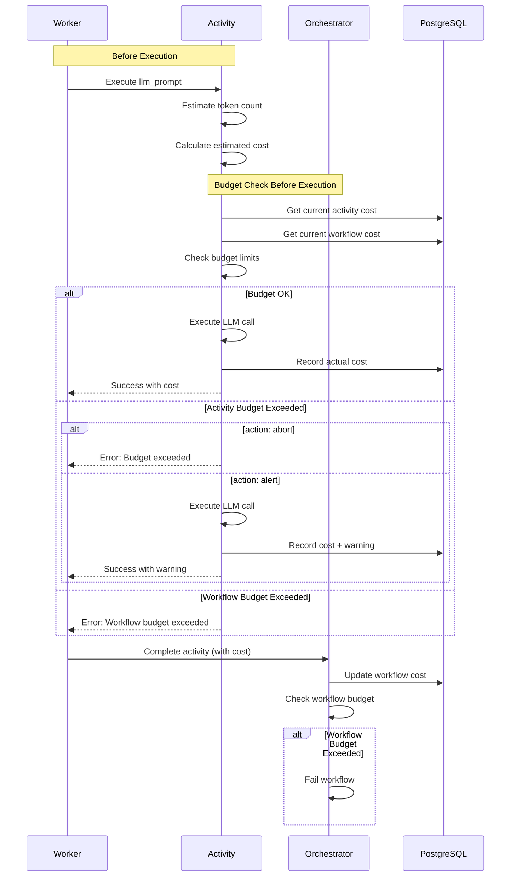
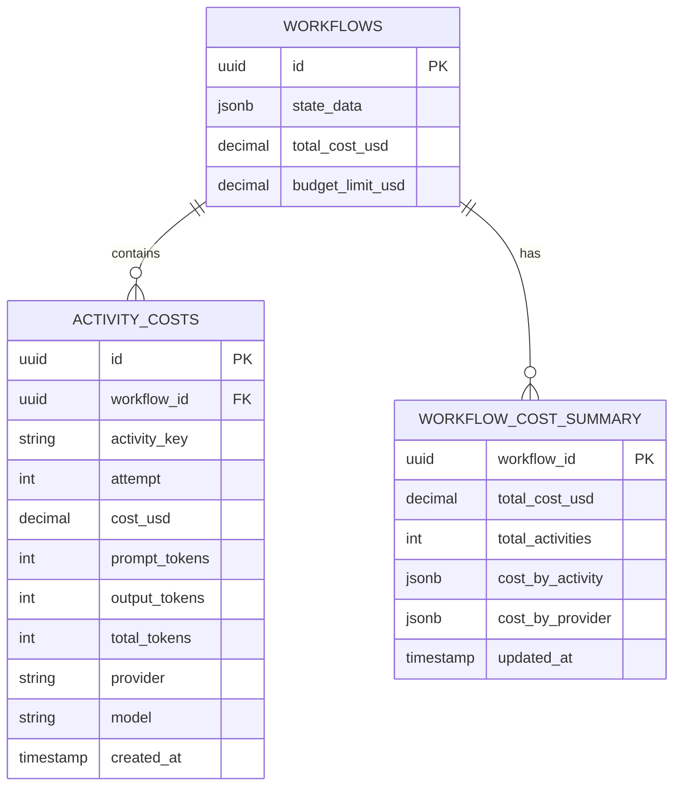

# US-5.2: AI Cost Tracking and Budget Enforcement - Implementation Plan

**Epic**: Epic 5 - Built-In Activity Library
**User Story**: US-5.2
**Status**: Not Started
**Priority**: High (Required for Example 4)
**Estimated Duration**: 2-3 days
**Dependencies**:
- US-3.5 (Activity Settings) - Provides budget configuration
- US-5.1 (Multi-Provider LLM Activities) - Generates cost data

---

## User Story

**As** an AI startup engineer
**I want** automatic token counting and budget enforcement
**So that** I prevent runaway LLM costs (like AutoGPT's $14.40/task)

### Acceptance Criteria

- Per-activity budget limits: `budget.limit: 5.00` (USD)
- Per-workflow budget limits
- Real-time cost tracking in PostgreSQL
- Budget exceeded action: `abort` (fail workflow) or `alert` (continue with warning)
- Cost dashboard: SQL-queryable cost history
- Token counting before execution for estimation
- **CRITICAL**: First platform with built-in AI cost controls

### Example Usage

```yaml
workflow:
  name: ai_research_workflow
  settings:
    budget:
      limit: 10.00  # Total workflow budget
      action: abort

activities:
  - key: primary_analysis
    worker: ai
    name: llm_prompt
    parameters:
      provider: anthropic
      model: claude-3-5-sonnet-20241022
      prompt: "Analyze: {{INPUT.data}}"
    settings:
      budget:
        limit: 2.00  # Per-activity budget
        action: abort
      retry:
        max_attempts: 3

  - key: secondary_analysis
    worker: ai
    name: llm_prompt
    parameters:
      provider: openai
      model: gpt-4o
      prompt: "Review: {{primary_analysis.response.content}}"
    settings:
      budget:
        limit: 3.00
        action: alert  # Continue with warning if exceeded
```

---

## Architecture Overview

### Budget Enforcement Flow



### Cost Tracking Data Model



---

## Architectural Decision: Where Should Cost Calculation Happen?

### Decision: Orchestrator Calculates Costs (After Activity Execution)

**Approach**: Workers return token counts; orchestrator queries pricing database and calculates costs.

### Rationale

**Primary Benefits**:
1. **Dynamic pricing updates** - Update prices in database without redeploying workers
2. **Single source of truth** - All cost calculations use same pricing data from database
3. **Worker simplicity** - Workers are stateless, just execute tasks and return token counts
4. **Core business logic** - Pricing and budget enforcement are key orchestrator value propositions
5. **Future extensibility** - Applies to any usage-based activity (not just LLMs):
   - Cloud APIs (AWS, GCP pricing)
   - External services (Twilio, SendGrid)
   - Database query costs
   - Compute resource usage

**Additional Benefits**:
- Per-tenant pricing (different customers pay different rates)
- Historical pricing tracking (audit trail of price changes)
- Promotional pricing, volume discounts
- Consistent pricing across all workers (no cache staleness)

### Alternatives Considered

#### Alternative 1: Workers Calculate Costs

**Rejected because**:
- Requires workers to access pricing data somehow:
  - **Hardcoded**: Requires recompiling/redeploying for price updates
  - **Workers query database**: Breaks stateless worker architecture
  - **Workers call orchestrator API**: HTTP overhead, doesn't solve the problem
  - **Workers cache pricing**: Cache invalidation complexity, stale data risk
- Deployment coupling (price changes require worker updates)
- Inconsistency risk (different workers might have different pricing)
- Per-tenant pricing impossible (workers don't know workflow context)

#### Alternative 2: Hybrid (Workers Cache Pricing)

**Deferred to post-MVP**:
- Only implement if profiling shows pricing lookup is a bottleneck
- Would add worker caching with 24-hour TTL and fallback to orchestrator
- Unlikely to be needed (pricing lookups are fast, prices change infrequently)

### Performance Considerations

**Database query cost is negligible**:
- Orchestrator already queries database for activity execution status
- Pricing lookup adds one JOIN query: `llm_models JOIN llm_providers`
- Can batch-fetch pricing for multiple activities: `CostCalculator::batch_get_pricing()`
- Pricing table is small (~100 models), highly cacheable by PostgreSQL

**Pricing updates are infrequent**:
- OpenAI/Anthropic change prices every few months
- Not worth optimizing for real-time updates

### Future Extensions (Post-MVP)

This architecture supports cost tracking for **any usage-based activity**:

```rust
// Future: Cloud API cost tracking
pub trait CostCalculator {
    async fn calculate_cost(
        &self,
        activity_type: &str,  // "llm", "aws_api", "twilio_sms", etc.
        provider: &str,
        resource: &str,       // model, API endpoint, service type
        usage_metrics: &HashMap<String, f64>,  // tokens, API calls, SMS count, etc.
    ) -> Result<Decimal>;
}
```

**Example use cases**:
- AWS API calls (S3 requests, Lambda invocations)
- Twilio SMS/voice (per-message pricing)
- Database queries (compute credits)
- External API quotas (rate limits + costs)

This makes **cost tracking a first-class orchestrator feature**, not just an LLM add-on.

---

## Implementation Tasks

### 1. Extend Database Schema for Cost Tracking

**Migration**: `migrations/YYYYMMDD_cost_tracking.up.sql`

```sql
-- Activity cost tracking table
CREATE TABLE activity_costs (
    id UUID PRIMARY KEY DEFAULT uuidv7(),
    workflow_id UUID NOT NULL,
    activity_key TEXT NOT NULL,
    attempt INTEGER NOT NULL DEFAULT 1,

    -- Cost details
    cost_usd DECIMAL(10, 6) NOT NULL,
    estimated_cost_usd DECIMAL(10, 6),

    -- Token usage
    prompt_tokens INTEGER,
    output_tokens INTEGER,
    total_tokens INTEGER,

    -- Provider details
    provider TEXT NOT NULL,
    model TEXT NOT NULL,

    -- Budget tracking
    activity_budget_limit_usd DECIMAL(10, 6),
    workflow_budget_limit_usd DECIMAL(10, 6),
    budget_exceeded BOOLEAN DEFAULT FALSE,
    budget_action TEXT, -- 'abort' or 'alert'

    -- Metadata
    created_at TIMESTAMPTZ NOT NULL DEFAULT NOW(),

    FOREIGN KEY (workflow_id) REFERENCES workflows(id) ON DELETE CASCADE
);

-- Index for workflow cost queries (hot path)
CREATE INDEX idx_activity_costs_workflow
    ON activity_costs(workflow_id);

-- Index for activity cost queries
CREATE INDEX idx_activity_costs_activity
    ON activity_costs(workflow_id, activity_key);

-- Index for cost dashboard queries
CREATE INDEX idx_activity_costs_created
    ON activity_costs(created_at DESC);

-- Index for provider analytics
CREATE INDEX idx_activity_costs_provider
    ON activity_costs(provider, model);

-- Add cost tracking columns to workflows table
ALTER TABLE workflows
    ADD COLUMN total_cost_usd DECIMAL(10, 6) DEFAULT 0.0,
    ADD COLUMN budget_limit_usd DECIMAL(10, 6);

-- Workflow cost summary view for dashboards
CREATE MATERIALIZED VIEW workflow_cost_summary AS
SELECT
    w.id AS workflow_id,
    w.name AS workflow_name,
    w.total_cost_usd,
    w.budget_limit_usd,
    w.status,
    COUNT(ac.id) AS total_activities,
    SUM(ac.cost_usd) AS actual_total_cost,
    jsonb_object_agg(ac.activity_key, SUM(ac.cost_usd)) AS cost_by_activity,
    jsonb_object_agg(ac.provider, SUM(ac.cost_usd)) AS cost_by_provider,
    MAX(ac.created_at) AS last_cost_update
FROM workflows w
LEFT JOIN activity_costs ac ON w.id = ac.workflow_id
GROUP BY w.id, w.name, w.total_cost_usd, w.budget_limit_usd, w.status;

-- Index for fast dashboard queries
CREATE INDEX idx_workflow_cost_summary_workflow
    ON workflow_cost_summary(workflow_id);

-- Function to get current workflow cost
CREATE OR REPLACE FUNCTION get_workflow_cost(p_workflow_id UUID)
RETURNS DECIMAL(10, 6) AS $$
    SELECT COALESCE(SUM(cost_usd), 0.0)
    FROM activity_costs
    WHERE workflow_id = p_workflow_id;
$$ LANGUAGE SQL STABLE;

-- Function to get current activity cost (across all attempts)
CREATE OR REPLACE FUNCTION get_activity_cost(p_workflow_id UUID, p_activity_key TEXT)
RETURNS DECIMAL(10, 6) AS $$
    SELECT COALESCE(SUM(cost_usd), 0.0)
    FROM activity_costs
    WHERE workflow_id = p_workflow_id
      AND activity_key = p_activity_key;
$$ LANGUAGE SQL STABLE;

-- Trigger to update workflow total_cost_usd on activity cost insert
CREATE OR REPLACE FUNCTION update_workflow_cost()
RETURNS TRIGGER AS $$
BEGIN
    UPDATE workflows
    SET total_cost_usd = get_workflow_cost(NEW.workflow_id)
    WHERE id = NEW.workflow_id;
    RETURN NEW;
END;
$$ LANGUAGE plpgsql;

CREATE TRIGGER trigger_update_workflow_cost
AFTER INSERT ON activity_costs
FOR EACH ROW
EXECUTE FUNCTION update_workflow_cost();
```

**Migration Down**: `migrations/YYYYMMDD_cost_tracking.down.sql`

```sql
DROP TRIGGER IF EXISTS trigger_update_workflow_cost ON activity_costs;
DROP FUNCTION IF EXISTS update_workflow_cost();
DROP FUNCTION IF EXISTS get_activity_cost(UUID, TEXT);
DROP FUNCTION IF EXISTS get_workflow_cost(UUID);
DROP MATERIALIZED VIEW IF EXISTS workflow_cost_summary;
ALTER TABLE workflows DROP COLUMN IF EXISTS budget_limit_usd;
ALTER TABLE workflows DROP COLUMN IF EXISTS total_cost_usd;
DROP TABLE IF EXISTS activity_costs;
```

---

### 2. Extend Workflow Definition for Budget Settings

**File**: `core/src/workflow/definition.rs`

**Changes**:
```rust
use super::activity_settings::BudgetSettings;

pub struct WorkflowDefinition {
    pub name: String,
    pub version: Option<String>,
    pub activities: Vec<ActivityDefinition>,

    // NEW: Workflow-level settings
    #[serde(default)]
    pub settings: WorkflowSettings,
}

#[derive(Debug, Clone, Serialize, Deserialize, Default)]
pub struct WorkflowSettings {
    /// Workflow-level budget limit
    #[serde(skip_serializing_if = "Option::is_none")]
    pub budget: Option<BudgetSettings>,
}
```

**YAML Example**:
```yaml
workflow:
  name: ai_analysis
  settings:
    budget:
      limit: 10.00
      action: abort

activities:
  - key: step1
    settings:
      budget:
        limit: 2.00
```

---

### 3. Create Cost Tracking Service

**File**: `core/src/cost/tracker.rs` (new)

```rust
use sqlx::PgPool;
use uuid::Uuid;
use chrono::{DateTime, Utc};

pub struct CostTracker {
    pool: PgPool,
}

#[derive(Debug, Clone)]
pub struct ActivityCostRecord {
    pub workflow_id: Uuid,
    pub activity_key: String,
    pub attempt: u32,
    pub cost_usd: Decimal,
    pub estimated_cost_usd: Option<Decimal>,
    pub prompt_tokens: Option<u32>,
    pub output_tokens: Option<u32>,
    pub total_tokens: Option<u32>,
    pub provider: String,
    pub model: String,
    pub activity_budget_limit_usd: Option<Decimal>,
    pub workflow_budget_limit_usd: Option<Decimal>,
    pub budget_exceeded: bool,
    pub budget_action: Option<String>,
}

#[derive(Debug, Clone)]
pub struct BudgetStatus {
    pub activity_cost: f64,
    pub workflow_cost: f64,
    pub activity_limit: Option<f64>,
    pub workflow_limit: Option<f64>,
    pub activity_budget_ok: bool,
    pub workflow_budget_ok: bool,
}

impl CostTracker {
    pub fn new(pool: PgPool) -> Self {
        Self { pool }
    }

    /// Record activity cost
    pub async fn record_cost(&self, record: ActivityCostRecord) -> Result<()> {
        sqlx::query(
            r#"
            INSERT INTO activity_costs
                (workflow_id, activity_key, attempt, cost_usd, estimated_cost_usd,
                 prompt_tokens, output_tokens, total_tokens,
                 provider, model, activity_budget_limit_usd, workflow_budget_limit_usd,
                 budget_exceeded, budget_action)
            VALUES ($1, $2, $3, $4, $5, $6, $7, $8, $9, $10, $11, $12, $13, $14)
            "#
        )
        .bind(record.workflow_id)
        .bind(&record.activity_key)
        .bind(record.attempt as i32)
        .bind(record.cost_usd)
        .bind(record.estimated_cost_usd)
        .bind(record.prompt_tokens.map(|t| t as i32))
        .bind(record.output_tokens.map(|t| t as i32))
        .bind(record.total_tokens.map(|t| t as i32))
        .bind(&record.provider)
        .bind(&record.model)
        .bind(record.activity_budget_limit_usd)
        .bind(record.workflow_budget_limit_usd)
        .bind(record.budget_exceeded)
        .bind(record.budget_action)
        .execute(&self.pool)
        .await?;

        Ok(())
    }

    /// Get current budget status
    pub async fn get_budget_status(
        &self,
        workflow_id: Uuid,
        activity_key: &str,
        activity_limit: Option<f64>,
        workflow_limit: Option<f64>,
    ) -> Result<BudgetStatus> {
        let activity_cost: f64 = sqlx::query_scalar(
            "SELECT get_activity_cost($1, $2)"
        )
        .bind(workflow_id)
        .bind(activity_key)
        .fetch_one(&self.pool)
        .await?;

        let workflow_cost: f64 = sqlx::query_scalar(
            "SELECT get_workflow_cost($1)"
        )
        .bind(workflow_id)
        .fetch_one(&self.pool)
        .await?;

        let activity_budget_ok = activity_limit.map_or(true, |limit| activity_cost < limit);
        let workflow_budget_ok = workflow_limit.map_or(true, |limit| workflow_cost < limit);

        Ok(BudgetStatus {
            activity_cost,
            workflow_cost,
            activity_limit,
            workflow_limit,
            activity_budget_ok,
            workflow_budget_ok,
        })
    }

    /// Check if activity can execute within budget
    pub async fn check_budget_before_execution(
        &self,
        workflow_id: Uuid,
        activity_key: &str,
        estimated_cost: f64,
        activity_limit: Option<f64>,
        workflow_limit: Option<f64>,
    ) -> Result<BudgetCheckResult> {
        let status = self.get_budget_status(
            workflow_id,
            activity_key,
            activity_limit,
            workflow_limit,
        ).await?;

        let projected_activity_cost = status.activity_cost + estimated_cost;
        let projected_workflow_cost = status.workflow_cost + estimated_cost;

        let activity_ok = activity_limit.map_or(true, |limit| projected_activity_cost <= limit);
        let workflow_ok = workflow_limit.map_or(true, |limit| projected_workflow_cost <= limit);

        Ok(BudgetCheckResult {
            can_execute: activity_ok && workflow_ok,
            activity_budget_ok: activity_ok,
            workflow_budget_ok: workflow_ok,
            projected_activity_cost,
            projected_workflow_cost,
            estimated_cost,
        })
    }

    /// Get cost history for workflow
    pub async fn get_workflow_cost_history(
        &self,
        workflow_id: Uuid,
    ) -> Result<Vec<ActivityCostRecord>> {
        let records = sqlx::query_as::<_, ActivityCostRecordRow>(
            r#"
            SELECT workflow_id, activity_key, attempt, cost_usd, estimated_cost_usd,
                   prompt_tokens, output_tokens, total_tokens,
                   provider, model, activity_budget_limit_usd, workflow_budget_limit_usd,
                   budget_exceeded, budget_action
            FROM activity_costs
            WHERE workflow_id = $1
            ORDER BY created_at ASC
            "#
        )
        .bind(workflow_id)
        .fetch_all(&self.pool)
        .await?;

        Ok(records.into_iter().map(Into::into).collect())
    }
}

#[derive(Debug, Clone)]
pub struct BudgetCheckResult {
    pub can_execute: bool,
    pub activity_budget_ok: bool,
    pub workflow_budget_ok: bool,
    pub projected_activity_cost: f64,
    pub projected_workflow_cost: f64,
    pub estimated_cost: f64,
}

pub type Result<T> = std::result::Result<T, CostError>;

#[derive(Debug, thiserror::Error)]
pub enum CostError {
    #[error("Database error: {0}")]
    DatabaseError(#[from] sqlx::Error),

    #[error("Budget exceeded")]
    BudgetExceeded,
}
```

---

### 4. Integrate Budget Checking into LLM Activities

**File**: `worker/src/activities/llm_prompt.rs`

**Changes**:
```rust
use streamflow_core::cost::tracker::{CostTracker, ActivityCostRecord};

#[async_trait]
impl crate::registry::ActivityImpl for LLMPromptActivity {
    async fn execute(&self, parameters: Value) -> anyhow::Result<ActivityResult> {
        let params: LLMPromptParams = serde_json::from_value(parameters.clone())?;

        // Get budget settings from activity context
        let workflow_id = self.get_workflow_id(&parameters)?;
        let activity_key = self.get_activity_key(&parameters)?;
        let activity_budget = self.get_activity_budget(&parameters)?;
        let workflow_budget = self.get_workflow_budget(&parameters)?;

        // 1. Estimate token count and cost
        let estimated_tokens = self.estimate_tokens(&params.prompt)?;
        let estimated_cost = self.estimate_cost(&params, estimated_tokens)?;

        // 2. Check budget before execution
        let cost_tracker = CostTracker::new(self.pool.clone());
        let budget_check = cost_tracker.check_budget_before_execution(
            workflow_id,
            &activity_key,
            estimated_cost,
            activity_budget.as_ref().map(|b| b.limit),
            workflow_budget.as_ref().map(|b| b.limit),
        ).await?;

        if !budget_check.can_execute {
            // Budget would be exceeded
            if !budget_check.activity_budget_ok {
                return Err(anyhow::anyhow!(
                    "Activity budget would be exceeded: ${:.4} + ${:.4} > ${:.4}",
                    budget_check.projected_activity_cost - estimated_cost,
                    estimated_cost,
                    activity_budget.as_ref().unwrap().limit
                ));
            }
            if !budget_check.workflow_budget_ok {
                return Err(anyhow::anyhow!(
                    "Workflow budget would be exceeded: ${:.4} + ${:.4} > ${:.4}",
                    budget_check.projected_workflow_cost - estimated_cost,
                    estimated_cost,
                    workflow_budget.as_ref().unwrap().limit
                ));
            }
        }

        // 3. Execute LLM call (existing logic)
        let request = CompletionRequest {
            // ... existing request building ...
        };

        let response = if let Some(chain_config) = params.fallback_chain {
            // Fallback chain mode
            // ... existing fallback logic ...
        } else {
            // Single provider mode
            // ... existing single provider logic ...
        };

        // 4. Record actual cost
        let cost_record = ActivityCostRecord {
            workflow_id,
            activity_key: activity_key.clone(),
            attempt: self.get_attempt(&parameters)?,
            cost_usd: response.cost_usd,
            estimated_cost_usd: Some(estimated_cost),
            prompt_tokens: Some(response.usage.prompt_tokens),
            output_tokens: Some(response.usage.output_tokens),
            total_tokens: Some(response.usage.total_tokens),
            provider: self.get_provider_name(&params)?,
            model: response.model.clone(),
            activity_budget_limit_usd: activity_budget.as_ref().map(|b| b.limit),
            workflow_budget_limit_usd: workflow_budget.as_ref().map(|b| b.limit),
            budget_exceeded: false,
            budget_action: activity_budget.as_ref().map(|b| b.action.to_string()),
        };

        cost_tracker.record_cost(cost_record).await?;

        // 5. Check if actual cost exceeded budget (with alert action)
        if let Some(budget) = &activity_budget {
            let status = cost_tracker.get_budget_status(
                workflow_id,
                &activity_key,
                Some(budget.limit),
                workflow_budget.as_ref().map(|b| b.limit),
            ).await?;

            if !status.activity_budget_ok {
                match budget.action {
                    BudgetAction::Abort => {
                        return Err(anyhow::anyhow!(
                            "Activity budget exceeded: ${:.4} > ${:.4}",
                            status.activity_cost,
                            budget.limit
                        ));
                    }
                    BudgetAction::Continue => {
                        tracing::warn!(
                            workflow_id = %workflow_id,
                            activity_key = %activity_key,
                            cost = status.activity_cost,
                            limit = budget.limit,
                            "Activity budget exceeded but continuing (action: continue)"
                        );
                    }
                }
            }
        }

        Ok(ActivityResult::value("response", json!(response)).with_cost(response.cost_usd))
    }

    // Helper methods
    fn estimate_tokens(&self, prompt: &str) -> anyhow::Result<usize> {
        // Simple estimation: 1 token ≈ 4 characters
        // For production, use tiktoken or provider-specific tokenizer
        Ok(prompt.len() / 4)
    }

    fn estimate_cost(&self, params: &LLMPromptParams, tokens: usize) -> anyhow::Result<f64> {
        // Rough estimation based on model pricing
        // Assume average of input/output pricing
        // For production, use more accurate estimation
        Ok(tokens as f64 / 1_000_000.0 * 5.0) // $5/M tokens average
    }
}
```

---

### 5. Add Budget Enforcement in Orchestrator

**File**: `orchestrator/src/event_handlers.rs`

**Purpose**: Check workflow budget after each activity completion

```rust
async fn handle_activity_completed(
    &self,
    workflow_id: Uuid,
    activity_key: &str,
    outputs: Vec<ActivityOutput>,
    cost_usd: Option<Decimal>,
) -> Result<()> {
    // ... existing completion logic ...

    // Check workflow budget
    if let Some(cost) = cost_usd {
        let workflow = self.load_workflow(workflow_id).await?;

        if let Some(workflow_budget) = &workflow.definition.settings.budget {
            let cost_tracker = CostTracker::new(self.pool.clone());
            let status = cost_tracker.get_budget_status(
                workflow_id,
                activity_key,
                None,
                Some(workflow_budget.limit),
            ).await?;

            if !status.workflow_budget_ok {
                match workflow_budget.action {
                    BudgetAction::Abort => {
                        tracing::error!(
                            workflow_id = %workflow_id,
                            cost = status.workflow_cost,
                            limit = workflow_budget.limit,
                            "Workflow budget exceeded, aborting"
                        );

                        self.fail_workflow(
                            workflow_id,
                            &format!(
                                "Workflow budget exceeded: ${:.4} > ${:.4}",
                                status.workflow_cost,
                                workflow_budget.limit
                            ),
                        ).await?;

                        return Ok(());
                    }
                    BudgetAction::Continue => {
                        tracing::warn!(
                            workflow_id = %workflow_id,
                            cost = status.workflow_cost,
                            limit = workflow_budget.limit,
                            "Workflow budget exceeded but continuing"
                        );
                    }
                }
            }
        }
    }

    // ... rest of completion logic ...
}
```

---

### 6. Cost Dashboard API Endpoints

**File**: `api/src/handlers/cost.rs` (new)

```rust
use axum::{extract::State, Json};
use uuid::Uuid;
use serde::{Deserialize, Serialize};
use streamflow_core::cost::tracker::CostTracker;

#[derive(Debug, Serialize)]
pub struct WorkflowCostSummary {
    pub workflow_id: Uuid,
    pub total_cost_usd: Decimal,
    pub budget_limit_usd: Option<Decimal>,
    pub budget_remaining_usd: Option<Decimal>,
    pub total_activities: usize,
    pub cost_by_activity: serde_json::Value,
    pub cost_by_provider: serde_json::Value,
}

#[derive(Debug, Serialize)]
pub struct ActivityCostDetail {
    pub activity_key: String,
    pub attempt: u32,
    pub cost_usd: Decimal,
    pub prompt_tokens: Option<u32>,
    pub output_tokens: Option<u32>,
    pub provider: String,
    pub model: String,
    pub budget_exceeded: bool,
}

/// GET /api/v1/workflows/:workflow_id/cost
pub async fn get_workflow_cost(
    State(state): State<AppState>,
    Path(workflow_id): Path<Uuid>,
) -> Result<Json<WorkflowCostSummary>> {
    let cost_tracker = CostTracker::new(state.pool.clone());

    let summary = sqlx::query_as::<_, WorkflowCostSummaryRow>(
        "SELECT * FROM workflow_cost_summary WHERE workflow_id = $1"
    )
    .bind(workflow_id)
    .fetch_one(&state.pool)
    .await?;

    let budget_remaining = summary.budget_limit_usd.map(|limit| {
        (limit - summary.total_cost_usd).max(0.0)
    });

    Ok(Json(WorkflowCostSummary {
        workflow_id: summary.workflow_id,
        total_cost_usd: summary.total_cost_usd,
        budget_limit_usd: summary.budget_limit_usd,
        budget_remaining_usd: budget_remaining,
        total_activities: summary.total_activities as usize,
        cost_by_activity: summary.cost_by_activity,
        cost_by_provider: summary.cost_by_provider,
    }))
}

/// GET /api/v1/workflows/:workflow_id/cost/history
pub async fn get_workflow_cost_history(
    State(state): State<AppState>,
    Path(workflow_id): Path<Uuid>,
) -> Result<Json<Vec<ActivityCostDetail>>> {
    let cost_tracker = CostTracker::new(state.pool.clone());
    let history = cost_tracker.get_workflow_cost_history(workflow_id).await?;

    let details: Vec<ActivityCostDetail> = history.into_iter().map(|record| {
        ActivityCostDetail {
            activity_key: record.activity_key,
            attempt: record.attempt,
            cost_usd: record.cost_usd,
            prompt_tokens: record.prompt_tokens,
            output_tokens: record.output_tokens,
            provider: record.provider,
            model: record.model,
            budget_exceeded: record.budget_exceeded,
        }
    }).collect();

    Ok(Json(details))
}

/// GET /api/v1/cost/analytics
pub async fn get_cost_analytics(
    State(state): State<AppState>,
    Query(params): Query<CostAnalyticsParams>,
) -> Result<Json<CostAnalytics>> {
    // Aggregate cost data for analytics dashboard
    let analytics = sqlx::query_as::<_, CostAnalyticsRow>(
        r#"
        SELECT
            COUNT(DISTINCT workflow_id) as total_workflows,
            SUM(cost_usd) as total_cost,
            AVG(cost_usd) as avg_cost_per_activity,
            jsonb_object_agg(provider, SUM(cost_usd)) as cost_by_provider,
            jsonb_object_agg(model, SUM(cost_usd)) as cost_by_model
        FROM activity_costs
        WHERE created_at >= $1 AND created_at <= $2
        "#
    )
    .bind(params.start_date)
    .bind(params.end_date)
    .fetch_one(&state.pool)
    .await?;

    Ok(Json(analytics.into()))
}

#[derive(Debug, Deserialize)]
pub struct CostAnalyticsParams {
    pub start_date: DateTime<Utc>,
    pub end_date: DateTime<Utc>,
}
```

**Register Routes**:
```rust
// api/src/main.rs
use crate::handlers::cost;

let app = Router::new()
    // ... existing routes ...
    .route("/api/v1/workflows/:workflow_id/cost", get(cost::get_workflow_cost))
    .route("/api/v1/workflows/:workflow_id/cost/history", get(cost::get_workflow_cost_history))
    .route("/api/v1/cost/analytics", get(cost::get_cost_analytics));
```

---

## Files to Create

### New Modules
- `core/src/cost/mod.rs` - Cost tracking module exports
- `core/src/cost/tracker.rs` - Cost tracking service
- `api/src/handlers/cost.rs` - Cost dashboard API endpoints

### New Tests
- `core/tests/cost_tracker_tests.rs` - Unit tests for cost tracking
- `orchestrator/tests/budget_enforcement_tests.rs` - Budget enforcement tests
- `api/tests/cost_api_tests.rs` - Cost API endpoint tests

### Migrations
- `migrations/YYYYMMDD_cost_tracking.up.sql` - Cost tracking schema
- `migrations/YYYYMMDD_cost_tracking.down.sql` - Rollback migration

### Modified Files
- `core/src/workflow/definition.rs` - Add workflow budget settings
- `worker/src/activities/llm_prompt.rs` - Integrate budget checking
- `worker/src/activities/embedding.rs` - Integrate budget checking
- `orchestrator/src/event_handlers.rs` - Workflow budget enforcement
- `core/src/lib.rs` - Export cost module

---

## Testing Strategy

### Unit Tests

**Cost Tracker**:
- Record cost correctly
- Get budget status
- Check budget before execution
- Cost history retrieval

**Budget Enforcement**:
- Activity budget abort
- Activity budget continue
- Workflow budget abort
- Workflow budget continue

### Integration Tests

**LLM Activity Budget**:
- Activity completes within budget
- Activity aborts on budget exceeded
- Activity continues with warning
- Cost recorded correctly

**Orchestrator Budget**:
- Workflow fails on budget exceeded
- Workflow continues with warning
- Multiple activities accumulate cost

### End-to-End Tests

**Example 4 Workflow**:
- Multiple LLM activities
- Budget tracking across retries
- Workflow budget enforcement
- Cost dashboard API queries

---

## Success Criteria

- ✅ Database schema supports cost tracking
- ✅ CostTracker service implemented
- ✅ Budget checking before LLM execution
- ✅ Budget enforcement in activities (abort/continue)
- ✅ Budget enforcement in orchestrator (workflow-level)
- ✅ Cost recorded for every LLM call
- ✅ Cost dashboard API endpoints
- ✅ Token counting estimation works
- ✅ Cost calculation accurate
- ✅ All tests pass
- ✅ Example 4 demonstrates budget enforcement

---

## Non-Goals (Post-MVP)

- ❌ Real-time cost streaming
- ❌ Cost forecasting / predictions
- ❌ Cost alerts via email/Slack
- ❌ Cost attribution by user/tenant
- ❌ Budget rollover across workflows
- ❌ Tiered pricing support

---

## Dependencies

**Upstream**:
- ✅ US-3.5: Activity Settings (Provides budget configuration)
- ✅ US-5.1: Multi-Provider LLM Activities (Generates cost data)

**Downstream**:
- 🔲 Example 4: LLM workflows with budget enforcement

**Parallel Work**:
- Can be developed in parallel with US-5.3 (Semantic Caching)

---

## Risks and Mitigations

| Risk                                   | Impact | Mitigation                                      |
|----------------------------------------|--------|-------------------------------------------------|
| Inaccurate cost estimation             | High   | Use official tokenizers, track actual vs estimated |
| Database write latency on cost record  | Medium | Async cost recording, batch inserts             |
| Race condition on budget check         | High   | Use database transactions, locks if needed      |
| Token counting overhead                | Low    | Cache token counts, use fast estimator          |
| Cost tracking storage growth           | Medium | Partition by date, archive old data             |

---

## Implementation Phases

### Phase 1: Database Schema and Cost Tracker (Day 1)
1. Create cost tracking migration
2. Implement CostTracker service
3. Unit tests for CostTracker
4. Add workflow budget settings

### Phase 2: Budget Enforcement in Activities (Day 1-2)
1. Integrate budget checking in LLMPromptActivity
2. Integrate budget checking in EmbeddingActivity
3. Token estimation logic
4. Cost recording after execution
5. Integration tests

### Phase 3: Orchestrator Budget Enforcement (Day 2)
1. Add workflow budget checking
2. Fail workflow on budget exceeded
3. Integration tests

### Phase 4: Cost Dashboard API (Day 2-3)
1. Implement cost API endpoints
2. Cost analytics queries
3. API tests
4. Example 4 workflow
5. Documentation

---

## Completion Checklist

### Phase 1: Infrastructure ⏳
- [ ] Database migration created
- [ ] CostTracker service implemented
- [ ] Budget checking methods work
- [ ] Cost recording works
- [ ] Workflow budget settings added
- [ ] Unit tests pass

### Phase 2: Activity Budget ⏳
- [ ] Token estimation implemented
- [ ] Budget check before execution
- [ ] Cost recorded after execution
- [ ] Activity budget abort works
- [ ] Activity budget continue works
- [ ] Integration tests pass

### Phase 3: Workflow Budget ⏳
- [ ] Orchestrator checks workflow budget
- [ ] Workflow fails on budget exceeded
- [ ] Workflow continues with warning
- [ ] Integration tests pass

### Phase 4: Dashboard ⏳
- [ ] Cost summary API works
- [ ] Cost history API works
- [ ] Cost analytics API works
- [ ] Example 4 workflow demonstrates budget
- [ ] Documentation updated
- [ ] Code review complete

---

## Notes

- Cost tracking must be accurate for billing/monitoring
- Budget enforcement is critical for cost control
- Token estimation should be conservative (overestimate)
- Cost dashboard enables monitoring and optimization
- This is a **differentiator** - first workflow platform with built-in AI cost controls
