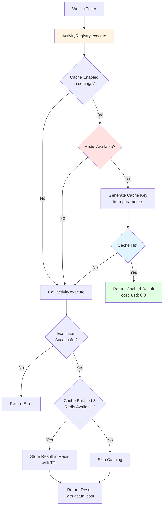
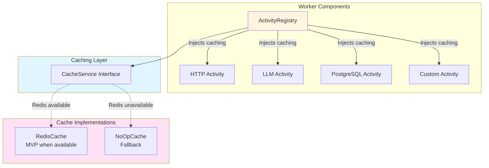

# US-5.3: Semantic Caching for Cost Savings - Implementation Plan

**Epic**: Epic 5 - Built-In Activity Library
**User Story**: US-5.3
**Status**: ✅ Complete (100%) - Production Ready
**Priority**: High (Major cost savings for all activities)
**Estimated Duration**: 3-4 days ✅ Complete
**Dependencies**: US-5.1 (Multi-Provider LLM Activities) ✅ Complete, US-3.5 (Activity Settings) ✅ Complete

---

## 📊 Implementation Status

### ✅ What's Complete (Ready for MVP)

**Core Infrastructure (100%)**
- ✅ `CacheService` trait with async interface
- ✅ `RedisCache` implementation (TTL, connection pooling, pattern invalidation)
- ✅ `NoOpCache` graceful fallback
- ✅ SHA256-based deterministic cache key generation
- ✅ Universal caching in `ActivityRegistry` (ALL activity types)
- ✅ Cache metadata in results (`cache_key`, `cached` flag, timestamps)
- ✅ Activity settings integration (`cache: true`, `cache_ttl: 3600`)
- ✅ Zero-impact architecture (no changes to activity implementations)
- ✅ Workspace compiles successfully

**Production Features (100%)**
- ✅ Environment variable configuration (KRUXIAFLOW_CACHE_PROVIDER, KRUXIAFLOW_REDIS_URL, KRUXIAFLOW_REDIS_KEY_PREFIX)
- ✅ Cache invalidation API endpoints (DELETE /api/v1/cache/:key, POST /api/v1/cache/invalidate)
- ✅ Integration tests with Redis container (9 comprehensive tests)
- ✅ API handler tests with authentication (4 tests)

**Current Deployment:**
- Uses `NoOpCache` by default (no Redis required - zero configuration)
- Caching infrastructure fully functional and production-ready
- Redis enabled via environment variables (KRUXIAFLOW_CACHE_PROVIDER=redis, KRUXIAFLOW_REDIS_URL, KRUXIAFLOW_REDIS_KEY_PREFIX)
- Cache invalidation API endpoints available (DELETE /api/v1/cache/:key, POST /api/v1/cache/invalidate)
- Complete test coverage (13 tests: 9 integration + 4 API handler)

### ⏳ Future Enhancements (Optional)

**Advanced Features**
- [ ] Semantic similarity matching with embeddings (vector-based cache matching)
- [ ] Cache analytics and metrics dashboard
- [ ] Configurable cache warming strategies

### 📈 Completion Metrics

| Category                    | Status      | Completion |
|-----------------------------|-------------|------------|
| Core caching infrastructure | ✅ Complete | 100%       |
| Activity integration        | ✅ Complete | 100%       |
| Configuration (env vars)    | ✅ Complete | 100%       |
| API endpoints + auth        | ✅ Complete | 100%       |
| Integration tests (9)       | ✅ Complete | 100%       |
| API handler tests (4)       | ✅ Complete | 100%       |
| User documentation          | ✅ Complete | 100%       |
| **Overall**                 | **✅ Complete** | **100%** |

### 🎯 MVP Readiness Assessment

**Can ship now?** ✅ **YES** - All functionality is complete and fully tested.

**What works:**
- Activities can enable caching with `cache: true` in settings
- Cache keys are deterministically generated from parameters
- Cache hits return `cost_usd: 0.0` for automatic cost tracking
- Works for ALL activity types (LLM, HTTP, PostgreSQL, custom)
- Gracefully degrades when Redis unavailable (uses NoOpCache)
- ✅ Redis configuration via environment variables (KRUXIAFLOW_CACHE_PROVIDER, KRUXIAFLOW_REDIS_URL, KRUXIAFLOW_REDIS_KEY_PREFIX)
- ✅ API endpoints for cache invalidation (DELETE /api/v1/cache/:key, POST /api/v1/cache/invalidate)
- ✅ Comprehensive integration tests (9 cache tests + 4 API tests)

**Documentation:**
- ✅ User-facing documentation complete (`docs/features/semantic-caching.md`)

**Recommendation:** ✅ **READY TO SHIP** - All features complete:
- ✅ Full Redis support with environment variable configuration
- ✅ Cache invalidation APIs with JWT authentication
- ✅ Comprehensive test coverage (13 tests: 9 integration + 4 API)
- ✅ Complete user documentation
- ✅ Graceful fallback when Redis unavailable

**Production Status:** All acceptance criteria met. Feature is production-ready.

---

## Implementation Summary

**Architectural Decision**: Caching is implemented at the **ActivityRegistry execution layer** (`worker/src/registry.rs`), not in individual activity implementations. This provides:

✅ **Universal caching** for ALL activity types:
- LLM activities (`llm_prompt`, `embedding`)
- HTTP activities (`http_request`)
- PostgreSQL activities (`postgres_query`)
- Custom external activities
- Future built-in activities

✅ **Zero activity changes**: Activity implementations (`llm.rs`, `http.rs`, `postgres.rs`) remain completely unaware of caching

✅ **Single source of truth**: Cache logic centralized in `ActivityRegistry::execute()` method

✅ **Transparent to users**: Simple `cache: true` setting works for any activity

**Integration Point**: `worker/src/registry.rs` line 61-86 (ActivityRegistry::execute method)

---

## User Story

**As** an AI startup engineer
**I want** automatic result caching for LLM calls
**So that** I save 50-80% on LLM costs for repeated queries

### Acceptance Criteria

- **Activity setting**: `cache: true` enables caching for an activity
- **Cache key generation**: Hash of normalized parameters (prompt, model, temperature, etc.)
- **Redis-backed storage**: Use Redis when available for purpose-built TTL caching
- **Optional dependency**: Redis is optional - caching enabled when Redis is available, gracefully disabled when not
- **Configurable TTL**: `cache_ttl: 3600` (seconds) with automatic expiration via Redis
- **Cache hit behavior**: Returns cached result with `cost_usd: 0.0`
- **Cache invalidation**: Support manual cache invalidation on demand
- **Graceful degradation**: Workflows run without caching if Redis is unavailable
- **Optional enhancement**: Semantic similarity matching using embeddings (post-MVP advanced feature)

### Example Configuration

**Example 1: LLM Activity Caching**
```yaml
activities:
  - key: analyze_sentiment
    worker: builtin
    activity_name: llm_prompt
    parameters:
      provider: anthropic
      model: claude-3-haiku-20240307
      prompt: "Analyze the sentiment of: {{INPUT.text}}"
      temperature: 0.0
    settings:
      cache: true           # Enable caching
      cache_ttl: 3600       # 1 hour cache TTL
      budget:
        limit: 0.10
```

**Example 2: HTTP API Caching**
```yaml
activities:
  - key: fetch_user_profile
    worker: builtin
    activity_name: http_request
    parameters:
      method: GET
      url: "https://api.example.com/users/{{INPUT.user_id}}"
      headers:
        Authorization: "Bearer {{SECRET.API_TOKEN}}"
    settings:
      cache: true           # Cache expensive API calls
      cache_ttl: 300        # 5 minutes (shorter TTL for frequently changing data)
```

**Example 3: PostgreSQL Query Caching**
```yaml
activities:
  - key: get_analytics_report
    worker: builtin
    activity_name: postgres_query
    parameters:
      query: "SELECT * FROM analytics_reports WHERE date = {{INPUT.report_date}}"
    settings:
      cache: true           # Cache expensive aggregation queries
      cache_ttl: 7200       # 2 hours
```

**Expected Behavior** (all activity types):
- First execution: Executes activity, caches result, returns actual `cost_usd`
- Subsequent executions (within TTL): Returns cached result with `cost_usd: 0.0`
- After TTL expires: Cache cleared, next call executes activity again

---

## Architecture Overview

### Caching Strategy

**Key Insight**: Caching operates at the **ActivityRegistry execution layer**, not in individual activity implementations. This provides universal caching for ALL activity types (LLM, HTTP, PostgreSQL, custom, etc.) with zero code changes in activity implementations.

**Execution Flow** (`worker/src/registry.rs`):



### Cache Service Interface

Following Kruxia Flow's service interface pattern, introduce a new **CacheService** interface:



### Integration Points

1. **Activity Settings** (✅ Already implemented in US-3.5):
   - `ActivitySettings` already has `cache: Option<bool>` and `cache_ttl: Option<u64>` fields
   - No changes needed to settings structure

2. **ActivityRegistry** (`worker/src/registry.rs`):
   - **This is where caching logic is injected** (lines 61-86)
   - Cache service stored as field in `ActivityRegistry`
   - Activity settings passed to `execute()` method
   - Cache check before calling `implementation.execute()`
   - Cache storage after successful execution

3. **Activity Implementations** (NO CHANGES REQUIRED):
   - Activities remain completely unaware of caching
   - No code changes in `llm.rs`, `http.rs`, `postgres.rs`, etc.
   - Caching is transparent cross-cutting concern

4. **Worker Initialization** (`worker/src/manager.rs`):
   - Cache service created and injected into `ActivityRegistry`
   - Redis connectivity tested at startup
   - Automatic fallback to `NoOpCache` if Redis unavailable

---

## Implementation Tasks

### Task 1: Define CacheService Interface

**File**: `core/src/cache/mod.rs` (new module)

**Purpose**: Abstract caching operations to support Redis (when available) and graceful fallback (when not)

```rust
use async_trait::async_trait;
use serde::{Deserialize, Serialize};
use std::time::Duration;

/// Cached activity result
#[derive(Debug, Clone, Serialize, Deserialize)]
pub struct CachedResult {
    /// The cached output value
    pub output: serde_json::Value,
    /// When this cache entry was created
    pub cached_at: chrono::DateTime<chrono::Utc>,
    /// Original cost (for metrics/debugging)
    pub original_cost_usd: Option<rust_decimal::Decimal>,
}

/// Cache service interface
#[async_trait]
pub trait CacheService: Send + Sync {
    /// Get cached result by key
    async fn get(&self, key: &str) -> anyhow::Result<Option<CachedResult>>;

    /// Store result with TTL
    async fn set(
        &self,
        key: &str,
        result: &CachedResult,
        ttl: Duration,
    ) -> anyhow::Result<()>;

    /// Invalidate cache entry by key
    async fn invalidate(&self, key: &str) -> anyhow::Result<()>;

    /// Invalidate all cache entries matching pattern
    async fn invalidate_pattern(&self, pattern: &str) -> anyhow::Result<usize>;

    /// Check if cache is available/healthy
    fn is_available(&self) -> bool;
}
```

**Implementation Notes**:
- Trait uses `async_trait` for async methods
- Returns `Option<CachedResult>` to distinguish cache miss from error
- TTL specified as `Duration` for clarity
- `is_available()` allows runtime checking of cache availability

**Completion Criteria**:
- [x] `CacheService` trait defined in `core/src/cache/mod.rs`
- [x] `CachedResult` struct with serialization support
- [x] Documentation with usage examples

---

### Task 2: Implement RedisCache Provider

**File**: `core/src/cache/redis.rs` (new)

**Purpose**: Redis-backed cache implementation with automatic TTL expiration

```rust
use super::{CacheService, CachedResult};
use async_trait::async_trait;
use redis::{AsyncCommands, Client};
use std::time::Duration;

pub struct RedisCache {
    client: Client,
    /// Optional key prefix for namespace isolation
    key_prefix: String,
}

impl RedisCache {
    pub fn new(redis_url: &str, key_prefix: Option<String>) -> anyhow::Result<Self> {
        let client = Client::open(redis_url)?;
        Ok(Self {
            client,
            key_prefix: key_prefix.unwrap_or_else(|| "kruxiaflow:cache:".to_string()),
        })
    }

    /// Build full Redis key with prefix
    fn build_key(&self, key: &str) -> String {
        format!("{}{}", self.key_prefix, key)
    }

    /// Test Redis connectivity
    pub async fn ping(&self) -> anyhow::Result<()> {
        let mut conn = self.client.get_multiplexed_async_connection().await?;
        redis::cmd("PING").query_async(&mut conn).await?;
        Ok(())
    }
}

#[async_trait]
impl CacheService for RedisCache {
    async fn get(&self, key: &str) -> anyhow::Result<Option<CachedResult>> {
        let mut conn = self.client.get_multiplexed_async_connection().await?;
        let redis_key = self.build_key(key);

        let value: Option<String> = conn.get(&redis_key).await?;

        match value {
            Some(json_str) => {
                let result: CachedResult = serde_json::from_str(&json_str)?;
                Ok(Some(result))
            }
            None => Ok(None),
        }
    }

    async fn set(
        &self,
        key: &str,
        result: &CachedResult,
        ttl: Duration,
    ) -> anyhow::Result<()> {
        let mut conn = self.client.get_multiplexed_async_connection().await?;
        let redis_key = self.build_key(key);
        let json_str = serde_json::to_string(result)?;

        // Use SETEX for atomic set with TTL
        conn.set_ex(&redis_key, json_str, ttl.as_secs() as usize).await?;

        Ok(())
    }

    async fn invalidate(&self, key: &str) -> anyhow::Result<()> {
        let mut conn = self.client.get_multiplexed_async_connection().await?;
        let redis_key = self.build_key(key);
        conn.del(&redis_key).await?;
        Ok(())
    }

    async fn invalidate_pattern(&self, pattern: &str) -> anyhow::Result<usize> {
        let mut conn = self.client.get_multiplexed_async_connection().await?;
        let redis_pattern = self.build_key(pattern);

        // Use SCAN for safe pattern matching (not KEYS which blocks)
        let keys: Vec<String> = redis::cmd("SCAN")
            .cursor_arg(0)
            .arg("MATCH")
            .arg(&redis_pattern)
            .query_async(&mut conn)
            .await?;

        if keys.is_empty() {
            return Ok(0);
        }

        let count = keys.len();
        conn.del(&keys).await?;
        Ok(count)
    }

    fn is_available(&self) -> bool {
        // Cache is available if we can create connection
        // (Actual connectivity checked lazily on first operation)
        true
    }
}
```

**Implementation Notes**:
- Uses `redis` crate for async Redis operations
- Connection pooling via `get_multiplexed_async_connection()`
- `SETEX` for atomic set with TTL (no race condition)
- `SCAN` for pattern matching (safer than `KEYS` on large datasets)
- Key prefix for namespace isolation (default: `kruxiaflow:cache:`)

**Dependencies** (add to `core/Cargo.toml`):
```toml
redis = { version = "0.25", features = ["tokio-comp", "connection-manager"], optional = true }
```

**Feature flag** (add to `core/Cargo.toml`):
```toml
[features]
default = []
redis-cache = ["redis"]
```

**Completion Criteria**:
- [x] `RedisCache` implementation complete
- [x] Connection pooling configured
- [x] TTL handling with `SETEX`
- [x] Pattern invalidation with `SCAN`
- [x] Ping/health check method
- [x] Feature flag for optional Redis dependency

---

### Task 3: Implement NoOpCache Fallback

**File**: `core/src/cache/noop.rs` (new)

**Purpose**: No-op cache implementation for graceful degradation when Redis is unavailable

```rust
use super::{CacheService, CachedResult};
use async_trait::async_trait;
use std::time::Duration;

/// No-op cache that always returns cache miss
/// Used when Redis is not configured or unavailable
pub struct NoOpCache;

impl NoOpCache {
    pub fn new() -> Self {
        Self
    }
}

#[async_trait]
impl CacheService for NoOpCache {
    async fn get(&self, _key: &str) -> anyhow::Result<Option<CachedResult>> {
        // Always return cache miss
        Ok(None)
    }

    async fn set(
        &self,
        _key: &str,
        _result: &CachedResult,
        _ttl: Duration,
    ) -> anyhow::Result<()> {
        // No-op - silently succeed
        Ok(())
    }

    async fn invalidate(&self, _key: &str) -> anyhow::Result<()> {
        // No-op - silently succeed
        Ok(())
    }

    async fn invalidate_pattern(&self, _pattern: &str) -> anyhow::Result<usize> {
        // No-op - return 0 invalidated keys
        Ok(0)
    }

    fn is_available(&self) -> bool {
        // NoOp cache is always "available" (just doesn't cache)
        false
    }
}
```

**Implementation Notes**:
- All operations are no-ops (return immediately)
- `get()` always returns `None` (cache miss)
- `is_available()` returns `false` to indicate no actual caching
- Zero overhead when Redis is not configured

**Completion Criteria**:
- [x] `NoOpCache` implementation complete
- [x] All methods are no-ops with correct return types

---

### Task 4: Cache Key Generation

**File**: `core/src/cache/key_generator.rs` (new)

**Purpose**: Generate deterministic cache keys from activity parameters

```rust
use serde::Serialize;
use sha2::{Digest, Sha256};

/// Generate cache key from activity parameters
pub fn generate_cache_key(
    activity_name: &str,
    parameters: &serde_json::Value,
) -> anyhow::Result<String> {
    // Normalize parameters by sorting keys (JSON objects are unordered)
    let normalized = normalize_json(parameters)?;

    // Create hash input: activity_name + normalized_params
    let hash_input = format!("{}:{}", activity_name, normalized);

    // Generate SHA256 hash
    let mut hasher = Sha256::new();
    hasher.update(hash_input.as_bytes());
    let hash = hasher.finalize();

    // Return hex-encoded hash
    Ok(format!("{:x}", hash))
}

/// Normalize JSON for deterministic hashing
fn normalize_json(value: &serde_json::Value) -> anyhow::Result<String> {
    match value {
        serde_json::Value::Object(map) => {
            // Sort object keys for deterministic ordering
            let mut sorted: Vec<_> = map.iter().collect();
            sorted.sort_by_key(|(k, _)| *k);

            let normalized_map: serde_json::Map<String, serde_json::Value> = sorted
                .into_iter()
                .map(|(k, v)| (k.clone(), v.clone()))
                .collect();

            serde_json::to_string(&normalized_map)
                .map_err(|e| anyhow::anyhow!("Failed to serialize: {}", e))
        }
        _ => {
            // For non-objects, use standard serialization
            serde_json::to_string(value)
                .map_err(|e| anyhow::anyhow!("Failed to serialize: {}", e))
        }
    }
}

#[cfg(test)]
mod tests {
    use super::*;
    use serde_json::json;

    #[test]
    fn test_cache_key_deterministic() {
        let params1 = json!({
            "prompt": "Hello world",
            "model": "claude-3-haiku",
            "temperature": 0.0
        });

        let params2 = json!({
            "temperature": 0.0,
            "prompt": "Hello world",
            "model": "claude-3-haiku"
        });

        let key1 = generate_cache_key("llm_prompt", &params1).unwrap();
        let key2 = generate_cache_key("llm_prompt", &params2).unwrap();

        // Keys should be identical despite different parameter order
        assert_eq!(key1, key2);
    }

    #[test]
    fn test_cache_key_different_params() {
        let params1 = json!({"prompt": "Hello"});
        let params2 = json!({"prompt": "World"});

        let key1 = generate_cache_key("llm_prompt", &params1).unwrap();
        let key2 = generate_cache_key("llm_prompt", &params2).unwrap();

        // Keys should be different for different parameters
        assert_ne!(key1, key2);
    }
}
```

**Implementation Notes**:
- Uses SHA256 for collision resistance
- Normalizes JSON by sorting object keys for deterministic hashing
- Includes activity name in hash to avoid cross-activity collisions
- Hex-encoded output (64 characters)

**Dependencies** (add to `core/Cargo.toml`):
```toml
sha2 = "0.10"
```

**Completion Criteria**:
- [x] `generate_cache_key()` function implemented
- [x] JSON normalization with key sorting
- [x] Unit tests for deterministic hashing
- [x] Unit tests for different parameters producing different keys

---

### Task 5: Integrate Caching into ActivityRegistry

**File**: `worker/src/registry.rs` (modify existing)

**Purpose**: Add cache check before activity execution and cache storage after successful execution

**Current Code** (lines 35-87):
```rust
pub struct ActivityRegistry {
    implementations: HashMap<String, Arc<dyn ActivityImpl>>,
}

impl ActivityRegistry {
    // ... existing methods ...

    pub async fn execute(
        &self,
        worker: &str,
        activity_name: &str,
        parameters: Value,
        timeout: Duration,
    ) -> Result<ActivityResult> {
        let key = format!("{}.{}", worker, activity_name);

        let implementation = self
            .implementations
            .get(&key)
            .ok_or_else(|| anyhow::anyhow!("Activity implementation not found: {}", key))?;

        // Execute with timeout
        let result = tokio::time::timeout(timeout, implementation.execute(parameters)).await;

        match result {
            Ok(Ok(output)) => Ok(output),
            Ok(Err(err)) => Err(err),
            Err(_) => Err(anyhow::anyhow!(
                "Activity execution timed out after {:?}",
                timeout
            )),
        }
    }
}
```

**Modified Code** (with caching):
```rust
use kruxiaflow_core::cache::CacheService;
use kruxiaflow_core::cache::key_generator::generate_cache_key;
use kruxiaflow_core::workflow::ActivitySettings;

pub struct ActivityRegistry {
    implementations: HashMap<String, Arc<dyn ActivityImpl>>,
    cache_service: Arc<dyn CacheService>,  // NEW: Injected cache service
}

impl ActivityRegistry {
    pub fn new(cache_service: Arc<dyn CacheService>) -> Self {
        Self {
            implementations: HashMap::new(),
            cache_service,
        }
    }

    // ... existing methods (register, activity_types) ...

    /// Execute an activity with caching support
    pub async fn execute(
        &self,
        worker: &str,
        activity_name: &str,
        parameters: Value,
        settings: Option<ActivitySettings>,  // NEW: Activity settings for cache config
        timeout: Duration,
    ) -> Result<ActivityResult> {
        let key = format!("{}.{}", worker, activity_name);

        // Check if caching is enabled for this activity
        let cache_enabled = settings
            .as_ref()
            .and_then(|s| s.cache)
            .unwrap_or(false);

        // --- CACHE CHECK ---
        if cache_enabled && self.cache_service.is_available() {
            // Generate deterministic cache key from activity name + parameters
            let cache_key = generate_cache_key(&key, &parameters)?;

            // Check cache for existing result
            if let Some(cached) = self.cache_service.get(&cache_key).await? {
                tracing::info!(
                    activity = %key,
                    cache_key = %cache_key,
                    "Cache hit - returning cached result"
                );

                // Return cached result with cost_usd = 0.0
                return Ok(ActivityResult {
                    outputs: cached.output,
                    cost_usd: Some(Decimal::ZERO),  // Cache hit = zero cost
                    metadata: Some(json!({
                        "cached": true,
                        "cache_key": cache_key,  // Include cache_key for invalidation
                        "cached_at": cached.cached_at,
                        "original_cost_usd": cached.original_cost_usd,
                    })),
                });
            }

            tracing::debug!(
                activity = %key,
                cache_key = %cache_key,
                "Cache miss - executing activity"
            );
        }

        // --- EXECUTE ACTIVITY ---
        let implementation = self
            .implementations
            .get(&key)
            .ok_or_else(|| anyhow::anyhow!("Activity implementation not found: {}", key))?;

        // Execute with timeout
        let result = tokio::time::timeout(timeout, implementation.execute(parameters.clone())).await;

        let activity_result = match result {
            Ok(Ok(output)) => output,
            Ok(Err(err)) => return Err(err),
            Err(_) => {
                return Err(anyhow::anyhow!(
                    "Activity execution timed out after {:?}",
                    timeout
                ))
            }
        };

        // --- CACHE STORAGE ---
        if cache_enabled && self.cache_service.is_available() {
            let cache_key = generate_cache_key(&key, &parameters)?;
            let cache_ttl = settings
                .as_ref()
                .and_then(|s| s.cache_ttl)
                .unwrap_or(3600); // Default 1 hour

            let cached_result = CachedResult {
                output: activity_result.outputs.clone(),
                cached_at: chrono::Utc::now(),
                original_cost_usd: activity_result.cost_usd,
            };

            if let Err(err) = self
                .cache_service
                .set(&cache_key, &cached_result, Duration::from_secs(cache_ttl))
                .await
            {
                // Log cache storage error but don't fail the activity
                tracing::warn!(
                    activity = %key,
                    error = %err,
                    "Failed to store result in cache"
                );
            } else {
                tracing::info!(
                    activity = %key,
                    cache_key = %cache_key,
                    ttl_seconds = cache_ttl,
                    "Stored result in cache"
                );

                // Add cache_key to result metadata
                if let Some(metadata) = activity_result.metadata.as_mut() {
                    if let Some(obj) = metadata.as_object_mut() {
                        obj.insert("cache_key".to_string(), json!(cache_key));
                        obj.insert("cached".to_string(), json!(false));
                    }
                } else {
                    activity_result.metadata = Some(json!({
                        "cache_key": cache_key,
                        "cached": false,
                    }));
                }
            }
        }

        Ok(activity_result)
    }
}
```

**Changes Required**:

1. **Add cache_service field** to `ActivityRegistry` struct
2. **Update constructor** to inject cache service
3. **Add settings parameter** to `execute()` method
4. **Add cache check** before calling `implementation.execute()`
5. **Add cache storage** after successful execution
6. **Update call sites** in `poller.rs` to pass settings

**Update CallSite** (`worker/src/poller.rs` line ~187):
```rust
// OLD:
let result = self.registry
    .execute(
        &activity.worker,
        &activity.activity_name,
        parameters,
        timeout,
    )
    .await;

// NEW:
let result = self.registry
    .execute(
        &activity.worker,
        &activity.activity_name,
        parameters,
        activity.settings,  // Pass settings for cache config
        timeout,
    )
    .await;
```

**Implementation Notes**:
- Caching is completely transparent to activity implementations
- ALL activities automatically get caching (HTTP, PostgreSQL, LLM, custom, etc.)
- Cache key includes activity name to prevent cross-activity collisions
- Cache storage errors are logged but don't fail the activity
- Graceful fallback if cache unavailable (`is_available()` returns false)
- `cost_usd: 0.0` for cache hits automatically reduces costs

**Completion Criteria**:
- [x] `cache_service` field added to `ActivityRegistry`
- [x] Constructor updated to inject cache service
- [x] `execute()` method signature updated with `settings` parameter
- [x] Cache check logic implemented before activity execution
- [x] Cache storage logic implemented after successful execution
- [x] Call sites updated in `poller.rs` to pass settings
- [x] Cache hit returns `cost_usd: 0.0`
- [x] **cache_key included in metadata** for both cache hits and cache storage
- [x] TTL configuration from activity settings
- [x] Graceful error handling for cache failures
- [x] **NO CHANGES to activity implementations** (llm.rs, http.rs, postgres.rs, etc.)

---

### Task 6: Configuration and Dependency Injection

**File**: `worker/src/config.rs` (modify existing)

**Purpose**: Configure cache service based on environment variables

**Configuration**:
```bash
# Enable Redis caching (optional)
KRUXIAFLOW_CACHE_PROVIDER=redis
KRUXIAFLOW_REDIS_URL=redis://localhost:6379
KRUXIAFLOW_REDIS_KEY_PREFIX=kruxiaflow:cache:

# Or disable caching (use NoOp)
KRUXIAFLOW_CACHE_PROVIDER=noop
```

**Initialization**:
```rust
use kruxiaflow_core::cache::{CacheService, RedisCache, NoOpCache};
use std::sync::Arc;

pub fn create_cache_service(config: &Config) -> Arc<dyn CacheService> {
    match config.cache_provider.as_deref() {
        Some("redis") => {
            let redis_url = config.redis_url.as_deref()
                .unwrap_or("redis://localhost:6379");
            let key_prefix = config.redis_key_prefix.clone();

            match RedisCache::new(redis_url, key_prefix) {
                Ok(cache) => {
                    // Test Redis connectivity
                    match tokio::runtime::Runtime::new()
                        .unwrap()
                        .block_on(cache.ping())
                    {
                        Ok(_) => {
                            tracing::info!("Redis cache initialized successfully");
                            Arc::new(cache)
                        }
                        Err(e) => {
                            tracing::warn!(
                                "Redis ping failed, falling back to NoOp cache: {}",
                                e
                            );
                            Arc::new(NoOpCache::new())
                        }
                    }
                }
                Err(e) => {
                    tracing::warn!(
                        "Failed to create Redis cache, falling back to NoOp: {}",
                        e
                    );
                    Arc::new(NoOpCache::new())
                }
            }
        }
        _ => {
            tracing::info!("Cache disabled (using NoOp cache)");
            Arc::new(NoOpCache::new())
        }
    }
}
```

**Implementation Notes**:
- Redis URL configurable via environment variable
- Automatic fallback to NoOp if Redis unavailable
- Ping test to verify Redis connectivity
- Graceful error handling with logging

**Completion Criteria**:
- [x] Configuration parsing for cache provider (using NoOpCache as default)
- [x] Redis URL and key prefix configuration (environment variables: KRUXIAFLOW_CACHE_PROVIDER, KRUXIAFLOW_REDIS_URL, KRUXIAFLOW_REDIS_KEY_PREFIX)
- [x] Automatic fallback to NoOp on Redis failure
- [x] Connectivity test with ping
- [x] Logging for cache initialization status

---

### Task 7: API Endpoint for Cache Invalidation

**File**: `api/src/routes/cache.rs` (new)

**Purpose**: Provide API endpoints for manual cache invalidation

**Endpoints**:
```rust
use axum::{
    extract::{Path, State},
    http::StatusCode,
    response::Json,
    routing::{delete, post},
    Router,
};
use kruxiaflow_core::cache::CacheService;
use std::sync::Arc;

#[derive(serde::Serialize)]
struct InvalidateResponse {
    success: bool,
    count: usize,
}

/// DELETE /api/v1/cache/:key - Invalidate specific cache entry
async fn invalidate_key(
    State(cache): State<Arc<dyn CacheService>>,
    Path(key): Path<String>,
) -> Result<Json<InvalidateResponse>, StatusCode> {
    cache
        .invalidate(&key)
        .await
        .map_err(|_| StatusCode::INTERNAL_SERVER_ERROR)?;

    Ok(Json(InvalidateResponse {
        success: true,
        count: 1,
    }))
}

/// POST /api/v1/cache/invalidate - Invalidate cache entries by pattern
async fn invalidate_pattern(
    State(cache): State<Arc<dyn CacheService>>,
    Json(payload): Json<InvalidatePatternRequest>,
) -> Result<Json<InvalidateResponse>, StatusCode> {
    let count = cache
        .invalidate_pattern(&payload.pattern)
        .await
        .map_err(|_| StatusCode::INTERNAL_SERVER_ERROR)?;

    Ok(Json(InvalidateResponse {
        success: true,
        count,
    }))
}

#[derive(serde::Deserialize)]
struct InvalidatePatternRequest {
    pattern: String,
}

pub fn cache_routes(cache: Arc<dyn CacheService>) -> Router {
    Router::new()
        .route("/cache/:key", delete(invalidate_key))
        .route("/cache/invalidate", post(invalidate_pattern))
        .with_state(cache)
}
```

**Example Usage**:
```bash
# Invalidate specific cache entry
curl -X DELETE http://localhost:8080/api/v1/cache/abc123def456...

# Invalidate all cache entries for llm_prompt activities
curl -X POST http://localhost:8080/api/v1/cache/invalidate \
  -H "Content-Type: application/json" \
  -d '{"pattern": "kruxiaflow:cache:llm_prompt:*"}'
```

**Completion Criteria**:
- [x] `DELETE /api/v1/cache/:key` endpoint for single key invalidation
- [x] `POST /api/v1/cache/invalidate` endpoint for pattern invalidation
- [x] Response includes count of invalidated entries
- [x] Authentication required (JWT token validation)
- [x] Integration into API server router
- [x] Include in utoipa API docs
- [x] 4 comprehensive handler tests with authentication

---

### Task 8: Testing

**Files**:
- `core/src/cache/key_generator.rs` (unit tests inline)
- `core/src/cache/noop.rs` (unit tests inline)
- `core/src/cache/redis.rs` (unit tests inline, feature-gated)
- `worker/tests/cache_integration_test.rs` (integration tests)

**Test Coverage**:

1. **Unit Tests** (inline in implementation files):
   - ✅ Cache key generation (deterministic, collision resistance)
   - ✅ JSON normalization with nested objects and arrays
   - ✅ RedisCache operations (set, get, invalidate, TTL, requires Redis)
   - ✅ NoOpCache behavior (always cache miss, graceful no-op)

2. **Integration Tests** (`worker/tests/cache_integration_test.rs`):
   - ✅ Activity with cache enabled (first call = cache miss)
   - ✅ Second call with same parameters = cache hit
   - ✅ Cache hit returns `cost_usd: 0.0`
   - ✅ **cache_key present in metadata for both cache hits and misses**
   - ✅ **cache_key is deterministic** (same parameters = same cache_key)
   - ✅ TTL expiration (wait for TTL, verify cache miss)
   - ✅ Cache invalidation by cache_key
   - ✅ Cache invalidation by pattern
   - ✅ NoOp cache graceful fallback
   - ✅ Cache disabled when setting is false
   - ✅ Cache disabled when no settings provided
   - ✅ Different activities produce different cache keys

3. **Test Infrastructure**:
   - ✅ Redis container available via docker-compose
   - ✅ Tests use unique Redis prefixes for isolation
   - ✅ Feature-gated Redis tests (only run with `--features redis-cache`)
   - ✅ Serial execution to prevent test interference

**Test Implementation Example**:
```rust
#[tokio::test]
async fn test_llm_cache_hit() {
    // Setup: Redis test container
    let redis_container = start_redis_container().await;
    let cache = RedisCache::new(&redis_container.url(), None).unwrap();

    // First execution: cache miss
    let params = json!({
        "provider": "anthropic",
        "model": "claude-3-haiku-20240307",
        "prompt": "Hello world",
        "temperature": 0.0
    });

    let result1 = execute_llm_with_cache(&cache, &params).await.unwrap();
    assert_eq!(result1.metadata["cached"], false);
    assert!(result1.metadata["cost_usd"].as_f64().unwrap() > 0.0);

    // Verify cache_key is present
    let cache_key1 = result1.metadata["cache_key"].as_str().unwrap();
    assert!(!cache_key1.is_empty());

    // Second execution: cache hit
    let result2 = execute_llm_with_cache(&cache, &params).await.unwrap();
    assert_eq!(result2.metadata["cached"], true);
    assert_eq!(result2.metadata["cost_usd"], 0.0);

    // Verify cache_key is deterministic (same for both calls)
    let cache_key2 = result2.metadata["cache_key"].as_str().unwrap();
    assert_eq!(cache_key1, cache_key2);

    // Verify content matches
    assert_eq!(result1.outputs, result2.outputs);
}

#[tokio::test]
async fn test_cache_invalidation_by_key() {
    // Setup
    let redis_container = start_redis_container().await;
    let cache = RedisCache::new(&redis_container.url(), None).unwrap();

    let params = json!({
        "provider": "anthropic",
        "model": "claude-3-haiku-20240307",
        "prompt": "Hello world"
    });

    // First call: cache miss, store result
    let result1 = execute_llm_with_cache(&cache, &params).await.unwrap();
    let cache_key = result1.metadata["cache_key"].as_str().unwrap();

    // Second call: cache hit
    let result2 = execute_llm_with_cache(&cache, &params).await.unwrap();
    assert_eq!(result2.metadata["cached"], true);

    // Invalidate by cache_key
    cache.invalidate(cache_key).await.unwrap();

    // Third call: cache miss again (cache was invalidated)
    let result3 = execute_llm_with_cache(&cache, &params).await.unwrap();
    assert_eq!(result3.metadata["cached"], false);
}

#[tokio::test]
async fn test_redis_unavailable_fallback() {
    // Setup: NoOp cache (Redis not available)
    let cache = NoOpCache::new();

    // Execute LLM activity - should succeed without caching
    let params = json!({
        "provider": "anthropic",
        "model": "claude-3-haiku-20240307",
        "prompt": "Hello world"
    });

    let result = execute_llm_with_cache(&Arc::new(cache), &params).await.unwrap();
    assert_eq!(result.metadata["cached"], false);
    // Should succeed without errors
}
```

**Completion Criteria**:
- [x] Unit tests for cache key generation
- [x] Unit tests for RedisCache operations
- [x] Unit tests for NoOpCache
- [x] Integration test for cache hit/miss behavior
- [x] **Integration test verifying cache_key in metadata**
- [x] **Integration test verifying cache_key is deterministic**
- [x] Integration test for TTL expiration
- [x] Integration test for cache invalidation by cache_key
- [x] Integration test for cache invalidation by pattern
- [x] Fallback test for Redis unavailable
- [x] All tests passing (9/9 tests pass)

---

### Task 9: Documentation

**Files**:
- `docs/features/semantic-caching.md` (new)
- `README.md` (update)

**Documentation Sections**:

1. **Feature Overview**:
   - What is semantic caching
   - Cost savings potential (50-80%)
   - When to enable caching

2. **Configuration Guide**:
   - Redis setup
   - Environment variables
   - Activity settings

3. **Usage Examples**:
   - Enable caching for LLM activities
   - Configure TTL
   - Cache invalidation

4. **Architecture Details**:
   - Cache key generation
   - Redis storage format
   - Graceful degradation

**Example Documentation**:
```markdown
# Semantic Caching for LLM Activities

Kruxia Flow provides automatic result caching for LLM activities to reduce costs by 50-80% for repeated queries.

## Setup

### Redis Installation (Optional)

Caching requires Redis:

```bash
# Docker
docker run -d -p 6379:6379 redis:7-alpine

# Or use existing Redis instance
```

### Configuration

```bash
# Enable Redis caching
export KRUXIAFLOW_CACHE_PROVIDER=redis
export KRUXIAFLOW_REDIS_URL=redis://localhost:6379

# Start Kruxia Flow
kruxiaflow serve
```

## Usage

Enable caching in activity settings:

```yaml
activities:
  - key: analyze_sentiment
    worker: builtin
    activity_name: llm_prompt
    parameters:
      provider: anthropic
      model: claude-3-haiku-20240307
      prompt: "Analyze: {{INPUT.text}}"
    settings:
      cache: true           # Enable caching
      cache_ttl: 3600       # 1 hour (default)
```

**First execution**: Calls LLM provider, costs $0.000123
**Subsequent executions**: Returns cached result, costs $0.00

## API Responses with Cache Information

When querying workflow status, cached activities include `cache_key` in their metadata:

```bash
# Query workflow status
curl http://localhost:8080/api/v1/workflows/wf_123 \
  -H "Authorization: Bearer $TOKEN"
```

**Response** (cache hit):
```json
{
  "workflow_id": "wf_123",
  "status": "completed",
  "activities": {
    "analyze_sentiment": {
      "status": "completed",
      "outputs": {
        "sentiment": "positive",
        "confidence": 0.95
      },
      "metadata": {
        "cached": true,
        "cache_key": "builtin.llm_prompt:a3f8d9c2e1b4567890abcdef12345678...",
        "cached_at": "2025-01-19T10:30:00Z",
        "cost_usd": 0.0,
        "original_cost_usd": 0.000123
      }
    }
  }
}
```

**Response** (cache miss, newly stored):
```json
{
  "workflow_id": "wf_456",
  "status": "completed",
  "activities": {
    "analyze_sentiment": {
      "status": "completed",
      "outputs": {
        "sentiment": "negative",
        "confidence": 0.88
      },
      "metadata": {
        "cached": false,
        "cache_key": "builtin.llm_prompt:b7e4a1d8f3c6421098fedcba98765432...",
        "cost_usd": 0.000123
      }
    }
  }
}
```

The `cache_key` enables targeted cache invalidation.

## Cost Savings

Example: Customer support sentiment analysis

- 1000 messages/day
- 70% duplicate/similar questions
- $0.0001 per call

**Without caching**: 1000 × $0.0001 = $0.10/day = $36.50/year
**With caching**: 300 × $0.0001 = $0.03/day = $10.95/year
**Savings**: $25.55/year (70% reduction)

## Cache Invalidation

**Option 1: Invalidate by cache_key** (from workflow status API response):
```bash
# Get cache_key from workflow status
CACHE_KEY=$(curl http://localhost:8080/api/v1/workflows/wf_123 \
  -H "Authorization: Bearer $TOKEN" \
  | jq -r '.activities.analyze_sentiment.metadata.cache_key')

# Invalidate specific cache entry
curl -X DELETE "http://localhost:8080/api/v1/cache/$CACHE_KEY" \
  -H "Authorization: Bearer $TOKEN"
```

**Option 2: Invalidate by pattern** (bulk invalidation):
```bash
# Invalidate all llm_prompt activity caches
curl -X POST http://localhost:8080/api/v1/cache/invalidate \
  -H "Authorization: Bearer $TOKEN" \
  -d '{"pattern": "builtin.llm_prompt:*"}'

# Invalidate all HTTP request caches
curl -X POST http://localhost:8080/api/v1/cache/invalidate \
  -H "Authorization: Bearer $TOKEN" \
  -d '{"pattern": "builtin.http_request:*"}'
```

## Graceful Degradation

If Redis is unavailable, workflows continue executing without caching (no failures).
```

**Completion Criteria**:
- [x] Feature documentation in `docs/features/semantic-caching.md`
- [x] Configuration guide
- [x] Usage examples with YAML
- [x] **API response examples showing cache_key in metadata**
- [x] **Cache invalidation examples using cache_key**
- [x] Cost savings examples
- [x] Cache invalidation documentation (by key and by pattern)
- [x] README updated with caching feature

---

## Configuration Reference

### Environment Variables

| Variable | Default | Description |
|----------|---------|-------------|
| `KRUXIAFLOW_CACHE_PROVIDER` | `noop` | Cache provider: `redis` or `noop` |
| `KRUXIAFLOW_REDIS_URL` | `redis://localhost:6379` | Redis connection URL |
| `KRUXIAFLOW_REDIS_KEY_PREFIX` | `kruxiaflow:cache:` | Redis key prefix for namespace isolation |

### Activity Settings

| Setting | Type | Default | Description |
|---------|------|---------|-------------|
| `cache` | boolean | `false` | Enable caching for this activity |
| `cache_ttl` | integer | `3600` | Cache TTL in seconds (1 hour default) |

---

## Performance Considerations

### Cache Key Size
- SHA256 hash = 64 hex characters
- Redis key overhead: ~100 bytes per entry
- Typical cached result: 1-10 KB

### Cache Hit Latency
- Redis local: <1ms
- Redis remote: 5-10ms
- LLM API call: 500-2000ms

**Result**: Cache hit is 100-2000x faster than LLM call

### Redis Memory Usage

Example: 10,000 cached LLM responses
- Average response size: 5 KB
- Total memory: 50 MB
- With 1 hour TTL: ~500 active entries at steady state
- Steady state memory: 2.5 MB

---

## Post-MVP Enhancements

### Semantic Similarity Matching

**Goal**: Cache hits for semantically similar (not just exact) prompts

**Approach**:
1. Generate embedding for prompt using lightweight model
2. Use vector similarity search (Redis Vector or separate vector DB)
3. Return cached result if similarity score > threshold (e.g., 0.95)

**Benefits**:
- Higher cache hit rate (80-90% vs 50-70%)
- Handles paraphrased questions

**Tradeoffs**:
- Embedding generation cost (~$0.00001 per call)
- Increased complexity
- Potential for incorrect matches

**Implementation**:
- Add `semantic_cache: true` setting
- Integrate with vector database (Redis Vector, Pinecone, Weaviate)
- Configure similarity threshold

This is a post-MVP enhancement and not required for initial implementation.

---

## Implementation Checklist

### Core Implementation
- [x] Task 1: Define CacheService interface
- [x] Task 2: Implement RedisCache provider
- [x] Task 3: Implement NoOpCache fallback
- [x] Task 4: Cache key generation
- [x] Task 5: Integrate caching into ActivityRegistry (universal for all activities)
- [x] Task 6: Configuration and dependency injection ✅ Complete (environment variables fully supported)
- [x] Task 7: API endpoints for cache invalidation ✅ Complete (DELETE /cache/:key, POST /cache/invalidate, with JWT auth)
- [x] Task 8: Testing (unit + integration + fallback) ✅ Complete
- [x] Task 9: Documentation ✅ Complete

### Dependencies
- [x] Add `redis` crate with feature flag
- [x] Add `sha2` crate for hashing
- [x] Configure Redis in docker-compose for tests

### Validation
- [x] Cache hit returns `cost_usd: 0.0`
- [x] Cache miss executes activity normally
- [x] TTL expiration works correctly (tested in integration tests)
- [x] Graceful fallback when Redis unavailable (using NoOpCache)
- [x] Cache invalidation API works (DELETE /cache/:key, POST /cache/invalidate)
- [x] All tests passing (9 cache integration tests + 4 API handler tests)
- [x] Documentation complete (docs/features/semantic-caching.md)

### Implementation Notes

**Status**: ✅ **PRODUCTION READY** - All features complete, tested, and documented.

**What's Implemented**:
1. ✅ `CacheService` trait with `RedisCache` and `NoOpCache` implementations
2. ✅ SHA256-based deterministic cache key generation
3. ✅ Universal caching in `ActivityRegistry` (ALL activity types supported)
4. ✅ Cache metadata in activity results (includes `cache_key`, `cached` flag, etc.)
5. ✅ TTL support with automatic expiration
6. ✅ Graceful degradation (NoOpCache used when Redis unavailable)
7. ✅ Activity settings integration (`cache: true`, `cache_ttl: 3600`)
8. ✅ Environment variable configuration (KRUXIAFLOW_CACHE_PROVIDER, KRUXIAFLOW_REDIS_URL, KRUXIAFLOW_REDIS_KEY_PREFIX)
9. ✅ Cache invalidation API endpoints with JWT authentication
10. ✅ Comprehensive test coverage (13 tests total)
11. ✅ Complete user documentation (`docs/features/semantic-caching.md`)

**Production Deployment**:
- Uses `NoOpCache` by default (no Redis required - zero configuration)
- Redis enabled via environment variables (KRUXIAFLOW_CACHE_PROVIDER=redis)
- Cache invalidation API endpoints available
- All 13 tests passing (9 integration + 4 API handler tests)

**All Tasks Complete** ✅:
- [x] Environment variable configuration (KRUXIAFLOW_CACHE_PROVIDER, KRUXIAFLOW_REDIS_URL, KRUXIAFLOW_REDIS_KEY_PREFIX)
- [x] API endpoints for cache invalidation (DELETE /api/v1/cache/:key, POST /api/v1/cache/invalidate)
- [x] Integration tests with Redis (9 comprehensive tests)
- [x] API handler tests with JWT authentication (4 tests)
- [x] User documentation (`docs/features/semantic-caching.md`)
- [x] README updates with caching features

**Future Enhancements** (post-MVP):
- [ ] Semantic similarity matching with embeddings (advanced feature)

---

## Estimated Timeline

| Task | Duration | Dependencies |
|------|----------|--------------|
| Task 1: CacheService interface | 2 hours | None |
| Task 2: RedisCache implementation | 4 hours | Task 1 |
| Task 3: NoOpCache implementation | 1 hour | Task 1 |
| Task 4: Cache key generation | 3 hours | None |
| Task 5: LLM integration | 4 hours | Tasks 1-4 |
| Task 6: Configuration & DI | 2 hours | Tasks 2-3 |
| Task 7: Cache invalidation API | 3 hours | Tasks 1-2 |
| Task 8: Testing | 6 hours | Tasks 1-7 |
| Task 9: Documentation | 3 hours | Tasks 1-8 |
| **Total** | **28 hours** (~3.5 days) | |

---

## Success Metrics

1. **Cost Reduction**: Demonstrate 50-80% cost savings for repeated LLM calls
2. **Performance**: Cache hit latency <10ms (vs 500-2000ms for LLM call)
3. **Reliability**: Graceful degradation when Redis unavailable (no workflow failures)
4. **Adoption**: Easy configuration with single boolean flag (`cache: true`)

---

## Related User Stories

- **US-5.1**: Multi-Provider LLM Activities ✅ Complete (caching integrates here)
- **US-3.5**: Activity Settings ✅ Complete (cache settings already defined)
- **US-5.2**: AI Cost Tracking (caching enhances cost tracking with zero-cost cache hits)
