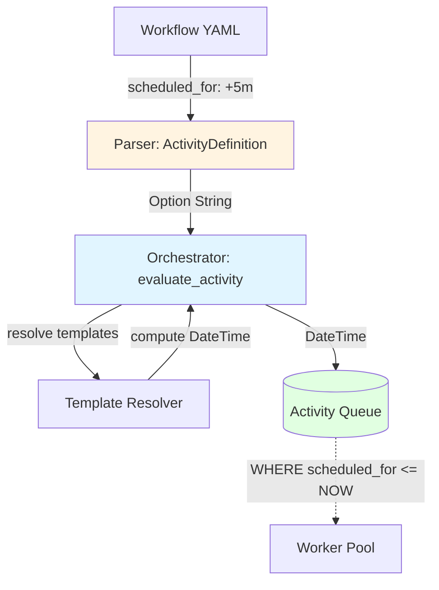

# US-6.9: Delayed Activity Scheduling - Implementation Plan

**Epic**: Epic 6 - Advanced Orchestration Features
**User Story**: US-6.9
**Status**: 📋 Planning - Ready for Implementation
**Priority**: P1 (High - Table stakes for workflow orchestrators)
**Estimated Duration**: 2-3 days
**Dependencies**: Activity Queue (US-1.1) ✅ Complete

---

## User Story

**As** a workflow developer
**I want** to schedule activities to execute at a specific future time
**So that** I can implement rate limiting, time-based workflows, and custom backoff strategies

### Acceptance Criteria

- Activities can specify `scheduled_for` in workflow definitions
- Support absolute times (ISO 8601 timestamp: `"2025-10-30T12:00:00Z"`)
- Support relative delays (duration: `"5m"`, `"1h"`, `"1d"`)
- Support dynamic delays from template expressions: `"{{previous_activity.retry_after}}s"`
- Activities are not available to workers until scheduled time
- Validation prevents scheduling activities in the past
- Metrics track scheduled vs immediate activities
- Examples demonstrate rate limiting, polling, and time-based workflows

---

## Architecture Overview

### Current State

**Already Implemented** ✅:
- `Activity` model has `scheduled_for: Option<DateTime<Utc>>` field (core/src/queue/models.rs:18)
- PostgreSQL activity queue respects `scheduled_for` via `WHERE scheduled_for <= NOW()` (core/src/queue/postgres_queue.rs)
- Orchestrator uses `scheduled_for` for retry backoff (core/src/orchestrator/orchestrator.rs:327-340)

**Gap**:
- `ActivityDefinition` model lacks `scheduled_for` field
- Orchestrator always passes `None` for initial activity scheduling (line 339)
- No parsing/validation of delay strings (`"5m"`, ISO timestamps)
- No template resolution for dynamic delays

### Implementation Strategy



### Key Design Decisions

1. **Field Type in ActivityDefinition**: `Option<String>` (not DateTime)
   - Allows template expressions: `"{{previous.delay}}s"`
   - Allows duration strings: `"5m"`, `"1h"`
   - Allows ISO timestamps: `"2025-10-30T12:00:00Z"`
   - Parsing happens at orchestration time (after template resolution)

2. **Parsing Strategy**:
   - template expression → resolve then parse
   - Check if parseable as duration → relative delay
   - Check if parseable as ISO 8601 → absolute time

3. **Duration Format**: Support common suffixes
   - `s` = seconds
   - `m` = minutes
   - `h` = hours
   - `d` = days
   - `y` = years
   - Examples: `"30s"`, `"5m"`, `"2h"`, `"1d"`

4. **Validation**:
   - Absolute times must be in the future (or within grace period, e.g., 5 seconds)
   - Relative delays must be positive
   - Maximum delay limit (e.g., 30 days) to prevent accidents

---

## Implementation Phases

### Phase 1: Data Model & Parsing (0.5 days)

**Goal**: Add `scheduled_for` field to workflow definitions and implement parsing logic

**Tasks**:

1. **Add field to ActivityDefinition** (core/src/workflow/definition.rs:617)
   ```rust
   /// Optional scheduling time for this activity
   /// Supports:
   /// - ISO 8601 timestamp: "2025-10-30T12:00:00Z"
   /// - Relative delay: "5m", "1h", "1d"
   /// - Template expression: "{{previous.retry_after}}s"
   #[serde(skip_serializing_if = "Option::is_none")]
   pub scheduled_for: Option<String>,
   ```

2. **Create duration parser utility** (new file: core/src/workflow/scheduling.rs)
   ```rust
   pub fn parse_scheduled_for(
       scheduled_str: &str,
       now: DateTime<Utc>
   ) -> Result<DateTime<Utc>, SchedulingError> {
       // Handle "5m" style relative delays
       // Handle ISO 8601 absolute times
       // Validation logic
   }
   ```

3. **Add SchedulingError variants** (core/src/workflow/definition.rs or new error module)
   - `InvalidDuration`
   - `InvalidTimestamp`
   - `TimeInPast`
   - `DelayTooLarge`

**Deliverables**:
- `scheduled_for` field in ActivityDefinition
- Duration/timestamp parsing utility
- Unit tests for parsing edge cases

---

### Phase 2: Orchestrator Integration (1 day)

**Goal**: Pass computed `scheduled_for` to activity queue

**Tasks**:

1. **Update orchestrator's evaluate_activity** (core/src/orchestrator/orchestrator.rs:324-343)
   - Currently: Only computes `scheduled_for` for retries (line 327)
   - Change: Also compute for initial scheduling
   - Steps:
     1. Check if `activity_def.scheduled_for` is present
     2. If yes, resolve templates in the string
     3. Parse resolved string to DateTime
     4. Pass to Activity model instead of None

2. **Template resolution for scheduled_for**
   - Extend template context to include:
     - `{{ACTIVITY.iteration}}` (already exists)
     - Previous activity outputs
   - Example: `"{{check_status.retry_after}}s"` → `"30s"` → 30 seconds from now

3. **Validation at orchestration time**
   - Validate parsed DateTime is in future
   - Enforce maximum delay limit (configurable, default 30 days)
   - Log warnings for large delays (> 1 day)

4. **Backward compatibility**
   - If `scheduled_for` is None → use existing behavior (None to queue)
   - Retry logic unchanged (still uses backoff calculation)

**Key Code Changes**:
```rust
// In orchestrator.rs evaluate_activity()
let scheduled_for = if activity_state.attempt > 0 {
    // Retry case: use backoff
    compute_retry_schedule(activity_def, activity_state)
} else if let Some(schedule_str) = &activity_def.scheduled_for {
    // Initial schedule: parse definition
    let resolved = template_resolver.resolve(schedule_str, &context)?;
    Some(parse_scheduled_for(&resolved, Utc::now())?)
} else {
    None  // Immediate execution
};
```

**Deliverables**:
- Orchestrator computes scheduled_for from definitions
- Template resolution for dynamic scheduling
- Validation and error handling
- Integration tests

---

### Phase 3: Testing & Examples (0.5 days)

**Goal**: Comprehensive testing and example workflows

**Tests** (core/tests/scheduled_activities_test.rs - new file):
1. **Unit tests**:
   - Parse relative delays: `"2s"`, `"5m"`, `"6h"`, `"3d"`, `"1y"`
   - Parse ISO timestamps
   - Reject invalid formats
   - Reject times in past
   - Reject excessive delays

2. **Integration tests**:
   - Schedule activity with absolute time
   - Schedule activity with relative delay
   - Dynamic scheduling from previous output
   - Verify workers don't claim activities before scheduled time
   - Verify activities execute at/after scheduled time

3. **Performance tests**:
   - Scheduling 1000 activities with varying delays
   - Queue performance with mix of immediate + scheduled

**Examples**:

1. **Rate Limiting** (examples/07-rate-limited-api-calls.yaml)
   ```yaml
   activities:
     - key: call_1
       worker: builtin
       activity_name: http_request

     - key: call_2
       worker: builtin
       activity_name: http_request
       scheduled_for: "1s"  # 1 call per second
       depends_on: [call_1]

     - key: call_3
       worker: builtin
       activity_name: http_request
       scheduled_for: "1s"
       depends_on: [call_2]
   ```

2. **Polling with Dynamic Delay** (examples/08-polling-with-backoff.yaml)
   ```yaml
   activities:
     - key: check_status
       worker: builtin
       activity_name: http_request
       iteration_scoped: true
       outputs:
         - retry_after  # API returns seconds to wait
         - complete

     - key: check_again
       worker: builtin
       activity_name: http_request
       scheduled_for: "{{check_status.retry_after | last}}s"
       depends_on:
         - activity_key: check_status
           conditions:
             - "{{check_status.complete | last == false}}"
   ```

3. **Time-Based Execution** (examples/09-scheduled-report.yaml)
   ```yaml
   activities:
     - key: generate_report
       worker: builtin
       activity_name: llm_call
       scheduled_for: "2025-12-01T09:00:00Z"  # Specific time
   ```

**Deliverables**:
- Comprehensive test suite
- Three example workflows demonstrating key use cases
- Documentation updates

---

### Phase 4: Documentation (0.5 days)

**Goal**: Update all relevant documentation

**Documents to Update**:

1. **docs/loops-guide.md** (or create docs/scheduling-guide.md)
   - How to use scheduled_for
   - Duration format reference
   - Examples for common patterns
   - Best practices for rate limiting

2. **docs/architecture.md**
   - Document scheduling flow
   - Clarify queue's role in time-based execution
   - Performance implications

3. **API documentation** (if applicable)
   - Update workflow definition schema
   - Add scheduled_for field documentation

4. **Move from post-mvp.md**
   - Mark Story 6.9 as "✅ Complete"
   - Add completion date

**Deliverables**:
- Complete scheduling guide
- Updated architecture documentation
- Schema/API docs updated

---

## Success Metrics

- **Functionality**: All acceptance criteria met
- **Tests**: 100% passing, >90% coverage for new code
- **Performance**: No measurable impact on orchestration latency (<1ms)
- **Examples**: Three working examples demonstrating key use cases
- **Documentation**: Complete guide with all features documented

---

## Risks & Mitigations

| Risk | Impact | Mitigation |
|------|--------|------------|
| Clock skew between components | Activities execute at wrong time | Use UTC everywhere, document clock sync requirements |
| Very large delays (years) cause storage issues | Database bloat | Enforce maximum delay limit (30 days default) |
| Template resolution errors at runtime | Activities fail to schedule | Validate template syntax at workflow submission time |
| Timezone confusion | Activities execute at wrong time | Only support UTC, document clearly |

---

## Out of Scope (Post-MVP)

- **Cron expressions**: Story 6.5 (separate feature)
- **Recurring schedules**: Story 6.5 (separate feature)
- **Timezone support**: Use UTC only
- **Schedule modification**: Cannot change scheduled_for after submission
- **Schedule cancellation**: Part of Story 6.6 (Workflow Cancellation)

---

## References

- Post-MVP Story: docs/post-mvp.md:2750-2849
- Queue Model: core/src/queue/models.rs:18
- Queue Implementation: core/src/queue/postgres_queue.rs
- Orchestrator: core/src/orchestrator/orchestrator.rs:327-340
- Activity Definition: core/src/workflow/definition.rs:572-617
