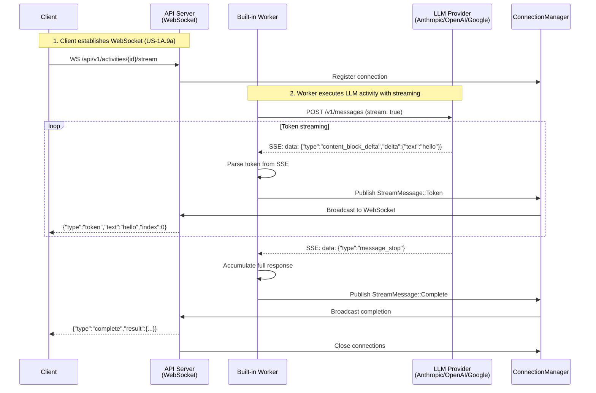

# US-7.1: Token Streaming for Real-Time UX - Implementation Plan

**Epic**: Epic 7 - AI-Native Features (Differentiators)
**User Story**: US-7.1
**Status**: 📋 Next Priority (Pre-Launch, depends on US-1A.9a)
**Priority**: MVP Critical - Core AI-Native Differentiator
**Estimated Duration**: ~20-30 hours (3-4 days)
**Dependencies**: US-1A.9a (WebSocket Infrastructure) must be complete first

---

## User Story

**As** an AI startup engineer
**I want** token-by-token streaming from LLM activities
**So that** users see responses in real-time (ChatGPT-style UX)

### Acceptance Criteria

- ✅ LLM providers support streaming (Anthropic SSE, OpenAI SSE, Google SSE)
- ✅ Activity-level streaming events published to WebSocket subscribers
- ✅ Token-by-token delivery: `{type: "token", text: "hello", index: 0}`
- ✅ <10ms P95 token latency (achievable with async streaming)
- ✅ Support 1,000 concurrent streaming connections
- ✅ Graceful fallback: Non-streaming activities complete normally
- ✅ Integration with Example 6 (agentic research) for demonstration
- ✅ Client library examples for JavaScript/Python

---

## Strategic Rationale

**Why Token Streaming is Critical for MVP**:

1. **Core Value Proposition**: Explicitly promised in Executive Summary as AI-native differentiator
2. **User Expectation**: AI startup engineers (primary persona) expect ChatGPT-style streaming UX
3. **Competitive Advantage**: No workflow orchestrator (Temporal, Airflow, Conductor) offers this
4. **Production Requirement**: Required for user-facing AI applications
5. **Market Positioning**: Validates "AI-native" claim with concrete capability

**Business Impact**:
- Enables production AI workflows with real-time UX
- Differentiates from all competitors
- Reduces perceived latency for long-running LLM calls
- Essential for AI agents with streaming responses

---

## Architecture Overview

### Token Streaming Flow



### Key Components

1. **LLM Provider Streaming** (`worker/src/llm/anthropic.rs`, `openai.rs`, `google.rs`)
   - Integrate with provider SSE streaming APIs
   - Parse SSE events asynchronously
   - Extract tokens from provider-specific formats

2. **Activity Streaming Layer** (`worker/src/activities/llm.rs`)
   - Wrap LLM provider streaming
   - Publish tokens to ConnectionManager
   - Accumulate full response for activity result
   - Handle streaming errors and reconnection

3. **Non-Streaming Fallback** (`worker/src/activities/llm.rs`)
   - Detect non-streaming activities (HTTP, PostgreSQL, etc.)
   - Execute normally without WebSocket streaming
   - No changes to non-streaming activities

4. **Example Integration** (`examples/06-agentic-research-streaming.yaml`)
   - Demonstrate streaming with Example 6 (agentic research)
   - Show real-time token output during iterative search

---

## Implementation Tasks

### Task 1: Anthropic Streaming Integration (3-4 hours)

**File**: `worker/src/llm/anthropic.rs` (update)

Integrate Anthropic streaming API:

```rust
use futures_util::StreamExt;
use reqwest_eventsource::{Event, EventSource};
use serde::{Deserialize, Serialize};
use tokio::sync::mpsc;

#[derive(Debug, Deserialize)]
#[serde(tag = "type", rename_all = "snake_case")]
enum AnthropicStreamEvent {
    MessageStart {
        message: MessageMetadata,
    },
    ContentBlockStart {
        index: u32,
        content_block: ContentBlock,
    },
    ContentBlockDelta {
        index: u32,
        delta: Delta,
    },
    ContentBlockStop {
        index: u32,
    },
    MessageDelta {
        delta: MessageDeltaData,
        usage: UsageInfo,
    },
    MessageStop,
    Ping,
    Error {
        error: ErrorInfo,
    },
}

#[derive(Debug, Deserialize)]
struct Delta {
    #[serde(rename = "type")]
    delta_type: String,
    text: Option<String>,
}

impl AnthropicProvider {
    /// Execute prompt with streaming support
    pub async fn prompt_streaming(
        &self,
        request: &PromptRequest,
        token_sender: mpsc::UnboundedSender<crate::activities::streaming::StreamToken>,
    ) -> Result<PromptResponse, LLMError> {
        let url = format!("{}/v1/messages", self.base_url);

        // Build request with streaming enabled
        let mut body = serde_json::json!({
            "model": request.model,
            "max_tokens": request.max_tokens,
            "messages": request.messages,
            "stream": true,
        });

        if let Some(system) = &request.system {
            body["system"] = serde_json::json!(system);
        }

        // Create EventSource for SSE streaming
        let mut es = EventSource::new(
            self.client
                .post(&url)
                .header("x-api-key", &self.api_key)
                .header("anthropic-version", "2023-06-01")
                .header("content-type", "application/json")
                .json(&body)
                .build()?,
        )?;

        let mut full_text = String::new();
        let mut token_index = 0u32;
        let mut usage_info = None;

        // Process SSE events
        while let Some(event) = es.next().await {
            match event {
                Ok(Event::Message(msg)) => {
                    let stream_event: AnthropicStreamEvent = serde_json::from_str(&msg.data)?;

                    match stream_event {
                        AnthropicStreamEvent::ContentBlockDelta { delta, .. } => {
                            if let Some(text) = delta.text {
                                full_text.push_str(&text);

                                // Send token to WebSocket subscribers
                                let _ = token_sender.send(crate::activities::streaming::StreamToken {
                                    text: text.clone(),
                                    index: token_index,
                                });
                                token_index += 1;
                            }
                        }
                        AnthropicStreamEvent::MessageDelta { usage, .. } => {
                            usage_info = Some(usage);
                        }
                        AnthropicStreamEvent::MessageStop => {
                            break;
                        }
                        AnthropicStreamEvent::Error { error } => {
                            return Err(LLMError::ProviderError(error.message));
                        }
                        _ => {
                            // Ignore other event types
                        }
                    }
                }
                Ok(Event::Open) => {
                    tracing::debug!("Anthropic stream opened");
                }
                Err(e) => {
                    return Err(LLMError::StreamError(e.to_string()));
                }
            }
        }

        // Calculate cost from usage
        let cost_usd = if let Some(usage) = usage_info {
            self.calculate_cost(&request.model, usage.input_tokens, usage.output_tokens)
        } else {
            None
        };

        Ok(PromptResponse {
            content: full_text,
            provider: "anthropic".to_string(),
            model: request.model.clone(),
            cost_usd,
            usage: usage_info.map(|u| TokenUsage {
                prompt_tokens: u.input_tokens,
                completion_tokens: u.output_tokens,
                total_tokens: u.input_tokens + u.output_tokens,
            }),
        })
    }
}

#[cfg(test)]
mod tests {
    use super::*;

    #[tokio::test]
    async fn test_anthropic_streaming() {
        // Mock test for streaming
        let (tx, mut rx) = mpsc::unbounded_channel();

        // Simulate sending tokens
        tx.send(StreamToken {
            text: "Hello".to_string(),
            index: 0,
        }).unwrap();

        let token = rx.recv().await.unwrap();
        assert_eq!(token.text, "Hello");
        assert_eq!(token.index, 0);
    }
}
```

**Dependencies**:
- Add to `worker/Cargo.toml`:
  ```toml
  reqwest-eventsource = "0.5"
  futures-util = "0.3"
  ```

**Acceptance Criteria**:
- ✅ `prompt_streaming` method parses Anthropic SSE events
- ✅ Tokens sent to channel as they arrive
- ✅ Full response accumulated for activity result
- ✅ Usage and cost tracking works with streaming
- ✅ Error handling for stream failures

---

### Task 2: OpenAI Streaming Integration (3-4 hours)

**File**: `worker/src/llm/openai.rs` (update)

Similar to Anthropic, integrate OpenAI streaming:

```rust
use futures_util::StreamExt;
use reqwest_eventsource::{Event, EventSource};

#[derive(Debug, Deserialize)]
struct OpenAIStreamChunk {
    id: String,
    object: String,
    created: u64,
    model: String,
    choices: Vec<StreamChoice>,
}

#[derive(Debug, Deserialize)]
struct StreamChoice {
    index: u32,
    delta: StreamDelta,
    finish_reason: Option<String>,
}

#[derive(Debug, Deserialize)]
struct StreamDelta {
    role: Option<String>,
    content: Option<String>,
}

impl OpenAIProvider {
    pub async fn prompt_streaming(
        &self,
        request: &PromptRequest,
        token_sender: mpsc::UnboundedSender<crate::activities::streaming::StreamToken>,
    ) -> Result<PromptResponse, LLMError> {
        let url = format!("{}/v1/chat/completions", self.base_url);

        let body = serde_json::json!({
            "model": request.model,
            "messages": request.messages,
            "max_tokens": request.max_tokens,
            "stream": true,
        });

        let mut es = EventSource::new(
            self.client
                .post(&url)
                .header("Authorization", format!("Bearer {}", self.api_key))
                .header("Content-Type", "application/json")
                .json(&body)
                .build()?,
        )?;

        let mut full_text = String::new();
        let mut token_index = 0u32;

        while let Some(event) = es.next().await {
            match event {
                Ok(Event::Message(msg)) => {
                    if msg.data == "[DONE]" {
                        break;
                    }

                    let chunk: OpenAIStreamChunk = serde_json::from_str(&msg.data)?;

                    for choice in chunk.choices {
                        if let Some(content) = choice.delta.content {
                            full_text.push_str(&content);

                            let _ = token_sender.send(crate::activities::streaming::StreamToken {
                                text: content.clone(),
                                index: token_index,
                            });
                            token_index += 1;
                        }
                    }
                }
                Ok(Event::Open) => {
                    tracing::debug!("OpenAI stream opened");
                }
                Err(e) => {
                    return Err(LLMError::StreamError(e.to_string()));
                }
            }
        }

        let cost_usd = self.estimate_cost(&request.model, &full_text, request.max_tokens);

        Ok(PromptResponse {
            content: full_text,
            provider: "openai".to_string(),
            model: request.model.clone(),
            cost_usd,
            usage: None, // OpenAI doesn't provide usage in streaming mode
        })
    }
}
```

**Acceptance Criteria**:
- ✅ OpenAI SSE format parsed correctly
- ✅ Handles `[DONE]` sentinel
- ✅ Tokens sent as they arrive
- ✅ Cost estimation for streaming responses

---

### Task 3: Google Gemini Streaming Integration (2-3 hours)

**File**: `worker/src/llm/google.rs` (update)

Integrate Google Gemini streaming (similar pattern):

```rust
impl GoogleProvider {
    pub async fn prompt_streaming(
        &self,
        request: &PromptRequest,
        token_sender: mpsc::UnboundedSender<crate::activities::streaming::StreamToken>,
    ) -> Result<PromptResponse, LLMError> {
        let url = format!(
            "{}/v1/models/{}:streamGenerateContent?key={}",
            self.base_url, request.model, self.api_key
        );

        let body = serde_json::json!({
            "contents": self.convert_messages(&request.messages),
            "generationConfig": {
                "maxOutputTokens": request.max_tokens,
            }
        });

        let mut es = EventSource::new(
            self.client
                .post(&url)
                .header("Content-Type", "application/json")
                .json(&body)
                .build()?,
        )?;

        let mut full_text = String::new();
        let mut token_index = 0u32;

        while let Some(event) = es.next().await {
            match event {
                Ok(Event::Message(msg)) => {
                    let chunk: GoogleStreamChunk = serde_json::from_str(&msg.data)?;

                    for candidate in chunk.candidates {
                        if let Some(content) = candidate.content {
                            if let Some(parts) = content.parts {
                                for part in parts {
                                    if let Some(text) = part.text {
                                        full_text.push_str(&text);

                                        let _ = token_sender.send(crate::activities::streaming::StreamToken {
                                            text: text.clone(),
                                            index: token_index,
                                        });
                                        token_index += 1;
                                    }
                                }
                            }
                        }
                    }
                }
                Ok(Event::Open) => {
                    tracing::debug!("Google stream opened");
                }
                Err(e) => {
                    return Err(LLMError::StreamError(e.to_string()));
                }
            }
        }

        let cost_usd = self.estimate_cost(&request.model, &full_text, request.max_tokens);

        Ok(PromptResponse {
            content: full_text,
            provider: "google".to_string(),
            model: request.model.clone(),
            cost_usd,
            usage: None,
        })
    }
}
```

**Acceptance Criteria**:
- ✅ Google SSE format parsed correctly
- ✅ Nested content structure handled
- ✅ Tokens streamed properly

---

### Task 4: Activity Streaming Layer (6-8 hours)

**File**: `worker/src/activities/llm.rs` (update)

Integrate streaming into activity execution:

```rust
use crate::websocket::ConnectionManager;
use std::sync::Arc;
use tokio::sync::mpsc;

pub async fn execute_llm_activity_with_streaming(
    activity_id: Uuid,
    workflow_id: Uuid,
    parameters: &LLMActivityParameters,
    connection_manager: Arc<ConnectionManager>,
    api_url: &str,
) -> Result<ActivityResult, ActivityError> {
    // Check if there are any WebSocket subscribers
    let has_subscribers = connection_manager.connection_count(activity_id).await > 0;

    if !has_subscribers {
        // No subscribers - execute without streaming (more efficient)
        return execute_llm_activity_non_streaming(activity_id, workflow_id, parameters).await;
    }

    // Create channel for token streaming
    let (token_tx, mut token_rx) = mpsc::unbounded_channel();

    // Spawn task to forward tokens to WebSocket subscribers
    let conn_mgr = connection_manager.clone();
    let streaming_task = tokio::spawn(async move {
        while let Some(token) = token_rx.recv().await {
            conn_mgr
                .broadcast(
                    activity_id,
                    StreamMessage::Token {
                        text: token.text,
                        index: token.index,
                        timestamp: chrono::Utc::now(),
                    },
                )
                .await;
        }
    });

    // Execute LLM with streaming
    let provider = get_provider(&parameters.model)?;
    let response = match provider {
        Provider::Anthropic(p) => {
            p.prompt_streaming(&parameters.to_prompt_request(), token_tx.clone()).await?
        }
        Provider::OpenAI(p) => {
            p.prompt_streaming(&parameters.to_prompt_request(), token_tx.clone()).await?
        }
        Provider::Google(p) => {
            p.prompt_streaming(&parameters.to_prompt_request(), token_tx.clone()).await?
        }
        Provider::Ollama(p) => {
            // Ollama may not support streaming in MVP
            p.prompt(&parameters.to_prompt_request()).await?
        }
    };

    // Close token channel (signals streaming_task to complete)
    drop(token_tx);
    streaming_task.await?;

    // Send completion message
    connection_manager
        .broadcast(
            activity_id,
            StreamMessage::Complete {
                activity_id,
                result: serde_json::to_value(&response)?,
                timestamp: chrono::Utc::now(),
            },
        )
        .await;

    // Close all connections for this activity
    connection_manager.close_all(activity_id).await;

    // Return activity result (same as non-streaming)
    Ok(ActivityResult {
        outputs: serde_json::json!({
            "result": {
                "content": response.content,
                "provider": response.provider,
                "model": response.model,
                "cost_usd": response.cost_usd,
                "usage": response.usage,
            }
        }),
        cost_usd: response.cost_usd,
        ..Default::default()
    })
}

// Non-streaming version (when no WebSocket subscribers)
async fn execute_llm_activity_non_streaming(
    activity_id: Uuid,
    workflow_id: Uuid,
    parameters: &LLMActivityParameters,
) -> Result<ActivityResult, ActivityError> {
    // Existing non-streaming implementation
    let provider = get_provider(&parameters.model)?;
    let response = provider.prompt(&parameters.to_prompt_request()).await?;

    Ok(ActivityResult {
        outputs: serde_json::json!({
            "result": {
                "content": response.content,
                "provider": response.provider,
                "model": response.model,
                "cost_usd": response.cost_usd,
                "usage": response.usage,
            }
        }),
        cost_usd: response.cost_usd,
        ..Default::default()
    })
}
```

**File**: `worker/src/main.rs` (update)

Pass ConnectionManager to worker:

```rust
// Worker needs access to API's ConnectionManager
// Option 1: Worker connects to API via HTTP and publishes streaming events
// Option 2: Worker has direct access to ConnectionManager (shared state)

// For MVP, use Option 1: Worker publishes via API endpoint
// POST /api/v1/internal/activities/{id}/stream_token
// This keeps built-in worker consistent with external workers

pub async fn publish_stream_token(
    api_url: &str,
    activity_id: Uuid,
    token: &StreamToken,
) -> Result<(), reqwest::Error> {
    let client = reqwest::Client::new();
    client
        .post(format!("{}/api/v1/internal/activities/{}/stream_token", api_url, activity_id))
        .json(&serde_json::json!({
            "text": token.text,
            "index": token.index,
        }))
        .send()
        .await?;
    Ok(())
}
```

**File**: `api/src/handlers/internal.rs` (new)

Internal API endpoint for worker to publish tokens:

```rust
/// Internal endpoint for worker to publish streaming tokens
/// POST /api/v1/internal/activities/{id}/stream_token
pub async fn publish_stream_token(
    Path(activity_id): Path<Uuid>,
    State(state): State<Arc<AppState>>,
    Json(payload): Json<StreamTokenPayload>,
) -> Result<StatusCode, (StatusCode, String)> {
    state
        .connection_manager
        .broadcast(
            activity_id,
            StreamMessage::Token {
                text: payload.text,
                index: payload.index,
                timestamp: chrono::Utc::now(),
            },
        )
        .await;

    Ok(StatusCode::OK)
}

#[derive(Deserialize)]
struct StreamTokenPayload {
    text: String,
    index: u32,
}
```

**Acceptance Criteria**:
- ✅ Check for WebSocket subscribers before streaming
- ✅ Execute non-streaming when no subscribers (performance optimization)
- ✅ Forward tokens to WebSocket via ConnectionManager or internal API
- ✅ Accumulate full response for activity result
- ✅ Send completion message after streaming finishes
- ✅ Handle errors during streaming gracefully

---

### Task 5: Example Integration and Documentation (3-4 hours)

**File**: `examples/06b-agentic-research-streaming.yaml` (new)

Add streaming example variant of Example 6:

```yaml
# This example demonstrates real-time token streaming from LLM activities
# Clients can connect to WebSocket endpoint to see live responses
#
# WebSocket connection:
# ws://localhost:8080/api/v1/activities/{activity_id}/stream?token=YOUR_TOKEN
#
# Message format:
# {"type": "token", "text": "Hello", "index": 0, "timestamp": "2025-11-21T..."}
# {"type": "complete", "activity_id": "...", "result": {...}, "timestamp": "..."}

name: agentic_research_streaming
description: Iterative research with real-time token streaming (demonstrates US-7.1)

activities:
  # ... same as 06-agentic-research.yaml ...
  # All LLM activities automatically support streaming when clients connect
```

**File**: `examples/streaming-client.js` (new)

JavaScript WebSocket client example:

```javascript
// StreamFlow Token Streaming Client Example
// Connects to activity WebSocket and displays tokens in real-time

const WebSocket = require('ws');

class StreamFlowStreamingClient {
  constructor(apiUrl, bearerToken) {
    this.apiUrl = apiUrl;
    this.token = bearerToken;
  }

  // Subscribe to activity streaming
  async streamActivity(activityId, onToken, onComplete, onError) {
    const wsUrl = `${this.apiUrl.replace('http', 'ws')}/api/v1/activities/${activityId}/stream?token=${this.token}`;

    const ws = new WebSocket(wsUrl);

    ws.on('open', () => {
      console.log('Connected to activity stream');
    });

    ws.on('message', (data) => {
      const message = JSON.parse(data);

      switch (message.type) {
        case 'token':
          onToken(message.text, message.index);
          break;
        case 'complete':
          onComplete(message.result);
          break;
        case 'error':
          onError(new Error(message.error));
          break;
      }
    });

    ws.on('error', (error) => {
      onError(error);
    });

    ws.on('close', () => {
      console.log('Stream closed');
    });

    return ws;
  }
}

// Usage example
const client = new StreamFlowStreamingClient('http://localhost:8080', 'YOUR_TOKEN');

client.streamActivity(
  'activity-id-here',
  (text, index) => {
    process.stdout.write(text); // Display tokens as they arrive
  },
  (result) => {
    console.log('\n\nComplete:', result);
  },
  (error) => {
    console.error('Error:', error);
  }
);
```

**File**: `examples/streaming-client.py` (new)

Python WebSocket client example:

```python
import asyncio
import json
import websockets

class StreamFlowStreamingClient:
    def __init__(self, api_url: str, bearer_token: str):
        self.api_url = api_url
        self.token = bearer_token

    async def stream_activity(self, activity_id: str, on_token, on_complete, on_error):
        """Subscribe to activity streaming"""
        ws_url = f"{self.api_url.replace('http', 'ws')}/api/v1/activities/{activity_id}/stream?token={self.token}"

        try:
            async with websockets.connect(ws_url) as ws:
                print("Connected to activity stream")

                async for message_str in ws:
                    message = json.loads(message_str)

                    if message['type'] == 'token':
                        on_token(message['text'], message['index'])
                    elif message['type'] == 'complete':
                        on_complete(message['result'])
                    elif message['type'] == 'error':
                        on_error(Exception(message['error']))

        except Exception as e:
            on_error(e)

# Usage example
async def main():
    client = StreamFlowStreamingClient('http://localhost:8080', 'YOUR_TOKEN')

    def on_token(text, index):
        print(text, end='', flush=True)  # Display tokens as they arrive

    def on_complete(result):
        print('\n\nComplete:', result)

    def on_error(error):
        print('Error:', error)

    await client.stream_activity('activity-id-here', on_token, on_complete, on_error)

if __name__ == '__main__':
    asyncio.run(main())
```

**File**: `examples/README.md` (update)

Add streaming documentation:

```markdown
## Token Streaming (US-7.1)

All LLM activities support real-time token streaming when clients connect to the WebSocket endpoint.

### How to Use Token Streaming

1. **Start a workflow** with LLM activities:
   ```bash
   curl -X POST http://localhost:8080/api/v1/workflows \
     -H "Authorization: Bearer YOUR_TOKEN" \
     -H "Content-Type: application/json" \
     -d @examples/06-agentic-research.yaml
   ```

2. **Get activity ID** from workflow status:
   ```bash
   curl http://localhost:8080/api/v1/workflows/{workflow_id} \
     -H "Authorization: Bearer YOUR_TOKEN"
   ```

3. **Connect WebSocket** to stream tokens:
   ```javascript
   const ws = new WebSocket(
     'ws://localhost:8080/api/v1/activities/{activity_id}/stream?token=YOUR_TOKEN'
   );
   ```

4. **Receive tokens** in real-time:
   ```json
   {"type": "token", "text": "Hello", "index": 0}
   {"type": "token", "text": " world", "index": 1}
   {"type": "complete", "result": {...}}
   ```

See `examples/streaming-client.js` and `examples/streaming-client.py` for complete examples.
```

**Acceptance Criteria**:
- ✅ Streaming example workflow created
- ✅ JavaScript client library example
- ✅ Python client library example
- ✅ Documentation in examples/README.md
- ✅ Example demonstrates streaming with Example 6

---

### Task 6: Testing (5-6 hours)

**File**: `api/tests/token_streaming_integration_tests.rs` (new)

End-to-end token streaming tests:

```rust
#[tokio::test]
async fn test_llm_activity_with_streaming() {
    let app = create_test_app().await;
    let token = create_test_token(&app).await;

    // 1. Submit workflow with LLM activity
    let workflow_id = submit_test_workflow(&app, &token).await;

    // 2. Get activity ID from workflow
    let activity_id = get_first_activity_id(&app, workflow_id, &token).await;

    // 3. Connect WebSocket before activity executes
    let ws_url = format!(
        "ws://localhost/api/v1/activities/{}/stream?token={}",
        activity_id, token
    );
    let (mut ws, _) = tokio_tungstenite::connect_async(&ws_url).await.unwrap();

    // 4. Collect streamed tokens
    let mut tokens = Vec::new();
    let mut complete_received = false;

    while let Some(msg) = ws.next().await {
        let msg = msg.unwrap();
        let json: serde_json::Value = serde_json::from_str(msg.to_text().unwrap()).unwrap();

        match json["type"].as_str().unwrap() {
            "token" => {
                tokens.push(json["text"].as_str().unwrap().to_string());
            }
            "complete" => {
                complete_received = true;
                break;
            }
            _ => {}
        }
    }

    // 5. Verify streaming worked
    assert!(!tokens.is_empty(), "Should receive tokens");
    assert!(complete_received, "Should receive completion message");

    // 6. Verify activity result matches streamed content
    let workflow_status = get_workflow_status(&app, workflow_id, &token).await;
    let activity_result = workflow_status["state_data"]["activities"][activity_id.to_string()]["outputs"]["result"]["content"]
        .as_str()
        .unwrap();

    let streamed_text: String = tokens.join("");
    assert_eq!(activity_result, streamed_text);
}

#[tokio::test]
async fn test_streaming_with_multiple_subscribers() {
    let app = create_test_app().await;
    let token = create_test_token(&app).await;

    let workflow_id = submit_test_workflow(&app, &token).await;
    let activity_id = get_first_activity_id(&app, workflow_id, &token).await;

    // Connect 10 WebSocket clients
    let mut clients = Vec::new();
    for _ in 0..10 {
        let ws_url = format!(
            "ws://localhost/api/v1/activities/{}/stream?token={}",
            activity_id, token
        );
        let (ws, _) = tokio_tungstenite::connect_async(&ws_url).await.unwrap();
        clients.push(ws);
    }

    // All clients should receive same tokens
    let mut all_tokens = Vec::new();
    for mut client in clients {
        let mut tokens = Vec::new();
        while let Some(msg) = client.next().await {
            let msg = msg.unwrap();
            let json: serde_json::Value = serde_json::from_str(msg.to_text().unwrap()).unwrap();

            if json["type"] == "token" {
                tokens.push(json["text"].as_str().unwrap().to_string());
            } else if json["type"] == "complete" {
                break;
            }
        }
        all_tokens.push(tokens);
    }

    // Verify all clients received same tokens
    for tokens in &all_tokens[1..] {
        assert_eq!(tokens, &all_tokens[0]);
    }
}

#[tokio::test]
async fn test_non_streaming_fallback() {
    let app = create_test_app().await;
    let token = create_test_token(&app).await;

    // Submit workflow but DON'T connect WebSocket
    let workflow_id = submit_test_workflow(&app, &token).await;

    // Wait for workflow to complete
    wait_for_workflow_completion(&app, workflow_id, &token).await;

    // Verify activity completed successfully without streaming
    let workflow_status = get_workflow_status(&app, workflow_id, &token).await;
    assert_eq!(workflow_status["status"], "Completed");
}

#[tokio::test]
async fn test_streaming_error_handling() {
    let app = create_test_app().await;
    let token = create_test_token(&app).await;

    // Submit workflow with invalid LLM parameters (will fail)
    let workflow_id = submit_failing_workflow(&app, &token).await;
    let activity_id = get_first_activity_id(&app, workflow_id, &token).await;

    let ws_url = format!(
        "ws://localhost/api/v1/activities/{}/stream?token={}",
        activity_id, token
    );
    let (mut ws, _) = tokio_tungstenite::connect_async(&ws_url).await.unwrap();

    // Should receive error message
    let mut error_received = false;
    while let Some(msg) = ws.next().await {
        let msg = msg.unwrap();
        let json: serde_json::Value = serde_json::from_str(msg.to_text().unwrap()).unwrap();

        if json["type"] == "error" {
            error_received = true;
            break;
        }
    }

    assert!(error_received, "Should receive error message");
}
```

**Acceptance Criteria**:
- ✅ Test streaming with single subscriber
- ✅ Test streaming with multiple subscribers
- ✅ Test non-streaming fallback (no subscribers)
- ✅ Test error handling during streaming
- ✅ Test all three LLM providers (Anthropic, OpenAI, Google)
- ✅ Verify streamed tokens match final result

---

## Success Criteria

### Functional Requirements

- ✅ Anthropic Claude streaming works with all models
- ✅ OpenAI GPT streaming works with all models
- ✅ Google Gemini streaming works with all models
- ✅ Tokens delivered in real-time (<10ms P95 latency)
- ✅ Full response accumulated correctly
- ✅ Cost tracking works with streaming
- ✅ Non-streaming activities not affected (HTTP, PostgreSQL, etc.)
- ✅ Graceful fallback when no WebSocket subscribers

### Non-Functional Requirements

- ✅ Support 1,000 concurrent streaming connections
- ✅ <10ms P95 token delivery latency
- ✅ Memory usage: <1MB per streaming connection
- ✅ No performance degradation for non-streaming activities
- ✅ Streaming adds <5% overhead to activity execution

### User Experience

- ✅ ChatGPT-style real-time UX
- ✅ Example 6 (agentic research) demonstrates streaming
- ✅ JavaScript and Python client examples work
- ✅ Documentation clear and complete

---

## Risks and Mitigations

### Risk 1: LLM Provider API Changes

**Impact**: High
**Probability**: Low
**Mitigation**:
- Pin API versions in provider implementations
- Monitor provider changelogs
- Add integration tests that will fail if API changes

### Risk 2: Streaming Performance Overhead

**Impact**: Medium
**Probability**: Low
**Mitigation**:
- Only stream when WebSocket subscribers present
- Use unbounded channels to avoid blocking
- Monitor metrics to detect performance issues

### Risk 3: Token Accumulation Memory Usage

**Impact**: Low
**Probability**: Low
**Mitigation**:
- Stream tokens but also accumulate full response
- Limit max response size (via max_tokens)
- Monitor memory usage per activity

---

## Post-Implementation Checklist

- [ ] All acceptance criteria met
- [ ] Unit tests passing (all providers)
- [ ] Integration tests passing
- [ ] Load test: 1,000 concurrent streaming connections
- [ ] Example 6 demonstrates streaming
- [ ] Client library examples tested
- [ ] Documentation complete
- [ ] Code review completed
- [ ] Performance metrics validated (<10ms P95)
- [ ] Merged to main branch
- [ ] **Token streaming delivered before public MVP launch**

---

## References

- US-1A.9a: WebSocket Infrastructure (dependency)
- Example 6: Agentic Research (demonstration workflow)
- Anthropic Streaming API: https://docs.anthropic.com/claude/reference/streaming
- OpenAI Streaming API: https://platform.openai.com/docs/api-reference/chat/create#chat-create-stream
- Google Streaming API: https://ai.google.dev/api/rest/v1/models/streamGenerateContent
