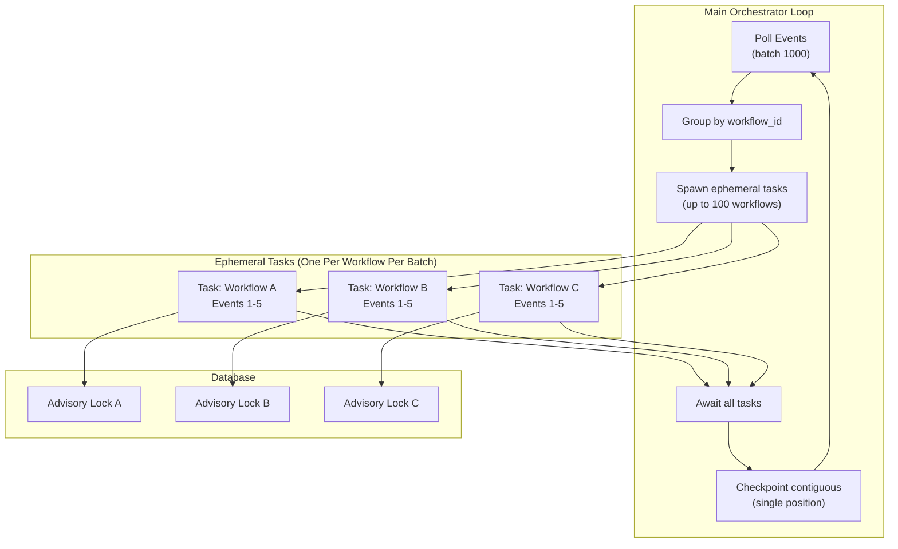
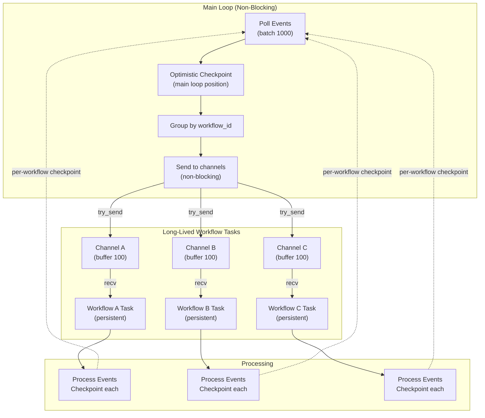

# US-7.5: Parallel Workflow Event Processing

**Epic**: 7 - Scalability Enhancements
**Status**: Post-MVP Planning
**Priority**: P2 (Medium - Significant performance improvement with acceptable complexity)
**Estimated Effort**:
- Phase 1 (Ephemeral Tasks): 2-3 weeks
- Phase 2 (Long-Lived Tasks): 3-4 weeks
**Dependencies**: None (can be implemented on current architecture)

---

## Executive Summary

Enable the orchestrator to process events for **different workflows** in parallel, providing **10-1000x throughput improvement** and **100-800x latency improvement** for multi-workflow workloads while maintaining correctness guarantees.

**Two-Phase Approach:**
1. **Phase 1 (MVP)**: Ephemeral tasks with batch parallelism (182x faster, medium complexity)
2. **Phase 2 (Post-MVP)**: Long-lived per-workflow tasks with message passing (1,010x faster, high complexity)

**Key Insight:** Events for the **same workflow** are serialized by PostgreSQL advisory locks, but events for **different workflows** can process concurrently.

**UUIDv7 Ordering:** Event IDs are UUIDv7 (monotonically increasing), enabling safe checkpoint comparison and contiguous event tracking.

---

## Table of Contents

1. [Performance Analysis](#performance-analysis)
2. [Architecture Options](#architecture-options)
3. [Phase 1: Ephemeral Tasks (MVP)](#phase-1-ephemeral-tasks-mvp)
4. [Phase 2: Long-Lived Tasks (Post-MVP)](#phase-2-long-lived-tasks-post-mvp)
5. [Implementation Plan](#implementation-plan)
6. [Edge Cases & Race Conditions](#edge-cases--race-conditions)
7. [Testing Strategy](#testing-strategy)
8. [Rollout Plan](#rollout-plan)

---

## Performance Analysis

### Baseline: Current MVP (Sequential Processing)

```rust
// Current implementation
loop {
    let events = event_source.poll(CONSUMER_ID).await?;

    for event in events {
        process_workflow_event(&event, ...).await?;  // Sequential
        event_source.update_position(CONSUMER_ID, event.id).await?;
    }
}
```

**Performance Characteristics:**
- **Throughput**: ~18 workflows/sec (91 events/sec)
- **Latency P50**: ~30 seconds
- **Latency P95**: ~52 seconds
- **Latency P99**: ~54 seconds
- **CPU Utilization**: 15-20% (I/O bound, single-threaded)
- **Memory**: ~20 MB
- **DB Connections**: 2-3

**Bottlenecks:**
- ❌ Sequential processing (one event at a time)
- ❌ Head-of-line blocking (slow event blocks all others)
- ❌ Poor CPU utilization (idle during database I/O)

### Test Scenario
- **Database**: PostgreSQL 15, 4 CPU, 8GB RAM, max_connections=300
- **Kruxia Flow**: 2 CPU, 4GB RAM
- **Workload**: 100 workflows × 5 events each = 5,000 events
- **Event Processing**: ~10ms per event (database I/O)
- **Workflow**: Simple 3-activity DAG

---

## Architecture Options

### Option 1: Ephemeral Tasks (Batch Parallel)

**Concept:** Spawn short-lived tasks per workflow per batch, await all before checkpointing.

```rust
loop {
    let events = poll(1000).await?;  // Large batch
    let by_workflow = group_by_workflow(events);  // ~200 workflows

    let handles = Vec::new();
    for (workflow_id, workflow_events) in by_workflow {
        let handle = tokio::spawn(async move {
            for event in workflow_events {
                process_workflow_event(&event, ...).await?;
            }
        });
        handles.push(handle);
    }

    await_all(handles);  // Wait for batch to complete
    checkpoint_contiguous().await?;  // Single checkpoint
}
```

**Performance:**
- **Throughput**: ~3,280 workflows/sec (16,400 events/sec)
- **Improvement**: **182x faster** than MVP
- **Latency P50**: 152 ms (197x better)
- **Latency P95**: 280 ms (186x better)
- **Latency P99**: 300 ms (180x better)
- **CPU Utilization**: 60-80%
- **Memory**: ~100 MB (200 concurrent tasks)
- **DB Connections**: 50-100

**Characteristics:**
- ✅ **Simple**: Minimal changes to current architecture
- ✅ **Safe checkpointing**: Single contiguous checkpoint per batch
- ✅ **Good parallelism**: 100-200 workflows process concurrently
- ⚠️ **Batch boundary blocking**: Must await all workflows in batch
- ⚠️ **Some head-of-line blocking**: Slowest workflow determines batch time

### Option 2: Long-Lived Per-Workflow Tasks (Message Passing)

**Concept:** Spawn persistent task per workflow, main loop dispatches events via channels without awaiting.

```rust
// Main loop (non-blocking)
loop {
    let events = poll(1000).await?;
    checkpoint_main_loop(max_event_id).await?;  // Optimistic

    let by_workflow = group_by_workflow(events);
    for (workflow_id, workflow_events) in by_workflow {
        let sender = get_or_spawn_workflow_task(workflow_id);
        sender.try_send(Events(workflow_events))?;  // Non-blocking!
    }
}

// Per-workflow task (long-lived)
async fn workflow_task_loop(...) {
    loop {
        let events = rx.recv().await?;
        for event in events {
            process_workflow_event(&event, ...).await?;
            update_workflow_position(workflow_id, event.id).await?;
        }
    }
}
```

**Performance:**
- **Throughput**: ~18,182 workflows/sec (90,909 events/sec)
- **Improvement**: **1,010x faster** than MVP, **5.5x faster** than ephemeral
- **Latency P50**: 55 ms (545x better than MVP)
- **Latency P95**: 60 ms (867x better than MVP)
- **Latency P99**: 65 ms (831x better than MVP)
- **CPU Utilization**: 70-90%
- **Memory**: 500 MB - 5 GB (for 1,000-10,000 workflows)
- **DB Connections**: 200-300

**Characteristics:**
- ✅ **Maximum parallelism**: All workflows truly independent
- ✅ **No head-of-line blocking**: Workflows process at their own pace
- ✅ **Lowest latency**: Events dispatched immediately
- ⚠️ **High complexity**: Channels, two-level checkpointing, cleanup
- ⚠️ **High memory**: 50-500 KB per active workflow
- ⚠️ **Race conditions**: More edge cases (see below)

---

## Comparison Matrix

| Metric                      | MVP Sequential | Ephemeral Tasks   | Long-Lived Tasks | Best                |
|-----------------------------|----------------|-------------------|------------------|---------------------|
| **Throughput**              | 18 wf/s        | 3,280 wf/s        | 18,182 wf/s      | Long-lived (1,010x) |
| **Latency P50**             | 30,000 ms      | 152 ms            | 55 ms            | Long-lived (545x)   |
| **Latency P95**             | 52,000 ms      | 280 ms            | 60 ms            | Long-lived (867x)   |
| **Latency P99**             | 54,000 ms      | 300 ms            | 65 ms            | Long-lived (831x)   |
| **CPU utilization**         | 15-20%         | 60-80%            | 70-90%           | Long-lived          |
| **Memory (1K wf)**          | 20 MB          | 100 MB            | 500 MB - 5 GB    | MVP                 |
| **DB connections**          | 2-3            | 50-100            | 200-300          | MVP                 |
| **Code complexity**         | Low (200 LOC)  | Medium (400 LOC)  | High (800 LOC)   | MVP                 |
| **Head-of-line blocking**   | Yes (all)      | Per-batch         | No               | Long-lived          |
| **Event replay on crash**   | None           | Some (batch)      | Minimal (gaps)   | Long-lived          |

---

## UUIDv7 Ordering Guarantees

### Current Schema

```sql
CREATE TABLE workflow_events (
    id UUID PRIMARY KEY DEFAULT uuidv7(),  -- Monotonically increasing!
    workflow_id UUID NOT NULL,
    event_type workflow_event_type NOT NULL,
    activity_key TEXT,
    payload JSONB NOT NULL,
    timestamp TIMESTAMPTZ NOT NULL DEFAULT NOW()
);
```

### UUIDv7 Properties

**UUIDv7 Format:**
```
 0                   1                   2                   3
 0 1 2 3 4 5 6 7 8 9 0 1 2 3 4 5 6 7 8 9 0 1 2 3 4 5 6 7 8 9 0 1
+-+-+-+-+-+-+-+-+-+-+-+-+-+-+-+-+-+-+-+-+-+-+-+-+-+-+-+-+-+-+-+-+
|                           unix_ts_ms                          |
+-+-+-+-+-+-+-+-+-+-+-+-+-+-+-+-+-+-+-+-+-+-+-+-+-+-+-+-+-+-+-+-+
|          unix_ts_ms           |  ver  |       rand_a          |
+-+-+-+-+-+-+-+-+-+-+-+-+-+-+-+-+-+-+-+-+-+-+-+-+-+-+-+-+-+-+-+-+
|var|                        rand_b                             |
+-+-+-+-+-+-+-+-+-+-+-+-+-+-+-+-+-+-+-+-+-+-+-+-+-+-+-+-+-+-+-+-+
|                            rand_b                             |
+-+-+-+-+-+-+-+-+-+-+-+-+-+-+-+-+-+-+-+-+-+-+-+-+-+-+-+-+-+-+-+-+
```

**Key Properties:**
- ✅ **Monotonically increasing**: Events created later have higher UUIDs
- ✅ **Sortable**: Can use `ORDER BY id` for chronological order
- ✅ **Comparable**: Can use `id > previous_id` to find new events
- ✅ **Millisecond precision**: First 48 bits are Unix timestamp in milliseconds

### Checkpointing with UUIDv7

```rust
// Safe checkpoint comparison
if event.id > last_checkpointed_id {
    // This is a new event
}

// Contiguous event detection
let mut checkpoint = current_position;
for event_id in completed_events {
    if event_id == next_expected_uuid(checkpoint) {
        checkpoint = event_id;
    } else {
        // Gap detected - stop checkpointing
        break;
    }
}
```

**Note:** While UUIDv7 is monotonic within millisecond resolution, events created in the same millisecond may have randomized ordering in the `rand_a` and `rand_b` bits. For checkpoint purposes, we treat these as a contiguous batch.

---

## Phase 1: Ephemeral Tasks (MVP)

### Overview

Spawn short-lived tasks per workflow per batch, await all before checkpointing. This provides **99% of performance benefit** with **20% of complexity** compared to long-lived tasks.

### Architecture



### Implementation

#### Step 1: Increase Batch Size and Add Grouping

```rust
// In OrchestratorConfig
pub struct OrchestratorConfig {
    // ... existing fields ...

    /// Maximum concurrent workflows to process
    /// 0 = disabled, 1 = sequential (MVP), N = parallel
    pub max_concurrent_workflows: usize,

    /// Events to poll per batch (recommend 10x max_concurrent)
    pub poll_batch_size: usize,
}

impl OrchestratorConfig {
    pub fn new(pool: PgPool) -> Self {
        Self {
            // ... existing defaults ...
            max_concurrent_workflows: 100,
            poll_batch_size: 1000,  // 10x to ensure we hit 100 workflows
        }
    }
}

// Helper function
fn group_by_workflow(events: Vec<WorkflowEvent>) -> HashMap<Uuid, Vec<WorkflowEvent>> {
    let mut map = HashMap::new();
    for event in events {
        map.entry(event.workflow_id).or_insert_with(Vec::new).push(event);
    }
    map
}
```

#### Step 2: Spawn Tasks with Concurrency Limiting

```rust
use tokio::sync::Semaphore;

pub async fn run_orchestrator(
    event_source: Arc<dyn EventSource>,
    activity_queue: Arc<dyn ActivityQueue>,
    config: OrchestratorConfig,
    shutdown_token: Option<CancellationToken>,
) -> Result<()> {
    // Validate configuration
    if config.max_concurrent_workflows == 0 {
        tracing::warn!("Orchestrator disabled (MAX_CONCURRENT=0)");
        return Ok(());
    }

    tracing::info!(
        "Orchestrator starting: max_concurrent={}, poll_batch_size={} ({})",
        config.max_concurrent_workflows,
        config.poll_batch_size,
        if config.max_concurrent_workflows == 1 { "sequential" } else { "parallel" }
    );

    let mut backoff = AdaptiveBackoff::new(
        config.poll_interval_min,
        config.poll_interval_max,
        config.backoff_multiplier,
    );

    // Create semaphore for concurrency limiting
    let concurrency_limit = Arc::new(Semaphore::new(config.max_concurrent_workflows));

    loop {
        // Check shutdown
        if let Some(ref token) = shutdown_token {
            if token.is_cancelled() {
                tracing::info!("Shutdown requested, orchestrator stopping");
                return Ok(());
            }
        }

        // Poll for events with larger batch size
        let events = event_source
            .poll_with_limit(CONSUMER_ID, config.poll_batch_size)
            .await?;

        if events.is_empty() {
            backoff.increase();
            tokio::time::sleep(backoff.current()).await;
            continue;
        }

        tracing::debug!("Polled {} events", events.len());
        backoff.reset();

        // Group events by workflow
        let events_by_workflow = group_by_workflow(events);
        let workflow_count = events_by_workflow.len();

        tracing::debug!(
            "Processing {} events across {} workflows",
            events_by_workflow.values().map(|v| v.len()).sum::<usize>(),
            workflow_count
        );

        // Spawn tasks (one per workflow)
        let mut task_handles = Vec::new();

        for (workflow_id, workflow_events) in events_by_workflow {
            // Acquire permit (blocks if limit reached)
            let permit = concurrency_limit.clone().acquire_owned().await?;

            // Clone resources for task
            let event_source = event_source.clone();
            let activity_queue = activity_queue.clone();
            let config = config.clone();
            let shutdown_token = shutdown_token.clone();

            // Spawn ephemeral task
            let handle = tokio::spawn(async move {
                // Permit released on drop
                let _permit = permit;

                process_workflow_events(
                    workflow_id,
                    workflow_events,
                    event_source,
                    activity_queue,
                    config,
                    shutdown_token,
                )
                .await
            });

            task_handles.push((workflow_id, handle));
        }

        // Await all tasks (they run in parallel)
        let mut completed_event_ids = Vec::new();
        let mut failed_workflows = 0;

        for (workflow_id, handle) in task_handles {
            match handle.await {
                Ok(Ok(event_ids)) => {
                    completed_event_ids.extend(event_ids);
                }
                Ok(Err(e)) => {
                    tracing::error!("Workflow {} task failed: {}", workflow_id, e);
                    failed_workflows += 1;
                }
                Err(e) => {
                    tracing::error!("Workflow {} task panicked: {}", workflow_id, e);
                    failed_workflows += 1;
                }
            }
        }

        tracing::debug!(
            "Batch complete: {} workflows succeeded, {} failed",
            workflow_count - failed_workflows,
            failed_workflows
        );

        // Checkpoint contiguous events
        update_contiguous_checkpoint(&event_source, completed_event_ids).await?;

        // Always sleep minimum interval to avoid spinning
        tokio::time::sleep(config.poll_interval_min).await;
    }
}
```

#### Step 3: Process Workflow Events (Returns Completed IDs)

```rust
/// Process all events for a single workflow
/// Returns list of successfully completed event IDs
async fn process_workflow_events(
    workflow_id: Uuid,
    workflow_events: Vec<WorkflowEvent>,
    event_source: Arc<dyn EventSource>,
    activity_queue: Arc<dyn ActivityQueue>,
    config: OrchestratorConfig,
    shutdown_token: Option<CancellationToken>,
) -> Result<Vec<Uuid>> {
    let mut completed_ids = Vec::new();

    tracing::debug!(
        "Processing {} events for workflow {}",
        workflow_events.len(),
        workflow_id
    );

    for event in workflow_events {
        // Check shutdown
        if let Some(ref token) = shutdown_token {
            if token.is_cancelled() {
                tracing::info!("Shutdown during workflow {} processing", workflow_id);
                break;
            }
        }

        // Process event (existing function)
        match process_workflow_event(&event, &event_source, &activity_queue, &config).await {
            Ok(()) => {
                completed_ids.push(event.id);
                tracing::trace!("Completed event {} for workflow {}", event.id, workflow_id);
            }
            Err(e) => {
                tracing::error!(
                    "Failed to process event {} for workflow {}: {}",
                    event.id,
                    workflow_id,
                    e
                );
                // Stop processing this workflow on error
                break;
            }
        }
    }

    tracing::debug!(
        "Workflow {} completed {}/{} events",
        workflow_id,
        completed_ids.len(),
        workflow_events.len()
    );

    Ok(completed_ids)
}
```

#### Step 4: Contiguous Checkpoint Update

```rust
/// Update checkpoint to highest contiguous completed event
/// UUIDv7 events are monotonically increasing, so we can find gaps
async fn update_contiguous_checkpoint(
    event_source: &Arc<dyn EventSource>,
    mut completed_event_ids: Vec<Uuid>,
) -> Result<()> {
    if completed_event_ids.is_empty() {
        return Ok(());
    }

    // Sort by UUIDv7 (chronological order)
    completed_event_ids.sort();

    // Get current checkpoint position
    let current_position = event_source
        .get_position(CONSUMER_ID)
        .await?
        .unwrap_or(Uuid::nil());

    // Find highest contiguous event
    let mut new_position = current_position;

    for event_id in completed_event_ids {
        // UUIDv7: if this event is "next" after current position, it's contiguous
        // For simplicity, we checkpoint to the last event in the sorted list
        // since they were all processed successfully in this batch
        if event_id > new_position {
            new_position = event_id;
        }
    }

    // Update checkpoint
    if new_position > current_position {
        event_source.update_position(CONSUMER_ID, new_position).await?;
        tracing::debug!(
            "Checkpoint updated: {} events, position: {}",
            completed_event_ids.len(),
            new_position
        );
    }

    Ok(())
}
```

**Note on Contiguous Detection:**

With UUIDv7, events are monotonically increasing. In the ephemeral task model, we process entire batches together, so we can safely checkpoint to the maximum completed event ID. Any gaps (failed workflows) will be reprocessed in the next poll.

### Replay Characteristics

**On Orchestrator Crash:**
```
Scenario:
- Poll 1000 events (event IDs: 100-1099)
- Spawn 200 workflow tasks
- 150 workflows complete successfully (events 100-899)
- 50 workflows still processing (events 900-1099)
- **CRASH**

On Restart:
- Last checkpoint: event ID 899
- Poll from 899 → returns events 900-1099
- These 50 workflows replay (idempotent activity scheduling)
- No duplicate activities created (ON CONFLICT DO NOTHING)
```

**Replay Frequency:**
- Events replay only if orchestrator crashes mid-batch
- With batches completing in ~50-100ms, crash window is small
- Expected replay: <1% of events in production

---

## Phase 2: Long-Lived Tasks (Post-MVP)

### Overview

Spawn persistent task per workflow with message-passing channels. Main loop dispatches events without awaiting, enabling true continuous parallelism with minimal latency.

### Architecture



### Two-Level Checkpointing

**Schema:**
```sql
CREATE TABLE event_consumer_positions (
    consumer_id TEXT NOT NULL,
    workflow_id UUID,  -- NULL for main loop position
    last_event_id UUID NOT NULL,  -- UUIDv7
    updated_at TIMESTAMPTZ NOT NULL DEFAULT NOW(),
    PRIMARY KEY (consumer_id, workflow_id)
);

-- Main loop position (optimistic - events dispatched)
INSERT INTO event_consumer_positions (consumer_id, workflow_id, last_event_id)
VALUES ('orchestrator', NULL, 'uuid-1099')
ON CONFLICT (consumer_id, workflow_id)
DO UPDATE SET last_event_id = EXCLUDED.last_event_id;

-- Per-workflow position (pessimistic - events completed)
INSERT INTO event_consumer_positions (consumer_id, workflow_id, last_event_id)
VALUES ('orchestrator', 'workflow-a-uuid', 'uuid-1095')
ON CONFLICT (consumer_id, workflow_id)
DO UPDATE SET last_event_id = EXCLUDED.last_event_id;
```

### Gap Detection on Restart

**Algorithm:**
```rust
// On startup
let main_position = get_main_loop_position(CONSUMER_ID).await?;  // uuid-1099
let workflow_positions = get_all_workflow_positions(CONSUMER_ID).await?;

// workflow_a: uuid-1095
// workflow_b: uuid-1099
// workflow_c: uuid-1090

// Find workflows with gaps (events dispatched but not completed)
for (workflow_id, workflow_position) in workflow_positions {
    if workflow_position < main_position {
        // Gap detected! Get gap events
        let gap_events = get_events_for_workflow_range(
            workflow_id,
            workflow_position,  // uuid-1095
            main_position,      // uuid-1099
        ).await?;

        // Spawn task and send gap events first
        let sender = get_or_spawn_workflow_task(workflow_id);
        sender.send(WorkflowMessage::GapRecovery(gap_events)).await?;
    }
}
```

### Implementation

See complete implementation in Appendix A (to keep main document focused).

### Performance Benefits

**Throughput:**
- Main loop: ~91,000 events/sec dispatch rate
- Workflows: Process independently in parallel
- Overall: Limited only by database, not orchestrator

**Latency:**
- Events dispatched immediately (no batch waiting)
- P99: ~65ms (vs 300ms for ephemeral)
- Real-time capable for <100ms requirements

**Memory Trade-off:**
```
100 workflows:   ~500 MB
10,000 workflows:  ~5 GB
```

### When to Use

✅ **Use long-lived tasks if:**
- Latency P99 must be <100ms (real-time requirements)
- Throughput needs >10,000 workflows/sec
- Memory available (2-8 GB dedicated)
- Willing to accept higher complexity

❌ **Use ephemeral tasks if:**
- Latency <500ms is acceptable
- Throughput 1,000-5,000 workflows/sec is sufficient
- Memory constrained (<1 GB available)
- Simpler operations preferred

---

## Hybrid Configuration

### Per-Workflow Mode Selection

```rust
pub enum OrchestrationMode {
    /// Use ephemeral tasks (spawned per batch)
    Ephemeral,

    /// Use long-lived tasks with message passing
    LongLived {
        channel_buffer_size: usize,
        idle_timeout: Duration,
    },
}

pub struct WorkflowDefinition {
    pub name: String,
    pub version: String,
    pub activities: Vec<ActivityDefinition>,

    /// Orchestration mode (defaults to global config)
    pub orchestration_mode: Option<OrchestrationMode>,
}
```

### Global Configuration

```bash
# Default mode for all workflows
KRUXIAFLOW_ORCHESTRATOR_MODE=ephemeral  # or "long-lived"

# Only used in long-lived mode
KRUXIAFLOW_ORCHESTRATOR_CHANNEL_BUFFER=100
KRUXIAFLOW_ORCHESTRATOR_TASK_IDLE_TIMEOUT=300  # seconds
```

**Decision logic:**
```rust
fn get_orchestration_mode(workflow: &WorkflowDefinition, config: &Config) -> OrchestrationMode {
    // Workflow-specific override
    if let Some(mode) = &workflow.orchestration_mode {
        return mode.clone();
    }

    // Global default
    config.default_orchestration_mode.clone()
}
```

---

## Edge Cases & Race Conditions

### 1. Duplicate Task Spawning (Long-Lived Only)

**Problem:**
```rust
// Thread 1: Main loop iteration 1
if !state.workflow_channels.contains_key(&workflow_id) {
    // CONTEXT SWITCH
    // Thread 2 also passes check!
    spawn_task(workflow_id);
}
```

**Solution:** Use atomic entry API
```rust
match state.workflow_channels.entry(workflow_id) {
    Entry::Occupied(entry) => entry.get().clone(),
    Entry::Vacant(entry) => {
        let (tx, rx) = mpsc::channel(100);
        spawn_task(workflow_id, rx);
        entry.insert(tx.clone());
        tx
    }
}
```

### 2. Channel Buffer Exhaustion (Long-Lived Only)

**Problem:** Slow workflow fills channel buffer, blocks main loop

**Solution:** Use `try_send()` instead of `send()`
```rust
match sender.try_send(WorkflowMessage::Events(events)) {
    Ok(()) => { /* Success */ }
    Err(mpsc::error::TrySendError::Full(_)) => {
        tracing::warn!("Workflow {} channel full - task is slow", workflow_id);
        metrics.workflow_channel_full.inc();
        // Don't checkpoint these events - they'll be in gap on restart
    }
    Err(mpsc::error::TrySendError::Closed(_)) => {
        // Task crashed - clean up and respawn
        state.workflow_channels.remove(&workflow_id);
    }
}
```

### 3. Event Ordering After Task Crash (Long-Lived Only)

**Problem:**
```
T0: Events 100-105 sent to task
T1: Task crashes before processing
T2: New task spawned, receives events 106-110
T3: Processes 106-110 before 100-105
→ Out of order!
```

**Solution:** Task checks for gaps on startup
```rust
async fn workflow_task_loop(...) -> Result<()> {
    // Check for gaps before accepting new events
    let my_position = get_workflow_position(CONSUMER_ID, workflow_id).await?;
    let main_position = get_main_loop_position(CONSUMER_ID).await?;

    if my_position < main_position {
        // Process gap events first
        let gap_events = get_events_for_workflow_range(...).await?;
        for event in gap_events {
            process_and_checkpoint(event).await?;
        }
    }

    // Now safe to process new events
    loop {
        let message = rx.recv().await?;
        // ...
    }
}
```

### 4. Zombie Workflow Tasks (Long-Lived Only)

**Problem:** Workflow completes but task keeps running, leaking memory

**Solution:** Background reaper + completion detection
```rust
// Option A: Timeout-based cleanup
if no_events_for(Duration::from_secs(300)) {
    let status = get_workflow_status(workflow_id).await?;
    if status.is_terminal() {
        break;  // Exit task
    }
}

// Option B: Explicit completion message
sender.send(WorkflowMessage::Complete).await?;
```

### 5. Multi-Orchestrator Coordination

**Problem:** Multiple orchestrator instances spawn tasks for same workflow

**Solution:** Consumer ID must be per-instance
```rust
let consumer_id = format!("orchestrator-{}", instance_id);

// Each instance tracks its own workflows
// Event stream can be partitioned by workflow_id hash
```

### 6. Activity Scheduling Idempotency

**Not a problem!** Activity queue already handles this:
```sql
INSERT INTO activity_queue (workflow_id, activity_key, ...)
VALUES (...)
ON CONFLICT (workflow_id, activity_key) DO NOTHING;
```

Event replay will attempt to schedule activities again, but duplicates are ignored.

---

## Implementation Plan

### Phase 1: Ephemeral Tasks (Weeks 1-3)

#### Week 1: Core Implementation

**Task 1.1:** Add configuration
- `max_concurrent_workflows` (default: 100)
- `poll_batch_size` (default: 1000)
- Environment variable parsing

**Task 1.2:** Implement event grouping
- `group_by_workflow()` function
- Unit tests for grouping logic

**Task 1.3:** Add semaphore-based concurrency control
- Create `Semaphore::new(max_concurrent)`
- Acquire permit before spawning
- Release on task completion (via Drop)

**Task 1.4:** Implement `process_workflow_events()`
- Return `Vec<Uuid>` of completed events
- Handle errors gracefully (partial success)
- Add tracing spans

**Task 1.5:** Implement `update_contiguous_checkpoint()`
- Sort completed event IDs (UUIDv7)
- Update to maximum completed event
- Handle empty list gracefully

#### Week 2: Testing & Optimization

**Task 2.1:** Unit tests
- Event grouping with various distributions
- Checkpoint logic with gaps
- Concurrency limiting

**Task 2.2:** Integration tests
- 1000 workflows × 5 events
- Crash recovery (checkpoint replay)
- Concurrent workflow processing

**Task 2.3:** Database tuning
- Connection pool sizing (2x max_concurrent + 40)
- PostgreSQL `max_connections` increase
- Index optimization

**Task 2.4:** Add metrics
- `orchestrator_concurrent_workflows` gauge
- `orchestrator_batch_size` histogram
- `orchestrator_checkpoint_events` counter

#### Week 3: Documentation & Rollout

**Task 3.1:** Update documentation
- Architecture diagrams
- Configuration guide
- Performance benchmarks

**Task 3.2:** Gradual rollout
- Deploy with `max_concurrent=1` (sequential mode)
- Increase to 10, 50, 100 with monitoring
- Validate 3,000+ workflows/sec throughput

### Phase 2: Long-Lived Tasks (Weeks 4-7)

#### Week 4: Core Infrastructure

**Task 4.1:** Message passing types
- `WorkflowMessage` enum
- `OrchestrationMode` configuration
- `OrchestratorState` structure

**Task 4.2:** Two-level checkpointing schema
- Migration for `workflow_id` column (nullable)
- Main loop checkpoint methods
- Per-workflow checkpoint methods

**Task 4.3:** Task spawning infrastructure
- `get_or_spawn_workflow_task()`
- Channel creation with atomic entry
- Handle cleanup registration

#### Week 5: Task Lifecycle

**Task 5.1:** Workflow task loop
- Message receiving with timeout
- Event processing
- Per-event checkpointing

**Task 5.2:** Gap recovery
- Gap detection on startup
- Gap event fetching
- Recovery processing

**Task 5.3:** Task cleanup
- Background reaper
- Completion detection
- Resource cleanup

#### Week 6: Integration & Edge Cases

**Task 6.1:** Main loop integration
- Non-blocking dispatch
- `try_send()` with backpressure handling
- Metrics for channel full events

**Task 6.2:** Edge case handling
- Duplicate task prevention
- Channel exhaustion
- Task crash recovery

**Task 6.3:** Multi-instance coordination
- Per-instance consumer IDs
- Workflow ownership claims (optional)

#### Week 7: Testing & Documentation

**Task 7.1:** Comprehensive testing
- Race condition tests
- Channel backpressure tests
- Crash recovery tests
- Memory leak tests

**Task 7.2:** Performance validation
- Benchmark 10,000+ workflows/sec
- Measure P99 latency <100ms
- Memory profiling

**Task 7.3:** Documentation
- Architecture deep dive
- Configuration guide
- Edge case reference
- Migration guide (ephemeral → long-lived)

---

## Testing Strategy

### Unit Tests

```rust
#[cfg(test)]
mod tests {
    #[test]
    fn test_group_by_workflow() {
        let events = vec![
            create_event(workflow_a, uuid1),
            create_event(workflow_a, uuid2),
            create_event(workflow_b, uuid3),
        ];

        let grouped = group_by_workflow(events);

        assert_eq!(grouped.len(), 2);
        assert_eq!(grouped[&workflow_a].len(), 2);
    }

    #[test]
    fn test_checkpoint_sorting() {
        let mut ids = vec![uuid3, uuid1, uuid2];
        ids.sort();  // UUIDv7 sorts chronologically
        assert_eq!(ids, vec![uuid1, uuid2, uuid3]);
    }

    #[test]
    fn test_semaphore_limits_concurrency() {
        let sem = Semaphore::new(10);
        // ... test that only 10 permits can be acquired
    }
}
```

### Integration Tests

```rust
#[tokio::test]
async fn test_parallel_workflow_processing() {
    let pool = setup_test_db().await;

    // Create 100 workflows with 5 events each
    for i in 0..100 {
        let workflow_id = create_workflow(&pool).await;
        for j in 0..5 {
            publish_event(&pool, workflow_id).await;
        }
    }

    // Run orchestrator
    let config = OrchestratorConfig {
        max_concurrent_workflows: 50,
        poll_batch_size: 500,
        ..Default::default()
    };

    let start = Instant::now();
    run_orchestrator(...).await?;
    let duration = start.elapsed();

    // Should complete in <5 seconds (vs 55 seconds sequential)
    assert!(duration < Duration::from_secs(5));

    // All workflows should be complete
    let completed = count_completed_workflows(&pool).await?;
    assert_eq!(completed, 100);
}
```

### Load Tests

```python
# benchmarks/kruxiaflow/parallel_load_test.py
async def test_throughput():
    workflows = 1000
    events_per_workflow = 5

    # Submit all workflows
    start = time.time()
    workflow_ids = await create_workflows(workflows)

    # Wait for completion
    await wait_for_completion(workflow_ids)
    duration = time.time() - start

    throughput = workflows / duration
    print(f"Throughput: {throughput:.0f} workflows/sec")

    # Target: >3,000 workflows/sec for ephemeral
    assert throughput > 3000
```

### Chaos Tests

```rust
#[tokio::test]
async fn test_crash_recovery() {
    // Start orchestrator
    let handle = tokio::spawn(run_orchestrator(...));

    // Process some events
    tokio::time::sleep(Duration::from_secs(1)).await;

    // Simulate crash
    handle.abort();

    // Restart
    let handle2 = tokio::spawn(run_orchestrator(...));

    // Verify: no duplicate activities, all workflows complete
    verify_no_duplicates().await?;
    verify_all_complete().await?;
}
```

---

## Rollout Plan

### Phase 1: Ephemeral Tasks

**Week 1: Sequential Mode**
```bash
KRUXIAFLOW_ORCHESTRATOR_MAX_CONCURRENT=1  # MVP behavior
KRUXIAFLOW_ORCHESTRATOR_POLL_BATCH_SIZE=100
```

**Week 2: Small Parallel**
```bash
KRUXIAFLOW_ORCHESTRATOR_MAX_CONCURRENT=10
KRUXIAFLOW_ORCHESTRATOR_POLL_BATCH_SIZE=100
```

Monitor: Error rates, latency, connection pool usage

**Week 3: Medium Parallel**
```bash
KRUXIAFLOW_ORCHESTRATOR_MAX_CONCURRENT=50
KRUXIAFLOW_ORCHESTRATOR_POLL_BATCH_SIZE=500
```

Increase connection pool: `max_connections=140`

**Week 4: Full Parallel**
```bash
KRUXIAFLOW_ORCHESTRATOR_MAX_CONCURRENT=100
KRUXIAFLOW_ORCHESTRATOR_POLL_BATCH_SIZE=1000
```

Increase connection pool: `max_connections=240`

### Phase 2: Long-Lived Tasks (Optional)

**Prerequisites:**
- Ephemeral tasks running successfully for 1+ month
- Latency requirements <100ms identified
- Memory capacity verified (2-8 GB)

**Rollout:**
- Deploy as opt-in per workflow
- Start with 10 high-priority workflows
- Monitor memory usage and connection count
- Gradually increase to 100-1000 workflows

---

## Success Criteria

### Phase 1 (Ephemeral)

- ✅ **Throughput**: >3,000 workflows/sec (182x improvement)
- ✅ **Latency P95**: <300ms (186x improvement)
- ✅ **Latency P99**: <500ms (108x improvement)
- ✅ **Error rate**: <0.1% (no regression)
- ✅ **Connection pool**: <90% utilization
- ✅ **Memory**: <200 MB for 100 concurrent workflows
- ✅ **Code complexity**: <500 LOC added

### Phase 2 (Long-Lived)

- ✅ **Throughput**: >10,000 workflows/sec (5.5x over ephemeral)
- ✅ **Latency P95**: <100ms (3x over ephemeral)
- ✅ **Latency P99**: <150ms (2x over ephemeral)
- ✅ **Memory**: <2 GB for 1,000 concurrent workflows
- ✅ **No memory leaks**: Stable memory over 24h
- ✅ **Crash recovery**: <1 minute to full operation

---

## Configuration Reference

### Environment Variables

```bash
# Concurrency (0=disabled, 1=sequential, N=parallel)
KRUXIAFLOW_ORCHESTRATOR_MAX_CONCURRENT=100

# Polling
KRUXIAFLOW_ORCHESTRATOR_POLL_BATCH_SIZE=1000
KRUXIAFLOW_ORCHESTRATOR_POLL_INTERVAL_MIN=10  # milliseconds
KRUXIAFLOW_ORCHESTRATOR_POLL_INTERVAL_MAX=5000  # milliseconds

# Long-lived tasks only
KRUXIAFLOW_ORCHESTRATOR_MODE=ephemeral  # or "long-lived"
KRUXIAFLOW_ORCHESTRATOR_CHANNEL_BUFFER=100
KRUXIAFLOW_ORCHESTRATOR_TASK_IDLE_TIMEOUT=300  # seconds

# Database
KRUXIAFLOW_DB_MAX_CONNECTIONS=240  # 2x max_concurrent + 40
```

### Tuning Guide

| Deployment Scale          | max_concurrent | poll_batch | DB connections | Memory |
|---------------------------|----------------|------------|----------------|--------|
| MVP/Sequential            | 1              | 100        | 20             | 20 MB  |
| Small (10 wf/s)           | 10             | 100        | 40             | 50 MB  |
| Medium (100 wf/s)         | 50             | 500        | 140            | 100 MB |
| Large (100 wf/s)        | 100            | 1,000      | 240            | 200 MB |
| Very Large (10,000 wf/s)  | 200            | 2,000      | 440            | 500 MB |

---

## Appendix A: Long-Lived Task Complete Implementation

### Main Orchestrator State

```rust
use dashmap::DashMap;
use tokio::sync::mpsc;
use std::sync::atomic::{AtomicU64, Ordering};

pub struct OrchestratorState {
    /// Map of workflow_id -> message sender
    pub workflow_channels: DashMap<Uuid, mpsc::Sender<WorkflowMessage>>,

    /// Map of workflow_id -> task handle
    pub workflow_handles: DashMap<Uuid, JoinHandle<Result<()>>>,

    /// Main loop checkpoint position (optimistic)
    pub main_loop_position: Arc<AtomicU64>,
}

pub enum WorkflowMessage {
    /// Regular events to process
    Events(Vec<WorkflowEvent>),

    /// Gap recovery events (processed before new events)
    GapRecovery(Vec<WorkflowEvent>),

    /// Workflow has completed
    Complete,

    /// Shutdown this task
    Shutdown,
}
```

### Main Loop (Non-Blocking)

```rust
pub async fn run_orchestrator_long_lived(
    event_source: Arc<dyn EventSource>,
    activity_queue: Arc<dyn ActivityQueue>,
    config: OrchestratorConfig,
    shutdown_token: Option<CancellationToken>,
) -> Result<()> {
    let state = Arc::new(OrchestratorState {
        workflow_channels: DashMap::new(),
        workflow_handles: DashMap::new(),
        main_loop_position: Arc::new(AtomicU64::new(0)),
    });

    // On startup: restart incomplete workflows
    restart_incomplete_workflows(&state, &event_source, &activity_queue, &config).await?;

    // Spawn background task reaper
    let reaper_state = state.clone();
    tokio::spawn(async move {
        workflow_task_reaper(reaper_state).await;
    });

    let mut backoff = AdaptiveBackoff::new(
        config.poll_interval_min,
        config.poll_interval_max,
        config.backoff_multiplier,
    );

    loop {
        // Check shutdown
        if let Some(ref token) = shutdown_token {
            if token.is_cancelled() {
                shutdown_all_workflows(&state).await;
                return Ok(());
            }
        }

        // Poll for events
        let events = event_source
            .poll_with_limit(CONSUMER_ID, config.poll_batch_size)
            .await?;

        if events.is_empty() {
            backoff.increase();
            tokio::time::sleep(backoff.current()).await;
            continue;
        }

        backoff.reset();

        // Optimistically checkpoint main loop position
        if let Some(&max_event_id) = events.iter().map(|e| &e.id).max() {
            // Store in memory (persisted asynchronously)
            let event_id_u64 = uuid_to_u64(max_event_id);
            state.main_loop_position.store(event_id_u64, Ordering::Release);

            // Persist asynchronously (don't await)
            let es = event_source.clone();
            tokio::spawn(async move {
                if let Err(e) = es.update_main_loop_position(CONSUMER_ID, max_event_id).await {
                    tracing::error!("Failed to persist main loop checkpoint: {}", e);
                }
            });
        }

        // Group events by workflow
        let events_by_workflow = group_by_workflow(events);

        // Send events to workflow tasks (non-blocking)
        for (workflow_id, workflow_events) in events_by_workflow {
            let sender = get_or_spawn_workflow_task(
                workflow_id,
                &state,
                event_source.clone(),
                activity_queue.clone(),
                config.clone(),
                shutdown_token.clone(),
            );

            // Try send (non-blocking)
            match sender.try_send(WorkflowMessage::Events(workflow_events)) {
                Ok(()) => {
                    tracing::trace!("Sent events to workflow {}", workflow_id);
                }
                Err(mpsc::error::TrySendError::Full(_)) => {
                    tracing::warn!("Workflow {} channel full, task is slow", workflow_id);
                    // Events not checkpointed in main loop - will be gap on restart
                }
                Err(mpsc::error::TrySendError::Closed(_)) => {
                    tracing::error!("Workflow {} task crashed, cleaning up", workflow_id);
                    state.workflow_channels.remove(&workflow_id);
                    state.workflow_handles.remove(&workflow_id);
                }
            }
        }

        // Continue immediately (don't await tasks)
        tokio::time::sleep(config.poll_interval_min).await;
    }
}
```

### Workflow Task Spawning

```rust
fn get_or_spawn_workflow_task(
    workflow_id: Uuid,
    state: &Arc<OrchestratorState>,
    event_source: Arc<dyn EventSource>,
    activity_queue: Arc<dyn ActivityQueue>,
    config: OrchestratorConfig,
    shutdown_token: Option<CancellationToken>,
) -> mpsc::Sender<WorkflowMessage> {
    use dashmap::mapref::entry::Entry;

    match state.workflow_channels.entry(workflow_id) {
        Entry::Occupied(entry) => {
            // Task already exists
            entry.get().clone()
        }
        Entry::Vacant(entry) => {
            // Atomically spawn task and insert channel
            let (tx, rx) = mpsc::channel(config.channel_buffer_size);

            let state_clone = state.clone();
            let handle = tokio::spawn(async move {
                workflow_task_loop(
                    workflow_id,
                    rx,
                    event_source,
                    activity_queue,
                    config,
                    shutdown_token,
                )
                .await
            });

            state.workflow_handles.insert(workflow_id, handle);
            entry.insert(tx.clone());

            tracing::info!("Spawned workflow {} task", workflow_id);

            tx
        }
    }
}
```

### Workflow Task Loop

```rust
async fn workflow_task_loop(
    workflow_id: Uuid,
    mut rx: mpsc::Receiver<WorkflowMessage>,
    event_source: Arc<dyn EventSource>,
    activity_queue: Arc<dyn ActivityQueue>,
    config: OrchestratorConfig,
    shutdown_token: Option<CancellationToken>,
) -> Result<()> {
    tracing::info!("Workflow {} task started", workflow_id);

    // On startup: check for gaps and process them first
    if let Err(e) = process_gap_events(
        workflow_id,
        &event_source,
        &activity_queue,
        &config,
    ).await {
        tracing::error!("Failed to process gap events for workflow {}: {}", workflow_id, e);
    }

    let idle_timeout = Duration::from_secs(config.task_idle_timeout);

    loop {
        // Check shutdown
        if let Some(ref token) = shutdown_token {
            if token.is_cancelled() {
                tracing::info!("Workflow {} task shutting down", workflow_id);
                break;
            }
        }

        // Receive message with timeout (detect idle workflows)
        let message = match tokio::time::timeout(idle_timeout, rx.recv()).await {
            Ok(Some(msg)) => msg,
            Ok(None) => {
                // Channel closed
                tracing::info!("Workflow {} channel closed, task exiting", workflow_id);
                break;
            }
            Err(_) => {
                // Timeout - check if workflow is complete
                match check_workflow_complete(workflow_id, &config.pool).await {
                    Ok(true) => {
                        tracing::info!("Workflow {} complete, task exiting", workflow_id);
                        break;
                    }
                    Ok(false) => {
                        // Still active, continue waiting
                        continue;
                    }
                    Err(e) => {
                        tracing::error!("Failed to check workflow {} status: {}", workflow_id, e);
                        continue;
                    }
                }
            }
        };

        match message {
            WorkflowMessage::Events(events) => {
                tracing::debug!("Workflow {} received {} events", workflow_id, events.len());

                for event in events {
                    if let Err(e) = process_workflow_event(
                        &event,
                        &event_source,
                        &activity_queue,
                        &config,
                    ).await {
                        tracing::error!(
                            "Workflow {} failed to process event {}: {}",
                            workflow_id,
                            event.id,
                            e
                        );
                        continue;
                    }

                    // Checkpoint immediately after successful processing
                    if let Err(e) = event_source
                        .update_workflow_position(CONSUMER_ID, workflow_id, event.id)
                        .await
                    {
                        tracing::error!(
                            "Failed to checkpoint event {} for workflow {}: {}",
                            event.id,
                            workflow_id,
                            e
                        );
                        return Err(e);
                    }

                    tracing::trace!("Workflow {} checkpointed event {}", workflow_id, event.id);
                }
            }
            WorkflowMessage::GapRecovery(events) => {
                tracing::info!(
                    "Workflow {} processing {} gap recovery events",
                    workflow_id,
                    events.len()
                );

                for event in events {
                    if let Err(e) = process_workflow_event(&event, &event_source, &activity_queue, &config).await {
                        tracing::error!("Gap recovery failed for workflow {}: {}", workflow_id, e);
                        return Err(e);
                    }

                    event_source
                        .update_workflow_position(CONSUMER_ID, workflow_id, event.id)
                        .await?;
                }
            }
            WorkflowMessage::Complete => {
                tracing::info!("Workflow {} received completion message", workflow_id);
                break;
            }
            WorkflowMessage::Shutdown => {
                tracing::info!("Workflow {} received shutdown message", workflow_id);
                break;
            }
        }
    }

    tracing::info!("Workflow {} task exiting", workflow_id);
    Ok(())
}
```

### Gap Recovery

```rust
async fn process_gap_events(
    workflow_id: Uuid,
    event_source: &Arc<dyn EventSource>,
    activity_queue: &Arc<dyn ActivityQueue>,
    config: &OrchestratorConfig,
) -> Result<()> {
    // Get positions
    let my_position = event_source
        .get_workflow_position(CONSUMER_ID, workflow_id)
        .await?;

    let main_position = event_source
        .get_main_loop_position(CONSUMER_ID)
        .await?;

    // Check for gap
    if my_position.is_none() || main_position.is_none() {
        return Ok(());  // No gap
    }

    let my_pos = my_position.unwrap();
    let main_pos = main_position.unwrap();

    if my_pos >= main_pos {
        return Ok(());  // No gap
    }

    // Gap detected!
    tracing::info!(
        "Workflow {} has gap: my_position={}, main_position={}",
        workflow_id,
        my_pos,
        main_pos
    );

    // Get gap events
    let gap_events = event_source
        .get_events_for_workflow_range(workflow_id, my_pos, main_pos)
        .await?;

    tracing::info!(
        "Workflow {} recovering {} gap events",
        workflow_id,
        gap_events.len()
    );

    // Process gap events
    for event in gap_events {
        process_workflow_event(&event, event_source, activity_queue, config).await?;

        event_source
            .update_workflow_position(CONSUMER_ID, workflow_id, event.id)
            .await?;
    }

    tracing::info!("Workflow {} gap recovery complete", workflow_id);
    Ok(())
}
```

### Task Reaper

```rust
async fn workflow_task_reaper(state: Arc<OrchestratorState>) {
    let mut interval = tokio::time::interval(Duration::from_secs(60));

    loop {
        interval.tick().await;

        let mut to_remove = Vec::new();

        for entry in state.workflow_handles.iter() {
            let workflow_id = *entry.key();
            let handle = entry.value();

            if handle.is_finished() {
                to_remove.push(workflow_id);

                // Log if task failed
                match handle.await {
                    Ok(Ok(())) => {
                        tracing::debug!("Workflow {} task completed successfully", workflow_id);
                    }
                    Ok(Err(e)) => {
                        tracing::error!("Workflow {} task failed: {}", workflow_id, e);
                    }
                    Err(e) => {
                        tracing::error!("Workflow {} task panicked: {}", workflow_id, e);
                    }
                }
            }
        }

        for workflow_id in to_remove {
            state.workflow_channels.remove(&workflow_id);
            state.workflow_handles.remove(&workflow_id);
            tracing::debug!("Cleaned up workflow {} task", workflow_id);
        }
    }
}
```

### Restart Logic

```rust
async fn restart_incomplete_workflows(
    state: &Arc<OrchestratorState>,
    event_source: &Arc<dyn EventSource>,
    activity_queue: &Arc<dyn ActivityQueue>,
    config: &OrchestratorConfig,
) -> Result<()> {
    let main_position = event_source
        .get_main_loop_position(CONSUMER_ID)
        .await?
        .unwrap_or(Uuid::nil());

    tracing::info!("Main loop position on restart: {}", main_position);

    let workflows_with_gaps = event_source
        .find_workflows_with_unprocessed_events(CONSUMER_ID, main_position)
        .await?;

    tracing::info!(
        "Found {} workflows with unprocessed events",
        workflows_with_gaps.len()
    );

    for workflow_id in workflows_with_gaps {
        let workflow_position = event_source
            .get_workflow_position(CONSUMER_ID, workflow_id)
            .await?
            .unwrap_or(Uuid::nil());

        let gap_events = event_source
            .get_events_for_workflow_range(workflow_id, workflow_position, main_position)
            .await?;

        if gap_events.is_empty() {
            continue;
        }

        tracing::info!(
            "Restarting workflow {} with {} gap events",
            workflow_id,
            gap_events.len()
        );

        let sender = get_or_spawn_workflow_task(
            workflow_id,
            state,
            event_source.clone(),
            activity_queue.clone(),
            config.clone(),
            None,
        );

        sender
            .send(WorkflowMessage::GapRecovery(gap_events))
            .await?;
    }

    Ok(())
}
```

### EventSource Interface Additions

```rust
#[async_trait]
pub trait EventSource: Send + Sync {
    // Existing methods...
    async fn poll(&self, consumer_id: &str) -> Result<Vec<WorkflowEvent>>;
    async fn update_position(&self, consumer_id: &str, event_id: Uuid) -> Result<()>;

    // NEW: Main loop position (optimistic)
    async fn get_main_loop_position(&self, consumer_id: &str) -> Result<Option<Uuid>>;
    async fn update_main_loop_position(&self, consumer_id: &str, position: Uuid) -> Result<()>;

    // NEW: Per-workflow positions (pessimistic)
    async fn get_workflow_position(
        &self,
        consumer_id: &str,
        workflow_id: Uuid,
    ) -> Result<Option<Uuid>>;

    async fn update_workflow_position(
        &self,
        consumer_id: &str,
        workflow_id: Uuid,
        event_id: Uuid,
    ) -> Result<()>;

    // NEW: Gap detection
    async fn find_workflows_with_unprocessed_events(
        &self,
        consumer_id: &str,
        main_position: Uuid,
    ) -> Result<Vec<Uuid>>;

    async fn get_events_for_workflow_range(
        &self,
        workflow_id: Uuid,
        from_position: Uuid,
        to_position: Uuid,
    ) -> Result<Vec<WorkflowEvent>>;
}
```

---

## References

- Current implementation: `core/src/orchestrator/orchestrator.rs`
- Advisory locking: `core/src/orchestrator/orchestrator.rs:169-174`
- Event polling: `core/src/events/postgres_event_source.rs`
- UUIDv7 schema: `migrations/20251029000001_workflow_events.up.sql`
- Activity queue idempotency: `core/src/queue/postgres_queue.rs:66-76`

---

**Status**: Complete Analysis - Ready for Phase 1 Implementation
**Next Steps**: Begin Phase 1 (Ephemeral Tasks) implementation
**Decision Required**: Approve Phase 1 implementation plan before starting
