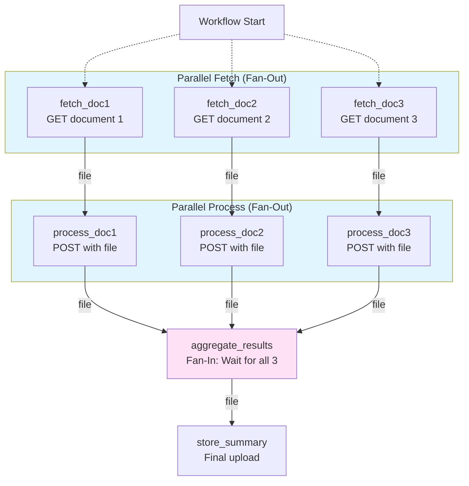

# Example 3: Parallel Execution with File Management - Implementation Plan

**Example Number**: 3
**Name**: Multi-Document Processing Pipeline
**Status**: Not Started
**Priority**: High (Next in Epic 3 implementation sequence)
**Estimated Duration**: 1-2 days (after US-3.3 and US-5.4 complete)
**Dependencies**:
- ✅ Example 1: Sequential Workflows
- ✅ Example 2: Conditional Branching
- 🔲 US-3.3: Parallel Execution (Fan-Out/Fan-In)
- 🔲 US-5.4: Object Storage and File Management

---

## Overview

Example 3 demonstrates **parallel execution** and **file management** through a realistic multi-document processing pipeline. This example validates both US-3.3 and US-5.4 in a single integrated workflow.

### What This Example Demonstrates

**YAML Features**:
- ✅ Parallel activity execution (multiple activities ready simultaneously)
- ✅ Fan-out pattern (one activity → many parallel activities)
- ✅ Fan-in pattern (many activities → one aggregator activity)
- ✅ File outputs (`type: file`)
- ✅ File references (`{{FILE.activity.output}}`)
- ✅ Multiple `depends_on` relationships

**Built-in Activities**:
- ✅ `http_request` with file download (GET)
- ✅ `http_request` with file upload (POST multipart/form-data)
- ✅ File streaming (no full memory load)

**Workflow Pattern**:


---

## Example Workflow Definition

**File**: `examples/03-document-processing.yaml`

```yaml
name: process_documents
description: Fetch multiple documents in parallel, process each, and aggregate results

# Workflow demonstrates:
# - Parallel execution (fan-out/fan-in)
# - File management (download, upload, pass between activities)
# - Multiple depends_on relationships

activities:
  # === PARALLEL FETCH (Fan-Out) ===
  # These three activities have no dependencies and execute in parallel

  fetch_doc1:
    activity: http_request
    parameters:
      method: GET
      url: "{{INPUT.doc1_url}}"
      headers:
        Accept: application/pdf
    outputs:
      - name: document
        type: file  # Downloaded file stored in WorkflowStorage

  fetch_doc2:
    activity: http_request
    parameters:
      method: GET
      url: "{{INPUT.doc2_url}}"
      headers:
        Accept: application/pdf
    outputs:
      - name: document
        type: file

  fetch_doc3:
    activity: http_request
    parameters:
      method: GET
      url: "{{INPUT.doc3_url}}"
      headers:
        Accept: application/pdf
    outputs:
      - name: document
        type: file

  # === PARALLEL PROCESS (Fan-Out) ===
  # Each process activity depends on its corresponding fetch activity
  # These also execute in parallel (independent dependencies)

  process_doc1:
    activity: http_request
    parameters:
      method: POST
      url: "{{INPUT.processing_service_url}}"
      files:
        input_doc: "{{FILE.fetch_doc1.document}}"  # File reference from fetch_doc1
      body:
        operation: extract_text
        language: en
    outputs:
      - name: result
        type: file  # Processed result stored as file
    depends_on:
      - fetch_doc1

  process_doc2:
    activity: http_request
    parameters:
      method: POST
      url: "{{INPUT.processing_service_url}}"
      files:
        input_doc: "{{FILE.fetch_doc2.document}}"
      body:
        operation: extract_text
        language: en
    outputs:
      - name: result
        type: file
    depends_on:
      - fetch_doc2

  process_doc3:
    activity: http_request
    parameters:
      method: POST
      url: "{{INPUT.processing_service_url}}"
      files:
        input_doc: "{{FILE.fetch_doc3.document}}"
      body:
        operation: extract_text
        language: en
    outputs:
      - name: result
        type: file
    depends_on:
      - fetch_doc3

  # === FAN-IN AGGREGATION ===
  # This activity waits for ALL three process activities to complete

  aggregate_results:
    activity: http_request
    parameters:
      method: POST
      url: "{{INPUT.aggregator_url}}"
      files:
        doc1_result: "{{FILE.process_doc1.result}}"
        doc2_result: "{{FILE.process_doc2.result}}"
        doc3_result: "{{FILE.process_doc3.result}}"
      body:
        workflow_id: "{{WORKFLOW.id}}"
        operation: summarize
    outputs:
      - name: summary
        type: file  # Aggregated summary
    depends_on:
      - process_doc1
      - process_doc2
      - process_doc3  # Fan-in: waits for all three

  # === FINAL STORAGE ===
  # Store the final summary

  store_summary:
    activity: http_request
    parameters:
      method: POST
      url: "{{INPUT.storage_webhook_url}}"
      files:
        summary: "{{FILE.aggregate_results.summary}}"
      body:
        workflow_id: "{{WORKFLOW.id}}"
        completed_at: "{{WORKFLOW.completed_at}}"
        document_count: 3
    depends_on:
      - aggregate_results
```

**Workflow Input Example**:
```json
{
  "doc1_url": "https://httpbin.org/base64/Q29udGVudCBmb3IgZG9jdW1lbnQgMQ==",
  "doc2_url": "https://httpbin.org/base64/Q29udGVudCBmb3IgZG9jdW1lbnQgMg==",
  "doc3_url": "https://httpbin.org/base64/Q29udGVudCBmb3IgZG9jdW1lbnQgMw==",
  "processing_service_url": "https://httpbin.org/post",
  "aggregator_url": "https://httpbin.org/post",
  "storage_webhook_url": "https://httpbin.org/post"
}
```

---

## Implementation Tasks

### 1. Create Example Workflow File

**File**: `examples/03-document-processing.yaml`

**Content**: (see above)

**Validation**:
- ✅ YAML parses correctly
- ✅ All activities have valid `depends_on` relationships
- ✅ No circular dependencies
- ✅ All file outputs declared with `type: file`
- ✅ All FILE references are valid

---

### 2. Create Test Mock Services

Since this example needs external services for processing and aggregation, we need to set up mock services for testing.

**Option A: Use httpbin.org** (Simplest for MVP)
- Already used in Examples 1 and 2
- Supports file uploads via POST
- Returns request data for verification
- No local setup required

**Option B: Local Mock Service** (Better for testing)
- Create simple HTTP service in `api/tests/mock_services/`
- Implement document processing endpoint (accepts file, returns processed file)
- Implement aggregation endpoint (accepts multiple files, returns summary)
- More control over responses, better for testing edge cases

**Decision**: Start with httpbin.org for simplicity, add local mocks if needed for specific test scenarios.

---

### 3. Create End-to-End Test

**File**: `api/tests/example_03_e2e_test.rs`

```rust
#[tokio::test]
async fn test_example_03_parallel_document_processing() {
    // Setup
    let test_env = TestEnvironment::new().await;
    test_env.start_services().await;

    // Load workflow from examples/03-document-processing.yaml
    let workflow_yaml = include_str!("../../examples/03-document-processing.yaml");
    let workflow_def: WorkflowDefinition = serde_yaml::from_str(workflow_yaml)
        .expect("Failed to parse workflow YAML");

    // Create test documents (small PDFs or text files)
    let doc1_url = test_env.create_test_document("doc1.txt", b"Content for document 1");
    let doc2_url = test_env.create_test_document("doc2.txt", b"Content for document 2");
    let doc3_url = test_env.create_test_document("doc3.txt", b"Content for document 3");

    // Create workflow input
    let input = json!({
        "doc1_url": doc1_url,
        "doc2_url": doc2_url,
        "doc3_url": doc3_url,
        "processing_service_url": test_env.processing_service_url(),
        "aggregator_url": test_env.aggregator_url(),
        "storage_webhook_url": test_env.storage_webhook_url(),
    });

    // Submit workflow
    let response = test_env.api_client
        .post("/api/v1/workflows")
        .json(&json!({
            "definition": workflow_def,
            "input": input,
        }))
        .send()
        .await
        .expect("Failed to submit workflow");

    assert_eq!(response.status(), 200);
    let workflow_id: Uuid = response.json::<serde_json::Value>().await
        .unwrap()["workflow_id"]
        .as_str()
        .unwrap()
        .parse()
        .unwrap();

    // Wait for workflow completion
    let final_status = test_env.wait_for_workflow_completion(workflow_id, Duration::from_secs(30))
        .await
        .expect("Workflow did not complete");

    assert_eq!(final_status, "completed");

    // Verify execution order and parallelism
    let events = test_env.get_workflow_events(workflow_id).await;

    // Verify parallel fetch
    let fetch_events: Vec<_> = events.iter()
        .filter(|e| e.event_type == "activity-scheduled" &&
                    (e.activity_key == "fetch_doc1" ||
                     e.activity_key == "fetch_doc2" ||
                     e.activity_key == "fetch_doc3"))
        .collect();

    // All three fetch activities should be scheduled nearly simultaneously
    assert_eq!(fetch_events.len(), 3);
    let time_span = fetch_events.last().unwrap().created_at - fetch_events.first().unwrap().created_at;
    assert!(time_span.num_milliseconds() < 100, "Fetch activities not scheduled in parallel");

    // Verify parallel process
    let process_events: Vec<_> = events.iter()
        .filter(|e| e.event_type == "activity-scheduled" &&
                    (e.activity_key == "process_doc1" ||
                     e.activity_key == "process_doc2" ||
                     e.activity_key == "process_doc3"))
        .collect();

    assert_eq!(process_events.len(), 3);

    // Verify fan-in (aggregate waits for all process activities)
    let aggregate_scheduled = events.iter()
        .find(|e| e.event_type == "activity-scheduled" && e.activity_key == "aggregate_results")
        .expect("Aggregate activity not scheduled");

    let process_completions: Vec<_> = events.iter()
        .filter(|e| e.event_type == "activity-completed" &&
                    (e.activity_key == "process_doc1" ||
                     e.activity_key == "process_doc2" ||
                     e.activity_key == "process_doc3"))
        .collect();

    assert_eq!(process_completions.len(), 3);

    // Aggregate should be scheduled AFTER all process activities complete
    for completion in process_completions {
        assert!(aggregate_scheduled.created_at > completion.created_at,
                "Aggregate scheduled before process completion");
    }

    // Verify file handling
    // - Check that files were stored in WorkflowStorage
    // - Check that files were passed between activities correctly

    let storage = test_env.workflow_storage();

    // Verify fetch outputs stored as files
    let fetch1_files = storage.list_files(workflow_id, "fetch_doc1").await.unwrap();
    assert_eq!(fetch1_files.len(), 1);
    assert_eq!(fetch1_files[0].filename, "document");

    // Verify process outputs stored as files
    let process1_files = storage.list_files(workflow_id, "process_doc1").await.unwrap();
    assert_eq!(process1_files.len(), 1);
    assert_eq!(process1_files[0].filename, "result");

    // Verify aggregate output stored as file
    let aggregate_files = storage.list_files(workflow_id, "aggregate_results").await.unwrap();
    assert_eq!(aggregate_files.len(), 1);
    assert_eq!(aggregate_files[0].filename, "summary");

    // Cleanup
    test_env.cleanup().await;
}

#[tokio::test]
async fn test_example_03_verify_no_circular_dependency() {
    let workflow_yaml = include_str!("../../examples/03-document-processing.yaml");
    let workflow_def: WorkflowDefinition = serde_yaml::from_str(workflow_yaml)
        .expect("Failed to parse workflow YAML");

    // Validation should pass (no circular dependencies)
    let result = workflow_def.validate();
    assert!(result.is_ok(), "Workflow validation failed: {:?}", result.err());
}

#[tokio::test]
async fn test_example_03_performance() {
    // This test verifies that parallel execution is actually faster than sequential

    let test_env = TestEnvironment::new().await;
    test_env.start_services().await;

    // Each activity has a 1-second delay
    // Sequential: 3 fetch + 3 process + 1 aggregate + 1 store = 8 seconds
    // Parallel: max(3 fetch) + max(3 process) + 1 aggregate + 1 store = 4 seconds

    let start = Instant::now();

    // Run workflow
    let workflow_id = test_env.submit_workflow("03-document-processing.yaml", input).await;
    test_env.wait_for_workflow_completion(workflow_id, Duration::from_secs(10)).await.unwrap();

    let duration = start.elapsed();

    // With parallel execution, should complete in ~4-5 seconds (with overhead)
    // Without parallel, would take ~8+ seconds
    assert!(duration.as_secs() < 7, "Workflow took too long, parallel execution may not be working");
    assert!(duration.as_secs() >= 3, "Workflow completed too fast, activities may not be executing");
}
```

---

### 4. Update examples/README.md

**File**: `examples/README.md`

Add Example 3 to the table:

```markdown
| Example                           | # | Features Demonstrated                                              | Prerequisites        |
|-----------------------------------|---|--------------------------------------------------------------------|----------------------|
| `01-weather-report.yaml`          | 1 | Sequential workflow, HTTP GET/POST, headers, secrets               | Webhook URL          |
| `01b-weather-report-dynamic.yaml` | 1b| Dynamic templates, workflow input                                  | Webhook URL          |
| `02-user-validation.yaml`         | 2 | Conditional branching, PostgreSQL query, depends_on conditions     | Database, API key    |
| `03-document-processing.yaml`     | 3 | Parallel execution, fan-out/fan-in, file management, file uploads  | HTTP endpoints       |
```

Add description:
```markdown
### Example 3: Multi-Document Processing Pipeline

**File**: `03-document-processing.yaml`

Demonstrates parallel execution and file management by fetching multiple documents concurrently, processing each in parallel, and aggregating results.

**Features**:
- Parallel activity execution (fan-out)
- Fan-in synchronization (wait for all)
- File outputs (`type: file`)
- File references (`{{FILE.activity.output}}`)
- HTTP file download (GET)
- HTTP file upload (POST multipart/form-data)
- Streaming file handling

**Execution Flow**:
1. Fetch 3 documents in parallel (HTTP GET with file output)
2. Process 3 documents in parallel (HTTP POST with file upload)
3. Aggregate results from all 3 (fan-in, waits for all)
4. Store final summary (HTTP POST with file upload)

**Prerequisites**:
- HTTP endpoints for processing and aggregation
- For testing: Use httpbin.org or local mock services
```

---

### 5. Verify Integration with US-3.3 and US-5.4

**Checklist**:

**From US-3.3 (Parallel Execution)**:
- [ ] Multiple activities ready simultaneously (fetch_doc1, fetch_doc2, fetch_doc3)
- [ ] Activities scheduled in batch to queue
- [ ] Workers claim and execute parallel activities concurrently
- [ ] Fan-in activity waits for ALL dependencies (aggregate_results)
- [ ] No circular dependencies detected in validation
- [ ] Workflow execution timing shows parallel benefit

**From US-5.4 (File Management)**:
- [ ] WorkflowStorage interface used for file operations
- [ ] Files uploaded to PostgresStorage after activity completion
- [ ] Files downloaded from PostgresStorage before activity execution
- [ ] FILE template expressions resolve correctly
- [ ] http_request activity downloads files (GET)
- [ ] http_request activity uploads files (POST multipart)
- [ ] Large files handled via streaming
- [ ] Files cleaned up on workflow deletion

---

## Testing Strategy

### Unit Tests
- ✅ YAML parsing and validation (in workflow definition tests)
- ✅ Dependency graph construction (no circular dependencies)
- ✅ FILE reference resolution (in template resolver tests)

### Integration Tests
- ✅ Parallel scheduling (orchestrator tests)
- ✅ File upload/download (storage tests)
- ✅ http_request with files (activity tests)

### End-to-End Tests
- ✅ Complete workflow execution
- ✅ Parallel execution timing verification
- ✅ Fan-in synchronization
- ✅ File handling through workflow
- ✅ File cleanup on workflow deletion

### Performance Tests
- ✅ Verify parallel execution is faster than sequential
- ✅ Large file handling (100MB+ files)
- ✅ Multiple concurrent workflows

---

## Success Criteria

- ✅ Example 3 YAML file created and validates correctly
- ✅ End-to-end test passes
- ✅ Parallel execution demonstrated (timing measurements)
- ✅ Fan-in correctly waits for all dependencies
- ✅ Files uploaded and downloaded correctly
- ✅ FILE references resolve correctly in templates
- ✅ http_request supports file download and upload
- ✅ Large files handled efficiently (streaming)
- ✅ examples/README.md updated
- ✅ No circular dependency errors
- ✅ All integration points with US-3.3 and US-5.4 verified

---

## Documentation Updates

### Files to Update

**examples/README.md**:
- Add Example 3 to table
- Add detailed description
- Add execution flow diagram

**docs/architecture.md**:
- Update "Completed Examples" section
- Add parallel execution section to orchestrator documentation
- Add file management section to storage documentation

**docs/implementation/mvp-workflows-implementation-plan.md**:
- Update Example 3 status to "Complete"
- Add "Files Modified" section
- Add "Lessons Learned" section

---

## Files to Create/Modify

### New Files
- `examples/03-document-processing.yaml` - Example workflow definition
- `api/tests/example_03_e2e_test.rs` - End-to-end test

### Modified Files
- `examples/README.md` - Add Example 3 documentation
- `docs/architecture.md` - Update with parallel execution and file management
- `docs/implementation/mvp-workflows-implementation-plan.md` - Mark Example 3 complete

---

## Dependencies

**Must be complete before starting**:
- 🔲 US-3.3: Parallel Execution (Fan-Out/Fan-In)
- 🔲 US-5.4: Object Storage and File Management

**Builds on**:
- ✅ Example 1: Sequential Workflows
- ✅ Example 2: Conditional Branching

**Unblocks**:
- 🔲 Example 4: LLM Activity with Cost Tracking
- 🔲 Example 5: Multi-model LLM Fallback

---

## Implementation Phases

### Phase 1: Workflow Definition (Day 1, Morning)
1. Create `examples/03-document-processing.yaml`
2. Validate YAML parses correctly
3. Test dependency graph construction

### Phase 2: End-to-End Test (Day 1, Afternoon)
1. Create `api/tests/example_03_e2e_test.rs`
2. Set up test environment
3. Implement test cases
4. Run tests and fix issues

### Phase 3: Verification and Documentation (Day 2)
1. Verify parallel execution timing
2. Verify file handling
3. Performance testing
4. Update documentation
5. Code review

---

## Risks and Mitigations

| Risk | Impact | Mitigation |
|------|--------|------------|
| US-3.3 or US-5.4 not fully complete | High | Verify all acceptance criteria before starting |
| Mock services don't support file upload | Medium | Use httpbin.org or create simple local mock |
| Parallel execution timing non-deterministic | Low | Use ranges in assertions, not exact values |
| Large file tests slow down CI | Medium | Use smaller files for most tests, large files only in perf tests |

---

## Open Questions

1. **Should we use httpbin.org or local mock services?**
   - Decision: Start with httpbin.org, add local mocks if needed

2. **What file sizes should we test?**
   - Decision: Small files (< 1MB) for most tests, large files (100MB+) for performance tests

3. **Should Example 3 be runnable by users?**
   - Decision: Yes, but requires setting up endpoints or using httpbin.org

---

## Completion Checklist

- [ ] US-3.3 implementation complete
- [ ] US-5.4 implementation complete
- [ ] Example 3 YAML file created
- [ ] YAML validates and parses correctly
- [ ] End-to-end test created
- [ ] All test cases pass
- [ ] Parallel execution timing verified
- [ ] Fan-in synchronization verified
- [ ] File upload/download verified
- [ ] FILE references resolve correctly
- [ ] examples/README.md updated
- [ ] docs/architecture.md updated
- [ ] docs/implementation/mvp-workflows-implementation-plan.md updated
- [ ] Code review complete
- [ ] Ready to move to Example 4

---

## Next Steps (After Example 3)

Once Example 3 is complete, the foundation for complex workflows is in place:
- ✅ Sequential execution
- ✅ Conditional branching
- ✅ Parallel execution
- ✅ File management

This unblocks:
- Example 4: LLM with retry/budget (builds on sequential + settings)
- Example 5: Multi-model LLM (builds on conditional branching)
- Example 6: Semantic caching (builds on file management)
- Example 7: Iterative workflows (builds on parallel + conditional)
