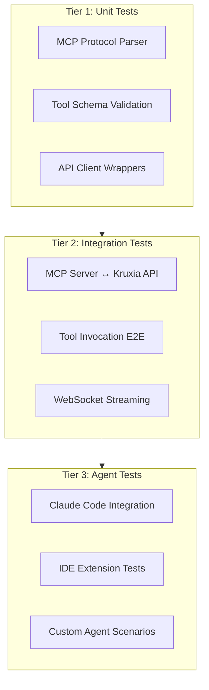
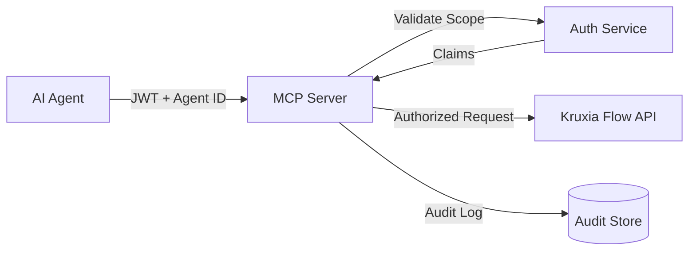
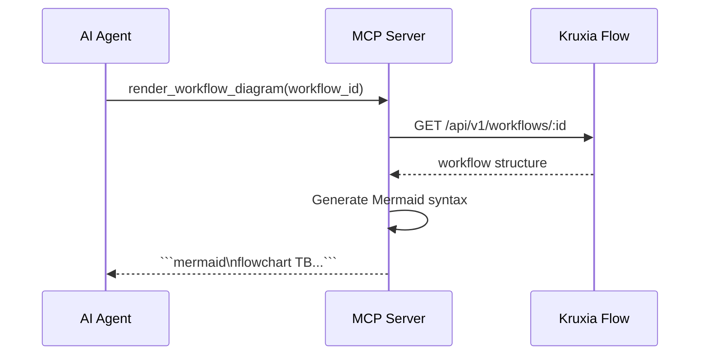
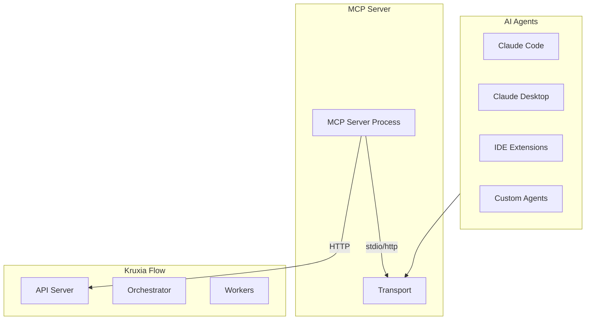
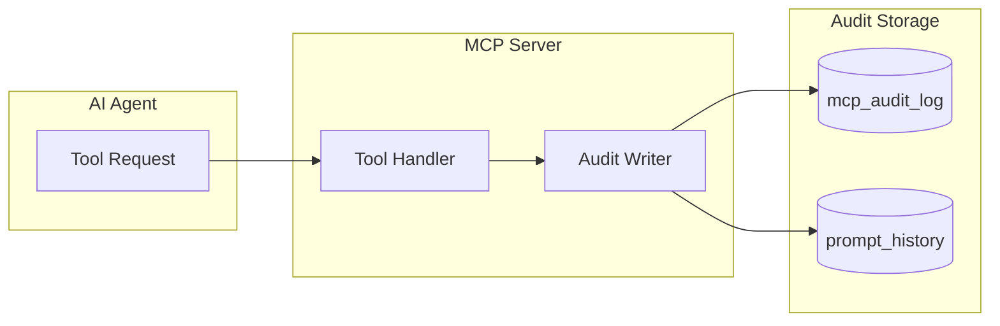
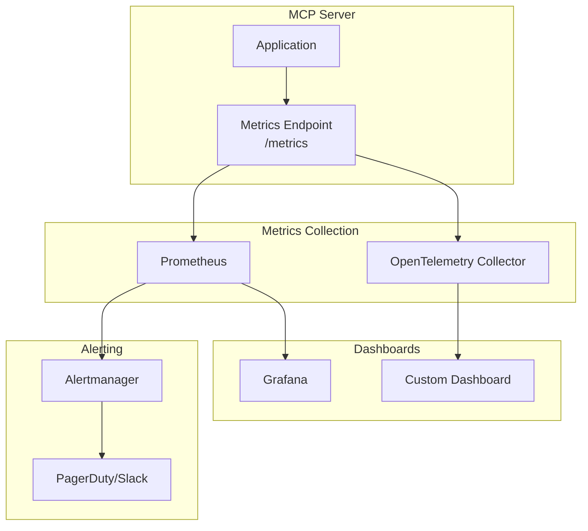

# Product Requirements Document: Kruxia Flow MCP Server

**Epic**: MCP Server for AI Agent Integration
**Status**: 🔮 Planned
**Priority**: P1 (High)
**Author**: AI Architecture Team
**Last Updated**: 2026-01-30

---

## Executive Summary

This PRD defines the requirements for building an MCP (Model Context Protocol) server that enables AI agents (Claude, GPT-based assistants, custom agents) to natively interact with Kruxia Flow. The MCP server exposes workflow orchestration capabilities through a standardized protocol, allowing AI agents to build, execute, monitor, and report on workflows as part of their reasoning and task execution.

---

## 1. Strategic Value

### 1.1 Market Opportunity

The AI agent market is projected to grow from $2.3B (2024) to $28-48B by 2028-2030 at 44-57% CAGR. Key market dynamics:

- **79% of enterprises** already use AI agents
- **88% of enterprises** plan to increase AI agent budgets
- **45% of developers** never use AI frameworks in production due to reliability concerns
- **40% of GenAI projects** may fail by 2027 due to cost/complexity (Gartner)

### 1.2 Competitive Positioning

| Platform       | MCP Support | Status                         |
|----------------|-------------|--------------------------------|
| Dagster        | Yes         | MCP Server (Aug 2025)          |
| Orkes/Conductor| Yes         | MCP Support (June 2025)        |
| Temporal       | No          | OpenAI Agents SDK only         |
| LangChain      | No          | Custom integrations            |
| **Kruxia Flow**| **Planned** | Native MCP with cost controls  |

### 1.3 Unique Value Proposition

**"The only MCP-enabled workflow orchestration platform with built-in AI cost controls."**

1. **Native MCP Protocol**: First-class support for Claude Code, IDE extensions, and custom AI agents
2. **Cost-Aware Orchestration**: AI agents can query budgets, costs, and make budget-aware decisions
3. **Visual Workflow Generation**: Agents can generate and render Mermaid diagrams of workflows
4. **Human-in-the-Loop Integration**: Agents can create workflows that pause for human approval
5. **PostgreSQL-Backed State**: Full SQL queryability of agent-created workflows

---

## 2. User Personas

### 2.1 Primary: AI Agent Developer

**Profile**: Software engineer building AI-powered applications using Claude, GPT, or custom agents.

**Pain Points**:
- Manually coding workflow orchestration logic
- No visibility into what workflows their agents create
- Runaway costs from uncontrolled agent execution
- Difficulty debugging agent-created workflows

**Goals**:
- Enable agents to autonomously create and manage workflows
- Maintain visibility and control over agent actions
- Predictable costs for agent-driven automation

### 2.2 Secondary: AI Agent (The Agent Itself)

**Profile**: Claude Code, Claude Desktop, IDE-integrated assistants, or custom AI agents.

**Capabilities Needed**:
- Discover available workflow activities
- Build workflows from natural language requirements
- Submit and monitor workflow execution
- Report on workflow status and results
- Make budget-aware decisions

### 2.3 Tertiary: Platform Engineer

**Profile**: DevOps/Platform engineer responsible for AI infrastructure.

**Pain Points**:
- No standardized way for AI tools to interact with workflow systems
- Security concerns with agent-to-system integrations
- Auditability of agent actions

**Goals**:
- Secure, auditable AI-to-workflow integration
- Centralized control over agent permissions
- Standardized protocol (MCP) for tool consistency

---

## 3. High-Level Goals

### 3.1 Functional Goals

| ID   | Goal                                      | Success Criteria                                        |
|------|-------------------------------------------|--------------------------------------------------------|
| G-01 | Workflow Discovery                        | Agents can list workflow definitions and activities     |
| G-02 | Workflow Creation                         | Agents can build workflows from YAML/JSON              |
| G-03 | Workflow Execution                        | Agents can submit and monitor workflow runs            |
| G-04 | Observability                             | Agents can query workflow states and activity results   |
| G-05 | Cost Awareness                            | Agents can query costs and make budget-aware decisions |
| G-06 | Visual Representation                     | Agents can generate Mermaid diagrams of workflows      |
| G-07 | Human-in-the-Loop                         | Agents can create workflows that await human signals    |

### 3.2 Non-Functional Goals

| ID   | Goal                                      | Target                                                 |
|------|-------------------------------------------|--------------------------------------------------------|
| N-01 | Latency                                   | <100ms for tool invocations                            |
| N-02 | Availability                              | 99.9% uptime (same as core API)                        |
| N-03 | Security                                  | JWT-based auth, rate limiting, audit logging           |
| N-04 | Compatibility                             | MCP 1.0 specification compliant                        |
| N-05 | Developer Experience                      | Works with Claude Code, VS Code extension, JetBrains   |

---

## 4. Test Plan Viability Assessment

### 4.1 Testing Strategy Overview

The test plan validates MCP server functionality through three tiers:



### 4.2 Test Scenarios Viability

| Scenario Category        | Feasibility | Automation | Notes                                           |
|--------------------------|-------------|------------|-------------------------------------------------|
| Protocol Compliance      | High        | Full       | MCP spec has clear test vectors                 |
| Tool Schema Validation   | High        | Full       | JSON Schema validation is deterministic         |
| API Integration          | High        | Full       | Existing Kruxia API test infrastructure         |
| Claude Code Integration  | Medium      | Partial    | Requires MCP Inspector + manual verification    |
| IDE Extension            | Medium      | Partial    | VS Code Extension Test Runner available         |
| Natural Language → YAML  | Low         | Limited    | LLM output is non-deterministic                 |
| Cost Accuracy            | High        | Full       | Deterministic cost calculation                  |

### 4.3 Test Data Requirements

1. **Workflow Templates**: 10+ pre-built workflow examples covering all patterns
2. **Mock LLM Responses**: Recorded responses for deterministic testing
3. **Cost Fixtures**: Known-cost scenarios for budget testing
4. **Auth Fixtures**: Test JWT tokens with various permission levels

---

## 5. Risk Assessment

### 5.1 Technical Risks

| Risk                                    | Probability | Impact | Mitigation                                       |
|-----------------------------------------|-------------|--------|--------------------------------------------------|
| MCP spec changes before release         | Medium      | High   | Pin to MCP 1.0, monitor spec evolution           |
| Agent generates invalid workflows       | High        | Medium | Schema validation, helpful error messages        |
| Cost estimation inaccuracy              | Medium      | High   | Conservative estimates, budget guardrails        |
| WebSocket connection instability        | Low         | Medium | Reconnection logic, polling fallback             |
| Concurrent agent race conditions        | Medium      | Medium | Idempotent operations, conflict detection        |

### 5.2 Business Risks

| Risk                                    | Probability | Impact | Mitigation                                       |
|-----------------------------------------|-------------|--------|--------------------------------------------------|
| Limited MCP adoption outside Anthropic  | Medium      | Medium | Also support OpenAI function calling             |
| Competitors ship MCP support first      | Medium      | High   | Accelerate timeline, focus on cost controls      |
| Agent abuse/runaway costs               | High        | High   | Rate limiting, per-agent budgets, kill switches  |
| Security vulnerabilities via agents     | Medium      | Critical| Principle of least privilege, audit logging     |

### 5.3 Operational Risks

| Risk                                    | Probability | Impact | Mitigation                                       |
|-----------------------------------------|-------------|--------|--------------------------------------------------|
| Increased support burden from agents    | Medium      | Medium | Clear error messages, self-service debugging     |
| Audit/compliance concerns               | Low         | High   | Full action logging, agent identity tracking     |
| Resource exhaustion from agent activity | Medium      | High   | Rate limiting, queue depth limits                |

---

## 6. Other Considerations

### 6.1 Security Model



**Security Requirements**:
- Each agent instance has unique identifier for audit trails
- JWT scopes limit agent capabilities (read-only, execute, admin)
- Rate limiting per agent identity
- All tool invocations logged with agent context
- Sensitive data (secrets, credentials) never exposed to agents

### 6.2 Cost Control Integration

The MCP server provides unique cost-awareness capabilities:

| MCP Tool                    | Cost Feature                                      |
|-----------------------------|---------------------------------------------------|
| `get_workflow_cost`         | Real-time cost tracking for running workflows     |
| `estimate_workflow_cost`    | Pre-execution cost estimation                     |
| `set_workflow_budget`       | Agent can set budget limits on workflows it creates|
| `get_budget_remaining`      | Agent can check remaining budget before actions   |
| `list_cost_analytics`       | Historical cost analysis for decision making      |

### 6.3 Mermaid Diagram Generation

Agents can request visual representations of workflows:



This enables agents to:
- Visualize workflows they create before submission
- Include diagrams in reports to users
- Debug workflow structure visually

### 6.4 Human-in-the-Loop Support

MCP tools support creating workflows that pause for human approval:

1. **Create with Signal Points**: Agent builds workflow with `wait_for_signal` activities
2. **Monitor Waiting State**: Agent detects when workflow is waiting
3. **Notify User**: Agent informs user that approval is needed
4. **Resume on Signal**: After human sends signal, workflow continues

### 6.5 Multi-Language Implementation Strategy

The MCP server can be implemented in:

| Language | Pros                                    | Cons                                   |
|----------|----------------------------------------|----------------------------------------|
| Python   | FastMCP library, rapid development     | Additional runtime dependency          |
| Rust     | Performance, single binary consistency | More development effort                |

**Recommendation**: Start with Python (FastMCP) for rapid iteration, with Rust implementation as post-MVP optimization.

### 6.6 Deployment Topology



**Deployment Options**:
1. **Sidecar**: MCP server as separate process alongside Kruxia Flow
2. **Integrated**: MCP server embedded in Kruxia Flow binary (Rust path)
3. **Standalone**: Independent MCP server deployable anywhere

---

## 7. Success Metrics

### 7.1 Adoption Metrics

| Metric                              | Target (Month 3) | Target (Month 6) |
|-------------------------------------|------------------|------------------|
| Unique agents using MCP server      | 100              | 500              |
| Workflows created via MCP           | 1,000            | 10,000           |
| MCP tool invocations/day            | 10,000           | 100,000          |

### 7.2 Quality Metrics

| Metric                              | Target                                    |
|-------------------------------------|-------------------------------------------|
| Tool invocation success rate        | >99%                                      |
| Average tool latency                | <100ms                                    |
| Invalid workflow rejection rate     | 100% (no invalid workflows accepted)      |
| Security incidents                  | 0                                         |

### 7.3 Business Metrics

| Metric                              | Target                                    |
|-------------------------------------|-------------------------------------------|
| Cost per MCP invocation             | <$0.001                                   |
| Customer satisfaction (NPS)         | >40                                       |
| Support tickets related to MCP      | <5% of total                              |

---

## 8. Out of Scope (Post-MVP)

1. **Multi-tenant agent isolation**: Single-tenant deployment initially
2. **Agent marketplace**: Sharing agent-created workflows
3. **Visual workflow builder integration**: Agents creating via UI APIs
4. **Cross-instance federation**: Agents spanning multiple Kruxia Flow instances
5. **Agent-to-agent workflow handoff**: Direct agent communication

---

## 9. Dependencies

| Dependency                          | Status    | Owner               |
|-------------------------------------|-----------|---------------------|
| Kruxia Flow API v1                  | Complete  | Core Team           |
| JWT Authentication                  | Complete  | Core Team           |
| Cost Tracking APIs                  | Complete  | Core Team           |
| Human-in-the-Loop (wait_for_signal) | Complete  | Core Team           |
| MCP 1.0 Specification               | Stable    | Anthropic           |
| FastMCP Library (Python)            | Stable    | Community           |
| MCP Rust SDK                        | Beta      | Community           |

---

## 10. Audit & Compliance Requirements

### 10.1 Agent Action Logging

All MCP tool invocations MUST be logged to an immutable audit trail:



**Required Audit Fields**:

| Field                    | Description                                           | Required |
|--------------------------|-------------------------------------------------------|----------|
| `timestamp`              | When the action occurred (UTC)                        | Yes      |
| `agent_id`               | Unique identifier for the agent instance              | Yes      |
| `agent_type`             | Type of agent (claude_code, ide_extension, custom)    | Yes      |
| `session_id`             | Conversation/session context identifier               | Yes      |
| `tool_name`              | MCP tool that was invoked                             | Yes      |
| `tool_arguments`         | Full arguments passed to the tool                     | Yes      |
| `result_status`          | Success, failure, or error                            | Yes      |
| `duration_ms`            | How long the tool invocation took                     | Yes      |
| `error_message`          | Error details if failed                               | No       |
| `workflow_id`            | Associated workflow ID if applicable                  | No       |
| `cost_usd`               | Cost incurred by this action                          | No       |

### 10.2 Workflow Provenance Tracking

For agent-created workflows, maintain complete provenance:

| Data Point                       | Purpose                                               |
|----------------------------------|-------------------------------------------------------|
| Natural language prompt          | Original user request that triggered workflow creation |
| Generated workflow YAML          | The exact YAML the agent produced                     |
| Validation results               | Schema validation outcome and warnings                |
| Modification history             | Any edits made before submission                      |
| Human approval status            | Whether a human reviewed before execution             |
| Execution outcome                | Final workflow status and outputs                     |

**Provenance Database Schema**:

```sql
CREATE TABLE mcp_audit_log (
    id UUID PRIMARY KEY DEFAULT gen_random_uuid(),
    timestamp TIMESTAMPTZ NOT NULL DEFAULT NOW(),

    -- Agent identification
    agent_id TEXT NOT NULL,
    agent_type TEXT NOT NULL,
    session_id UUID,

    -- Request context
    tool_name TEXT NOT NULL,
    tool_arguments JSONB NOT NULL,

    -- For workflow creation
    natural_language_prompt TEXT,
    generated_workflow_yaml TEXT,
    workflow_definition_name TEXT,
    workflow_id UUID,

    -- Validation
    validation_passed BOOLEAN,
    validation_warnings JSONB,

    -- Results
    result_status TEXT NOT NULL,
    error_message TEXT,
    duration_ms INTEGER,

    -- Cost
    estimated_cost_usd DECIMAL(10,6),
    actual_cost_usd DECIMAL(10,6),

    -- Metadata
    metadata JSONB
);

CREATE INDEX idx_mcp_audit_agent ON mcp_audit_log(agent_id, timestamp DESC);
CREATE INDEX idx_mcp_audit_session ON mcp_audit_log(session_id, timestamp DESC);
CREATE INDEX idx_mcp_audit_workflow ON mcp_audit_log(workflow_id);
CREATE INDEX idx_mcp_audit_tool ON mcp_audit_log(tool_name, timestamp DESC);
```

### 10.3 Compliance Considerations

| Regulation | Requirement                                           | Implementation                        |
|------------|-------------------------------------------------------|---------------------------------------|
| GDPR       | Right to deletion of personal data                    | Agent session data deletable on request|
| SOC 2      | Immutable audit trail of all actions                  | Append-only audit log with checksums  |
| HIPAA      | Access controls and audit logging                     | RBAC + comprehensive logging          |
| Enterprise | Role-based access to audit data                       | Separate audit viewer permissions     |

### 10.4 Retention Policy

| Data Type                | Retention Period | Rationale                             |
|--------------------------|------------------|---------------------------------------|
| Tool invocation logs     | 90 days          | Debugging and short-term analysis     |
| Workflow provenance      | 1 year           | Compliance and audit requirements     |
| Cost tracking data       | 2 years          | Financial reporting                   |
| Error logs               | 30 days          | Operational debugging                 |

---

## 11. Observability & Monitoring

### 11.1 Metrics Requirements

The MCP server MUST expose metrics for operational monitoring:



**Required Metrics**:

| Metric Name                        | Type      | Labels                               | Description                           |
|------------------------------------|-----------|--------------------------------------|---------------------------------------|
| `mcp_tool_calls_total`             | Counter   | tool_name, status, agent_type        | Total tool invocations                |
| `mcp_tool_duration_seconds`        | Histogram | tool_name, agent_type                | Tool invocation latency               |
| `mcp_api_requests_total`           | Counter   | endpoint, method, status             | Kruxia Flow API calls                 |
| `mcp_api_duration_seconds`         | Histogram | endpoint, method                     | API call latency                      |
| `mcp_workflows_created_total`      | Counter   | agent_type, validation_status        | Workflows created via MCP             |
| `mcp_workflows_cost_usd`           | Gauge     | workflow_definition                  | Cost of workflows                     |
| `mcp_active_sessions`              | Gauge     | agent_type                           | Currently active agent sessions       |
| `mcp_validation_errors_total`      | Counter   | error_type                           | Workflow validation failures          |
| `mcp_budget_exceeded_total`        | Counter   | workflow_definition                  | Budget limit exceeded events          |

### 11.2 Dashboard Requirements

**Dashboard 1: MCP Server Overview**

| Panel                      | Visualization | Data Source                          |
|----------------------------|---------------|--------------------------------------|
| Active Agents              | Stat          | `mcp_active_sessions`                |
| Tool Calls (24h)           | Stat          | `sum(mcp_tool_calls_total)`          |
| Error Rate                 | Gauge         | `mcp_tool_calls{status="error"} / total` |
| Workflows Created (24h)    | Stat          | `sum(mcp_workflows_created_total)`   |
| Total Cost (24h)           | Stat          | `sum(mcp_workflows_cost_usd)`        |
| Tool Latency p95           | Time series   | `histogram_quantile(0.95, ...)`      |

**Dashboard 2: Agent Activity**

| Panel                      | Visualization | Data Source                          |
|----------------------------|---------------|--------------------------------------|
| Tool Usage by Agent Type   | Pie chart     | `mcp_tool_calls_total` by agent_type |
| Top Agents by Activity     | Table         | `topk(10, mcp_tool_calls_total)`     |
| Session Duration           | Histogram     | Custom session tracking              |
| Workflows per Agent        | Bar chart     | `mcp_workflows_created_total`        |

**Dashboard 3: Cost & Budget**

| Panel                      | Visualization | Data Source                          |
|----------------------------|---------------|--------------------------------------|
| Cost Trend (7d)            | Time series   | `mcp_workflows_cost_usd`             |
| Cost by Workflow Type      | Pie chart     | Grouped by workflow_definition       |
| Budget Utilization         | Gauge         | Actual vs budget limits              |
| Budget Exceeded Events     | Table         | `mcp_budget_exceeded_total`          |

### 11.3 Alerting Rules

| Alert Name                         | Condition                                    | Severity | Action                    |
|------------------------------------|----------------------------------------------|----------|---------------------------|
| MCPHighErrorRate                   | Error rate > 5% for 5 minutes                | Warning  | Notify on-call            |
| MCPToolLatencyHigh                 | p95 latency > 500ms for 10 minutes           | Warning  | Investigate performance   |
| MCPBudgetExceeded                  | Any budget exceeded event                    | Info     | Notify workflow owner     |
| MCPAgentAbuseDetected              | Single agent > 1000 calls/minute             | Critical | Rate limit + alert        |
| MCPValidationErrorSpike            | Validation errors > 10x baseline             | Warning  | Check for bad actor       |
| MCPServerDown                      | No heartbeat for 1 minute                    | Critical | Page on-call              |

### 11.4 Distributed Tracing

Implement OpenTelemetry tracing for request flow visibility:

```
Agent Request
  └── MCP Tool Handler (span)
      ├── Validate Arguments (span)
      ├── Kruxia Flow API Call (span)
      │   ├── HTTP Request (span)
      │   └── Response Processing (span)
      ├── Audit Log Write (span)
      └── Response Formatting (span)
```

**Trace Context Propagation**:
- Pass `trace_id` from agent to MCP server
- Propagate to Kruxia Flow API calls
- Include in audit log for correlation

---

## 12. Approval

| Role                    | Name                | Date       | Status    |
|-------------------------|---------------------|------------|-----------|
| Product Manager         |                     |            | Pending   |
| Engineering Lead        |                     |            | Pending   |
| Security Review         |                     |            | Pending   |
| Architecture Review     |                     |            | Pending   |

---

## Appendix A: MCP Tool Catalog (Proposed)

| Tool Name                    | Category      | Description                                        |
|------------------------------|---------------|----------------------------------------------------|
| `list_workflow_definitions`  | Discovery     | List available workflow definitions                |
| `get_workflow_definition`    | Discovery     | Get details of a specific workflow definition      |
| `list_activities`            | Discovery     | List available activity types                      |
| `validate_workflow`          | Creation      | Validate workflow YAML without submitting          |
| `submit_workflow`            | Execution     | Submit a workflow for execution                    |
| `get_workflow_status`        | Observability | Get current status of a workflow                   |
| `list_workflows`             | Observability | List workflows with filters                        |
| `get_activity_output`        | Observability | Get output from a specific activity                |
| `get_workflow_cost`          | Cost          | Get current/final cost of a workflow               |
| `estimate_workflow_cost`     | Cost          | Estimate cost before execution                     |
| `render_workflow_diagram`    | Visualization | Generate Mermaid diagram of workflow               |
| `send_workflow_signal`       | Control       | Send signal to waiting workflow                    |
| `cancel_workflow`            | Control       | Cancel a running workflow                          |

---

## Appendix B: References

1. [MCP Specification](https://modelcontextprotocol.io/specification)
2. [FastMCP Documentation](https://github.com/jlowin/fastmcp)
3. [Kruxia Flow API Reference](../api-reference.md)
4. [Kruxia Flow Architecture](../architecture.md)
5. [Workflow Market Landscape Analysis](../../notes/2025-10-05-workflow-market-landscape.md)
