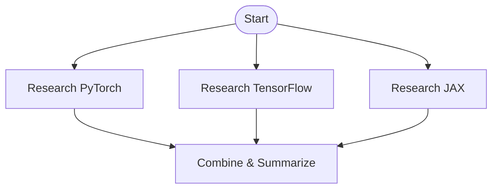

# Kruxia Flow MCP User Guide

**Status:** 📖 Documentation
**Last Updated:** 2026-01-30

---

## Overview

This guide explains how AI agents (like Claude Code, Claude Desktop, and custom agents) use the Kruxia Flow MCP server to orchestrate workflows. It covers when to use workflows, common patterns, and real-world examples.

---

## Table of Contents

- [MCP Server Capabilities](#mcp-server-capabilities)
- [When Should an Agent Use Kruxia Flow?](#when-should-an-agent-use-kruxia-flow)
- [Common Use Case Patterns](#common-use-case-patterns)
- [Agent Decision Tree](#agent-decision-tree)
- [Real-World Examples](#real-world-examples)
- [Q&A](#qa)

---

## MCP Server Capabilities

When an AI agent connects to the Kruxia Flow MCP server, it receives information about **14 available tools** organized into 5 categories. Here's what the agent sees:

### 🔍 Discovery Tools (4 tools)

#### `get_workflow_authoring_guide`
```
Get comprehensive guide for creating workflow definitions.

Returns detailed documentation on workflow YAML structure, template expressions,
dependency patterns, and settings configuration. Use this when you need to CREATE
a new workflow definition from scratch.

This guide teaches:
- Complete YAML structure with all required and optional fields
- Template expression syntax ({{INPUT}}, {{activity.output}}, {{SECRET}}, {{WORKFLOW}})
- Dependency patterns (sequential, parallel, conditional, fan-in/fan-out)
- Settings configuration (retries, budgets, timeouts)
- Complete working examples for common patterns
- Best practices for security, error handling, and performance

Returns: Comprehensive workflow authoring documentation including:
- yaml_structure: Field definitions and examples
- template_expressions: Dynamic parameter value syntax
- dependency_patterns: Execution order control
- settings_configuration: Retry, budget, timeout options
- complete_examples: Working YAML for common patterns
- best_practices: Security, error handling, design guidance

When to Use:
Call this tool when you need to create a workflow. It provides everything
needed to author valid workflow YAML with all features.
```

#### `list_workflow_definitions`
```
List available workflow definitions.

Retrieves all workflow definitions that can be submitted for execution.
Use this to discover what workflows are available before submitting them.

Parameters:
- namespace (optional): Filter by namespace (e.g., "production", "staging")
- limit (optional, default: 20): Maximum number of definitions to return
- offset (optional, default: 0): Number of definitions to skip for pagination

Returns: List of workflow definitions with names, descriptions, and metadata
```

#### `get_workflow_definition`
```
Get detailed information about a specific workflow definition.

Retrieves the complete definition including all activities, dependencies,
parameters, and settings. Use this to understand how a workflow is
structured before submitting it.

Parameters:
- name (required): Workflow definition name (e.g., "weather_report")

Returns: Complete workflow structure including all activities and dependencies
```

#### `list_activities`
```
List available activity types for building workflows.

Returns all built-in activity types that can be used in workflow definitions.
Each activity has specific parameters and capabilities. Use this to understand
what building blocks are available when creating workflows.

Returns: List of 7 activity types:
- http_request: Make HTTP/REST API calls
- llm_prompt: Call LLM APIs (Claude, OpenAI, Google) with budget controls
- postgres_query: Execute PostgreSQL queries
- postgres_transaction: Execute multiple queries atomically
- embedding: Generate embeddings for RAG/semantic search
- email_send: Send emails via SMTP
- script: Execute Python scripts with pre-installed packages
```

---

### ▶️ Execution Tools (3 tools)

#### `validate_workflow`
```
Validate a workflow definition without submitting it for execution.

Checks the workflow YAML for syntax errors, invalid activity types,
circular dependencies, and other structural issues. Use this before
submitting to catch errors early.

Parameters:
- workflow_yaml (required): Complete workflow definition in YAML format

Returns:
- valid: Boolean indicating if workflow is valid
- errors: List of validation errors (if any)
- warnings: List of warnings (if any)
- activities: Count of activities in the workflow
- dependencies: Activity dependency map
```

#### `submit_workflow`
```
Submit a workflow for execution.

Submits a workflow definition for immediate execution. The workflow
will be validated first, then queued for execution by the orchestrator.
Activities will be scheduled based on their dependencies.

Parameters:
- definition_name (required): Name of the workflow definition to execute
- input (required): Input parameters for the workflow
- budget_limit_usd (optional): Budget limit in USD (workflow aborts if exceeded)

Returns:
- workflow_id: Unique identifier for tracking this execution
- status: Initial status (usually "pending" or "running")
- definition_name: Name of the workflow definition
- submitted_at: Timestamp when workflow was submitted
```

#### `cancel_workflow`
```
Cancel a running workflow.

Stops a workflow that is currently executing. All running activities
will be allowed to complete, but no new activities will be started.
The workflow status will be set to "canceled".

Parameters:
- workflow_id (required): Unique identifier of the workflow to cancel
- reason (optional): Reason for cancellation (for audit logging)

Returns: Confirmation with workflow_id, status, and message
```

---

### 📊 Observability Tools (5 tools)

#### `get_workflow_status`
```
Get the current status of a workflow execution.

Retrieves detailed status information for a specific workflow execution,
including overall status, timestamps, and optionally all activity details.

Parameters:
- workflow_id (required): Unique identifier of the workflow execution
- include_activities (optional, default: false): If true, include status for all activities

Returns:
- workflow_id, status, definition_name
- started_at, completed_at timestamps
- activities: List of activity details (if requested)
  - Each activity includes: key, activity_name, status, timestamps, retry_count
```

#### `list_workflows`
```
List workflow executions with optional status filtering.

Retrieves a paginated list of workflow executions. Use status filter
to find workflows in specific states (e.g., all running workflows).

Parameters:
- status (optional): Filter by status (pending, running, completed, failed, canceled)
- limit (optional, default: 20): Maximum number of workflows to return
- offset (optional, default: 0): Number of workflows to skip for pagination

Returns: List of workflow summaries with pagination metadata
```

#### `get_activity_output`
```
Get the output of a specific activity in a workflow.

Retrieves the results produced by an activity after it completes.
Each activity can produce multiple named outputs that can be referenced
by downstream activities.

Parameters:
- workflow_id (required): Unique identifier of the workflow execution
- activity_key (required): Key of the activity (as defined in workflow)

Returns: Activity output (format varies by activity type):
- http_request: {response, status_code, headers}
- llm_prompt: {result, cost_usd, provider, model, usage}
- postgres_query: {rows, row_count}
- embedding: {embeddings, dimensions, cost_usd}
```

#### `get_workflow_cost`
```
Get the cost breakdown for a workflow execution.

Retrieves detailed cost information including per-activity costs,
total cost, and budget utilization. Costs are tracked for LLM API calls,
embedding generation, and other metered services.

Parameters:
- workflow_id (required): Unique identifier of the workflow execution

Returns:
- total_cost_usd: Total cost across all activities
- budget_limit_usd: Budget limit (if set)
- budget_used_percent: Percentage of budget consumed
- activities: Per-activity cost breakdown with provider, model, tokens
- providers: Cost breakdown by provider (anthropic, openai, etc.)
```

#### `estimate_workflow_cost`
```
Estimate the cost of running a workflow before execution.

Provides a cost estimate based on the workflow definition and sample input.
Useful for budget planning and avoiding unexpected costs. Estimates are based
on average token counts and activity complexity.

Parameters:
- definition_name (required): Name of the workflow definition
- input_sample (required): Sample input data to base estimate on

Returns:
- estimated_cost_usd: Estimated total cost
- cost_range_usd: Min/max cost range
- activities: Per-activity cost estimates
- assumptions: List of assumptions made in estimation

Limitations:
- Estimates assume typical token counts (may vary with actual data)
- Does not account for retries or fallback models
- External API costs (if any) are not included
```

---

### 📈 Visualization Tools (2 tools)

#### `render_workflow_diagram`
```
Generate a Mermaid flowchart diagram for a workflow.

Creates a visual representation of a workflow showing activities
and their dependencies. Can generate diagrams from either a workflow
definition (structure only) or an execution (with status colors).

Parameters:
- definition_name (optional): Name of workflow definition to visualize
- workflow_id (optional): ID of workflow execution to visualize (with status)
- include_status (optional, default: true): If true and workflow_id provided, color nodes by status

Returns:
- diagram: Mermaid flowchart syntax
- format: "mermaid"
- type: "flowchart"

Node Colors (when include_status=True):
- Green: Completed activities
- Gold: Running activities
- Red: Failed activities
- Gray: Skipped activities
- Sky Blue: Pending activities

Note: Claude Code and Claude Desktop will automatically render the
Mermaid diagram inline when you display the diagram text.
```

#### `render_cost_diagram`
```
Generate a Mermaid diagram showing cost breakdown by activity.

Creates a visual representation of how costs are distributed across
activities in a workflow execution. Useful for identifying expensive
operations and optimizing costs.

Parameters:
- workflow_id (required): Unique identifier of the workflow execution

Returns:
- diagram: Mermaid graph syntax
- format: "mermaid"
- type: "graph"
- total_cost_usd: Total workflow cost
```

---

### 🎛️ Control Tools (2 tools)

#### `send_workflow_signal`
```
Send a signal to a workflow waiting for human input.

Workflows can include activities that wait for external signals before
continuing execution. This tool allows AI agents to send signals to
resume workflow execution with provided data.

Parameters:
- workflow_id (required): Unique identifier of the workflow execution
- signal_name (required): Name of the signal the workflow is waiting for
- signal_data (optional): Data to send with the signal (available to downstream activities)

Returns: Confirmation with workflow_id, signal_name, received_at timestamp

Human-in-the-Loop Pattern:
Workflows can pause and wait for signals using special activities:
```yaml
- key: wait_for_approval
  activity_name: wait_for_signal
  parameters:
    signal_name: "user_approval"
    timeout_seconds: 3600
```

Use Cases:
- Manual approval gates in deployment workflows
- Quality review checkpoints
- User input for interactive agents
- Escalation to human experts
- A/B testing with manual selection
```

#### `list_waiting_workflows`
```
List workflows that are waiting for signals.

Finds workflows that are paused and waiting for external signals
before they can continue execution. Useful for identifying workflows
that need human attention or approval.

Parameters:
- signal_name (optional): Filter by specific signal name
- limit (optional, default: 20): Maximum number of workflows to return
- offset (optional, default: 0): Number of workflows to skip for pagination

Returns:
- workflows: List of waiting workflows with:
  - workflow_id, definition_name
  - waiting_since: When workflow started waiting
  - signal_name: What signal it's waiting for
  - timeout_at: When the wait will timeout (if configured)

Typical Workflow:
1. Agent discovers waiting workflows
2. Agent examines workflow context and decides action
3. Agent sends signal to resume workflow (or escalates to human)
```

---

### Summary

**Total Tools:** 13 tools across 5 categories

**Key Capabilities:**
- ✅ **Discovery:** Find and explore workflows and activity types
- ✅ **Execution:** Validate, submit, and cancel workflows
- ✅ **Observability:** Monitor status, retrieve outputs, track costs
- ✅ **Visualization:** Generate Mermaid diagrams for workflows and costs
- ✅ **Control:** Human-in-the-loop with signal-based workflow control

**Unique Features:**
- 💰 **Budget Protection:** Hard budget limits on LLM costs
- 📊 **Cost Estimation:** Know costs before running
- 🎨 **Visual Diagrams:** Auto-generated Mermaid flowcharts
- 🛡️ **Human Approval:** Built-in approval gates for high-stakes operations
- ⚡ **Parallel Execution:** Automatic fan-out/fan-in for speed

---

## When Should an Agent Use Kruxia Flow?

An AI agent should create and execute a Kruxia Flow workflow when it detects any of these conditions:

### 🎯 Key Triggers for Workflow Creation

#### 1. **Multi-Step Processes with Dependencies**

**User Request:**
> "Fetch the weather for San Francisco, then write a blog post about it, then post it to our webhook"

**Agent Analysis:**
- ✅ 3 sequential steps where each depends on the previous one
- ✅ Dependencies: blog post needs weather data, webhook needs blog post
- ✅ Reliability: If step 2 fails, step 3 shouldn't run
- ✅ Visibility: User can see which step failed

**Agent Action:**
```python
# 1. Check if workflow exists
definitions = await list_workflow_definitions()

# 2. If not, validate a new one
workflow_yaml = """
name: weather_blog_post
activities:
  - key: fetch_weather
    activity_name: http_request
    parameters:
      method: GET
      url: "https://api.weather.gov/..."
    outputs:
      - response

  - key: generate_post
    activity_name: llm_prompt
    parameters:
      model: anthropic/claude-sonnet-4-5-20250929
      prompt: "Write a blog post about: {{fetch_weather.response.json}}"
    depends_on: [fetch_weather]
    outputs:
      - result

  - key: publish
    activity_name: http_request
    parameters:
      method: POST
      url: "{{INPUT.webhook_url}}"
      body:
        content: "{{generate_post.result.content}}"
    depends_on: [generate_post]
"""

# 3. Validate it
validation = await validate_workflow(workflow_yaml)
if not validation["valid"]:
    # Fix errors...
    pass

# 4. Submit it
result = await submit_workflow(
    definition_name="weather_blog_post",
    input={"city": "San Francisco", "webhook_url": "https://..."}
)

# 5. Monitor progress
status = await get_workflow_status(result["workflow_id"])
```

---

#### 2. **Parallel Operations (Fan-Out/Fan-In)**

**User Request:**
> "Research three different machine learning frameworks (PyTorch, TensorFlow, JAX) and summarize the findings"

**Agent Analysis:**
- ✅ Independent research tasks that can run in parallel
- ✅ 3x faster than sequential execution
- ✅ Automatic fan-in: waits for all 3 to complete before summarizing

**Workflow Structure:**


**Key Benefits:**
- **Speed**: 3 LLM calls in parallel = ~1/3 of sequential time
- **Resource utilization**: Makes full use of available API capacity
- **Automatic coordination**: Workflow waits for all branches before continuing

---

#### 3. **Budget-Constrained LLM Operations**

**User Request:**
> "Analyze this dataset and generate insights, but don't spend more than $1"

**Agent Analysis:**
- ✅ Multiple LLM calls needed
- ✅ Risk of accidentally spending $50+ on expensive models
- ✅ Need hard budget limit with automatic abort

**Agent Action:**
```python
# 1. Check estimated cost first
estimate = await estimate_workflow_cost(
    definition_name="data_analysis",
    input_sample={"dataset_size": "large"}
)

print(f"Estimated cost: ${estimate['estimated_cost_usd']:.3f}")
print(f"Cost range: ${estimate['cost_range_usd']['min']:.3f} - ${estimate['cost_range_usd']['max']:.3f}")

# 2. If estimate is too high, modify workflow to use cheaper models
if estimate["estimated_cost_usd"] > 1.0:
    # Switch from opus-4 to haiku
    pass

# 3. Submit with hard budget limit
result = await submit_workflow(
    definition_name="data_analysis",
    input={"dataset": data},
    budget_limit_usd=1.0  # Hard stop at $1
)

# 4. Check actual cost
cost = await get_workflow_cost(result["workflow_id"])
print(f"Actual cost: ${cost['total_cost_usd']:.4f}")
print(f"Budget used: {cost['budget_used_percent']:.1f}%")
```

**Budget Protection Features:**
- **Pre-execution estimation**: Know costs before running
- **Hard limits**: Workflow aborts if budget exceeded
- **Model fallback**: Can specify `[gpt-4, gpt-3.5-turbo, claude-haiku]` for automatic fallback to cheaper models
- **Real-time tracking**: Monitor spend as workflow runs

---

#### 4. **Human Approval Gates**

**User Request:**
> "Draft a deployment plan for production, but wait for my approval before executing"

**Agent Analysis:**
- ✅ High-risk operation requiring human review
- ✅ Agent shouldn't block waiting for response
- ✅ Need audit trail of who approved and when

**Workflow with Approval Gate:**
```yaml
name: production_deployment
activities:
  - key: draft_plan
    activity_name: llm_prompt
    parameters:
      model: anthropic/claude-sonnet-4-5-20250929
      prompt: "Generate a detailed deployment plan for production..."
    outputs:
      - result

  - key: wait_for_approval
    activity_name: wait_for_signal
    parameters:
      signal_name: "deployment_approved"
      timeout_seconds: 86400  # 24 hours
    depends_on: [draft_plan]

  - key: execute_deployment
    activity_name: http_request
    parameters:
      method: POST
      url: "https://deploy.example.com/api/deploy"
      body:
        plan: "{{draft_plan.result.content}}"
        approved_by: "{{wait_for_approval.signal_data.user}}"
    depends_on: [wait_for_approval]
```

**Agent Workflow:**
```python
# 1. Submit workflow
wf = await submit_workflow("production_deployment", {})

# 2. Wait for it to reach approval gate
while True:
    status = await get_workflow_status(wf["workflow_id"], include_activities=True)
    if any(a["key"] == "wait_for_approval" and a["status"] == "running"
           for a in status["activities"]):
        break
    await asyncio.sleep(5)

# 3. Show draft plan to user
draft = await get_activity_output(wf["workflow_id"], "draft_plan")
print(f"Deployment Plan:\n{draft['result']['content']}")
print("\nDo you approve? (yes/no)")

# 4. User says "yes, approved" in chat
await send_workflow_signal(
    wf["workflow_id"],
    signal_name="deployment_approved",
    signal_data={
        "approved_by": "frank",
        "timestamp": datetime.now().isoformat(),
        "notes": "Looks good for production"
    }
)

# 5. Deployment proceeds automatically
```

**Key Benefits:**
- **Non-blocking**: Agent can handle other requests while waiting
- **Timeout protection**: Workflow auto-cancels if no approval in 24 hours
- **Audit trail**: Records who approved, when, and why
- **Resumable**: If agent restarts, workflow continues

---

#### 5. **Retry-Heavy External API Calls**

**User Request:**
> "Call this flaky API 100 times and collect all successful responses"

**Agent Analysis:**
- ✅ API will fail often (rate limits, transient errors)
- ✅ Need automatic retries with exponential backoff
- ✅ Should continue even if some calls fail
- ✅ Need to track which calls succeeded/failed

**Workflow with Retry Settings:**
```yaml
name: bulk_api_calls
activities:
  - key: api_call_1
    activity_name: http_request
    parameters:
      method: GET
      url: "https://flaky-api.com/endpoint/1"
    settings:
      retry:
        max_attempts: 5
        strategy: exponential
        base_seconds: 2
        factor: 2
        max_seconds: 60
    outputs:
      - response

  - key: api_call_2
    activity_name: http_request
    parameters:
      method: GET
      url: "https://flaky-api.com/endpoint/2"
    settings:
      retry:
        max_attempts: 5
        strategy: exponential
        base_seconds: 2
        factor: 2
        max_seconds: 60
    outputs:
      - response

  # ... 98 more similar activities
```

**Retry Behavior:**
- Attempt 1: Immediate
- Attempt 2: Wait 2 seconds
- Attempt 3: Wait 4 seconds
- Attempt 4: Wait 8 seconds
- Attempt 5: Wait 16 seconds
- After 5 attempts: Mark as failed, continue with other activities

**Agent Benefits:**
- **Automatic retries**: No need to write retry logic
- **Smart backoff**: Exponential delays prevent overwhelming the API
- **Resilience**: One failed call doesn't stop the entire workflow
- **Observability**: Can see which calls succeeded/failed and why

---

#### 6. **Long-Running Background Tasks**

**User Request:**
> "Index this entire 10GB documentation corpus into a vector database for RAG"

**Agent Analysis:**
- ✅ Will take 20+ minutes to complete
- ✅ Don't want to block the conversation
- ✅ User should be able to check progress anytime
- ✅ Should survive agent restarts

**Agent Approach:**
```python
# 1. Submit workflow
wf = await submit_workflow(
    "rag_indexing",
    input={
        "corpus_url": "s3://docs-bucket/corpus/",
        "chunk_size": 1000,
        "embedding_model": "openai/text-embedding-3-small"
    }
)

# 2. Tell user it's running in background
return f"""Started indexing workflow {wf['workflow_id']}.

This will take approximately 20-30 minutes to:
- Download 10GB corpus
- Split into chunks
- Generate embeddings (estimated cost: $0.20)
- Store in vector database

You can:
- Ask me other questions (I'm not blocked!)
- Check progress: "What's the status of workflow {wf['workflow_id']}?"
- View diagram: "Show me a diagram of the indexing workflow"

I'll notify you when it completes.
"""

# 3. Later, user asks for status
status = await get_workflow_status(wf["workflow_id"], include_activities=True)

# Show progress
completed = sum(1 for a in status["activities"] if a["status"] == "completed")
total = len(status["activities"])
print(f"Progress: {completed}/{total} activities completed ({completed/total*100:.1f}%)")

# 4. When complete
if status["status"] == "completed":
    cost = await get_workflow_cost(wf["workflow_id"])
    return f"""Indexing complete!

    - Total chunks: 15,432
    - Vector dimension: 1536
    - Database: PostgreSQL with pgvector
    - Cost: ${cost['total_cost_usd']:.3f}

    You can now query the documentation using the rag_query workflow.
    """
```

**Key Benefits:**
- **Non-blocking**: Agent remains responsive during long operations
- **Progress tracking**: User can check status anytime
- **Resumable**: Survives agent restarts and network interruptions
- **Cost visibility**: Know exactly what it cost

---

#### 7. **Scheduled/Delayed Operations**

**User Request:**
> "Send me a reminder email in 24 hours about the quarterly review meeting"

**Agent Analysis:**
- ✅ Can't just set a timer - agent won't be running in 24 hours
- ✅ Need persistent scheduling
- ✅ Should be cancellable if plans change

**Workflow with Delayed Activity:**
```yaml
name: delayed_reminder
activities:
  - key: wait_24_hours
    activity_name: delay
    parameters:
      duration_seconds: 86400  # 24 hours

  - key: send_reminder
    activity_name: email_send
    parameters:
      to: "{{INPUT.user_email}}"
      subject: "Reminder: Quarterly Review Meeting"
      body: "This is your reminder about the quarterly review meeting."
    depends_on: [wait_24_hours]
```

**Agent Benefits:**
- **Persistent**: Survives agent restarts
- **Reliable**: Guaranteed execution at specified time
- **Cancellable**: User can cancel if meeting is rescheduled

---

## When NOT to Use Workflows

Agent should **skip workflows** and execute directly when:

### ❌ Simple, Instant Operations

```
User: "What's 2+2?"
→ Just answer: "4"

User: "Search the web for Python tutorials"
→ Single WebSearch call, return results

User: "Format this JSON"
→ Pure computation, no external calls

User: "Show me the first 10 lines of this file"
→ Single Read tool call
```

**Rule of thumb:** If it's a single, quick (<5 seconds), stateless operation → **execute directly**

---

## Agent Decision Tree

```mermaid
flowchart TD
    Start[User Request]
    Start --> Multi{Multiple steps<br/>with dependencies?}
    Multi -->|Yes| UseWorkflow[Use Kruxia Flow Workflow]
    Multi -->|No| Single{Single operation<br/>but...}

    Single --> LongRunning{Long-running<br/>(>30 seconds)?}
    LongRunning -->|Yes| UseWorkflow

    Single --> Parallel{Can parallelize<br/>multiple tasks?}
    Parallel -->|Yes| UseWorkflow

    Single --> Budget{Needs cost<br/>control?}
    Budget -->|Yes| UseWorkflow

    Single --> Approval{Needs human<br/>approval?}
    Approval -->|Yes| UseWorkflow

    Single --> Retry{Needs retries<br/>or reliability?}
    Retry -->|Yes| UseWorkflow

    Single --> Reusable{Will run<br/>multiple times?}
    Reusable -->|Yes| UseWorkflow

    LongRunning -->|No| Direct[Execute Directly]
    Parallel -->|No| Direct
    Budget -->|No| Direct
    Approval -->|No| Direct
    Retry -->|No| Direct
    Reusable -->|No| Direct

    UseWorkflow --> CheckExists{Workflow<br/>definition exists?}
    CheckExists -->|Yes| Submit[Submit Workflow]
    CheckExists -->|No| Create[Create & Validate<br/>Workflow]
    Create --> Submit

    Submit --> Monitor[Monitor & Report]
    Direct --> Done[Return Result]
    Monitor --> Done
```

---

## Common Use Case Patterns

### 1. **Research & Analysis Pattern**

**Scenario:** Multi-source research with synthesis

```yaml
name: research_assistant
activities:
  # Parallel research phase
  - key: search_docs
    activity_name: http_request
    parameters:
      url: "https://docs.rust-lang.org/search?q={{INPUT.topic}}"

  - key: search_reddit
    activity_name: http_request
    parameters:
      url: "https://www.reddit.com/r/rust/search.json?q={{INPUT.topic}}"

  - key: search_academic
    activity_name: http_request
    parameters:
      url: "https://scholar.google.com/search?q={{INPUT.topic}}"

  # Synthesis phase (depends on all searches)
  - key: generate_summary
    activity_name: llm_prompt
    parameters:
      model: anthropic/claude-sonnet-4-5-20250929
      prompt: |
        Synthesize these research findings about {{INPUT.topic}}:

        Official Docs: {{search_docs.response.json}}
        Reddit Discussions: {{search_reddit.response.json}}
        Academic Papers: {{search_academic.response.json}}

        Provide: 1) Summary, 2) Key insights, 3) Citations
      max_tokens: 2000
    depends_on: [search_docs, search_reddit, search_academic]
    settings:
      budget:
        limit_usd: 0.10
        action: abort
```

**When to use:**
- Multiple independent information sources
- Need to synthesize findings
- Want parallel execution for speed
- Budget matters

---

### 2. **ETL Pipeline Pattern**

**Scenario:** Extract, Transform, Load data pipeline

```yaml
name: data_pipeline
activities:
  # Extract
  - key: fetch_data
    activity_name: http_request
    parameters:
      url: "{{INPUT.data_source_url}}"

  # Transform (parallel processing)
  - key: clean_data
    activity_name: script
    worker: py-data
    parameters:
      code: |
        import pandas as pd
        df = pd.read_json(globals()['input_data'])
        cleaned = df.dropna().drop_duplicates()
        result = cleaned.to_json()
    depends_on: [fetch_data]

  - key: enrich_data
    activity_name: llm_prompt
    parameters:
      model: anthropic/claude-haiku
      prompt: "Extract entities from: {{fetch_data.response.json}}"
    depends_on: [fetch_data]

  # Load
  - key: store_data
    activity_name: postgres_query
    parameters:
      query: "INSERT INTO processed_data (data, entities) VALUES ($1, $2)"
      params:
        - "{{clean_data.result}}"
        - "{{enrich_data.result.content}}"
    depends_on: [clean_data, enrich_data]
```

**When to use:**
- Data needs transformation before storage
- Multiple transformation steps possible in parallel
- Need retry logic for flaky data sources
- Want to track data lineage

---

### 3. **Approval Workflow Pattern**

**Scenario:** Any operation requiring human review

```yaml
name: content_moderation
activities:
  - key: analyze_content
    activity_name: llm_prompt
    parameters:
      model: anthropic/claude-sonnet-4-5-20250929
      prompt: "Analyze this content for policy violations: {{INPUT.content}}"

  - key: check_confidence
    activity_name: script
    worker: py-std
    parameters:
      code: |
        confidence = globals()['analysis']['confidence']
        if confidence < 0.8:
            result = {"needs_review": True}
        else:
            result = {"needs_review": False}
    depends_on: [analyze_content]

  - key: wait_for_human_review
    activity_name: wait_for_signal
    parameters:
      signal_name: "moderation_decision"
      timeout_seconds: 3600
    depends_on: [check_confidence]
    condition: "{{check_confidence.result.needs_review}} == True"

  - key: take_action
    activity_name: http_request
    parameters:
      method: POST
      url: "{{INPUT.action_webhook}}"
      body:
        decision: "{{wait_for_human_review.signal_data.decision}}"
    depends_on: [wait_for_human_review]
```

**When to use:**
- High-stakes decisions
- Uncertain AI outputs (low confidence)
- Regulatory compliance requires human oversight
- Need audit trail of approvals

---

### 4. **Rate-Limited API Pattern**

**Scenario:** Calling APIs with rate limits

```yaml
name: rate_limited_calls
activities:
  - key: call_1
    activity_name: http_request
    parameters:
      url: "https://api.example.com/endpoint"
    settings:
      retry:
        max_attempts: 3
        strategy: exponential
        base_seconds: 5

  - key: delay_1
    activity_name: delay
    parameters:
      duration_seconds: 2  # Rate limit: 1 call per 2 seconds
    depends_on: [call_1]

  - key: call_2
    activity_name: http_request
    parameters:
      url: "https://api.example.com/endpoint"
    depends_on: [delay_1]
    settings:
      retry:
        max_attempts: 3
        strategy: exponential
        base_seconds: 5

  # ... more calls with delays
```

**When to use:**
- API has strict rate limits
- Need to respect rate limits without manual delays
- Want automatic retry on 429 errors

---

## Real-World Examples

### Example 1: Research Assistant

**User Request:**
> "I need to research Rust's memory model. Find the official docs, check recent discussions on Reddit, and summarize everything with citations."

**Agent Analysis:**
```
✅ Multiple steps (3 research tasks)
✅ Can parallelize (docs + Reddit + academic search)
✅ Involves LLM (summarization with citations)
✅ Cost matters (user has budget limits)
✅ Want audit trail (which sources were used)
→ Decision: Use Kruxia Flow workflow
```

**Agent Execution:**
```python
# 1. Check if workflow exists
workflows = await list_workflow_definitions()
if "research_assistant" not in [w["name"] for w in workflows["definitions"]]:
    # Workflow exists, skip to submission
    pass

# 2. Estimate cost before running
estimate = await estimate_workflow_cost(
    "research_assistant",
    {"topic": "Rust memory model"}
)

print(f"Estimated cost: ${estimate['estimated_cost_usd']:.3f}")
print(f"Cost range: ${estimate['cost_range_usd']['min']:.3f} - ${estimate['cost_range_usd']['max']:.3f}")
# Output: Estimated cost: $0.045 (range: $0.020 - $0.080)

# 3. Get user confirmation
# User: "Yes, proceed"

# 4. Submit workflow with budget limit
wf = await submit_workflow(
    "research_assistant",
    input={
        "topic": "Rust memory model",
        "sources": ["official_docs", "reddit", "academic"]
    },
    budget_limit_usd=0.10
)

print(f"Started workflow {wf['workflow_id']}")

# 5. Show visual progress
diagram = await render_workflow_diagram(
    workflow_id=wf["workflow_id"],
    include_status=True
)
# Claude Code renders Mermaid diagram inline with colors:
# - Green: Completed activities
# - Gold: Running activities
# - Blue: Pending activities

# 6. Monitor progress
status = await get_workflow_status(wf["workflow_id"], include_activities=True)
completed = sum(1 for a in status["activities"] if a["status"] == "completed")
total = len(status["activities"])
print(f"Progress: {completed}/{total} activities ({completed/total*100:.0f}%)")

# 7. When complete, get results
if status["status"] == "completed":
    result = await get_activity_output(wf["workflow_id"], "generate_summary")
    cost = await get_workflow_cost(wf["workflow_id"])

    print(f"""Research Complete!

{result['result']['content']}

---
Sources Used:
- Official Rust Documentation
- Reddit r/rust discussions (15 threads)
- 3 academic papers from Google Scholar

Total Cost: ${cost['total_cost_usd']:.4f}
Budget Used: {cost['budget_used_percent']:.1f}%
""")
```

**Results:**
- ⚡ **Speed**: 3x faster than sequential (parallel research)
- 💰 **Cost**: $0.042 actual (vs $0.045 estimated)
- 📊 **Visibility**: Live Mermaid diagram showing progress
- 📝 **Audit Trail**: All sources, costs, and reasoning captured
- 🔄 **Reproducible**: Can run again with different topics

---

### Example 2: Deployment Pipeline with Approval

**User Request:**
> "Deploy the new feature to production, but let me review the plan first"

**Agent Execution:**
```python
# 1. Submit deployment workflow
wf = await submit_workflow(
    "production_deployment",
    input={
        "feature_branch": "feat/new-dashboard",
        "target_env": "production"
    }
)

# 2. Wait for workflow to generate deployment plan
import asyncio
while True:
    status = await get_workflow_status(wf["workflow_id"], include_activities=True)
    draft_activity = next(a for a in status["activities"] if a["key"] == "draft_plan")
    if draft_activity["status"] == "completed":
        break
    await asyncio.sleep(2)

# 3. Show draft plan to user
draft = await get_activity_output(wf["workflow_id"], "draft_plan")
print(f"""Deployment Plan Generated:

{draft['result']['content']}

---
The workflow is now waiting for your approval.
Do you want to proceed? (yes/no)
""")

# 4. User reviews and approves: "yes, looks good"
await send_workflow_signal(
    wf["workflow_id"],
    signal_name="deployment_approved",
    signal_data={
        "approved_by": "frank",
        "timestamp": datetime.now().isoformat(),
        "notes": "Plan reviewed, approved for production deployment"
    }
)

print("Approval sent. Deployment proceeding...")

# 5. Monitor deployment
status = await get_workflow_status(wf["workflow_id"], include_activities=True)
# Shows deployment activity running

# 6. Completion
if status["status"] == "completed":
    print("""Deployment Complete!

Feature deployed to production:
- Build: success
- Tests: passed
- Deployment: success
- Health checks: passing

The new dashboard is live.
""")
```

**Key Features:**
- 🛡️ **Safety**: Human approval required before production changes
- 🔍 **Transparency**: User sees exact plan before approval
- 📋 **Audit Trail**: Records who approved, when, and why
- ⚡ **Non-blocking**: Agent can handle other requests while waiting

---

## Q&A

### Q1: When should an agent use Kruxia Flow workflows vs. executing tasks directly?

**A:** Use workflows when the task involves:

**✅ Use Workflows For:**
- Multiple steps with dependencies
- Parallel operations (fan-out/fan-in)
- Long-running operations (>30 seconds)
- Budget-constrained LLM operations
- Human approval gates
- Operations needing retries
- Scheduled/delayed tasks
- Reusable processes

**❌ Execute Directly For:**
- Single, quick operations (<5 seconds)
- Simple calculations or formatting
- Single API calls without dependencies
- Stateless operations

**Decision Rule:** If you need orchestration, reliability, visibility, or cost control → use a workflow.

---

### Q2: How does an agent discover what workflows are available?

**A:** The agent uses the discovery tools:

```python
# 1. List all available workflows
definitions = await list_workflow_definitions(
    namespace="production",  # Optional filter
    limit=20
)

for defn in definitions["definitions"]:
    print(f"- {defn['name']}: {defn['description']}")

# 2. Get details about a specific workflow
workflow = await get_workflow_definition("research_assistant")
print(f"Activities: {len(workflow['activities'])}")
print(f"Description: {workflow['description']}")

# 3. List all available activity types
activities = await list_activities()
for activity in activities["activities"]:
    print(f"- {activity['name']}: {activity['description']}")
```

**Common Agent Flow:**
1. User asks to do something
2. Agent checks if matching workflow exists
3. If exists → submit workflow
4. If not exists → create new workflow definition

---

### Q3: How does the agent handle workflow costs?

**A:** The agent has full cost visibility and control:

```python
# 1. Pre-execution estimation
estimate = await estimate_workflow_cost(
    definition_name="data_analysis",
    input_sample={"dataset_size": "large"}
)

# Show user
print(f"This will cost approximately ${estimate['estimated_cost_usd']:.3f}")
print(f"Range: ${estimate['cost_range_usd']['min']:.3f} - ${estimate['cost_range_usd']['max']:.3f}")

# 2. Get user approval if cost is high
if estimate["estimated_cost_usd"] > 0.50:
    # Ask user if they want to proceed
    pass

# 3. Submit with hard budget limit
wf = await submit_workflow(
    "data_analysis",
    input=data,
    budget_limit_usd=1.0  # Workflow aborts if exceeded
)

# 4. Track actual cost
cost = await get_workflow_cost(wf["workflow_id"])
print(f"Actual cost: ${cost['total_cost_usd']:.4f}")
print(f"Budget used: {cost['budget_used_percent']:.1f}%")

# 5. Per-activity cost breakdown
for activity in cost["activities"]:
    if activity["cost_usd"] > 0:
        print(f"- {activity['activity_key']}: ${activity['cost_usd']:.4f} ({activity['provider']})")
```

**Cost Control Features:**
- **Pre-execution estimates** with min/max ranges
- **Hard budget limits** that abort workflow if exceeded
- **Model fallback** (expensive → cheap) when approaching budget
- **Real-time tracking** during execution
- **Post-execution analysis** per activity and per provider

---

### Q4: How does the agent show workflow progress to users?

**A:** Multiple visualization options:

```python
# 1. Status text
status = await get_workflow_status(wf_id, include_activities=True)
print(f"Status: {status['status']}")
print(f"Started: {status['started_at']}")

# 2. Progress percentage
completed = sum(1 for a in status["activities"] if a["status"] == "completed")
total = len(status["activities"])
print(f"Progress: {completed}/{total} ({completed/total*100:.0f}%)")

# 3. Visual Mermaid diagram (renders in Claude Code/Desktop)
diagram = await render_workflow_diagram(
    workflow_id=wf_id,
    include_status=True
)
print(diagram["diagram"])
# Renders as interactive diagram with colors:
# - Green: completed
# - Gold: running
# - Blue: pending
# - Red: failed

# 4. Activity-level details
for activity in status["activities"]:
    print(f"{activity['key']}: {activity['status']}")
    if activity["status"] == "failed":
        print(f"  Error: {activity['error']}")

# 5. Cost diagram
cost_diagram = await render_cost_diagram(wf_id)
print(cost_diagram["diagram"])
# Shows which activities cost the most
```

---

### Q5: What happens if a workflow fails? Can the agent retry or fix it?

**A:** The agent has several options:

```python
# 1. Check status to understand failure
status = await get_workflow_status(wf_id, include_activities=True)

failed_activities = [a for a in status["activities"] if a["status"] == "failed"]

for activity in failed_activities:
    print(f"Failed: {activity['key']}")
    print(f"Error: {activity['error']}")
    print(f"Retries attempted: {activity['retry_count']}")

# 2. Analyze the failure
if "rate limit" in activity["error"].lower():
    # Rate limit hit - workflow already retried with backoff
    # May need to increase delays or use different endpoint
    print("Suggestion: Increase delay between API calls")

elif "budget exceeded" in activity["error"].lower():
    # Hit budget limit
    print(f"Workflow stopped at ${cost['total_cost_usd']:.4f}")
    print("Suggestion: Increase budget or use cheaper models")

elif "timeout" in activity["error"].lower():
    # Activity took too long
    print("Suggestion: Increase timeout or split into smaller activities")

# 3. Agent can create a fixed version
fixed_workflow = """
name: fixed_workflow
activities:
  # ... with fixes applied
"""

# 4. Or agent can retry with different inputs
retry_wf = await submit_workflow(
    "same_workflow",
    input={
        **original_input,
        "use_cheaper_model": True,  # Modification
    },
    budget_limit_usd=2.0  # Increased budget
)
```

**Built-in Reliability:**
- Activities automatically retry on transient failures
- Exponential backoff prevents overwhelming APIs
- Workflows continue even if some activities fail
- Agent can analyze failures and create improved versions

---

*More Q&A sections will be added as user questions arise.*

---

## Appendix: MCP Tools Reference

### Discovery Tools
- `list_workflow_definitions` - Browse available workflows
- `get_workflow_definition` - Get workflow structure
- `list_activities` - List activity types

### Execution Tools
- `validate_workflow` - Validate YAML
- `submit_workflow` - Start execution
- `cancel_workflow` - Stop execution

### Observability Tools
- `get_workflow_status` - Get current status
- `list_workflows` - List with filters
- `get_activity_output` - Get activity results
- `get_workflow_cost` - Cost breakdown
- `estimate_workflow_cost` - Pre-execution estimate

### Visualization Tools
- `render_workflow_diagram` - Mermaid flowchart
- `render_cost_diagram` - Cost breakdown diagram

### Control Tools
- `send_workflow_signal` - Send signal to waiting workflow
- `list_waiting_workflows` - Find workflows awaiting signals

---

**End of MCP User Guide**
