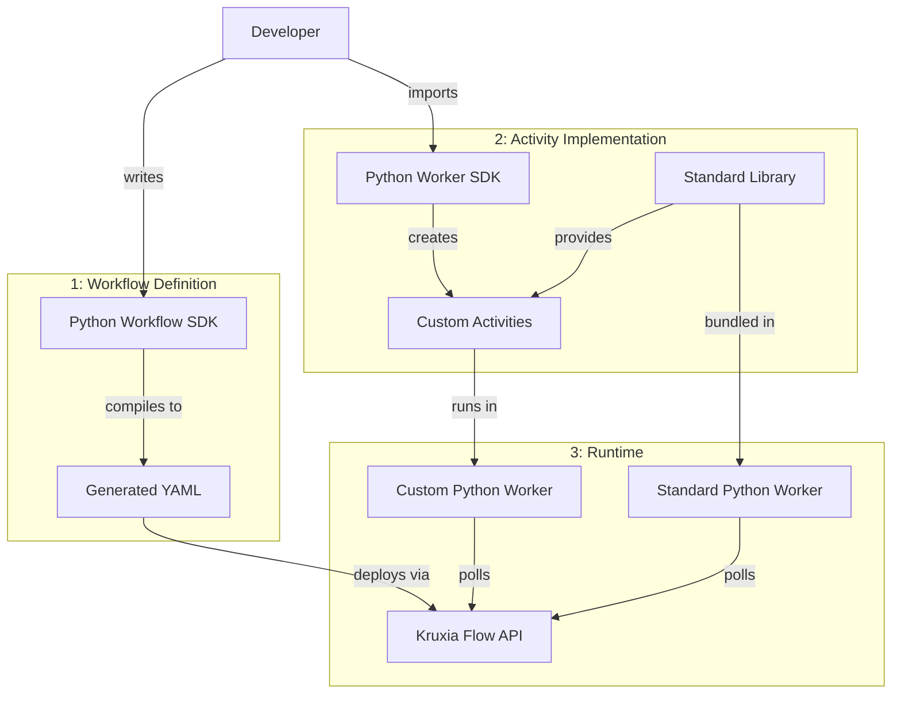

# Python SDK Implementation Plan

**Version**: 1.1
**Date**: 2026-01-24
**Status**: In Progress (Component 1 COMPLETE with 159 tests, 95%+ coverage)
**Priority**: P1 (High - Critical for developer onboarding)

---

## Executive Summary

Python support is a **foundational requirement** for Kruxia Flow adoption, particularly among AI/ML engineers (primary persona P1). This plan unifies four interdependent components into a cohesive development roadmap:

1. **Python Workflow Definitions** - Programmatic workflow building with type safety
2. **Python Worker SDK** - Library for implementing custom Python activities and workers
3. **Python Activity Standard Library** - Common activities for data engineering, ML, NLP
4. **Standard Python Worker** - Pre-built worker for common Python activities (PyPI + Docker)

**Key Insight**: These components must be developed together. You cannot effectively define workflows in Python without being able to test Python activities locally, which requires the worker SDK.

**Target Users**:
- AI/ML engineers building LLM pipelines
- Data engineers migrating from Airflow
- Data scientists needing workflow orchestration
- Python developers (90%+ of ML/AI community)

**Success Metrics**:
- Time to first workflow: <10 minutes (including Python activity)
- Developer satisfaction: >80% prefer Python SDK over YAML
- Adoption: 70%+ of users choose Python over YAML
- Example completeness: All 10 MVP examples have Python versions

---

## Architecture Overview

### Design Principles

1. **Compilation, Not Interpretation**: Python runs at deployment time, not runtime
   - Workflows compile to YAML (same runtime performance as hand-written YAML)
   - No Python runtime dependency during workflow execution
   - Activities can be Python (via worker) but workflow definition is static

2. **Low-Setup Experience**: Standard Python worker for common cases
   - Pre-built worker with common activities (script execution, data manipulation)
   - Available as PyPI package (`kruxiaflow-worker-python`) and Docker image
   - Custom workers for advanced cases (specialized libraries, dependencies)

3. **Type Safety**: Leverage Python's type hints
   - IDE autocomplete for workflow building
   - Runtime validation before deployment
   - Clear error messages at definition time

4. **Gradual Adoption Path**:
   ```
   YAML → Python workflow definitions → Custom Python activities → Standard library
   ```

### Component Interaction



---

## Component 1: Python Workflow Definitions

**Status in Roadmap**: `docs/post-mvp.md` Story 4.1 (P1)

**Implementation Status**: ✅ IMPLEMENTED (2026-01-24)

The workflow definition SDK has been implemented with a unified Pydantic model approach. Key implementation decisions:

1. **Single model system**: Pydantic models (`Activity`, `Workflow`) serve as both the data model and the fluent builder interface (no separate builder classes)
2. **`with_*` method prefix**: All fluent methods use `with_` prefix (e.g., `with_worker()`, `with_params()`, `with_timeout()`)
3. **`Activity` naming**: Reserved for workflow definitions; future activity implementations will use `ActivityImplementation` with `@activity` decorator
4. **`Dependency.on()` factory**: Creates conditional dependencies with a class method
5. **Direct YAML field alignment**: Model fields match YAML DSL structure

**Implemented Files**:
- `pysdk/kruxiaflow/models.py` - Pydantic models with fluent methods
- `pysdk/kruxiaflow/expressions.py` - SQLAlchemy-style expression tree system with operator overloading
- `pysdk/kruxiaflow/client.py` - API client (KruxiaFlow, AsyncKruxiaFlow)
- `pysdk/kruxiaflow/__init__.py` - Public API exports
- `pysdk/examples/` - Three example workflows
- `pysdk/tests/` - Comprehensive test suite (159 tests, 95%+ coverage)

### Expression Tree System (2026-01-24)

The SDK implements an SQLAlchemy-style expression tree system that provides:
- **Type-safe comparisons**: Operator overloading (`==`, `!=`, `>`, `<`, `>=`, `<=`)
- **Composable logic**: Boolean operators (`&` for AND, `|` for OR, `~` for NOT)
- **Workflow metadata access**: `workflow.id`, `workflow.name` singleton accessors
- **Automatic serialization**: All expressions serialize to template strings `{{...}}`

**Expression Types**:
```python
from kruxiaflow import (
    # Value expressions
    Input, SecretRef, EnvRef, Literal, OutputRef,
    # Comparison expressions
    Eq, Ne, Gt, Lt, Ge, Le,
    # Logical expressions
    And, Or, Not, IsNull, IsNotNull, Contains, In,
    # Helper functions
    and_, or_, not_, is_null, is_not_null, contains, in_,
    # Workflow metadata
    workflow,
)

# Example usage:
activity = Activity(key="analyze")

# Comparisons (via operator overloading)
condition1 = activity["confidence"] > 0.8      # Returns Gt expression
condition2 = activity["status"] == "success"   # Returns Eq expression

# Logical combinations (via & | ~ operators)
combined = (condition1 & condition2)           # Returns And expression
negated = ~condition1                          # Returns Not expression

# Workflow metadata
body = {
    "workflow_id": workflow.id,    # Serializes to {{WORKFLOW.id}}
    "workflow_name": workflow.name # Serializes to {{WORKFLOW.name}}
}

# All expressions serialize automatically
str(combined)  # "{{(analyze.confidence > 0.8) && (analyze.status == 'success')}}"
```

**Expression Class Hierarchy**:
```
Expression (ABC)
├── Literal            # Static values (auto-wrapped)
├── Input              # Workflow inputs: {{INPUT.name}}
├── SecretRef          # Secrets: {{SECRET.name}}
├── EnvRef             # Environment: ${NAME}
├── WorkflowRef        # Workflow metadata: {{WORKFLOW.id}}
├── OutputRef          # Activity outputs: {{activity.field}}
│   └── Supports comparison operators → Comparison subclasses
├── Comparison (ABC)
│   ├── Eq, Ne, Gt, Lt, Ge, Le
│   ├── IsNull, IsNotNull
│   ├── Contains, In
│   └── Supports logical operators → And, Or, Not
└── Logical
    ├── And            # (expr) && (expr)
    ├── Or             # (expr) || (expr)
    └── Not            # !(expr)
```

### Scope

Fluent Python API for building workflows programmatically, with compilation to YAML at deployment time.

**Core Features**:
- Workflow builder pattern with method chaining
- Activity definitions with parameters and dependencies
- **Fluent API**: All builder methods return `self` for chaining
- **Explicit registration**: `Workflow.append(activity)` returns workflow for chaining
- **Subscript access** for activity outputs (`activity["key"]`)
- Type hints for IDE support (autocomplete, validation)
- Template expression support for dynamic values
- Compilation to validated YAML
- Direct deployment to Kruxia Flow server

**Example API** (Implemented Fluent Style):
```python
from kruxiaflow import KruxiaFlow, Workflow, Activity, Input, Dependency

user_text = Input("text", type=str, required=True)

# Fluent activity definition - all with_* methods return self for chaining
analyze = (
    Activity(key="analyze_sentiment")
    .with_worker("builtin", "llm_prompt")
    .with_params(
        provider="anthropic",
        model="claude-3-haiku-20240307",
        prompt=f"Analyze sentiment: {user_text}",
        temperature=0.0
    )
    .with_cache(ttl=3600)
    .with_budget(limit_usd=0.10)
)

save = (
    Activity(key="save_results")
    .with_worker("builtin", "postgres_query")
    .with_params(
        database_url="${DATABASE_URL}",
        query="""
            INSERT INTO sentiment_results (text, sentiment, confidence)
            VALUES ($1, $2, $3)
        """,
        params=[user_text, analyze["sentiment"], analyze["confidence"]]
    )
    .with_dependencies(analyze)
)

# Build workflow
wf = (
    Workflow(name="sentiment_analysis")
    .with_version("1.0.0")
    .with_namespace("ai_pipeline")
    .with_inputs(user_text)
    .with_activities(analyze, save)
)

# Deploy via API client
client = KruxiaFlow(api_url="http://localhost:8080", api_token="${KRUXIAFLOW_TOKEN}")
client.deploy(wf)
```

**Fluent Chaining Pattern** (Implemented):
```python
# Define activities with full configuration
extract = (
    Activity(key="extract")
    .with_worker("builtin", "http_request")
    .with_params(url="${API_URL}")
)

transform = (
    Activity(key="transform")
    .with_worker("python", "script")
    .with_params(script="...")
    .with_timeout(300)
    .with_retry(max_attempts=3)
    .with_dependencies(extract)
)

validate = (
    Activity(key="validate")
    .with_worker("python", "script")
    .with_params(script="...")
    .with_dependencies(transform)
)

load = (
    Activity(key="load")
    .with_worker("builtin", "postgres_query")
    .with_params(query="...")
    .with_dependencies(transform)  # Parallel with validate - both depend on transform
)

# Fan-in: notify depends on multiple activities
notify = (
    Activity(key="notify")
    .with_worker("builtin", "http_request")
    .with_params(url="${SLACK_URL}")
    .with_dependencies(validate, load)  # Waits for both to complete
)

# Build workflow
wf = (
    Workflow(name="data_pipeline")
    .with_activities(extract, transform, validate, load, notify)
)
```

**Subscript Access for Outputs** (Implemented):
```python
# Use subscript: analyze["sentiment"]

save = (
    Activity(key="save")
    .with_worker("builtin", "postgres_query")
    .with_params(
        sentiment=analyze["sentiment"],       # Activity output reference
        confidence=analyze["confidence"],
        raw_response=analyze["response.text"] # Nested path access
    )
    .with_dependencies(analyze)
)

# Conditional dependencies with output references
notify = (
    Activity(key="notify")
    .with_worker("builtin", "http_request")
    .with_dependencies(
        Dependency.on(analyze, analyze["confidence"] > 0.8)
    )
)

# Run on failure
retry = (
    Activity(key="retry")
    .with_worker("builtin", "llm_prompt")
    .with_dependencies(
        Dependency.on(analyze, analyze["status"] == "failed")
    )
)
```

**Dynamic Workflow Generation** (Implemented):
```python
search_queries = ["AI workflows", "ML pipelines", "LLM orchestration"]

# Generate N parallel search activities with list comprehension
searches = [
    Activity(key=f"search_{i}")
    .with_worker("builtin", "http_request")
    .with_params(method="GET", url=f"https://api.search.com/q={query}")
    for i, query in enumerate(search_queries)
]

# Fan-in: aggregate depends on all searches
aggregate = (
    Activity(key="aggregate")
    .with_worker("python", "script")
    .with_params(results=[s["response"] for s in searches])
    .with_dependencies(*searches)  # Unpack list as dependencies
)

# Build workflow - unpack list with *
wf = (
    Workflow(name="parallel_search")
    .with_activities(*searches, aggregate)
)
```

**Reusable Components** (Implemented):
```python
def create_llm_fallback_chain(name: str, prompt: str, budget: float) -> list[Activity]:
    """Create activity group with Claude → GPT-4 fallback."""
    primary = (
        Activity(key=f"{name}_claude")
        .with_worker("builtin", "llm_prompt")
        .with_params(
            provider="anthropic",
            model="claude-3-haiku-20240307",
            prompt=prompt
        )
        .with_budget(limit_usd=budget * 0.7)
    )

    fallback = (
        Activity(key=f"{name}_gpt4")
        .with_worker("builtin", "llm_prompt")
        .with_params(
            provider="openai",
            model="gpt-4o-mini",
            prompt=prompt
        )
        .with_budget(limit_usd=budget * 0.3)
        .with_dependencies(Dependency.on(primary, primary.failed))
    )

    return [primary, fallback]

# Use reusable component
activities = create_llm_fallback_chain(
    name="summarize",
    prompt="Summarize: ${INPUT.document}",
    budget=1.00
)

notify = (
    Activity(key="notify")
    .with_worker("builtin", "http_request")
    .with_params(url="${SLACK_URL}")
    .with_dependencies(*activities)  # Depends on both primary and fallback
)

# Build workflow - unpack list with *
wf = (
    Workflow(name="summarization")
    .with_activities(*activities, notify)
)
```

### Implementation Details

**Implemented Package Structure**:
```
pysdk/
├── pyproject.toml
├── kruxiaflow/
│   ├── __init__.py      # Public API exports
│   ├── models.py        # Pydantic models with fluent methods (Activity, Workflow, Dependency)
│   ├── expressions.py   # Template expressions (Input, OutputRef, SecretRef, EnvRef)
│   ├── client.py        # API client (KruxiaFlow, AsyncKruxiaFlow)
│   └── py.typed         # PEP 561 marker
├── examples/
│   ├── 01_weather_report.py
│   ├── 02_user_validation.py
│   └── 03_document_processing.py
└── tests/               # pytest tests
    └── ...
```

**Dependencies** (pyproject.toml):
```toml
[build-system]
requires = ["hatchling"]
build-backend = "hatchling.build"

[project]
name = "kruxiaflow"
requires-python = ">=3.10"
dependencies = [
    "pydantic>=2.0",
    "httpx>=0.24",
    "pyyaml>=6.0",
]

[project.optional-dependencies]
dev = [
    "pytest>=7.0",
    "pytest-asyncio>=0.21",
    "pytest-cov>=4.0",
    "ruff>=0.9",
    "ty",
]

[tool.pytest.ini_options]
addopts = [
    "--cov=kruxiaflow",
    "--cov-branch",
    "--cov-report=term-missing:skip-covered",
    "--cov-fail-under=95",
]

[tool.ruff]
line-length = 100
target-version = "py310"
```

**Pydantic Models** (`models.py`):
```python
from pydantic import BaseModel, Field
from typing import Any

class RetrySettings(BaseModel):
    """Retry policy configuration."""
    max: int = 3
    backoff: str = "exponential"

class CacheSettings(BaseModel):
    """Cache configuration."""
    enabled: bool = True
    ttl: int
    key: str | None = None

class BudgetSettings(BaseModel):
    """Cost budget configuration."""
    limit: float

class ActivitySettings(BaseModel):
    """Activity execution settings."""
    timeout: int | None = None
    retries: RetrySettings | None = None
    cache: CacheSettings | None = None
    budget: BudgetSettings | None = None

class ActivityModel(BaseModel):
    """Validated, immutable activity definition."""
    key: str
    worker: str
    activity_name: str
    parameters: dict[str, Any] = Field(default_factory=dict)
    settings: ActivitySettings = Field(default_factory=ActivitySettings)
    depends_on: list[str] = Field(default_factory=list)
    condition: str | None = None

class WorkflowModel(BaseModel):
    """Validated, immutable workflow definition."""
    name: str
    version: str = "1.0.0"
    namespace: str = "default"
    activities: list[ActivityModel] = Field(default_factory=list)

    def to_yaml(self) -> str:
        """Serialize to YAML format."""
        import yaml
        return yaml.dump(self.model_dump(exclude_none=True), sort_keys=False)
```

**Fluent Builders** (`builders.py`):
```python
from typing import Self

class WorkflowActivity:
    """
    Fluent activity builder. All methods return self for chaining.
    Call .build() to produce a validated ActivityModel.

    Example:
        activity = WorkflowActivity("process") \\
            .worker("python", "script") \\
            .params(script="...") \\
            .timeout(300) \\
            .retries(3) \\
            .depends_on(extract) \\
            .build()
    """

    def __init__(self, key: str):
        self._key = key
        self._worker: str | None = None
        self._activity_name: str | None = None
        self._parameters: dict = {}
        self._timeout: int | None = None
        self._retries: tuple[int, str] | None = None
        self._cache: tuple[int, str | None] | None = None
        self._budget: float | None = None
        self._depends_on: list[WorkflowActivity] = []
        self._condition: str | None = None

    @property
    def key(self) -> str:
        """Activity key for dependency references."""
        return self._key

    def worker(self, worker: str, activity_name: str) -> Self:
        """Set worker and activity name. Returns self."""
        self._worker = worker
        self._activity_name = activity_name
        return self

    def params(self, **parameters) -> Self:
        """Set activity parameters. Returns self."""
        self._parameters.update(parameters)
        return self

    def timeout(self, seconds: int) -> Self:
        """Set timeout in seconds. Returns self."""
        self._timeout = seconds
        return self

    def retries(self, count: int, backoff: str = "exponential") -> Self:
        """Set retry policy. Returns self."""
        self._retries = (count, backoff)
        return self

    def cache(self, ttl: int, key: str | None = None) -> Self:
        """Enable caching with TTL. Returns self."""
        self._cache = (ttl, key)
        return self

    def budget(self, limit: float) -> Self:
        """Set cost budget limit. Returns self."""
        self._budget = limit
        return self

    def depends_on(self, *dependencies: 'WorkflowActivity') -> Self:
        """Set dependencies (activities that must complete first). Returns self."""
        self._depends_on.extend(dependencies)
        return self

    def when(self, condition: str | 'OutputComparison') -> Self:
        """Set conditional execution. Returns self."""
        self._condition = str(condition)
        return self

    def build(self) -> 'ActivityModel':
        """Build validated ActivityModel. Raises ValidationError if invalid."""
        from .models import ActivityModel, ActivitySettings, RetrySettings, CacheSettings, BudgetSettings

        settings = ActivitySettings(
            timeout=self._timeout,
            retries=RetrySettings(max=self._retries[0], backoff=self._retries[1]) if self._retries else None,
            cache=CacheSettings(ttl=self._cache[0], key=self._cache[1]) if self._cache else None,
            budget=BudgetSettings(limit=self._budget) if self._budget else None,
        )

        return ActivityModel(
            key=self._key,
            worker=self._worker,
            activity_name=self._activity_name,
            parameters=self._parameters,
            settings=settings,
            depends_on=[dep.key for dep in self._depends_on],
            condition=self._condition,
        )

    def __getitem__(self, key: str) -> 'OutputRef':
        """Access activity output by key. Enables activity["field"] syntax."""
        return OutputRef(self, key)

    @property
    def failed(self) -> str:
        """Condition expression for activity failure."""
        return f"{{{{ {self._key}.status == 'failed' }}}}"

    @property
    def succeeded(self) -> str:
        """Condition expression for activity success."""
        return f"{{{{ {self._key}.status == 'succeeded' }}}}"


class Workflow:
    """
    Fluent workflow builder. All methods return self for chaining.
    Call .build() to produce a validated WorkflowModel.
    """

    def __init__(self, name: str, version: str = "1.0.0", namespace: str = "default"):
        self._name = name
        self._version = version
        self._namespace = namespace
        self._activities: list[WorkflowActivity] = []

    def append(self, *activities: WorkflowActivity) -> Self:
        """Append one or more activities. Returns self for chaining."""
        self._activities.extend(activities)
        return self

    def build(self) -> 'WorkflowModel':
        """Build validated WorkflowModel. Raises ValidationError if invalid."""
        from .models import WorkflowModel

        return WorkflowModel(
            name=self._name,
            version=self._version,
            namespace=self._namespace,
            activities=[activity.build() for activity in self._activities],
        )

    def compile(self) -> str:
        """Build and compile to YAML."""
        return self.build().to_yaml()


class Expression(ABC):
    """Base class for all expressions with logical operators."""

    @abstractmethod
    def _to_template(self) -> str:
        """Convert to template string (without {{ }})."""
        pass

    def __str__(self) -> str:
        return f"{{{{{self._to_template()}}}}}"

    def __and__(self, other: Expression) -> And:
        return And(self, _to_expr(other))

    def __or__(self, other: Expression) -> Or:
        return Or(self, _to_expr(other))

    def __invert__(self) -> Not:
        return Not(self)


class OutputRef(Expression):
    """Reference to an activity output field. Supports comparison operators."""

    def __init__(self, activity: Activity, output_key: str):
        self._activity_key = activity.key
        self._output_key = output_key

    def _to_template(self) -> str:
        return f"{self._activity_key}.{self._output_key}"

    def __eq__(self, other: object) -> Eq:
        return Eq(self, _to_expr(other))

    def __ne__(self, other: object) -> Ne:
        return Ne(self, _to_expr(other))

    def __gt__(self, other: object) -> Gt:
        return Gt(self, _to_expr(other))

    def __lt__(self, other: object) -> Lt:
        return Lt(self, _to_expr(other))

    def __ge__(self, other: object) -> Ge:
        return Ge(self, _to_expr(other))

    def __le__(self, other: object) -> Le:
        return Le(self, _to_expr(other))


class Comparison(Expression):
    """Base class for binary comparisons."""

    def __init__(self, left: Expression, right: Expression, operator: str):
        self.left = left
        self.right = right
        self.operator = operator

    def _to_template(self) -> str:
        return f"{self.left._to_template()} {self.operator} {self.right._to_template()}"


class Eq(Comparison):
    def __init__(self, left: Expression, right: Expression):
        super().__init__(left, right, "==")


class And(Expression):
    """Logical AND of two expressions."""

    def __init__(self, left: Expression, right: Expression):
        self.left = left
        self.right = right

    def _to_template(self) -> str:
        return f"({self.left._to_template()}) && ({self.right._to_template()})"


# Workflow metadata singleton
class _WorkflowMeta:
    @property
    def id(self) -> WorkflowRef:
        return WorkflowRef("id")

    @property
    def name(self) -> WorkflowRef:
        return WorkflowRef("name")

workflow = _WorkflowMeta()
```

**API Client** (`client.py`):
```python
import httpx
from .models import WorkflowModel
from .builders import Workflow

class KruxiaFlow:
    """API client for Kruxia Flow server."""

    def __init__(self, api_url: str, api_token: str):
        self._api_url = api_url.rstrip('/')
        self._api_token = api_token
        self._client = httpx.Client(
            base_url=self._api_url,
            headers={"Authorization": f"Bearer {api_token}"}
        )

    def deploy(self, workflow: Workflow | WorkflowModel) -> dict:
        """
        Deploy workflow to server.
        Accepts either a Workflow builder or a built WorkflowModel.
        """
        if isinstance(workflow, Workflow):
            model = workflow.build()
        else:
            model = workflow

        response = self._client.post(
            "/api/v1/workflows",
            json=model.model_dump(exclude_none=True)
        )
        response.raise_for_status()
        return response.json()

    def get_workflow(self, workflow_id: str) -> dict:
        """Get workflow status."""
        response = self._client.get(f"/api/v1/workflows/{workflow_id}")
        response.raise_for_status()
        return response.json()

    def cancel_workflow(self, workflow_id: str) -> None:
        """Cancel a running workflow."""
        response = self._client.post(f"/api/v1/workflows/{workflow_id}/cancel")
        response.raise_for_status()
```

**Testing Strategy**:
- Unit tests for Pydantic models (validation, serialization)
- Unit tests for fluent builders (chaining, build output)
- Integration tests for YAML compilation
- E2E tests for client deployment
- All 10 MVP examples implemented in Python

### Estimated Time: 5-7 days ✅ COMPLETE

- ✅ Pydantic models + validation (1 day)
- ✅ Fluent builder methods on models (2 days)
- ✅ YAML compilation (0.5 day)
- ✅ API client (0.5 day)
- ✅ Tests + documentation (1-2 days) - COMPLETE
  - 159 tests passing
  - 95.80% branch coverage (95% required threshold)
  - SQLAlchemy-style expression tree system implemented
  - Three example workflows demonstrating different patterns

---

## Component 2: Python Worker SDK

**Status in Roadmap**: Not yet documented (NEW)

### Scope

Library for building custom Python workers that implement activities. Handles polling, result reporting, error handling, and all worker lifecycle management.

**Naming Convention**:
- `@worker.activity()` decorator registers an `ActivityHandler`
- Activity name defaults to function name, or can be set explicitly with `name=`
- Aligns with Rust `ActivityHandler` trait (rename from `ActivityImpl`)
- Distinct from workflow SDK's `WorkflowActivity` builder class

**Core Features**:
- Activity handler registration via `@worker.activity` decorator
- Automatic polling from Kruxia Flow API
- Result serialization and reporting
- Error handling and retries
- Heartbeat management for long-running activities
- File artifact upload/download
- Logging integration
- Type-safe parameter handling

**Example Usage**:
```python
from kruxiaflow.worker import Worker, ActivityParams, ActivityResult

# Create worker
worker = Worker(
    worker_id="my-python-worker",
    api_url="http://localhost:8080",
    api_token="${KRUXIAFLOW_TOKEN}",
    concurrency=5  # Max parallel activities
)

# Define activity - name defaults to function name "analyze_text"
@worker.activity()
async def analyze_text(params: ActivityParams) -> ActivityResult:
    """Custom text analysis activity"""
    text = params["text"]
    model = params.get("model", "default")

    # Your custom logic here
    result = await some_analysis_library.analyze(text, model)

    return ActivityResult(
        output={
            "sentiment": result.sentiment,
            "confidence": result.confidence,
            "entities": result.entities
        },
        cost_usd=0.0001  # Optional cost tracking
    )

# Run worker
if __name__ == "__main__":
    worker.run()  # Blocks, polls for activities
```

**Advanced Features**:
```python
@worker.activity()  # Uses function name "process_document"
async def process_document(params: ActivityParams, context: ActivityContext) -> ActivityResult:
    """Long-running activity with heartbeat and file handling"""
    doc_url = params["document_url"]

    # Download file artifact
    local_path = await context.download_file(doc_url)

    with open(local_path, 'r') as f:
        pages = f.read().split('\n\n')

    results = []
    for i, page in enumerate(pages):
        # Send heartbeat for long operations
        await context.heartbeat()

        # Process page
        result = await process_page(page)
        results.append(result)

        # Log progress
        context.logger.info(f"Processed page {i+1}/{len(pages)}")

    # Upload result file
    result_url = await context.upload_file(
        content=json.dumps(results),
        filename="results.json",
        content_type="application/json"
    )

    return ActivityResult(
        output={"results_url": result_url, "page_count": len(pages)}
    )

# Error handling
@worker.activity(name="fetch_data")  # Explicit name (could also omit for "fetch_data")
async def fetch_data(params: ActivityParams) -> ActivityResult:
    """Activity with error handling."""
    try:
        data = await external_api.fetch(params["url"])
        return ActivityResult(output=data)
    except Exception as e:
        # Return error (workflow will handle retry/failure)
        return ActivityResult.error(
            error=str(e),
            error_type=type(e).__name__
        )
```

### Implementation Details

**Package Structure**:
```
kruxiaflow-worker/
├── pyproject.toml
├── README.md
├── src/kruxiaflow/worker/
│   ├── __init__.py
│   ├── worker.py         # Main worker class
│   ├── activity.py       # Activity decorator and result
│   ├── context.py        # Activity execution context
│   ├── poller.py         # API polling logic
│   ├── heartbeat.py      # Heartbeat management
│   ├── files.py          # File upload/download
│   └── errors.py         # Error handling
└── tests/
    ├── test_worker.py
    ├── test_activity.py
    └── test_integration.py
```

**Key Classes**:
```python
class Worker:
    def __init__(
        self,
        worker_id: str,
        api_url: str,
        api_token: str,
        concurrency: int = 5,
        poll_interval: float = 0.1
    ):
        ...

    def activity(self, name: str | None = None) -> Callable:
        """Decorator to register an ActivityHandler. Uses function name if name not provided."""
        ...

    async def run(self) -> None:
        """Start worker (blocks, polls for activities)"""
        ...

    async def shutdown(self) -> None:
        """Graceful shutdown"""
        ...

class ActivityParams(BaseModel):
    """
    Base class for activity parameters. Handlers can subclass for type safety,
    or use directly for dict-like access.

    Example:
        # Type-safe params
        class AnalyzeParams(ActivityParams):
            text: str
            model: str = "default"

        @worker.activity()
        async def analyze(params: AnalyzeParams) -> ActivityResult:
            print(params.text)  # IDE autocomplete works

        # Or use base class for dict-like access
        @worker.activity()
        async def simple(params: ActivityParams) -> ActivityResult:
            print(params["text"])  # Dict-style access
    """
    model_config = ConfigDict(extra="allow")  # Allow arbitrary fields

    def __getitem__(self, key: str) -> Any:
        """Dict-style access: params["key"]"""
        return getattr(self, key)


class ActivityResult:
    def __init__(
        self,
        output: dict | list | str | int | float | bool | None = None,
        cost_usd: float = None,
        metadata: dict = None
    ):
        ...

    @classmethod
    def error(cls, error: str, error_type: str = "Error") -> 'ActivityResult':
        """Create error result."""
        ...

class ActivityContext:
    """Context passed to activity handlers."""

    @property
    def workflow_id(self) -> str:
        """Unique identifier for the workflow instance."""
        ...

    @property
    def activity_id(self) -> str:
        """Unique identifier for this activity execution."""
        ...

    @property
    def activity_key(self) -> str:
        """Activity key from workflow definition."""
        ...

    @property
    def logger(self) -> logging.Logger:
        ...

    async def heartbeat(self) -> None:
        """Send heartbeat to prevent timeout"""
        ...

    async def download_file(self, url: str) -> str:
        """Download file artifact, return local path"""
        ...

    async def upload_file(
        self,
        content: bytes | str,
        filename: str,
        content_type: str = "application/octet-stream"
    ) -> str:
        """Upload file artifact, return URL"""
        ...
```

**Polling Mechanism**:
```python
class ActivityPoller:
    async def poll_once(self) -> list[ActivityTask]:
        """Poll for available activities"""
        response = await self.client.post(
            "/api/v1/activities/poll",
            json={
                "worker_id": self.worker_id,
                "activities": [
                    {"worker": self.worker_name, "name": name}
                    for name in self.registered_activities
                ],
                "limit": self.concurrency
            }
        )
        return [ActivityTask.from_json(t) for t in response.json()["tasks"]]

    async def poll_loop(self):
        """Continuous polling with backoff"""
        while not self.shutdown_event.is_set():
            try:
                tasks = await self.poll_once()

                if tasks:
                    await self.execute_tasks(tasks)
                else:
                    await asyncio.sleep(self.poll_interval)
            except Exception as e:
                self.logger.error(f"Poll error: {e}")
                await asyncio.sleep(self.poll_interval * 10)  # Backoff
```

### Estimated Time: 7-10 days

- Core worker infrastructure (3 days)
- Polling + result reporting (2 days)
- Heartbeat + timeout handling (1 day)
- File upload/download (1 day)
- Error handling + retries (1 day)
- Tests + documentation (2 days)

---

## Component 3: Pre-installed Python Packages

**Status in Roadmap**: Not yet documented (NEW)

### Scope

Bundle common Python packages with the standard Python worker. Instead of creating 30+ discrete activities, provide a single `script` activity with rich package ecosystem pre-installed.

**Design Rationale**:
- Discrete activities like `read_csv` don't make sense (need to pass DataFrames between activities)
- Python's strength is flexibility - let users write scripts
- Pre-installed packages = the "standard library"
- Example snippets serve as documentation

**Package Categories**:

### 3.1 Data Engineering
```
pandas>=2.0.0           # DataFrame operations
pyarrow>=14.0.0         # Parquet support
sqlalchemy>=2.0.0       # Database connections
```

### 3.2 Data Science / Machine Learning
```
numpy>=1.24.0           # Numerical operations
scikit-learn>=1.3.0     # ML algorithms
scipy>=1.10.0           # Scientific computing
```

### 3.3 Natural Language Processing
```
transformers>=4.30.0    # Hugging Face models (minimal install)
sentence-transformers   # Embeddings
nltk>=3.8.0             # Basic NLP tools
```

### 3.4 Utilities
```
httpx>=0.24.0          # HTTP requests
lxml                   # XML parsing
beautifulsoup4>=4.12.0 # HTML parsing
pillow>=10.0.0         # Image processing
orjson>=3.9.0          # Fast JSON
```

**Total Size**: ~200-300MB bundled with worker

### Example Usage

**Data Engineering**:
```yaml
- key: transform_data
  worker: python
  activity_name: script
  parameters:
    script: |
      import pandas as pd

      # Download CSV from file storage
      csv_path = download_file(INPUT["data_url"])
      df = pd.read_csv(csv_path)

      # Transform data
      df_active = df[df["status"] == "active"]
      df_summary = df_active.groupby("category").agg({
          "amount": "sum",
          "count": "count"
      })

      # Upload result to file storage
      result_url = upload_file(
          df_summary.to_csv(),
          "summary.csv"
      )

      OUTPUT = {"result_url": result_url, "row_count": len(df_summary)}
```

**Machine Learning**:
```yaml
- key: train_model
  worker: python
  activity_name: script
  parameters:
    script: |
      import pandas as pd
      from sklearn.ensemble import RandomForestClassifier
      import pickle

      # Load training data
      train_df = pd.read_csv(download_file(INPUT["train_url"]))
      X = train_df.drop("target", axis=1)
      y = train_df["target"]

      # Train model
      model = RandomForestClassifier(n_estimators=100, random_state=42)
      model.fit(X, y)

      # Save model to file storage
      model_bytes = pickle.dumps(model)
      model_url = upload_file(model_bytes, "model.pkl")

      OUTPUT = {
          "model_url": model_url,
          "train_accuracy": float(model.score(X, y)),
          "feature_importance": model.feature_importances_.tolist()
      }
```

**Natural Language Processing**:
```yaml
- key: analyze_sentiment
  worker: python
  activity_name: script
  parameters:
    script: |
      from transformers import pipeline

      # Load sentiment analysis pipeline
      classifier = pipeline("sentiment-analysis")

      # Analyze text
      texts = INPUT["texts"]
      results = classifier(texts)

      OUTPUT = {"sentiments": results}
```

### Implementation Details

**Package Installation**:
```dockerfile
# In Python worker Dockerfile
RUN pip install --no-cache-dir \
    pandas==2.0.3 \
    pyarrow==14.0.1 \
    sqlalchemy==2.0.23 \
    numpy==1.24.4 \
    scikit-learn==1.3.2 \
    scipy==1.10.1 \
    transformers==4.35.2 \
    sentence-transformers==2.2.2 \
    nltk==3.8.1 \
    httpx==0.24.1 \
    beautifulsoup4==4.12.2 \
    pillow==10.1.0 \
    orjson==3.9.10
```

**Documentation Structure**:
```
docs/python-examples/
├── data-engineering/
│   ├── csv-processing.md
│   ├── parquet-operations.md
│   └── database-queries.md
├── machine-learning/
│   ├── training-models.md
│   ├── predictions.md
│   └── feature-engineering.md
└── nlp/
    ├── text-classification.md
    ├── embeddings.md
    └── entity-extraction.md
```

### Estimated Time: 2-3 days

- Package selection and testing (1 day)
- Dockerfile/binary packaging (1 day)
- Example documentation (0.5-1 day)

---

## Component 4: Standard Python Worker

**Status in Roadmap**: Not yet documented (NEW)

### Scope

Bundled Python worker that ships with Kruxia Flow binary, providing zero-setup Python script execution with rich package ecosystem.

**Single Activity**: `script`
- **Worker name**: `python`
- **Activity name**: `script`
- Execute arbitrary Python code in sandboxed environment
- Pre-installed packages (Component 3) available via import
- Helper functions for file operations

**Usage**:
```yaml
activities:
  - key: process_data
    worker: python
    activity_name: script
    parameters:
      script: |
        import pandas as pd
        import numpy as np

        # Download file from storage
        csv_path = download_file(INPUT["data_url"])
        df = pd.read_csv(csv_path)

        # Process data
        df_filtered = df[df["value"] > 100]
        df_filtered["normalized"] = (df_filtered["value"] - df_filtered["value"].mean()) / df_filtered["value"].std()

        # Upload result
        result_url = upload_file(df_filtered.to_csv(), "processed.csv")

        OUTPUT = {
            "result_url": result_url,
            "row_count": len(df_filtered),
            "mean_value": float(df_filtered["value"].mean())
        }
```

### Implementation Details

**Activity Implementation**:
```python
@worker.activity(name="script")  # Explicit name for standard worker activity
async def execute_script(params: ActivityParams, context: ActivityContext) -> ActivityResult:
    """Execute arbitrary Python script in sandboxed environment"""

    script = params["script"]

    # Provide helper functions and input in global scope
    globals_dict = {
        # Input data
        "INPUT": params.get("inputs", {}),
        "OUTPUT": {},

        # File operations
        "upload_file": context.upload_file,
        "download_file": context.download_file,

        # Utilities
        "logger": context.logger,
        "workflow_id": context.workflow_id,
        "activity_key": context.activity_key,

        # Standard library available via import
        # (pandas, numpy, sklearn, etc.)
    }

    # Execute script with timeout
    try:
        exec(script, globals_dict)
        output = globals_dict.get("OUTPUT", {})

        return ActivityResult(
            output=output,
            cost_usd=params.get("cost_usd", 0.0)
        )
    except Exception as e:
        return ActivityResult.error(
            error=str(e),
            error_type=type(e).__name__
        )
```

**Security Considerations**:
- Restricted builtins (no `open`, `eval`, etc. beyond sandbox)
- Timeout enforcement (default 300s, configurable)
- Memory limits via worker configuration
- File operations only through `upload_file`/`download_file` helpers
- No direct filesystem access
- Network access through standard libraries only

**Deployment**:
- Python worker bundled with Kruxia Flow binary
- Starts automatically with `kruxiaflow serve --python-worker` (or default)
- Isolated Python environment (venv or embedded via PyOxidizer)
- All Component 3 packages pre-installed

**Package Bundling**:

Option 1: Docker-based (simpler, larger):
```dockerfile
FROM rust:1.75 as builder
# Build Kruxia Flow binary
...

FROM python:3.11-slim
COPY --from=builder /app/kruxiaflow /usr/local/bin/
RUN pip install --no-cache-dir \
    pandas==2.0.3 \
    numpy==1.24.4 \
    scikit-learn==1.3.2 \
    # ... all Component 3 packages
CMD ["kruxiaflow", "serve"]
```

Option 2: PyOxidizer (smaller, complex):
```toml
# PyOxidizer.toml
[[embedded_python_interpreter]]
dependencies = [
    "pandas>=2.0.0",
    "numpy>=1.24.0",
    # ... all Component 3 packages
]
```

**Binary Size**:
- Docker image: ~500MB (acceptable for containers)
- Native binary with embedded Python: ~150-200MB (if using PyOxidizer)
- Trade-off: Simplicity (Docker) vs Size (PyOxidizer)

**Recommendation**: Start with Docker-based approach for MVP, optimize with PyOxidizer post-launch if needed.

### Example Workflows

**Data Pipeline**:
```yaml
name: data_pipeline
activities:
  - key: extract
    worker: python
    activity_name: script
    parameters:
      script: |
        import httpx
        response = httpx.get(INPUT["api_url"])
        data = response.json()

        # Save raw data
        raw_url = upload_file(orjson.dumps(data), "raw.json")
        OUTPUT = {"raw_url": raw_url, "count": len(data)}

  - key: transform
    worker: python
    activity_name: script
    parameters:
      script: |
        import pandas as pd
        import orjson

        # Load raw data
        raw_data = orjson.loads(download_file(INPUT["raw_url"]))
        df = pd.DataFrame(raw_data)

        # Transform
        df_clean = df.dropna().drop_duplicates()

        # Save
        clean_url = upload_file(df_clean.to_parquet(), "clean.parquet")
        OUTPUT = {"clean_url": clean_url}
    depends_on: [extract]

  - key: load
    worker: standard
    activity_name: postgres_query
    parameters:
      database_url: "${DATABASE_URL}"
      query: "COPY data FROM STDIN"  # Load from parquet
      file_url: "{{transform.clean_url}}"
    depends_on: [transform]
```

**ML Training**:
```yaml
name: train_model
activities:
  - key: prepare_data
    worker: python
    activity_name: script
    parameters:
      script: |
        import pandas as pd
        from sklearn.model_selection import train_test_split

        df = pd.read_csv(download_file(INPUT["data_url"]))
        X = df.drop("target", axis=1)
        y = df["target"]

        X_train, X_test, y_train, y_test = train_test_split(
            X, y, test_size=0.2, random_state=42
        )

        # Save splits
        train_url = upload_file(
            pd.concat([X_train, y_train], axis=1).to_parquet(),
            "train.parquet"
        )
        test_url = upload_file(
            pd.concat([X_test, y_test], axis=1).to_parquet(),
            "test.parquet"
        )

        OUTPUT = {"train_url": train_url, "test_url": test_url}

  - key: train
    worker: python
    activity_name: script
    parameters:
      script: |
        import pandas as pd
        from sklearn.ensemble import RandomForestClassifier
        import pickle

        train_df = pd.read_parquet(download_file(INPUT["train_url"]))
        X_train = train_df.drop("target", axis=1)
        y_train = train_df["target"]

        model = RandomForestClassifier(n_estimators=100)
        model.fit(X_train, y_train)

        model_url = upload_file(pickle.dumps(model), "model.pkl")

        OUTPUT = {
            "model_url": model_url,
            "train_accuracy": float(model.score(X_train, y_train))
        }
    depends_on: [prepare_data]
```

### Custom Workers Still Needed For:

1. **Specialized Dependencies**:
   - Large ML models (BERT, GPT variants)
   - Domain-specific libraries not in Component 3
   - Proprietary packages

2. **Long-Running Operations**:
   - Better heartbeat control
   - Custom timeout handling
   - Progress reporting

3. **Type Safety**:
   - Parameter validation at activity level
   - Structured outputs
   - IDE autocomplete for activity parameters

4. **Reusability**:
   - Shared team activities
   - Versioned activity implementations
   - Team-specific abstractions

**Example Custom Activity**:
```python
from kruxiaflow.worker import Worker, ActivityParams, ActivityResult

worker = Worker(worker_id="ml-worker", ...)

@worker.activity()  # Uses function name "bert_inference"
async def bert_inference(params: ActivityParams) -> ActivityResult:
    """Specialized BERT inference with model caching"""

    # Model loaded once at worker startup (not per activity)
    text = params["text"]
    predictions = self.bert_model.predict(text)

    return ActivityResult(
        output={"predictions": predictions, "confidence": predictions.max()},
        cost_usd=0.001  # Track inference cost
    )

worker.run()
```

### Estimated Time: 3-4 days

- Python worker implementation (1 day)
- `script` activity with helpers (1 day)
- Docker packaging + testing (1 day)
- Example documentation (0.5-1 day)

---

## Development Phases & Roadmap Integration

### Phase 1: Foundation (Weeks 1-2) - **Pre-Launch / Soft Launch**

**Goal**: Enable Python workflow definitions and basic worker SDK

**Components**:
1. Python Workflow Definitions SDK (Component 1)
2. Python Worker SDK core (Component 2 - partial)

**Deliverables**:
- Python package: `kruxiaflow` (workflow builder)
- Python package: `kruxiaflow-worker` (worker SDK)
- All 10 MVP examples implemented in Python
- Documentation: Quick start, API reference

**Why Now**:
- Critical for developer onboarding
- Needed for launch demos
- Python is primary language for P1 persona (AI/ML engineers)
- Workflow definitions require testing → require worker SDK

**Roadmap Location**:
- Launch Development Plan: Week 2-3 (Pre-Launch Foundation)
- Post-MVP: Story 4.1 becomes "In Progress"

**Estimated Time**: 12-17 days total
- Component 1: 5-7 days
- Component 2 (core only): 7-10 days

---

### Phase 2: Pre-installed Packages (Week 3) - **Soft Launch / Public Launch**

**Goal**: Provide rich Python ecosystem with pre-installed packages

**Components**:
3. Pre-installed Python Packages (Component 3)

**Deliverables**:
- Package selection (pandas, sklearn, transformers, etc.)
- Dockerfile/packaging configuration
- Example documentation (snippets for common tasks)
- Migration examples from Airflow

**Why Now**:
- Enables real-world use cases (data engineering, ML)
- "30+ packages pre-installed" is strong marketing
- Competitive with Airflow's operator library (but more flexible)
- Needed before standard worker can ship

**Roadmap Location**:
- Launch Development Plan: Week 3-4 (Soft Launch)
- Post-MVP: Story 4.1c "Pre-installed Python Packages" (P1)

**Estimated Time**: 2-3 days

---

### Phase 3: Standard Python Worker (Week 3-4) - **Soft Launch / Public Launch**

**Goal**: Zero-setup Python script execution

**Components**:
4. Standard Python Worker (Component 4)

**Deliverables**:
- Standard worker: `python` with activity `script`
- Helper functions (upload_file, download_file)
- Docker image with all packages
- Updated quick start (Python script in 60 seconds)
- Security sandboxing

**Why Now**:
- "Zero-config Python execution" is a strong marketing message
- Simplifies onboarding (no separate worker deployment)
- Competitive advantage vs Temporal (requires separate SDKs)
- Natural complement to Phase 2 packages

**Roadmap Location**:
- Launch Development Plan: Week 3-4 (Soft Launch)
- Post-MVP: Story 4.1d "Standard Python Worker" (P1)

**Estimated Time**: 3-4 days

---

## Total Timeline

| Phase | Component                        | Weeks | Days  | Roadmap Phase  |
|-------|----------------------------------|-------|-------|----------------|
| 1     | Workflow Definitions SDK         | 1-2   | 5-7   | Pre-Launch     |
| 1     | Worker SDK (core)                | 1-2   | 7-10  | Pre-Launch     |
| 2     | Pre-installed Python Packages    | 3     | 2-3   | Soft Launch    |
| 3     | Standard Python Worker           | 3-4   | 3-4   | Soft Launch    |
|       | **Total**                        | 4     | 17-24 |                |

**Recommended Schedule**: 3-4 weeks, starting immediately (aligns with launch plan)

**Note**: Phases 2 and 3 can partially overlap since they're simpler than originally planned. The simplified design (single `script` activity + pre-installed packages) reduces complexity significantly.

---

## Success Criteria

### Phase 1 (Foundation)
- ✅ 10 MVP examples have Python versions
- ✅ Custom Python worker runs successfully
- ✅ Documentation rated >4/5 by beta testers
- ✅ Time to first Python workflow <10 minutes

### Phase 2 (Pre-installed Packages)
- ✅ 15+ essential packages installed and tested
- ✅ Example documentation for common tasks
- ✅ Package selection validated with beta testers
- ✅ Dockerfile/packaging complete

### Phase 3 (Standard Worker)
- ✅ Standard Python worker available on PyPI and Docker Hub
- ✅ `script` activity works with all pre-installed packages
- ✅ Helper functions (upload_file, download_file) functional
- ✅ Zero-config Python execution works
- ✅ "Quick Start" updated to feature Python
- ✅ Security sandboxing in place

### Overall Success Metrics
- 70%+ of users choose Python over YAML
- Python SDK downloads/week >100 within month 1
- GitHub stars increase 2x after Python SDK launch
- Positive mentions of Python support in feedback

---

## Dependencies

### Internal Dependencies
- Kruxia Flow API must be stable (MVP complete)
- File artifact storage operational (US-5.4)
- Standard worker polling infrastructure works

### External Dependencies
- Python 3.10+ (target compatibility)
- PyPI package distribution
- Documentation hosting (ReadTheDocs or similar)

---

## Risks & Mitigations

### Risk 1: Python environment conflicts
**Impact**: High
**Probability**: Medium
**Mitigation**:
- Use minimal dependencies in standard worker
- Document virtual environment best practices
- Provide Docker images with dependencies pre-installed

### Risk 2: Binary size bloat
**Impact**: Medium
**Probability**: Medium
**Mitigation**:
- Limit standard worker to essential activities only
- Use PyOxidizer for efficient bundling
- Offer separate "full" vs "minimal" binaries

### Risk 3: Developer confusion (Python vs YAML)
**Impact**: Medium
**Probability**: Low
**Mitigation**:
- Clear documentation on when to use each
- Show YAML compilation output
- Emphasize "Python compiles to YAML"

### Risk 4: Maintenance burden
**Impact**: High
**Probability**: Low
**Mitigation**:
- Start with focused standard library (30 activities, not 100)
- Community contributions via GitHub
- Automated testing for all stdlib activities

---

## Open Questions

1. **Package naming**: `kruxiaflow` or `kruxia-flow` or `kruxia_flow`?
   - Recommendation: `kruxiaflow` (matches domain, easier to type)

2. **Async vs sync worker API**: Force async or support both?
   - Recommendation: Async-first (modern Python), provide sync wrapper

3. **Python version support**: Support bugfix and security versions per https://devguide.python.org/versions/
   - Currently: 3.10+ (3.9 reached EOL 2025-10)
   - Policy: Drop support when versions move to "end of life"

4. **Specialized workers (post-MVP)**: One standard worker or multiple specialized?
   - **Option A**: Single `kruxiaflow-worker-python` with all packages (~500MB image)
   - **Option B**: Multiple official workers by domain:
     - `kruxiaflow-worker-python` - minimal base (httpx, orjson)
     - `kruxiaflow-worker-python-data` - pandas, pyarrow, sqlalchemy
     - `kruxiaflow-worker-python-ml` - sklearn, numpy, scipy
     - `kruxiaflow-worker-python-nlp` - transformers, sentence-transformers
   - **Option C**: Community/contrib ecosystem (`kruxiaflow-contrib-worker-*`)
   - Recommendation: Start with Option A for MVP, evaluate B/C based on user feedback

---

## Next Steps

1. **Approve scope** - Review and approve this plan
2. **Create stories** - Break into Jira/GitHub issues
3. **Assign ownership** - Who builds workflow SDK vs worker SDK?
4. **Start Phase 1** - Begin with workflow definitions (critical path)
5. **Beta testing** - Recruit 5-10 beta testers for feedback
6. **Marketing prep** - "Python Support" messaging for launch

---

## References

- `docs/post-mvp.md` - Story 4.1 (Python SDK for Workflow Definitions)
- `docs/mvp-requirements.md` - Epic 4 (Developer Experience)
- `Launch_Development_Plan.md` - Launch timeline and phases
- Python packaging best practices: https://packaging.python.org/
