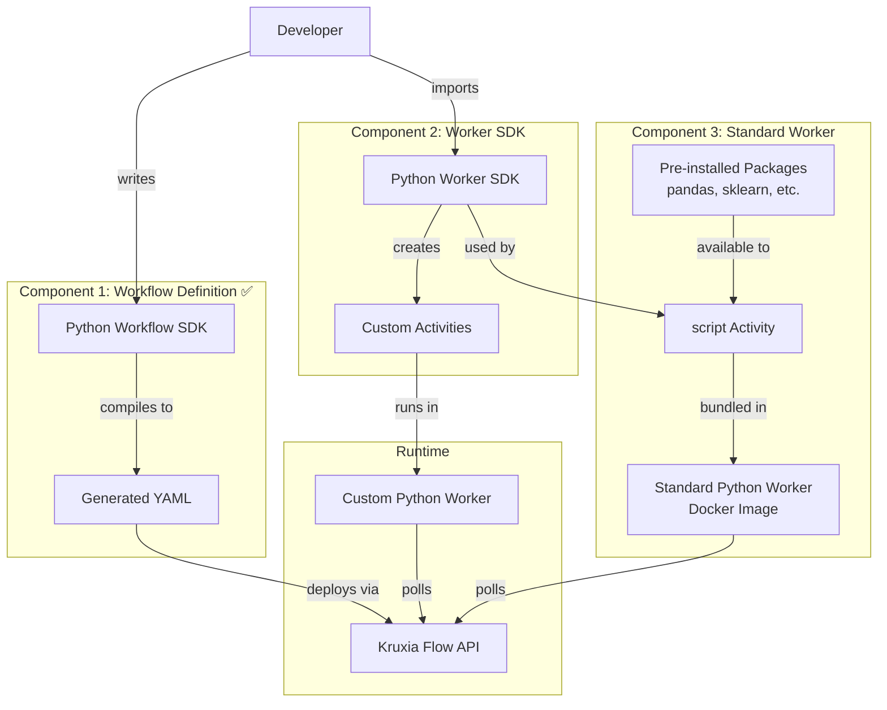

# Python SDK Implementation Plan

**Version**: 2.0
**Date**: 2026-01-25
**Status**: In Progress
**Priority**: P1 (High - Critical for developer onboarding)

### Component Status

| Component                        | Status                    | Notes                                        |
|----------------------------------|---------------------------|----------------------------------------------|
| 1. Workflow Definitions SDK      | ✅ **COMPLETE**            | 159 tests, 95%+ coverage                     |
| 2. Worker SDK                    | ✅ **COMPLETE**            | 143 tests, mirrors Rust SDK                  |
| 3. Standard Python Worker        | 📋 Ready for Implementation | `script` activity + pre-installed packages   |

---

## Executive Summary

Python support is a **foundational requirement** for Kruxia Flow adoption, particularly among AI/ML engineers (primary persona P1). This plan defines three sequential components:

1. **Python Workflow Definitions** ✅ - Programmatic workflow building with type safety
2. **Python Worker SDK** ✅ - Library for implementing custom Python activities and workers
3. **Standard Python Worker** - Pre-built Docker worker with `script` activity and rich package ecosystem

**Key Insight**: Components are designed for sequential implementation. Component 2 (Worker SDK) provides the foundation that Component 3 (Standard Worker) builds upon.

**Target Users**:
- AI/ML engineers building LLM pipelines
- Data engineers migrating from Airflow
- Data scientists needing workflow orchestration
- Python developers (90%+ of ML/AI community)

**Success Metrics**:
- Time to first workflow: <10 minutes (including Python activity)
- Developer satisfaction: >80% prefer Python SDK over YAML
- Adoption: 70%+ of users choose Python over YAML
- Example completeness: All 10 MVP examples have Python versions

---

## Architecture Overview

### Design Principles

1. **Compilation, Not Interpretation**: Python runs at deployment time, not runtime
   - Workflows compile to YAML (same runtime performance as hand-written YAML)
   - No Python runtime dependency during workflow execution
   - Activities can be Python (via worker) but workflow definition is static

2. **Low-Setup Experience**: Standard Python worker for common cases
   - Pre-built worker with common activities (script execution, data manipulation)
   - Available as PyPI package (`kruxiaflow-worker-python`) and Docker image
   - Custom workers for advanced cases (specialized libraries, dependencies)

3. **Type Safety**: Leverage Python's type hints
   - IDE autocomplete for workflow building
   - Runtime validation before deployment
   - Clear error messages at definition time

4. **Gradual Adoption Path**:
   ```
   YAML → Python workflow definitions → Standard worker scripts → Custom workers
   ```

### Component Interaction



---

## Component 1: Python Workflow Definitions

**Status in Roadmap**: `docs/post-mvp.md` Story 4.1 (P1)

**Implementation Status**: ✅ IMPLEMENTED (2026-01-24)

The workflow definition SDK has been implemented with a unified Pydantic model approach. Key implementation decisions:

1. **Single model system**: Pydantic models (`Activity`, `Workflow`) serve as both the data model and the fluent builder interface (no separate builder classes)
2. **`with_*` method prefix**: All fluent methods use `with_` prefix (e.g., `with_worker()`, `with_params()`, `with_timeout()`)
3. **`Activity` naming**: Reserved for workflow definitions; future activity implementations will use `ActivityImplementation` with `@activity` decorator
4. **`Dependency.on()` factory**: Creates conditional dependencies with a class method
5. **Direct YAML field alignment**: Model fields match YAML DSL structure

**Implemented Files**:
- `pysdk/kruxiaflow/models.py` - Pydantic models with fluent methods
- `pysdk/kruxiaflow/expressions.py` - SQLAlchemy-style expression tree system with operator overloading
- `pysdk/kruxiaflow/client.py` - API client (KruxiaFlow, AsyncKruxiaFlow)
- `pysdk/kruxiaflow/__init__.py` - Public API exports
- `pysdk/examples/` - Three example workflows
- `pysdk/tests/` - Comprehensive test suite (159 tests, 95%+ coverage)

### Expression Tree System (2026-01-24)

The SDK implements an SQLAlchemy-style expression tree system that provides:
- **Type-safe comparisons**: Operator overloading (`==`, `!=`, `>`, `<`, `>=`, `<=`)
- **Composable logic**: Boolean operators (`&` for AND, `|` for OR, `~` for NOT)
- **Workflow metadata access**: `workflow.id`, `workflow.name` singleton accessors
- **Automatic serialization**: All expressions serialize to template strings `{{...}}`

**Expression Types**:
```python
from kruxiaflow import (
    # Value expressions
    Input, SecretRef, EnvRef, Literal, OutputRef,
    # Comparison expressions
    Eq, Ne, Gt, Lt, Ge, Le,
    # Logical expressions
    And, Or, Not, IsNull, IsNotNull, Contains, In,
    # Helper functions
    and_, or_, not_, is_null, is_not_null, contains, in_,
    # Workflow metadata
    workflow,
)

# Example usage:
activity = Activity(key="analyze")

# Comparisons (via operator overloading)
condition1 = activity["confidence"] > 0.8      # Returns Gt expression
condition2 = activity["status"] == "success"   # Returns Eq expression

# Logical combinations (via & | ~ operators)
combined = (condition1 & condition2)           # Returns And expression
negated = ~condition1                          # Returns Not expression

# Workflow metadata
body = {
    "workflow_id": workflow.id,    # Serializes to {{WORKFLOW.id}}
    "workflow_name": workflow.name # Serializes to {{WORKFLOW.name}}
}

# All expressions serialize automatically
str(combined)  # "{{(analyze.confidence > 0.8) && (analyze.status == 'success')}}"
```

**Expression Class Hierarchy**:
```
Expression (ABC)
├── Literal            # Static values (auto-wrapped)
├── Input              # Workflow inputs: {{INPUT.name}}
├── SecretRef          # Secrets: {{SECRET.name}}
├── EnvRef             # Environment: ${NAME}
├── WorkflowRef        # Workflow metadata: {{WORKFLOW.id}}
├── OutputRef          # Activity outputs: {{activity.field}}
│   └── Supports comparison operators → Comparison subclasses
├── Comparison (ABC)
│   ├── Eq, Ne, Gt, Lt, Ge, Le
│   ├── IsNull, IsNotNull
│   ├── Contains, In
│   └── Supports logical operators → And, Or, Not
└── Logical
    ├── And            # (expr) && (expr)
    ├── Or             # (expr) || (expr)
    └── Not            # !(expr)
```

### Scope

Fluent Python API for building workflows programmatically, with compilation to YAML at deployment time.

**Core Features**:
- Workflow builder pattern with method chaining
- Activity definitions with parameters and dependencies
- **Fluent API**: All builder methods return `self` for chaining
- **Explicit registration**: `Workflow.append(activity)` returns workflow for chaining
- **Subscript access** for activity outputs (`activity["key"]`)
- Type hints for IDE support (autocomplete, validation)
- Template expression support for dynamic values
- Compilation to validated YAML
- Direct deployment to Kruxia Flow server

**Example API** (Implemented Fluent Style):
```python
from kruxiaflow import KruxiaFlow, Workflow, Activity, Input, Dependency

user_text = Input("text", type=str, required=True)

# Fluent activity definition - all with_* methods return self for chaining
analyze = (
    Activity(key="analyze_sentiment")
    .with_worker("builtin", "llm_prompt")
    .with_params(
        provider="anthropic",
        model="claude-3-haiku-20240307",
        prompt=f"Analyze sentiment: {user_text}",
        temperature=0.0
    )
    .with_cache(ttl=3600)
    .with_budget(limit_usd=0.10)
)

save = (
    Activity(key="save_results")
    .with_worker("builtin", "postgres_query")
    .with_params(
        database_url="${DATABASE_URL}",
        query="""
            INSERT INTO sentiment_results (text, sentiment, confidence)
            VALUES ($1, $2, $3)
        """,
        params=[user_text, analyze["sentiment"], analyze["confidence"]]
    )
    .with_dependencies(analyze)
)

# Build workflow
wf = (
    Workflow(name="sentiment_analysis")
    .with_version("1.0.0")
    .with_namespace("ai_pipeline")
    .with_inputs(user_text)
    .with_activities(analyze, save)
)

# Deploy via API client
client = KruxiaFlow(api_url="http://localhost:8080", api_token="${KRUXIAFLOW_TOKEN}")
client.deploy(wf)
```

**Fluent Chaining Pattern** (Implemented):
```python
# Define activities with full configuration
extract = (
    Activity(key="extract")
    .with_worker("builtin", "http_request")
    .with_params(url="${API_URL}")
)

transform = (
    Activity(key="transform")
    .with_worker("python", "script")
    .with_params(script="...")
    .with_timeout(300)
    .with_retry(max_attempts=3)
    .with_dependencies(extract)
)

validate = (
    Activity(key="validate")
    .with_worker("python", "script")
    .with_params(script="...")
    .with_dependencies(transform)
)

load = (
    Activity(key="load")
    .with_worker("builtin", "postgres_query")
    .with_params(query="...")
    .with_dependencies(transform)  # Parallel with validate - both depend on transform
)

# Fan-in: notify depends on multiple activities
notify = (
    Activity(key="notify")
    .with_worker("builtin", "http_request")
    .with_params(url="${SLACK_URL}")
    .with_dependencies(validate, load)  # Waits for both to complete
)

# Build workflow
wf = (
    Workflow(name="data_pipeline")
    .with_activities(extract, transform, validate, load, notify)
)
```

**Subscript Access for Outputs** (Implemented):
```python
# Use subscript: analyze["sentiment"]

save = (
    Activity(key="save")
    .with_worker("builtin", "postgres_query")
    .with_params(
        sentiment=analyze["sentiment"],       # Activity output reference
        confidence=analyze["confidence"],
        raw_response=analyze["response.text"] # Nested path access
    )
    .with_dependencies(analyze)
)

# Conditional dependencies with output references
notify = (
    Activity(key="notify")
    .with_worker("builtin", "http_request")
    .with_dependencies(
        Dependency.on(analyze, analyze["confidence"] > 0.8)
    )
)

# Run on failure
retry = (
    Activity(key="retry")
    .with_worker("builtin", "llm_prompt")
    .with_dependencies(
        Dependency.on(analyze, analyze["status"] == "failed")
    )
)
```

**Dynamic Workflow Generation** (Implemented):
```python
search_queries = ["AI workflows", "ML pipelines", "LLM orchestration"]

# Generate N parallel search activities with list comprehension
searches = [
    Activity(key=f"search_{i}")
    .with_worker("builtin", "http_request")
    .with_params(method="GET", url=f"https://api.search.com/q={query}")
    for i, query in enumerate(search_queries)
]

# Fan-in: aggregate depends on all searches
aggregate = (
    Activity(key="aggregate")
    .with_worker("python", "script")
    .with_params(results=[s["response"] for s in searches])
    .with_dependencies(*searches)  # Unpack list as dependencies
)

# Build workflow - unpack list with *
wf = (
    Workflow(name="parallel_search")
    .with_activities(*searches, aggregate)
)
```

**Reusable Components** (Implemented):
```python
def create_llm_fallback_chain(name: str, prompt: str, budget: float) -> list[Activity]:
    """Create activity group with Claude → GPT-4 fallback."""
    primary = (
        Activity(key=f"{name}_claude")
        .with_worker("builtin", "llm_prompt")
        .with_params(
            provider="anthropic",
            model="claude-3-haiku-20240307",
            prompt=prompt
        )
        .with_budget(limit_usd=budget * 0.7)
    )

    fallback = (
        Activity(key=f"{name}_gpt4")
        .with_worker("builtin", "llm_prompt")
        .with_params(
            provider="openai",
            model="gpt-4o-mini",
            prompt=prompt
        )
        .with_budget(limit_usd=budget * 0.3)
        .with_dependencies(Dependency.on(primary, primary.failed))
    )

    return [primary, fallback]

# Use reusable component
activities = create_llm_fallback_chain(
    name="summarize",
    prompt="Summarize: ${INPUT.document}",
    budget=1.00
)

notify = (
    Activity(key="notify")
    .with_worker("builtin", "http_request")
    .with_params(url="${SLACK_URL}")
    .with_dependencies(*activities)  # Depends on both primary and fallback
)

# Build workflow - unpack list with *
wf = (
    Workflow(name="summarization")
    .with_activities(*activities, notify)
)
```

### Implementation Details

**Implemented Package Structure**:
```
pysdk/
├── pyproject.toml
├── kruxiaflow/
│   ├── __init__.py      # Public API exports
│   ├── models.py        # Pydantic models with fluent methods (Activity, Workflow, Dependency)
│   ├── expressions.py   # Template expressions (Input, OutputRef, SecretRef, EnvRef)
│   ├── client.py        # API client (KruxiaFlow, AsyncKruxiaFlow)
│   └── py.typed         # PEP 561 marker
├── examples/
│   ├── 01_weather_report.py
│   ├── 02_user_validation.py
│   └── 03_document_processing.py
└── tests/               # pytest tests
    └── ...
```

**Dependencies** (pyproject.toml):
```toml
[build-system]
requires = ["hatchling"]
build-backend = "hatchling.build"

[project]
name = "kruxiaflow"
requires-python = ">=3.10"
dependencies = [
    "pydantic>=2.0",
    "pydantic-settings>=2.0",
    "httpx>=0.24",
    "pyyaml>=6.0",
]

[project.optional-dependencies]
dev = [
    "pytest>=7.0",
    "pytest-asyncio>=0.21",
    "pytest-cov>=4.0",
    "ruff>=0.9",
    "ty",
]

[tool.pytest.ini_options]
addopts = [
    "--cov=kruxiaflow",
    "--cov-branch",
    "--cov-report=term-missing:skip-covered",
    "--cov-fail-under=95",
]

[tool.ruff]
line-length = 100
target-version = "py310"
```

**Pydantic Models** (`models.py`):
```python
from pydantic import BaseModel, Field
from typing import Any

class RetrySettings(BaseModel):
    """Retry policy configuration."""
    max: int = 3
    backoff: str = "exponential"

class CacheSettings(BaseModel):
    """Cache configuration."""
    enabled: bool = True
    ttl: int
    key: str | None = None

class BudgetSettings(BaseModel):
    """Cost budget configuration."""
    limit: float

class ActivitySettings(BaseModel):
    """Activity execution settings."""
    timeout: int | None = None
    retries: RetrySettings | None = None
    cache: CacheSettings | None = None
    budget: BudgetSettings | None = None

class ActivityModel(BaseModel):
    """Validated, immutable activity definition."""
    key: str
    worker: str
    activity_name: str
    parameters: dict[str, Any] = Field(default_factory=dict)
    settings: ActivitySettings = Field(default_factory=ActivitySettings)
    depends_on: list[str] = Field(default_factory=list)
    condition: str | None = None

class WorkflowModel(BaseModel):
    """Validated, immutable workflow definition."""
    name: str
    version: str = "1.0.0"
    namespace: str = "default"
    activities: list[ActivityModel] = Field(default_factory=list)

    def to_yaml(self) -> str:
        """Serialize to YAML format."""
        import yaml
        return yaml.dump(self.model_dump(exclude_none=True), sort_keys=False)
```

**Fluent Builders** (`builders.py`):
```python
from typing import Self

class WorkflowActivity:
    """
    Fluent activity builder. All methods return self for chaining.
    Call .build() to produce a validated ActivityModel.

    Example:
        activity = WorkflowActivity("process") \\
            .worker("python", "script") \\
            .params(script="...") \\
            .timeout(300) \\
            .retries(3) \\
            .depends_on(extract) \\
            .build()
    """

    def __init__(self, key: str):
        self._key = key
        self._worker: str | None = None
        self._activity_name: str | None = None
        self._parameters: dict = {}
        self._timeout: int | None = None
        self._retries: tuple[int, str] | None = None
        self._cache: tuple[int, str | None] | None = None
        self._budget: float | None = None
        self._depends_on: list[WorkflowActivity] = []
        self._condition: str | None = None

    @property
    def key(self) -> str:
        """Activity key for dependency references."""
        return self._key

    def worker(self, worker: str, activity_name: str) -> Self:
        """Set worker and activity name. Returns self."""
        self._worker = worker
        self._activity_name = activity_name
        return self

    def params(self, **parameters) -> Self:
        """Set activity parameters. Returns self."""
        self._parameters.update(parameters)
        return self

    def timeout(self, seconds: int) -> Self:
        """Set timeout in seconds. Returns self."""
        self._timeout = seconds
        return self

    def retries(self, count: int, backoff: str = "exponential") -> Self:
        """Set retry policy. Returns self."""
        self._retries = (count, backoff)
        return self

    def cache(self, ttl: int, key: str | None = None) -> Self:
        """Enable caching with TTL. Returns self."""
        self._cache = (ttl, key)
        return self

    def budget(self, limit: float) -> Self:
        """Set cost budget limit. Returns self."""
        self._budget = limit
        return self

    def depends_on(self, *dependencies: 'WorkflowActivity') -> Self:
        """Set dependencies (activities that must complete first). Returns self."""
        self._depends_on.extend(dependencies)
        return self

    def when(self, condition: str | 'OutputComparison') -> Self:
        """Set conditional execution. Returns self."""
        self._condition = str(condition)
        return self

    def build(self) -> 'ActivityModel':
        """Build validated ActivityModel. Raises ValidationError if invalid."""
        from .models import ActivityModel, ActivitySettings, RetrySettings, CacheSettings, BudgetSettings

        settings = ActivitySettings(
            timeout=self._timeout,
            retries=RetrySettings(max=self._retries[0], backoff=self._retries[1]) if self._retries else None,
            cache=CacheSettings(ttl=self._cache[0], key=self._cache[1]) if self._cache else None,
            budget=BudgetSettings(limit=self._budget) if self._budget else None,
        )

        return ActivityModel(
            key=self._key,
            worker=self._worker,
            activity_name=self._activity_name,
            parameters=self._parameters,
            settings=settings,
            depends_on=[dep.key for dep in self._depends_on],
            condition=self._condition,
        )

    def __getitem__(self, key: str) -> 'OutputRef':
        """Access activity output by key. Enables activity["field"] syntax."""
        return OutputRef(self, key)

    @property
    def failed(self) -> str:
        """Condition expression for activity failure."""
        return f"{{{{ {self._key}.status == 'failed' }}}}"

    @property
    def succeeded(self) -> str:
        """Condition expression for activity success."""
        return f"{{{{ {self._key}.status == 'succeeded' }}}}"


class Workflow:
    """
    Fluent workflow builder. All methods return self for chaining.
    Call .build() to produce a validated WorkflowModel.
    """

    def __init__(self, name: str, version: str = "1.0.0", namespace: str = "default"):
        self._name = name
        self._version = version
        self._namespace = namespace
        self._activities: list[WorkflowActivity] = []

    def append(self, *activities: WorkflowActivity) -> Self:
        """Append one or more activities. Returns self for chaining."""
        self._activities.extend(activities)
        return self

    def build(self) -> 'WorkflowModel':
        """Build validated WorkflowModel. Raises ValidationError if invalid."""
        from .models import WorkflowModel

        return WorkflowModel(
            name=self._name,
            version=self._version,
            namespace=self._namespace,
            activities=[activity.build() for activity in self._activities],
        )

    def compile(self) -> str:
        """Build and compile to YAML."""
        return self.build().to_yaml()


class Expression(ABC):
    """Base class for all expressions with logical operators."""

    @abstractmethod
    def _to_template(self) -> str:
        """Convert to template string (without {{ }})."""
        pass

    def __str__(self) -> str:
        return f"{{{{{self._to_template()}}}}}"

    def __and__(self, other: Expression) -> And:
        return And(self, _to_expr(other))

    def __or__(self, other: Expression) -> Or:
        return Or(self, _to_expr(other))

    def __invert__(self) -> Not:
        return Not(self)


class OutputRef(Expression):
    """Reference to an activity output field. Supports comparison operators."""

    def __init__(self, activity: Activity, output_key: str):
        self._activity_key = activity.key
        self._output_key = output_key

    def _to_template(self) -> str:
        return f"{self._activity_key}.{self._output_key}"

    def __eq__(self, other: object) -> Eq:
        return Eq(self, _to_expr(other))

    def __ne__(self, other: object) -> Ne:
        return Ne(self, _to_expr(other))

    def __gt__(self, other: object) -> Gt:
        return Gt(self, _to_expr(other))

    def __lt__(self, other: object) -> Lt:
        return Lt(self, _to_expr(other))

    def __ge__(self, other: object) -> Ge:
        return Ge(self, _to_expr(other))

    def __le__(self, other: object) -> Le:
        return Le(self, _to_expr(other))


class Comparison(Expression):
    """Base class for binary comparisons."""

    def __init__(self, left: Expression, right: Expression, operator: str):
        self.left = left
        self.right = right
        self.operator = operator

    def _to_template(self) -> str:
        return f"{self.left._to_template()} {self.operator} {self.right._to_template()}"


class Eq(Comparison):
    def __init__(self, left: Expression, right: Expression):
        super().__init__(left, right, "==")


class And(Expression):
    """Logical AND of two expressions."""

    def __init__(self, left: Expression, right: Expression):
        self.left = left
        self.right = right

    def _to_template(self) -> str:
        return f"({self.left._to_template()}) && ({self.right._to_template()})"


# Workflow metadata singleton
class _WorkflowMeta:
    @property
    def id(self) -> WorkflowRef:
        return WorkflowRef("id")

    @property
    def name(self) -> WorkflowRef:
        return WorkflowRef("name")

workflow = _WorkflowMeta()
```

**API Client** (`client.py`):
```python
import httpx
from .models import WorkflowModel
from .builders import Workflow

class KruxiaFlow:
    """API client for Kruxia Flow server."""

    def __init__(self, api_url: str, api_token: str):
        self._api_url = api_url.rstrip('/')
        self._api_token = api_token
        self._client = httpx.Client(
            base_url=self._api_url,
            headers={"Authorization": f"Bearer {api_token}"}
        )

    def deploy(self, workflow: Workflow | WorkflowModel) -> dict:
        """
        Deploy workflow to server.
        Accepts either a Workflow builder or a built WorkflowModel.
        """
        if isinstance(workflow, Workflow):
            model = workflow.build()
        else:
            model = workflow

        response = self._client.post(
            "/api/v1/workflows",
            json=model.model_dump(exclude_none=True)
        )
        response.raise_for_status()
        return response.json()

    def get_workflow(self, workflow_id: str) -> dict:
        """Get workflow status."""
        response = self._client.get(f"/api/v1/workflows/{workflow_id}")
        response.raise_for_status()
        return response.json()

    def cancel_workflow(self, workflow_id: str) -> None:
        """Cancel a running workflow."""
        response = self._client.post(f"/api/v1/workflows/{workflow_id}/cancel")
        response.raise_for_status()
```

**Testing Strategy**:
- Unit tests for Pydantic models (validation, serialization)
- Unit tests for fluent builders (chaining, build output)
- Integration tests for YAML compilation
- E2E tests for client deployment
- All 10 MVP examples implemented in Python

### Estimated Time: 5-7 days ✅ COMPLETE

- ✅ Pydantic models + validation (1 day)
- ✅ Fluent builder methods on models (2 days)
- ✅ YAML compilation (0.5 day)
- ✅ API client (0.5 day)
- ✅ Tests + documentation (1-2 days) - COMPLETE
  - 159 tests passing
  - 95.80% branch coverage (95% required threshold)
  - SQLAlchemy-style expression tree system implemented
  - Three example workflows demonstrating different patterns

---

## Component 2: Python Worker SDK

**Status in Roadmap**: Not yet documented (NEW)
**Implementation Status**: ✅ **COMPLETE**

### Scope

Library for building custom Python workers that implement activities. Handles polling, result reporting, error handling, and all worker lifecycle management.

### Design Philosophy: Interface Compatibility for Future PyO3 Migration

The Python Worker SDK is designed as a **pure Python implementation** for ease of distribution and contribution, but with **interface compatibility** with the Rust worker to enable future PyO3 migration if performance optimization is needed.

**Key Principle**: Keep interfaces structurally identical so that swapping the Python implementation for PyO3 bindings requires minimal API changes.

### Rust-to-Python Component Mapping

| Rust Component                       | Rust Location                        | Python Equivalent         | Python Module          |
|--------------------------------------|--------------------------------------|---------------------------|------------------------|
| `WorkerConfig` struct                | `worker/src/config.rs:6-38`          | `WorkerConfig` BaseSettings | `config.py`          |
| `WorkerApiClient` struct             | `worker/src/client.rs:11-18`         | `WorkerClient` class      | `client.py`            |
| `ActivityImpl` trait                 | `worker/src/registry.rs:53-90`       | `Activity` ABC            | `activity.py`          |
| `ActivityContext` struct             | `worker/src/registry.rs:21-47`       | `ActivityContext` class   | `context.py`           |
| `ActivityResult` struct              | `worker/src/activity_result.rs`      | `ActivityResult` class    | `activity.py`          |
| `ActivityRegistry` struct            | `worker/src/registry.rs:96-289`      | `ActivityRegistry` class  | `registry.py`          |
| `WorkerPoller` struct                | `worker/src/poller.rs`               | `WorkerPoller` class      | `poller.py`            |
| `WorkerManager` struct               | `worker/src/manager.rs:14-18`        | `WorkerManager` class     | `manager.py`           |
| `FileExecutor` struct                | `worker/src/file_executor.rs:13-28`  | `FileExecutor` class      | `file_executor.py`     |

### HTTP API Contract (Shared Between Rust and Python)

Both SDKs communicate with the same API endpoints - this is the **true compatibility layer**:

| Endpoint                              | Method | Request Body                                              | Response Body                        |
|---------------------------------------|--------|-----------------------------------------------------------|--------------------------------------|
| `/api/v1/oauth/token`                 | POST   | `{grant_type, client_id, client_secret}`                  | `{access_token}`                     |
| `/api/v1/workers/poll`                | POST   | `{worker, worker_id, max_activities}`                     | `{activities: [...], count}`         |
| `/api/v1/activities/{id}/heartbeat`   | POST   | `{worker_id}`                                             | `{}`                                 |
| `/api/v1/activities/{id}/complete`    | POST   | `{worker_id, output, cost_usd?}`                          | `{}`                                 |
| `/api/v1/activities/{id}/fail`        | POST   | `{worker_id, error: {code, message, retryable}}`          | `{}`                                 |

### Package Structure

```
pysdk/
├── kruxiaflow/
│   ├── __init__.py           # Public API (workflow SDK exports)
│   ├── models.py             # Workflow definition models (Component 1) ✅
│   ├── expressions.py        # Expression tree system (Component 1) ✅
│   ├── client.py             # Workflow API client (Component 1) ✅
│   └── worker/               # Worker SDK (Component 2) - NEW
│       ├── __init__.py       # Public worker API exports
│       ├── config.py         # WorkerConfig (BaseSettings)
│       ├── client.py         # WorkerClient (HTTP + OAuth)
│       ├── activity.py       # Activity ABC, ActivityResult, decorator
│       ├── context.py        # ActivityContext
│       ├── registry.py       # ActivityRegistry
│       ├── poller.py         # WorkerPoller (main loop)
│       ├── manager.py        # WorkerManager (high-level API)
│       ├── file_executor.py  # File I/O handling
│       └── errors.py         # Error types
├── tests/
│   ├── worker/               # Worker SDK tests
│   │   ├── test_config.py
│   │   ├── test_client.py
│   │   ├── test_activity.py
│   │   ├── test_poller.py
│   │   └── test_integration.py
└── examples/
    └── custom_worker.py      # Example custom worker
```

---

### Module 1: Configuration (`worker/config.py`)

**Mirrors**: `worker/src/config.rs`

```python
from typing import Optional
from uuid import uuid4
from pydantic import Field, field_validator
from pydantic_settings import BaseSettings, SettingsConfigDict


def _default_worker_id() -> str:
    return f"worker_{uuid4().hex[:12]}"


class WorkerConfig(BaseSettings):
    """
    Worker configuration.

    Mirrors Rust WorkerConfig struct for interface compatibility.
    All field names match Rust exactly for future PyO3 migration.

    Uses Pydantic BaseSettings for automatic environment variable loading.
    Environment variables are prefixed with KRUXIAFLOW_.
    """
    model_config = SettingsConfigDict(
        env_prefix="KRUXIAFLOW_",
        env_nested_delimiter="__",
    )

    # API server base URL
    api_url: str = "http://localhost:8080"

    # Worker unique identifier
    worker_id: str = Field(default_factory=_default_worker_id)

    # Worker type (e.g., "python", "custom")
    worker: str = "python"

    # Maximum activities to poll per request
    poll_max_activities: int = Field(default=10, alias="worker_poll_max_activities")

    # Polling interval when no work (seconds)
    poll_interval: float = Field(default=0.1, alias="worker_poll_interval")

    # Maximum concurrent activities (semaphore limit)
    max_concurrent_activities: int = Field(default=16, alias="worker_max_activities")

    # Default activity timeout (seconds)
    activity_timeout: float = Field(default=300.0, alias="worker_activity_timeout")

    # Heartbeat interval for long tasks (seconds)
    heartbeat_interval: float = Field(default=30.0, alias="worker_heartbeat_interval")

    # OAuth credentials
    client_id: str = ""
    client_secret: str = ""

    @field_validator("max_concurrent_activities")
    @classmethod
    def validate_max_concurrent(cls, v: int) -> int:
        if v < 1:
            raise ValueError("max_concurrent_activities must be >= 1")
        return v

    @field_validator("client_secret")
    @classmethod
    def validate_client_secret(cls, v: str) -> str:
        if not v:
            raise ValueError("client_secret is required (set KRUXIAFLOW_CLIENT_SECRET)")
        return v
```

---

### Module 2: API Client (`worker/client.py`)

**Mirrors**: `worker/src/client.rs`

```python
import asyncio
from typing import Any, Optional
from uuid import UUID
from decimal import Decimal
import httpx
from pydantic import BaseModel


class PendingActivity(BaseModel):
    """Activity claimed from the queue. Mirrors Rust PendingActivity."""
    activity_id: UUID
    workflow_id: UUID
    activity_key: str
    worker: str
    activity_name: str
    parameters: dict[str, Any]
    settings: Optional[dict[str, Any]] = None
    timeout_seconds: Optional[int] = None
    output_definitions: Optional[list[dict[str, Any]]] = None


class WorkerClient:
    """
    HTTP client for Worker Activity APIs.

    Mirrors Rust WorkerApiClient for interface compatibility.
    Implements OAuth token management with automatic refresh on 401.
    """

    def __init__(self, api_url: str, client_id: str, client_secret: str):
        self._api_url = api_url.rstrip("/")
        self._client_id = client_id
        self._client_secret = client_secret
        self._token: Optional[str] = None
        self._lock = asyncio.Lock()
        self._http = httpx.AsyncClient(timeout=30.0)

    async def close(self) -> None:
        """Close HTTP client."""
        await self._http.aclose()

    async def _obtain_token(self) -> str:
        """Obtain access token via OAuth client credentials flow."""
        response = await self._http.post(
            f"{self._api_url}/api/v1/oauth/token",
            json={
                "grant_type": "client_credentials",
                "client_id": self._client_id,
                "client_secret": self._client_secret,
            },
        )
        response.raise_for_status()
        return response.json()["access_token"]

    async def _get_token(self) -> str:
        """Get current token or obtain new one."""
        if self._token:
            return self._token

        async with self._lock:
            # Double-check after acquiring lock
            if self._token:
                return self._token
            self._token = await self._obtain_token()
            return self._token

    async def _clear_token(self) -> None:
        """Clear cached token (called on 401)."""
        async with self._lock:
            self._token = None

    async def poll_activities(
        self,
        worker: str,
        worker_id: str,
        max_activities: int,
    ) -> list[PendingActivity]:
        """
        Poll for activities.

        POST /api/v1/workers/poll
        """
        token = await self._get_token()

        response = await self._http.post(
            f"{self._api_url}/api/v1/workers/poll",
            headers={"Authorization": f"Bearer {token}"},
            json={
                "worker": worker,
                "worker_id": worker_id,
                "max_activities": max_activities,
            },
        )

        # Handle 401 by refreshing token and retrying once
        if response.status_code == 401:
            await self._clear_token()
            token = await self._get_token()
            response = await self._http.post(
                f"{self._api_url}/api/v1/workers/poll",
                headers={"Authorization": f"Bearer {token}"},
                json={
                    "worker": worker,
                    "worker_id": worker_id,
                    "max_activities": max_activities,
                },
            )

        response.raise_for_status()
        data = response.json()

        return [
            PendingActivity(
                activity_id=UUID(a["activity_id"]),
                workflow_id=UUID(a["workflow_id"]),
                activity_key=a["activity_key"],
                worker=a["worker"],
                activity_name=a["activity_name"],
                parameters=a["parameters"],
                settings=a.get("settings"),
                timeout_seconds=a.get("timeout_seconds"),
                output_definitions=a.get("output_definitions"),
            )
            for a in data["activities"]
        ]

    async def heartbeat(self, activity_id: UUID, worker_id: str) -> None:
        """
        Send heartbeat for activity.

        POST /api/v1/activities/{activity_id}/heartbeat
        """
        token = await self._get_token()

        response = await self._http.post(
            f"{self._api_url}/api/v1/activities/{activity_id}/heartbeat",
            headers={"Authorization": f"Bearer {token}"},
            json={"worker_id": worker_id},
        )

        if response.status_code == 401:
            await self._clear_token()
            token = await self._get_token()
            response = await self._http.post(
                f"{self._api_url}/api/v1/activities/{activity_id}/heartbeat",
                headers={"Authorization": f"Bearer {token}"},
                json={"worker_id": worker_id},
            )

        response.raise_for_status()

    async def complete_activity(
        self,
        activity_id: UUID,
        worker_id: str,
        output: dict,
        cost_usd: Optional[Decimal] = None,
    ) -> None:
        """
        Complete activity successfully.

        POST /api/v1/activities/{activity_id}/complete
        """
        token = await self._get_token()

        body = {"worker_id": worker_id, "output": output}
        if cost_usd is not None:
            body["cost_usd"] = str(cost_usd)

        response = await self._http.post(
            f"{self._api_url}/api/v1/activities/{activity_id}/complete",
            headers={"Authorization": f"Bearer {token}"},
            json=body,
        )

        if response.status_code == 401:
            await self._clear_token()
            token = await self._get_token()
            response = await self._http.post(
                f"{self._api_url}/api/v1/activities/{activity_id}/complete",
                headers={"Authorization": f"Bearer {token}"},
                json=body,
            )

        response.raise_for_status()

    async def fail_activity(
        self,
        activity_id: UUID,
        worker_id: str,
        error_code: str,
        error_message: str,
        retryable: bool = True,
    ) -> None:
        """
        Fail activity.

        POST /api/v1/activities/{activity_id}/fail
        """
        token = await self._get_token()

        response = await self._http.post(
            f"{self._api_url}/api/v1/activities/{activity_id}/fail",
            headers={"Authorization": f"Bearer {token}"},
            json={
                "worker_id": worker_id,
                "error": {
                    "code": error_code,
                    "message": error_message,
                    "retryable": retryable,
                },
            },
        )

        if response.status_code == 401:
            await self._clear_token()
            token = await self._get_token()
            response = await self._http.post(
                f"{self._api_url}/api/v1/activities/{activity_id}/fail",
                headers={"Authorization": f"Bearer {token}"},
                json={
                    "worker_id": worker_id,
                    "error": {
                        "code": error_code,
                        "message": error_message,
                        "retryable": retryable,
                    },
                },
            )

        response.raise_for_status()
```

---

### Module 3: Activity Interface (`worker/activity.py`)

**Mirrors**: `worker/src/registry.rs` (ActivityImpl trait, ActivityResult)

```python
from abc import ABC, abstractmethod
from decimal import Decimal
from typing import Any, Optional, Self
from enum import StrEnum, auto

from pydantic import BaseModel, Field, PrivateAttr

from .context import ActivityContext


class OutputType(StrEnum):
    """Activity output type. Mirrors Rust ActivityOutputType."""
    VALUE = auto()
    FILE = auto()
    FOLDER = auto()


class ActivityOutput(BaseModel):
    """Single activity output. Mirrors Rust ActivityOutput."""
    name: str
    output_type: OutputType
    value: Any


class ActivityResult(BaseModel):
    """
    Activity execution result. Mirrors Rust ActivityResult.

    Interface kept identical for PyO3 compatibility.
    """
    outputs: list[ActivityOutput] = Field(default_factory=list)
    cost_usd: Optional[Decimal] = None
    metadata: Optional[dict[str, Any]] = None

    # Error state (for ActivityResult.error()) - private attributes
    _is_error: bool = PrivateAttr(default=False)
    _error_message: Optional[str] = PrivateAttr(default=None)
    _error_code: Optional[str] = PrivateAttr(default=None)
    _retryable: bool = PrivateAttr(default=True)

    @classmethod
    def value(cls, name: str, value: Any) -> Self:
        """Create result with single value output."""
        return cls(outputs=[ActivityOutput(name=name, output_type=OutputType.VALUE, value=value)])

    @classmethod
    def values(cls, outputs: list[ActivityOutput]) -> Self:
        """Create result with multiple outputs."""
        return cls(outputs=outputs)

    def with_cost(self, cost_usd: Decimal) -> Self:
        """Add cost tracking. Returns self for chaining."""
        self.cost_usd = cost_usd
        return self

    def with_metadata(self, metadata: dict[str, Any]) -> Self:
        """Add metadata. Returns self for chaining."""
        self.metadata = metadata
        return self

    @classmethod
    def error(
        cls,
        message: str,
        code: str = "EXECUTION_ERROR",
        retryable: bool = True,
    ) -> Self:
        """Create error result."""
        result = cls()
        result._is_error = True
        result._error_message = message
        result._error_code = code
        result._retryable = retryable
        return result

    @property
    def is_error(self) -> bool:
        """Check if this is an error result."""
        return self._is_error

    def to_output_dict(self) -> dict[str, Any]:
        """Convert outputs to dict for API. Mirrors Rust to_json_value()."""
        return {out.name: out.value for out in self.outputs if out.output_type == OutputType.VALUE}


class Activity(ABC):
    """
    Activity implementation interface.

    Mirrors Rust ActivityImpl trait for interface compatibility.
    Python implementations should subclass this or use the @activity decorator.
    """

    @abstractmethod
    async def execute(self, parameters: dict, ctx: ActivityContext) -> ActivityResult:
        """
        Execute the activity.

        Args:
            parameters: Activity input parameters (JSON-compatible dict)
            ctx: Execution context with workflow_id, activity_id, heartbeat, file ops

        Returns:
            ActivityResult with outputs, optional cost, optional metadata

        Raises:
            Exception: Activity failed (will be reported as retryable error)
        """
        ...

    @property
    @abstractmethod
    def name(self) -> str:
        """Activity name (e.g., 'analyze_text')."""
        ...

    @property
    @abstractmethod
    def worker(self) -> str:
        """Worker type (e.g., 'python')."""
        ...


def activity(
    name: Optional[str] = None,
    worker: str = "python",
):
    """
    Decorator to create an Activity from an async function.

    Usage:
        @activity()
        async def my_activity(params: dict, ctx: ActivityContext) -> ActivityResult:
            return ActivityResult.value("result", params["input"] * 2)

        @activity(name="custom_name", worker="custom_worker")
        async def another(params: dict, ctx: ActivityContext) -> ActivityResult:
            ...
    """
    def decorator(func):
        activity_name = name or func.__name__

        class DecoratedActivity(Activity):
            @property
            def name(self) -> str:
                return activity_name

            @property
            def worker(self) -> str:
                return worker

            async def execute(self, parameters: dict, ctx: ActivityContext) -> ActivityResult:
                return await func(parameters, ctx)

        return DecoratedActivity()

    return decorator
```

---

### Module 4: Activity Context (`worker/context.py`)

**Mirrors**: `worker/src/registry.rs:21-47` (ActivityContext)

```python
from typing import TYPE_CHECKING, Optional, Any
from uuid import UUID
import logging

from pydantic import BaseModel, ConfigDict, PrivateAttr

if TYPE_CHECKING:
    from .client import WorkerClient
    from .file_executor import FileExecutor


class ActivityContext(BaseModel):
    """
    Context passed to activity handlers.

    Mirrors Rust ActivityContext for interface compatibility.
    Provides workflow/activity IDs, logging, heartbeat, and file operations.
    """
    model_config = ConfigDict(arbitrary_types_allowed=True)

    workflow_id: UUID
    activity_id: UUID
    activity_key: str

    # Internal references (not part of public interface)
    _client: Optional["WorkerClient"] = PrivateAttr(default=None)
    _worker_id: Optional[str] = PrivateAttr(default=None)
    _file_executor: Optional["FileExecutor"] = PrivateAttr(default=None)
    _logger: Optional[logging.Logger] = PrivateAttr(default=None)

    @property
    def logger(self) -> logging.Logger:
        """Get logger for this activity."""
        if self._logger is None:
            self._logger = logging.getLogger(f"kruxiaflow.activity.{self.activity_key}")
        return self._logger

    async def heartbeat(self) -> None:
        """
        Send heartbeat to prevent timeout.

        Call this periodically during long-running operations.
        The worker automatically sends heartbeats for activities with
        timeout > 60s, but manual heartbeats provide finer control.
        """
        if self._client and self._worker_id:
            await self._client.heartbeat(self.activity_id, self._worker_id)

    async def download_file(self, storage_path: str) -> str:
        """
        Download file from workflow storage to local temp directory.

        Args:
            storage_path: Storage path (e.g., "postgres://{workflow_id}/{activity_key}/file.txt")

        Returns:
            Local file path in temp directory
        """
        if not self._file_executor:
            raise RuntimeError("File operations not available (no storage configured)")
        return await self._file_executor.download_file(storage_path)

    async def upload_file(
        self,
        local_path: str,
        filename: str,
    ) -> str:
        """
        Upload file from local path to workflow storage.

        Args:
            local_path: Local file path
            filename: Target filename in storage

        Returns:
            Storage URL for the uploaded file
        """
        if not self._file_executor:
            raise RuntimeError("File operations not available (no storage configured)")
        return await self._file_executor.upload_file(local_path, filename)
```

---

### Module 5: Activity Registry (`worker/registry.py`)

**Mirrors**: `worker/src/registry.rs:96-289`

```python
import asyncio
from typing import Optional

from .activity import Activity, ActivityResult
from .context import ActivityContext


class ActivityRegistry:
    """
    Activity registry and executor.

    Mirrors Rust ActivityRegistry for interface compatibility.
    """

    def __init__(self):
        self._activities: dict[str, Activity] = {}

    def register(self, activity: Activity) -> None:
        """
        Register an activity implementation.

        Key format: "{worker}.{name}"
        """
        key = f"{activity.worker}.{activity.name}"
        self._activities[key] = activity

    def get(self, worker: str, name: str) -> Optional[Activity]:
        """Get activity by worker and name."""
        key = f"{worker}.{name}"
        return self._activities.get(key)

    def activity_types(self) -> list[str]:
        """Get all registered activity types."""
        return list(self._activities.keys())

    async def execute(
        self,
        worker: str,
        name: str,
        parameters: dict,
        ctx: ActivityContext,
        timeout: float,
    ) -> ActivityResult:
        """
        Execute an activity with timeout.

        Args:
            worker: Worker type
            name: Activity name
            parameters: Input parameters
            ctx: Execution context
            timeout: Timeout in seconds

        Returns:
            ActivityResult on success

        Raises:
            KeyError: Activity not found
            asyncio.TimeoutError: Execution timed out
            Exception: Activity execution failed
        """
        key = f"{worker}.{name}"
        activity = self._activities.get(key)

        if not activity:
            raise KeyError(f"Activity implementation not found: {key}")

        # Execute with timeout
        return await asyncio.wait_for(
            activity.execute(parameters, ctx),
            timeout=timeout,
        )
```

---

### Module 6: Worker Poller (`worker/poller.py`)

**Mirrors**: `worker/src/poller.rs` - The most critical component

```python
import asyncio
import logging
from typing import Optional
from uuid import UUID

from .config import WorkerConfig
from .client import WorkerClient, PendingActivity
from .registry import ActivityRegistry
from .context import ActivityContext
from .file_executor import FileExecutor

logger = logging.getLogger(__name__)


class WorkerPoller:
    """
    Worker poller - polls for activities and executes them.

    Mirrors Rust WorkerPoller for interface compatibility.

    CRITICAL IMPLEMENTATION DETAILS (from Rust worker):
    1. Semaphore-based concurrency with owned permits
    2. Heartbeat spawned only for activities with timeout > 60s
    3. Report completion BEFORE canceling heartbeat (race condition prevention)
    4. Poll backoff: sleep poll_interval when no work, immediate retry when work found
    5. Error recovery: sleep 5s on poll error, then retry
    """

    def __init__(
        self,
        config: WorkerConfig,
        client: WorkerClient,
        registry: ActivityRegistry,
        file_executor: Optional[FileExecutor] = None,
    ):
        self._config = config
        self._client = client
        self._registry = registry
        self._file_executor = file_executor
        self._semaphore = asyncio.Semaphore(config.max_concurrent_activities)
        self._shutdown_event = asyncio.Event()

    async def run(self) -> None:
        """
        Run the poller loop.

        Mirrors Rust WorkerPoller::run()
        """
        logger.info(
            "Starting worker poller",
            extra={
                "worker_id": self._config.worker_id,
                "worker": self._config.worker,
                "max_concurrent": self._config.max_concurrent_activities,
            },
        )

        while not self._shutdown_event.is_set():
            try:
                executed = await self._poll_and_execute()

                if executed == 0:
                    # No activities available, sleep before next poll
                    await asyncio.sleep(self._config.poll_interval)
                # If activities were executed, poll immediately for more

            except Exception as e:
                logger.error(f"Poller error: {e}")
                # Sleep before retry on error
                await asyncio.sleep(5.0)

    def shutdown(self) -> None:
        """Signal shutdown."""
        self._shutdown_event.set()

    async def _poll_and_execute(self) -> int:
        """
        Poll for activities and execute them.

        Mirrors Rust WorkerPoller::poll_and_execute()

        Returns number of activities executed.
        """
        # Wait for at least one semaphore slot
        # This prevents polling when we can't execute anything
        await self._semaphore.acquire()
        self._semaphore.release()

        # Calculate available slots
        # Note: Semaphore doesn't expose count, so we track it ourselves
        available_slots = self._config.max_concurrent_activities

        # Poll for activities (up to available slots or poll_max_activities)
        max_to_poll = min(available_slots, self._config.poll_max_activities)

        activities = await self._client.poll_activities(
            worker=self._config.worker,
            worker_id=self._config.worker_id,
            max_activities=max_to_poll,
        )

        if not activities:
            return 0

        logger.info(
            f"Claimed {len(activities)} activities",
            extra={"worker_id": self._config.worker_id, "count": len(activities)},
        )

        # Spawn task for each activity
        for activity in activities:
            # Acquire semaphore permit for this activity
            await self._semaphore.acquire()

            # Spawn execution task (permit released when task completes)
            asyncio.create_task(self._execute_activity_with_permit(activity))

        return len(activities)

    async def _execute_activity_with_permit(self, activity: PendingActivity) -> None:
        """Execute activity and release semaphore permit when done."""
        try:
            await self._execute_activity(activity)
        finally:
            self._semaphore.release()

    async def _execute_activity(self, activity: PendingActivity) -> None:
        """
        Execute a single activity.

        Mirrors Rust WorkerPoller::execute_activity()

        CRITICAL: Report completion BEFORE canceling heartbeat to prevent
        race condition where activity could be reclaimed as stale.
        """
        logger.info(
            f"Executing activity",
            extra={
                "activity_id": str(activity.activity_id),
                "activity_key": activity.activity_key,
                "worker": activity.worker,
                "name": activity.activity_name,
            },
        )

        # Determine timeout
        timeout = float(activity.timeout_seconds or self._config.activity_timeout)

        # Spawn heartbeat task for long-running activities (>60s timeout)
        heartbeat_task: Optional[asyncio.Task] = None
        if timeout > 60.0:
            heartbeat_task = asyncio.create_task(
                self._heartbeat_loop(activity.activity_id)
            )

        # Create execution context
        ctx = ActivityContext(
            workflow_id=activity.workflow_id,
            activity_id=activity.activity_id,
            activity_key=activity.activity_key,
            _client=self._client,
            _worker_id=self._config.worker_id,
            _file_executor=self._file_executor,
        )

        # Execute activity
        try:
            result = await self._registry.execute(
                worker=activity.worker,
                name=activity.activity_name,
                parameters=activity.parameters,
                ctx=ctx,
                timeout=timeout,
            )

            # CRITICAL: Report completion BEFORE canceling heartbeat
            if result.is_error:
                await self._client.fail_activity(
                    activity_id=activity.activity_id,
                    worker_id=self._config.worker_id,
                    error_code=result._error_code or "EXECUTION_ERROR",
                    error_message=result._error_message or "Unknown error",
                    retryable=result._retryable,
                )
            else:
                await self._client.complete_activity(
                    activity_id=activity.activity_id,
                    worker_id=self._config.worker_id,
                    output=result.to_output_dict(),
                    cost_usd=result.cost_usd,
                )

        except asyncio.TimeoutError:
            logger.warning(
                f"Activity timed out after {timeout}s",
                extra={"activity_id": str(activity.activity_id)},
            )
            await self._client.fail_activity(
                activity_id=activity.activity_id,
                worker_id=self._config.worker_id,
                error_code="TIMEOUT",
                error_message=f"Activity execution timed out after {timeout}s",
                retryable=True,
            )

        except Exception as e:
            logger.error(
                f"Activity execution failed: {e}",
                extra={"activity_id": str(activity.activity_id)},
            )
            await self._client.fail_activity(
                activity_id=activity.activity_id,
                worker_id=self._config.worker_id,
                error_code="EXECUTION_ERROR",
                error_message=str(e),
                retryable=True,
            )

        finally:
            # Cancel heartbeat task AFTER reporting completion
            # This ensures activity is marked completed in database before heartbeats stop
            if heartbeat_task:
                heartbeat_task.cancel()
                try:
                    await heartbeat_task
                except asyncio.CancelledError:
                    pass

            # Cleanup file executor temp directory
            if self._file_executor:
                await self._file_executor.cleanup()

    async def _heartbeat_loop(self, activity_id: UUID) -> None:
        """
        Send periodic heartbeats until cancelled.

        Mirrors Rust spawn_heartbeat_task()
        """
        while True:
            await asyncio.sleep(self._config.heartbeat_interval)
            try:
                await self._client.heartbeat(activity_id, self._config.worker_id)
            except Exception as e:
                logger.warning(
                    f"Failed to send heartbeat: {e}",
                    extra={"activity_id": str(activity_id)},
                )
```

---

### Module 7: Worker Manager (`worker/manager.py`)

**Mirrors**: `worker/src/manager.rs`

```python
import asyncio
import logging
from typing import Optional

from .config import WorkerConfig
from .client import WorkerClient
from .registry import ActivityRegistry
from .poller import WorkerPoller
from .file_executor import FileExecutor

logger = logging.getLogger(__name__)


class WorkerManager:
    """
    Worker manager - high-level API for running workers.

    Mirrors Rust WorkerManager for interface compatibility.
    """

    def __init__(
        self,
        config: WorkerConfig,
        registry: ActivityRegistry,
        file_executor: Optional[FileExecutor] = None,
    ):
        self._config = config
        self._registry = registry
        self._file_executor = file_executor
        self._poller: Optional[WorkerPoller] = None
        self._poller_task: Optional[asyncio.Task] = None
        self._client: Optional[WorkerClient] = None

    async def start(self) -> asyncio.Task:
        """
        Start worker.

        Returns the poller task handle.
        """
        logger.info(
            "Starting worker manager",
            extra={"worker_id": self._config.worker_id},
        )

        self._config.validate()

        # Create API client
        self._client = WorkerClient(
            api_url=self._config.api_url,
            client_id=self._config.client_id,
            client_secret=self._config.client_secret,
        )

        # Create poller
        self._poller = WorkerPoller(
            config=self._config,
            client=self._client,
            registry=self._registry,
            file_executor=self._file_executor,
        )

        # Spawn poller task
        self._poller_task = asyncio.create_task(self._poller.run())

        logger.info("Worker manager started")
        return self._poller_task

    async def stop(self) -> None:
        """Gracefully stop worker."""
        logger.info("Stopping worker manager")

        if self._poller:
            self._poller.shutdown()

        if self._poller_task:
            self._poller_task.cancel()
            try:
                await self._poller_task
            except asyncio.CancelledError:
                pass

        if self._client:
            await self._client.close()

        logger.info("Worker manager stopped")

    async def run_until_shutdown(self) -> None:
        """
        Run worker until SIGINT/SIGTERM.

        Convenience method for standalone worker processes.
        """
        import signal

        loop = asyncio.get_event_loop()
        stop_event = asyncio.Event()

        def signal_handler():
            stop_event.set()

        for sig in (signal.SIGINT, signal.SIGTERM):
            loop.add_signal_handler(sig, signal_handler)

        try:
            await self.start()
            await stop_event.wait()
        finally:
            await self.stop()
```

---

### Module 8: File Executor (`worker/file_executor.py`)

**Mirrors**: `worker/src/file_executor.rs`

```python
import asyncio
import tempfile
import shutil
from pathlib import Path
from typing import Optional
from uuid import UUID

# Note: Actual storage implementation depends on WorkflowStorage interface
# For MVP, this is a placeholder that works with local files


class FileExecutor:
    """
    File upload/download handler.

    Mirrors Rust FileExecutor for interface compatibility.
    """

    def __init__(
        self,
        workflow_id: UUID,
        activity_key: str,
        storage_url: Optional[str] = None,
    ):
        self._workflow_id = workflow_id
        self._activity_key = activity_key
        self._storage_url = storage_url
        self._temp_dir: Optional[Path] = None

    @property
    def temp_dir(self) -> Path:
        """Get temp directory, creating if needed."""
        if self._temp_dir is None:
            self._temp_dir = Path(tempfile.mkdtemp(prefix="kruxiaflow_"))
        return self._temp_dir

    async def download_file(self, storage_path: str) -> str:
        """
        Download file from storage to temp directory.

        Args:
            storage_path: Storage path (e.g., "{workflow_id}/{activity_key}/file.txt")

        Returns:
            Local file path
        """
        # TODO: Implement actual storage download
        # For now, assume storage_path is a local path for testing
        filename = Path(storage_path).name
        local_path = self.temp_dir / filename

        # Placeholder: copy if it's a local path
        if Path(storage_path).exists():
            shutil.copy(storage_path, local_path)

        return str(local_path)

    async def upload_file(self, local_path: str, filename: str) -> str:
        """
        Upload file to storage.

        Args:
            local_path: Local file path
            filename: Target filename

        Returns:
            Storage URL
        """
        # TODO: Implement actual storage upload
        # For now, return a placeholder URL
        return f"postgres://{self._workflow_id}/{self._activity_key}/{filename}"

    async def cleanup(self) -> None:
        """Remove temp directory."""
        if self._temp_dir and self._temp_dir.exists():
            shutil.rmtree(self._temp_dir)
            self._temp_dir = None
```

---

### Module 9: Public API (`worker/__init__.py`)

```python
"""
Kruxia Flow Python Worker SDK.

This module provides the worker SDK for implementing custom Python activities
that can be executed by Kruxia Flow workflows.

Example usage:
    from kruxiaflow.worker import (
        WorkerConfig,
        WorkerManager,
        ActivityRegistry,
        Activity,
        ActivityResult,
        ActivityContext,
        activity,
    )

    # Define activity using decorator
    @activity(name="echo")
    async def echo_activity(params: dict, ctx: ActivityContext) -> ActivityResult:
        return ActivityResult.value("output", params.get("input", ""))

    # Or define activity as class
    class MyActivity(Activity):
        @property
        def name(self) -> str:
            return "my_activity"

        @property
        def worker(self) -> str:
            return "python"

        async def execute(self, params: dict, ctx: ActivityContext) -> ActivityResult:
            return ActivityResult.value("result", params["value"] * 2)

    # Create registry and register activities
    registry = ActivityRegistry()
    registry.register(echo_activity)
    registry.register(MyActivity())

    # Create and run worker
    config = WorkerConfig.from_env()
    manager = WorkerManager(config, registry)

    import asyncio
    asyncio.run(manager.run_until_shutdown())
"""

from .config import WorkerConfig, ConfigError
from .client import WorkerClient, PendingActivity
from .activity import Activity, ActivityResult, ActivityOutput, OutputType, activity
from .context import ActivityContext
from .registry import ActivityRegistry
from .poller import WorkerPoller
from .manager import WorkerManager
from .file_executor import FileExecutor

__all__ = [
    # Configuration
    "WorkerConfig",
    "ConfigError",
    # Client
    "WorkerClient",
    "PendingActivity",
    # Activity interface
    "Activity",
    "ActivityResult",
    "ActivityOutput",
    "OutputType",
    "activity",
    # Context
    "ActivityContext",
    # Registry
    "ActivityRegistry",
    # Execution
    "WorkerPoller",
    "WorkerManager",
    # Files
    "FileExecutor",
]
```

---

### Critical Implementation Details

These details are derived from the Rust worker implementation and **must be preserved** for correct behavior:

| Detail                                    | Rust Location                    | Importance                                            |
|-------------------------------------------|----------------------------------|-------------------------------------------------------|
| Semaphore-based concurrency               | `poller.rs:81-147`               | Prevents overloading; fair task distribution          |
| Heartbeat only for timeout > 60s          | `poller.rs:171-175`              | Avoids unnecessary heartbeat overhead                 |
| Report completion BEFORE cancel heartbeat | `poller.rs:244-246`              | **CRITICAL**: Prevents race condition / stale reclaim |
| Token refresh on 401                      | `client.rs:72-84`                | Handles token expiration gracefully                   |
| Poll backoff when no work                 | `poller.rs:51-75`                | Reduces API load when idle                            |
| 5s sleep on poll error                    | `poller.rs:51-75`                | Prevents error storm                                  |
| MissedTickBehavior::Skip for heartbeat    | `poller.rs:353-374`              | Avoids heartbeat backlog if activity blocks           |

### Example: Custom Python Worker

```python
#!/usr/bin/env python3
"""Example custom Python worker."""

import asyncio
from kruxiaflow.worker import (
    WorkerConfig,
    WorkerManager,
    ActivityRegistry,
    ActivityResult,
    ActivityContext,
    activity,
)


@activity(name="analyze_sentiment", worker="python")
async def analyze_sentiment(params: dict, ctx: ActivityContext) -> ActivityResult:
    """Analyze text sentiment using a custom model."""
    text = params["text"]

    # Your custom logic here
    # For demo, just return positive/negative based on keywords
    positive_words = {"good", "great", "excellent", "happy", "love"}
    negative_words = {"bad", "terrible", "awful", "sad", "hate"}

    words = set(text.lower().split())
    positive_count = len(words & positive_words)
    negative_count = len(words & negative_words)

    if positive_count > negative_count:
        sentiment = "positive"
        confidence = positive_count / (positive_count + negative_count + 1)
    elif negative_count > positive_count:
        sentiment = "negative"
        confidence = negative_count / (positive_count + negative_count + 1)
    else:
        sentiment = "neutral"
        confidence = 0.5

    return ActivityResult.value("result", {
        "sentiment": sentiment,
        "confidence": confidence,
    })


@activity(name="process_file", worker="python")
async def process_file(params: dict, ctx: ActivityContext) -> ActivityResult:
    """Process a file with periodic heartbeats."""
    file_url = params["file_url"]

    # Download file
    local_path = await ctx.download_file(file_url)

    # Process file (simulated)
    with open(local_path, "r") as f:
        lines = f.readlines()

    processed = []
    for i, line in enumerate(lines):
        # Send heartbeat every 10 lines
        if i % 10 == 0:
            await ctx.heartbeat()

        processed.append(line.upper())

    # Upload result
    result_path = f"{local_path}.processed"
    with open(result_path, "w") as f:
        f.writelines(processed)

    result_url = await ctx.upload_file(result_path, "processed.txt")

    return ActivityResult.value("result", {
        "result_url": result_url,
        "line_count": len(processed),
    })


async def main():
    # Create registry and register activities
    registry = ActivityRegistry()
    registry.register(analyze_sentiment)
    registry.register(process_file)

    # Create config from environment
    config = WorkerConfig.from_env()

    # Create and run worker
    manager = WorkerManager(config, registry)
    await manager.run_until_shutdown()


if __name__ == "__main__":
    asyncio.run(main())
```

### Testing Strategy

1. **Unit Tests** (per module):
   - `test_config.py`: Environment loading, validation
   - `test_client.py`: HTTP requests, token management (mock server)
   - `test_activity.py`: Decorator, result building, error handling
   - `test_registry.py`: Registration, execution, timeout
   - `test_poller.py`: Poll loop, semaphore behavior, heartbeat timing

2. **Integration Tests**:
   - Test against real Kruxia Flow API server
   - End-to-end workflow execution with Python activity
   - Concurrent activity execution
   - Token expiration and refresh
   - File upload/download

3. **Compatibility Tests**:
   - Ensure Python SDK produces identical API calls as Rust SDK
   - Shared test fixtures for both SDKs

### Estimated Time: 7-10 days

| Task                              | Days |
|-----------------------------------|------|
| Core infrastructure (config, client, context) | 2    |
| Activity interface + registry     | 1    |
| Poller with semaphore concurrency | 2    |
| Heartbeat + timeout handling      | 1    |
| File executor                     | 0.5  |
| Manager + graceful shutdown       | 0.5  |
| Unit tests                        | 1.5  |
| Integration tests                 | 1    |
| Documentation + examples          | 0.5  |

---

## Component 3: Standard Python Worker

**Status in Roadmap**: Not yet documented (NEW)
**Implementation Status**: 📋 Ready for Implementation

### Scope

Pre-built Python worker that ships as a Docker image, providing zero-setup Python script execution with a rich pre-installed package ecosystem. This is the "batteries included" worker for users who want to run Python code without building custom workers.

**Design Rationale**:
- Discrete activities like `read_csv` don't make sense (need to pass DataFrames between activities)
- Python's strength is flexibility - let users write scripts
- Pre-installed packages provide a rich "standard library"
- Users needing specialized dependencies use Component 2 (Worker SDK) to build custom workers

### Worker Specification

| Property       | Value                                              |
|----------------|---------------------------------------------------|
| Worker name    | `python`                                           |
| Activity name  | `script`                                           |
| Docker image   | `ghcr.io/kruxia/kruxiaflow-worker-python:latest`   |
| Base image     | `python:3.11-slim`                                 |
| Image size     | ~500MB                                             |

### Implementation Phases

#### Phase 3.1: Package Selection and Testing (0.5 days)

Select and test the pre-installed packages. Criteria:
- Commonly used in AI/ML and data engineering workflows
- Stable, well-maintained packages
- Reasonable combined size (<300MB additional)

**Data Engineering**:
```
pandas>=2.0.0           # DataFrame operations
pyarrow>=14.0.0         # Parquet support
sqlalchemy>=2.0.0       # Database connections
```

**Data Science / Machine Learning**:
```
numpy>=1.24.0           # Numerical operations
scikit-learn>=1.3.0     # ML algorithms
scipy>=1.10.0           # Scientific computing
```

**Natural Language Processing**:
```
transformers>=4.30.0    # Hugging Face models (minimal install)
sentence-transformers   # Embeddings
nltk>=3.8.0             # Basic NLP tools
```

**Utilities**:
```
httpx>=0.24.0          # HTTP requests
lxml                   # XML parsing
beautifulsoup4>=4.12.0 # HTML parsing
pillow>=10.0.0         # Image processing
orjson>=3.9.0          # Fast JSON
```

#### Phase 3.2: Script Activity Implementation (1 day)

Implement the `script` activity using Component 2 Worker SDK.

**File**: `standard_worker/script_activity.py`

```python
from typing import Any
from kruxiaflow.worker import Activity, ActivityResult, ActivityContext, activity


@activity(name="script", worker="python")
async def script_activity(params: dict[str, Any], ctx: ActivityContext) -> ActivityResult:
    """
    Execute arbitrary Python script in sandboxed environment.

    Parameters:
        script: str - Python code to execute
        inputs: dict - Input data available as INPUT variable

    The script has access to:
        - INPUT: dict with input data from workflow
        - OUTPUT: dict to set output data (assign to this)
        - download_file(url) -> local_path: Download from storage
        - upload_file(content, filename) -> url: Upload to storage
        - logger: Python logger for this activity
        - workflow_id: UUID of the workflow
        - activity_key: Key of this activity
    """
    script = params["script"]
    inputs = params.get("inputs", {})

    # Build execution globals
    # Note: async helpers need sync wrappers for exec()
    import asyncio

    def sync_download(url: str) -> str:
        return asyncio.get_event_loop().run_until_complete(ctx.download_file(url))

    def sync_upload(content: bytes | str, filename: str) -> str:
        return asyncio.get_event_loop().run_until_complete(ctx.upload_file(content, filename))

    globals_dict: dict[str, Any] = {
        # Input/output
        "INPUT": inputs,
        "OUTPUT": {},

        # File operations (sync wrappers)
        "download_file": sync_download,
        "upload_file": sync_upload,

        # Context
        "logger": ctx.logger,
        "workflow_id": str(ctx.workflow_id),
        "activity_key": ctx.activity_key,

        # Allow all imports (packages are pre-installed)
        "__builtins__": __builtins__,
    }

    # Execute script
    try:
        exec(compile(script, "<script>", "exec"), globals_dict)
        output = globals_dict.get("OUTPUT", {})

        return ActivityResult.value("result", output)

    except Exception as e:
        return ActivityResult.error(
            message=f"{type(e).__name__}: {e}",
            code="SCRIPT_ERROR",
            retryable=False,  # Script errors are usually not retryable
        )
```

**File**: `standard_worker/__main__.py`

```python
"""Standard Python worker entry point."""
import asyncio
from kruxiaflow.worker import WorkerConfig, WorkerManager, ActivityRegistry

from .script_activity import script_activity


def main():
    # Create registry with script activity
    registry = ActivityRegistry()
    registry.register(script_activity)

    # Load config from environment
    config = WorkerConfig()

    # Override worker name
    config.worker = "python"

    # Run worker
    manager = WorkerManager(config, registry)
    asyncio.run(manager.run_until_shutdown())


if __name__ == "__main__":
    main()
```

#### Phase 3.3: Docker Packaging (1 day)

**File**: `docker/Dockerfile.python-worker`

```dockerfile
FROM python:3.11-slim

# Install system dependencies for packages that need compilation
RUN apt-get update && apt-get install -y --no-install-recommends \
    build-essential \
    && rm -rf /var/lib/apt/lists/*

# Install Python packages
RUN pip install --no-cache-dir \
    # Kruxia Flow Worker SDK
    kruxiaflow \
    # Data Engineering
    pandas==2.2.0 \
    pyarrow==15.0.0 \
    sqlalchemy==2.0.25 \
    # Data Science / ML
    numpy==1.26.3 \
    scikit-learn==1.4.0 \
    scipy==1.12.0 \
    # NLP
    transformers==4.37.0 \
    sentence-transformers==2.3.0 \
    nltk==3.8.1 \
    # Utilities
    httpx==0.26.0 \
    lxml==5.1.0 \
    beautifulsoup4==4.12.3 \
    pillow==10.2.0 \
    orjson==3.9.12

# Download NLTK data (common datasets)
RUN python -c "import nltk; nltk.download('punkt'); nltk.download('stopwords')"

# Copy standard worker code
COPY standard_worker/ /app/standard_worker/

WORKDIR /app

# Run worker
CMD ["python", "-m", "standard_worker"]
```

**Build and publish**:
```bash
docker build -f docker/Dockerfile.python-worker -t ghcr.io/kruxia/kruxiaflow-worker-python:latest .
docker push ghcr.io/kruxia/kruxiaflow-worker-python:latest
```

#### Phase 3.4: Example Documentation (0.5 days)

Create example documentation showing common patterns.

**File**: `docs/python-examples/data-pipeline.md`

```yaml
name: etl_pipeline
activities:
  - key: extract
    worker: python
    activity_name: script
    parameters:
      inputs:
        api_url: "{{INPUT.api_url}}"
      script: |
        import httpx
        import orjson

        response = httpx.get(INPUT["api_url"])
        data = response.json()

        raw_url = upload_file(orjson.dumps(data), "raw.json")
        OUTPUT = {"raw_url": raw_url, "count": len(data)}

  - key: transform
    worker: python
    activity_name: script
    parameters:
      inputs:
        raw_url: "{{extract.result.raw_url}}"
      script: |
        import pandas as pd
        import orjson

        raw_path = download_file(INPUT["raw_url"])
        with open(raw_path, "rb") as f:
            data = orjson.loads(f.read())

        df = pd.DataFrame(data)
        df_clean = df.dropna().drop_duplicates()

        clean_url = upload_file(df_clean.to_parquet(), "clean.parquet")
        OUTPUT = {"clean_url": clean_url, "rows": len(df_clean)}
    depends_on: [extract]
```

### Usage Examples

**Basic Script Execution**:
```yaml
- key: process_data
  worker: python
  activity_name: script
  parameters:
    inputs:
      data_url: "{{INPUT.data_url}}"
    script: |
      import pandas as pd

      csv_path = download_file(INPUT["data_url"])
      df = pd.read_csv(csv_path)

      df_filtered = df[df["value"] > 100]
      result_url = upload_file(df_filtered.to_csv(), "filtered.csv")

      OUTPUT = {"result_url": result_url, "row_count": len(df_filtered)}
```

**ML Training**:
```yaml
- key: train_model
  worker: python
  activity_name: script
  parameters:
    inputs:
      train_url: "{{prepare_data.result.train_url}}"
    script: |
      import pandas as pd
      from sklearn.ensemble import RandomForestClassifier
      import pickle

      train_df = pd.read_parquet(download_file(INPUT["train_url"]))
      X = train_df.drop("target", axis=1)
      y = train_df["target"]

      model = RandomForestClassifier(n_estimators=100, random_state=42)
      model.fit(X, y)

      model_url = upload_file(pickle.dumps(model), "model.pkl")

      OUTPUT = {
          "model_url": model_url,
          "accuracy": float(model.score(X, y)),
      }
```

**NLP with Transformers**:
```yaml
- key: classify_text
  worker: python
  activity_name: script
  parameters:
    inputs:
      texts: "{{INPUT.texts}}"
    script: |
      from transformers import pipeline

      classifier = pipeline("sentiment-analysis")
      results = classifier(INPUT["texts"])

      OUTPUT = {"classifications": results}
```

### When to Use Custom Workers Instead

The standard Python worker is ideal for:
- Ad-hoc data transformations
- Simple ML training/inference
- Scripts that use only pre-installed packages

Use **Component 2 (Worker SDK)** to build custom workers when you need:

| Need                          | Standard Worker | Custom Worker |
|-------------------------------|-----------------|---------------|
| Pre-installed packages only   | ✅               | ✅             |
| Custom/proprietary packages   | ❌               | ✅             |
| Type-safe parameters          | ❌               | ✅             |
| Model caching across calls    | ❌               | ✅             |
| Fine-grained heartbeat control| ❌               | ✅             |
| IDE autocomplete              | ❌               | ✅             |
| Versioned activity releases   | ❌               | ✅             |

### Estimated Time: 3 days

| Task                                  | Days |
|---------------------------------------|------|
| Package selection and testing         | 0.5  |
| Script activity implementation        | 1    |
| Docker packaging and CI               | 1    |
| Example documentation                 | 0.5  |

---

## Development Phases & Roadmap Integration

### Phase 1: Foundation (Weeks 1-2) - **Pre-Launch / Soft Launch**

**Goal**: Enable Python workflow definitions and basic worker SDK

**Components**:
1. Python Workflow Definitions SDK (Component 1)
2. Python Worker SDK core (Component 2 - partial)

**Deliverables**:
- Python package: `kruxiaflow` (workflow builder)
- Python package: `kruxiaflow-worker` (worker SDK)
- All 10 MVP examples implemented in Python
- Documentation: Quick start, API reference

**Why Now**:
- Critical for developer onboarding
- Needed for launch demos
- Python is primary language for P1 persona (AI/ML engineers)
- Workflow definitions require testing → require worker SDK

**Roadmap Location**:
- Launch Development Plan: Week 2-3 (Pre-Launch Foundation)
- Post-MVP: Story 4.1 becomes "In Progress"

**Estimated Time**: 12-17 days total
- Component 1: 5-7 days
- Component 2 (core only): 7-10 days

---

### Phase 2: Standard Python Worker (Week 3) - **Soft Launch / Public Launch**

**Goal**: Zero-setup Python script execution with rich pre-installed packages

**Components**:
3. Standard Python Worker (Component 3)

**Deliverables**:
- Standard worker: `python` with activity `script`
- Pre-installed packages (pandas, sklearn, transformers, etc.)
- Docker image: `ghcr.io/kruxia/kruxiaflow-worker-python`
- Helper functions (upload_file, download_file)
- Example documentation (data pipelines, ML training, NLP)
- Updated quick start (Python script in 60 seconds)

**Why Now**:
- "Zero-config Python execution" is a strong marketing message
- Simplifies onboarding (no separate worker deployment)
- Competitive advantage vs Temporal (requires separate SDKs)
- Enables real-world use cases (data engineering, ML)

**Roadmap Location**:
- Launch Development Plan: Week 3-4 (Soft Launch)
- Post-MVP: Story 4.1c "Standard Python Worker" (P1)

**Estimated Time**: 3 days

---

## Total Timeline

| Phase | Component                  | Weeks | Days  | Roadmap Phase  |
|-------|----------------------------|-------|-------|----------------|
| 1     | Workflow Definitions SDK   | 1-2   | 5-7   | Pre-Launch     |
| 1     | Worker SDK (core)          | 1-2   | 7-10  | Pre-Launch     |
| 2     | Standard Python Worker     | 3     | 3     | Soft Launch    |
|       | **Total**                  | 3     | 15-20 |                |

**Recommended Schedule**: 3 weeks, starting immediately (aligns with launch plan)

---

## Success Criteria

### Phase 1 (Foundation)
- ✅ 10 MVP examples have Python versions
- ✅ Custom Python worker runs successfully
- ✅ Documentation rated >4/5 by beta testers
- ✅ Time to first Python workflow <10 minutes

### Phase 2 (Standard Worker)
- ✅ Standard Python worker available on Docker Hub
- ✅ 15+ essential packages installed and tested
- ✅ `script` activity works with all pre-installed packages
- ✅ Helper functions (upload_file, download_file) functional
- ✅ Zero-config Python execution works
- ✅ "Quick Start" updated to feature Python
- ✅ Example documentation for common tasks

### Overall Success Metrics
- 70%+ of users choose Python over YAML
- Python SDK downloads/week >100 within month 1
- GitHub stars increase 2x after Python SDK launch
- Positive mentions of Python support in feedback

---

## Dependencies

### Internal Dependencies
- Kruxia Flow API must be stable (MVP complete)
- File artifact storage operational (US-5.4)
- Standard worker polling infrastructure works

### External Dependencies
- Python 3.10+ (target compatibility)
- PyPI package distribution
- Documentation hosting (ReadTheDocs or similar)

---

## Risks & Mitigations

### Risk 1: Python environment conflicts
**Impact**: High
**Probability**: Medium
**Mitigation**:
- Use minimal dependencies in standard worker
- Document virtual environment best practices
- Provide Docker images with dependencies pre-installed

### Risk 2: Binary size bloat
**Impact**: Medium
**Probability**: Medium
**Mitigation**:
- Limit standard worker to essential activities only
- Use PyOxidizer for efficient bundling
- Offer separate "full" vs "minimal" binaries

### Risk 3: Developer confusion (Python vs YAML)
**Impact**: Medium
**Probability**: Low
**Mitigation**:
- Clear documentation on when to use each
- Show YAML compilation output
- Emphasize "Python compiles to YAML"

### Risk 4: Maintenance burden
**Impact**: Medium
**Probability**: Low
**Mitigation**:
- Single `script` activity minimizes activity maintenance
- Package updates managed via Docker image releases
- Community contributions via GitHub
- Automated testing for package compatibility

---

## Open Questions

1. ~~**Package naming**~~: ✅ Resolved - `kruxiaflow` (already implemented in Component 1)

2. **Async vs sync worker API**: Force async or support both?
   - Recommendation: Async-first (modern Python), provide sync wrapper for `script` activity

3. **Python version support**: Support bugfix and security versions per https://devguide.python.org/versions/
   - Currently: 3.10+ (3.9 reached EOL 2025-10)
   - Policy: Drop support when versions move to "end of life"

4. **Specialized workers (post-MVP)**: One standard worker or multiple specialized?
   - **Option A**: Single `kruxiaflow-worker-python` with all packages (~500MB image) ← Current plan
   - **Option B**: Multiple official workers by domain (post-MVP consideration)
   - **Option C**: Community/contrib ecosystem (post-MVP consideration)
   - Decision: Start with Option A, evaluate B/C based on user feedback

---

## Next Steps

1. ~~**Component 1: Workflow Definitions SDK**~~ ✅ Complete (2026-01-24)
2. **Component 2: Worker SDK** - Implement Python worker SDK
   - Start with `config.py` and `client.py` modules
   - Follow Rust interface mapping for PyO3 compatibility
   - Target: 7-10 days
3. **Component 3: Standard Python Worker** - Build Docker image
   - Implement `script` activity using Worker SDK
   - Package selection and Docker build
   - Target: 3 days after Component 2
4. **Beta testing** - Recruit 5-10 beta testers for feedback
5. **Documentation** - Update quick start to feature Python

---

## References

- `docs/post-mvp.md` - Story 4.1 (Python SDK for Workflow Definitions)
- `docs/mvp-requirements.md` - Epic 4 (Developer Experience)
- `Launch_Development_Plan.md` - Launch timeline and phases
- Python packaging best practices: https://packaging.python.org/
