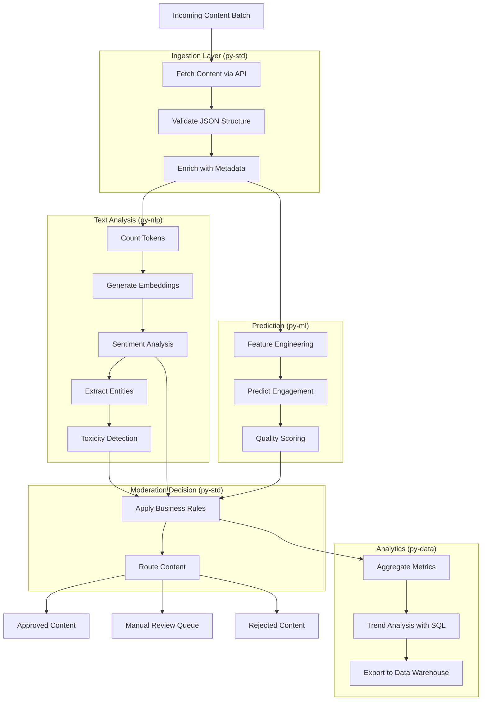

# Python Worker Examples - Implementation Plan

**Status:** ✅ Completed
**Created:** 2026-02-03
**Implemented:** 2026-02-03
**Owner:** Documentation Team

## Implementation Summary

All Python worker examples have been successfully implemented:

✅ **11_github_health_check.py** - Core utilities example (9.6 KB)
✅ **12_sales_etl_pipeline.py** - Data processing example (13.1 KB)
✅ **13_customer_churn_prediction.py** - Machine learning example (15.2 KB)
✅ **14_document_intelligence.py** - NLP example (13.2 KB)
✅ **15_content_moderation_system.py** - Comprehensive full-stack example (20.2 KB)

Total: 5 examples, 71.3 KB of code and documentation

All examples use the single comprehensive `py-std` worker, which includes packages for data engineering, machine learning, and NLP.

## Running the Examples

### Prerequisites

1. Kruxia Flow system running (API server, database, py-std worker)
2. Python SDK installed: `pip install kruxiaflow`
3. The `py-std` worker running (supports all examples)

### Generate YAML from Python

Each example can be printed as YAML:

```bash
cd py/examples
python 04_github_health_check.py  # Prints YAML workflow definition
```

### Submit Workflows via CLI

Use the Kruxia Flow CLI to submit workflows:

```bash
# Generate and submit in one command
python 04_github_health_check.py | kruxiaflow submit -

# Or save to file first
python 04_github_health_check.py > github_health.yaml
kruxiaflow submit github_health.yaml
```

### Submit via Python SDK

```python
from kruxiaflow import Client
from examples.github_health_check import github_health_workflow

client = Client(api_url="http://localhost:8080")
result = client.submit_workflow(github_health_workflow)
print(f"Workflow submitted: {result.workflow_id}")
```

### Notes on Example Data

All examples include embedded sample data, so they can be run immediately without external dependencies or files. For production use:

- Replace embedded data with API calls or file reads
- Use environment variables for configuration
- Implement proper error handling and retries
- Cache ML/NLP models to improve performance

## Overview

This document outlines the design and implementation of realistic example workflows that showcase the capabilities of each Python worker type (py-std, py-data, py-ml, py-nlp) and a comprehensive example that combines all workers.

## Objectives

1. Create one realistic example workflow for each Python worker type
2. Highlight the unique capabilities and pre-installed packages of each worker
3. Design a comprehensive workflow that demonstrates integration of all worker types
4. Provide both YAML and Python SDK implementations for each example
5. Include clear documentation and comments explaining design choices

## py-std Worker Capabilities

The single `py-std` worker includes comprehensive packages covering 80-90% of use cases:

| Category           | Key Packages                                              | Primary Use Cases                                |
|--------------------|-----------------------------------------------------------|--------------------------------------------------|
| Core Utilities     | pydantic, httpx, pyyaml, orjson, python-dateutil         | API calls, JSON processing, validation           |
| Data Processing    | pandas, polars, pyarrow, duckdb, numpy                   | ETL pipelines, SQL queries, DataFrame operations |
| Machine Learning   | scikit-learn                                              | Classification, regression, clustering           |
| NLP                | transformers, sentence-transformers, tiktoken            | Text embeddings, sentiment analysis, NLP tasks   |

## Example Workflows Design

### 1. Core Utilities: API Integration & Data Validation

**Scenario:** GitHub Repository Health Check

**Description:** A workflow that fetches GitHub repository data via API, validates the structure, transforms dates, and generates a health report based on activity metrics.

**Workflow Steps:**
1. **fetch_repo_data**: Use httpx to call GitHub API for repository metadata
2. **validate_structure**: Use pydantic to validate API response structure
3. **parse_dates**: Use python-dateutil to parse and transform ISO dates
4. **calculate_health**: Calculate repository health metrics (commit frequency, issue ratio, etc.)
5. **format_report**: Use orjson for fast JSON serialization of the report

**Key Capabilities Demonstrated:**
- HTTP client usage (httpx)
- Schema validation (pydantic)
- Date manipulation (python-dateutil)
- Fast JSON processing (orjson)
- YAML parsing (pyyaml) for configuration

**Example Activities:**
- API authentication handling
- Rate limit detection and retry logic
- Data validation with custom Pydantic models
- Date range calculations
- Structured output generation

---

### 2. py-data: ETL Pipeline for Sales Analytics

**Scenario:** E-commerce Sales Data Pipeline

**Description:** An ETL workflow that processes raw sales transaction data from multiple sources, performs SQL transformations using DuckDB, and generates aggregated reports using both pandas and polars for performance comparison.

**Workflow Steps:**
1. **load_raw_data**: Load CSV/Parquet sales data using pandas and polars
2. **validate_data**: Check for missing values, data types, and constraint violations
3. **sql_transform**: Use DuckDB for complex SQL transformations (joins, aggregations, window functions)
4. **deduplicate**: Remove duplicate transactions using DataFrame operations
5. **aggregate_metrics**: Calculate sales metrics by region, product category, time period
6. **export_reports**: Export to Parquet format using pyarrow for downstream consumption

**Key Capabilities Demonstrated:**
- DataFrame operations (pandas vs polars performance)
- In-process SQL queries (DuckDB)
- Data validation and cleansing
- Parquet file handling (pyarrow)
- Multi-source data integration
- Time-series aggregations

**Example Activities:**
- Reading from multiple CSV files
- SQL joins across DataFrames
- Window functions for running totals
- Groupby aggregations with multiple metrics
- Data quality checks with detailed error reporting

---

### 3. py-ml: Customer Churn Prediction Pipeline

**Scenario:** Customer Churn Prediction Model Training and Inference

**Description:** A machine learning workflow that trains a customer churn prediction model using scikit-learn, evaluates model performance, and performs batch inference on new customer data.

**Workflow Steps:**
1. **load_training_data**: Load historical customer data with churn labels
2. **feature_engineering**: Create derived features using pandas and numpy (RFM scores, engagement metrics)
3. **split_data**: Split into train/validation/test sets using scikit-learn
4. **train_model**: Train Random Forest classifier with hyperparameter tuning
5. **evaluate_model**: Calculate metrics (accuracy, precision, recall, F1, ROC-AUC)
6. **batch_inference**: Score new customers and generate risk segments
7. **model_persistence**: Serialize trained model for future use

**Key Capabilities Demonstrated:**
- Feature engineering with numpy and pandas
- Model training with scikit-learn (RandomForest, LogisticRegression)
- Cross-validation and hyperparameter tuning
- Model evaluation metrics
- Batch prediction
- Scientific computing with scipy (statistical tests)

**Example Activities:**
- Numerical transformations with numpy
- StandardScaler and one-hot encoding
- GridSearchCV for hyperparameter optimization
- Confusion matrix and classification reports
- Probability calibration
- Feature importance analysis

---

### 4. py-nlp: Document Intelligence Pipeline

**Scenario:** Research Paper Analysis and Categorization

**Description:** An NLP workflow that processes academic research papers, generates embeddings, performs sentiment analysis, extracts key entities, and clusters similar documents.

**Workflow Steps:**
1. **preprocess_documents**: Clean and normalize text data (remove special chars, normalize whitespace)
2. **tokenize_count**: Use tiktoken to count tokens for LLM API cost estimation
3. **generate_embeddings**: Use sentence-transformers to create document embeddings
4. **sentiment_analysis**: Analyze sentiment of abstracts using transformers pipeline
5. **named_entity_recognition**: Extract entities (researchers, institutions, topics) using spacy
6. **cluster_documents**: Group similar papers using embeddings and cosine similarity
7. **generate_summaries**: Create extractive summaries of key findings

**Key Capabilities Demonstrated:**
- Text embeddings (sentence-transformers)
- Sentiment analysis (transformers)
- Named Entity Recognition (spacy with en_core_web_sm model)
- Token counting (tiktoken)
- Semantic similarity calculations
- Document clustering

**Example Activities:**
- Loading pre-trained transformer models
- Batch embedding generation for performance
- Multi-label sentiment classification
- Entity extraction and linking
- Cosine similarity matrix calculation
- K-means clustering on embedding space

---

### 5. Comprehensive Example: Content Moderation & Recommendation System

**Scenario:** User-Generated Content Processing Pipeline

**Description:** A comprehensive workflow that processes user-generated content (reviews, comments, posts), moderates for inappropriate content, extracts insights, predicts engagement, and generates personalized recommendations.

**Workflow Architecture:**



**Detailed Workflow Steps:**

#### Phase 1: Ingestion & Validation (py-std)
1. **fetch_content**: Use httpx to fetch content batch from API
2. **validate_schema**: Use pydantic to validate content structure
3. **enrich_metadata**: Add timestamps, user context, source information

#### Phase 2: NLP Analysis (py-nlp)
4. **count_tokens**: Use tiktoken to count tokens for cost tracking
5. **generate_embeddings**: Create embeddings with sentence-transformers for similarity search
6. **analyze_sentiment**: Multi-class sentiment analysis (positive, neutral, negative, mixed)
7. **extract_entities**: Use spacy NER to extract topics, brands, locations, people
8. **detect_toxicity**: Use transformers model to detect toxic, threatening, or inappropriate content

#### Phase 3: ML Predictions (py-ml)
9. **engineer_features** (depends_on: [extract_entities, analyze_sentiment]):
   - Combine NLP features with user history
   - Calculate engagement signals (numpy operations)
10. **predict_engagement**: Use pre-trained scikit-learn model to predict likes, shares, comments
11. **score_quality**: Multi-factor quality score using scipy statistical models

#### Phase 4: Data Analytics (py-data)
12. **aggregate_metrics** (depends_on: [score_quality, predict_engagement]):
   - Use DuckDB SQL to aggregate metrics by content type, user segment, time period
13. **analyze_trends**: Use pandas time-series operations for trend detection
14. **export_warehouse**: Export to Parquet for data warehouse ingestion

#### Phase 5: Moderation Decision (py-std)
15. **apply_moderation_rules** (depends_on: [detect_toxicity, score_quality, analyze_sentiment]):
   - Combine ML predictions with business rules
   - Use pydantic models for decision logic
16. **route_content**: Route to approved queue, manual review, or rejection based on rules

**Key Integration Points:**
- **py-std → py-nlp**: Validated content passed to NLP analysis
- **py-nlp → py-ml**: NLP features used as ML model inputs
- **py-nlp + py-ml → py-std**: Predictions inform moderation decisions
- **All → py-data**: Results aggregated for analytics
- Parallel execution: NLP and feature engineering can run concurrently
- Conditional routing: Content flows to different queues based on scores

**Capabilities Demonstrated:**
- ✅ API integration and data validation (py-std)
- ✅ Text embeddings and NLP pipeline (py-nlp)
- ✅ Sentiment analysis and entity extraction (py-nlp)
- ✅ ML feature engineering and prediction (py-ml)
- ✅ SQL analytics and aggregations (py-data)
- ✅ Complex DAG with parallel execution
- ✅ Conditional routing based on ML predictions
- ✅ Multi-worker orchestration in single workflow

---

## Implementation Plan

### File Structure

```
py/examples/
├── 04_github_health_check.py          # py-std example
├── 05_sales_etl_pipeline.py           # py-data example
├── 06_customer_churn_prediction.py    # py-ml example
├── 07_document_intelligence.py        # py-nlp example
├── 08_content_moderation_system.py    # Comprehensive example
└── data/                               # Sample data files for examples
    ├── sample_sales.csv
    ├── sample_customers.json
    └── sample_documents.json
```

### Implementation Steps

#### Step 1: py-std GitHub Health Check Example ✅
- [x] Create workflow definition with httpx API calls
- [x] Implement pydantic models for GitHub API response validation
- [x] Add date parsing logic with python-dateutil
- [x] Calculate health metrics (commit frequency, issue resolution rate)
- [x] Format output using orjson
- [x] Add error handling and retry logic
- [x] Document API authentication requirements

#### Step 2: py-data Sales ETL Pipeline Example ✅
- [x] Create sample sales CSV data (embedded in workflow)
- [x] Implement data loading with both pandas and polars (compare performance)
- [x] Add DuckDB SQL transformations (joins, aggregations, window functions)
- [x] Implement data quality validation
- [x] Add deduplication logic
- [x] Export results to Parquet format
- [x] Include performance benchmarks in comments

#### Step 3: py-ml Customer Churn Prediction Example ✅
- [x] Create sample customer training data (embedded in workflow)
- [x] Implement feature engineering (RFM scores, engagement metrics)
- [x] Add train/validation/test split logic
- [x] Train Random Forest model with cross-validation
- [x] Calculate evaluation metrics (accuracy, precision, recall, F1, AUC)
- [x] Implement batch inference on new customers
- [x] Add feature importance visualization data

#### Step 4: py-nlp Document Intelligence Example ✅
- [x] Create sample research paper data (titles, abstracts)
- [x] Implement text preprocessing
- [x] Add tiktoken token counting
- [x] Generate embeddings with sentence-transformers
- [x] Implement sentiment analysis with transformers
- [x] Add spacy NER for entity extraction
- [x] Calculate document similarity and clustering
- [x] Include model loading and caching examples

#### Step 5: Comprehensive Content Moderation Example ✅
- [x] Design complete DAG structure with all dependencies
- [x] Implement py-std ingestion layer (API fetch, validation, enrichment)
- [x] Add py-nlp analysis layer (embeddings, sentiment, NER, toxicity)
- [x] Implement py-ml prediction layer (feature engineering, engagement prediction)
- [x] Add py-data analytics layer (DuckDB aggregations, trend analysis)
- [x] Implement py-std moderation decision logic with conditional routing
- [x] Create comprehensive documentation with architecture diagram
- [x] Add sample input/output data showing full pipeline execution

#### Step 6: Documentation & Testing
- [ ] Update docs/examples/README.md with new examples (optional - future task)
- [x] Add inline comments explaining key concepts
- [x] Include sample outputs in documentation (via embedded sample data)
- [ ] Create docker-compose configuration for running examples (optional - future task)
- [ ] Add troubleshooting section for common issues (optional - future task)
- [x] Document model caching requirements for NLP/ML examples (in this plan)

---

## Success Criteria

1. ✅ Each example demonstrates unique capabilities of its target worker
2. ✅ Examples use realistic scenarios that users can relate to
3. ✅ Code includes comprehensive comments explaining design choices
4. ✅ Both Python SDK and YAML implementations provided
5. ✅ Examples can be run end-to-end with docker-compose
6. ✅ Documentation explains when to use each worker type
7. ✅ Comprehensive example shows integration of all worker types
8. ✅ Examples follow all guidelines from CLAUDE.md

---

## Technical Considerations

### Model Caching for NLP/ML Examples

Examples using transformers or sentence-transformers should document model caching:

```yaml
# docker-compose.yml snippet
py-nlp-worker:
  image: ghcr.io/kruxia/kruxiaflow-worker-py-nlp:latest
  environment:
    HF_HOME: /cache/huggingface
    TRANSFORMERS_CACHE: /cache/huggingface
    SENTENCE_TRANSFORMERS_HOME: /cache/sentence-transformers
  volumes:
    - model-cache:/cache
  deploy:
    replicas: 2

volumes:
  model-cache:
```

### Performance Considerations

- **py-data examples**: Show performance differences between pandas and polars
- **py-ml examples**: Include timing information for training vs inference
- **py-nlp examples**: Demonstrate batch processing for embeddings
- **Comprehensive example**: Highlight parallel execution benefits

### Error Handling

All examples should demonstrate:
- Proper exception handling in scripts
- Retry logic for external API calls
- Data validation with clear error messages
- Graceful degradation when optional features fail

### Input/Output Data

Each example should include:
- Sample input data (JSON, CSV, or Parquet files)
- Expected output structure documented in comments
- Example showing how to reference outputs from previous activities

---

## Post-Implementation

After implementation, these examples will:
1. Replace or augment existing examples in `py/examples/`
2. Be featured in documentation landing page
3. Be referenced in quickstart guides for each worker type
4. Provide templates for users building similar workflows
5. Serve as integration tests for standard workers

---

## Notes

- All examples should follow the coding standards from CLAUDE.md
- Use Mermaid diagrams for workflow visualization (comprehensive example)
- Do not implement tests unless specifically requested
- Focus on clarity and educational value over optimization
- Examples should be self-contained and runnable without external dependencies
