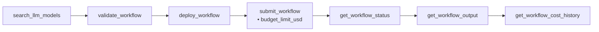

# MCP Server (AI Agents)

Kruxia Flow embeds an MCP (Model Context Protocol) server in the main binary, so
AI agents like Claude Code can drive the full workflow lifecycle: discover model
pricing, author a workflow, validate it, deploy it, submit it **with a hard
budget**, monitor it, and read token-level costs afterwards. If you have the
engine running, you already have the MCP server — no second install.



## Enabling

The MCP server is compiled into the official Docker image and enabled by
default in `docker-compose.yml` (published on `127.0.0.1:8081`). For source
builds it is feature-gated to keep edge binaries lean:

```bash
cargo build --release --features mcp-server
```

At runtime it is off unless enabled:

```bash
kruxiaflow serve --mcp-enabled            # or KRUXIAFLOW_MCP_ENABLED=true
```

| Setting                    | Flag / Env                                          | Default   |
|----------------------------|-----------------------------------------------------|-----------|
| Enable                     | `--mcp-enabled` / `KRUXIAFLOW_MCP_ENABLED`          | `false`   |
| HTTP port                  | `--mcp-http-port` / `KRUXIAFLOW_MCP_HTTP_PORT`      | `8081`    |
| Bind address               | `--mcp-http-bind` / `KRUXIAFLOW_MCP_HTTP_BIND`      | `0.0.0.0` |

The MCP endpoint is `http://<host>:8081/mcp` (Streamable HTTP).

## Connecting

### Claude Code

With the quickstart's insecure dev mode
(`KRUXIAFLOW_INSECURE_DEV=true docker compose up -d`), no token is needed:

```bash
claude mcp add --transport http kruxiaflow http://localhost:8081/mcp
```

Or check a `.mcp.json` into your project (this repository ships one):

```json
{
  "mcpServers": {
    "kruxiaflow": {
      "type": "http",
      "url": "http://localhost:8081/mcp"
    }
  }
}
```

With authentication enabled (any non-dev deployment), pass the same Bearer
token the REST API uses:

```bash
TOKEN=$(curl -s -X POST http://localhost:8080/api/v1/oauth/token \
  -H "Content-Type: application/x-www-form-urlencoded" \
  -d "grant_type=client_credentials&client_id=$CLIENT_ID&client_secret=$CLIENT_SECRET" \
  | jq -r .access_token)

claude mcp add --transport http kruxiaflow http://localhost:8081/mcp \
  --header "Authorization: Bearer $TOKEN"
```

### Cursor

`.cursor/mcp.json`:

```json
{
  "mcpServers": {
    "kruxiaflow": {
      "url": "http://localhost:8081/mcp",
      "headers": { "Authorization": "Bearer <token>" }
    }
  }
}
```

Omit `headers` in dev mode.

### Any MCP client

Point any Streamable-HTTP-capable MCP client at `http://localhost:8081/mcp`
with an `Authorization: Bearer <token>` header (not needed in dev mode).

## Authentication

One token works everywhere: the MCP server validates the same RS256 tokens as
the REST API, issued by `POST /api/v1/oauth/token` (client credentials grant).
There is no separate MCP secret or MCP token type.

In insecure dev mode (`KRUXIAFLOW_INSECURE_DEV=true`) the MCP server accepts
unauthenticated connections, matching the REST API and WebSocket surfaces.
The same loopback guard applies: a non-loopback MCP bind requires the explicit
`--insecure-dev-allow-nonloopback` opt-in (the compose file sets it and
publishes the port on `127.0.0.1` only).

## Tools (23)

**Discovery**

| Tool                           | Purpose                                                    |
|--------------------------------|------------------------------------------------------------|
| `list_workflow_definitions`    | What workflows are deployed                                |
| `get_workflow_definition`      | Full structure of one workflow                             |
| `list_activities`              | Catalog of built-in activity types                         |
| `get_workflow_authoring_guide` | How to write workflow YAML                                 |
| `search_llm_models`            | Model catalog with live pricing (the engine's own numbers) |
| `list_llm_providers`           | Configured providers and capabilities                      |
| `check_system_health`          | Readiness of database, event source, queue                 |

**Execution**

| Tool                | Purpose                                                          |
|---------------------|------------------------------------------------------------------|
| `validate_workflow` | Parse + validate YAML/JSON without touching the database         |
| `deploy_workflow`   | Persist a definition (idempotent by content)                     |
| `submit_workflow`   | Run a workflow — `budget_limit_usd` sets an engine-enforced cap  |

**Observability**

| Tool                        | Purpose                                                  |
|-----------------------------|----------------------------------------------------------|
| `get_workflow_status`       | Status, optionally per-activity detail                   |
| `list_workflows`            | Paginated list with status filter                        |
| `get_activity_output`       | One activity's output, cost, and files                   |
| `get_workflow_output`       | All outputs in one call, terminal activities marked      |
| `get_workflow_cost`         | Cost summary with budget utilisation                     |
| `get_workflow_cost_history` | Token-level line items: fallbacks, cache hits, budget events |
| `get_cost_analytics`        | Portfolio spend: totals, top workflows, budget events    |
| `estimate_workflow_cost`    | Pre-submit estimate from live pricing                    |

**Visualization**

| Tool                      | Purpose                          |
|---------------------------|----------------------------------|
| `render_workflow_diagram` | Mermaid flowchart of a workflow  |
| `render_cost_diagram`     | Mermaid cost breakdown           |

**Control**

| Tool                     | Purpose                                                       |
|--------------------------|---------------------------------------------------------------|
| `send_workflow_signal`   | Deliver a signal (whole workflow, or one activity)            |
| `list_waiting_workflows` | Find workflows blocked on signals (approval gates)            |
| `invalidate_cache`       | Drop cached activity results by key or pattern                |

`cancel_workflow` is intentionally absent until the engine gains a cancel
endpoint.

## A budget-governed session, end to end

What an agent connected over MCP typically does with a request like *"research
this topic, but don't spend more than 25 cents"*:

1. `search_llm_models {"name": "claude"}` — pick a model with current pricing.
2. `validate_workflow` — check the YAML it authored.
3. `deploy_workflow` — persist the definition.
4. `estimate_workflow_cost` — sanity-check the spend against the intended cap.
5. `submit_workflow {"definition_name": "research", "input": {...}, "budget_limit_usd": 0.25}`
   — the engine enforces the cap during execution: over-budget activities are
   aborted or downgraded to cheaper fallback models.
6. `get_workflow_status` → `get_workflow_output` — collect results.
7. `get_workflow_cost_history` — report what was actually spent, token by
   token, including cache hits and any budget events.

This exact flow, run live by Claude Code against a dev instance, is captured
in [a worked transcript](20260719-051243-mcp-demo.md): estimated $0.0019,
actual $0.001472 — 2.9% of the 5-cent cap, verified against the engine's cost
records.

## Why HTTP only (no stdio)

The MCP server runs inside `kruxiaflow serve` alongside the API server,
orchestrator, and workers — all of which log to stdout/stderr. MCP's stdio
transport requires exclusive, clean stdin/stdout, and spawning a per-client
stdio process would mean booting a full engine (with database configuration)
per agent session. Modern clients (Claude Code, Cursor) speak HTTP MCP
natively. A thin stdio→HTTP proxy may be revisited if demand shows up.
