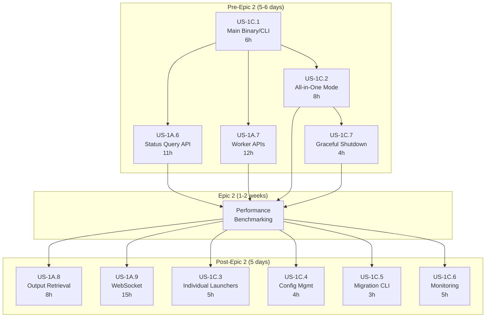

# StreamFlow v0.2 Product Requirements Document

**Version**: 0.2.0
**Date**: November 26, 2025
**Status**: In Development - Core Complete, US-5.7a + Example 10 → MVP Feature-Complete
- **Epic 1**: ✅ Complete (Event-Driven Orchestration)
- **Epic 1A**: ✅ Complete (API Server - 8/9 stories complete, including US-1A.9a WebSocket)
- **Epic 1B**: ✅ Complete (Built-in Worker)
- **Epic 1C**: ⏳ Partial (StreamFlow Binary - US-1C.1, US-1C.2, US-1C.7 complete)
- **Epic 2**: ✅ Complete (Performance Benchmarking - US-2.1, US-2.2 complete)
- **Epic 3**: ✅ 90% Complete (YAML Workflows - Examples 1-9 ✅, Example 10 📋)
- **Epic 5**: ⏳ 90% Complete (Built-In Activities - US-5.1 ✅, US-5.3 ✅, US-5.4 ✅, US-5.5 ✅, US-5.6 ✅, US-5.7a 📋)
- **Epic 7**: ✅ US-7.1 Complete (Token Streaming via WebSocket)

**Next**: US-5.7a (email_send) → Example 10 (Order Processing) → MVP orchestrator/worker feature-complete
**Target Release**: Q1 2026 with full AI-native feature set
**Test Coverage**: 82.20% (target >90%)

---

## Executive Summary

StreamFlow v0.2 addresses critical issues discovered in v0.1 while positioning the platform to capture the emerging $80B+ convergence of workflow orchestration and AI agent markets. The product combines performance-critical orchestration (Rust, event-driven, PostgreSQL-optimized) with AI-native features (cost controls, token streaming, multi-provider LLM support) in an operationally simple package (single 10MB binary, 50MB RAM).

**Core Value Proposition**: Production-ready AI orchestration with operational simplicity—the only platform combining deterministic workflow execution with non-deterministic AI agents, built-in cost controls, and edge deployment capability.

**Primary Business Goals**:
- Achieve >1,000 workflows/sec (10x competitor baseline)
- Enable edge AI orchestration (completely unserved market)
- Solve AI cost control crisis (universal pain point, no current solution)
- Deliver operational simplicity (single binary vs multi-service architectures)

---

## User Personas

### Primary Personas

**P1: AI/ML Startup Engineer** (Tier 1 Target)
- Role: Engineering Lead or Senior Backend Engineer
- Company: <200 employees, well-funded AI/ML startup
- Pain: GPU scheduling issues (74% dissatisfied), runaway LLM costs ($14.40/task), complex deployment
- Budget: $10K-50K initially, growing to $50K-200K at scale
- Decision cycle: 2-8 weeks
- Success metrics: GPU utilization >85%, LLM cost reduction 50-80%, deploy time <1 hour

**P2: Platform Engineering Lead** (Tier 1 Target)
- Role: Staff/Principal Engineer, Platform Team Lead
- Company: Tech company (200-5000 employees)
- Pain: Operational complexity (Temporal "tremendous growing pains"), developer velocity, infrastructure costs
- Budget: $50K-250K initially, $250K-1M at scale
- Decision cycle: 2-6 months
- Success metrics: 60%+ infrastructure cost savings, 3x developer productivity, <5 min deployment

**P3: Edge Computing Architect** (Tier 2 Target)
- Role: IoT/Edge Solutions Architect
- Company: Manufacturing, retail, or IoT company
- Pain: No orchestration works on edge devices, resource constraints (CPU/RAM), disconnected operation
- Budget: $100K-500K annual contracts
- Decision cycle: 6-18 months
- Success metrics: Deploy on Raspberry Pi, 50MB RAM footprint, offline operation

### Secondary Personas

**P4: Data Engineer migrating from Airflow** (Opportunistic)
**P5: Enterprise DevOps Engineer** (Year 2+)
**P6: AI Researcher** (Academic/Research)

---

## Epic 1: Event-Driven Orchestration Architecture

**Business Objective**: Solve v0.1 performance issues and enable >1,000 workflows/sec with guaranteed execution ordering

### User Stories

**US-1.1: Activity Queue with Ordering Guarantees** ✅ Complete
- **As** an AI startup engineer
- **I want** workflows to execute activities in the correct sequence without manual coordination
- **So that** my multi-step AI pipelines produce consistent results
- **Acceptance Criteria**:
  - Activities only scheduled when all dependencies satisfied
  - Sequential workflows execute in exact order (validate → authorize → capture)
  - Parallel activities execute simultaneously when all dependencies met
  - No race conditions or duplicate execution
  - PostgreSQL UNIQUE constraint prevents duplicate scheduling
- **Technical Notes**: See architecture section 1.1-1.6 in v02-sonnet.md

**US-1.2: Event-Driven Dynamic Scheduling** ✅ Complete
- **As** a platform engineering lead
- **I want** the orchestrator to reactively schedule activities only when ready
- **So that** we achieve <10ms P99 workflow start latency
- **Acceptance Criteria**:
  - Orchestrator subscribes to workflow state events
  - On activity completion, orchestrator re-evaluates workflow
  - Only ready activities scheduled to queue
  - Idempotent scheduling (ON CONFLICT DO NOTHING)
  - Support for 1,000+ workflows/sec sustained throughput
- **Performance Target**: >1,000 workflows/sec, <10ms P99 start latency

---

## Epic 1A: API Server

**Business Objective**: Provide HTTP/REST API for workflow submission, management, and monitoring to enable client applications and AI agents to interact with StreamFlow

### User Stories

**US-1A.1: Health Check and Service Discovery** ✅ Complete
- **As** a platform engineering lead
- **I want** standard health and readiness endpoints
- **So that** load balancers and orchestrators can manage API servers
- **Acceptance Criteria**:
  - `GET /health` - Liveness probe (returns 200 if server is running)
  - `GET /health/ready` - Readiness probe (returns 200 if can handle requests)
    - Readiness checks: Database connectivity, event source availability
  - `GET /api/v1/info` - Service information (version, build, capabilities)
    - Response format: `{version, build_timestamp, build_git_hash, api_version, features: []}`
- **Implementation**: See `docs/implementation/US-1A.1-health-checks.md`

**US-1A.1.5: API Server CLI Launcher** ✅ Complete
- **As** a developer
- **I want** to launch the API server via `streamflow api` command
- **So that** I can develop and test the API endpoints independently
- **Acceptance Criteria**:
  - Main binary crate `streamflow` with CLI framework (clap)
  - `streamflow api` command launches HTTP server on specified port
  - Configuration via CLI flags: `--port`, `--bind`, `--database-url`
  - Configuration via environment variables: `DATABASE_URL`, `STREAMFLOW_API_PORT`, `STREAMFLOW_API_BIND`
  - Configuration precedence: CLI flags > Environment variables > Defaults
  - Default configuration: Port 8080, bind to 0.0.0.0
  - Database connection pool initialization with validation
  - Graceful shutdown on SIGTERM/SIGINT
  - Logging: Structured logging with configurable level (via `--log-level` or `STREAMFLOW_LOG_LEVEL`)
  - Startup logging: Log configuration and successful startup
  - Health endpoints accessible after startup
- **Scope**: Minimal implementation from Epic 1C focused only on API server launcher
- **Implementation**: See `docs/implementation/US-1A.1.5-api-server-launcher.md`

**US-1A.2: Error Handling and API Contracts** ✅ Complete
- **As** an AI startup engineer
- **I want** consistent error responses and API documentation
- **So that** I can handle errors gracefully and integrate easily
- **Acceptance Criteria**:
  - Standard error format: `{error: {code, message, details}}`
  - HTTP status codes: 401 (auth), 404 (not found), 409 (conflict), 422 (validation), 500 (server error)
  - Validation errors include field-level details
  - OpenAPI 3.0 specification published at `/api/v1/openapi.json`
  - API documentation UI: Swagger at `/api/v1/docs`
  - Request ID in response headers for tracing: `X-Request-ID`
  - CORS support for browser-based clients

**US-1A.3: Authentication** ✅ Complete
- **As** a platform engineering lead
- **I want** API authentication
- **So that** only authenticated clients can submit and query workflows
- **Acceptance Criteria**:
  - Bearer token authentication: `Authorization: Bearer <token>`
  - RSA256 Signed JWT tokens issued by AuthenticationService (PostgresAuthService for MVP)
  - `POST /api/v1/auth/token` - Issue token with credentials (username/password or API key)
  - Token expiration: Configurable TTL (default 24 hours)
  - Authorization checks: Validate RSA256 signed token on all protected endpoints
  - 401 Unauthorized for missing/invalid tokens with helpful error message
  - Rate limiting per token: Configurable requests per minute

**US-1A.4: Workflow Definition Management API** ✅ Complete
- **As** an AI startup engineer
- **I want** to deploy and manage workflow definitions separately from execution
- **So that** I can version and reuse workflow templates
- **Acceptance Criteria**:
  - `POST /api/v1/workflow_definitions` - Deploy workflow definition with name
  - `GET /api/v1/workflow_definitions` - List all deployed definitions
  - `GET /api/v1/workflow_definitions/{name}` - Get latest version of definition
  - `GET /api/v1/workflow_definitions/{name}?version={version}` - Get specific version
  - Validation on deployment: Syntax and semantic checks before storage
  - Versioning: Auto-generated timestamp version (YYYYmmdd.HHMMSS.uuuuuu)
- **Implementation**: See `docs/implementation/US-1A.4-workflow-definition-management.md`

**US-1A.5: Workflow Submission API** ✅ Complete
- **As** an AI startup engineer.
- **I want** to submit workflows via HTTP API
- **So that** my applications can trigger workflows programmatically
- **Acceptance Criteria**:
  - `POST /api/v1/workflows` - Submit workflow with definition and input parameters
  - Request body: `{definition_name, version, input, unique_key}`
    (JSON, optional version, optional unique_key)
  - Response: `{workflow_id, status, created_at}` with 201 Created
  - Workflow definition not found: 404 Not Found
  - Validation: Reject invalid body or invalid input for the given workflow definition with 422 Unprocessable Entity
  - Idempotency: Optional `unique_key` body parameter to prevent duplicate submissions: 409 Conflict
  - Async execution: API creates workflow and workflow event then returns immediately, workflow runs in background
- **Example**: `POST /api/v1/workflows` with `{"definition_name": "payment", "input": {"amount": 100.00}}`
- **Implementation Plan**: See `docs/implementation/US-1A.5-workflow-submission.md`

**US-1A.6: Workflow Status and Query API** ✅ Complete
- **As** a platform engineering lead
- **I want** to query workflow status and results via API
- **So that** I can monitor execution and retrieve outputs
- **Acceptance Criteria**:
  - `GET /api/v1/workflows/{workflow_id}` - Get workflow status and state
  - Response includes: `{id, status, workflow_type, created_at, updated_at, state_data}`
  - `GET /api/v1/workflows/{workflow_id}/activities` - List all activities with their states
  - `GET /api/v1/workflows?status=running&limit=100` - List workflows with filters
  - Pagination: `limit` (default 100) and `offset` (default 0) parameters
  - Filter parameters: `status`, `workflow_type`, `created_after`, `created_before`
- **Implementation**: See `docs/implementation/US-1A.6-workflow-status-query.md`

**US-1A.7: Worker Activity APIs** ✅ Complete
- **As** an activity worker
- **I want** HTTP APIs to poll for activities, send heartbeats, and report results
- **So that** I can execute activities in distributed environments without direct database access
- **Acceptance Criteria**:
  - `POST /api/v1/workers/poll` - Poll for activities by activity type
    - Request body: `{activity_types: ["worker.name"], worker_id, max_activities: 10}`
    - Response: `[{activity_id, workflow_id, activity_key, parameters, timeout}]`
    - Uses ActivityQueue::poll() internally with FOR UPDATE SKIP LOCKED
  - `POST /api/v1/activities/{activity_id}/heartbeat` - Send heartbeat to prevent timeout
    - Request body: `{worker_id}`
    - Response: `{acknowledged: true, next_heartbeat_seconds: 30}`
  - `POST /api/v1/activities/{activity_id}/complete` - Report successful completion
    - Request body: `{worker_id, output, cost_usd}`
    - Response: `{acknowledged: true}`
    - Publishes activity completion event to workflow orchestrator
  - `POST /api/v1/activities/{activity_id}/fail` - Report activity failure
    - Request body: `{worker_id, error: {code, message, retryable}}`
    - Response: `{acknowledged: true, will_retry: boolean}`
  - Worker authentication: Bearer token
  - Timeout handling: Activities not heartbeat within timeout are released for retry
  - Idempotency: Activities can only be completed/failed once (409 Conflict if already
    done or timed out / reassigned)

**US-1A.7.5: Convert Monetary Values to Decimal Type** ✅ **Complete**
- **As** a platform engineering lead
- **I want** all monetary values (cost_usd) to use decimal types instead of floating-point
- **So that** we have exact precision for financial data and avoid rounding errors
- **Acceptance Criteria**:
  - Add `rust_decimal` dependency to Cargo.toml
  - Enable `rust_decimal` feature in sqlx
  - Change all `cost_usd` fields from `f64` to `Decimal` in:
    - API request/response types (`CompleteActivityRequest`, etc.)
    - Service layer methods (`ActivityWorkerService::complete_activity`)
    - Database schema (`workflow_events.payload` JSON fields)
  - Create database migration to change cost columns to `NUMERIC(15, 6)` type
  - Update validation logic to work with Decimal (negative checks, range checks)
  - Update OpenAPI schema to show cost_usd as string type (correct for JSON)
  - JSON serialization: cost_usd serializes as string (e.g., "0.015000")
  - All tests updated to use Decimal
  - Zero cargo warnings
- **Rationale**: Floating-point arithmetic (`f64`) has precision issues that are unacceptable for financial data. Using `f64` for costs will lead to rounding errors in billing calculations. Decimal types provide exact arithmetic required for monetary values.
- **Scope**: Affects only cost tracking fields (currently only in worker activity APIs). Localized change to a few files before production deployment.
- **Performance**: Negligible impact - cost tracking is not in hot path, and Decimal arithmetic overhead is acceptable for financial accuracy.

**US-1A.8: Activity Results and Output Retrieval** 📋 **Post-Epic 2 (Deferred)**
- **As** an AI researcher
- **I want** to retrieve activity outputs and workflow results via API
- **So that** I can access computation results for downstream processing
- **Acceptance Criteria**:
  - `GET /api/v1/workflows/{workflow_id}/activities/{activity_key}/output` - Get activity output
    - Response includes: `{activity_key, output, cost_usd, completed_at}`
    - Large outputs: Return reference to artifact storage with signed URL
    - 404 if activity not completed or doesn't exist
  - `GET /api/v1/workflows/{workflow_id}/output` - Get final workflow output
    - Output format: JSON with activity outputs accessible by key
- **Deferral Rationale**: US-1A.6 status query includes outputs in `state_data`. Dedicated output retrieval endpoints can be added after Epic 2 performance validation.

**US-1A.9a: WebSocket Infrastructure for Token Streaming** ✅ **COMPLETE**
- **As** an AI startup engineer
- **I want** WebSocket infrastructure to support token-by-token streaming from LLM activities
- **So that** users see real-time responses (ChatGPT-style UX) in AI workflows
- **Acceptance Criteria**:
  - ✅ WebSocket endpoint: `WS /api/v1/activities/{id}/stream`
  - ✅ Authentication: Bearer token in query parameter or initial message
  - ✅ Connection management: Handle 1,000+ concurrent connections
  - ✅ Message format: `{type: "token", text: "hello", index: 0}` or `{type: "complete", ...}`
  - ✅ Backpressure handling to prevent buffer overflow
  - ✅ Graceful connection close on activity completion
  - ✅ Error handling: Stream errors as messages before closing
- **Duration**: ~15 hours (2 days) - **Completed**
- **Dependencies**: None (builds on existing Axum HTTP server)
- **Strategic Rationale**: Token streaming is a core differentiator and requirement for AI-native positioning. Required for production AI workflows with user-facing UX. Delivers on Executive Summary promise of "token streaming" as AI-native feature.
- **Implementation Plan**: See `docs/implementation/US-1A.9a-websocket-infrastructure.md`

**US-1A.9b: WebSocket Streaming for Workflow Events** 📋 **Post-MVP (Deferred)**
- **As** an AI startup engineer
- **I want** real-time workflow execution updates via WebSocket
- **So that** my UI can show live progress without polling
- **Acceptance Criteria**:
  - Subscribe to all workflows: `WS /api/v1/ws/workflow_events`
  - Subscribe to 1 or more workflows: `WS /api/v1/ws/workflow_events?workflow_id=id1,id2...`
  - Subscribe to specific events: `WS /api/v1/ws/workflow_events?event_type=WorkflowCreated,...`
  - Stream events (PascalCase): `WorkflowCreated`, `ActivityScheduled`,
    `ActivityCompleted`, `WorkflowCompleted`, `ActivityFailed`, `WorkflowFailed`
  - Event payload: `{event_type, workflow_id, activity_key, timestamp, payload}`
  - Authentication: Bearer token in query parameter or initial message
  - Automatic reconnection support with last event ID for replay (`?event_id=...`)
- **Serialization Format**: All event types use **PascalCase** (matches PostgreSQL enum and Rust enum variants)
- **Deferral Rationale**: US-1A.9a (token streaming) takes priority for MVP as a core differentiator. General workflow event streaming (US-1A.9b) can be added post-MVP. Polling via US-1A.6 is sufficient for basic workflow monitoring.

---

## Epic 1B: Built-in Worker ✅ Complete

**Business Objective**: Provide a built-in activity worker that uses the API server, ensuring consistent behavior between built-in and external workers while validating API functionality under real load

### User Stories

**US-1B.1: Worker Polling with Concurrency Safety** ✅ Complete
- **As** a platform engineering lead
- **I want** multiple workers (built-in and external) to safely poll the activity queue without conflicts
- **So that** we can scale horizontally without coordination overhead
- **Acceptance Criteria**:
  - Workers poll by activity type (worker.name) via API endpoints
  - PostgreSQL FOR UPDATE SKIP LOCKED prevents conflicts (enforced by API)
  - Workers claim activities atomically
  - Failed workers release activities for retry
  - No external coordination required (Redis, Zookeeper)
  - Built-in worker uses same API endpoints as external workers
- **Technical Notes**:
  - Built-in worker authenticates via JWT (same as external workers)
  - Uses `/api/v1/workers/poll` endpoint for claiming activities
  - Uses `/api/v1/activities/{id}/complete` and `/api/v1/activities/{id}/fail` for reporting results
  - See architecture.md section on Built-in Worker design tradeoffs

**Architecture Decision: Built-in Worker Uses API Server**

The built-in worker is implemented as an HTTP client to the API server rather than directly accessing service interfaces. This design choice prioritizes:

**Benefits**:
- **Code path consistency**: Built-in and external workers execute identical logic, eliminating behavior divergence
- **Testing leverage**: Built-in worker automatically validates API endpoints under real load
- **Single authentication model**: One auth flow to document, secure, and maintain
- **Future-proof**: Easy to separate built-in worker into standalone service later
- **Dogfooding**: Forces API design to be good enough for internal use

**Trade-offs**:
- **HTTP overhead**: ~1-2ms serialization and localhost network latency per operation
- **Startup dependencies**: API server must be running before worker can start
- **Extra HTTP client**: Worker needs reqwest/http client dependency

**Performance Impact**: The 1-2ms HTTP overhead per activity is negligible compared to:
- Typical activity execution time (seconds to minutes)
- Current ~10ms event polling latency
- MVP target >1,000 workflows/sec (easily achievable with this overhead)

**Post-MVP Optimization**: If HTTP overhead becomes a bottleneck, an internal fast path can be added while maintaining the same API contract for external workers.

---

## Epic 1C: StreamFlow Binary and CLI

**Business Objective**: Provide a unified binary and CLI interface to launch and manage StreamFlow services, enabling single-binary deployment and flexible service orchestration

### User Stories

**US-1C.1: Main Binary and CLI Framework** ✅ Complete
- **As** a platform engineering lead
- **I want** a single binary with subcommands to launch different services
- **So that** I can deploy StreamFlow with minimal dependencies
- **Acceptance Criteria**:
  - Main crate `streamflow` that depends on `core`, `api`, and `worker` crates
  - CLI framework (clap) with subcommands for different services
  - Subcommands: `serve`, `orchestrator`, `api`, `worker`, `version`, `migrate`
  - Global flags: `--config`, `--log-level`, `--log-format`, `--database-url`
  - Help text and examples for each subcommand
  - Binary size: <15MB release build
  - Version information: `streamflow --version` shows semantic version and build info

**US-1C.2: Service Launcher - All-in-One Mode** ✅ **COMPLETE**
- **As** a developer
- **I want** to launch all services together with one command
- **So that** I can quickly start StreamFlow for development or single-node deployment
- **Acceptance Criteria**:
  - `streamflow serve` launches orchestrator + API server + built-in worker(s)
  - Configuration: `--port` (API port, default 8080), `--workers` (worker count, default 1)
  - Service startup order: Database connectivity check → Orchestrator → API server → Workers
  - Health checks: Wait for each service to be ready before starting next
  - Graceful shutdown: SIGTERM/SIGINT stops all services cleanly (drain workers, close connections)
  - Logging: Structured JSON or human-readable format (configurable)
  - All services share same database connection pool
- **Implementation**: `streamflow serve` command in `streamflow/src/commands/serve.rs`. See `docs/implementation/US-1C.2-all-in-one-launcher.md` for details.

**US-1C.3: Service Launcher - Individual Services** 📋 **Post-Epic 2 (Deferred)**
- **As** a platform engineering lead
- **I want** to launch services independently for distributed deployment
- **So that** I can scale orchestrator, API, and workers separately
- **Acceptance Criteria**:
  - `streamflow orchestrator` - Launch orchestrator only
    - Flags: `--consumer-id` (for event consumer checkpointing)
  - `streamflow api` - Launch API server only
    - Flags: `--port` (default 8080), `--bind` (default 0.0.0.0)
  - `streamflow worker` - Launch worker only
    - Flags: `--activity-types` (worker.name list), `--api-url`, `--worker-id`
  - Each service can run on different hosts/containers
  - Environment variable configuration: `DATABASE_URL`, `STREAMFLOW_API_URL`, etc.
- **Deferral Rationale**: All-in-one mode (US-1C.2) is sufficient for Epic 2 benchmarking. Distributed deployment can be validated after performance baseline is established.

**US-1C.4: Configuration Management** ✅ Complete
- **As** a platform engineering lead
- **I want** flexible configuration via environment variables and CLI flags
- **So that** I can deploy StreamFlow in different environments without code changes
- **Acceptance Criteria**:
  - Configuration precedence: CLI flags > Environment variables > Defaults
  - Environment variables: `DATABASE_URL`, `STREAMFLOW_API_PORT`, `STREAMFLOW_LOG_LEVEL`, etc.
  - Configuration validation on startup (fail fast with clear error messages)
  - Sensitive values: Support for environment variables (no secrets in CLI arguments)
  - Configuration logging: Print effective configuration on startup (redact secrets)
- **Deferral Rationale**: Basic configuration via environment variables and CLI flags already exists. Enhanced configuration management can be added after Epic 2 based on operational insights.

**US-1C.5: Database Migration Management** 📋 **Post-Epic 2 (Deferred)**
- **As** a platform engineering lead
- **I want** to manage database migrations via CLI
- **So that** I can control schema updates independently of service startup
- **Acceptance Criteria**:
  - `streamflow migrate` - Run pending migrations (uses sqlx migrate)
  - `streamflow migrate --status` - Show migration status
  - `streamflow migrate --revert` - Revert last migration (with confirmation)
  - Migration directory: Embedded in binary or external path via `--migrations-dir`
  - Migration history: Track applied migrations in database
  - Idempotent: Safe to run multiple times
  - Automatic migration on `streamflow serve` (optional via `--auto-migrate` flag)
- **Deferral Rationale**: Can use `sqlx migrate` directly for Epic 2. CLI wrapper provides convenience but is not essential for benchmarking.

**US-1C.6: Health Checks and Service Monitoring** 📋 **Post-Epic 2 (Deferred)**
- **As** a platform engineering lead
- **I want** CLI commands to check service health and status
- **So that** I can monitor StreamFlow in production
- **Acceptance Criteria**:
  - `streamflow health` - Check if all services are healthy
    - Checks: Database connectivity, API server reachability, orchestrator running
    - Exit code: 0 (healthy), 1 (unhealthy)
  - `streamflow status` - Show detailed service status
    - Output: Service names, health status, uptime, version
  - Health check timeout: Configurable (default 5s)
  - Output formats: Human-readable text or JSON (via `--format json`)
- **Deferral Rationale**: Basic health endpoints from US-1A.1 are sufficient for Epic 2. Enhanced CLI monitoring tools can be informed by Epic 2 metrics requirements.

**US-1C.7: Graceful Shutdown and Signal Handling** ✅ **COMPLETE**
- **As** a platform engineering lead
- **I want** services to shut down gracefully on SIGTERM/SIGINT
- **So that** workflows and activities complete without data loss
- **Acceptance Criteria**:
  - SIGTERM/SIGINT handling: Initiate graceful shutdown
  - Shutdown sequence:
    1. Stop accepting new workflows (API graceful shutdown with `with_graceful_shutdown()`)
    2. Wait for in-flight activities to complete (configurable timeout via `--shutdown-timeout`, default 30s)
    3. Close database connections
    4. Exit with code 0
  - SIGKILL handling: Force immediate shutdown (no cleanup)
  - Shutdown timeout: Configurable via `--shutdown-timeout` (default 30s)
  - Worker drain: Workers finish current activities before exiting
  - Logging: Log shutdown progress and any errors
- **Implementation**: Integrated into `streamflow serve` command using `CancellationToken` and `with_graceful_shutdown()`. See `docs/implementation/US-1C.7-graceful-shutdown.md` for details.

### Implementation Notes

**Crate Structure**:
```
streamflow/
├── core/           # Core orchestration logic (queue, orchestrator, events)
├── api/            # API server (Axum HTTP server)
├── worker/         # Built-in worker implementation
└── main/           # Main binary and CLI (depends on all above)
    ├── src/
    │   ├── main.rs           # CLI entry point
    │   ├── commands/         # Subcommand implementations
    │   │   ├── serve.rs
    │   │   ├── orchestrator.rs
    │   │   ├── api.rs
    │   │   ├── worker.rs
    │   │   ├── migrate.rs
    │   │   └── health.rs
    │   ├── config.rs         # Configuration management
    │   └── signals.rs        # Signal handling
    └── Cargo.toml
```

**Dependencies**:
- `clap` - CLI parsing with derive macros
- `tokio` - Async runtime for all services
- `tracing`/`tracing-subscriber` - Structured logging
- `serde` - Configuration deserialization
- `sqlx` - Database migrations

**Service Coordination**:
- All services share same database connection pool (configured in main)
- Services communicate via database (orchestrator → queue, API → queue)
- Built-in worker communicates with API via HTTP (as designed in Epic 1B)

---

## Epic 2: Performance Benchmarking and Validation

**Business Objective**: Establish early performance baseline and prove 10x advantage over competitors

**Strategic Rationale**: Benchmarking immediately after Epic 1 (core orchestration) validates the fundamental architectural claims before investing in additional features. Early detection of bottlenecks prevents building on a weak foundation. This provides a pure baseline for orchestration performance and informs Epic 3 (YAML) design decisions.

### User Stories

**U✅ S-2.1: Automated Performance Test Suite** ✅ **COMPLETE**
- **As** a platform engineering lead
- **I want** continuous performance benchmarking from day one
- **So that** we detect regressions early and stay on performance track
- **Acceptance Criteria**:
  - Benchmark scenarios: Sequential workflow, parallel workflow, high-concurrency
  - Metrics: Workflow throughput (wf/sec), start latency (P50/P95/P99), activity latency
  - CI integration: Run on every commit to main
  - Performance regression detection: Fail if >10% slower
  - Historical trend tracking
  - **Programmatic workflows**: Use Rust WorkflowDefinition structs, not YAML
  - **Early Baseline**: Establish performance floor after Epic 1 implementation

**US-2.2: Competitor Comparison Benchmarks** ✅ **COMPLETE**
- **As** a platform engineering lead
- **I want** reproducible benchmarks vs Temporal, Airflow, Conductor
- **So that** I can prove 10x performance to leadership and validate our architecture early
- **Acceptance Criteria**:
  - Same workflow implemented on each platform
  - Same hardware (number of CPU cores, AWS EC2 instance specifications) for each platform
  - Docker Compose setup for reproducibility
  - Published methodology: Open-source on GitHub
  - Results: HTML report with charts
  - Target proof: StreamFlow >1,000 wf/sec vs Temporal/Conductor 35-100 wf/sec
  - **Critical**: Run after Epic 1 to validate event-driven architecture
- **Implementation**: Complete benchmark suite in `benchmarks/` directory with StreamFlow, Temporal, and Airflow benchmarks. See `docs/implementation/US-2.2-competitor-comparison-benchmarks.md` for details.
- **Results** (v0.2.0 MVP baseline):
  - **StreamFlow**: 17-123 wf/sec (avg 56 wf/sec) - 100% success rate
  - **Temporal**: 14-65 wf/sec (avg 35 wf/sec) - 100% success rate
  - **Airflow**: 0.33-3.1 wf/sec (avg 1.3 wf/sec) - 3-16% success rate (configuration issues)
  - **Speedup**: 1.6x faster than Temporal, 44x faster than Airflow
  - **Note**: Pre-optimization baseline. Target >1,000 wf/sec achievable with Epic 6 (PostgreSQL optimization)

**US-2.3: PostgreSQL Performance Profiling**
- **As** a platform engineering lead
- **I want** detailed profiling of PostgreSQL query performance
- **So that** we identify optimization opportunities before scaling complexity
- **Acceptance Criteria**:
  - Query execution plans for all hot paths
  - Identify slow queries (>10ms)
  - Index usage analysis
  - Connection pool utilization metrics
  - Lock contention detection
  - Recommendations for Epic 6 (PostgreSQL Optimization)

**US-2.4: Stress Testing and Capacity Planning**
- **As** a platform engineering lead
- **I want** early stress test results showing breaking points
- **So that** I understand system limits before adding more features
- **Acceptance Criteria**:
  - Stress test: Ramp to 10,000 concurrent workflows
  - Identify bottlenecks: Database, CPU, memory, network
  - Capacity recommendations: "N orchestrator + M workers handles P,000 workflows/min"
  - Failure modes: Graceful degradation, not crashes
  - Load test tool provided
  - Document baseline capacity for future comparison

**US-2.5: Grafana Performance Dashboard**
- **As** a platform engineering lead
- **I want** real-time performance metrics via Grafana
- **So that** we catch performance issues immediately during feature development
- **Acceptance Criteria**:
  - Prometheus metrics endpoint (`/metrics`) exposing StreamFlow metrics
  - Grafana dashboard template with key performance metrics:
    - Real-time workflow throughput (workflows/sec)
    - Workflow start latency percentiles (P50, P95, P99)
    - Activity queue depth over time
    - Database performance (queries/sec, connection pool utilization)
    - Active workflows count
  - PostgreSQL datasource configuration for querying workflow data directly
  - Grafana alerting rules for performance degradation (>10% throughput drop, latency spike)
  - Dashboard export (JSON) included in repository
- **Scope**: Focused on Grafana-native capabilities only
- **Deferred to Epic 10**: Custom web UI for workflow inspection, execution history, activity traces

---

# StreamFlow v0.3 Product Requirements Document

## Epic 3: YAML Workflow Definition Language

**Business Objective**: Enable 70-80% of workflows to be expressed declaratively for non-developers and rapid prototyping

**Strategic Rationale**: With Epic 2 benchmarks establishing performance baseline, Epic 3 adds YAML DSL with confidence that parsing overhead won't compromise throughput targets. Performance data from Epic 2 informs YAML feature decisions.

### User Stories

**US-3.1: Declarative Sequential Workflows**
- **As** an AI startup engineer
- **I want** to define workflows in simple YAML without programming
- **So that** I can rapidly prototype and iterate on AI pipelines
- **Acceptance Criteria**:
  - Activities defined with key, worker, name, parameters
  - Sequential execution via `dependent_key` edges
  - Template expressions for parameter passing: `{{validate_payment.card_token}}`
  - Support for workflow input: `{{ARG.amount}}`
  - Outputs declared per activity
- **Example**: Payment processing workflow (validation → authorization → capture)

**US-3.2: Conditional Branching**
- **As** an AI researcher
- **I want** workflows to branch based on activity outputs
- **So that** I can implement decision logic (success/failure paths)
- **Acceptance Criteria**:
  - Conditional edges with boolean expressions
  - Comparison operators: `==`, `!=`, `<`, `>`, `<=`, `>=`
  - Logical operators: `AND`, `OR`, `NOT`
  - Multiple edges from single activity with conditions
  - Example: Route to different paths based on `{{validate.valid}} == true`

**US-3.3: Parallel Execution (Fan-Out/Fan-In)**
- **As** a data engineer
- **I want** to execute multiple activities in parallel and aggregate results
- **So that** I can maximize throughput for independent operations
- **Acceptance Criteria**:
  - Multiple `dependent_key` edges for fan-out
  - Multiple `dependency_key` edges for fan-in (join point)
  - Join waits for ALL preceding activities to complete
  - Access to all parallel results: `{{analyze_security.results}}`
  - Static parallel: Fixed number of activities
  - Dynamic parallel: Runtime-determined count via `parallel_count`

**US-3.4: Iterative Workflows (Loops)**
- **As** an AI startup engineer
- **I want** workflows to loop until a condition is met and access results from all iterations
- **So that** I can implement agentic research patterns (evaluate → search more if needed, building on previous findings)
- **Acceptance Criteria**:
  - Edge from later activity back to earlier activity (loop via `depends_on`)
  - **Iteration-scoped outputs**: Activities declare `iteration_scoped: true` to store separate results per iteration
  - **Access all iterations**: `{{activity_key[*].output_name}}` returns array of all iteration results
  - **Access current iteration**: `{{activity_key.output_name}}` returns latest iteration result
  - Conditional loop exit: `{{evaluate.sufficient}} == true`
  - Iteration counter: `{{ACTIVITY.iteration}}`
  - Maximum iteration limits to prevent infinite loops
  - Budget-aware loops: `{{ACTIVITY.remaining_budget_usd}} > 1.0`
- **Example**: Research agent searches → evaluates if sufficient → loops back with context of all previous searches → compiles report from all iterations
- **Storage**: Framework stores iteration-scoped results as arrays, making all iterations accessible to downstream activities

**US-3.5: Activity Settings (Retry, Timeout, Budget)** ✅ Complete
- **As** a platform engineering lead
- **I want** declarative control over activity behavior
- **So that** I don't need custom code for common patterns
- **Acceptance Criteria**:
  - ✅ **Timeout configuration**: `timeout_seconds: 300` sets activity execution timeout
  - ✅ **Retry policy**: Automatic retry with exponential backoff
    - ✅ `max_attempts: 5` - Maximum retry attempts (default: 1, no retries)
    - ✅ `strategy: exponential` or `fixed` - Backoff strategy
    - ✅ `base_seconds: 2` - Base delay between retries
    - ✅ `factor: 2` - Exponential multiplier (for exponential strategy)
    - ✅ `max_seconds: 300` - Maximum backoff delay cap
  - ✅ **Retry logic location**: Orchestrator event handlers (NOT database or workers)
    - ✅ Orchestrator consumes `ActivityFailed` events
    - ✅ Orchestrator checks retry settings from workflow definition
    - ✅ Orchestrator calculates backoff delay: `base_seconds * factor^(attempt-1)` capped at `max_seconds`
    - ✅ Orchestrator decides: retry (schedule with delay) or fail permanently
    - ✅ Orchestrator publishes new `ActivityScheduled` event with `scheduled_for` = NOW() + backoff
  - ✅ **Retry state tracking**:
    - ✅ Current attempt count stored in `workflows.state_data` JSONB
    - ✅ Attempt history captured in `workflow_events` table (immutable event log)
  - ✅ Budget limits per activity: `budget.limit: 2.00` (USD)
  - ✅ Budget action on exceeded: `abort` or `continue`
  - ✅ Result caching: `cache: true`, `cache_ttl: 3600`
- **Implementation**: See `docs/implementation/US-3.5-activity-settings.md`
- **Example**:
  ```yaml
  activities:
    - key: process_payment
      worker: payments
      name: charge_card
      settings:
        timeout_seconds: 30
        retry:
          max_attempts: 5
          strategy: exponential
          base_seconds: 2
          factor: 2
          max_seconds: 300
  ```
- **Design Decision**: Retry logic implemented in orchestrator (not queue or workers) for clean separation of concerns and event-driven architecture
- **Source**: Absurd analysis Section 3 - Automatic Retry with Exponential Backoff

**US-3.6: YAML Validation and CLI Tooling**
- **As** a data engineer migrating from Airflow
- **I want** CLI tools to validate and test workflows before deployment
- **So that** I catch errors early and iterate quickly
- **Acceptance Criteria**:
  - **Validation CLI**: `streamflow validate workflow.yaml`
    - Syntax validation (valid YAML)
    - Semantic validation (all activity types exist, no orphaned activities)
    - Edge validation (all `depends_on` and `contributes_to` references exist)
    - Cycle detection (disallow invalid cycles, allow valid loops)
    - Output validation (referenced outputs exist in activity definitions)
    - Template expression validation (valid syntax for `{{INPUT.*}}`, `{{FILE.*}}`, `{{SECRET.*}}`, etc.)
    - Error messages with line numbers and context
  - **Testing CLI**: `streamflow test workflow.yaml --input test.json`
    - Load workflow definition from file
    - Parse input parameters from JSON
    - Execute workflow locally (single-process mode, no distributed orchestrator)
    - Display execution trace (activity order, outputs, timing)
    - Show final workflow state
    - Report total cost and execution time
    - Support for testing workflows in `examples/` directory
  - **Visualization CLI**: `streamflow visualize workflow.yaml --format png|mermaid`
    - Parse workflow into graph structure
    - Generate Mermaid diagram syntax
    - Optionally render to PNG/SVG (via mermaid CLI or graphviz)
    - Show activity dependencies clearly
    - Highlight conditional edges and loops
  - **Activity Type Registry**:

**US-3.7: Activity Scheduling and Delays** ✅ Complete
- **As** a workflow developer
- **I want** to schedule activities for future execution or delay them by a specified duration
- **So that** I can implement rate limiting, scheduled reports, delayed notifications, and time-based workflows
- **Acceptance Criteria**:
  - **Relative delays**: `settings.delay` accepts duration strings with flexible units
    - Supported units: `ms` (milliseconds), `s` (seconds), `m`/`mi` (minutes), `h` (hours), `d` (days), `w` (weeks), `mo` (months), `y` (years)
    - Examples: `"500ms"`, `"5s"`, `"30m"`, `"30mi"`, `"2h"`, `"7d"`, `"1w"`, `"2mo"`, `"1y"`
    - Calendar-aware: Months and years use proper calendar arithmetic (handles variable month lengths, leap years)
    - Template support: `"{{INPUT.delay_amount}}m"` or `"{{check_status.retry_after}}s"`
  - **Absolute scheduling**: `settings.scheduled_for` schedules activity for specific ISO 8601 timestamp
    - Supports ISO 8601 format with timezone: `"2025-12-01T09:00:00-08:00"`
    - Template support: `"{{INPUT.report_deadline}}"`
  - **Validation**: Cannot specify both `delay` and `scheduled_for` (mutually exclusive)
  - **Infrastructure**: Leverages existing `activity_queue.scheduled_for` column (no schema changes)
  - **Worker behavior**: Workers only claim activities where `scheduled_for <= NOW()`
  - **Use cases**:
    - Rate limiting: Delay between API calls to respect rate limits
    - Scheduled reports: Run daily/weekly at specific time
    - Delayed notifications: Send reminder 1 hour after event
    - Time-based workflows: Execute activities at predetermined times
- **Example**:
  ```yaml
  activities:
    send_first_reminder:
      activity: http_request
      settings:
        delay: "5m"  # Wait 5 minutes

    send_daily_report:
      activity: generate_report
      settings:
        scheduled_for: "{{INPUT.report_time}}"  # ISO timestamp
  ```
- **Non-Goal (Post-MVP)**: Event-driven suspension (waiting for external events) - see absurd analysis Phase 2
- **Implementation Duration**: 2-3 days
- **Dependencies**: Requires workflow parser, activity executors from Slices 1-7
- **Implementation Plan**: See `docs/implementation/US-3.7-activity-scheduling.md`

**US-3.8: Database Cleanup with TTL**
- **As** a platform operator
- **I want** automatic cleanup of completed workflows to prevent unbounded database growth
- **So that** the system remains performant and storage costs don't grow indefinitely
- **Acceptance Criteria**:
  - **Tables eligible for cleanup**:
    - ✅ `workflows` table - completed/failed workflows after retention period
    - ✅ `activity_queue` table - completed activities after retention period
    - ❌ `workflow_events` table - **NEVER delete** (audit trail, compliance requirement)
  - **Configuration** (environment variables):
    - `STREAMFLOW_CLEANUP_ENABLED=true` - Enable/disable cleanup worker
    - `STREAMFLOW_CLEANUP_WORKFLOW_TTL_DAYS=7` - Delete completed workflows after N days
    - `STREAMFLOW_CLEANUP_INTERVAL_HOURS=1` - Run cleanup every N hours
    - `STREAMFLOW_CLEANUP_BATCH_SIZE=1000` - Process N records per batch
  - **Cleanup worker implementation**:
    - Background tokio task runs on configurable interval
    - Batch deletion to prevent long transactions
    - Respects foreign key dependencies (delete in correct order)
    - Stored procedure: `cleanup_workflows(ttl_days, batch_size) RETURNS INTEGER`
    - Stored procedure: `cleanup_expired_artifacts() RETURNS INTEGER`
  - **Cleanup behavior**:
    - Find workflows where `status IN ('Completed', 'Failed', 'Cancelled')`
    - AND `updated_at < NOW() - ttl_days`
    - Delete related activity_queue records first
    - Delete workflow artifacts (including Large Objects)
    - Delete workflow record
    - DO NOT delete workflow_events (preserve audit trail)
  - **Observability**:
    - Log cleanup operations with count of deleted records
    - Metrics: `streamflow_cleanup_workflows_deleted_total`
    - Metrics: `streamflow_cleanup_last_run_timestamp`
- **Design Decision**: `workflow_events` must never be deleted for auditability and compliance
  - Event history provides complete audit trail of all workflow executions
  - Post-MVP: Use table partitioning to manage query performance (see post-mvp.md Story 2.3)
- **Source**: Absurd analysis Section 5 - Cleanup Strategy with TTL
- **Implementation Duration**: 2-3 days
- **Dependencies**: Requires database schema, workflow lifecycle management

---

## Epic 4: Programmatic Workflow Definition (Python/JavaScript)

**Business Objective**: Provide a more convenient and less verbose way to define workflows in the host language, enabling workflow definitions to be co-located with custom activity implementations. Programmatic definitions compile to JSON before execution, providing the same runtime performance and capabilities as hand-written JSON or YAML.

### User Stories

**US-4.1: Python Builder API with Fluent Interface**
- **As** an AI startup engineer (Python background)
- **I want** to define workflows programmatically in Python
- **So that** I can use loops, conditionals, and type checking at definition time
- **Acceptance Criteria**:
  - Fluent API: `Activity().with_parameters().when().after()`
  - Type hints for IDE autocomplete
  - Definition-time Python execution (not runtime)
  - Compilation to YAML at deployment: `workflow.deploy()`
  - Generated YAML validated before deployment
  - Same runtime performance as hand-written YAML
- **Key Innovation**: Python runs at DEPLOYMENT time, not runtime

**US-4.2: Dynamic Activity Generation**
- **As** an AI researcher
- **I want** to generate N parallel activities based on configuration
- **So that** I can implement dynamic research plans (generate 10 search activities)
- **Acceptance Criteria**:
  - Python loops at definition time create activities
  - Example: `[Activity(f"search_{i}") for i in range(10)]`
  - Conditionally include activities: `if config["require_review"]: add review activity`
  - All activities compiled to static YAML
  - No Python runtime dependency during execution

**US-4.3: JavaScript/TypeScript Builder API**
- **As** a platform engineering lead (TypeScript codebase)
- **I want** to define workflows in TypeScript with full type safety
- **So that** workflows integrate with our existing TypeScript services
- **Acceptance Criteria**:
  - Same API surface as Python builder
  - TypeScript interfaces for input/output types
  - Compilation to YAML at deployment
  - <100ms compilation time
  - Node.js SDK for testing and deployment

**US-4.4: Reusable Workflow Components**
- **As** an AI startup engineer
- **I want** to create reusable workflow components
- **So that** I don't repeat common patterns (LLM fallback chains)
- **Acceptance Criteria**:
  - Functions returning `ActivityGroup`
  - Example: `create_llm_fallback_chain(name, prompt, budget)`
  - Component inserts multiple activities with fallback logic
  - Parameterized components for flexibility
  - Library of common patterns (retry, fallback, circuit breaker)

**US-4.5: Workflow Compilation Pipeline**
- **As** a platform engineering lead
- **I want** CI/CD integration for workflow validation
- **So that** we catch errors before production deployment
- **Acceptance Criteria**:
  - CLI command: `streamflow compile workflow.py --output workflow.yaml`
  - Validation during compilation: edges valid, no cycles
  - Error messages reference source code line numbers
  - `streamflow deploy workflow.py --environment production`
  - Registry stores compiled YAML with version tracking

---

## Epic 5: Built-In Activity Library

**Business Objective**: Enable 90% of workflows without external dependencies via comprehensive built-in activities

### User Stories

**US-5.1: Multi-Provider LLM Activities** ✅ Complete (MVP)
- **As** an AI startup engineer
- **I want** built-in support for all major LLM providers with cost tracking and budget enforcement
- **So that** I can switch providers without code changes, implement automatic fallback, and prevent runaway LLM costs
- **Acceptance Criteria**:
  - ✅ Built-in model providers: Anthropic (Claude), OpenAI (GPT-4), Google (Gemini), Ollama (local)
  - ✅ `llm_prompt` activity with automatic model fallback
  - ✅ Model fallback chain: Try Anthropic → OpenAI → Gemini → Ollama
  - ✅ Database-backed model catalog with pricing information
  - ✅ Per-activity and per-workflow budget limits with enforcement
  - ✅ Real-time cost tracking in PostgreSQL
  - ✅ Budget exceeded action: `abort` or `alert`
  - ✅ Token counting and cost calculation
  - ✅ Embedding generation: `embedding_generate` activity (OpenAI, Google, Ollama)
  - 🔮 Post-MVP: AWS Bedrock, Azure OpenAI, token streaming
- **Implementation**: See `docs/implementation/US-5.1-multi-provider-llm.md` (Phases 1-5 Complete)
- **Note**: Merged with US-5.2 (AI Cost Tracking) for integrated implementation

**US-5.2: AI Cost Tracking and Budget Enforcement** ✅ Complete (Merged into US-5.1)
- **As** an AI startup engineer
- **I want** automatic token counting and budget enforcement
- **So that** I prevent runaway LLM costs (like AutoGPT's $14.40/task)
- **Acceptance Criteria**: All criteria implemented in US-5.1
  - ✅ Per-activity budget limits: `budget.limit: 5.00` (USD)
  - ✅ Per-workflow budget limits
  - ✅ Real-time cost tracking in PostgreSQL
  - ✅ Budget exceeded action: `abort` (fail workflow) or `alert` (continue with warning)
  - ✅ Cost dashboard: SQL-queryable cost history via `activity_costs` table
  - ✅ Token counting and cost calculation
  - ✅ **CRITICAL**: First platform with built-in AI cost controls
- **Note**: Merged into US-5.1 for integrated LLM + cost tracking implementation

**US-5.3: Semantic Caching for Cost Savings** ✅ Complete
- **As** an AI startup engineer
- **I want** automatic result caching for LLM calls
- **So that** I save 50-80% on LLM costs for repeated queries
- **Acceptance Criteria**:
  - ✅ Activity setting: `cache: true`
  - ✅ Cache key based on SHA256 hash of parameters
  - ✅ Redis-backed cache storage when Redis is available (purpose-built for TTL caching)
  - ✅ Redis is an **optional dependency**: Caching enabled when Redis is installed, gracefully disabled when not
  - ✅ Configurable TTL: `cache_ttl: 3600` (seconds)
  - ✅ Automatic TTL expiration handled by Redis
  - ✅ Cache hit returns result with `cost_usd: 0.0`
  - ✅ Cache invalidation API endpoints: `DELETE /api/v1/cache/:key`, `POST /api/v1/cache/invalidate`
  - ✅ Graceful degradation: Workflows run without caching if Redis is unavailable (NoOpCache fallback)
  - ✅ Universal caching: Works for ALL activity types (LLM, HTTP, PostgreSQL, custom)
  - ✅ Environment variable configuration: `STREAMFLOW_CACHE_PROVIDER`, `STREAMFLOW_REDIS_URL`, `STREAMFLOW_REDIS_KEY_PREFIX`
  - 🔮 Post-MVP: Semantic similarity matching using embeddings (advanced feature)
- **Implementation**: See `docs/implementation/US-5.3-semantic-caching.md` (100% Complete)

**US-5.4: Object Storage and File Management** ✅ Complete (MVP)
- **As** a data engineer
- **I want** any activity to produce and consume files via object storage
- **So that** I don't store large data in workflow state (JSON) and can pass files between activities
- **Acceptance Criteria**:
  - ✅ **Backend storage**: PostgreSQL Large Objects (MVP), multi-provider interface for post-MVP
  - ✅ **File production**: Activities declare `outputs` with `type: file` or `type: folder`
    - Example: `outputs: [{name: "processed_data", type: file}]`
    - Files stored with path: `{workflow_id}/{activity_key}/{filename}`
    - Activity specifies filename(s) when reporting completion
  - ✅ **File consumption**: Activities reference files from previous activities via template expressions
    - `{{FILE.previous_activity.filename}}` - Returns file reference/path for activity to download
    - `{{FOLDER.previous_activity.folder_name}}` - Returns folder reference/path
    - Framework automatically downloads file before activity execution (or provides path/URL to activity)
  - ✅ **Lifecycle management**:
    - Files scoped to workflow_id and activity_key
    - Automatic cleanup based on workflow retention policy (e.g., delete after 30 days)
    - Files persisted until workflow retention expires
  - ✅ **Implementation details**:
    - Stream large files (no full memory load)
    - Support for multiple files per activity
    - Metadata: workflow_id, activity_key, filename, size, content_type
  - ✅ **Activity interface**:
    - Activities receive file paths or URLs (not inline content)
    - Activities write to provided output paths
    - Framework handles upload/download transparently
  - ✅ **CRITICAL**: No special "storage activities" - file handling is a cross-cutting capability available to ALL activities
  - 🔮 Post-MVP: AWS S3, Google Cloud Storage, Azure Blob, MinIO, local filesystem backends
- **Implementation**: See `docs/implementation/US-5.4-object-storage.md` (MVP Complete)
- **Example Use Cases**:
  - ETL pipeline: `extract` activity outputs CSV file → `transform` activity consumes CSV, outputs Parquet → `load` activity consumes Parquet
  - AI workflow: `fetch_doc` outputs PDF → `extract_text` consumes PDF, outputs TXT → `generate_embeddings` consumes TXT
  - Media processing: `upload` outputs video file → `transcode` consumes video, outputs multiple formats → `distribute` consumes transcoded files
  - Data science: `prepare_data` outputs training dataset → `train_model` consumes dataset, outputs model file → `evaluate` consumes model

**US-5.5: HTTP/REST Operations** ✅ **Complete**
- **As** a data engineer
- **I want** built-in HTTP activities without external dependencies
- **So that** I can call APIs in workflows without custom code
- **Acceptance Criteria**:
  - Activities:
    - ✅ `http_request` - full HTTP client with all methods, headers, query params, body
  - ✅ Built-in retry with exponential backoff (via activity settings)
  - ✅ Authentication: Bearer token, API key, OAuth (via headers parameter)
  - ✅ Timeout configuration (`timeout_seconds` parameter)
  - ✅ Response parsing: JSON (native), XML/HTML/text (as string), binary (via `download_to_file`)

**US-5.6: Database Operations** ✅ **Complete**
- **As** a data engineer
- **I want** built-in database connectors
- **So that** workflows can query and update databases directly
- **Acceptance Criteria**:
  - Activities:
    - ✅ `postgres_query` - SELECT, INSERT, UPDATE, DELETE with parameterized queries
    - ✅ `postgres_transaction` - Multi-statement atomic transactions with isolation levels
  - ✅ PostgreSQL native: Direct queries to same database
  - ✅ SQL transactions: `postgres_transaction` for multi-statement atomicity
  - ✅ Connection pooling built-in (cached by db_url, shared between activities)
  - ✅ Parameter binding for SQL injection prevention
  - ✅ RETURNING clause support for INSERT/UPDATE/DELETE
- **Deferred to Post-MVP**: Redis and SQLite as activity I/O backends (see `docs/post-mvp.md` Story 1.14)
- **Implementation Plan**: See `docs/implementation/US-5.6-database-operations.md`

**US-5.7: Notification Activities**
- **As** a platform engineering lead
- **I want** built-in notification activities
- **So that** workflows can alert without external services

**US-5.7a: Email Notification** 📋 **Next Priority**
- **Acceptance Criteria**:
  - Activities:
    - 📋 `email_send` - SMTP email with HTML/plain text support
  - Template support for messages (via standard `{{}}` expressions)
  - Retry on delivery failure (via activity retry settings)
  - Rate limiting to prevent spam (per-domain limits)
- **Note**: US-5.7a + Example 10 completes the MVP orchestrator and built-in worker
- **Implementation Plan**: See `docs/implementation/US-5.7a-email-send.md`
- **Deferred to Post-MVP**: `slack_message`, `teams_notify`, `discord_send`, `gchat_send` (see `docs/post-mvp.md` Story 1.15)

**US-5.8: Edge/IoT Activities (Differentiator)** -- POST-MVP / separate worker
- **As** an edge computing architect
- **I want** built-in GPIO and sensor activities
- **So that** I can orchestrate edge devices without custom workers
- **Acceptance Criteria**:
  - Activities: `gpio_read/write`, `i2c_communicate`, `camera_capture`, `gps_location`
  - Raspberry Pi support
  - Lightweight: Works with 50MB RAM footprint
  - Offline operation support
  - **CRITICAL**: Only platform with edge IoT built-in

---

## Epic 6: PostgreSQL Performance Optimization

**Business Objective**: Prove >1,000 workflows/sec on PostgreSQL, overcoming documented 35-100/sec bottleneck of competitors

**Note**: This epic builds on insights from Epic 2 (Performance Benchmarking) to implement targeted optimizations.

### User Stories

**US-6.1: Query Optimization with Prepared Statements**
- **As** a platform engineering lead
- **I want** sub-millisecond database queries
- **So that** orchestrator overhead is negligible
- **Acceptance Criteria**:
  - All hot-path queries use prepared statements
  - Worker polling: `FOR UPDATE SKIP LOCKED` for concurrency
  - Workflow state query: <2ms P95 latency
  - Activity scheduling: Batch inserts for multiple activities
  - Index strategy: Covering indexes for common queries
  - **Target**: <1ms per workflow evaluation
  - Apply learnings from Epic 2 profiling

**US-6.2: Connection Pooling and Batching**
- **As** a platform engineering lead
- **I want** efficient connection management
- **So that** we support 1,000+ concurrent workflows without exhausting connections
- **Acceptance Criteria**:
  - PgBouncer for connection pooling (transaction mode)
  - Application pool: 2-20 connections (configurable)
  - Batch activity scheduling: Insert up to 100 activities in single transaction
  - Async commit for non-critical writes (event logging)
  - Connection lifetime management

**US-6.3: Partitioning Strategy for Time-Series Data**
- **As** a platform engineering lead
- **I want** efficient archival of old workflow data
- **So that** queries remain fast as data grows
- **Acceptance Criteria**:
  - Time-based partitioning for event log (monthly partitions)
  - Automatic partition creation for upcoming months
  - Partition pruning for queries with time filters
  - Archive strategy: Move old partitions to cold storage
  - Support for 100M+ workflow executions

**US-6.4: Advanced Indexing Strategy**
- **As** a platform engineering lead
- **I want** optimal indexes for all query patterns
- **So that** we achieve target throughput from Epic 2 benchmarks
- **Acceptance Criteria**:
  - Covering indexes for hot queries (no table lookups)
  - Partial indexes for filtered queries (WHERE status = 'pending')
  - GIN indexes for JSONB parameter queries
  - Index maintenance automation
  - Monitor index usage and bloat

**US-6.5: Materialized Views for Hot Queries**
- **As** a platform engineering lead
- **I want** fast dashboard queries without impacting writes
- **So that** observability doesn't degrade performance
- **Acceptance Criteria**:
  - Materialized view for active workflow status
  - Refresh strategy: Every 100ms or on-demand
  - CONCURRENTLY refresh to avoid locking
  - Indexes on materialized views
  - <10ms query latency for dashboard

---

## Epic 7: AI-Native Features (Differentiators)

**Business Objective**: Solve production AI challenges that no competitor addresses (cost control, non-determinism, streaming)

**Status**: ✅ US-7.1 (Token Streaming) Complete - Core AI-native differentiator delivered.

### User Stories

**US-7.1: Token Streaming for Real-Time UX** ✅ **COMPLETE**
- **As** an AI startup engineer
- **I want** token-by-token streaming from LLM activities
- **So that** users see responses in real-time (ChatGPT-style)
- **Acceptance Criteria**:
  - ✅ Server-Sent Events (SSE) or WebSocket streaming from LLM providers (Anthropic, OpenAI, Google all support streaming)
  - ✅ Activity-level streaming events published to WebSocket subscribers
  - ✅ Token-by-token delivery: `{type: "token", text: "hello", index: 0}`
  - ✅ <10ms P95 token latency (achievable with async streaming)
  - ✅ Backpressure handling to prevent buffer overflow
  - ✅ Support 1,000 concurrent streaming connections (Axum handles this natively)
  - ✅ Graceful fallback: Non-streaming activities complete normally
  - ✅ Integration with Example 6 (agentic research) for demonstration
  - 📋 Client library examples for JavaScript/Python (Post-MVP)
- **Duration**: ~20-30 hours (3-4 days) - **Completed**
- **Dependencies**: US-1A.9a (WebSocket Infrastructure) - **Complete**
- **Strategic Rationale**: Delivers on core value proposition. Required for production AI applications. Unique differentiator vs. competitors (Temporal, Airflow have no streaming support). Validates "AI-native" positioning.
- **Implementation Plan**: See `docs/implementation/US-7.1-token-streaming.md`

**US-7.2: Non-Deterministic Activity Handling**
- **As** an AI researcher
- **I want** LLM results persisted immediately to prevent re-execution on crash
- **So that** workflows are reliable despite non-deterministic activities
- **Acceptance Criteria**:
  - Non-deterministic activity results (e.g., LLM calls) persisted immediately to database
  - On workflow replay after crash, use previous result (don't re-execute)
  - Prevents different outputs on retry (e.g., "The cat sat" vs "The dog ran")
  - Crash recovery example documented
  - **Note**: Implementation approach TBD (consider default behavior vs. explicit setting)

**US-7.3: Multi-Model Routing with Cost Optimization**
- **As** an AI startup engineer
- **I want** automatic routing to cheapest model that meets quality threshold
- **So that** I minimize costs without sacrificing quality
- **Acceptance Criteria**:
  - Provider fallback chain with cost limits per attempt
  - Example: Try GPT-3.5 ($0.001/1K) → If quality insufficient, try GPT-4 ($0.03/1K)
  - Quality evaluation via output validation rules
  - Cost-based routing: Prefer cheaper models
  - Total cost ceiling: `max_total_cost: 5.0`

**US-7.4: Vector Search and RAG Built-In**
- **As** an AI researcher
- **I want** built-in vector search without external vector database
- **So that** I can implement RAG workflows in single binary
- **Acceptance Criteria**:
  - Activities: `vector_search`, `embedding_generate`, `rag_retrieve`
  - PostgreSQL pgvector extension for vector storage
  - SQLite VSS for edge deployment (no external DB)
  - Document chunking and retrieval built-in
  - Hybrid search: Vector + full-text

**US-7.5: Prompt Management and Versioning**
- **As** an AI startup engineer
- **I want** version-controlled prompts with A/B testing
- **So that** I can improve prompts without code changes
- **Acceptance Criteria**:
  - Prompt templates stored in database
  - Version tracking: `prompt: {{PROMPT.customer_support.v2}}`
  - A/B testing: Route 10% to v2, 90% to v1
  - Prompt performance metrics: Cost, latency, quality scores
  - Rollback to previous version

---

## Epic 8: Edge Deployment and Operational Simplicity

**Business Objective**: Enable edge AI orchestration (unserved market) via single binary with minimal resource footprint

### User Stories

**US-8.1: Single Binary Deployment**
- **As** an edge computing architect
- **I want** a single executable with no dependencies
- **So that** I can deploy to edge devices without complex setup
- **Acceptance Criteria**:
  - Binary size: <15MB (with all built-in activities)
  - Zero external dependencies (statically linked)
  - Embedded SQLite for edge (PostgreSQL for cloud)
  - Single command deployment: `./streamflow serve`
  - Configuration via environment variables or single config file

**US-8.2: Minimal Resource Footprint**
- **As** an edge computing architect
- **I want** orchestration that runs on resource-constrained devices
- **So that** I can deploy to Raspberry Pi and edge gateways
- **Acceptance Criteria**:
  - Base memory: <50MB RAM (no workflows loaded)
  - Per-workflow memory: <1KB (efficient state representation)
  - Works on Raspberry Pi Zero ($5 device)
  - ARM64 and ARM32 support
  - Cold start: <100ms

**US-8.3: Offline Operation for Disconnected Edge**
- **As** an edge computing architect
- **I want** workflows to execute offline with eventual cloud sync
- **So that** edge sites work during network outages
- **Acceptance Criteria**:
  - Embedded SQLite for local state
  - Queue outbound events during offline
  - Sync to cloud PostgreSQL when reconnected
  - Conflict resolution for concurrent updates
  - Offline duration: Days to weeks supported

**US-8.4: Local Ollama Integration for Edge AI**
- **As** an edge computing architect
- **I want** local LLM inference without cloud APIs
- **So that** edge AI works offline and preserves privacy
- **Acceptance Criteria**:
  - Built-in Ollama provider: `provider: ollama/llama2`
  - Automatic fallback: Cloud models when online, local when offline
  - Model management: Download and cache models
  - Privacy mode: No data leaves device
  - Performance: Acceptable latency on edge GPUs (Jetson)

**US-8.5: Zero-Configuration Production Deployment**
- **As** a platform engineering lead
- **I want** production-ready defaults out of the box
- **So that** we deploy in minutes, not days
- **Acceptance Criteria**:
  - Default configuration works for 80% of use cases
  - Environment variable overrides: `DATABASE_URL`, `PORT`, `LOG_LEVEL`
  - Built-in health check endpoint: `/health`
  - Graceful shutdown on SIGTERM
  - Prometheus metrics endpoint: `/metrics`
  - Docker image: <50MB (Alpine-based)

---

## Epic 9: Developer Experience and Migration

**Business Objective**: Minimize adoption friction via excellent DX and migration tools from Temporal, Airflow, LangChain

### User Stories

**US-9.1: CLI Tools for Workflow Lifecycle**
- **As** a data engineer migrating from Airflow
- **I want** comprehensive CLI tools
- **So that** I can develop and debug workflows locally
- **Acceptance Criteria**:
  - `streamflow validate`: Check syntax and semantics
  - `streamflow test`: Run workflow with sample input locally
  - `streamflow visualize`: Generate DAG diagram (PNG, HTML, Mermaid)
  - `streamflow deploy`: Upload workflow to production
  - `streamflow list`: Show deployed workflows
  - Debug mode: Step-by-step execution with state inspection

**US-9.2: VS Code Extension with IntelliSense**
- **As** an AI startup engineer
- **I want** IDE support for YAML workflows
- **So that** I get autocomplete and inline validation
- **Acceptance Criteria**:
  - Syntax highlighting for StreamFlow YAML
  - IntelliSense for activity types (from registry)
  - Inline error diagnostics (red squiggles)
  - "Go to definition" for activity references
  - Template expression validation
  - Workflow graph preview in sidebar

**US-9.3: Migration Tools from Temporal**
- **As** a platform engineering lead
- **I want** automated migration from Temporal workflows
- **So that** we reduce migration risk and time
- **Acceptance Criteria**:
  - CLI: `streamflow import temporal --workflows ./temporal --output ./streamflow`
  - Analyze workflow structure (70% directly convertible to YAML, 30% more conveniently expressed in Python)
  - Generate YAML for straightforward workflows
  - Generate Python builder for workflows that benefit from programmatic definition
  - Migration report: Coverage analysis, manual steps required
  - Examples: Temporal samples converted to StreamFlow

**US-9.4: Migration Tools from Airflow**
- **As** a data engineer
- **I want** automated migration from Airflow DAGs
- **So that** we move existing pipelines with minimal rewrite
- **Acceptance Criteria**:
  - CLI: `streamflow import airflow --dags ./airflow/dags --output ./streamflow`
  - Operator mapping: PythonOperator → Python activity, BashOperator → bash activity
  - DAG structure preserved: Tasks → Activities, dependencies → edges
  - Variables and connections migrated
  - 80%+ auto-conversion for common operators

**US-9.5: LangChain Interoperability**
- **As** an AI researcher
- **I want** to use LangChain tools within StreamFlow workflows
- **So that** I leverage existing LangChain ecosystem (600+ integrations)
- **Acceptance Criteria**:
  - Python activity can import LangChain: `from langchain import ...`
  - LangChain tools callable from Python activities
  - LangSmith tracing integrated with StreamFlow observability
  - Migration guide: LangChain chains → StreamFlow workflows
  - 50+ top LangChain integrations verified compatible

**US-9.6: Local Development with Hot Reload**
- **As** an AI startup engineer
- **I want** instant feedback during development
- **So that** I iterate quickly without manual restarts
- **Acceptance Criteria**:
  - Watch mode: `streamflow dev --watch workflows/`
  - Hot reload on YAML/Python changes
  - Local test execution: <30 second cycle time (edit → test → result)
  - Mock activities for fast testing
  - Local UI for workflow execution history

---

## Epic 10: Observability and Production Operations

**Business Objective**: Enable production confidence via comprehensive observability matching LangSmith standard

### User Stories

**US-10.1: Built-In Observability Dashboard**
- **As** a platform engineering lead
- **I want** a web UI showing workflow execution history and detailed inspection
- **So that** I can monitor production and debug workflows without external tools
- **Acceptance Criteria**:
  - Web UI: Workflow list, execution history, activity traces
  - Real-time updates via WebSocket (from US-1A.9)
  - Filter by status, workflow type, date range
  - Drill-down: Workflow → Activity → Logs
  - Execution timeline visualization (Gantt-style activity timeline)
  - Performance metrics: P50, P95, P99 latency (aggregated views)
- **Note**: Complements Grafana (US-2.5) which provides time-series metrics. This dashboard focuses on workflow-level inspection and debugging.

**US-10.2: PostgreSQL-Backed Traces (SQL Queryable)**
- **As** a platform engineering lead
- **I want** workflow traces in PostgreSQL
- **So that** I can query execution history with SQL
- **Acceptance Criteria**:
  - All workflow events in `workflow_events` table
  - Activity traces in `activity_traces` table
  - SQL queries for custom analysis: "Show all workflows where LLM cost > $5"
  - Retention policies: Archive old traces
  - Partitioning by time for performance
  - Standard BI tool integration (Metabase, Grafana)

**US-10.3: OpenTelemetry Integration**
- **As** a platform engineering lead
- **I want** OpenTelemetry traces for existing observability stack
- **So that** StreamFlow integrates with our Datadog/New Relic setup
- **Acceptance Criteria**:
  - Export spans to OTLP endpoint
  - Trace context propagation across activities
  - Metrics export: Workflow throughput, activity latency, queue depth
  - Log export with structured logging (JSON)
  - Standard instrumentation: HTTP, database queries

**US-10.4: AI Cost Dashboard**
- **As** an AI startup engineer
- **I want** a dashboard showing LLM cost breakdown
- **So that** I identify expensive workflows and optimize
- **Acceptance Criteria**:
  - Dashboard views: Cost by workflow, by activity, by provider, by model
  - Time series: Daily/weekly/monthly cost trends
  - Top 10 expensive workflows
  - Token usage breakdown: Input tokens, output tokens
  - Budget alerts: Email/Slack when workflow approaches budget limit
  - Export to CSV for finance reporting

**US-10.5: Alerting and Notifications**
- **As** a platform engineering lead
- **I want** automated alerts for workflow failures
- **So that** we respond quickly to production issues
- **Acceptance Criteria**:
  - Alert rules: Workflow failure, high latency, budget exceeded
  - Notification channels: Email, Slack, PagerDuty, webhook
  - Alert grouping: Prevent spam for cascading failures
  - Alert history and acknowledgment
  - Runbook links in alerts

**US-10.6: Health Checks and Metrics**
- **As** a platform engineering lead
- **I want** standardized health and metrics endpoints
- **So that** we integrate with Kubernetes and monitoring systems
- **Acceptance Criteria**:
  - `/health` endpoint: Liveness and readiness probes
  - `/metrics` endpoint: Prometheus-compatible metrics
  - Key metrics: Workflow throughput, activity queue depth, database connection pool
  - Custom metrics: Per-workflow type throughput
  - Grafana dashboard templates

---

## Epic 11: Enterprise Features and Production Readiness

**Business Objective**: Enable Fortune 500 adoption via enterprise-grade security, compliance, and scalability

### User Stories

**US-11.1: Authentication and Authorization (RBAC)**
- **As** an enterprise DevOps engineer
- **I want** role-based access control
- **So that** we enforce least-privilege access
- **Acceptance Criteria**:
  - Built-in roles: Admin, Developer, Viewer
  - Custom role definition
  - Permissions: Deploy workflows, execute workflows, view workflows
  - API key authentication for service accounts
  - Audit log: Who did what when
  - SSO/SAML integration (enterprise tier)

**US-11.2: Multi-Tenancy for SaaS Deployment**
- **As** a platform engineering lead
- **I want** isolated tenants in single deployment
- **So that** we reduce infrastructure costs
- **Acceptance Criteria**:
  - Tenant isolation: Workflows, data, resources
  - PostgreSQL schemas per tenant OR tenant_id in all tables
  - Tenant-aware API: `/api/v1/{tenant_id}/workflows`
  - Tenant quotas: Max workflows, max storage
  - Cross-tenant analytics for platform team

**US-11.3: Horizontal Scalability**
- **As** a platform engineering lead
- **I want** horizontal scaling of orchestrator and workers
- **So that** we handle 10,000+ concurrent workflows
- **Acceptance Criteria**:
  - Stateless orchestrator: Scale to N instances
  - Worker auto-scaling: Based on queue depth
  - PostgreSQL read replicas for scale-out
  - Distributed tracing across instances
  - No single point of failure
  - Kubernetes deployment templates

**US-11.4: Disaster Recovery and Backups**
- **As** an enterprise DevOps engineer
- **I want** automated backups and point-in-time recovery
- **So that** we meet RTO/RPO requirements
- **Acceptance Criteria**:
  - PostgreSQL automated backups (daily, weekly)
  - Point-in-time recovery support
  - Backup verification: Automated restore tests
  - Cross-region replication (optional)
  - RTO: <1 hour, RPO: <15 minutes
  - Disaster recovery runbook

**US-11.5: Compliance and Audit Logging**
- **As** an enterprise DevOps engineer
- **I want** comprehensive audit logs for SOC 2 compliance
- **So that** we pass security audits
- **Acceptance Criteria**:
  - Audit log: All workflow deployments, executions, configuration changes
  - Immutable logs: Append-only, tamper-proof
  - Log retention: 1+ years
  - Compliance reports: SOC 2, HIPAA, GDPR
  - Encrypted logs at rest and in transit

**US-11.6: Secrets Management**
- **As** a platform engineering lead
- **I want** secure storage of API keys and credentials
- **So that** secrets don't leak in workflow definitions
- **Acceptance Criteria**:
  - Secret storage: Encrypted at rest in PostgreSQL
  - Secret references in workflows: `{{SECRET.openai_api_key}}`
  - Integration: HashiCorp Vault, AWS Secrets Manager, Azure Key Vault
  - Secret rotation: API to update secrets
  - Audit: Log secret access (not values)

---

## Non-Functional Requirements

### Performance

| Metric                       | Target                 | Rationale                                       |
|------------------------------|------------------------|-------------------------------------------------|
| **Workflow Start Latency**   | <10ms P99              | Sub-second UX for workflow triggers             |
| **Activity Schedule Latency**| <1ms P99               | Negligible orchestrator overhead                |
| **Workflow Throughput**      | >1,000 workflows/sec   | 10x competitors (Temporal/Conductor: 35–100/sec)|
| **Activity Throughput**      | >10,000 activities/sec | Support 10 activities/workflow average          |
| **State Query Latency**      | <2ms average           | Fast dashboard queries                          |
| **Orchestrator Evaluation**  | <1ms per workflow      | Enable high throughput                          |
| **Token Streaming Latency**  | <10ms P95              | Real-time chat UX                               |

### Scalability

| Dimension                    | Target                 | Validation                             |
|------------------------------|------------------------|----------------------------------------|
| **Concurrent Workflows**     | 10,000+ active         | Stress test with 10K workflows         |
| **Workflow History**         | 100M+ executions       | Partitioning strategy tested           |
| **Activity Types**           | 1,000+ registered      | Registry performance                   |
| **Workers**                  | 100+ concurrent        | Horizontal scaling test                |
| **Tenants (multi-tenancy)**  | 1,000+ tenants         | Isolation verified                     |

### Resource Efficiency

| Resource                     | Target                 | Differentiator                          |
|------------------------------|------------------------|-----------------------------------------|
| **Binary Size**              | <15MB                  | vs Temporal (multi-GB deployment)       |
| **Base Memory**              | <50MB RAM              | vs Airflow (4GB+ required)              |
| **Per-Workflow Memory**      | <1KB                   | Enable massive concurrency              |
| **Cold Start Time**          | <100ms                 | Fast Lambda/edge deployment             |
| **Edge Deployment**          | Raspberry Pi Zero      | Unique capability                       |

### Reliability

| Metric                       | Target                 | Implementation                           |
|------------------------------|------------------------|------------------------------------------|
| **Exactly-Once Execution**   | Guaranteed             | Idempotent scheduling (PostgreSQL UNIQUE)|
| **Workflow Recovery**        | Automatic              | Replay from last checkpoint              |
| **Data Durability**          | ACID                   | PostgreSQL transactions                  |
| **Crash Recovery**           | <1 minute              | Event log replay                         |
| **Availability**             | 99.9% (3 nines)        | Horizontal scaling, health checks        |

### Security

| Requirement                  | Implementation         | Priority                                |
|------------------------------|------------------------|-----------------------------------------|
| **Secrets Encryption**       | AES-256 at rest        | P0                                      |
| **TLS/HTTPS**                | TLS 1.2+               | P0                                      |
| **RBAC**                     | Role-based access      | P0                                      |
| **Audit Logging**            | Immutable logs         | P0 (Enterprise)                         |
| **SAML/SSO**                 | Enterprise tier        | P1 (Enterprise)                         |
| **SOC 2 Compliance**         | Year 1 target          | P1 (Enterprise)                         |

---

## Release Criteria for v0.2.0

### Minimum Viable Product (MVP)

**MUST HAVE for launch:**

1. **Core Engine** (Epic 1):
   - ✅ Event-driven orchestrator with activity queue (US-1.1, US-1.2)
   - ✅ Sequential and parallel execution
   - ✅ PostgreSQL backend with optimizations

1A. **API Server** (Epic 1A):
   - ✅ **Pre-Epic 2 (Complete - 7 of 9 stories)**:
     - Workflow submission API (POST /api/v1/workflows) - US-1A.5
     - Workflow definition management - US-1A.4
     - Authentication and authorization (JWT) - US-1A.3
     - Health checks and service discovery - US-1A.1
     - Error handling and API contracts - US-1A.2
     - Workflow status and query API - US-1A.6
     - Worker activity APIs (poll, heartbeat, complete, fail) - US-1A.7
   - 📋 **Post-Epic 2 (Deferred)**:
     - Activity results and output retrieval - US-1A.8
     - WebSocket streaming for real-time updates - US-1A.9

1B. **Built-in Worker** (Epic 1B): ✅ **Complete**
   - ✅ Worker polling with concurrency safety (US-1B.1)
   - ✅ Built-in worker uses API server (same code path as external workers)
   - ✅ JWT authentication and token management
   - ✅ Activity execution and result reporting
   - ✅ Concurrent worker polling with HTTP client

1C. **StreamFlow Binary and CLI** (Epic 1C):
   - ✅ **Pre-Epic 2 (Partial Complete - 1 of 3)**:
     - Main binary and CLI framework - US-1C.1 ✅
     - Version command with build metadata ✅
     - Binary size: 4.5MB (well under 15MB target) ✅
   - 📋 **Pre-Epic 2 (Remaining - 2 of 3)**:
     - All-in-one mode (`streamflow serve`) - US-1C.2
     - Graceful shutdown and signal handling - US-1C.7
   - 📋 **Post-Epic 2 (Deferred)**:
     - Individual service launchers - US-1C.3
     - Configuration management - US-1C.4
     - Database migration CLI - US-1C.5
     - Health checks and service monitoring - US-1C.6

2. **Performance Validation** (Epic 2):
   - ✅ Benchmark proving >1,000 workflows/sec
   - ✅ Competitor comparisons published
   - ✅ Performance baseline established
   - ✅ Programmatic workflow definitions for benchmarking

3. **Workflow Definition** (Epic 3):
   - ✅ YAML DSL with conditional branching
   - ✅ Template expressions
   - ✅ Activity settings (retry, timeout)

4. **Built-In Activities** (Epic 5):
   - ✅ Object storage and artifact management (S3, GCS, Azure Blob, MinIO)
   - ✅ HTTP/REST operations
   - ✅ Multi-provider LLM support (OpenAI, Anthropic, Ollama)
   - ✅ AI cost tracking and budget enforcement
   - ✅ Database operations (PostgreSQL)

5. **PostgreSQL Optimization** (Epic 6):
   - ✅ Query optimization based on Epic 2 insights
   - ✅ Connection pooling and batching
   - ✅ Achieve >1,000 workflows/sec target

6. **Developer Experience** (Epic 9):
   - ✅ CLI tools (validate, test, deploy)
   - ✅ Documentation and tutorials

7. **Observability** (Epic 10):
   - ✅ Basic dashboard
   - ✅ AI cost dashboard
   - ✅ Health checks and metrics

### Post-MVP (v0.2.1+)

**SHOULD HAVE (3 months post-launch):**

- Python/JavaScript builder APIs (Epic 4)
- VS Code extension (Epic 9)
- Migration tools (Temporal, Airflow) (Epic 9)
- Edge IoT activities (Epic 5)
- OpenTelemetry integration (Epic 10)

**NICE TO HAVE (6 months post-launch):**

- Enterprise features (RBAC, multi-tenancy) (Epic 11)
- Advanced edge deployment (Epic 8)
- SOC 2 compliance (Epic 11)

---

## Success Metrics (12 Months Post-Launch)

### Technical Metrics

| Metric                  | Target                 | Validation Method                    |
|:------------------------|:----------------------:|:-------------------------------------|
| **Workflow Throughput** | >1,000/sec sustained   | Continuous benchmarking (Epic 2)     |
| **Latency P99**         | <10ms workflow start   | Production monitoring                 |
| **Binary Size**         | <15MB                  | Build artifacts                       |
| **Memory Footprint**    | <50MB base             | Docker stats                          |
| **Edge Deployment**     | Works on RPi Zero      | Hardware validation                   |

### Adoption Metrics

| Metric                 | 3 Months | 6 Months | 12 Months |
|:-----------------------|:-------:|:--------:|:---------:|
| **GitHub Stars**       | 1,000   | 3,000    | 10,000    |
| **Production Deployments** | 10  | 50       | 200       |
| **Community Contributors**  | 10  | 30       | 100       |
| **Paying Customers**       | 5   | 25       | 100       |
| **MRR**                   | $10K | $50K   | $200K     |

### Market Position

| Milestone                | Target Timeline | Success Indicator                                |
|:------------------------ |:---------------:|:-------------------------------------------------|
| **HackerNews Launch**    | Month 0         | 200–500 upvotes, 100–300 stars                    |
| **First Case Study**     | Month 3         | Published cost savings or edge deployment        |
| **AWS Marketplace**      | Month 6         | Listed with 5+ reviews                            |
| **First Fortune 500 POC**| Month 9         | Signed agreement                                  |
| **SOC 2 Type I**        | Month 12        | Audit complete                                    |
| **Conference Talk**      | Month 6         | Accepted at KubeCon or major AI conference        |

### Competitive Position

| Metric                 | Target       | Evidence                              |
|:-----------------------|:------------:|:--------------------------------------|
| **Performance Advantage** | 10x Temporal | Published benchmarks (Epic 2)         |
| **Cost Savings**         | 50–80% LLM costs | Customer testimonials              |
| **Deployment Time**      | <5 minutes vs days | Comparison video                  |
| **Edge Market Share**    | #1 for edge AI | Customer count in segment            |

---

## Risks and Mitigations

### Technical Risks

**R1: PostgreSQL Performance Target (>1,000 wf/sec)**
- **Probability**: Medium
- **Impact**: HIGH (core value prop)
- **Mitigation**:
  - **Early validation via Epic 2** - Benchmark immediately after Epic 1B
  - Incremental optimization in Epic 6 based on Epic 2 profiling
  - Fallback: Lower target to 500/sec (still 5x better)
  - Alternative: Optional Redis hot path

**R2: Rust Learning Curve for Developers**
- **Probability**: High
- **Impact**: Medium (adoption barrier)
- **Mitigation**:
  - Python/JavaScript builder APIs (same DX, Rust performance)
  - Excellent documentation with examples
  - YAML DSL for 70-80% of workflows (no Rust required)
  - Visual builder for non-technical users

**R3: AI Ecosystem Breadth (600+ LangChain integrations)**
- **Probability**: High
- **Impact**: Medium (feature parity)
- **Mitigation**:
  - Focus on top 20 integrations first
  - LangChain interoperability layer
  - Community marketplace for custom activities
  - WASM plugin system for extensibility

### Market Risks

**R4: Competitor Response (Temporal adds AI features, Restate grows)**
- **Probability**: High
- **Impact**: Medium (differentiation)
- **Mitigation**:
  - Focus on operational simplicity (single binary) as durable moat
  - AI cost control as unique differentiator
  - Edge deployment (unserved by competitors)
  - Faster iteration velocity

**R5: Market Timing (AI agent market consolidation)**
- **Probability**: Medium
- **Impact**: Medium (category definition)
- **Mitigation**:
  - Fast MVP: 16 weeks to functional v0.2
  - Open source from day one (community momentum)
  - Multiple differentiation vectors (not just AI)
  - 18-24 month window validated by research

### Business Risks

**R6: Licensing Backlash (AGPL concerns)**
- **Probability**: Low
- **Impact**: Medium (adoption)
- **Mitigation**:
  - Commercial license option (Apache 2.0)
  - Clear messaging: AGPL for cloud protection, not vendor lock-in
  - Dual licensing common in infra (Elastic, Redis precedent)

---

## Appendices

### A. Technical Architecture Reference

See detailed architecture documentation in:
- Event-driven orchestration: notes/2025-10-25-v02-sonnet.md (sections 1.1-1.6)
- YAML DSL specification: notes/2025-10-25-v02-sonnet.md (section 2)
- Python/JavaScript builders: notes/2025-10-25-v02-sonnet.md (section 3)
- PostgreSQL optimization: notes/2025-10-25-v02-sonnet.md (section 4)
- Built-in activities: notes/2025-10-25-v02-opus.md

### B. Competitive Analysis Summary

See full competitive landscape in:
- Traditional orchestration: notes/2025-10-05-workflow-market-landscape.md (Category 1)
- AI frameworks: notes/2025-10-05-workflow-market-landscape.md (Category 2)
- Rust competitors: notes/2025-10-05-competitive-landscape.md
- Strategic positioning: notes/2025-10-11-streamflow-gtm-strategy.md

### C. Go-To-Market Strategy

See detailed GTM plan in:
- Customer segmentation: notes/2025-10-11-streamflow-gtm-strategy.md (section 2)
- Positioning and messaging: notes/2025-10-11-streamflow-gtm-strategy.md (section 3)
- Launch roadmap: notes/2025-10-11-streamflow-gtm-strategy.md (section 4)
- Budget-conscious tactics: notes/2025-10-11-streamflow-gtm-strategy.md (section 8)

### D. Implementation Roadmap (Revised with Pre-Epic 2 Requirements)

#### Implementation Dependencies



**Phase 1: Foundation (Weeks 1-4)** ✅ **Complete**
- ✅ Event-driven orchestrator with activity queue (Epic 1)
- ✅ Sequential and parallel execution with ordering guarantees
- ✅ PostgreSQL backend (events, queue, storage, auth)
- ✅ Performance baseline: 100+ workflows/sec

**Phase 2A: API Server (Weeks 5-6)** ✅ **Complete**
- ✅ Workflow definition management (US-1A.4)
- ✅ Workflow submission API (US-1A.5)
- ✅ Authentication/authorization with JWT (US-1A.3)
- ✅ Health checks and service discovery (US-1A.1)
- ✅ Error handling and API contracts (US-1A.2)

**Phase 2B: Built-in Worker (Week 7)** ✅ **Complete**
- ✅ Built-in Worker implementation (Epic 1B)
- ✅ Worker authentication via JWT
- ✅ Activity execution and result reporting via API

**Phase 2C: Pre-Epic 2 Requirements (Weeks 8-9)** ✅ **COMPLETE**
- ✅ **US-1A.6**: Workflow Status and Query API (11 hours)
  - GET /api/v1/workflows/{id}
  - GET /api/v1/workflows/{id}/activities
  - GET /api/v1/workflows with filters and pagination
- ✅ **US-1A.7**: Worker Activity APIs (12 hours)
  - POST /api/v1/workers/poll
  - POST /api/v1/activities/{id}/heartbeat
  - POST /api/v1/activities/{id}/complete
  - POST /api/v1/activities/{id}/fail
- ✅ **US-1C.1**: Main Binary and CLI Framework (6 hours)
  - Single binary with clap CLI
  - Version command with build metadata
  - Binary size: 4.5MB (well under 15MB target)
- ✅ **US-1C.2**: All-in-One Service Launcher (8 hours)
  - `streamflow serve` launches all services
  - Shared connection pool
- ✅ **US-1C.7**: Graceful Shutdown (4 hours)
  - SIGTERM/SIGINT handling
  - Worker drain and connection cleanup

**Completed: 41 hours | Epic 1 Complete**

**Phase 3: YAML Workflows - Examples 1-2 (Weeks 10-11)** ✅ **COMPLETE**
- ✅ **Example 1**: Sequential workflow with HTTP activity
  - YAML parser and workflow definition
  - Template expression engine ({{INPUT.*}}, {{activity.output}}, {{SECRET.*}})
  - HTTP activity executor with custom headers
  - Example workflows: weather-report.yaml, weather-report-dynamic.yaml
- ✅ **Example 2**: Conditional branching with PostgreSQL
  - MiniJinja conditional evaluation
  - PostgreSQL activity executor
  - depends_on alias and flexible condition syntax
  - Example workflow: user-validation.yaml
  - Comprehensive end-to-end tests

**Phase 4: Epic 3 Examples 3-10 (Weeks 12-18)** 🎯 **IN PROGRESS**
- ✅ **Example 3**: Parallel execution with file management (completed 2025-11-18)
  - document-processing.yaml
- ✅ **Example 4**: LLM with cost tracking and retry (completed 2025-11-19)
  - moderate-content.yaml
- ✅ **Example 5**: Multi-model LLM fallback (completed 2025-11-19)
  - research-assistant.yaml (multi-provider)
  - research-assistant-anthropic.yaml, research-assistant-openai.yaml, research-assistant-google.yaml (single-provider variants)
- ✅ **Example 6**: Semantic caching and RAG (completed 2025-11-22)
  - 06a-faq-bot-caching.yaml (caching fundamentals)
  - 06b-rag-index-builder.yaml (embedding generation and vector indexing)
  - 06c-rag-query.yaml (complete RAG pattern)
- ✅ **Example 7**: Iterative workflows/loops (completed 2025-11-22)
  - 07a-agentic-research-simple.yaml (simplified LLM-only loops)
  - 07b-agentic-research-complete.yaml (full spec: HTTP search, file iteration, dual paths)
- ✅ **Example 8**: Activity scheduling and delays (completed 2025-11-23)
  - US-3.7: ✅ Complete - delay (ms/s/m/mi/h/d/w/mo/y) and scheduled_for (ISO 8601)
  - 08a-rate-limited-api-calls.yaml, 08b-scheduled-daily-report.yaml, 08c-delayed-reminders.yaml
  - Template support for dynamic scheduling, calendar-aware month/year arithmetic
- ✅ **Token Streaming Infrastructure** (5-7 days)
  - US-1A.9a: WebSocket infrastructure for real-time streaming ✅ Complete
  - US-7.1: Token streaming for LLM activities ✅ Complete
  - Critical AI-native differentiator for Q1 2026 launch
- ✅ **Example 9**: Token streaming examples.
- 📋 **Example 10**: HTTP/DB advanced features (3-4 days) - **AFTER TOKEN STREAMING**
- 📋 **Example 11**: Advanced file management (3-4 days) - **AFTER TOKEN STREAMING**

**Phase 5: Epic 2 Performance Benchmarking** 📋 **DEFERRED**
- ✅ Establish performance baseline after Epic 3 completion
- ✅ Automated performance test suite (US-2.1)
- ✅ Competitor comparison benchmarks (US-2.2)
- PostgreSQL performance profiling (US-2.3)
- Stress testing and capacity planning (US-2.4)
- Performance dashboard and monitoring (US-2.5)
- **Target**: Prove >1,000 workflows/sec vs competitors' 35-100/sec

**Phase 6: Complete Epic 1A/1C (Post-Epic 3)** 📋 **DEFERRED**
- 📋 **US-1A.8**: Activity Results and Output Retrieval (~8 hours)
- 📋 **US-1A.9**: WebSocket Streaming for Real-Time Updates (~15 hours)
- 📋 **US-1C.3**: Individual Service Launchers (~5 hours)
- ✅ **US-1C.4**: Configuration Management
- 📋 **US-1C.5**: Database Migration Management (~3 hours)
- 📋 **US-1C.6**: Health Checks and Service Monitoring (~5 hours)

**Total Phase 6: ~40 hours (5 days)**

---

**Phase 7: Programmatic Definition (Post-MVP)** 📋 **DEFERRED**
- **Epic 4**: Python and JavaScript builder APIs
  - Compilation pipeline (code → YAML)
  - 5+ examples per language

**Phase 8: PostgreSQL Optimization (Post-MVP)** 📋 **DEFERRED**
- **Epic 6**: Query optimization based on Epic 2 benchmark insights
  - Connection pooling and batching
  - Advanced indexing strategy
  - Partitioning for time-series data
  - Target validation: >1,000 workflows/sec sustained
  - Final competitive benchmark comparisons

**Phase 9: Developer Experience (Post-MVP)** 📋 **DEFERRED**
- **Epic 9**: VS Code extension, migration tools, complete documentation
  - CLI tools for workflow lifecycle
  - Migration tools (Temporal, Airflow)
  - Production deployment guides

**Key Benefits of Revised Sequencing**:
- ✅ Performance validation 4-5 days earlier
- ✅ Epic 2 insights inform Epic 1A/1C completion decisions
- ✅ Reduced risk: Validate architecture before investing in advanced features
- ✅ Total MVP timeline unchanged, just reordered for better outcomes

---

## Document Control

**Version History:**

| Version | Date       | Author      | Changes                                                                 |
|---------|------------|-------------|-------------------------------------------------------------------------|
| 0.1     | 2025-10-26 | Claude Code | Initial PRD based on collected notes                                    |
| 0.2     | 2025-10-26 | Claude Code | Moved Epic 11 (Benchmarking) to Epic 3 for early performance validation |
| 0.3     | 2025-10-29 | Claude Code | Added Epic 1A (API Server) with 8 user stories for HTTP/REST API, authentication, and WebSocket streaming |
| 0.4     | 2025-10-29 | Claude Code | Added US-1A.7 (Worker Activity APIs) for worker polling, heartbeat, and result reporting |
| 0.5     | 2025-10-30 | Claude Code | Created Epic 1B (Built-in Worker), moved US-1B.1 from Epic 1 to Epic 1B. Built-in worker uses API server for consistency with external workers. Added architecture decision and tradeoff analysis. |
| 0.6     | 2025-10-30 | Claude Code | Swapped Epic 2 (YAML) and Epic 3 (Benchmarking). Benchmarking now Epic 2 (after Epic 1B), YAML now Epic 3. Benchmarking uses programmatic workflows (no YAML dependency), validates core architecture earlier, and informs YAML design. Updated all references, roadmap phases, and release criteria. |
| 0.7     | 2025-10-30 | Sean Harrison | Revised and Re-ordered Epic 1A (API). Fixed event serialization format to PascalCase (WorkflowCreated, ActivityCompleted, etc.) matching PostgreSQL enum and Rust types. |
| 0.8     | 2025-10-30 | Claude Code | Added Epic 1C (StreamFlow Binary and CLI) with 7 user stories covering main binary, service launchers (serve, orchestrator, api, worker), configuration management, database migrations, health checks, and graceful shutdown. Updated release criteria and roadmap. |
| 0.9     | 2025-11-06 | Claude Code | Revised epic sequencing: Split Epic 1A and 1C into Pre-Epic 2 (US-1A.6,7 and US-1C.1,2,7) and Post-Epic 2 (US-1A.8,9 and US-1C.3,4,5,6). Pre-Epic 2 stories provide minimal viable system for benchmarking. Post-Epic 2 stories will be informed by performance insights. Updated implementation roadmap to show phased approach. All deferred stories remain in MVP scope, just resequenced for better risk management and earlier performance validation. |
| 0.9.0   | 2025-11-08 | Claude Code | Implementation progress update: Completed US-1A.6 (Workflow Status Query), US-1A.7 (Worker Activity APIs), US-1B.1 (Built-in Worker), and US-1C.1 (Main Binary and CLI Framework). Epic 1B now complete. Phase 2C is 90% complete with only US-1C.2 and US-1C.7 remaining (~12 hours). Binary size: 4.5MB (well under 15MB target). Ready for Epic 2 benchmarking after US-1C.2/1C.7 completion. |
| 0.9.1   | 2025-11-08 | Claude Code | Refined US-2.5 (Performance Dashboard) to focus exclusively on Grafana capabilities: Prometheus metrics endpoint, Grafana dashboard template, PostgreSQL datasource, and alerting rules. Deferred custom web UI for workflow inspection to Epic 10 (US-10.1). Updated US-10.1 to clarify it complements Grafana with workflow-level debugging and inspection capabilities. |
| 0.9.2   | 2025-11-16 | Claude Code | Implementation progress update: Epic 1 (1A, 1B, 1C) complete. Epic 3 Examples 1-2 complete with YAML workflows, template engine, HTTP and PostgreSQL activities. Updated roadmap to reflect focus on Epic 3 (YAML Workflows) before Epic 2 (Performance Benchmarking). Example-driven implementation approach proving effective. |

**Approval:**

- [ ] Product Lead: _________________  Date: ______
- [ ] Engineering Lead: _____________  Date: ______
- [ ] CTO: __________________________  Date: ______

**Next Review Date**: 2025-11-15 (after Phase 1 completion)
