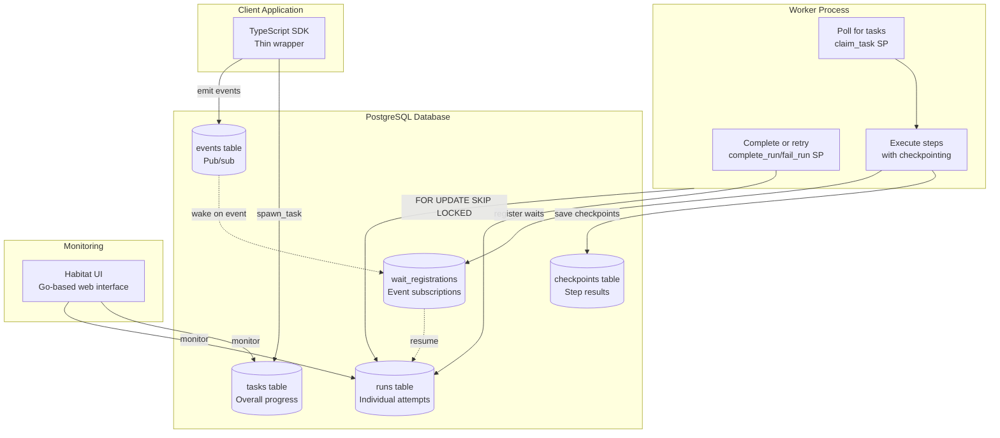

# Analysis: Absurd Orchestrator Architecture

**Date**: 2025-11-14
**Repository**: https://github.com/earendil-works/absurd
**Purpose**: Identify engineering patterns from absurd to improve Kruxia Flow
**Author**: Claude Sonnet 4.5

---

## Executive Summary

Absurd is a PostgreSQL-based durable execution workflow system with architectural similarities to Kruxia Flow. Both systems use PostgreSQL as the single source of truth, implement pull-based worker models, and avoid LISTEN/NOTIFY in favor of guaranteed delivery mechanisms. This analysis identifies 12 specific areas where absurd's engineering provides patterns we should evaluate for Kruxia Flow.

**Key Finding**: Absurd's strength lies in its sophisticated state management, automatic retry mechanisms with exponential backoff, event-driven suspension primitives, and database-centric design philosophy that moves complexity into stored procedures.

**Key Architectural Decisions**:
1. **NO step-based checkpointing** - Kruxia Flow's activity-based DAG model already provides equivalent durability guarantees, with superior composability and observability.
2. **NO database-centric business logic** - Kruxia Flow keeps orchestration logic in Rust services (not stored procedures) for horizontal scalability. Database CPU becomes a bottleneck when business logic runs in stored procedures; Rust services can scale horizontally by adding more instances.
3. **Limited use of stored procedures** - Only for hot-path atomic operations (claim_activity) where atomicity and performance matter, not for business logic.

---

## Absurd System Overview

### Core Architecture



### Design Philosophy

**Database-Centric Architecture**:
- Complexity lives in PostgreSQL stored procedures (not SDKs)
- Language-agnostic integration through database operations
- Single SQL file installation
- Thin SDKs in multiple languages (TypeScript, Go, Python)

**Durable Execution Model**:
- Tasks decompose into steps that act as checkpoints
- Step results cached in database to avoid re-execution
- Tasks survive crashes, restarts, network failures without duplicating work
- Event-driven suspension and resumption

---

## Detailed Engineering Analysis

### 1. Step-Based Checkpointing Within Tasks

**Absurd Implementation**:

```typescript
// SDK provides step() method for idempotent execution
const result = await ctx.step("fetch_user", async () => {
    return await database.query("SELECT * FROM users WHERE id = $1", [userId]);
});

// Step only executes once - result cached in checkpoints table
const enriched = await ctx.step("enrich_user", async () => {
    return await externalAPI.enrichProfile(result);
});

// On retry after crash, "fetch_user" loads from cache, "enrich_user" re-executes
```

**Database Schema**:
```sql
CREATE TABLE checkpoints (
    task_id UUID NOT NULL,
    checkpoint_name TEXT NOT NULL,
    owner_run_id UUID NOT NULL,      -- Which run created this checkpoint
    attempt INTEGER NOT NULL,          -- Which attempt number
    payload JSONB NOT NULL,
    created_at TIMESTAMPTZ NOT NULL,
    PRIMARY KEY (task_id, checkpoint_name)
);
```

**Key Features**:
- Automatic checkpoint name deduplication (`getCheckpointName()` appends counters like `step#2`)
- Ownership validation prevents checkpoint corruption across attempts
- JSONB payload stores arbitrary step results
- Checkpoint loading is O(1) lookup by `(task_id, checkpoint_name)`

**Kruxia Flow Current State**:
- Activities are atomic units (no internal checkpointing)
- Activity results stored in `workflows.state_data` after completion
- Workers must re-execute entire activity on failure/retry

**Kruxia Flow Decision: NOT RECOMMENDED**

Activity-level checkpointing is redundant in Kruxia Flow's architecture. The workflow graph already provides durable checkpointing through activity boundaries.

**Rationale**:
1. **Activities ARE checkpoints** - Each activity completion is a durable checkpoint
2. **Better composability** - Breaking work into multiple activities creates reusable components
3. **Superior observability** - DAG visualization shows progress naturally; checkpoints within activities are invisible
4. **Cleaner failure semantics** - Activity boundaries define retry scope
5. **No additional complexity** - Leverage existing orchestration instead of adding new mechanism

**Best Practice**:
If work needs checkpointing, split it into multiple activities with `depends_on`/`dependency_of` relationships:

```yaml
# Instead of checkpoints within one activity, use multiple activities:
activities:
  - key: download_data
    worker: data
    name: download
    dependency_of: [validate_data]

  - key: validate_data
    worker: data
    name: validate
    depends_on: [download_data]
    dependency_of: [transform_data]

  - key: transform_data
    worker: data
    name: transform
    depends_on: [validate_data]
    dependency_of: [upload_results]

  - key: upload_results
    worker: data
    name: upload
    depends_on: [transform_data]
```

This approach provides the same durability benefits without adding checkpoint infrastructure.

---

### 2. Event-Driven Suspension Primitives

**Absurd Implementation**:

```typescript
// Task can suspend execution waiting for external event
const approval = await ctx.awaitEvent("approval_received", {
    timeout: 3600  // Resume after 1 hour if no event
});

// Task can sleep until specific time
await ctx.sleepUntil(new Date("2025-12-01T00:00:00Z"));

// Task can sleep for duration
await ctx.sleepFor(300);  // 5 minutes
```

**Database Schema**:
```sql
CREATE TABLE wait_registrations (
    run_id UUID NOT NULL,
    event_name TEXT NOT NULL,
    timeout_at TIMESTAMPTZ,
    created_at TIMESTAMPTZ NOT NULL,
    PRIMARY KEY (run_id, event_name)
);

CREATE TABLE events (
    event_name TEXT PRIMARY KEY,
    payload JSONB NOT NULL,
    emitted_at TIMESTAMPTZ NOT NULL
);

-- When event emitted, wake all waiting runs
-- claim_task checks for matching events and removes wait registration
```

**Orchestration Pattern**:
```typescript
// External system emits event to wake suspended tasks
await absurd.emitEvent("approval_received", {
    approver: "manager@example.com",
    approved: true
});

// All tasks waiting for "approval_received" become claimable
```

**Kruxia Flow Current State**:
- ✅ **Database scheduling infrastructure exists**: `activity_queue.scheduled_for` column with index support
- ✅ **Worker polling respects scheduling**: Only claims activities where `scheduled_for <= NOW()`
- ❌ **Not exposed in workflow definition language**: YAML ActivitySettings doesn't have delay/schedule parameters
- ❌ **No external event suspension**: Activities either complete or fail (no waiting for external events)
- Workaround for delays: Poll in activity code with sleep loops (inefficient, ties up workers)

**Improvement Opportunity**:

Expose existing scheduling infrastructure in workflow definition language and add event-driven suspension:

```yaml
# Example 1: Wait for approval
- key: submit_for_approval
  worker: approvals
  name: submit_request
  outputs:
    - request_id

- key: wait_for_approval
  worker: built-in
  name: wait_for_event
  parameters:
    event_name: "approval_{{submit_for_approval.request_id}}"
    timeout_seconds: 3600
  dependency_of:
    - activity_key: process_approval

# Example 2: Schedule delayed execution (using existing infrastructure)
- key: send_reminder
  worker: notifications
  name: send_email
  parameters:
    recipient: "{{ARG.email}}"
  settings:
    delay_seconds: 3600              # NEW: Delay 1 hour before running
    # OR
    scheduled_at: "{{ARG.reminder_time}}"  # NEW: Absolute timestamp

# Example 3: Daily report (scheduled for specific time)
- key: generate_report
  worker: analytics
  name: daily_summary
  settings:
    scheduled_at: "2025-12-01T09:00:00Z"  # Run at 9am UTC
```

**Benefits**:
- Activities can wait for external systems without polling
- Efficient resource usage (no workers tied up sleeping)
- Better long-running workflow support (hours/days/weeks)
- Matches common patterns: approvals, human-in-the-loop, scheduled operations
- **Leverages existing database infrastructure** (no schema changes needed for basic scheduling)

**Implementation Path**:

**Phase 1: Expose Scheduling (Simple - No Schema Changes)**
1. ✅ Database infrastructure already exists (`activity_queue.scheduled_for`)
2. Update `ActivitySettings` struct to include `delay_seconds` and `scheduled_at` fields
3. Update orchestrator to use these settings when inserting into `activity_queue`:
   ```sql
   INSERT INTO activity_queue (..., scheduled_for)
   VALUES (..., NOW() + ($delay_seconds || ' seconds')::INTERVAL)
   ```
4. Update workflow definition validation to parse/validate scheduling parameters
5. Add example workflows demonstrating scheduled activities

**Phase 2: Event-Driven Suspension (Complex - Requires New Tables)**
1. Add `activity_waits` table tracking suspension state
2. Add `workflow_external_events` table for event pub/sub
3. Create built-in wait activities: `wait_for_event`, `sleep_until`, `sleep_for`
4. Modify orchestrator to schedule activities when events arrive
5. Add API endpoint: `POST /api/v1/workflows/{id}/events` for external event emission

**Recommendation**: Implement Phase 1 (scheduling) for MVP, defer Phase 2 (event suspension) to post-MVP.

---

### 3. Automatic Retry with Exponential Backoff

**Absurd Implementation**:

```typescript
// Task registration with retry configuration
absurd.registerTask("process_payment", async (params) => {
    // Task implementation
}, {
    maxAttempts: 5,
    retry: {
        type: "exponential",
        baseSeconds: 2,
        factor: 2,
        maxSeconds: 300  // Cap at 5 minutes
    },
    maxDelay: 600,      // Fail if task doesn't start within 10 minutes
    maxDuration: 1800   // Fail if task runs longer than 30 minutes
});
```

**Database Schema**:
```sql
CREATE TABLE tasks (
    id UUID PRIMARY KEY,
    name TEXT NOT NULL,
    max_attempts INTEGER NOT NULL,
    attempt INTEGER NOT NULL,           -- Current attempt number
    retry_config JSONB,                 -- {type, baseSeconds, factor, maxSeconds}
    cancellation_config JSONB,          -- {maxDelay, maxDuration}
    first_started_at TIMESTAMPTZ,
    ...
);

CREATE TABLE runs (
    id UUID PRIMARY KEY,
    task_id UUID NOT NULL,
    attempt INTEGER NOT NULL,
    available_at TIMESTAMPTZ NOT NULL,  -- When this run becomes claimable
    state TEXT NOT NULL,                -- pending, running, sleeping, completed, failed
    ...
);
```

**Retry Logic** (in `fail_run` stored procedure):

```sql
-- Check if max attempts reached
IF attempt >= max_attempts THEN
    -- Mark task as failed
    UPDATE tasks SET state = 'failed' WHERE id = task_id;
    RETURN;
END IF;

-- Calculate next retry time based on strategy
IF retry_config->>'type' = 'exponential' THEN
    delay := (retry_config->>'baseSeconds')::int
           * POWER((retry_config->>'factor')::float, attempt);
    delay := LEAST(delay, (retry_config->>'maxSeconds')::int);
ELSIF retry_config->>'type' = 'fixed' THEN
    delay := (retry_config->>'baseSeconds')::int;
END IF;

-- Create new run for next attempt
INSERT INTO runs (task_id, attempt, available_at, state)
VALUES (task_id, attempt + 1, NOW() + delay * INTERVAL '1 second', 'pending');
```

**Cancellation Enforcement**:

```sql
-- Check if task exceeded maxDelay (never started on time)
IF cancellation_config->>'maxDelay' IS NOT NULL THEN
    IF first_started_at IS NULL AND
       NOW() - created_at > (cancellation_config->>'maxDelay')::int * INTERVAL '1 second' THEN
        UPDATE tasks SET state = 'cancelled' WHERE id = task_id;
        RAISE EXCEPTION 'Task exceeded maxDelay' USING ERRCODE = 'AB001';
    END IF;
END IF;

-- Check if task exceeded maxDuration (running too long)
IF cancellation_config->>'maxDuration' IS NOT NULL THEN
    IF first_started_at IS NOT NULL AND
       NOW() - first_started_at > (cancellation_config->>'maxDuration')::int * INTERVAL '1 second' THEN
        UPDATE tasks SET state = 'cancelled' WHERE id = task_id;
        RAISE EXCEPTION 'Task exceeded maxDuration' USING ERRCODE = 'AB001';
    END IF;
END IF;
```

**Kruxia Flow Current State**:
- Activity settings in YAML support `timeout` configuration
- No exponential backoff strategy yet
- No max_attempts or retry configuration in activity definitions
- **Architecture Note**: Kruxia Flow retry logic belongs in the **orchestrator**, not activity_queue or workers
  - Orchestrator consumes `ActivityFailed` events from `workflow_events`
  - Orchestrator checks retry settings from workflow definition
  - Orchestrator decides: retry or fail workflow
  - Orchestrator publishes new `ActivityScheduled` event with backoff delay
  - activity_queue just stores scheduled activities (no retry logic)
  - Workers execute and report results (no retry logic)

**Kruxia Flow Design Decision**:

Retry is **orchestration logic** (orchestrator + workflow state), not **queue logic** (activity_queue) or **worker logic**. This differs from absurd's approach.

**Kruxia Flow Implementation**:

**Added to MVP** as US-3.5 (Activity Settings - Retry, Timeout, Budget):
- YAML configuration: `retry.max_attempts`, `retry.strategy` (exponential/fixed), `retry.base_seconds`, `retry.factor`, `retry.max_seconds`
- Orchestrator consumes `ActivityFailed` events and decides retry vs permanent failure
- Retry state tracked in `workflows.state_data` JSONB
- Attempt history captured in `workflow_events` (immutable event log)
- Backoff calculation: `base_seconds * factor^(attempt-1)` capped at `max_seconds`
- NO changes to activity_queue (it just stores scheduled activities)
- NO retry logic in workers (they execute and report results)

**Key Architectural Difference from Absurd**:
- **Absurd**: Retry logic in database stored procedures (queue-centric)
- **Kruxia Flow**: Retry logic in orchestrator event handlers (orchestration-centric)
- **Rationale**: Kruxia Flow's event-driven architecture makes orchestrator the natural home for retry decisions
  - Orchestrator already evaluates workflow state and makes scheduling decisions
  - Retry is workflow orchestration logic, not queue management logic
  - Keeps activity_queue simple (just scheduled activities, no state machine)
  - Keeps workers simple (execute and report, no retry logic)
  - Enables horizontal scalability (scale orchestrator instances, not database)

**Implementation Reference**: See `docs/mvp-requirements.md` US-3.5 and `docs/implementation/mvp-workflows-implementation-plan.md` Example 4

---

### 4. Separation of Task Attempts from Task State

**Absurd Pattern**:

```sql
-- tasks table: Overall task metadata and final state
CREATE TABLE t_default (
    id UUID PRIMARY KEY,
    name TEXT NOT NULL,
    state TEXT NOT NULL,        -- pending, running, sleeping, completed, failed, cancelled
    attempt INTEGER NOT NULL,
    max_attempts INTEGER NOT NULL,
    first_started_at TIMESTAMPTZ,
    completed_at TIMESTAMPTZ,
    ...
);

-- runs table: Individual execution attempts
CREATE TABLE r_default (
    id UUID PRIMARY KEY,
    task_id UUID NOT NULL REFERENCES t_default(id),
    attempt INTEGER NOT NULL,
    state TEXT NOT NULL,        -- pending, running, sleeping, completed, failed
    available_at TIMESTAMPTZ NOT NULL,
    claimed_at TIMESTAMPTZ,
    claimed_by TEXT,
    completed_at TIMESTAMPTZ,
    UNIQUE(task_id, attempt)
);
```

**Benefits of Separation**:

1. **Attempt History Preservation**: Each run is immutable record of that attempt
2. **Concurrent Retry Logic**: Can inspect past runs while scheduling new ones
3. **Better Observability**: Query all attempts for a task, calculate mean time to success
4. **Clean State Transitions**: Task state reflects overall status, run state reflects current attempt
5. **Simplified Queries**:
   - "Show me all failed attempts for task X" → `SELECT * FROM runs WHERE task_id = X AND state = 'failed'`
   - "Show me average retry count" → `SELECT AVG(attempt) FROM tasks WHERE state = 'completed'`

**Kruxia Flow Current State**:
- Single `activity_queue` table stores currently scheduled activities
- **Attempt history tracked differently**: `workflow_events` table serves as immutable event log
  - Each `ActivityFailed` event captures attempt number and failure reason
  - Each `ActivityScheduled` event captures retry scheduling
  - Event stream provides complete audit trail
- **Retry state tracked in workflow state**: `workflows.state_data` JSONB stores current attempt count
- **Orchestrator-centric**: Orchestrator consumes events to make retry decisions

**Kruxia Flow Design Decision**:

Kruxia Flow does NOT need separate activity/activity_executions tables because:
1. **workflow_events provides attempt history** - immutable event log with full details
2. **Workflow state tracks current attempt** - stored in `workflows.state_data` JSONB
3. **activity_queue is ephemeral** - just scheduled activities, deleted after completion
4. **Event sourcing pattern** - reconstruct attempt history by querying workflow_events

**Alternative Implementation** (if separate table desired):

If attempt history queries become performance-critical, could add separate table:

```sql
-- activities table: Overall activity lifecycle
CREATE TABLE activities (
    id UUID PRIMARY KEY,
    workflow_id UUID NOT NULL REFERENCES workflows(id),
    activity_key TEXT NOT NULL,
    worker TEXT NOT NULL,
    name TEXT NOT NULL,
    parameters JSONB NOT NULL,
    settings JSONB,
    retry_config JSONB NOT NULL,
    state TEXT NOT NULL,                  -- pending, running, sleeping, completed, failed, cancelled
    attempt INTEGER NOT NULL DEFAULT 1,
    max_attempts INTEGER NOT NULL,
    outputs JSONB,
    first_started_at TIMESTAMPTZ,
    completed_at TIMESTAMPTZ,
    failed_at TIMESTAMPTZ,
    created_at TIMESTAMPTZ NOT NULL,
    UNIQUE(workflow_id, activity_key)
);

-- activity_executions table: Individual execution attempts
CREATE TABLE activity_executions (
    id UUID PRIMARY KEY,
    activity_id UUID NOT NULL REFERENCES activities(id),
    attempt INTEGER NOT NULL,
    state TEXT NOT NULL,                  -- pending, running, completed, failed, cancelled
    available_at TIMESTAMPTZ NOT NULL,    -- When this execution becomes claimable
    claimed_by UUID,
    claimed_at TIMESTAMPTZ,
    heartbeat_at TIMESTAMPTZ,
    completed_at TIMESTAMPTZ,
    failed_at TIMESTAMPTZ,
    failure_reason TEXT,
    duration_ms INTEGER,
    UNIQUE(activity_id, attempt)
);

-- Indexes for efficient polling
CREATE INDEX idx_executions_claimable
ON activity_executions(worker, name, available_at)
WHERE state = 'pending' AND available_at <= NOW();
```

**But this is NOT RECOMMENDED for Kruxia Flow** - use workflow_events instead.

**Kruxia Flow Queries** (using workflow_events):

```sql
-- Debugging: Show all attempts for failing activity (from event stream)
SELECT
    event_type,
    payload->>'attempt' as attempt,
    payload->>'error' as failure_reason,
    timestamp,
    timestamp - LAG(timestamp) OVER (ORDER BY timestamp) as duration
FROM workflow_events
WHERE workflow_id = $1
  AND activity_key = $2
  AND event_type IN ('ActivityScheduled', 'ActivityStarted', 'ActivityFailed', 'ActivityCompleted')
ORDER BY timestamp;

-- Analytics: Average retries before success (from workflow state)
SELECT AVG((state_data->'activities'->activity_key->>'attempt')::int) as avg_retries
FROM workflows
WHERE status = 'Completed'
  AND state_data->'activities'->activity_key->>'attempt' IS NOT NULL;

-- Worker polls for next activity (simple - no join needed)
SELECT id, workflow_id, activity_key, parameters, settings
FROM activity_queue
WHERE status = 'pending'
  AND scheduled_for <= NOW()
  AND worker = $1
ORDER BY scheduled_for
LIMIT 1
FOR UPDATE SKIP LOCKED;
```

**Benefits of Kruxia Flow's Approach**:
- **Event sourcing provides complete history** - workflow_events is append-only audit log
- **Simpler schema** - fewer tables, less complexity
- **Consistent with architecture** - orchestrator-centric, event-driven
- **No data duplication** - attempt history in events, current state in workflow state
- **Standard pattern** - event sourcing is well-understood pattern

**Trade-off**:
- Event stream queries slower than dedicated table (acceptable for debugging, not hot path)
- If attempt history queries become performance-critical, can add materialized view or separate table

---

### 5. Cleanup Strategy with TTL

**Absurd Implementation**:

```sql
CREATE OR REPLACE FUNCTION cleanup_tasks(
    p_queue_name TEXT,
    p_ttl_seconds INTEGER,
    p_batch_size INTEGER DEFAULT 1000
) RETURNS INTEGER AS $$
DECLARE
    v_deleted INTEGER := 0;
    v_task_ids UUID[];
BEGIN
    -- Find tasks to delete (completed/failed older than TTL)
    SELECT ARRAY_AGG(id) INTO v_task_ids
    FROM t_${queue_name}
    WHERE state IN ('completed', 'failed', 'cancelled')
      AND (completed_at < NOW() - (p_ttl_seconds || ' seconds')::INTERVAL
           OR failed_at < NOW() - (p_ttl_seconds || ' seconds')::INTERVAL)
    LIMIT p_batch_size;

    -- Delete in dependency order (prevent foreign key violations)
    DELETE FROM wait_registrations WHERE run_id IN (
        SELECT id FROM runs WHERE task_id = ANY(v_task_ids)
    );

    DELETE FROM checkpoints WHERE task_id = ANY(v_task_ids);

    DELETE FROM runs WHERE task_id = ANY(v_task_ids);

    DELETE FROM tasks WHERE id = ANY(v_task_ids);

    GET DIAGNOSTICS v_deleted = ROW_COUNT;
    RETURN v_deleted;
END;
$$ LANGUAGE plpgsql;

-- Run cleanup periodically (cron job or background worker)
SELECT cleanup_tasks('default', 86400);  -- Delete completed tasks older than 24 hours
```

**Benefits**:
- Prevents unbounded database growth
- Configurable retention per queue
- Batch deletion prevents long transactions
- Respects foreign key dependencies
- Can run during off-peak hours

**Kruxia Flow Design Decision**:

**DO NOT clean up `workflow_events`** - this table must be retained indefinitely for auditability and compliance. Event history provides complete audit trail of all workflow executions.

**Tables eligible for cleanup:**
- ✅ `workflows` table - completed/failed workflows after retention period
- ✅ `activity_queue` table - completed activities after retention period
- ❌ `workflow_events` table - **NEVER delete** (audit trail, compliance)

**Kruxia Flow Implementation**:

**Added to MVP** as US-3.8 (Database Cleanup with TTL):
- Background tokio cleanup worker runs on configurable interval
- Stored procedures: `cleanup_workflows()`, `cleanup_expired_artifacts()`
- Configuration via environment variables (TTL days, interval, batch size)
- Batch deletion to prevent long transactions
- Respects foreign key dependencies (delete in correct order)
- Observability: Cleanup metrics and logging
- **Critical**: workflow_events NEVER cleaned up (audit trail requirement)

**Key Difference from Absurd**:
- **Absurd**: Cleans up all tables including event history
- **Kruxia Flow**: Preserves workflow_events indefinitely (auditability requirement)
- **Trade-off**: workflow_events grows unbounded → use table partitioning (post-MVP)

**Implementation Reference**: See `docs/mvp-requirements.md` US-3.8 and `docs/implementation/mvp-workflows-implementation-plan.md` Infrastructure section

**Kruxia Flow Cleanup Strategy Summary**:

| Table             | Cleanup Strategy                          | Retention    |
|-------------------|-------------------------------------------|--------------|
| workflows         | ✅ Delete after TTL (default: 7 days)     | Configurable |
| activity_queue    | ✅ Delete after completion/TTL            | Configurable |
| workflow_artifacts| ✅ Delete after expiry or workflow cleanup| Configurable |
| workflow_events   | ❌ **NEVER delete** (audit trail)         | Forever      |

**Post-MVP Optimization**: See `docs/post-mvp.md` Story 2.3 for detailed workflow_events partitioning strategy:
- Monthly partitions for efficient queries
- Automated partition management (create 3 months ahead)
- Optional archival to cold storage (partitions >1 year)
- Preserves complete audit trail while maintaining query performance

---

### 6. Database-Centric Complexity

**Absurd Philosophy**: "Move complexity into stored procedures, keep SDKs thin"

**Stored Procedures in Absurd**:

1. `spawn_task` - Create task and initial run atomically
2. `claim_task` - Find and claim next available run with FOR UPDATE SKIP LOCKED
3. `complete_run` - Mark run/task as completed, cleanup waits
4. `fail_run` - Calculate retry, create next run, handle cancellation
5. `schedule_run` - Transition to sleeping state with wake_at
6. `cancel_task` - Cancel task and all pending runs
7. `save_checkpoint` - Store checkpoint with ownership validation
8. `load_checkpoint` - Retrieve checkpoint for current run
9. `register_wait` - Register event wait with optional timeout
10. `emit_event` - Publish event, wake waiting runs
11. `cleanup_tasks` - Delete old tasks with TTL
12. `cleanup_events` - Delete old events with TTL

**Benefits**:

1. **Language Agnostic**: Any language that speaks SQL can use absurd
2. **Single Source of Truth**: Business logic in database, not scattered across SDKs
3. **Performance**: Stored procedures are parsed once, execute efficiently
4. **Transactional**: Complex multi-table operations are atomic
5. **Testable**: Can test stored procedures directly with SQL
6. **Maintainable**: Fix bug in one place, all SDKs benefit

**Kruxia Flow Current State**:
- Most queries written inline in Rust code
- Some hot-path queries as stored procedures (claim_activity, schedule_activity)
- Business logic primarily in Rust services (orchestrator, API server, workers)

**Kruxia Flow Architectural Decision: Application Logic in Rust, Not SQL**

Kruxia Flow deliberately chose **NOT** to follow absurd's database-centric approach. Business logic stays in Rust services, not stored procedures.

**Rationale**:
1. **Horizontal scalability** - Database-centric architecture becomes bottleneck when scaling
   - Stored procedures run on database CPU (single point of scaling)
   - Rust services can scale horizontally (add more orchestrator/worker instances)
   - Database should focus on data persistence, not business logic
2. **Type safety** - Rust's compile-time guarantees vs SQL runtime errors
3. **Testing** - Easier to unit test Rust code than stored procedures
4. **Debugging** - Better tooling (debuggers, profilers) for Rust than SQL
5. **Maintainability** - Rust codebases more familiar to modern developers than PL/pgSQL
6. **Observability** - Distributed tracing, metrics easier in application layer

**What Gets Stored Procedures** (Limited Scope):
- ✅ Hot-path atomic operations (claim_activity with FOR UPDATE SKIP LOCKED)
- ✅ Complex multi-table updates requiring atomicity
- ✅ Performance-critical queries (parsed once, cached plan)

**What Stays in Rust** (Business Logic):
- ✅ Retry logic and backoff calculation (orchestrator event handlers)
- ✅ Workflow state evaluation (orchestrator)
- ✅ DAG dependency resolution (orchestrator)
- ✅ Activity scheduling decisions (orchestrator)
- ✅ Event processing and routing (orchestrator)

**Key Architectural Difference from Absurd**:
- **Absurd**: "Database is the application" - business logic in stored procedures
- **Kruxia Flow**: "Database is storage" - business logic in Rust services
- **Trade-off**: Kruxia Flow sacrifices some language-agnosticism for better horizontal scalability

**Benefits of Kruxia Flow's Approach**:
- ✅ **Horizontal scalability** - Add more orchestrator/worker instances, not database CPUs
- ✅ **Type safety** - Rust compiler catches errors at compile time
- ✅ **Modern tooling** - Debuggers, profilers, IDEs work better with Rust than SQL
- ✅ **Team velocity** - Most developers more productive in Rust than PL/pgSQL
- ✅ **Observability** - Distributed tracing, metrics, logging easier in application layer

**When Kruxia Flow Uses Stored Procedures** (Limited Scope):
- ✅ Hot-path atomic operations (claim_activity with FOR UPDATE SKIP LOCKED)
- ✅ Batch inserts/updates for performance
- ✅ Complex multi-table updates requiring atomicity
- ✅ Cleanup operations (cleanup_workflows, cleanup_expired_artifacts)

**When Kruxia Flow Uses Rust** (Business Logic):
- ✅ Orchestration logic (retry, backoff, scheduling)
- ✅ State evaluation (DAG traversal, condition checking)
- ✅ Event handling (routing, transformation)
- ✅ API request handling (validation, authorization)

---

### 7. Transaction-Aware SDK Execution

**Absurd SDK Feature**:

Absurd allows tasks to bind to specific database connections for transactional execution, ensuring task spawning and other database operations are atomic within the same transaction.

**Use Case**: Ensure task spawning and database updates are atomic

**Kruxia Flow Design Decision**:

Transaction-aware SDKs not needed. Kruxia Flow's HTTP API boundary makes transaction-aware SDKs less relevant. Internal operations use transactions where needed.

**Kruxia Flow Implementation Status**:

**✅ Properly Transactional Operations:**
- Orchestrator event processing - entire event processing wrapped in transaction with advisory lock
- Workflow submission - workflow creation + event publishing in single transaction
- Activity failure handling - **FIXED** (was race condition)

**Transaction Audit Results:**

1. **Activity fail() method** - ✅ **FIXED**
   - **Issue found**: Used `SELECT FOR UPDATE` without explicit transaction, causing race condition
   - **Fix applied**: Wrapped entire method in explicit transaction (`tx.begin()` → queries → `tx.commit()`)
   - **Location**: `core/src/queue/postgres_queue.rs:386-492`
   - **Result**: FOR UPDATE lock now held throughout operation

2. **Orchestrator event processing** - ✅ Already correct
   - Entire event processing in single transaction with advisory lock
   - Prevents concurrent workflow evaluation

3. **Workflow submission** - ✅ Already correct
   - Workflow creation + event publishing atomic
   - Duplicate unique_key check in same transaction

4. **Activity completion + event publishing** - ⚠️ Acceptable trade-off
   - Separate operations, but orchestrator handles duplicates idempotently
   - Simpler implementation vs guaranteed event delivery

**Summary**: All critical operations now use transactions properly. The activity failure race condition was an implementation bug (not a missing feature) and has been fixed.

---

### 8. Timeout Detection with Heartbeats

**Absurd Implementation**:

Absurd provides SDK heartbeat methods that workers call periodically to extend timeout deadlines. Background processes detect and automatically fail expired executions.

**Kruxia Flow Current State**:
- Heartbeat endpoint exists: `POST /api/v1/activities/{id}/heartbeat`
- Workers can call explicitly to extend timeouts
- No automatic timeout detection or recovery

**Kruxia Flow Implementation** (Post-MVP):

**Added to post-MVP planning** as Story 5.8:
- Background timeout detector process (runs every 10 seconds)
- Automatically detects activities where `claimed_at + timeout < NOW()`
- Automatic failure + retry for timed-out activities
- Respects retry logic (max_retries, exponential backoff)
- Configurable timeout per activity via `settings.timeout_seconds`
- Metrics: Timeout detection count, recovery success rate

**Key Design Decisions**:
- Use existing heartbeat infrastructure (no schema changes)
- Background process checks for expired activities periodically
- Leverage existing retry mechanism (orchestrator handles retries)

**Implementation Reference**: See `docs/post-mvp.md` Story 5.8 for complete implementation including background worker and stored procedures

---

### 9. Idempotency Key Support

**Absurd Feature**:

Absurd allows task spawning with idempotency keys - duplicate calls with the same key are no-ops, preventing duplicate task execution from retries.

**Database Implementation**: Unique constraint on idempotency_key with ON CONFLICT DO NOTHING

**Use Case**: External systems can safely retry workflow creation without creating duplicates

**Kruxia Flow Implementation Status**:

**✅ FULLY IMPLEMENTED** - Kruxia Flow already has complete idempotency support via `unique_key`

**Implementation Details**:
- Database constraint: `workflows.unique_key TEXT UNIQUE` prevents duplicates
- API exposed: `POST /api/v1/workflows` accepts optional `unique_key` parameter
- Transaction-safe: Duplicate check + insert in single transaction
- Proper error handling: Returns `409 Conflict` on duplicate submission
- Validation: Empty keys rejected, 255 character limit
- OpenAPI documentation complete

**Benefits**:
- Safe retries for external systems
- Prevents duplicate workflow execution
- Standard pattern for distributed systems
- No client-side deduplication needed
- Race-condition safe (transaction-based)

---

### 10. Multiple Queue Support

**Absurd Pattern**:

```typescript
// Create queue for different workload types
await absurd.createQueue("high_priority");
await absurd.createQueue("low_priority");
await absurd.createQueue("batch_processing");

// Spawn task to specific queue
await absurd.spawnTask("process_payment", params, {
    queue: "high_priority"
});

// Workers poll specific queues
const highPriorityWorker = absurd.startWorker({
    queue: "high_priority",
    concurrency: 10
});

const batchWorker = absurd.startWorker({
    queue: "batch_processing",
    concurrency: 2
});
```

**Database Schema**:

```sql
-- Separate tables per queue (absurd's approach)
CREATE TABLE t_high_priority (...);
CREATE TABLE t_low_priority (...);
CREATE TABLE t_batch_processing (...);

-- OR: Single table with queue column (alternative)
CREATE TABLE tasks (
    ...
    queue_name TEXT NOT NULL,
    ...
);

CREATE INDEX idx_tasks_queue ON tasks(queue_name, available_at);
```

**Benefits**:
- Workload isolation (high-priority not blocked by batch jobs)
- Different worker pools with different concurrency
- SLA differentiation (high-priority gets more workers)
- Resource allocation control

**Kruxia Flow Current State**:
- Single global activity queue
- No priority/queue separation
- Workers filter by (worker, name) only
- Activities processed in FIFO order (by `scheduled_for`)
- High-priority workflows can be blocked by batch jobs

**Kruxia Flow Design Decision**:

Kruxia Flow will use **single-table priority queues** (not absurd's multiple queue tables). This is simpler and more flexible than creating separate tables per queue.

**Kruxia Flow Implementation** (Post-MVP):

**Added to post-MVP planning** as Story 2.5:
- Add `priority` column to activity_queue table
- Integer priority: 1 (highest) to 9 (lowest), default 5 (normal)
- Index on (worker, name, priority DESC, scheduled_for ASC)
- Update claim_next() to order by priority first, then scheduled_for
- Starvation prevention: Age-based priority boost after threshold (10 minutes)
- YAML configuration: `settings.priority` per activity
- Metrics: Queue depth by priority level

**Key Design Decisions**:
- Single table with priority column (not separate queue tables)
- Starvation prevention ensures low-priority activities don't wait indefinitely
- Simple integer priority scale (1-9) easy to understand

**Implementation Reference**: See `docs/post-mvp.md` Story 2.5 for complete implementation details

---

### 11. Cancellation Support

**Absurd Feature**:

```typescript
// External system can cancel running task
await absurd.cancelTask(taskId);

// Task execution detects cancellation
const task = await absurd.registerTask("long_task", async (ctx, params) => {
    for (let i = 0; i < 100; i++) {
        // Check if cancelled
        if (ctx.isCancelled()) {
            throw new CancelledError("Task was cancelled");
        }

        await processChunk(i);
    }
});
```

**Database Implementation**:

```sql
-- Task can be cancelled
UPDATE tasks SET state = 'cancelled' WHERE id = $1;

-- claim_task checks cancellation before claiming
IF task.state = 'cancelled' THEN
    RAISE EXCEPTION 'Task was cancelled' USING ERRCODE = 'AB001';
END IF;
```

**Kruxia Flow Current State**:
- No cancellation support yet
- Workflows run to completion or fail
- No way to abort running workflow

**Kruxia Flow Design Decision**:

Kruxia Flow uses **heartbeat mechanism** for cancellation detection instead of absurd's explicit `ctx.isCancelled()` checks. This is simpler and sufficient for the use case.

**Rationale**:
1. Heartbeat infrastructure already exists for timeout detection
2. Simpler worker SDKs (no cancellation context needed)
3. Cancellation latency = heartbeat interval (30s) is acceptable
4. Short-running activities complete before cancellation matters
5. Long-running activities already send heartbeats

**Kruxia Flow Implementation** (Post-MVP):

**Added to post-MVP planning** as Story 6.6:
- API endpoint: `POST /api/v1/workflows/{id}/cancel`
- Graceful cancellation (let running activities finish)
- Forced cancellation (immediate termination)
- Heartbeat endpoint returns error when workflow cancelled
- Long-running activities detect cancellation via heartbeat failure
- Short-running activities complete before cancellation matters
- No explicit `ctx.isCancelled()` checks needed in activities

**Key Design Decisions**:
- Use existing heartbeat mechanism instead of explicit cancellation checks
- Cancellation latency = heartbeat interval (30s typical) is acceptable trade-off for simpler implementation
- Workers detect cancellation when heartbeat fails (simpler SDK)

**Implementation Reference**: See `docs/post-mvp.md` Story 6.6 for complete implementation details including graceful vs forced modes

---

### 12. Duplicate Step Name Handling

**Absurd Pattern**:

```typescript
// Calling step() multiple times with same name is automatically handled
const task = await absurd.registerTask("process_batch", async (ctx, params) => {
    for (const item of params.items) {
        // Each iteration creates unique checkpoint: "process_item", "process_item#2", etc.
        const result = await ctx.step("process_item", async () => {
            return await processItem(item);
        });
    }
});
```

**Implementation**:

```typescript
// SDK tracks step call counts and appends counter
function getCheckpointName(baseName: string): string {
    if (!stepCallCounts.has(baseName)) {
        stepCallCounts.set(baseName, 1);
        return baseName;
    }

    const count = stepCallCounts.get(baseName) + 1;
    stepCallCounts.set(baseName, count);
    return `${baseName}#${count}`;
}
```

**Kruxia Flow Decision: NOT APPLICABLE**

Since Kruxia Flow does not implement activity-level checkpointing (see Section 1), this pattern is not relevant. Batch processing should use dynamic activity generation in the workflow graph instead.

---

## Summary of Recommendations

### High Priority (MVP Impact)

- **~~Fix Activity Failure Transaction Race Condition (Section 7)~~** - ✅ **COMPLETED**
  - ~~`postgres_queue.rs::fail()` uses SELECT FOR UPDATE without explicit transaction~~
  - ~~Race condition between lock release and UPDATE~~
  - ~~**Fix**: Wrap entire fail() method in explicit transaction~~
  - **Status**: Fixed in `core/src/queue/postgres_queue.rs:386-492`
  - Changes: Added explicit `tx.begin()` / `tx.commit()` around entire method
  - All queries now use transaction (`&mut *tx`) to hold FOR UPDATE lock
- **Automatic Retry with Exponential Backoff (Section 3)** - Essential for production reliability
  - **Kruxia Flow approach**: Implement in orchestrator event handlers, not database stored procedures
  - Retry state tracked in workflow state (workflows.state_data)
  - Attempt history captured in workflow_events
- **Cleanup Strategy with TTL (Section 5)** - Prevent unbounded database growth
- **Activity Scheduling - Phase 1 (Section 2)** - Expose existing `scheduled_for` infrastructure in workflow YAML (no schema changes)

### Medium Priority (Post-MVP Features)

- **Activity Timeout Detection and Auto-Recovery (Section 8)** - Prevent hung workflows from worker crashes
  - **Added to post-MVP planning**: `docs/post-mvp.md` Epic 5, Story 5.8
  - Background process to detect timed-out activities
  - Automatic failure + retry for expired activities
  - Leverages existing heartbeat infrastructure
- **Priority Queues (Section 10)** - SLA differentiation for different workload types
  - **Added to post-MVP planning**: `docs/post-mvp.md` Epic 2, Story 2.5
  - Single-table approach with priority column (not separate tables)
  - Integer priority: 1 (highest) to 9 (lowest), default 5
  - Starvation prevention with age-based boost
  - YAML configuration per activity
- **Workflow Cancellation (Section 11)** - User-initiated workflow abortion
  - **Added to post-MVP planning**: `docs/post-mvp.md` Epic 6, Story 6.6
  - Uses heartbeat mechanism for cancellation detection (not explicit checks)
  - Graceful vs forced cancellation modes
  - API endpoint: POST /api/v1/workflows/{id}/cancel
- **Event-Driven Suspension - Phase 2 (Section 2)** - Enable long-running workflows with external event waits (requires new tables)

### Low Priority (Nice to Have / Not Applicable)

- **Transaction-Aware SDK (Section 7)** - Not needed for Kruxia Flow (HTTP API boundary, internal ops already use transactions)

### Already Implemented ✅

- **Idempotency Key Support (Section 9)** - Kruxia Flow has full idempotency via `unique_key`
  - ✅ Database constraint: `workflows.unique_key TEXT UNIQUE`
  - ✅ API exposed: `POST /api/v1/workflows` accepts optional `unique_key`
  - ✅ Transaction-safe: Check + Insert in single transaction
  - ✅ Proper error handling: Returns `409 Conflict` on duplicate
  - ✅ Validation: Empty keys rejected, 255 char limit
  - ✅ OpenAPI documentation complete

### Not Recommended for Kruxia Flow

- **Step-Based Checkpointing (Section 1)** - Redundant with activity-based DAG model
- **Duplicate Checkpoint Names (Section 12)** - Not applicable without checkpointing
- **Separate Activity Attempts Table (Section 4)** - workflow_events provides attempt history
  - Kruxia Flow uses event sourcing pattern instead
  - Retry state in workflow state, attempt history in workflow_events
  - Simpler schema, consistent with orchestrator-centric architecture
- **Database-Centric Business Logic (Section 6)** - Business logic belongs in Rust services
  - Absurd puts orchestration logic in stored procedures (database-centric)
  - Kruxia Flow keeps orchestration logic in Rust (application-centric)
  - **Rationale**: Horizontal scalability - scale Rust services, not database CPUs
  - **Limited use**: Stored procedures only for hot-path atomic operations (claim_activity)
  - **Better for**: Type safety, testing, debugging, observability, team velocity

---

## Architectural Differences

### Absurd: Task-Centric Model

- **Unit of work**: Task (long-lived, hours/days)
- **Subdivision**: Steps within tasks (checkpoints)
- **Retry scope**: Entire task retries, steps skip via checkpoints
- **Worker model**: Workers execute task functions (code deployment)
- **Best for**: Long-running, event-driven processes with human-in-the-loop

### Kruxia Flow: Activity-Centric Model

- **Unit of work**: Activity (shorter-lived, seconds/minutes)
- **Subdivision**: Workflows compose multiple activities
- **Retry scope**: Individual activities retry
- **Worker model**: Workers execute activities (service calls)
- **Best for**: Orchestration of microservices, AI pipelines, ETL

**Key Insight**: These are different abstraction levels. Absurd's "task" ≈ Kruxia Flow's "workflow", Absurd's "step" ≈ Kruxia Flow's "activity". Kruxia Flow's activity-based DAG model already provides the same durability guarantees as absurd's checkpointing, just at a different granularity. Users needing finer-grained checkpointing should decompose work into smaller activities rather than adding checkpointing within activities.

---

## Implementation Roadmap

### Phase 1: Core Reliability (Sprint 1-2)

- [ ] Automatic retry with exponential backoff
- [ ] Activity attempts separation (activities + activity_executions tables)
- [ ] Timeout detection with heartbeats
- [ ] Cleanup procedures with TTL
- [ ] **Activity scheduling (US-3.7)** - Expose `scheduled_for` in YAML (delay_seconds, scheduled_at)

### Phase 2: Database Optimization (Sprint 3)

- [ ] Migrate core operations to stored procedures
- [ ] Optimize hot path queries
- [ ] Add comprehensive indexes

### Phase 3: Advanced Features (Sprint 4-5)

- [ ] Idempotency key support
- [ ] Priority levels

### Phase 4: Operations (Sprint 6)

- [ ] Workflow cancellation API
- [ ] Enhanced monitoring and debugging
- [ ] Performance benchmarks vs absurd

### Post-MVP: Event-Driven Suspension (Future)

- [ ] Event-driven suspension primitives (wait_for_event, sleep_until)
- [ ] External event API endpoint
- [ ] Activity waits and workflow events tables

---

## Conclusion

Absurd provides excellent patterns for building production-grade durable execution systems on PostgreSQL. The key insights are:

1. **Explicit retry strategies**: Exponential backoff prevents thundering herd
2. **Event-driven workflows**: Suspension primitives enable long-lived processes
3. **Operational maturity**: Cleanup, timeouts, cancellation built-in
4. **Separation of concerns**: Clear boundaries between components
5. **PostgreSQL-centric**: Single dependency for MVP

### Key Architectural Differences: Absurd vs Kruxia Flow

**Absurd: Database-Centric (Queue-Based)**
- **Business logic in database** - Stored procedures for orchestration, retry, scheduling
- **Language agnostic** - Any language can use absurd via SQL interface
- **Database is the application** - PostgreSQL runs the business logic
- Retry logic in database stored procedures
- Task/run separation in database tables
- Queue manages state transitions
- Workers call stored procedures directly
- **Scaling limitation**: Database CPU becomes bottleneck

**Kruxia Flow: Application-Centric (Event-Driven)**
- **Business logic in Rust** - Services handle orchestration, retry, scheduling
- **Rust-first architecture** - Type safety, modern tooling, horizontal scalability
- **Database is storage** - PostgreSQL stores data, Rust runs business logic
- Retry logic in orchestrator event handlers
- Event sourcing via workflow_events table
- Orchestrator manages state transitions
- Workers report via API, orchestrator decides
- **Scaling advantage**: Add more Rust service instances horizontally

### Adoption Strategy for Kruxia Flow

**Adopt from Absurd**:
- ✅ Exponential backoff retry configuration (in YAML)
- ✅ Activity scheduling with delays (expose existing infrastructure)
- ✅ Cleanup strategies with TTL
- ✅ Timeout detection patterns

**Adapt for Kruxia Flow Architecture**:
- 🔄 Retry logic → orchestrator event handlers (not stored procedures) - **Rust, not SQL**
- 🔄 Attempt history → workflow_events (not separate table) - **Event sourcing**
- 🔄 State tracking → workflow state JSONB (not queue tables) - **Application state**
- 🔄 Orchestration logic → Rust services (not stored procedures) - **Horizontal scalability**

**Skip for Kruxia Flow**:
- ❌ Step-based checkpointing (use activity decomposition instead)
- ❌ Separate runs table (use event sourcing instead)
- ❌ Queue-based retry logic (use orchestrator instead)
- ❌ Database-centric business logic (use Rust services for horizontal scalability)

Kruxia Flow's application-centric, event-driven architecture provides the same reliability benefits as absurd's database-centric approach, with a key advantage: **horizontal scalability**. By keeping business logic in Rust services instead of stored procedures, Kruxia Flow can scale by adding more orchestrator and worker instances, rather than vertically scaling the database. This architectural choice aligns with modern distributed systems design and enables Kruxia Flow to handle higher throughput at lower cost.
