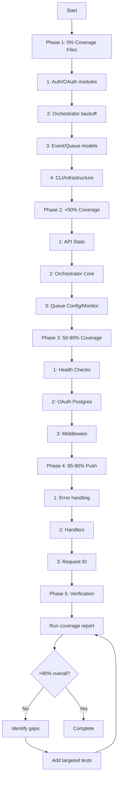

# Test Coverage Improvement Plan

**Goal**: Achieve >90% test coverage across all modules

**Current Overall Coverage**: 59.09% line coverage (816/1381 lines)

**Generated**: 2025-11-05

## Executive Summary

This plan addresses the test coverage gaps in the StreamFlow codebase, prioritizing critical untested components before improving existing coverage. The plan is organized into 5 phases that will incrementally increase coverage from ~59% to >90%.

## Phase 1: Critical Gaps - Files with 0% Coverage

These files have no test coverage and represent the highest priority.

### 1.1 Authentication & Authorization (Critical for Security)

**File**: `api/src/handlers/oauth.rs`
- **Current**: 0% (0/12 functions, 0/80 lines)
- **Priority**: CRITICAL - Security-sensitive code
- **Tests needed**:
  - OAuth token endpoint tests
  - Authorization code flow tests
  - Token validation tests
  - Error handling for invalid credentials
  - Error handling for expired tokens
  - Refresh token flow tests
- **Dependencies**: Requires oauth module functionality

**File**: `api/src/middleware/auth.rs`
- **Current**: 0% (0/9 functions, 0/46 lines)
- **Priority**: CRITICAL - Security-sensitive code
- **Tests needed**:
  - JWT token validation tests
  - Middleware authentication flow tests
  - Missing token handling
  - Invalid token handling
  - Expired token handling
  - Token extraction from headers

**File**: `oauth/src/lib.rs`
- **Current**: 0% (0/1 function, 0/9 lines)
- **Priority**: HIGH - Core authentication module
- **Tests needed**:
  - Public API function tests
  - Module initialization tests

### 1.2 Core Orchestration Components

**File**: `core/src/orchestrator/backoff.rs`
- **Current**: 0% (0/4 functions, 0/18 lines)
- **Priority**: HIGH - Critical for workflow reliability
- **Tests needed**:
  - Exponential backoff calculation tests
  - Min/max backoff boundary tests
  - Backoff reset tests
  - Jitter application tests

**File**: `core/src/events/models.rs`
- **Current**: 0% (0/2 functions, 0/17 lines)
- **Priority**: MEDIUM - Data models
- **Tests needed**:
  - Event serialization/deserialization tests
  - Event validation tests
  - Edge cases for event data

**File**: `core/src/queue/models.rs`
- **Current**: 0% (0/2 functions, 0/10 lines)
- **Priority**: MEDIUM - Data models
- **Tests needed**:
  - Activity task serialization/deserialization tests
  - Model validation tests
  - Edge cases for queue data

### 1.3 CLI & Application Entry Points

**File**: `streamflow/src/commands/api.rs`
- **Current**: 0% (0/5 functions, 0/55 lines)
- **Priority**: MEDIUM - CLI command
- **Tests needed**:
  - API server start command tests
  - Configuration parsing tests
  - Error handling for invalid config
  - Port binding validation

**File**: `streamflow/src/main.rs`
- **Current**: 0% (0/2 functions, 0/10 lines)
- **Priority**: LOW - Entry point (difficult to test)
- **Tests needed**:
  - Integration tests that verify main() flow
  - Command dispatch tests

**File**: `streamflow/src/logging.rs`
- **Current**: 0% (0/2 functions, 0/20 lines)
- **Priority**: MEDIUM - Infrastructure
- **Tests needed**:
  - Log level configuration tests
  - Log format tests
  - Log output destination tests

**File**: `streamflow/src/signals.rs`
- **Current**: 0% (0/4 functions, 0/14 lines)
- **Priority**: MEDIUM - Infrastructure
- **Tests needed**:
  - Signal handler registration tests
  - Graceful shutdown tests
  - Signal handling behavior tests

## Phase 2: Low Coverage - Files <50% Coverage

### 2.1 API State Management

**File**: `api/src/state.rs`
- **Current**: 44.74% (17/38 lines)
- **Target**: >90%
- **Gap**: 21 lines uncovered
- **Tests needed**:
  - AppState construction tests
  - State cloning tests
  - Service interface access tests
  - Error handling for missing services

### 2.2 Orchestrator Core

**File**: `core/src/orchestrator/orchestrator.rs`
- **Current**: 50.00% (55/110 lines)
- **Target**: >90%
- **Gap**: 55 lines uncovered
- **Tests needed**:
  - Workflow lifecycle management tests
  - Event processing tests
  - Activity scheduling tests
  - Error recovery tests
  - Concurrent workflow handling tests

**File**: `core/src/orchestrator/config.rs`
- **Current**: 47.06% (8/17 lines)
- **Target**: >90%
- **Gap**: 9 lines uncovered
- **Tests needed**:
  - Configuration validation tests
  - Default value tests
  - Environment variable parsing tests

### 2.3 Queue Infrastructure

**File**: `core/src/queue/config.rs`
- **Current**: 21.74% (10/46 lines)
- **Target**: >90%
- **Gap**: 36 lines uncovered
- **Tests needed**:
  - Queue configuration tests
  - Polling interval validation tests
  - Batch size validation tests
  - Timeout configuration tests

**File**: `core/src/queue/monitor.rs`
- **Current**: 18.39% (16/87 lines)
- **Target**: >90%
- **Gap**: 71 lines uncovered
- **Tests needed**:
  - Queue metrics collection tests
  - Monitor lifecycle tests
  - Metric reporting tests
  - Error handling in monitoring

## Phase 3: Middling Coverage - Files 50-90%

### 3.1 Health Checks

**File**: `api/src/health/checks.rs`
- **Current**: 68.57% (24/35 lines)
- **Target**: >90%
- **Gap**: 11 lines uncovered
- **Tests needed**:
  - Database health check edge cases
  - Timeout handling tests
  - Failure recovery tests

### 3.2 OAuth Implementation

**File**: `oauth/src/postgres.rs`
- **Current**: 71.93% (41/57 lines)
- **Target**: >90%
- **Gap**: 16 lines uncovered
- **Tests needed**:
  - Additional error path coverage
  - Edge cases for token operations
  - Concurrent token access tests

### 3.3 Middleware

**File**: `api/src/middleware/cors.rs`
- **Current**: 77.42% (24/31 lines)
- **Target**: >90%
- **Gap**: 7 lines uncovered
- **Tests needed**:
  - CORS preflight request tests
  - Origin validation tests
  - Header configuration tests

**File**: `api/src/routes.rs`
- **Current**: 83.78% (31/37 lines)
- **Target**: >90%
- **Gap**: 6 lines uncovered
- **Tests needed**:
  - Route registration edge cases
  - Middleware integration tests

## Phase 4: Near-Excellence - Files 85-90%

### 4.1 Push to >90%

**File**: `api/src/error.rs`
- **Current**: 89.60% (112/125 lines)
- **Target**: >90%
- **Gap**: 13 lines uncovered
- **Tests needed**:
  - Uncommon error variant tests
  - Error conversion edge cases

**File**: `api/src/handlers/health.rs`
- **Current**: 85.51% (59/69 lines)
- **Target**: >90%
- **Gap**: 10 lines uncovered
- **Tests needed**:
  - Additional health endpoint scenarios
  - Error response formatting tests

**File**: `api/src/middleware/request_id.rs`
- **Current**: 88.00% (22/25 lines)
- **Target**: >90%
- **Gap**: 3 lines uncovered
- **Tests needed**:
  - Request ID propagation edge cases
  - Header collision handling

## Phase 5: Verification & Integration

### 5.1 Overall Coverage Verification

**Tasks**:
1. Run full test suite with coverage
2. Verify >90% coverage for each module
3. Verify >90% overall coverage

### 5.2 Integration Test Enhancement

**Focus areas**:
- End-to-end workflow execution
- Multi-component interaction tests
- Failure scenario integration tests
- Performance regression tests

## Implementation Strategy

### Recommended Order

### Testing Approach by Component Type

**Security-critical code** (auth, oauth):
- Test all authentication flows
- Test all error paths
- Test boundary conditions
- Test concurrent access
- Test token expiration scenarios

**Orchestration logic** (orchestrator, dependency_evaluator):
- Test workflow state transitions
- Test DAG evaluation edge cases
- Test concurrent workflow handling
- Test error recovery and retry logic
- Test backoff strategies

**Infrastructure code** (queue, events, logging):
- Test initialization and shutdown
- Test configuration validation
- Test error handling
- Test resource cleanup

**HTTP handlers and middleware**:
- Test successful request paths
- Test error responses
- Test middleware chain execution
- Test edge cases (malformed requests, etc.)

**Data models**:
- Test serialization/deserialization
- Test validation logic
- Test edge cases and boundaries

## Success Criteria

- [ ] All files have >90% line coverage
- [ ] Overall codebase has >90% line coverage
- [ ] All security-critical code has >95% coverage
- [ ] All tests pass consistently
- [ ] No flaky tests introduced
- [ ] Test execution time remains reasonable (<5 minutes for full suite)

## Estimated Effort

| Phase | Files | Estimated Lines to Cover | Estimated Test Code | Effort (hours) |
|-------|-------|-------------------------|-------------------|----------------|
| Phase 1 | 10 | ~320 | ~1000 lines | 20-30 |
| Phase 2 | 5 | ~193 | ~600 lines | 15-20 |
| Phase 3 | 4 | ~40 | ~150 lines | 5-10 |
| Phase 4 | 3 | ~26 | ~100 lines | 3-5 |
| Phase 5 | - | Verification | ~50 lines | 2-4 |
| **Total** | **22** | **~579** | **~1900 lines** | **45-69 hours** |

## Notes

- Focus on security-critical code first (auth, oauth)
- Orchestrator code is complex - allocate extra time for thorough testing
- CLI/main.rs entry points may require integration test approach
- Some infrastructure code (signals, logging) may be tested indirectly
- Consider using test fixtures and helper functions to reduce test code duplication
- Monitor test execution time to ensure tests remain fast
